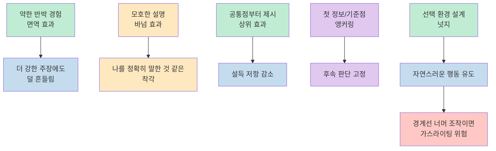
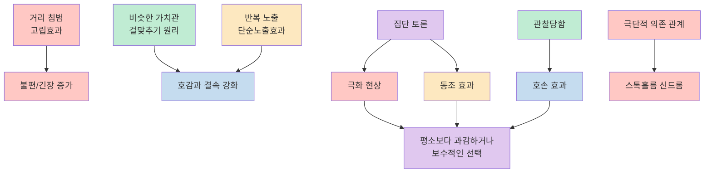
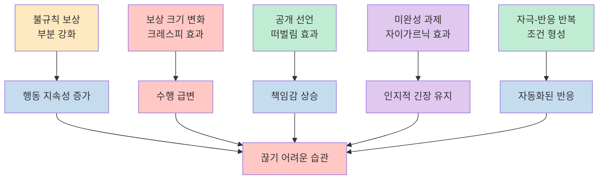
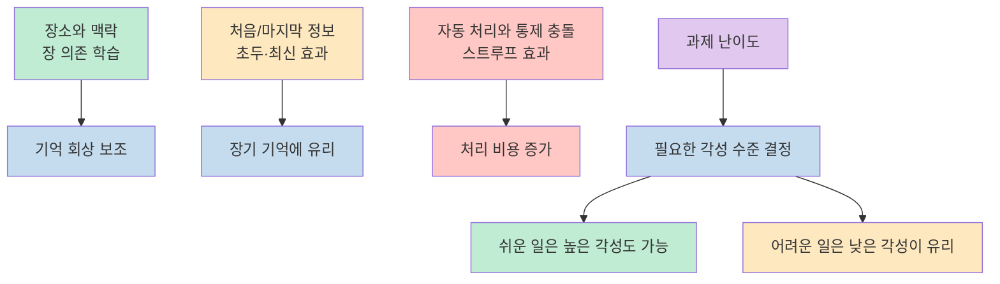
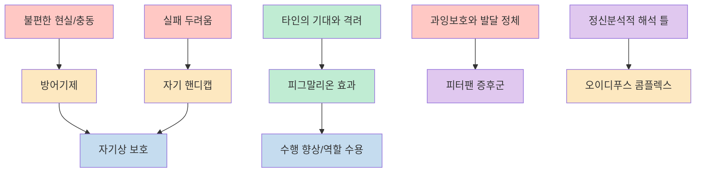
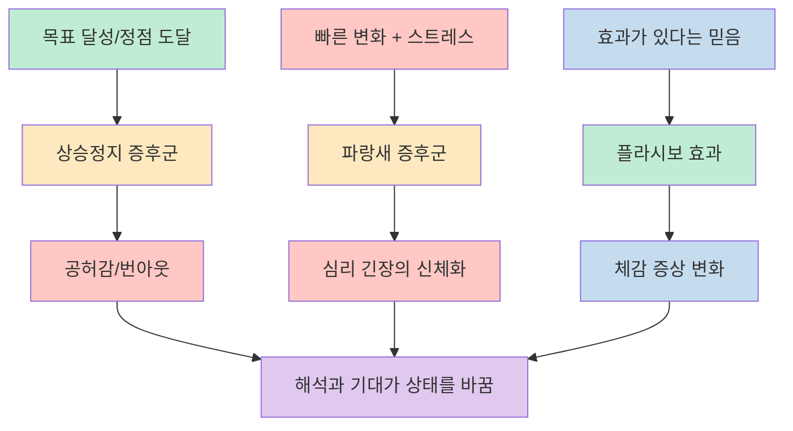

이 영상의 장점은 심리학 개념을 교과서식 정의로 길게 설명하기보다, 우리가 이미 겪고 있지만 이름을 붙이지 못했던 장면들에 빠르게 태그를 달아 준다는 데 있습니다. 설득에 흔들리는 순간, 집단 안에서 평소보다 과격해지는 판단, 끝나지 않은 일 때문에 머릿속이 계속 시끄러운 상태까지 모두 하나의 어휘 체계로 묶어 보여 줍니다. [(0:00)](https://youtu.be/soMXx25-PgI?t=0)

다만 원래 영상의 순서는 백과사전처럼 30개 항목을 차례로 나열하는 방식이라, 글에서는 이를 `설득과 판단`, `관계와 집단`, `보상과 습관`, `기억과 수행`, `자아 보호와 기대`, `증후군과 믿음`의 여섯 묶음으로 다시 정리해 보겠습니다. 이렇게 읽으면 각각의 용어를 따로 암기하기보다, 내 일상에서 어떤 상황에 어떤 심리 프레임을 붙일 수 있는지가 더 잘 보입니다. [(0:19)](https://youtu.be/soMXx25-PgI?t=19), [(21:36)](https://youtu.be/soMXx25-PgI?t=1296), [(22:14)](https://youtu.be/soMXx25-PgI?t=1334)

<!--more-->

## Sources

- [알면 도움되는 심리학 상식 30가지 - 심리학책 읽을 시간이 없는 사람을 위한 심리학강의 - YouTube](https://www.youtube.com/watch?v=soMXx25-PgI)

## 설득과 판단을 흔드는 심리

영상의 앞부분은 사람의 생각이 어떻게 바뀌고, 또 왜 쉽게 안 바뀌는지에 초점을 맞춥니다. `면역 효과`는 약한 반대 논리를 미리 접하고 반박해 본 사람일수록 이후 더 강한 설득 공격에도 덜 흔들린다는 설명이고, `상위 효과`는 상대의 태도와 너무 멀리 떨어진 주장보다 적당한 거리의 메시지가 더 잘 먹힌다는 설명입니다. 여기에 `바넘 효과`가 붙으면, 누구에게나 적용될 법한 모호한 말도 나만 정확히 꿰뚫는 설명처럼 느껴질 수 있다는 점이 드러납니다. 결국 설득은 논리의 절대량보다도 반박 경험, 거리 조절, 자기 관련성 착각이 함께 작동하는 과정으로 제시됩니다. [(0:19)](https://youtu.be/soMXx25-PgI?t=19), [(1:19)](https://youtu.be/soMXx25-PgI?t=79), [(6:54)](https://youtu.be/soMXx25-PgI?t=414)

영상은 여기에 `앵커링 효과`와 `넛지 효과`를 더해, 사람의 판단이 얼마나 쉽게 첫 프레임과 선택 환경에 끌려가는지도 보여 줍니다. 처음 들은 숫자나 관점이 기준점처럼 박히면 이후 정보가 들어와도 판단이 그 근처를 맴돌고, 반대로 강요 대신 선택 구조를 살짝 바꾸면 사람은 스스로 결정했다고 느끼면서도 실제 행동은 유도된 방향으로 움직일 수 있습니다. 광고, 투자, 조직 커뮤니케이션이 모두 "무엇을 말할까"만큼이나 "어떤 순서와 구조로 말할까"에 집착하는 이유가 여기에 있습니다. [(8:12)](https://youtu.be/soMXx25-PgI?t=492), [(12:00)](https://youtu.be/soMXx25-PgI?t=720)

가장 강한 경고로 등장하는 것은 `가스라이팅`입니다. 영상은 이를 단순한 말다툼이 아니라, 상대가 자기 현실 판단을 의심하도록 상황을 조작해 지배력을 키우는 행위로 설명합니다. 이 지점이 중요한 이유는 앞에서 나온 설득 기술들이 "선택을 부드럽게 밀어주는 수준"에 머무를 수도 있는 반면, 가스라이팅은 상대의 인지 기반 자체를 무너뜨리는 관계적 조작이라는 점을 선명하게 보여 주기 때문입니다. 설득의 심리를 안다는 것은 결국 더 잘 설득하는 법만이 아니라, 어디서부터가 조작인지 구분하는 감각을 갖는 일이기도 합니다. [(21:36)](https://youtu.be/soMXx25-PgI?t=1296)

## 관계, 거리, 집단 속에서 달라지는 사람

사람 사이의 호감과 불편은 생각보다 단순한 조건에서 출발합니다. 영상은 `고립효과`를 통해 가까운 공간에 지나치게 밀착할 때 긴장과 불편이 커질 수 있다고 말하고, `걸맞추기 원리`로는 태도와 가치관, 배경이 비슷한 사람끼리 더 잘 끌리는 경향을 설명합니다. 여기에 `단순노출효과`가 더해지면, 어떤 대상이 처음에는 낯설고 거슬리더라도 반복해서 접할수록 호감이 높아질 수 있다는 흐름이 완성됩니다. 결국 관계는 "좋은 사람을 만나느냐"의 문제만이 아니라 거리, 유사성, 반복 노출이라는 환경 변수에도 크게 좌우됩니다. [(1:51)](https://youtu.be/soMXx25-PgI?t=111), [(3:14)](https://youtu.be/soMXx25-PgI?t=194), [(4:12)](https://youtu.be/soMXx25-PgI?t=252)

집단이 등장하면 이야기는 더 복잡해집니다. `극화 현상`은 여러 사람이 함께 결정할 때 의견이 중간으로 수렴하기보다 오히려 더 극단으로 밀릴 수 있다는 점을 보여 주고, `동조효과`는 틀린 답이라는 걸 알아도 다수가 가리키는 쪽으로 따라가게 되는 인간의 취약함을 드러냅니다. 또 `호손 효과`는 누군가 지켜본다는 사실만으로도 행동과 수행이 달라질 수 있다는 고전적 설명 틀로 소개됩니다. 원래 연구 해석에는 이후 논쟁이 있었지만, 회사 회의, 온라인 여론, 공개 경쟁, 참관 수업 같은 장면이 왜 사람을 평소와 다르게 만드는지 읽는 데에는 여전히 유용한 렌즈로 기능합니다. [(4:42)](https://youtu.be/soMXx25-PgI?t=282), [(16:42)](https://youtu.be/soMXx25-PgI?t=1002), [(20:44)](https://youtu.be/soMXx25-PgI?t=1244)

영상이 소개하는 `스톡홀름 신드롬`은 더 극단적인 권력 비대칭의 사례입니다. 장기적 위협과 의존이 반복되는 상황에서 피해자가 가해자 쪽에 정서적으로 기울 수 있다는 설명인데, 오늘날에는 이 용어 자체의 타당성을 둘러싼 논쟁도 적지 않습니다. 그래서 이 개념은 엄밀한 진단명이라기보다, 힘의 불균형과 지속적 압박이 감정 판단을 왜곡할 수 있다는 문제를 설명하는 대중적 프레임으로 읽는 편이 안전합니다. 평범한 조직이나 연애 관계를 모두 이런 극단 사례에 곧바로 대입해서는 안 되지만, 최소한 관계를 개인의 성격만으로 읽어서는 놓치는 것이 많다는 문제의식은 분명하게 남습니다. [(9:07)](https://youtu.be/soMXx25-PgI?t=547)

## 보상, 습관, 중독을 만드는 강화의 구조

영상은 사람이 왜 어떤 행동을 멈추지 못하는지 설명할 때 `보상 설계`를 핵심으로 잡습니다. `부분 강화 효과`는 보상이 불규칙하게, 예측 불가능하게 주어질 때 오히려 행동이 더 오래 지속될 수 있음을 보여 주고, `크레스피 효과`는 보상의 크기가 커질 때와 줄어들 때 수행이 크게 흔들린다는 점을 설명합니다. 이 두 개념을 나란히 놓고 보면, 사람을 움직이는 힘은 보상이 있다는 사실 자체보다도 **언제**, **얼마나**, **어떤 변화폭으로** 주어지느냐에 달려 있다는 걸 알 수 있습니다. 도박, 게임, 인센티브 제도, 정치적 공약이 모두 이 논리를 이용합니다. [(2:29)](https://youtu.be/soMXx25-PgI?t=149), [(18:26)](https://youtu.be/soMXx25-PgI?t=1106)

여기에 `떠벌림 효과`, `자이가르닉 효과`, `조건 형성 학습`이 이어 붙습니다. 영상의 `떠벌림 효과`는 영어권 연구에서 흔히 `Public Commitment Effect`로 설명되는 공개 약속의 힘에 가깝습니다. 공개적으로 결심을 말하면 스스로 약속을 지키려는 압력이 생기고, 끝나지 않은 과제는 머릿속에서 계속 남아 불편함을 만들며, 특정 자극과 반응이 반복 결합되면 나중에는 자동 반응처럼 학습됩니다. 즉 어떤 행동을 계속하게 만드는 장치는 외부 보상 하나만이 아니라, 사회적 시선, 미완결의 긴장, 자극-반응 연결이라는 여러 회로가 동시에 맞물려 돌아갑니다. 습관이란 결국 의지의 산물이기보다 구조의 산물에 더 가깝다는 것이 이 구간의 핵심입니다. [(5:26)](https://youtu.be/soMXx25-PgI?t=326), [(13:12)](https://youtu.be/soMXx25-PgI?t=792), [(14:11)](https://youtu.be/soMXx25-PgI?t=851)

## 기억, 학습, 수행은 언제 더 잘 작동할까

공부와 일의 효율을 다루는 부분은 실전성이 높습니다. `장 의존 학습`은 기억이 추상적 저장고에만 있는 것이 아니라 장소와 맥락에 함께 묶여 있다는 점을 보여 주고, `초두효과/최신효과`는 가장 처음과 마지막에 접한 정보가 중간 정보보다 오래 남기 쉽다는 고전적 패턴을 상기시킵니다. 또 `스트루프 효과`는 자동화된 처리와 의식적 통제가 충돌할 때 뇌가 더 많은 시간과 노력을 써야 한다는 사실을 보여 줍니다. 그래서 "어디서 공부할 것인가", "어떤 순서로 분량을 쪼갤 것인가", "자동반응을 거슬러야 하는 과제인가"가 모두 학습 전략의 일부가 됩니다. [(7:37)](https://youtu.be/soMXx25-PgI?t=457), [(9:50)](https://youtu.be/soMXx25-PgI?t=590), [(15:09)](https://youtu.be/soMXx25-PgI?t=909)

이 흐름을 정리해 주는 개념이 `최적 각성 수준`입니다. 영상은 쉬운 일은 어느 정도 각성이 높은 환경에서도 잘 되지만, 복잡하고 머리를 많이 써야 하는 일은 오히려 조용하고 덜 자극적인 상태에서 더 효율적이라고 말합니다. 결국 생산성은 "무조건 긴장해야 오른다"가 아니라 과제 난이도와 각성 수준의 균형 문제입니다. 공부할 때는 스스로를 각성시키는 것만큼, 과제에 맞는 환경으로 각성을 낮추는 일도 중요하다는 뜻입니다. [(16:05)](https://youtu.be/soMXx25-PgI?t=965)

## 자아를 지키는 심리와 기대의 힘

영상은 사람이 스스로를 보호하는 방식도 여러 층위에서 설명합니다. `방어기제`는 자아가 불편한 진실이나 충동으로부터 자신을 지키기 위해 심리적 방벽을 세우는 방식이고, `자기 핸디캡 전략`은 실패했을 때 자존감을 덜 다치게 하려고 미리 핑곗거리를 만드는 행동입니다. 둘 다 핵심은 같습니다. 사람은 언제나 진실을 정면으로 보는 존재가 아니라, 자기상을 보존하기 위해 현실을 굴절시킬 수 있는 존재라는 점입니다. 그래서 누군가의 변명이나 회피를 볼 때도 단순히 의지 부족으로만 읽기보다, 손상된 자존감의 방어 전략으로 읽어 볼 필요가 있습니다. [(10:39)](https://youtu.be/soMXx25-PgI?t=639), [(12:37)](https://youtu.be/soMXx25-PgI?t=757)

반대로 타인의 기대가 사람을 끌어올리거나 붙잡아 두는 장면도 등장합니다. `피그말리온 효과`는 기대와 관심, 격려가 실제 수행 향상으로 이어질 수 있음을 보여 주고, `피터팬 증후군`은 과잉 보호와 발달 정체를 설명하는 대중적 심리 은유로 소개됩니다. 둘을 함께 보면, 인간은 혼자 자라는 존재가 아니라 주변의 기대 수준과 돌봄 방식에 따라 자신을 해석하는 존재라는 메시지가 분명해집니다. 누군가를 성장시키는 것도, 반대로 다음 단계로 못 넘어가게 붙들어 두는 것도 결국 관계 환경이 한다는 뜻입니다. [(19:26)](https://youtu.be/soMXx25-PgI?t=1166), [(20:14)](https://youtu.be/soMXx25-PgI?t=1214)

이 문맥에서 영상은 `오이디푸스 콤플렉스`도 프로이트 이론의 상징처럼 호출합니다. 오늘날 일상 심리 설명에서 바로 적용하기에는 무리가 있는 오래된 틀이지만, 영상 안에서는 "인간 발달을 설명하려 했던 정신분석적 상상력"이 어떤 방식으로 대중문화에 남았는지를 보여 주는 사례로 읽는 편이 더 적절합니다. 즉 이 항목은 지금 당장 생활 팁으로 쓰기보다, 심리학이 한때 어떤 방식으로 인간 욕망과 정체성을 해석했는지 보여 주는 역사적 표지판에 가깝습니다. [(11:06)](https://youtu.be/soMXx25-PgI?t=666)

## 목표, 번아웃, 증후군, 믿음의 효과

후반부에서 영상은 비교적 현대적인 언어로 마음의 소진과 적응 문제를 다룹니다. `상승정지 증후군`은 국제 표준 진단명이라기보다 정점 이후의 공허를 설명하려는 국내식 표현에 가깝고, `파랑새 증후군` 역시 현재를 살지 못하고 막연한 어딘가의 행복을 좇는 상태를 가리키는 사회적 은유에 더 가깝습니다. 그럼에도 두 표현이 묶어 주는 공통 문제는 선명합니다. 목표를 향해 달릴 때는 외부 성취가 엔진이 되지만, 그 목표가 사라지거나 환경 변화에 적응하지 못하면 오히려 허무와 긴장이 몸과 마음 전체를 장악할 수 있다는 점입니다. [(6:04)](https://youtu.be/soMXx25-PgI?t=364), [(18:58)](https://youtu.be/soMXx25-PgI?t=1138)

마지막 `가짜약 효과`, 즉 플라시보는 이 모든 흐름을 역설적으로 정리해 줍니다. 사람은 객관적 자극만으로 반응하는 존재가 아니라, "이것이 효과가 있다"는 믿음 자체로도 통증과 체감 상태가 달라질 수 있습니다. 앞에서 본 넛지, 바넘, 앵커링, 가스라이팅이 모두 의미와 해석의 프레임이 행동을 바꾸는 장면이었다면, 플라시보는 그 프레임이 아예 몸의 체감에도 영향을 줄 수 있음을 보여 주는 마무리 장치입니다. 결국 이 영상 전체는 인간을 이성적인 계산기보다 **해석하고 기대하고 반응하는 존재** 로 그려 냅니다. [(22:14)](https://youtu.be/soMXx25-PgI?t=1334)

## 핵심 요약

- 영상은 `면역 효과`, `바넘 효과`, `상위 효과`, `앵커링`, `넛지`, `가스라이팅`을 통해 사람이 논리만으로 설득되거나 흔들리는 것이 아니라 반박 경험, 프레이밍, 선택 구조, 관계적 조작에 의해 크게 좌우된다고 설명합니다. [(0:19)](https://youtu.be/soMXx25-PgI?t=19), [(6:54)](https://youtu.be/soMXx25-PgI?t=414), [(21:36)](https://youtu.be/soMXx25-PgI?t=1296)
- 관계와 집단 파트의 핵심은 `거리`, `유사성`, `반복 노출`, `집단 압력`, `관찰당함`이 호감과 판단을 바꾼다는 점입니다. 개인 성향만 보면 놓치는 부분을 `고립효과`, `걸맞추기 원리`, `극화 현상`, `동조효과`, `호손 효과`가 잡아 줍니다. [(1:51)](https://youtu.be/soMXx25-PgI?t=111), [(4:42)](https://youtu.be/soMXx25-PgI?t=282), [(20:44)](https://youtu.be/soMXx25-PgI?t=1244)
- 습관과 중독은 의지보다 구조의 문제로 그려집니다. `부분 강화`, `크레스피 효과`, `떠벌림 효과`, `자이가르닉 효과`, `조건 형성 학습`은 행동을 반복하게 만드는 보상과 긴장, 학습 연결고리를 보여 줍니다. [(2:29)](https://youtu.be/soMXx25-PgI?t=149), [(5:26)](https://youtu.be/soMXx25-PgI?t=326), [(18:26)](https://youtu.be/soMXx25-PgI?t=1106)
- 공부와 일의 효율은 `장 의존 학습`, `스트루프 효과`, `초두/최신 효과`, `최적 각성 수준`으로 묶을 수 있습니다. 기억은 맥락을 타고, 정보는 순서를 타며, 수행은 과제 난이도에 맞는 각성 수준을 탑니다. [(7:37)](https://youtu.be/soMXx25-PgI?t=457), [(9:50)](https://youtu.be/soMXx25-PgI?t=590), [(16:05)](https://youtu.be/soMXx25-PgI?t=965)
- 자아를 지키는 과정에서는 `방어기제`, `자기 핸디캡`, `피그말리온 효과`, `피터팬 증후군`, `오이디푸스 콤플렉스`가 한 묶음으로 읽힙니다. 사람은 현실을 그대로 받아들이지 않고, 기대와 보호, 해석 틀 속에서 자신을 구성합니다. [(10:39)](https://youtu.be/soMXx25-PgI?t=639), [(11:06)](https://youtu.be/soMXx25-PgI?t=666), [(19:26)](https://youtu.be/soMXx25-PgI?t=1166)
- 마지막으로 `상승정지`, `파랑새`, `플라시보`는 성취 이후의 공허, 변화 적응 실패, 믿음의 신체 효과를 다룹니다. 영상 전체의 결론은 인간이 사실보다 해석에, 자극보다 의미에 크게 반응하는 존재라는 데 있습니다. [(6:04)](https://youtu.be/soMXx25-PgI?t=364), [(18:58)](https://youtu.be/soMXx25-PgI?t=1138), [(22:14)](https://youtu.be/soMXx25-PgI?t=1334)

## 결론

이 영상을 잘 활용하는 방법은 30개 용어를 시험 범위처럼 외우는 것이 아니라, 내가 지금 처한 상황을 읽는 데 필요한 **작은 렌즈 세트** 로 삼는 것입니다. 회의가 과열되면 극화 현상을 떠올리고, 끝나지 않은 일이 머리를 떠나지 않으면 자이가르닉 효과를 떠올리고, 누군가의 말이 이상하게 내 현실 감각을 흐리게 만든다면 가스라이팅을 의심하는 식입니다. 이름을 안다는 것은 곧 패턴을 알아차릴 가능성이 높아진다는 뜻입니다. [(4:42)](https://youtu.be/soMXx25-PgI?t=282), [(13:12)](https://youtu.be/soMXx25-PgI?t=792), [(21:36)](https://youtu.be/soMXx25-PgI?t=1296)

그래서 이 글의 최종 메시지는 단순합니다. 사람을 이해하려면 의지나 성격만 보지 말고, 그 사람을 둘러싼 거리, 보상, 맥락, 기대, 믿음의 구조를 함께 보아야 합니다. 영상이 30개의 이름으로 반복해서 말한 것도 바로 그것입니다. 인간 행동은 하나의 원인으로 설명되지 않고, 여러 심리 장치가 동시에 겹쳐 작동합니다. 그 사실만 기억해도 일상은 훨씬 덜 단순하게, 그리고 조금 더 정확하게 읽히기 시작합니다. [(3:14)](https://youtu.be/soMXx25-PgI?t=194), [(14:11)](https://youtu.be/soMXx25-PgI?t=851), [(22:14)](https://youtu.be/soMXx25-PgI?t=1334)
