빠른 체중 감소는 많은 사람들이 원하지만, 잘못된 방법으로 하면 결국 더 많이 살이 찌는 결과를 초래합니다. 닥터프렌즈의 의학적 조언을 바탕으로, 빠른 체중 감량을 하면서도 요요를 방지할 수 있는 3가지 핵심 전략을 정리했습니다.

<!--more-->

## Sources

- [식욕억제와 빠른 체중 감소를 위해 꼭 알아야 하는 3가지! - YouTube](https://www.youtube.com/watch?v=cK2jBEcCD9U)

## 빠른 체중 감소의 메커니즘과 위험성

### 권장 체중 감소 속도

일반적으로 의학적으로 권장되는 체중 감소 속도는 다음과 같습니다:

- **주간**: 500g ~ 1kg
- **월간**: 2kg ~ 4kg (혼자 진행 시)

이 속도를 지키면서 체중을 감량하는 것이 장기적으로 가장 안전하고 효과적입니다. [(0:36)](https://youtu.be/cK2jBEcCD9U?t=36)

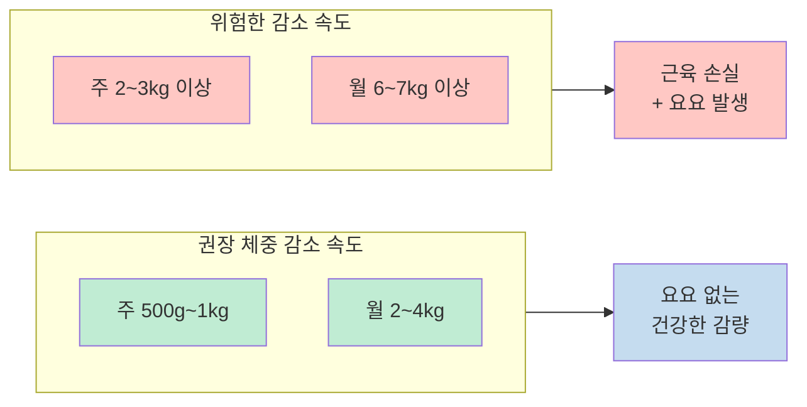

### 초반 빠른 체중 감소의 원인: 글라이코겐과 수분 손실

다이어트 초반 1~2주에 2~3kg이 빠르게 빠지는 경우가 많습니다. 이것은 지방이 빠진 것이 아니라 **글라이코겐과 함께 저장된 수분이 빠진 것**입니다. [(0:49)](https://youtu.be/cK2jBEcCD9U?t=49)

글라이코겐은 간과 근육에 저장되어 있는 탄수화물 형태의 에너지원입니다. 중요한 것은 **글라이코겐 1분자당 3~4g의 물이 함께 저장**되어 있다는 점입니다. [(1:11)](https://youtu.be/cK2jBEcCD9U?t=71)

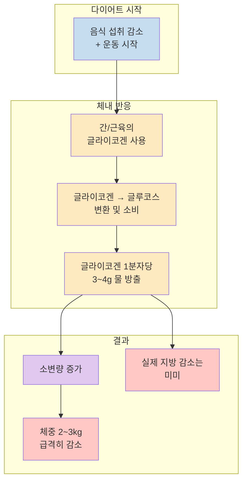

특히 비만했던 분들은 글라이코겐 저장량 자체가 많아서 초반에 더 많은 수분이 빠질 수 있습니다. [(1:31)](https://youtu.be/cK2jBEcCD9U?t=91)

### 빠른 체중 감소가 요요를 일으키는 메커니즘

한 달에 4~5kg 이상, 또는 6~7kg 이상을 빼려고 하면 심각한 문제들이 발생합니다:

1. **근육량 감소**: 체지방만 빠지는 것이 아니라 근육도 함께 빠집니다
2. **기초대사량 저하**: 근육이 줄면서 쉬어도 소모되는 에너지가 감소합니다
3. **활동대사량 저하**: 활동하면서 사용할 수 있는 에너지 자체가 줄어듭니다
4. **식욕 갈망 폭발**: 우리 몸이 기아 상태로 인식하여 음식에 대한 보상 반응이 극대화됩니다

[(1:56)](https://youtu.be/cK2jBEcCD9U?t=116)

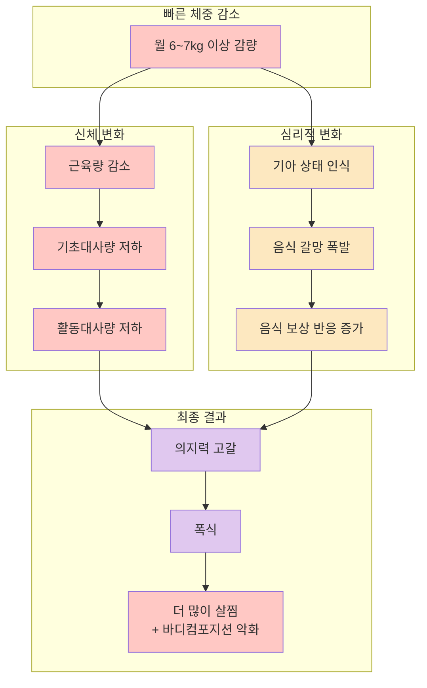

가장 중요한 점은 **"의지는 소비재"**라는 것입니다. [(2:12)](https://youtu.be/cK2jBEcCD9U?t=132)

체중이 빠르게 감소할수록 식욕과 음식에 대한 갈망이 급격히 올라가는데, 이것은 호르몬적 변화입니다. 우리 몸이 기아 상태라고 인식하기 때문에 음식을 먹었을 때의 쾌감과 보상이 더 커지고, 머릿속에서 음식에 대한 기대가 점점 증가합니다. [(2:14)](https://youtu.be/cK2jBEcCD9U?t=134)

결국 의지력으로는 이 호르몬의 변화를 이길 수 없습니다. [(6:23)](https://youtu.be/cK2jBEcCD9U?t=383)

### 바디 컴포지션의 악화

빠르게 살을 빼고 다시 찌면, **같은 체중이라도 바디 컴포지션(체성분 구성)이 바뀝니다**:

- 근육량은 더 감소
- 지방량은 더 증가

이렇게 되면 똑같이 먹어도 예전보다 살이 더 잘 찌는 체질이 됩니다. [(2:50)](https://youtu.be/cK2jBEcCD9U?t=170)

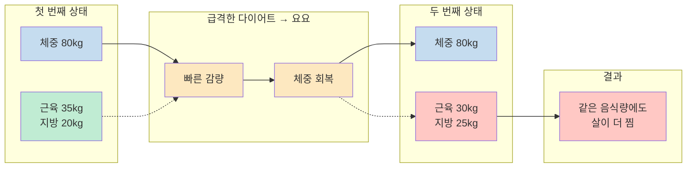

## 핵심 전략 1: 당류 완전히 끊기

빠른 체중 감량을 하면서도 요요를 방지하려면 **당류를 무조건 완전히 끊어야** 합니다. [(3:24)](https://youtu.be/cK2jBEcCD9U?t=204)

### 당류를 끊어야 하는 이유

빠른 체중 감소 시 이미 배고픔을 엄청나게 느끼는 상태가 됩니다. 이때 당류를 섭취하면:

1. **혈당이 빠르게 상승**했다가
2. **급격히 하락**하면서
3. **허기가 더욱 심해집니다**

[(3:32)](https://youtu.be/cK2jBEcCD9U?t=212)

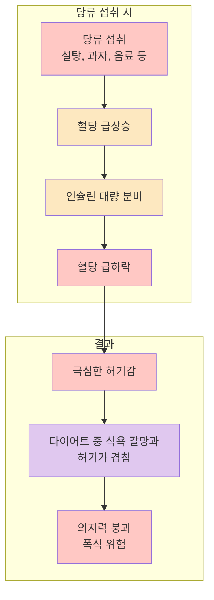

### 끊어야 할 당류 목록

- 설탕
- 액상과당
- 과자
- 아이스크림
- 단 음료
- 혈당을 빨리 올리는 모든 음식들

[(3:37)](https://youtu.be/cK2jBEcCD9U?t=217)

당류를 완전히 끊어야만 빠른 체중 감량을 하면서도 식욕을 어느 정도 이길 수 있습니다. [(3:52)](https://youtu.be/cK2jBEcCD9U?t=232)

## 핵심 전략 2: 복합 탄수화물 필수 섭취

두 번째로 중요한 것은 **복합 탄수화물을 반드시 먹어야 한다**는 것입니다. [(3:58)](https://youtu.be/cK2jBEcCD9U?t=238)

### 복합 탄수화물이 필수인 이유

빠른 체중 감소 시 식욕과 갈망이 올라오는데, 이것과 완전히 싸우려고 하면 안 됩니다. 복합 탄수화물은:

1. **혈당을 안정적으로 유지**시켜 줍니다
2. **근육 손실을 방지**합니다
3. **에너지를 공급**합니다

[(4:02)](https://youtu.be/cK2jBEcCD9U?t=242)

### 탄수화물을 완전히 끊으면 생기는 문제

탄수화물을 완전히 줄여버리는 식사를 하면:

- 에너지가 나지 않습니다
- 당에 대한 갈망이 더 심해집니다
- 근육이 잘 생기지 않습니다

[(4:15)](https://youtu.be/cK2jBEcCD9U?t=255)

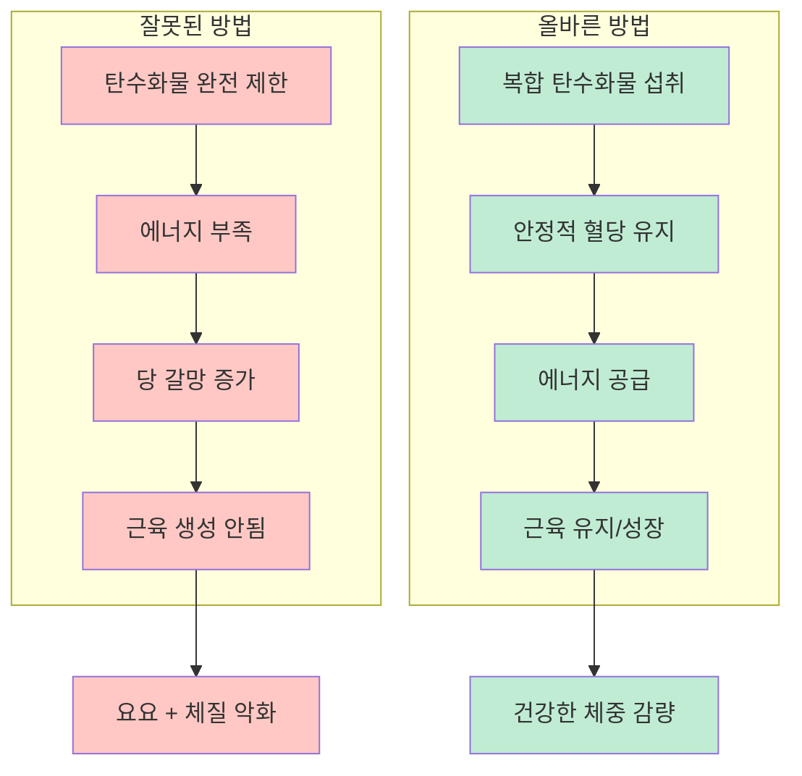

### 탄단지 밸런스의 중요성

**탄수화물, 단백질, 지방의 균형을 반드시 챙겨야** 합니다. 원푸드 다이어트나 단백질만 먹거나 탄수화물만 먹는 식단은 절대 해서는 안 됩니다. 이렇게 하면 무조건 엄청나게 심한 요요가 옵니다. [(4:27)](https://youtu.be/cK2jBEcCD9U?t=267)

## 핵심 전략 3: 고강도 운동 (하루 10분)

세 번째는 **고강도 운동**입니다. 중요한 것은 오래 할 필요가 없다는 점입니다. [(4:36)](https://youtu.be/cK2jBEcCD9U?t=276)

### 고강도 운동의 두 가지 목적

1. **근육 손실 최소화**
2. **식욕 억제**

[(4:44)](https://youtu.be/cK2jBEcCD9U?t=284)

### 운동 강도와 식욕의 관계

운동 강도에 따라 식욕 반응이 완전히 다릅니다:

**중저강도 운동 (수영, 산책 등)**
- 오히려 식욕을 증가시킵니다
- 활력은 올라가지만 배고픔도 올라갑니다
- 수영 후 엄청 배고픈 경험이 이것입니다

[(5:07)](https://youtu.be/cK2jBEcCD9U?t=307)

**고강도 운동 (근력운동, 고강도 달리기 등)**
- 식욕을 억제합니다
- 헬스장에서 힘들게 운동하고 나면 입맛이 없는 경험
- 처음 달리기해서 토할 것 같은 느낌

[(4:56)](https://youtu.be/cK2jBEcCD9U?t=296)

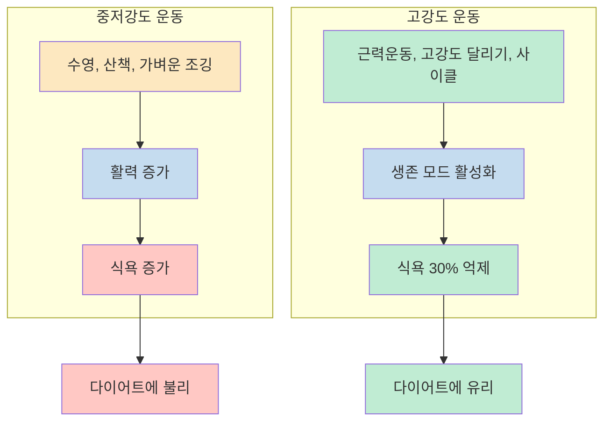

### 고강도 운동이 식욕을 억제하는 과학적 원리

고강도 운동은 우리 몸을 **생존 상황(사자에게 쫓기는 상황)**으로 인식하게 만듭니다. [(5:19)](https://youtu.be/cK2jBEcCD9U?t=319)

이때 우리 몸의 반응:
- **장관으로 가는 혈류 최소화** (소화 기능 억제)
- **근육으로 혈액 펌핑** 집중
- **교감신경 활성화**로 긴장 상태 유지

사자에게 쫓기면서 "배고프다"고 느낄 수 없는 것과 같은 원리입니다. [(5:26)](https://youtu.be/cK2jBEcCD9U?t=326)

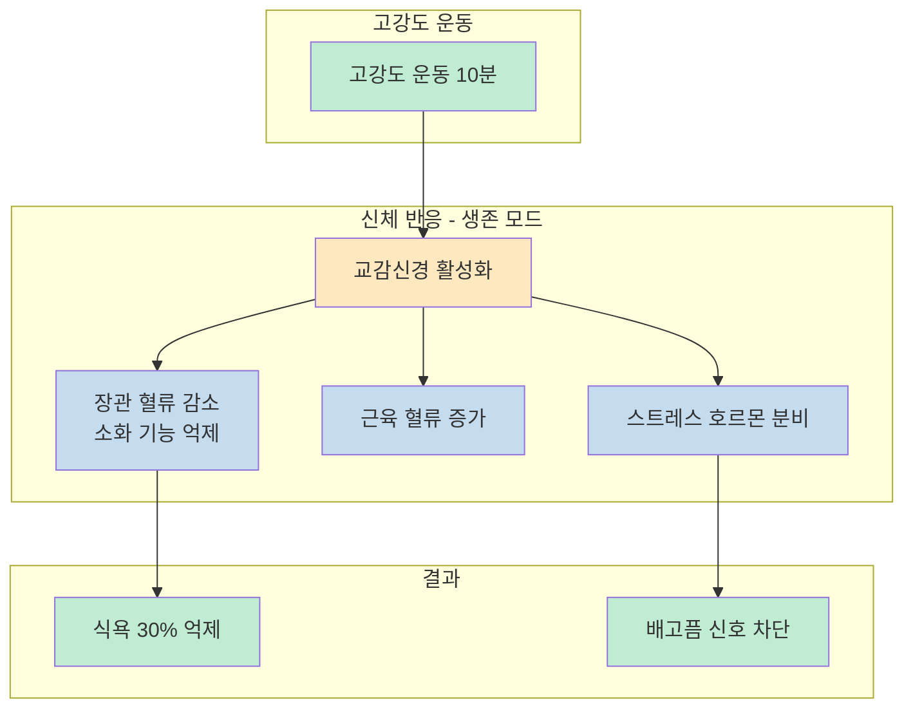

### 운동 시간과 효과

**10분만 해도 식욕이 30%까지 억제**됩니다. 길게 할 필요가 없습니다. [(5:40)](https://youtu.be/cK2jBEcCD9U?t=340)

### 최적의 운동 시간대

**오후 2시** 또는 **저녁 6~7시**에 하는 것이 좋습니다. 이 시간대에 운동하면 식욕 저하 효과를 더 오래 유지할 수 있습니다. [(5:47)](https://youtu.be/cK2jBEcCD9U?t=347)

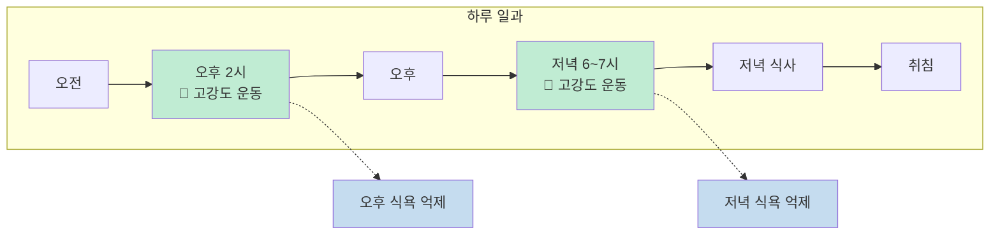

## 장기적 관점의 중요성

### 빠른 체중 감량의 장기적 결과

2~3년 추적 관찰 결과, 빠른 체중 감량을 한 사람들이 **결국 더 살이 찐다**는 연구 결과가 있습니다. [(6:30)](https://youtu.be/cK2jBEcCD9U?t=390)

나이가 들수록 살이 안 빠지는 체질이 되는 흔한 이유 중 하나가 **젊었을 때 하는 빠른 체중 감량**입니다. [(6:34)](https://youtu.be/cK2jBEcCD9U?t=394)

### 권장 접근법

**가장 좋은 방법**: 처음부터 길게 계획을 잡는 것

예를 들어 여름을 대비한다면:
- 여름 직전에 급하게 하지 말고
- **3개월 전**에 미리 목표를 잡고
- **천천히** 체중 감량을 해 나가기

이렇게 하면 폭발적인 식욕 증가를 줄일 수 있습니다. [(6:49)](https://youtu.be/cK2jBEcCD9U?t=409)

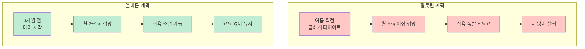

## 핵심 요약

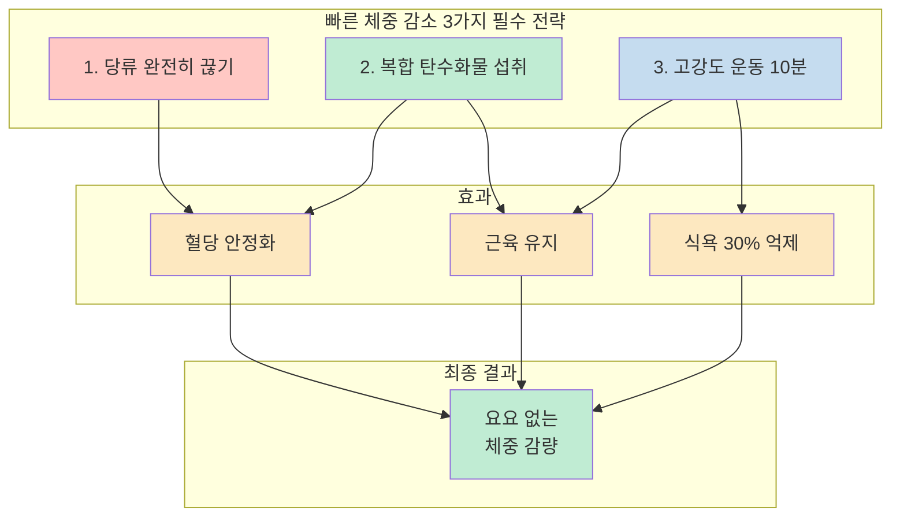

| 전략 | 핵심 내용 | 이유 |
|------|----------|------|
| **당류 차단** | 설탕, 과자, 음료 등 완전히 끊기 | 혈당 급등락 방지 → 허기 감소 |
| **복합 탄수화물** | 탄단지 밸런스 유지하며 섭취 | 혈당 안정 + 근육 유지 + 에너지 공급 |
| **고강도 운동** | 하루 10분, 오후 2시 또는 저녁 6~7시 | 식욕 30% 억제 + 근육 유지 |

**핵심 원리**: 의지는 소비재입니다. 호르몬의 변화를 의지로 이기려고 하면 절대 못 이깁니다. 위 세 가지 전략으로 호르몬 환경을 조절해야 합니다.

## 결론

빠른 체중 감소는 가능하지만, 잘못된 방법으로 하면 2~3년 후 더 많이 살이 찌고, 나이가 들수록 살이 안 빠지는 체질이 됩니다.

**빠른 감량이 꼭 필요하다면**:
1. 당류를 완전히 끊어 혈당 변동을 최소화하고
2. 복합 탄수화물로 탄단지 밸런스를 유지하며
3. 고강도 운동 10분으로 식욕을 억제하세요

그러나 **가장 좋은 방법**은 처음부터 3개월 이상 여유를 두고 천천히 감량하는 것입니다. 급하게 하면 할수록 나중에 더 큰 대가를 치르게 됩니다.
