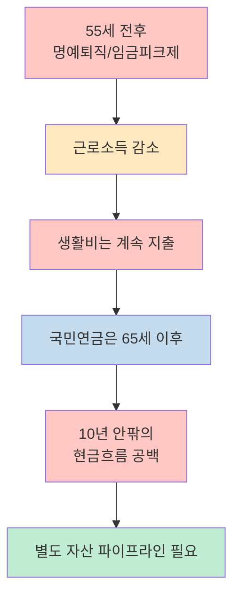
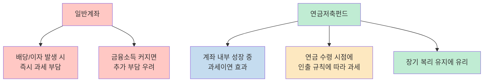
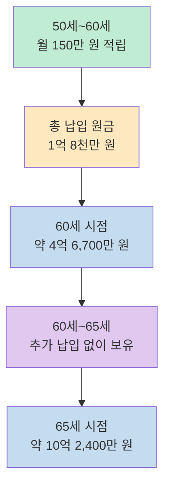
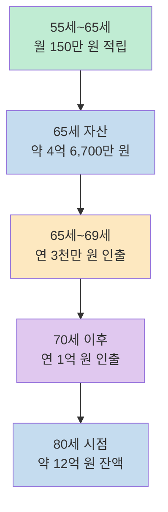
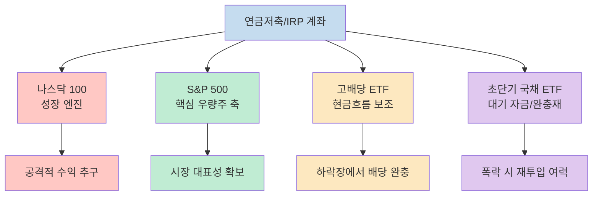
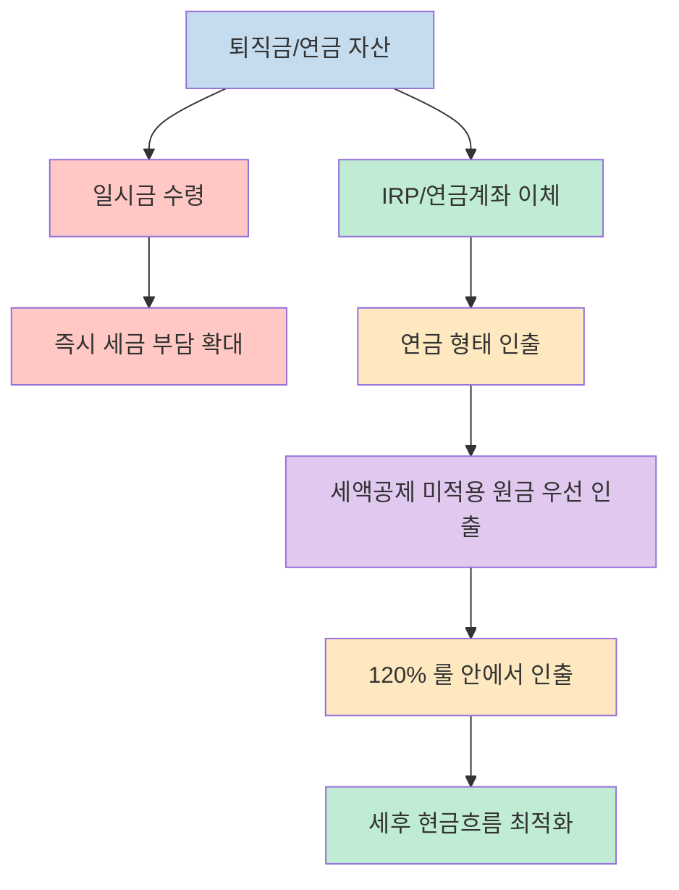

이 영상은 "50대에 연금저축을 시작하면 이미 늦은 것 아닌가"라는 패배감을 정면으로 뒤집습니다. 핵심 메시지는 단순합니다. **55세 전후의 위기는 준비가 끝났다는 뜻이 아니라, 월급이 끊기기 전 마지막으로 구조를 바꿀 수 있는 시점** 이라는 점입니다. 영상은 연금저축펀드, 퇴직연금, 적립식 ETF 투자를 하나의 흐름으로 묶어 설명합니다. [(2:36)](https://youtu.be/0dedtMfk1Vs?t=156)

다만 이 글은 영상을 그대로 받아쓰는 대신, 영상이 제시하는 논리를 `소득 절벽 -> 연금저축펀드 활용 -> 적립식 복리 시뮬레이션 -> 퇴직연금 전환 -> 인출 규칙` 순서로 다시 정리합니다. 특히 영상에서 반복해서 등장하는 숫자와 구조를 이해하기 쉽게 풀어보겠습니다. [(3:02)](https://youtu.be/0dedtMfk1Vs?t=182)

<!--more-->

## Sources

- [55세부터 시작해도 가능한 노후 자산 증가 비밀? 소득 절벽… 월급은 끝, 연금은 10년 뒤입니다 연금저축펀드, 제발 이상한 거 사지 마세요! - YouTube](https://www.youtube.com/watch?v=0dedtMfk1Vs)

## 55세 전후에 더 크게 느껴지는 "소득 절벽"

영상의 출발점은 투자 상품이 아니라 **현금흐름 붕괴** 입니다. 55세 전후가 되면 법정 정년과 별개로 명예퇴직, 희망퇴직, 임금피크제가 현실화되고, 월급이 끊기거나 눈에 띄게 줄어드는 반면 국민연금 수령 시점은 아직 멀어집니다. 영상은 이 빈 구간을 "10년의 텅 빈 공간"으로 표현합니다. [(4:39)](https://youtu.be/0dedtMfk1Vs?t=279)

특히 1971년생을 예로 들며, 55세에 소득이 흔들리고 65세가 되어야 연금을 받는 구조를 강조합니다. 즉 문제는 "노후 전체"가 아니라, **월급 종료와 공적연금 개시 사이의 현금흐름 갭** 입니다. 여기서부터 영상의 모든 제안은 이 공백을 메우는 방향으로 전개됩니다. [(4:56)](https://youtu.be/0dedtMfk1Vs?t=296)

영상은 이 구간에서 흔히 떠올리는 대안도 비판합니다. 정년 연장이 되더라도 같은 급여를 계속 받는다고 보기 어렵고, 일본의 재고용 사례나 국내 임금피크제를 떠올리면 실제로는 **고용 유지보다 소득 감소가 더 큰 변수** 라는 겁니다. [(5:30)](https://youtu.be/0dedtMfk1Vs?t=330)

또 주택연금 역시 "공짜 용돈"이 아니라 집을 담보로 한 구조라는 점을 짚습니다. 즉 영상의 관점에서 주택연금은 마지막 방어선일 수는 있어도, **월급이 남아 있는 동안 스스로 금융 파이프라인을 만드는 전략의 대체재는 아닙니다**. [(7:23)](https://youtu.be/0dedtMfk1Vs?t=443)

## 왜 영상은 ISA보다 연금저축펀드를 더 강하게 밀까

영상이 연금저축펀드를 전면에 세우는 이유는 50대 중에서도 특히 금융소득종합과세 구간을 신경 쓰는 시청자를 상정하기 때문입니다. 영상은 금융소득이 연 2천만 원을 넘으면 일반계좌 배당소득세, 건강보험료 부담, ISA 가입 제한 가능성이 겹치기 때문에, 결국 남는 핵심 절세 그릇이 연금저축펀드라고 설명합니다. [(9:22)](https://youtu.be/0dedtMfk1Vs?t=562)

여기서 중요한 포인트는 영상이 연금저축펀드를 단순한 연말정산 계좌가 아니라 **과세이연이 가능한 장기 투자 엔진** 으로 본다는 점입니다. 돈을 넣을 때의 세액공제보다, 계좌 안에서 자산이 커지는 동안 세금을 즉시 떼지 않는 구조가 더 중요하다는 주장입니다. [(10:53)](https://youtu.be/0dedtMfk1Vs?t=653)

그래서 영상은 50세, 55세를 오히려 골든타임이라고 부릅니다. 이유는 세 가지입니다. **첫째**, 아직 투자 원금을 만들어 넣을 수 있는 소득 여력이 남아 있고, **둘째**, 10년 정도만 강하게 납입한 뒤에는 시간을 복리에 맡길 수 있으며, **셋째**, 일반계좌보다 과세이연 효과를 체감할 가능성이 더 크기 때문입니다. [(10:14)](https://youtu.be/0dedtMfk1Vs?t=614)

## 영상이 제시한 실행 순서: 계좌 개설, 납입 한도, 세액공제 미적용 원금

실행 단계에서 영상은 매우 단호합니다. 은행이나 보험사보다 **증권사에서 연금저축펀드 계좌를 개설** 하고, 연간 최대 납입 한도 1,800만 원을 채우라고 말합니다. 이 글에서 중요한 것은 특정 회사 추천이 아니라, 영상이 계좌의 성격을 "예금 통장"이 아니라 **직접 운용할 수 있는 투자 계좌** 로 본다는 점입니다. [(11:16)](https://youtu.be/0dedtMfk1Vs?t=676)

또 하나 흥미로운 대목은 세액공제를 모두 받지 말고 일부 원금은 세액공제를 포기하라는 조언입니다. 영상은 세액공제를 받지 않은 원금은 나중에 인출할 때 세금과 건강보험료 부담을 덜고 먼저 꺼내기 좋다고 설명합니다. 즉 계좌를 단순히 "세액공제 최대화"가 아니라 **인출 유연성까지 고려한 구조** 로 설계하자는 이야기입니다. [(11:58)](https://youtu.be/0dedtMfk1Vs?t=718)

이 문단의 핵심은 연금저축펀드를 단일 혜택으로 보지 않는 데 있습니다. 영상의 설계는 `납입할 때 일부 공제`, `운용 중 과세이연`, `찾을 때 원금 우선 인출`을 한 세트로 봅니다. 그래서 뒤에 나오는 적립식 시뮬레이션도 단순 수익률 자랑이 아니라 **세금 구조를 바꾼 뒤 복리 엔진을 얹는 방식** 으로 이해해야 맞습니다. [(12:05)](https://youtu.be/0dedtMfk1Vs?t=725)

## 50세에 월 150만 원씩 넣는 시뮬레이션은 어떻게 읽어야 하나

영상의 가장 강한 메시지는 시뮬레이션입니다. 50세부터 60세까지 10년 동안 매달 150만 원을 납입하고, 이후 60세부터 65세까지는 더 넣지 않고 굴리기만 한다는 가정입니다. 영상은 과거 15년 기준 연평균 약 17% 수익률을 적용해, 원금 1억 8천만 원이 60세에 약 4억 6,700만 원, 65세에 약 10억 2,400만 원으로 커진다고 설명합니다. [(12:39)](https://youtu.be/0dedtMfk1Vs?t=759)

이 대목에서 봐야 할 것은 숫자 자체보다 구조입니다. 영상은 **"10년 납입 + 5년 방치"** 를 통해, 납입 기간보다 방치 기간의 증가폭이 더 크게 보이도록 복리의 인계점을 강조합니다. 즉 50대 전략의 본질을 "오래 투자"가 아니라 **"집중 납입 후 손대지 않기"** 로 설명하는 셈입니다. [(13:04)](https://youtu.be/0dedtMfk1Vs?t=784)

이후 영상은 더 과감해집니다. 65세부터 매년 1억 원씩 써도, 연 17% 수익률이 유지되면 오히려 잔고가 계속 늘어 80세 시점에 48억 원대가 남는다고 말합니다. 이 수치는 어디까지나 **고수익률이 계속 이어진다는 공격적 가정 위에서만 성립하는 시뮬레이션** 이라는 점을 분리해서 읽어야 합니다. [(13:28)](https://youtu.be/0dedtMfk1Vs?t=808)

## 55세부터 시작하는 경우, 영상은 더 보수적인 인출 순서를 제안한다

55세 시나리오에서는 영상의 문법이 달라집니다. 같은 월 150만 원 적립을 55세부터 65세까지 이어 가되, 65세부터 바로 1억 원씩 쓰지 않습니다. 먼저 65세부터 69세까지는 연 3천만 원만 인출하고, 70세 이후에 연 1억 원으로 올립니다. [(14:18)](https://youtu.be/0dedtMfk1Vs?t=858)

이 차이는 중요합니다. 영상은 50세 시나리오에서는 자산 규모가 이미 복리의 가속 구간에 들어갔다고 보고, 55세 시나리오에서는 **초기 5년을 완충 구간** 으로 둡니다. 즉 55세 전략은 단순히 5년 늦은 버전이 아니라, 인출 속도까지 조절해야 성립하는 계획으로 설명됩니다. [(14:33)](https://youtu.be/0dedtMfk1Vs?t=873)

결국 영상은 "55세도 늦지 않았다"고 말하지만, 더 정확히는 **"55세에도 가능하지만 인출 설계가 훨씬 중요하다"** 고 말하는 셈입니다. 시작 시점이 늦어질수록 복리보다 현금흐름 설계의 비중이 커진다는 뜻입니다. [(14:08)](https://youtu.be/0dedtMfk1Vs?t=848)

## 나스닥 100 일변도처럼 보이지만, 실제 결론은 4분할 구조에 가깝다

영상 전반부에서는 나스닥 100이 가장 강하게 강조됩니다. 자본주의의 심장이라 부르며, 변동성이 크더라도 적립식 투자라면 폭락이 오히려 더 많이 살 수 있는 기회라고 설명합니다. 수익률이 0%여도 원금 1억 8천만 원은 남아 있으니, 가장 큰 위험은 폭락이 아니라 **투자를 미루는 것** 이라고 말합니다. [(15:18)](https://youtu.be/0dedtMfk1Vs?t=918)

하지만 후반부로 가면 포트폴리오는 훨씬 구조적입니다. 영상은 `나스닥 100`, `S&P 500`, `고배당 ETF`, `초단기 국채 ETF` 를 네 개의 부대로 비유합니다. 즉 성장 엔진 하나만 들고 가기보다, **상승장/조정장/현금대기 자산을 함께 묶은 시스템** 으로 제안합니다. [(18:16)](https://youtu.be/0dedtMfk1Vs?t=1096)

따라서 이 영상을 한 줄로 요약하면 "나스닥 100만 사라"가 아니라, **성장 자산을 중심에 두되 버틸 수 있는 포트폴리오와 저비용 ETF 선택이 중요하다** 입니다. 특히 S&P 500 ETF는 표면 보수보다 추적오차와 실부담 비용을 같이 보라고 강조하는데, 장기 투자에서는 이런 작은 비용 차이가 복리에 큰 영향을 준다고 설명합니다. [(19:07)](https://youtu.be/0dedtMfk1Vs?t=1147)

## 퇴직연금은 DB형 방치보다 DC형 전환 타이밍이 핵심이라는 주장

후반부의 또 다른 핵심은 퇴직금 관리입니다. 영상은 자신의 퇴직연금이 DB형인지 DC형인지부터 확인하라고 말합니다. 그리고 55세 전후, 특히 임금피크제로 들어가기 전이라면 DB형을 그대로 두지 말고 **월급이 깎이기 전에 DC형으로 전환하는 타이밍** 을 고민하라고 제안합니다. [(16:00)](https://youtu.be/0dedtMfk1Vs?t=960)

논리는 명확합니다. DB형은 퇴직 직전 임금 수준의 영향을 크게 받고, 임금피크제가 시작되면 전체 퇴직금이 줄어들 수 있습니다. 반면 영상은 가장 높았던 월급 구간에서 정산을 받고 이후에는 직접 운용하는 쪽이 유리할 수 있다고 설명합니다. 즉 퇴직연금을 "나중에 받는 돈"으로 방치하지 말고, **현금흐름 전략의 일부로 재편** 하라는 메시지입니다. [(16:43)](https://youtu.be/0dedtMfk1Vs?t=1003)

또 성과급이나 보너스를 DC형 계좌로 넣으면 근로소득으로 바로 잡히지 않고, 나중에 퇴직소득세 체계로 가져갈 수 있다는 설명도 이어집니다. 결국 영상은 연금저축펀드와 퇴직연금을 따로 보지 않고, **은퇴 직전 10년의 세금 구조를 통합 관리하는 도구 묶음** 으로 취급합니다. [(17:01)](https://youtu.be/0dedtMfk1Vs?t=1021)

## 돈을 모으는 것보다 더 중요한 건 "어떻게 뺄 것인가"

영상의 마지막 강조점은 인출 규칙입니다. 퇴직금을 일시금으로 받지 말고 IRP나 연금저축으로 넘겨 세금을 늦추고, 연금 형태로 오래 나눠 받을수록 세금 부담이 낮아진다고 설명합니다. [(17:20)](https://youtu.be/0dedtMfk1Vs?t=1040)

여기에 두 가지 실전 규칙이 붙습니다. **첫째**, 세액공제를 받지 않은 원금부터 먼저 인출하라. **둘째**, 국가가 정한 연금 수령 한도, 영상에서 말하는 "120% 룰" 안에서 인출하라. 이 두 규칙을 지키면 계좌를 단순한 적립 계좌가 아니라 **은퇴 이후 세후 현금흐름 조절 장치** 로 쓸 수 있다는 게 영상의 결론입니다. [(17:56)](https://youtu.be/0dedtMfk1Vs?t=1076)

이 장면은 영상 전체의 결론과도 이어집니다. 노후 준비는 계좌 하나를 여는 이벤트가 아니라, **적립 단계와 인출 단계를 함께 설계하는 일** 이라는 것입니다. 특히 50대 이후에는 수익률보다 인출 순서와 세금 체계가 체감 차이를 크게 만들 수 있다는 점을 반복해서 보여 줍니다. [(20:12)](https://youtu.be/0dedtMfk1Vs?t=1212)

## 이 영상을 실전 체크리스트로 바꾸면

영상에서 바로 행동으로 옮길 수 있는 부분만 뽑으면 네 단계로 압축됩니다. **첫째**, 55세 전후의 문제를 "늦었다"가 아니라 "소득 절벽이 열린다"로 다시 정의합니다. **둘째**, 연금저축펀드와 퇴직연금 구조를 동시에 점검합니다. **셋째**, 월 150만 원 적립이 가능한지 현실적인 현금흐름을 계산합니다. **넷째**, 인출 순서와 한도를 미리 정합니다. [(19:49)](https://youtu.be/0dedtMfk1Vs?t=1189)

반대로 영상을 보면서 경계해야 할 부분도 분명합니다. 17% 수익률 같은 공격적인 가정은 어디까지나 시뮬레이션 전제이고, 실제 결과는 시장 수익률, 납입 지속성, 인출 속도에 따라 크게 달라집니다. 그래서 영상의 진짜 교훈은 특정 숫자를 믿는 것이 아니라, **세금이연 계좌 + 적립식 투자 + 늦은 시기의 인출 설계** 를 하나의 체계로 이해하는 데 있습니다. [(14:58)](https://youtu.be/0dedtMfk1Vs?t=898)

## 핵심 요약

- 영상은 55세 전후의 핵심 문제를 "투자를 늦게 시작했다"가 아니라 **월급 종료와 연금 개시 사이의 현금흐름 공백** 으로 봅니다. [(4:59)](https://youtu.be/0dedtMfk1Vs?t=299)
- 연금저축펀드는 연말정산 계좌가 아니라 **과세이연과 장기 복리를 동시에 활용하는 그릇** 으로 설명됩니다. [(10:56)](https://youtu.be/0dedtMfk1Vs?t=656)
- 50세 시나리오는 `10년 적립 + 5년 보유`, 55세 시나리오는 `10년 적립 + 초반 5년 저속 인출`로 구조가 다릅니다. [(13:17)](https://youtu.be/0dedtMfk1Vs?t=797)
- 포트폴리오 결론은 나스닥 100 단일 몰빵보다 `나스닥 100 + S&P 500 + 고배당 ETF + 초단기 국채 ETF`의 역할 분담에 가깝습니다. [(18:22)](https://youtu.be/0dedtMfk1Vs?t=1102)
- 퇴직연금은 DB/DC 구분과 임금피크제 이전 전환 타이밍, 그리고 IRP 이체 후 연금식 인출이 핵심 변수로 제시됩니다. [(16:37)](https://youtu.be/0dedtMfk1Vs?t=997)
- 결국 영상이 말하는 노후 준비는 상품 추천이 아니라 **소득 절벽 이전 10년을 어떻게 계좌 구조와 인출 구조로 재편할 것인가** 에 대한 전략입니다. [(20:27)](https://youtu.be/0dedtMfk1Vs?t=1227)

## 결론

이 영상이 설득력 있는 이유는 희망적인 문구 때문이 아니라, 50대 이후의 문제를 수익률이 아닌 현금흐름과 세금 구조로 다시 정의하기 때문입니다. 늦게 시작하는 사람에게 필요한 것은 "한 방"이 아니라, **10년 동안 넣고, 5년 동안 기다리고, 이후에는 규칙대로 꺼내 쓰는 구조** 입니다. [(12:48)](https://youtu.be/0dedtMfk1Vs?t=768)

따라서 이 영상을 보고 바로 가져가야 할 질문은 하나입니다. "나는 지금 어떤 ETF를 사야 하지?"가 아니라, **"내 월급이 줄기 전에 연금저축펀드와 퇴직연금을 어떤 순서로 세팅하고, 나중에 어떤 순서로 인출할 것인가?"** 입니다. 영상의 숫자는 달라질 수 있어도, 이 질문의 중요성은 쉽게 바뀌지 않습니다. [(19:58)](https://youtu.be/0dedtMfk1Vs?t=1198)
