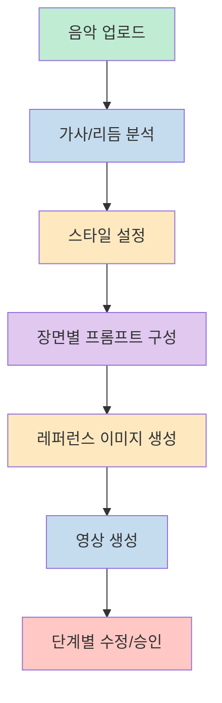
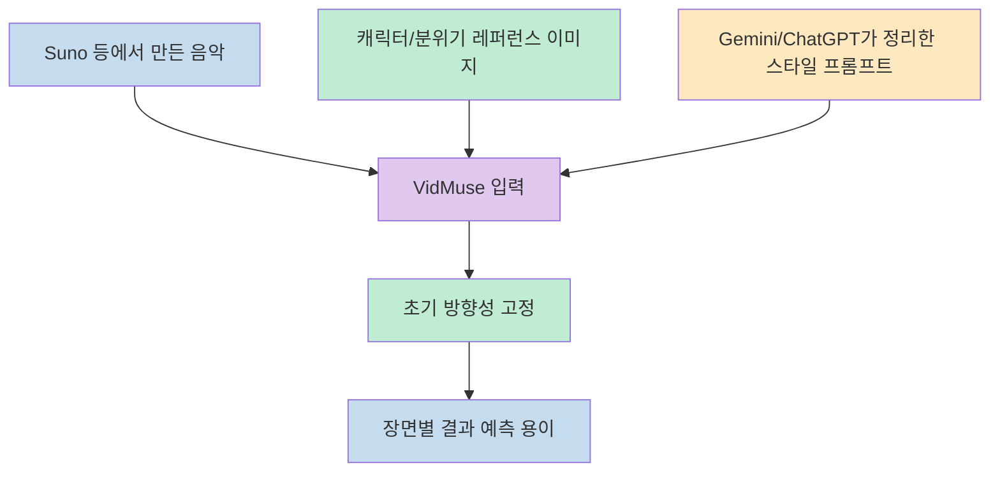
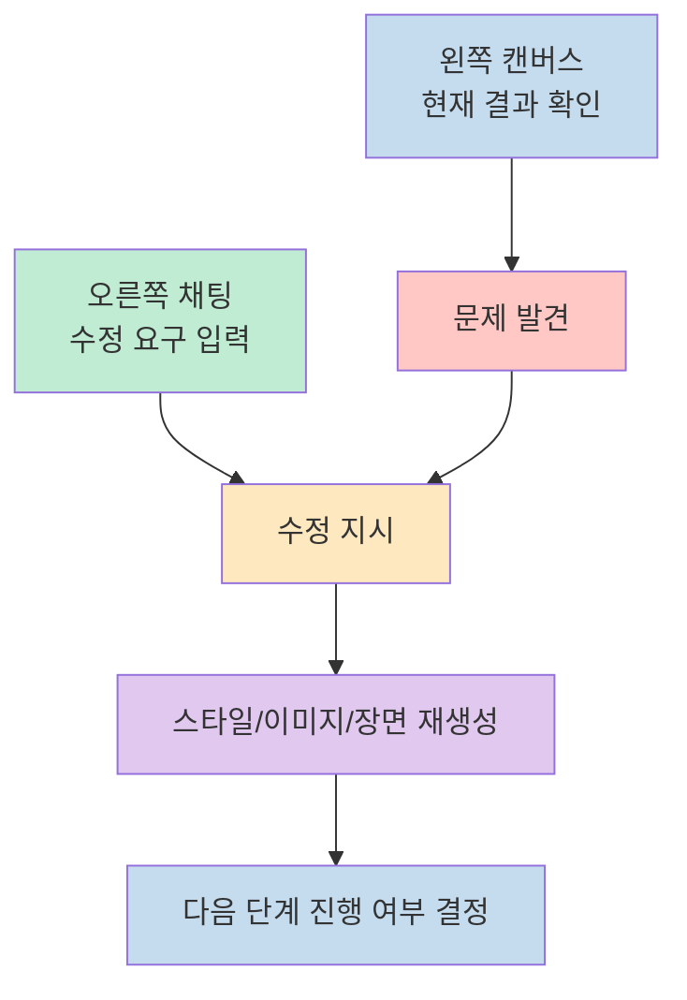
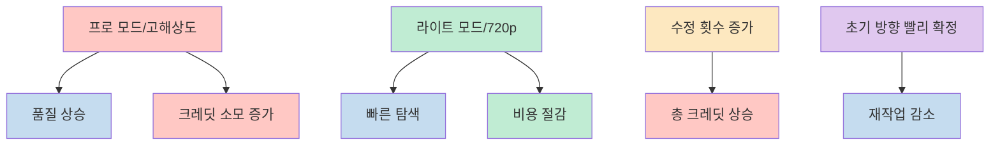
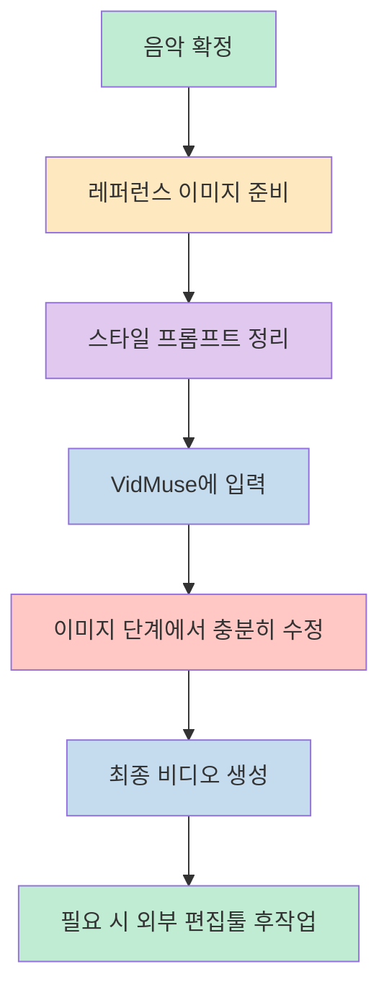

이 영상이 흥미로운 이유는 단순히 "뮤직비디오를 만들어 주는 AI"를 소개해서가 아닙니다. 발표자가 강조하는 핵심은, VidMuse가 텍스트 한 줄을 던지고 결과물을 기다리는 도구라기보다 `음악 분석 -> 스타일 정리 -> 장면 설계 -> 이미지 생성 -> 영상 생성`을 순서대로 끌고 가는 **에이전트형 제작 동반자** 에 가깝다는 점입니다. 그래서 이 툴의 가치는 결과물 한 장면보다도, 제작 과정을 얼마나 세분화해 안내해 주느냐에서 드러납니다. [(0:10)](https://youtu.be/eZNtweZ0EjA?t=10), [(0:44)](https://youtu.be/eZNtweZ0EjA?t=44), [(5:40)](https://youtu.be/eZNtweZ0EjA?t=340)

다만 영상을 그대로 따라 적으면 "무료 크레딧을 주는 새 툴 소개" 정도로 끝나기 쉽습니다. 이 글에서는 내용을 `사전 준비물`, `VidMuse 내부 워크플로우`, `품질과 비용의 교환관계`, `실전 적용 순서`로 다시 묶어서, 왜 이런 방식이 기존 이미지/영상 생성기와 다르게 느껴지는지를 중심으로 정리해 보겠습니다. [(0:24)](https://youtu.be/eZNtweZ0EjA?t=24), [(1:42)](https://youtu.be/eZNtweZ0EjA?t=102), [(7:17)](https://youtu.be/eZNtweZ0EjA?t=437)

<!--more-->

## Sources

- [[무료] 실시간 해외에서 난리난 뮤직비디오 제작 AI, 실제 사용 후기 VIDMUSE AI - YouTube](https://www.youtube.com/watch?v=eZNtweZ0EjA)

## 왜 VidMuse는 "한 번에 끝내는 AI"보다 "작업을 끌고 가는 에이전트"처럼 보일까

영상 초반의 표현만 보면 VidMuse는 음악만 넣으면 곧바로 뮤직비디오를 뽑아 주는 자동화 툴처럼 들립니다. 그런데 실제 시연을 보면 구조가 다릅니다. 발표자는 "기획부터 영상까지 AI 비서가 따라붙는다"고 설명하고, 뒤로 갈수록 이 툴이 사용자의 결정을 대신하는 것이 아니라 **결정을 순서대로 끌어내는 방식** 으로 움직인다는 점을 반복해서 보여 줍니다. 즉 사용자는 결과만 받는 사람이 아니라, 단계마다 승인과 수정을 넣는 공동 제작자에 가깝습니다. [(0:44)](https://youtu.be/eZNtweZ0EjA?t=44), [(4:25)](https://youtu.be/eZNtweZ0EjA?t=265), [(5:22)](https://youtu.be/eZNtweZ0EjA?t=322)

이 구조가 중요한 이유는 영상 생성 실패의 원인을 한 번에 감추지 않기 때문입니다. 일반적인 텍스트-투-비디오 툴은 결과가 마음에 들지 않아도 어디서 어긋났는지 파악하기 어렵지만, VidMuse는 음악 분석, 스타일 설정, 장면 프롬프트, 이미지, 비디오 단계를 분리해 보여 주기 때문에 사용자가 어느 단계에서 방향이 틀어졌는지 비교적 쉽게 추적할 수 있습니다. 발표자가 "진짜 영상 관계자와 일하는 것처럼 질문이 들어온다"고 말하는 대목도 바로 이 점을 가리킵니다. [(5:40)](https://youtu.be/eZNtweZ0EjA?t=340), [(5:55)](https://youtu.be/eZNtweZ0EjA?t=355), [(6:08)](https://youtu.be/eZNtweZ0EjA?t=368)

결국 이 영상이 말하는 VidMuse의 차별점은 "AI가 멋진 영상을 만든다"가 아니라 **제작 플로우를 인터페이스 안으로 가져왔다** 는 데 있습니다. 그래서 잘 쓰는 방법도 프롬프트 한 줄을 멋지게 쓰는 데 있지 않고, 각 단계에서 무엇을 먼저 확정하고 무엇을 나중에 미룰지를 이해하는 데 있습니다. [(3:07)](https://youtu.be/eZNtweZ0EjA?t=187), [(5:45)](https://youtu.be/eZNtweZ0EjA?t=345), [(7:37)](https://youtu.be/eZNtweZ0EjA?t=457)

## 시작점은 음악 자체보다 "레퍼런스와 요구사항 정리"다

시연에서 발표자는 곧바로 VidMuse부터 열지 않습니다. 먼저 자신의 AI 음악에 맞는 레퍼런스 이미지를 만들고, 그 뒤에야 음악과 이미지를 함께 넣습니다. 여기서 중요한 포인트는 레퍼런스 이미지가 단순 장식이 아니라, 앞으로 나올 결과를 예측하는 기준점으로 쓰인다는 설명입니다. 즉 처음부터 주인공의 얼굴, 시대감, 색감, 분위기를 어느 정도 고정해 두면 이후 단계에서 결과를 해석하기가 훨씬 쉬워집니다. [(1:13)](https://youtu.be/eZNtweZ0EjA?t=73), [(1:42)](https://youtu.be/eZNtweZ0EjA?t=102), [(1:51)](https://youtu.be/eZNtweZ0EjA?t=111)

또 하나 흥미로운 점은 발표자가 프롬프트 자체도 다른 AI에게 위임한다는 것입니다. 그는 Gemini나 ChatGPT에 "이 이미지와 장르를 참고해서 뮤직비디오 스타일 프롬프트를 작성해 달라"고 요청한 뒤, 그 결과를 다시 VidMuse에 넣습니다. 이 흐름은 적어도 이 영상의 작업 방식 안에서는, 사용자가 문장을 처음부터 직접 다듬기보다 참조 자료를 먼저 모으고 다른 모델이 초안을 정리하게 한 뒤 VidMuse에 넘기는 식으로 프롬프트를 구성하고 있음을 보여 줍니다. [(1:22)](https://youtu.be/eZNtweZ0EjA?t=82), [(2:52)](https://youtu.be/eZNtweZ0EjA?t=172), [(3:09)](https://youtu.be/eZNtweZ0EjA?t=189)

영상에서 실제로 사용한 조합은 꽤 현실적입니다. 음악은 Suno에서 만들고, 캐릭터 이미지는 다른 생성형 모델로 준비하고, 스타일 프롬프트는 대화형 모델이 정리하고, 최종 조립과 장면 전개는 VidMuse가 맡습니다. 다시 말해 VidMuse는 모든 것을 혼자 해결하는 만능 생성기가 아니라, **음악-이미지-지시문을 받아 뮤직비디오 제작 플로우로 통합하는 오케스트레이터** 에 더 가깝습니다. [(1:28)](https://youtu.be/eZNtweZ0EjA?t=88), [(2:00)](https://youtu.be/eZNtweZ0EjA?t=120), [(3:22)](https://youtu.be/eZNtweZ0EjA?t=202)

여기서 실전적으로 배울 수 있는 교훈은 명확합니다. 뮤직비디오 생성 품질을 높이고 싶다면 VidMuse 안에서만 씨름하기보다, 들어가기 전에 **음악의 분위기, 주인공 외형, 참고 이미지, 원하는 장면 감정선** 을 먼저 정리하는 편이 낫습니다. 영상이 레퍼런스 이미지를 "없어도 되지만 넣으면 훨씬 예측하기 쉽다"고 말하는 이유도 바로 이 준비 비용이 뒤의 수정 비용을 줄여 주기 때문입니다. [(1:42)](https://youtu.be/eZNtweZ0EjA?t=102), [(1:54)](https://youtu.be/eZNtweZ0EjA?t=114), [(6:41)](https://youtu.be/eZNtweZ0EjA?t=401)

## VidMuse 안에서는 어디를 수정하고 어떤 결정을 해야 하나

시연 중반부에서 발표자는 화면 구성을 꽤 선명하게 설명합니다. 왼쪽은 현재까지 만들어진 작업물을 확인하는 캔버스이고, 오른쪽은 추가 수정 프롬프트를 넣는 대화창입니다. 이 구조는 단순히 UI 소개가 아니라, 사용자가 어디서 결과를 보고 어디서 방향을 바꾸는지를 분리한다는 점에서 중요합니다. 즉 VidMuse의 핵심 상호작용은 "새로 생성" 버튼을 연타하는 것이 아니라, **보이는 결과를 해석하고 말로 되돌려 주는 피드백 루프** 에 있습니다. [(4:25)](https://youtu.be/eZNtweZ0EjA?t=265), [(4:34)](https://youtu.be/eZNtweZ0EjA?t=274), [(4:39)](https://youtu.be/eZNtweZ0EjA?t=279)

언어 사용에 대한 설명도 흥미롭습니다. 발표자는 한국어로 써도 되지만, 이 시연에서는 프롬프트 작성 정확성 면에서 영어를 더 추천한다고 말합니다. 적어도 영상 속 사용 문맥에서는, 영어로 요구사항을 정리하거나 번역 기능과 다른 모델의 도움을 받아 다듬은 뒤 넣는 방식이 더 안정적인 선택지로 제시됩니다. [(4:47)](https://youtu.be/eZNtweZ0EjA?t=287), [(4:57)](https://youtu.be/eZNtweZ0EjA?t=297), [(5:01)](https://youtu.be/eZNtweZ0EjA?t=301)

또 단계별 수정 가능성은 결과 품질과 직접 연결됩니다. 발표자는 스토리보드가 나왔을 때 이미지를 다시 생성해 인물을 한 명으로 정리하고, 이미지 단계에서 미리 재생해 보면서 최종 비디오 느낌을 확인할 수 있다고 설명합니다. 이 말은 곧 "비디오까지 간 뒤 고치면 늦다"는 뜻이기도 합니다. 스타일, 인물 일관성, 장면 분위기 같은 문제는 되도록 이미지 단계에서 잡아야 이후 비용과 시간이 덜 듭니다. [(6:16)](https://youtu.be/eZNtweZ0EjA?t=376), [(6:31)](https://youtu.be/eZNtweZ0EjA?t=391), [(6:48)](https://youtu.be/eZNtweZ0EjA?t=408)

정리하면 VidMuse를 잘 쓰는 사람은 프롬프트를 잘 쓰는 사람이라기보다, **어느 단계에서 어떤 결정을 확정해야 하는지 아는 사람** 에 가깝습니다. 음악 분석과 스타일 정리는 초반에, 인물/장면 일관성은 이미지 단계에서, 최종 움직임과 편집 감각은 비디오 단계에서 보는 식으로 관심사를 분리해야 전체 작업이 덜 꼬입니다. [(5:40)](https://youtu.be/eZNtweZ0EjA?t=340), [(6:05)](https://youtu.be/eZNtweZ0EjA?t=365), [(7:08)](https://youtu.be/eZNtweZ0EjA?t=428)

## 품질과 비용은 결국 "얼마나 빨리 확정하느냐"에 달려 있다

영상은 VidMuse의 장점만 말하지 않고 비용 구조도 꽤 구체적으로 드러냅니다. 발표자는 프로 모드가 더 시네마틱한 결과를 주지만 크레딧 소모가 많다고 말하고, 테스트이기 때문에 라이트 모드와 720 해상도로 진행합니다. 여기서 중요한 것은 단순히 "싼 옵션을 써라"가 아니라, **초기 탐색 단계와 최종 출력 단계를 구분하라** 는 암묵적 전략입니다. 방향을 찾는 동안에는 가벼운 설정으로 빠르게 확인하고, 확정된 뒤에만 고비용 옵션을 쓰는 편이 합리적이라는 뜻입니다. [(3:29)](https://youtu.be/eZNtweZ0EjA?t=209), [(3:38)](https://youtu.be/eZNtweZ0EjA?t=218), [(3:54)](https://youtu.be/eZNtweZ0EjA?t=234)

시간 비용도 무시할 수 없습니다. 발표자는 VidMuse의 단점으로 "시간이 좀 걸린다"는 점을 직접 언급합니다. 하지만 그 이유를 단순한 느림이 아니라, 실제 프로덕션처럼 음악 처음부터 끝까지 제작 플로우를 따라가며 프롬프트와 장면을 세밀하게 다듬기 때문이라고 설명합니다. 다시 말해 이 툴은 즉시성보다는 **감독형 워크플로우의 세밀함** 에 무게를 둔 제품으로 읽는 것이 맞습니다. [(7:17)](https://youtu.be/eZNtweZ0EjA?t=437), [(7:25)](https://youtu.be/eZNtweZ0EjA?t=445), [(7:33)](https://youtu.be/eZNtweZ0EjA?t=453)

크레딧 숫자 역시 같은 맥락에서 봐야 합니다. 발표자는 이것저것 테스트하다 보니 500 크레딧 넘게 썼지만, 보통 라이트 버전 30초 영상은 약 250 크레딧 정도 든다고 말합니다. 이는 서비스 전체의 절대 가격표라기보다, **수정 횟수와 탐색 폭이 비용을 크게 바꾼다** 는 사례에 가깝습니다. 따라서 VidMuse를 경제적으로 쓰려면 처음부터 최고 품질을 노리기보다, 중간 산출물을 빨리 보고 빨리 버리는 쪽이 오히려 더 효율적일 수 있습니다. [(7:45)](https://youtu.be/eZNtweZ0EjA?t=465), [(7:56)](https://youtu.be/eZNtweZ0EjA?t=476), [(8:02)](https://youtu.be/eZNtweZ0EjA?t=482)

마지막 다운로드 옵션도 실무적으로 의미가 있습니다. 발표자는 완성된 영상 전체를 받는 것뿐 아니라, 생성된 이미지와 영상 조각을 각각 받아 다른 편집툴에서 후작업할 수도 있다고 설명합니다. 이 말은 VidMuse가 파이널 컷 하나만 뽑아내는 폐쇄형 도구가 아니라, 필요하면 **중간 자산을 다른 편집 파이프라인으로 넘길 수 있는 반개방형 도구** 라는 뜻이기도 합니다. [(8:08)](https://youtu.be/eZNtweZ0EjA?t=488), [(8:13)](https://youtu.be/eZNtweZ0EjA?t=493), [(8:21)](https://youtu.be/eZNtweZ0EjA?t=501)

## 실전 적용 포인트

이 영상을 실제 작업 절차로 바꾸면 순서는 꽤 단순해집니다. **첫째**, 음악을 먼저 고정합니다. **둘째**, 주인공과 분위기를 설명할 레퍼런스 이미지를 준비합니다. **셋째**, Gemini나 ChatGPT로 스타일 프롬프트를 정리해 VidMuse에 넣습니다. **넷째**, 이미지 단계에서 인물 일관성과 장면 분위기를 충분히 확인한 뒤 비디오 생성으로 넘어갑니다. 핵심은 많은 기능을 다 쓰는 것이 아니라, 뒤로 갈수록 비싸고 느려지는 단계를 앞단의 결정 품질로 보호하는 것입니다. [(1:13)](https://youtu.be/eZNtweZ0EjA?t=73), [(2:52)](https://youtu.be/eZNtweZ0EjA?t=172), [(6:31)](https://youtu.be/eZNtweZ0EjA?t=391)

또 사용자의 기대치도 조정할 필요가 있습니다. 적어도 이 영상이 보여 주는 VidMuse는 "아무 생각 없이 눌러도 영화 같은 뮤직비디오가 나온다"는 식의 마법 상자라기보다, 음악 기반 영상 제작의 순서를 대화형 인터페이스로 따라가게 만드는 도구에 더 가깝습니다. 그래서 이 서비스를 읽는 한 가지 방법은 결과물만 보는 것이 아니라, 에이전트형 AI가 이미지와 영상을 어떤 순서로 조립하는지 시연 사례로 보는 것입니다. [(5:22)](https://youtu.be/eZNtweZ0EjA?t=322), [(8:58)](https://youtu.be/eZNtweZ0EjA?t=538), [(9:14)](https://youtu.be/eZNtweZ0EjA?t=554)

## 핵심 요약

- 이 영상의 핵심은 VidMuse를 "결과 생성기"보다 **단계별 결정을 이끄는 에이전트형 제작 도구** 로 보여 준다는 점입니다. [(0:44)](https://youtu.be/eZNtweZ0EjA?t=44), [(5:40)](https://youtu.be/eZNtweZ0EjA?t=340)
- 실제 품질은 VidMuse 안에서만 해결되지 않고, 음악, 레퍼런스 이미지, 스타일 프롬프트를 얼마나 잘 준비했는지에 크게 좌우됩니다. [(1:42)](https://youtu.be/eZNtweZ0EjA?t=102), [(3:09)](https://youtu.be/eZNtweZ0EjA?t=189)
- 작업 중 중요한 판단은 이미지 단계에서 많이 이뤄져야 합니다. 인물 수, 분위기, 스타일 방향을 여기서 못 잡으면 뒤 단계의 비용이 커집니다. [(6:16)](https://youtu.be/eZNtweZ0EjA?t=376), [(6:48)](https://youtu.be/eZNtweZ0EjA?t=408)
- 비용 전략의 핵심은 라이트 설정으로 빠르게 탐색하고, 방향이 맞을 때만 고품질 옵션으로 넘어가는 것입니다. [(3:29)](https://youtu.be/eZNtweZ0EjA?t=209), [(7:56)](https://youtu.be/eZNtweZ0EjA?t=476)
- 결국 VidMuse의 진짜 가치는 자동 생성 그 자체보다, 초보자도 음악 기반 영상 제작의 순서를 이해하고 따라갈 수 있게 만든 인터페이스에 있습니다. [(7:25)](https://youtu.be/eZNtweZ0EjA?t=445), [(9:14)](https://youtu.be/eZNtweZ0EjA?t=554)

## 결론

이 영상을 보고 나면 VidMuse를 단순히 "새로운 AI 영상 툴 하나"로만 소개하기는 어렵습니다. 이 시연에서 VidMuse는 음악, 이미지, 프롬프트, 장면 설계를 하나의 대화형 파이프라인으로 묶어 보여 주고, 그래서 글을 읽는 입장에서는 최근 생성형 영상 도구가 어떤 사용 흐름을 지향하는지 살펴볼 수 있는 사례처럼 보입니다. [(5:22)](https://youtu.be/eZNtweZ0EjA?t=322), [(9:02)](https://youtu.be/eZNtweZ0EjA?t=542)

그래서 이 영상에서 바로 가져가야 할 질문은 "이 툴이 좋으냐"보다 **"나는 어느 단계에서 방향을 확정하고, 어느 단계에서 수정 비용을 줄일 것인가"** 입니다. VidMuse를 잘 쓰는 법은 화려한 프롬프트보다 좋은 제작 순서를 갖는 데 있고, 이 영상은 그 순서를 꽤 설득력 있게 보여 줍니다. [(6:05)](https://youtu.be/eZNtweZ0EjA?t=365), [(7:45)](https://youtu.be/eZNtweZ0EjA?t=465)
