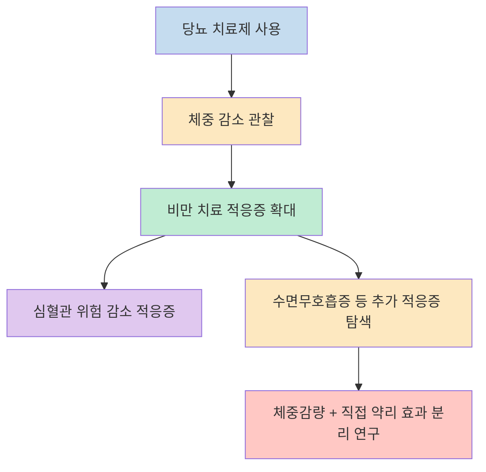
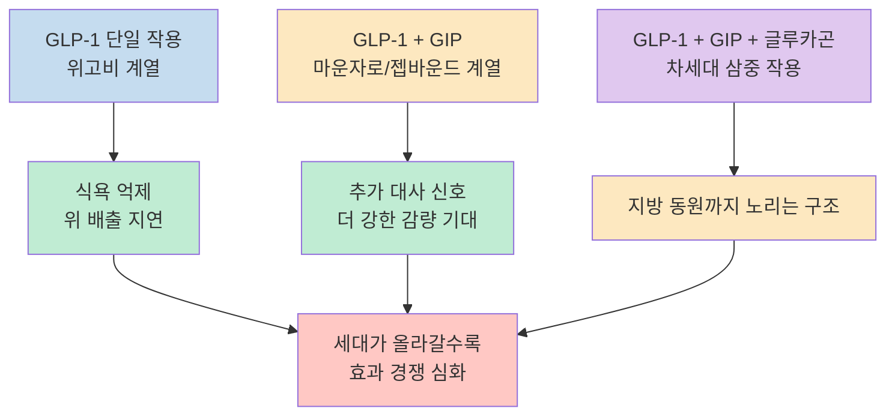
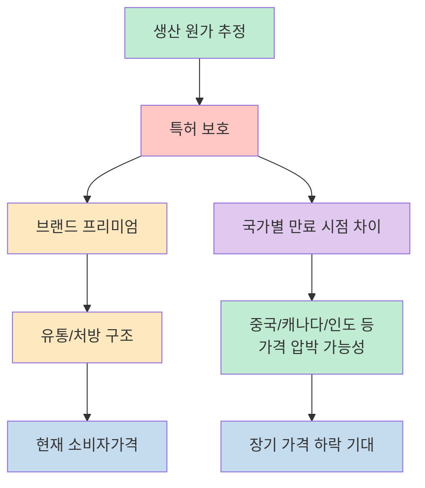
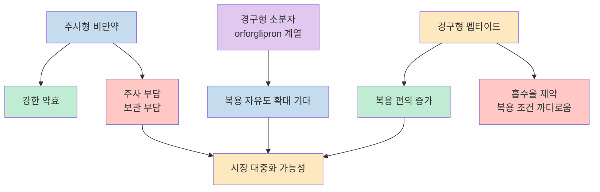
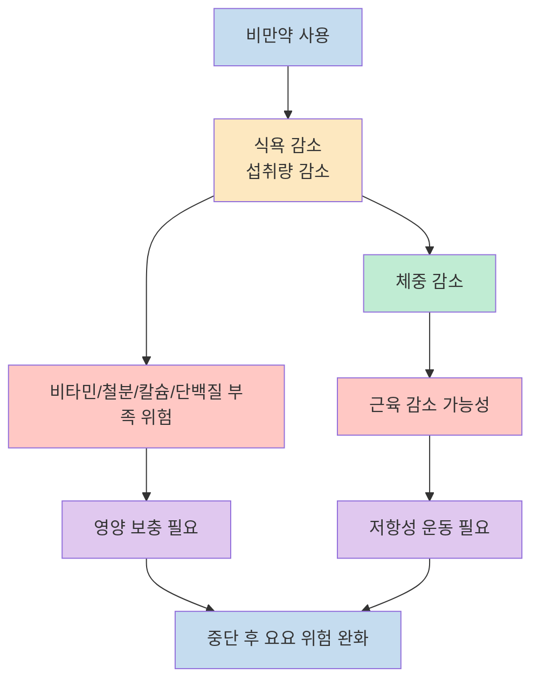
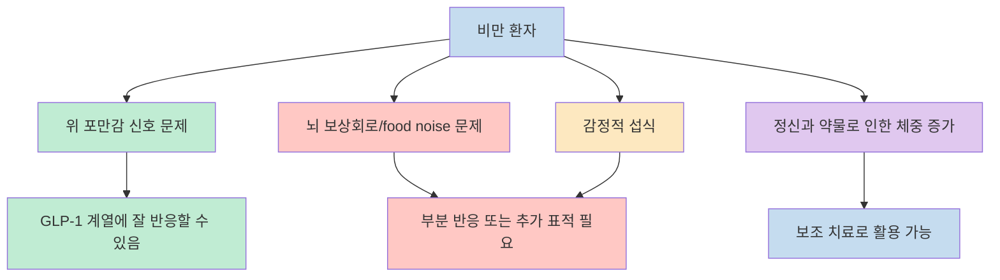
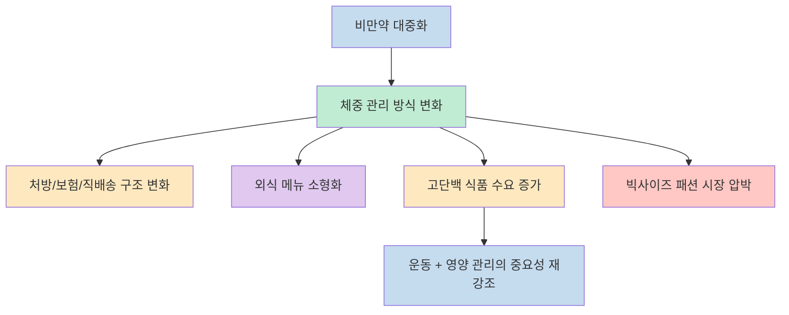

이 영상이 흥미로운 이유는 단순히 "살 빠지는 약이 있다"는 차원을 넘어서, 비만치료제가 `당뇨약 -> 비만약 -> 추가 적응증을 넓히는 플랫폼 약물`로 바뀌는 흐름을 한 번에 설명하기 때문입니다. 정재훈 약사는 이 흐름을 따라가며 약효 경쟁, 가격 하락, 경구제 확산, 영양 관리, 사회적 파급효과까지 한 덩어리로 묶어 보여 줍니다. [(1:15)](https://youtu.be/YVRsiXHox1I?t=75), [(7:20)](https://youtu.be/YVRsiXHox1I?t=440), [(17:00)](https://youtu.be/YVRsiXHox1I?t=1020)

다만 제목에 있는 "원가 7천원" 같은 표현은 그대로 소비자가격을 뜻하지 않습니다. 영상에서 말하는 것은 **대량 생산과 특허 만료 이후를 가정한 공급 원가 추정** 에 가깝고, 실제 시장 가격은 특허, 규제, 유통, 보험, 브랜드 파워, 처방 정책이 함께 결정합니다. 그래서 이 글은 영상을 그대로 옮기기보다 `약리 구조`, `시장 구조`, `실사용 조건`으로 다시 나눠서 정리해 보겠습니다. [(11:00)](https://youtu.be/YVRsiXHox1I?t=660), [(12:32)](https://youtu.be/YVRsiXHox1I?t=752)

<!--more-->

## Sources

- [비만약 원가 7천원 살찐 사람 사라집니다 (정재훈 약사) - YouTube](https://www.youtube.com/watch?v=YVRsiXHox1I)

## 당뇨약에서 비만약으로, 다시 다적응증 약으로 넓어지는 흐름

영상의 가장 중요한 출발점은 현재의 비만치료제가 처음부터 "비만만을 위한 약"으로 출발한 것이 아니라는 설명입니다. 발표자는 이 계열 약물이 당뇨 치료 과정에서 체중 감소 효과가 관찰되면서 비만 치료로 확장됐고, 이제는 수면무호흡증처럼 다른 질환 영역까지 적응증을 넓히는 중이라고 설명합니다. [(1:15)](https://youtu.be/YVRsiXHox1I?t=75), [(1:35)](https://youtu.be/YVRsiXHox1I?t=95)

이 설명은 외부 사실과도 크게 맞닿아 있습니다. 실제로 FDA는 2024년 Wegovy(semaglutide)에 대해 비만 또는 과체중과 심혈관질환이 있는 성인에서 심혈관 사망, 심근경색, 뇌졸중 위험을 낮추는 적응증을 추가 승인했고, 2024년 말에는 Eli Lilly가 Zepbound(tirzepatide)의 비만 동반 중등도-중증 폐쇄성 수면무호흡증 적응증 승인을 발표했습니다. 즉 영상의 핵심 메시지인 "이제 비만약은 체중만 보는 약이 아니다"는 표현은 과장이 섞여 있더라도 완전히 허공에 떠 있는 주장은 아닙니다. 다만 간 질환, 치매, 거의 만병통치약처럼 들리는 효과는 아직 연구와 축적이 더 필요한 영역으로 보는 편이 안전합니다. [(1:46)](https://youtu.be/YVRsiXHox1I?t=106), [(2:18)](https://youtu.be/YVRsiXHox1I?t=138), [FDA 발표](https://www.fda.gov/news-events/press-announcements/fda-approves-first-treatment-reduce-risk-serious-heart-problems-specifically-adults-obesity-or), [Lilly 발표](https://investor.lilly.com/news-releases/news-release-details/fda-approves-zepboundr-tirzepatide-first-and-only-prescription)

여기서 영상이 흥미로운 지점은 "살이 빠져서 다 좋아지는 것인지, 약 자체 효과가 따로 있는지"를 분리해서 말한다는 점입니다. 정재훈 약사는 대략 절반은 체중 감소, 절반은 약 자체 신호 작용일 수 있다는 식으로 설명하지만, 이것은 엄밀한 정량 결론이라기보다 연구자들이 보고 있는 방향을 쉽게 풀어낸 해설에 가깝습니다. 블로그 글로 옮길 때는 이 대목을 "약이 모든 걸 직접 고친다"가 아니라, **체중 감소 외의 추가 효과 가능성이 검증되면서 적응증이 넓어지는 중** 이라고 읽는 편이 정확합니다. [(1:52)](https://youtu.be/YVRsiXHox1I?t=112), [(2:05)](https://youtu.be/YVRsiXHox1I?t=125)

## 왜 위고비보다 마운자로가 더 강하게 보이느냐

영상은 비만약 경쟁 구도를 아주 단순한 언어로 풀어냅니다. 위고비는 GLP-1 단일 축, 마운자로/젭바운드는 GLP-1에 GIP를 더한 이중 작용, 레타트루타이드는 여기에 글루카곤 축까지 더한 삼중 작용으로 설명됩니다. 발표자는 이 차이를 통해 위고비가 대략 15% 감량, 마운자로는 20% 이상, 개발 중인 삼중 작용 약물은 더 높은 감량률을 보여 줄 가능성이 있다고 정리합니다. [(3:30)](https://youtu.be/YVRsiXHox1I?t=210), [(3:35)](https://youtu.be/YVRsiXHox1I?t=215), [(4:28)](https://youtu.be/YVRsiXHox1I?t=268)

중요한 것은 여기서 말하는 수치가 "모든 사람에게 똑같이 적용되는 평균 운명"이 아니라 임상시험과 환자군 구성, 투여 기간, 용량 설계에 영향을 받는 값이라는 점입니다. 영상 자체도 정체기, 개인차, 기존 체중 수준에 따라 실제 감량 폭은 크게 다를 수 있다고 덧붙입니다. 그래서 이 구간을 읽는 가장 좋은 방법은 **시장 경쟁의 방향** 을 보는 것입니다. 제약사는 단순히 "더 적게 먹게 만드는 약"을 만드는 것이 아니라, 서로 다른 호르몬 축을 조합해 더 오래, 더 강하게, 또는 더 넓은 환자군에서 효과를 내는 제품을 만들고 있습니다. [(4:02)](https://youtu.be/YVRsiXHox1I?t=242), [(6:20)](https://youtu.be/YVRsiXHox1I?t=380), [(6:42)](https://youtu.be/YVRsiXHox1I?t=402)

또 하나 놓치기 쉬운 포인트는 "후발주자가 반드시 역전하는 것은 아니다"라는 영상의 시장 해석입니다. 약효가 더 좋아 보여도 먼저 시장을 선점한 브랜드의 인지도, 공급망, 처방 경험, 환자 신뢰가 여전히 중요하다는 설명이 나옵니다. 이 점 때문에 국내 제약사의 후속 GLP-1 계열 신약이나 중국 제품을 볼 때도, 단순히 작용기전이 비슷하다는 이유만으로 같은 시장 성과를 기대하기는 어렵다는 결론이 자연스럽게 따라옵니다. [(5:25)](https://youtu.be/YVRsiXHox1I?t=325), [(49:05)](https://youtu.be/YVRsiXHox1I?t=2945), [(50:00)](https://youtu.be/YVRsiXHox1I?t=3000)

## 가격은 왜 내려갈 수 있나, 그리고 "원가 7천원"은 무엇을 뜻하나

영상에서 가장 자극적인 장면은 역시 "한 달치 원가가 7,000원 수준일 수 있다"는 대목입니다. 하지만 맥락은 분명합니다. 현재 한국에서 위고비/마운자로 계열의 체감 가격은 월 수십만 원대인데, 발표자는 중국의 가격 인하, 국가별 특허 만료 시점 차이, 향후 제네릭 경쟁, 그리고 대량 생산 이후의 추정 공급가를 연결해서 장기 가격 하락을 이야기합니다. [(9:18)](https://youtu.be/YVRsiXHox1I?t=558), [(9:27)](https://youtu.be/YVRsiXHox1I?t=567), [(10:52)](https://youtu.be/YVRsiXHox1I?t=652)

여기서 "7,000원"은 약국에서 소비자가 바로 내게 될 가격이 아니라, 논문이 추정한 지속가능한 공급 가격에 가까운 표현입니다. 실제로 외부에서도 semaglutide의 잠재 생산 원가가 현재 판매가보다 훨씬 낮을 수 있다는 분석이 계속 나오고 있습니다. 2026년 medRxiv 사전논문은 특허 만료 이후 generic semaglutide의 비용 범위를 추정했고, Yale School of Medicine이 소개한 2024년 분석 역시 GLP-1 계열 약의 생산비와 판매가 사이에 큰 간극이 있다고 지적했습니다. 즉 영상의 표현은 과장된 선동이라기보다, **특허와 유통이 가격을 크게 밀어 올리고 있다는 문제제기** 로 읽는 편이 맞습니다. [(11:00)](https://youtu.be/YVRsiXHox1I?t=660), [(11:32)](https://youtu.be/YVRsiXHox1I?t=692), [(12:32)](https://youtu.be/YVRsiXHox1I?t=752), [medRxiv 분석](https://www.medrxiv.org/content/10.64898/2026.03.04.26347508v1), [Yale 요약](https://medicine.yale.edu/news-article/prices-of-expensive-diabetes-medicines-and-weight-loss-drugs-are-drastically-higher-than-production-costs/)

동시에 영상은 가격 하락이 단순히 제네릭만의 결과가 아닐 수 있다고도 말합니다. 제약사 스스로 직배송형 채널을 만들거나, 초기부터 낮은 가격으로 시장을 넓히는 전략을 택하면 고가-저사용자 모델보다 저가-대량사용자 모델이 더 유리할 수 있다는 해석입니다. 이 부분은 정책과 실제 계약 구조를 더 확인해야 하는 영역이지만, 적어도 "비만약은 희소한 고가 특수치료제에서 대중 약으로 이동하려는 압력"을 받고 있다는 영상의 관찰은 설득력이 있습니다. [(17:32)](https://youtu.be/YVRsiXHox1I?t=1052), [(18:05)](https://youtu.be/YVRsiXHox1I?t=1085), [(42:10)](https://youtu.be/YVRsiXHox1I?t=2530)

## 먹는 비만약이 진짜 분기점으로 보이는 이유

영상에서 반복해서 강조되는 것은 "먹는 약이 나오면 사용자는 훨씬 더 늘어난다"는 전망입니다. 이유는 단순합니다. 주사제는 효과가 강하지만 심리적 장벽이 있고, 냉장 보관과 투여 경험이 필요하며, 일부 사용자에게는 매주 주사하는 행위 자체가 이탈 요인이 됩니다. 반면 경구제는 같은 약효가 아니더라도 진입 장벽을 크게 낮출 수 있습니다. [(14:10)](https://youtu.be/YVRsiXHox1I?t=850), [(15:18)](https://youtu.be/YVRsiXHox1I?t=918), [(16:00)](https://youtu.be/YVRsiXHox1I?t=960)

영상은 경구제 안에서도 둘을 구분합니다. 하나는 기존 펩타이드 계열을 먹는 형태로 만든 방식이고, 다른 하나는 Lilly의 orforglipron처럼 애초에 소분자 화합물로 설계된 경구 GLP-1 계열입니다. 발표자는 펩타이드 기반 경구제는 흡수율이 낮고 복용 제약이 많지만, 소분자 계열은 이런 제한에서 더 자유로울 수 있다고 설명합니다. 외부 자료를 보면 orforglipron은 2026년 3월 현재도 승인 약이 아니라 investigational drug이며, Lilly는 2025년 비만 대상 3상 결과와 2026년 추가 데이터를 바탕으로 규제 절차를 진행 중이라고 설명합니다. 즉 "먹는 비만약이 세상을 바꾼다"는 전망은 방향성으로는 맞더라도, 정확한 시판 시점과 가격은 아직 열려 있습니다. [(12:40)](https://youtu.be/YVRsiXHox1I?t=760), [(14:05)](https://youtu.be/YVRsiXHox1I?t=845), [(16:10)](https://youtu.be/YVRsiXHox1I?t=970), [Lilly orforglipron 설명](https://www.lilly.com/news/stories/what-to-know-about-orforglipron), [NEJM ATTAIN-1](https://www.nejm.org/doi/full/10.1056/NEJMoa2511774)

이 구간에서 특히 중요하게 봐야 할 것은 약효의 절대치보다 **사용자 기반이 어떻게 넓어지느냐** 입니다. 주사제 시절에는 "정말 필요한 사람" 중심이었다면, 경구제가 싸고 편해질수록 과체중, 경도 비만, 미용 수요, 예방 수요까지 경계가 계속 흐려질 수 있습니다. 영상 후반이 비만치료제를 영양제나 건강기능식품처럼 소비하게 되는 미래를 이야기하는 이유도 바로 이 접점에 있습니다. [(16:35)](https://youtu.be/YVRsiXHox1I?t=995), [(17:00)](https://youtu.be/YVRsiXHox1I?t=1020), [(24:05)](https://youtu.be/YVRsiXHox1I?t=1445)

## 부작용보다 더 중요한 것은 영양, 단백질, 근력운동, 중단 전략

영상은 비만약의 부작용을 무시하지 않지만, 더 길게 말하는 것은 사실 사용 조건입니다. 초기에 메스꺼움, 구토, 더부룩함, 음식이 오래 머무는 느낌 같은 전형적 위장관 부작용이 있을 수 있고, 일부는 너무 급격한 식욕 저하와 체중 감소 때문에 삶의 만족감이 떨어지거나 우울감, 피부 처짐을 느낄 수 있다고 설명합니다. 동시에 반대로 체중이 줄면서 자신감과 피부 상태가 개선됐다고 느끼는 사람도 있어, 경험은 개인차가 크다고 정리합니다. [(24:27)](https://youtu.be/YVRsiXHox1I?t=1467), [(24:40)](https://youtu.be/YVRsiXHox1I?t=1480), [(25:25)](https://youtu.be/YVRsiXHox1I?t=1525)

하지만 더 실무적인 포인트는 "적게 먹게 되면 영양 결핍도 함께 온다"는 대목입니다. 영상은 2026년 2월 기준 연구들을 인용하며 비타민 D, 철분, 칼슘, 단백질, 일부 비타민 B군 부족 가능성을 언급합니다. 그래서 종합비타민, 칼슘, 충분한 단백질, 그리고 특히 저항성 운동이 중요하다고 강조합니다. 이 지점은 매우 중요합니다. 약이 지방을 줄여 준다고 해도, 근육이 함께 빠지고 약을 끊었을 때 버텨 줄 생활 습관이 없으면 요요 위험은 여전히 큽니다. [(20:10)](https://youtu.be/YVRsiXHox1I?t=1210), [(21:05)](https://youtu.be/YVRsiXHox1I?t=1265), [(22:30)](https://youtu.be/YVRsiXHox1I?t=1350)

중단 전략도 흥미롭습니다. 영상은 약효가 서서히 떨어지는 특성 때문에 곧바로 끊기보다 간격을 늘리거나 용량을 점진적으로 줄이는 식의 접근이 현장에서 거론된다고 설명합니다. 다만 이 부분은 표준 공인 프로토콜로 확정됐다기보다 실제 처방 현장에서 관찰되는 흐름과 가설에 가깝습니다. 그러므로 블로그 독자 입장에서는 이를 "이렇게 해도 된다"가 아니라, **비만약은 시작만큼 중단 방식도 중요하다**는 정도로 받아들이는 것이 적절합니다. [(22:45)](https://youtu.be/YVRsiXHox1I?t=1365), [(23:20)](https://youtu.be/YVRsiXHox1I?t=1400)

## 왜 어떤 사람은 "위고비를 이긴다"고 말하나

영상에서 가장 인간적인 대목 중 하나는 "위고비를 이긴 사람들" 이야기입니다. 정재훈 약사는 실제로는 배가 부르지만 음식이 여전히 너무 맛있어서 먹는 것을 멈추지 못하는 사람들이 있고, 이를 일부 연구자들은 hungry brain, emotional eater 같은 하위 유형으로 설명한다고 말합니다. 즉 비만을 단일한 식욕 문제로 볼 수 없고, 위장관 포만감, 뇌의 보상회로, 감정적 섭식, 정신과 약물 부작용, 생활 습관이 서로 다른 층위에서 작동한다는 것입니다. [(32:15)](https://youtu.be/YVRsiXHox1I?t=1935), [(33:20)](https://youtu.be/YVRsiXHox1I?t=2000), [(35:22)](https://youtu.be/YVRsiXHox1I?t=2122)

이 대목이 중요한 이유는 "좋은 약이 나오면 비만은 끝난다"는 단선적 전망을 꺾어 주기 때문입니다. 어떤 사람에게는 위 배출 지연과 포만감 증가만으로 충분하지만, 다른 사람에게는 뇌의 음식 보상 신호, 우울감, 조현병 치료제의 체중 증가 부작용, 또는 감정 조절 문제가 훨씬 큰 변수일 수 있습니다. 그래서 영상 후반이 아밀린, 다중 작용제, 정신과 영역 처방 확대 같은 이야기를 자연스럽게 연결하는 것입니다. [(34:00)](https://youtu.be/YVRsiXHox1I?t=2040), [(36:10)](https://youtu.be/YVRsiXHox1I?t=2170), [(39:00)](https://youtu.be/YVRsiXHox1I?t=2340)

결국 이 섹션이 던지는 메시지는 간단합니다. **비만약은 강력하지만 만능은 아니다**. 그리고 바로 그 이유 때문에 앞으로도 더 복합적인 작용기전, 더 정교한 환자 분류, 더 세분화된 사용 전략이 계속 등장할 가능성이 큽니다. [(38:05)](https://youtu.be/YVRsiXHox1I?t=2285), [(39:20)](https://youtu.be/YVRsiXHox1I?t=2360)

## 이 약이 바꾸는 것은 체형만이 아니라 시장 구조일 수 있다

영상 후반부는 의학 설명에서 산업 구조 이야기로 넘어갑니다. 발표자는 항공사 연료 비용, 레스토랑 메뉴 구조, 단백질 식품 수요, 빅사이즈 패션 시장, 건강보험과 처방 문화까지 비만약의 파급효과를 넓게 상상합니다. 이 부분은 분명히 전망과 해석이 섞인 구간이지만, 핵심 논지는 분명합니다. 사람들이 장기간 체중을 줄이고 유지하는 방식이 약 중심으로 재편되면, 체중 문제를 전제로 돌아가던 여러 산업도 함께 움직일 수밖에 없다는 것입니다. [(27:35)](https://youtu.be/YVRsiXHox1I?t=1655), [(28:05)](https://youtu.be/YVRsiXHox1I?t=1685), [(42:35)](https://youtu.be/YVRsiXHox1I?t=2555), [(55:05)](https://youtu.be/YVRsiXHox1I?t=3305)

특히 재미있는 지점은 단백질 시장 이야기입니다. 영상은 비만약 확산이 단순히 음식 시장 전체를 줄이는 것이 아니라, 오히려 고단백 식품과 보충제 수요를 키울 수 있다고 봅니다. 이유는 명확합니다. 덜 먹더라도 근육은 지켜야 하고, 그 과정에서 단백질 중심 식품이 더 비싸고 더 중요한 위치를 차지하기 때문입니다. 이것은 비만약이 운동과 식품 시장을 완전히 대체하기보다, 오히려 그 시장을 `저칼로리`보다 `고단백·근육보존` 중심으로 재편할 수 있다는 뜻이기도 합니다. [(42:45)](https://youtu.be/YVRsiXHox1I?t=2565), [(43:20)](https://youtu.be/YVRsiXHox1I?t=2600), [(44:05)](https://youtu.be/YVRsiXHox1I?t=2645)

물론 여기에는 조심할 점도 있습니다. 영상이 묘사하는 미래는 어디까지나 **가격 인하, 공급 확대, 사회적 수용, 장기 안전성 데이터 축적** 이 모두 같은 방향으로 갈 때 가능한 시나리오입니다. 즉 "곧 살찐 사람이 사라진다"는 식의 문장은 영상 제목이자 비유적 과장으로 읽는 것이 맞고, 실제 현실은 국가별 규제, 보험, 처방 관행, 문화적 낙인, 약물 접근성 때문에 훨씬 더 비대칭적으로 전개될 가능성이 큽니다. [(54:10)](https://youtu.be/YVRsiXHox1I?t=3250), [(55:20)](https://youtu.be/YVRsiXHox1I?t=3320)

## 핵심 요약

- 이 영상의 핵심은 GLP-1 계열 비만치료제를 단순한 살 빼는 약이 아니라, **당뇨에서 출발해 비만과 추가 적응증으로 넓어지는 플랫폼 약물** 로 읽어야 한다는 점입니다. [(1:15)](https://youtu.be/YVRsiXHox1I?t=75), [(1:46)](https://youtu.be/YVRsiXHox1I?t=106)
- 위고비, 마운자로, 차세대 삼중 작용제의 차이는 결국 더 많은 호르몬 축을 건드려 더 강한 감량과 더 넓은 적용 가능성을 노리는 경쟁으로 볼 수 있습니다. [(3:30)](https://youtu.be/YVRsiXHox1I?t=210), [(4:28)](https://youtu.be/YVRsiXHox1I?t=268)
- "원가 7천원"은 현재 소비자가격이 아니라 특허 만료와 대량 생산 이후의 잠재 공급 원가 추정에 가까우며, 영상은 이 지점을 통해 가격 구조의 비대칭을 지적합니다. [(11:00)](https://youtu.be/YVRsiXHox1I?t=660), [(12:32)](https://youtu.be/YVRsiXHox1I?t=752)
- 먹는 비만약, 특히 복용 자유도가 높은 경구제는 시장 대중화의 가장 큰 분기점이 될 가능성이 있지만, 승인 시점과 가격은 아직 열려 있습니다. [(14:05)](https://youtu.be/YVRsiXHox1I?t=845), [(16:00)](https://youtu.be/YVRsiXHox1I?t=960)
- 실제 사용 단계에서는 부작용 자체보다도 **영양 결핍, 단백질 부족, 근손실, 중단 전략, 개인별 반응 차이** 를 어떻게 관리하느냐가 더 중요합니다. [(20:10)](https://youtu.be/YVRsiXHox1I?t=1210), [(22:30)](https://youtu.be/YVRsiXHox1I?t=1350), [(32:15)](https://youtu.be/YVRsiXHox1I?t=1935)

## 결론

이 영상을 보고 나면 비만치료제를 단순히 "살 빼는 주사"라고 부르기 어렵습니다. 지금 벌어지는 일은 약 하나의 유행이라기보다, 비만을 만성질환처럼 다루는 방식과 그 시장 구조가 함께 재편되는 과정에 더 가깝습니다. [(17:00)](https://youtu.be/YVRsiXHox1I?t=1020), [(41:05)](https://youtu.be/YVRsiXHox1I?t=2465)

그래서 정말 중요한 질문은 "이 약을 쓸까 말까" 이전에, **이 약이 어떤 사람에게 어떤 조건에서 얼마나 도움이 되고, 그 뒤의 생활 관리와 영양 전략까지 어떻게 묶어야 하는가** 입니다. 영상이 던지는 메시지도 결국 여기에 있습니다. 약효 경쟁과 가격 인하가 화려해 보여도, 장기적으로 결과를 가르는 것은 개인차를 이해하고 근육과 영양을 함께 관리하는 사용 방식입니다. [(22:30)](https://youtu.be/YVRsiXHox1I?t=1350), [(24:05)](https://youtu.be/YVRsiXHox1I?t=1445), [(55:00)](https://youtu.be/YVRsiXHox1I?t=3300)
