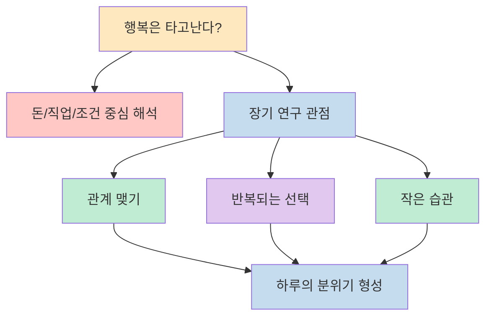
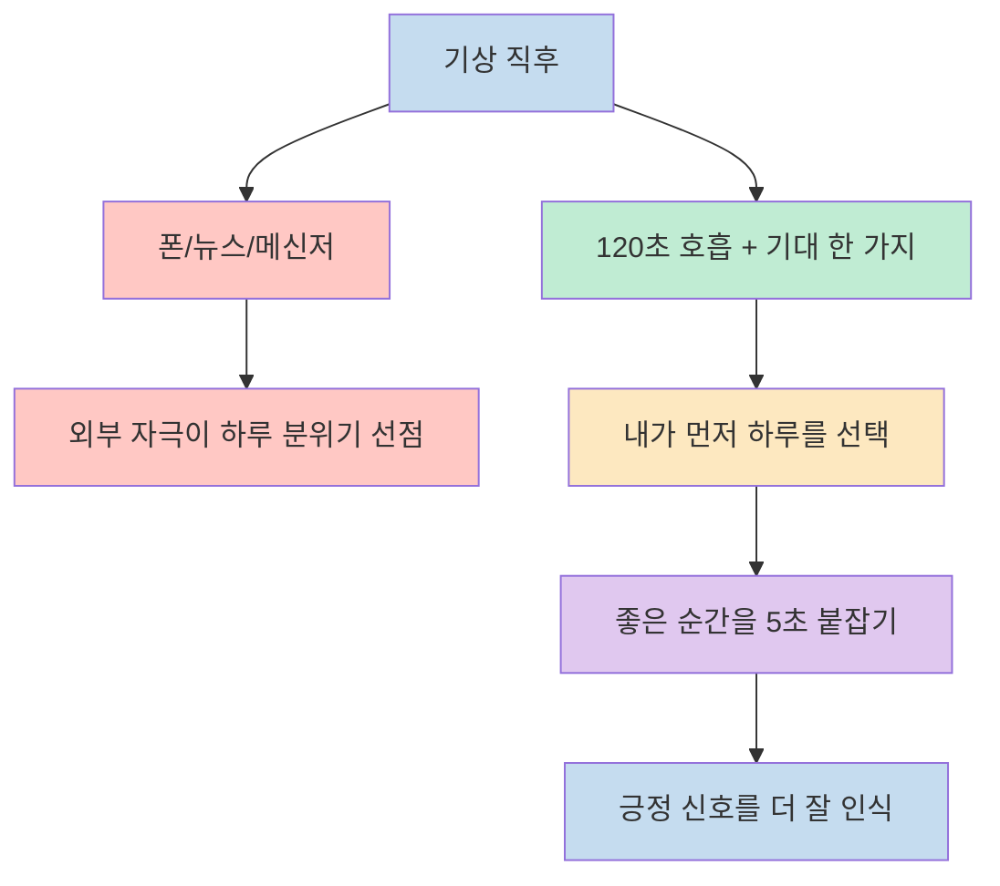
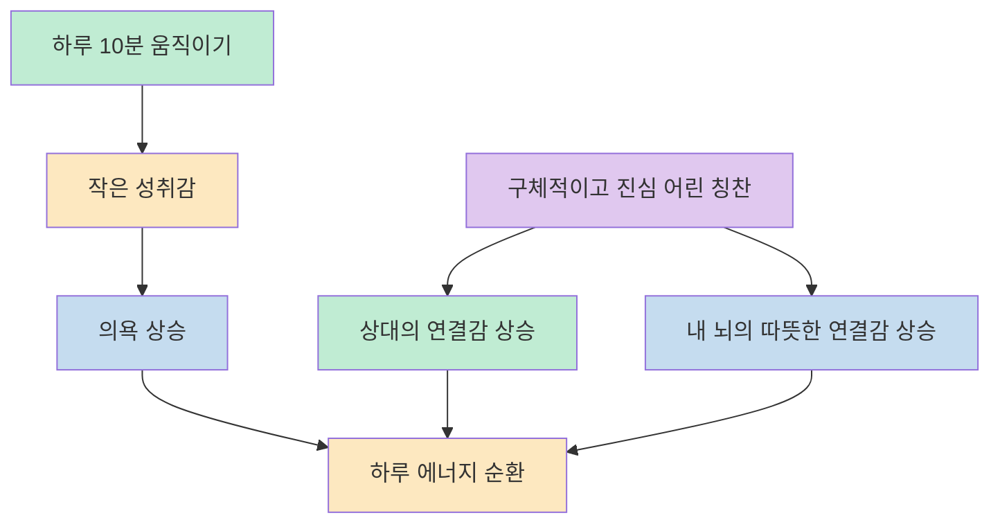
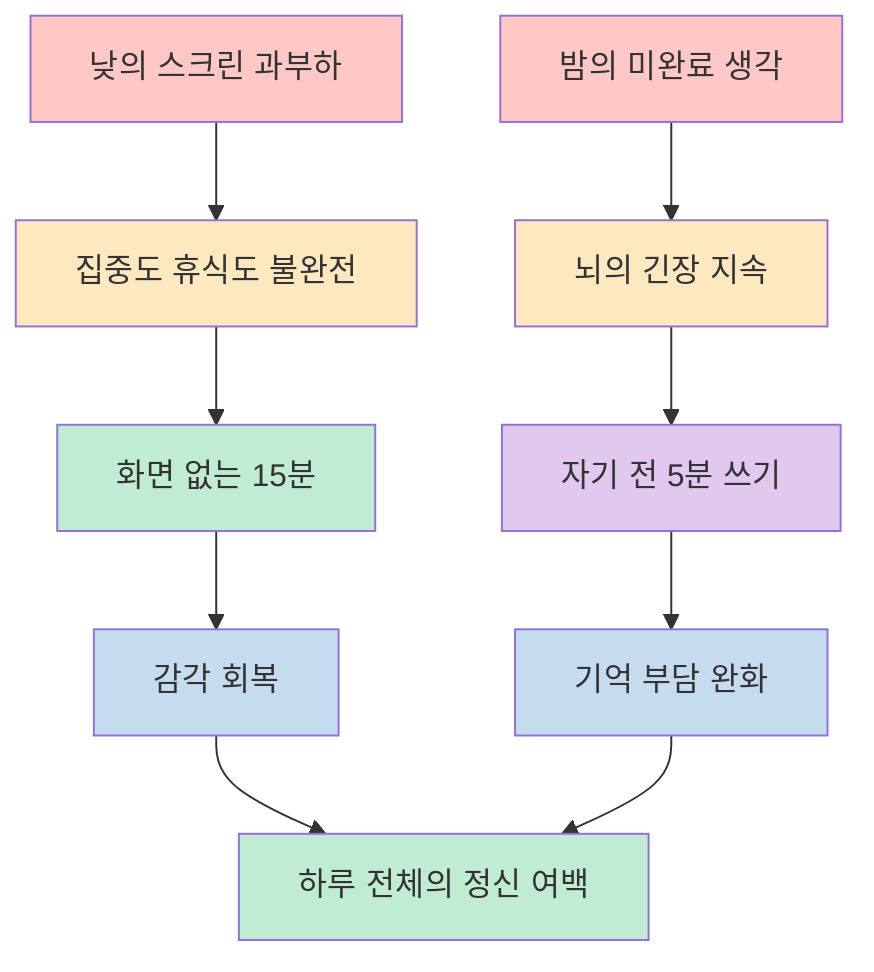
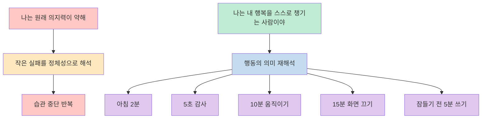

이 영상이 흥미로운 이유는 행복을 거대한 목표나 성취의 결과로 설명하지 않고, `아침에 무엇을 먼저 보느냐`, `좋은 순간을 몇 초라도 붙잡느냐`, `하루를 어떤 정체성으로 시작하느냐` 같은 아주 작은 반복으로 다시 정의하기 때문입니다. 영상은 하버드의 장기 연구를 근거로 행복이 돈이나 직업 같은 외적 조건보다 매일의 관계와 선택, 습관에 더 크게 달려 있다고 설명하고, 그 위에 7가지 실천 항목을 차례로 쌓아 올립니다. [(0:28)](https://youtu.be/XlJb23Jr7JU?t=28), [(0:36)](https://youtu.be/XlJb23Jr7JU?t=36), [(0:44)](https://youtu.be/XlJb23Jr7JU?t=44)

중요한 건 이 7가지가 모두 대단한 자기계발 루틴이 아니라는 점입니다. 영상이 반복해서 강조하듯 효과가 큰 이유는 어렵고 거창해서가 아니라, 너무 소소해서 매일의 해석 방식을 조금씩 바꿔 놓기 때문입니다. 그래서 이 글에서는 내용을 `연구의 핵심 메시지`, `하루의 시작을 바꾸는 습관`, `몸과 관계를 다루는 습관`, `디지털 과부하와 수면을 다루는 습관`, `마지막 정체성 습관`으로 재구성해 보겠습니다. [(0:49)](https://youtu.be/XlJb23Jr7JU?t=49), [(1:08)](https://youtu.be/XlJb23Jr7JU?t=68), [(9:31)](https://youtu.be/XlJb23Jr7JU?t=571)

<!--more-->

## Sources

- [당신이 놓친 행복의 비결 | 80년 연구가 밝힌 7가지 습관 - YouTube](https://www.youtube.com/watch?v=XlJb23Jr7JU)
- [Harvard Study of Adult Development](https://adultdevelopmentstudy.org/)

## 80년 연구가 말하는 행복의 출발점은 외적 조건보다 반복되는 관계와 선택이다

영상 도입부는 우리가 흔히 하는 오해부터 건드립니다. 행복한 사람들은 돈이 더 많거나, 직장이 더 좋거나, 가정이 더 화목해서 그렇게 보이는 것 아니냐는 질문입니다. 그런데 이어지는 설명은 방향을 바꿉니다. 영상은 하버드의 80년 장기 연구를 끌어와 행복을 결정하는 핵심이 외적 조건보다 `우리가 매일 어떻게 관계 맺고 어떤 선택과 습관을 반복하느냐`에 더 가깝다고 말합니다. [(0:19)](https://youtu.be/XlJb23Jr7JU?t=19), [(0:28)](https://youtu.be/XlJb23Jr7JU?t=28), [(0:41)](https://youtu.be/XlJb23Jr7JU?t=41)

이 프레임은 공식 Harvard Study of Adult Development 소개와도 잘 맞닿아 있습니다. 공식 사이트 역시 이 연구를 성인 발달과 웰빙을 장기간 추적해 온 연구로 소개하고, 최근 공개 자료에서도 관계의 중요성과 외적 성취의 상대적 한계를 반복해서 다룹니다. 즉 이 영상의 핵심은 "행복해지려면 인생을 통째로 갈아엎어야 한다"가 아니라, 행복은 작은 행동이 누적되어 만들어지는 생활 시스템이라는 점에 있습니다. [(0:44)](https://youtu.be/XlJb23Jr7JU?t=44), [Harvard Study of Adult Development](https://adultdevelopmentstudy.org/)

이 시점에서 이미 영상의 중요한 함의가 드러납니다. 행복은 감정 상태의 즉흥적 폭발이 아니라, 무엇을 먼저 보고 누구와 어떻게 연결되고 어떤 행동을 반복하느냐의 총합이라는 것입니다. 그래서 뒤에 나오는 7가지 습관도 각각 독립된 팁이 아니라, 하루의 해석 방식을 미세하게 조정하는 레버처럼 읽는 편이 더 정확합니다. [(0:51)](https://youtu.be/XlJb23Jr7JU?t=51), [(1:11)](https://youtu.be/XlJb23Jr7JU?t=71)

## 아침 2분과 5초 감사는 하루를 내가 먼저 해석하게 만든다

첫 번째 습관은 아주 작지만 구조적으로 강합니다. 영상은 많은 사람이 눈뜨자마자 카카오톡, 뉴스, 인스타그램 같은 외부 자극으로 하루를 시작한다고 말하고, 이때 아침의 높은 코르티솔 상태와 부정적 정보가 겹치면 스트레스 반응이 그대로 하루의 분위기가 되기 쉽다고 설명합니다. 그래서 제안하는 대안은 단순합니다. 눈을 뜨면 120초만 폰 대신 숨을 고르고, 오늘 기대되는 것 하나를 먼저 떠올리라는 것입니다. 핵심은 정보 차단 그 자체가 아니라 `세상이 내 머릿속을 채우기 전에 내가 먼저 하루를 선택한다`는 순서 전환에 있습니다. [(1:26)](https://youtu.be/XlJb23Jr7JU?t=86), [(1:46)](https://youtu.be/XlJb23Jr7JU?t=106), [(2:29)](https://youtu.be/XlJb23Jr7JU?t=149)

두 번째 습관인 `5초 감사`도 같은 원리 위에 놓여 있습니다. 영상은 감사일기처럼 무거운 형식보다, 좋은 순간이 왔을 때 5초만 멈춰 그 감각을 그대로 느껴 보라고 권합니다. 회사 식당 밥이 유난히 맛있었던 순간, 퇴근길 노을이 좋았던 순간, 집에 들어왔을 때 반겨 주는 존재가 있었던 순간을 그냥 흘리지 말라는 뜻입니다. 여기서 강조점은 기록보다 감각입니다. 행복한 사람은 좋은 일이 많아서 행복하다기보다, 좋은 일을 뇌가 지나치지 않도록 의도적으로 붙잡는 훈련을 하고 있다는 쪽에 가깝습니다. [(2:45)](https://youtu.be/XlJb23Jr7JU?t=165), [(3:07)](https://youtu.be/XlJb23Jr7JU?t=187), [(3:32)](https://youtu.be/XlJb23Jr7JU?t=212)

결국 이 두 습관은 하나의 묶음으로 읽을 수 있습니다. 아침 2분은 하루의 첫 해석권을 되찾는 행동이고, 5초 감사는 하루 중 좋은 순간을 놓치지 않게 만드는 감각 훈련입니다. 하나는 시작점을 바꾸고, 다른 하나는 도중의 인식 패턴을 바꿉니다. 둘 다 공통적으로 "행복은 큰 사건을 기다리는 일이 아니라, 일상 속 신호를 다르게 읽는 일"이라는 메시지를 밀어 줍니다. [(2:32)](https://youtu.be/XlJb23Jr7JU?t=152), [(3:37)](https://youtu.be/XlJb23Jr7JU?t=217), [(3:51)](https://youtu.be/XlJb23Jr7JU?t=231)

## 10분 움직이기와 진심 어린 칭찬은 몸과 관계를 동시에 순환시킨다

세 번째 습관은 "하루 10분 몸 움직이기"입니다. 영상은 운동 이야기가 나오면 사람들이 헬스장, 러닝화, 새벽 기상 같은 부담부터 떠올린다고 짚고, 그래서 오히려 시작을 미루게 된다고 말합니다. 하지만 여기서 제안하는 건 전문 운동 루틴이 아니라 아주 작은 신체 활성입니다. 회사 건물 한 바퀴 걷기, 집에서 스트레칭하기, 노래 한 곡에 맞춰 춤추기처럼 일상 속에 쉽게 끼워 넣을 수 있는 움직임이면 충분하다는 것이죠. 중요한 포인트는 행복한 사람이 매일 대단한 운동을 하는 게 아니라, 매일 몸을 조금씩 깨운다는 데 있습니다. [(4:01)](https://youtu.be/XlJb23Jr7JU?t=241), [(4:25)](https://youtu.be/XlJb23Jr7JU?t=265), [(5:07)](https://youtu.be/XlJb23Jr7JU?t=307)

영상은 이 습관의 효과를 단순 체력 관리가 아니라 `뇌에서 먼저 시작되는 변화`로 설명합니다. 규칙적으로 움직이는 사람은 괴로운 날이 덜 나타날 수 있고, 작은 성취감이 하루 전체의 의욕을 끌어올린다고 말합니다. 즉 여기서 운동은 몸매 관리 프로젝트가 아니라 감정 에너지를 움직이는 기계적 장치입니다. 작게 움직여도 매일 움직이면 "나는 오늘도 나를 방치하지 않았다"는 감각이 남고, 그 감각이 다음 행동의 마찰을 줄입니다. [(4:40)](https://youtu.be/XlJb23Jr7JU?t=280), [(4:46)](https://youtu.be/XlJb23Jr7JU?t=286), [(5:17)](https://youtu.be/XlJb23Jr7JU?t=317)

네 번째 습관인 `하루 한 사람에게 진심 어린 칭찬 건네기`는 관계의 흐름을 다루는 버전입니다. 영상은 우리 문화에서 칭찬이 어색하게 느껴질 수 있다고 말하지만, 여기서 말하는 칭찬은 피상적인 외모 칭찬이 아니라 구체적이고 실제 행동을 알아봐 주는 말입니다. "아까 그렇게 말할 용기가 있었다", "회의 끝나고 정리해 줘서 팀이 편했다"처럼 구체적인 언어일수록 관계의 온도를 바꾸는 힘이 커집니다. 그리고 흥미롭게도 영상은 이런 따뜻한 말이 상대뿐 아니라 말한 사람의 뇌에도 연결감과 안정감을 준다고 설명합니다. [(5:22)](https://youtu.be/XlJb23Jr7JU?t=322), [(5:42)](https://youtu.be/XlJb23Jr7JU?t=342), [(6:16)](https://youtu.be/XlJb23Jr7JU?t=376)

이 두 습관을 나란히 놓고 보면 재미있는 구조가 보입니다. 하나는 몸을 움직여 정서 에너지를 바깥으로 순환시키고, 다른 하나는 관계 언어를 바꿔 사회적 에너지를 순환시킵니다. 그래서 행복을 개인 내부의 기분 문제로만 보지 않고, `몸의 리듬`과 `관계의 온도`를 함께 조정하는 실천으로 확장하게 만듭니다. [(4:25)](https://youtu.be/XlJb23Jr7JU?t=265), [(6:24)](https://youtu.be/XlJb23Jr7JU?t=384), [(6:42)](https://youtu.be/XlJb23Jr7JU?t=402)

## 화면 없는 15분과 잠들기 전 5분은 뇌의 과부하를 줄이는 장치다

다섯 번째 습관은 `하루 15분 화면 없는 시간`입니다. 이 구간에서 영상은 스마트폰 사용 시간을 단순한 나쁜 습관이 아니라, 뇌가 완전히 집중하지도 쉬지도 못하는 상태를 오래 유지하게 만드는 구조적 문제로 설명합니다. 화면을 보는 동안 눈은 정보를 따라가고, 뇌는 계속 새로운 자극을 처리하고, 몸은 가만히 있어도 정신은 여기저기 떠돌아다닌다는 것이죠. 그래서 제안하는 해결책도 거창하지 않습니다. 하루 15분만 모든 화면을 끄고 밥을 먹거나, 산책하거나, 베란다에 멍하니 앉아 있으면서 현실 감각을 회복하라는 것입니다. [(6:48)](https://youtu.be/XlJb23Jr7JU?t=408), [(7:07)](https://youtu.be/XlJb23Jr7JU?t=427), [(7:39)](https://youtu.be/XlJb23Jr7JU?t=459)

여섯 번째 습관은 `잠들기 전 5분 뇌 비우기`입니다. 영상은 밤이 되면 상사에게 들은 말, 답장하지 않은 메시지, 내일 할 일, 심지어 오래전 창피했던 기억까지 한꺼번에 떠오르는 현상을 설명하며, 이것을 의지 부족이 아니라 끝나지 않은 일을 계속 붙드는 뇌의 특성으로 해석합니다. 그래서 자기 전에 5분만 머릿속에 남아 있는 것들을 종이에 꺼내 적으라고 권합니다. 할 일 목록이든 걱정거리든 상관없고, 정리나 해결보다 `밖으로 꺼내는 행위` 자체가 중요하다고 말합니다. [(8:07)](https://youtu.be/XlJb23Jr7JU?t=487), [(8:28)](https://youtu.be/XlJb23Jr7JU?t=508), [(8:41)](https://youtu.be/XlJb23Jr7JU?t=521)

둘을 연결해 보면 메시지는 더욱 또렷해집니다. 낮에는 스크린이 뇌를 계속 점유하고, 밤에는 미완료 감정과 할 일이 뇌를 계속 점유합니다. 행복한 상태를 만든다는 것은 결국 뇌가 쉴 시간을 의식적으로 비워 주는 일과도 연결됩니다. 낮의 15분은 감각 회복용 공간이고, 밤의 5분은 인지 정리용 공간입니다. 하나는 자극을 줄이고, 다른 하나는 잔여 생각을 배출합니다. [(7:27)](https://youtu.be/XlJb23Jr7JU?t=447), [(8:55)](https://youtu.be/XlJb23Jr7JU?t=535), [(9:22)](https://youtu.be/XlJb23Jr7JU?t=562)

## 마지막 일곱 번째 습관은 행동이 아니라 정체성을 고르는 일이다

영상이 일곱 번째 습관을 가장 중요하게 다루는 이유는 앞의 여섯 가지를 실제로 지속시키는 힘이 여기에 있다고 보기 때문입니다. 왜 우리는 좋은 습관을 알아도 며칠 못 가고 흐지부지될까요? 영상의 답은 단순합니다. 행동보다 정체성이 먼저이기 때문입니다. 내가 나를 어떤 사람으로 규정하느냐가 결국 선택의 방향을 정하고, "나는 원래 의지력이 약한 사람"이라는 자기 정의는 습관 실패를 계속 재생산한다는 것입니다. [(9:27)](https://youtu.be/XlJb23Jr7JU?t=567), [(9:46)](https://youtu.be/XlJb23Jr7JU?t=586), [(9:59)](https://youtu.be/XlJb23Jr7JU?t=599)

그래서 영상이 제안하는 마지막 습관은 단순한 자기 암시가 아니라, 매일 한 번 "나는 내 행복을 스스로 챙기는 사람이야"라고 말하는 정체성 문장입니다. 이 문장은 실천 항목을 직접 수행하지는 않지만, 앞선 6가지 행동의 의미를 바꿉니다. 아침 2분, 5초 감사, 10분 움직이기, 화면 없는 15분, 자기 전 5분이 모두 "귀찮은 숙제"가 아니라 `그런 사람인 내가 당연히 하는 일`로 재해석되기 시작하는 것이죠. [(10:10)](https://youtu.be/XlJb23Jr7JU?t=610), [(10:15)](https://youtu.be/XlJb23Jr7JU?t=615), [(10:47)](https://youtu.be/XlJb23Jr7JU?t=647)

이 구간에서 영상은 제임스 클리어의 정체성 습관 프레임도 끌어옵니다. 거창한 목표를 세우는 것보다 어떤 사람이 될지를 먼저 선택하고, 그 정체성에 맞는 행동을 조금씩 쌓는 편이 더 강력한 변화라는 설명입니다. 결국 행복을 위한 습관은 체크리스트 수행 능력보다 자기 인식의 방향과 더 깊게 연결됩니다. 그래서 이 마지막 습관은 앞선 여섯 가지의 요약이자 엔진처럼 작동합니다. [(10:24)](https://youtu.be/XlJb23Jr7JU?t=624), [(10:32)](https://youtu.be/XlJb23Jr7JU?t=632), [(11:06)](https://youtu.be/XlJb23Jr7JU?t=666)

## 핵심 요약

- 이 영상은 행복을 큰 성취의 결과보다 `관계와 선택이 반복되어 만들어지는 생활 패턴`으로 설명합니다. [(0:36)](https://youtu.be/XlJb23Jr7JU?t=36), [(0:44)](https://youtu.be/XlJb23Jr7JU?t=44)
- 앞의 여섯 가지 습관은 각각 따로 노는 팁이 아니라 `하루 시작`, `긍정 감각`, `몸의 리듬`, `관계의 언어`, `디지털 자극`, `수면 전 정리`를 조정하는 작은 레버입니다. [(1:26)](https://youtu.be/XlJb23Jr7JU?t=86), [(11:12)](https://youtu.be/XlJb23Jr7JU?t=672)
- 아침 2분과 5초 감사는 하루의 해석권을 외부 자극이 아니라 내가 먼저 쥐게 만드는 장치입니다. [(2:08)](https://youtu.be/XlJb23Jr7JU?t=128), [(3:37)](https://youtu.be/XlJb23Jr7JU?t=217)
- 10분 움직이기와 진심 어린 칭찬은 행복을 개인 감정이 아니라 몸과 관계의 순환 문제로 확장해서 보여 줍니다. [(4:25)](https://youtu.be/XlJb23Jr7JU?t=265), [(6:24)](https://youtu.be/XlJb23Jr7JU?t=384)
- 마지막 일곱 번째 습관은 정체성 문장입니다. "나는 내 행복을 스스로 챙기는 사람"이라는 자기 정의가 있어야 앞선 습관이 체크리스트가 아니라 생활 방식으로 굳습니다. [(9:46)](https://youtu.be/XlJb23Jr7JU?t=586), [(10:15)](https://youtu.be/XlJb23Jr7JU?t=615)

## 결론

이 영상이 주는 가장 실용적인 메시지는 행복이 특별한 날의 감정이 아니라, 평범한 하루의 순서를 어떻게 짜느냐에 달려 있다는 점입니다. 아침 2분, 5초, 10분, 15분, 잠들기 전 5분처럼 너무 작아서 우습게 보이는 단위들이 사실은 하루의 해석 방식을 바꾸는 최소 단위라는 것이죠. [(2:40)](https://youtu.be/XlJb23Jr7JU?t=160), [(7:39)](https://youtu.be/XlJb23Jr7JU?t=459), [(11:36)](https://youtu.be/XlJb23Jr7JU?t=696)

그래서 이 글을 읽고 바로 가져갈 질문도 단순합니다. "나는 더 행복해지기 위해 무엇을 새로 얻어야 하지?"가 아니라, **"나는 오늘 어떤 2분, 어떤 5초, 어떤 한 문장으로 내 하루를 먼저 선택할 것인가"** 입니다. 영상이 말하듯 완벽하게 다 하려 할 필요는 없습니다. 하나만 골라도, 그 하나가 반복되기 시작하면 삶의 분위기는 실제로 달라지기 시작합니다. [(11:47)](https://youtu.be/XlJb23Jr7JU?t=707), [(11:52)](https://youtu.be/XlJb23Jr7JU?t=712)
