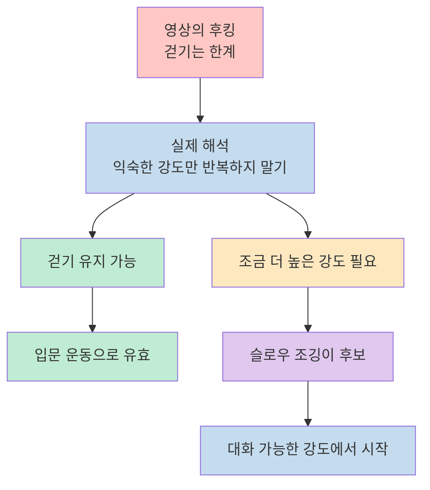
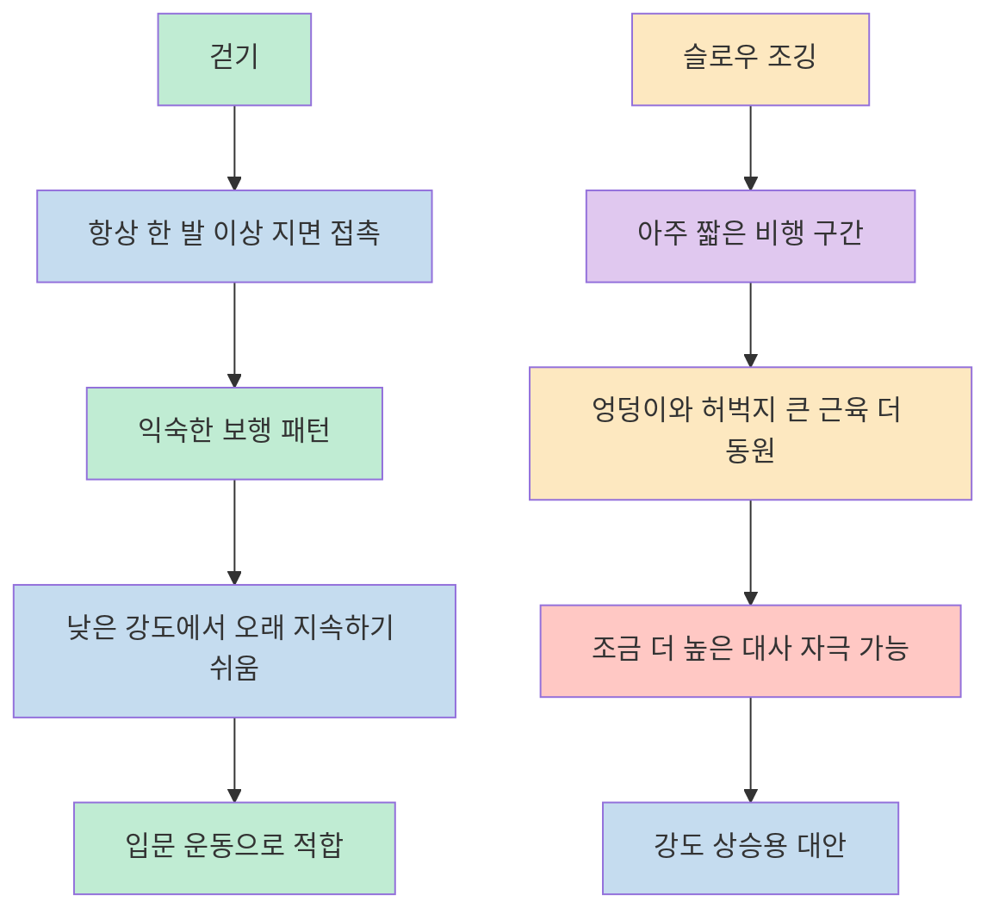
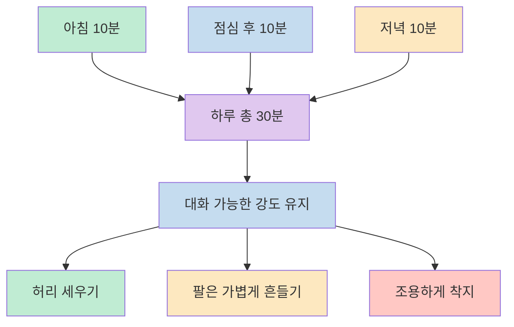
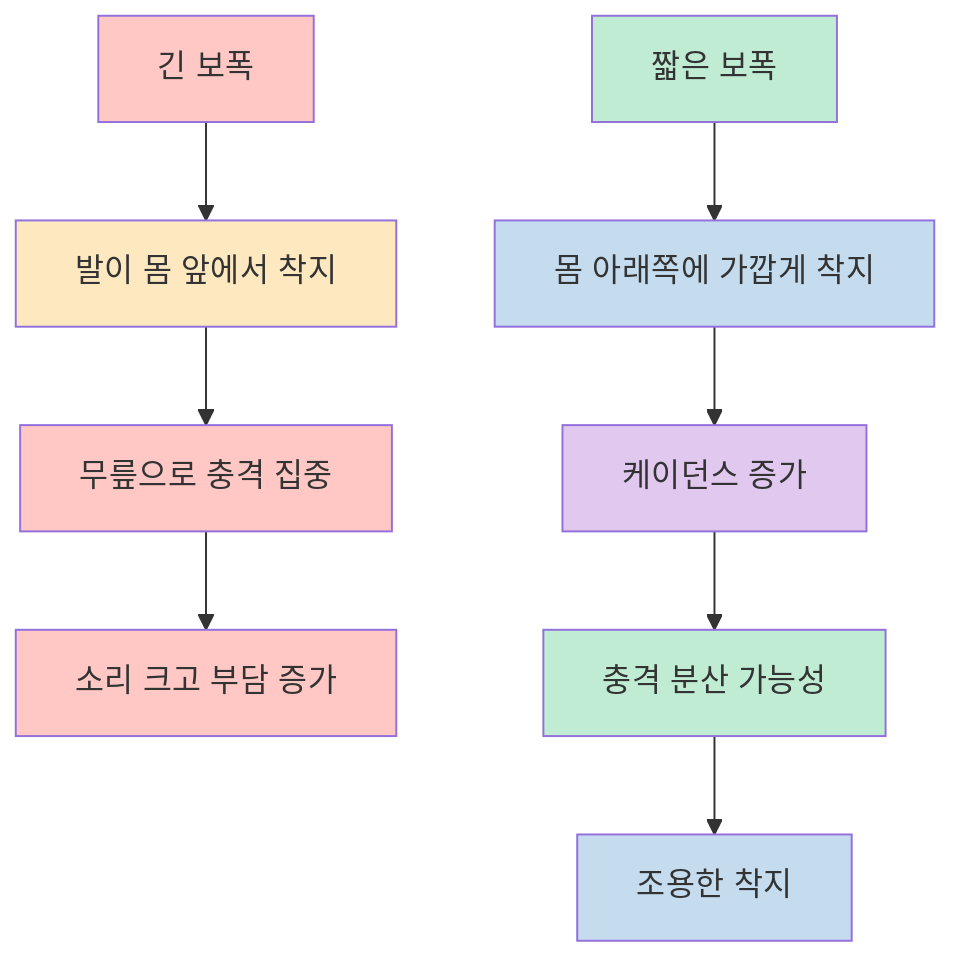
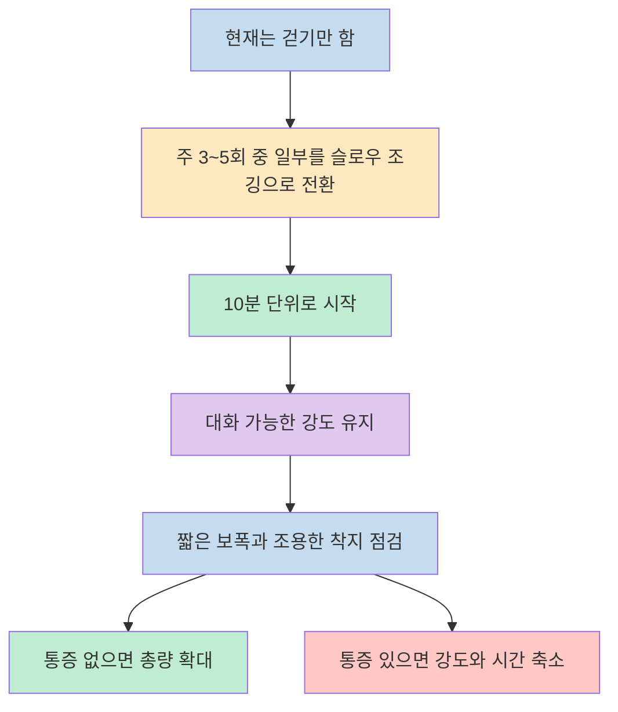

이 영상은 슬로우 조깅을 `걷기보다 에너지 소모는 높고`, `무릎 부담은 관리 가능하며`, `중장년 체중 관리에 특히 잘 맞는 운동`으로 소개합니다. 핵심 메시지는 단순합니다. 걷기만으로는 익숙해지기 쉬우니, 숨이 턱끝까지 차지 않는 아주 느린 조깅으로 강도를 한 단계만 올려 보라는 것입니다. [(0:16)](https://youtu.be/DoSExzi0qvQ?t=16), [(2:25)](https://youtu.be/DoSExzi0qvQ?t=145), [(4:54)](https://youtu.be/DoSExzi0qvQ?t=294)

다만 제목과 초반 후킹에 나오는 `113만 명`, `걷기의 두 배`, `걷기와 똑같은 충격` 같은 표현은 그대로 일반화해서 받아들이기엔 무리가 있습니다. 이 글에서는 영상을 `무엇을 주장하는가`, `그 메커니즘은 어디까지 타당한가`, `실제로 어떻게 적용할 것인가`, `어디서부터는 조심해야 하는가`로 나눠 다시 정리해 보겠습니다. [(0:13)](https://youtu.be/DoSExzi0qvQ?t=13), [(3:39)](https://youtu.be/DoSExzi0qvQ?t=219), [후쿠오카대 스로조깅 소개](https://www.spo.fukuoka-u.ac.jp/graduate/topics/faculty/1654/), [고령자 대상 슬로우 조깅 RCT](https://pubmed.ncbi.nlm.nih.gov/27848017/)

<!--more-->

## Sources

- [뼈마른 갱년기 일본인 113만명, 사실은 ‘이것’만 했다? - YouTube](https://www.youtube.com/watch?v=DoSExzi0qvQ)

## 걷기보다 낫다는 말은 "걷기는 소용없다"가 아니라 "강도를 한 단계 올리자"에 가깝다

영상은 걷기를 매우 비효율적인 운동처럼 몰아갑니다. 오래 걸어도 몸이 적응해 체중이 잘 안 빠지고, 특히 갱년기 이후에는 기초대사량과 근육량이 줄어들기 때문에 단순 걷기만으로는 부족하다는 식입니다. 이 주장의 방향 자체는 이해할 만하지만, 여기서 곧바로 "걷기는 의미 없다"로 넘어가면 과합니다. 영상의 더 정확한 요지는 `너무 익숙해서 편한 강도만 계속 반복하지 말라`는 쪽에 가깝습니다. [(0:54)](https://youtu.be/DoSExzi0qvQ?t=54), [(1:25)](https://youtu.be/DoSExzi0qvQ?t=85), [(2:15)](https://youtu.be/DoSExzi0qvQ?t=135)

실제로 공공 가이드라인은 여전히 걷기를 유효한 기본 운동으로 봅니다. 미국 보건부 신체활동 가이드는 성인에게 주당 150~300분의 중강도 유산소 활동을 권하고, 이때 활동은 반드시 10분 이상 이어져야만 인정되는 것도 아닙니다. 또 걷기 자체만으로도 혈압 개선 같은 이점이 확인돼 있습니다. 그러니 이 영상을 읽을 때는 `걷기 버리기`보다 `걷기에서 멈추지 않기`로 해석하는 편이 더 정확합니다. [Physical Activity Guidelines Q&A](https://odphp.health.gov/our-work/nutrition-physical-activity/physical-activity-guidelines/about-physical-activity-guidelines/questions-answers), [CDC short-bout analysis](https://www.cdc.gov/pcd/issues/2020/19_0321.htm), [걷기와 혈압 메타분석](https://pmc.ncbi.nlm.nih.gov/articles/PMC7616014/)

중장년 체중 관리 문맥에서 슬로우 조깅이 매력적으로 들리는 이유는 바로 이 중간 지점 때문입니다. 숨이 너무 차오르거나 관절이 버거운 수준까지 가지 않으면서도, 걷기보다 약간 더 높은 자극을 줄 수 있다는 설명이 붙기 때문입니다. 영상도 이 점을 반복합니다. "무조건 뛰라"가 아니라 "대화할 수 있을 정도로만 천천히 뛰라"는 식입니다. [(3:39)](https://youtu.be/DoSExzi0qvQ?t=219), [(5:28)](https://youtu.be/DoSExzi0qvQ?t=328), [(5:56)](https://youtu.be/DoSExzi0qvQ?t=356)

## 속도는 느려도 왜 걷기와 다른가

영상이 가장 강하게 미는 포인트는 `속도가 느려도 조깅은 걷기와 다른 동작`이라는 주장입니다. 설명 방식은 단순합니다. 걷기는 항상 한 발이 지면에 남아 있지만, 슬로우 조깅은 아주 짧게라도 두 발이 공중에 뜨는 구간이 생기고, 그 차이 때문에 허벅지와 엉덩이의 큰 근육을 더 쓰게 된다는 것입니다. [(2:40)](https://youtu.be/DoSExzi0qvQ?t=160), [(3:01)](https://youtu.be/DoSExzi0qvQ?t=181), [(3:18)](https://youtu.be/DoSExzi0qvQ?t=198)

이 설명은 완전히 허공에 떠 있는 말은 아닙니다. 후쿠오카대 연구진은 슬로우 조깅을 `걷는 속도 수준에서 1분 슬로우 조깅과 1분 걷기를 반복하는 저강도 프로그램`으로 설계해 고령자에게 적용했고, 12주 뒤 유산소 능력, 의자에서 일어나기 기능, 근육 구성 지표가 개선됐다고 보고했습니다. 즉 "천천히 뛰는 방식이 고령층에게도 수행 가능한 운동이 될 수 있다"는 점은 실제 연구에서도 어느 정도 뒷받침됩니다. [(2:25)](https://youtu.be/DoSExzi0qvQ?t=145), [(3:39)](https://youtu.be/DoSExzi0qvQ?t=219), [고령자 대상 슬로우 조깅 RCT](https://pubmed.ncbi.nlm.nih.gov/27848017/)

다만 여기서 바로 `걷기보다 에너지 소모가 정확히 두 배`라고 단정하면 안 됩니다. 보행과 달리기의 에너지 비용은 속도, 개인의 체력, 보폭, 지면 조건에 따라 달라집니다. 오래된 생리학 연구도 걷기와 달리기의 전환 지점에서 경제성이 바뀐다고 설명하지, 모든 사람에게 하나의 고정 배율을 제시하지는 않습니다. 그래서 이 영상에서 가져가야 할 문장은 "느리게 뛰어도 걷기와는 다른 자극이 생긴다"까지이고, "무조건 두 배 효율이다"는 마케팅 문장에 더 가깝다고 보는 편이 안전합니다. [(2:57)](https://youtu.be/DoSExzi0qvQ?t=177), [(3:26)](https://youtu.be/DoSExzi0qvQ?t=206), [walking-running transition 연구](https://pubmed.ncbi.nlm.nih.gov/7713073/)

## 중년 다이어트에서 중요한 건 "살만 빼기"보다 "근육을 덜 잃는 강도"다

영상 중반의 설명을 잘 보면, 발표자는 단순 체중 감량보다 `하체 근육을 지키면서 지방을 태우는 것`을 더 중요하게 놓습니다. 중년 이후 다이어트에서는 근육이 빠지기 쉬운데, 슬로우 조깅은 큰 하체 근육을 계속 쓰게 하니 지방만 줄이는 방향에 가깝다는 주장입니다. 이 논리는 체중계 숫자보다 체성분과 기능을 보라는 방향으로 읽을 때 의미가 있습니다. [(3:39)](https://youtu.be/DoSExzi0qvQ?t=219), [(4:08)](https://youtu.be/DoSExzi0qvQ?t=248), [(4:28)](https://youtu.be/DoSExzi0qvQ?t=268)

외부 연구도 이 지점을 완전히 부정하지는 않습니다. 앞서 본 고령자 슬로우 조깅 연구는 단순 체중 감소보다 유산소 능력과 근육 기능, 지방 침윤 감소를 같이 봤습니다. 즉 중장년 운동에서 중요한 것은 `얼마나 버틸 수 있는가`, `근육을 함께 유지할 수 있는가`, `생활 안에서 계속할 수 있는가`이지, 한 번의 운동으로 얼마나 극적으로 칼로리를 태웠는가만은 아닙니다. [(4:16)](https://youtu.be/DoSExzi0qvQ?t=256), [(4:36)](https://youtu.be/DoSExzi0qvQ?t=276), [고령자 대상 슬로우 조깅 RCT](https://pubmed.ncbi.nlm.nih.gov/27848017/)

영상에서 `심박수가 너무 높지 않아야 지방 연소 구간을 유지하기 쉽다`고 말하는 부분도 같은 맥락입니다. 이 대목은 세부 생리학을 간단히 풀어낸 설명으로 받아들이는 것이 좋습니다. 실제 현장에서는 절대 심박수 숫자 하나보다, 본인 수준에서 대화가 가능한지 같은 상대 강도 판단이 더 실용적입니다. 공공 가이드도 중강도 운동을 "대화는 가능하지만 노래는 어렵다"는 기준으로 설명합니다. [(3:47)](https://youtu.be/DoSExzi0qvQ?t=227), [(5:56)](https://youtu.be/DoSExzi0qvQ?t=356), [Move Your Way talk test](https://odphp.health.gov/moveyourway/activity-planner/why-these-goals), [Physical Activity Guidelines Q&A](https://odphp.health.gov/our-work/nutrition-physical-activity/physical-activity-guidelines/about-physical-activity-guidelines/questions-answers)

## 영상이 주는 실행 공식은 "10분씩 나누기 + 니코니코 페이스 + 조용한 착지"다

실전 파트에서 영상이 주는 메시지는 의외로 단순합니다. 30분 연속으로 해야 한다고 겁먹지 말고, 처음에는 10분씩 세 번으로 나눠도 된다는 것입니다. 아침 10분, 점심 이후 10분, 저녁 10분처럼 잘게 끊어도 총량을 채우면 된다는 설명은 실제 공공 가이드와도 크게 충돌하지 않습니다. 최신 가이드는 중강도 이상 활동은 짧은 구간으로 쪼개도 총량에 포함된다고 보기 때문입니다. [(4:54)](https://youtu.be/DoSExzi0qvQ?t=294), [(5:06)](https://youtu.be/DoSExzi0qvQ?t=306), [(5:20)](https://youtu.be/DoSExzi0qvQ?t=320), [CDC short-bout analysis](https://www.cdc.gov/pcd/issues/2020/19_0321.htm)

자세 설명도 일관됩니다. 허리를 세우고, 시선은 약간 멀리 두고, 팔은 힘을 빼고 가볍게 흔들고, 숨이 턱끝까지 차지 않게 속도를 낮추라는 것입니다. 특히 영상이 강조하는 `니코니코 페이스`는 결국 말하면서 할 수 있는 강도라는 뜻이고, 이는 공공 가이드의 talk test와 거의 같은 방향입니다. 수치를 외우기보다 이 감각을 기준으로 삼으라는 조언은 꽤 실용적입니다. [(5:28)](https://youtu.be/DoSExzi0qvQ?t=328), [(5:46)](https://youtu.be/DoSExzi0qvQ?t=346), [(6:00)](https://youtu.be/DoSExzi0qvQ?t=360), [Move Your Way talk test](https://odphp.health.gov/moveyourway/activity-planner/why-these-goals)

또 하나 눈여겨볼 부분은 `조용한 착지`입니다. 영상은 발이 쾅쾅 닿는 소리가 나면 안 된다고 반복하는데, 이 포인트는 사실 보폭과 연결됩니다. 느린 속도를 유지하더라도 착지가 무겁고 앞에 멀리 발을 던지는 식이면 슬로우 조깅의 장점이 줄어듭니다. 이 영상을 따라 한다면 결국 핵심은 속도보다 `리듬과 착지 방식`에 있습니다. [(6:08)](https://youtu.be/DoSExzi0qvQ?t=368), [(6:23)](https://youtu.be/DoSExzi0qvQ?t=383), [(6:44)](https://youtu.be/DoSExzi0qvQ?t=404)

## 짧은 보폭이 무릎 부담을 낮춘다는 설명은 꽤 설득력 있지만, "누구에게나 안전"을 뜻하지는 않는다

영상 후반의 가장 중요한 기술적 포인트는 `보폭을 줄이고 발을 자주 구르라`는 부분입니다. 설명 방식은 명확합니다. 보폭이 길어지면 발이 몸보다 앞에서 닿으며 충격이 무릎으로 크게 올라가고, 보폭이 짧아지면 착지가 몸의 무게중심 아래쪽에 가까워져 충격을 하체 전체로 분산하기 쉽다는 것입니다. 이게 영상이 말하는 "무릎은 지키면서 지방은 태운다"의 핵심 논리입니다. [(6:57)](https://youtu.be/DoSExzi0qvQ?t=417), [(7:26)](https://youtu.be/DoSExzi0qvQ?t=446), [(8:16)](https://youtu.be/DoSExzi0qvQ?t=496)

이 부분은 외부 문헌과도 비교적 잘 맞습니다. 2025년 체계적 문헌고찰은 러닝에서 케이던스를 5~10% 높이면 보폭이 짧아지고, 수직 지면반력과 로딩 레이트가 줄며, 무릎과 고관절 스트레스가 낮아지는 경향을 일관되게 보고합니다. 즉 영상의 `짧은 보폭 + 잦은 발놀림` 설명은 생체역학적으로 꽤 그럴듯한 방향입니다. [(7:18)](https://youtu.be/DoSExzi0qvQ?t=438), [(7:34)](https://youtu.be/DoSExzi0qvQ?t=454), [cadence systematic review](https://pubmed.ncbi.nlm.nih.gov/40964543/)

하지만 여기서도 선을 그어야 합니다. 짧은 보폭이 무릎 부하를 낮추는 경향이 있다는 것과, 이미 통증이 있거나 골관절염이 진행 중인 사람이 영상만 보고 곧바로 달리기를 시작해도 안전하다는 말은 전혀 다릅니다. 통증이 있는 사람, 최근 낙상이나 부상 이력이 있는 사람, 어지럼증이나 흉통이 있는 사람은 슬로우 조깅을 운동 "처방"처럼 받아들이기보다 의료진이나 물리치료사와 시작 강도를 먼저 상의하는 편이 맞습니다. [(8:16)](https://youtu.be/DoSExzi0qvQ?t=496), [(8:48)](https://youtu.be/DoSExzi0qvQ?t=528), [Physical Activity in Older Adults review](https://pmc.ncbi.nlm.nih.gov/articles/PMC11562269/)

## 실전 적용 포인트

이 영상을 실제 루틴으로 바꾸려면 핵심은 네 가지입니다. 첫째, 걷기가 틀렸다고 생각하지 말고 현재 내 몸이 버틸 수 있는 기본 유산소 운동 위에 슬로우 조깅을 덧대는 방식으로 접근해야 합니다. 둘째, 처음부터 30분 연속이 아니라 10분 단위로 쪼개도 충분합니다. 셋째, 속도보다 대화 가능 여부와 조용한 착지를 더 중요하게 봐야 합니다. 넷째, 무릎이 아프면 참고 버티는 운동이 아니라 보폭, 시간, 빈도를 다시 줄여야 합니다. [(4:54)](https://youtu.be/DoSExzi0qvQ?t=294), [(5:28)](https://youtu.be/DoSExzi0qvQ?t=328), [(6:57)](https://youtu.be/DoSExzi0qvQ?t=417), [Physical Activity Guidelines Q&A](https://odphp.health.gov/our-work/nutrition-physical-activity/physical-activity-guidelines/about-physical-activity-guidelines/questions-answers)

개인적으로 이 영상에서 가장 건질 만한 문장은 `운동 강도를 올리되, 겁먹지 않을 만큼만 올리라`는 부분입니다. 반대로 걸러야 할 문장은 `일본 사람들은 그래서 다 날씬하다`, `이 운동이면 무릎 걱정이 거의 없다`, `걷기의 두 배 효율이다` 같은 과장된 압축 문구입니다. 블로그 독자 입장에서 유용한 것은 후킹 숫자가 아니라, `짧은 보폭`, `대화 가능한 강도`, `짧게 나눠도 되는 총량 개념`입니다. [(0:16)](https://youtu.be/DoSExzi0qvQ?t=16), [(3:39)](https://youtu.be/DoSExzi0qvQ?t=219), [(8:48)](https://youtu.be/DoSExzi0qvQ?t=528)

영상 마지막의 메시지도 같은 결론으로 이어집니다. 좋은 운동 하나를 찾았다고 해서 일상 습관 문제가 자동으로 사라지는 것은 아니라는 점입니다. 발표자는 무릎을 망치는 생활 습관을 먼저 확인하라고 말하는데, 이 대목은 과장 없이 받아들일 만합니다. 운동 한 가지가 모든 문제를 덮는다고 생각하기보다, 활동량과 체중, 수면, 일상 자세를 함께 묶어 보는 것이 결국 더 오래 갑니다. [(9:08)](https://youtu.be/DoSExzi0qvQ?t=548), [(9:27)](https://youtu.be/DoSExzi0qvQ?t=567)

## 핵심 요약

- 이 영상의 핵심은 `걷기를 버리라`가 아니라 `익숙한 강도보다 아주 조금 더 높은 자극을 안전하게 올려 보라`는 제안입니다. [(0:54)](https://youtu.be/DoSExzi0qvQ?t=54), [(2:25)](https://youtu.be/DoSExzi0qvQ?t=145)
- 슬로우 조깅은 느린 속도여도 걷기와 다른 동작 패턴을 만들 수 있고, 고령자 대상 연구에서도 수행 가능성과 기능 개선 신호가 보고됐습니다. [(2:40)](https://youtu.be/DoSExzi0qvQ?t=160), [고령자 대상 슬로우 조깅 RCT](https://pubmed.ncbi.nlm.nih.gov/27848017/)
- 다만 `걷기의 정확히 두 배`, `걷기와 같은 충격` 같은 표현은 모든 사람에게 그대로 적용되는 법칙으로 보면 안 됩니다. [(3:18)](https://youtu.be/DoSExzi0qvQ?t=198), [walking-running transition 연구](https://pubmed.ncbi.nlm.nih.gov/7713073/)
- 실제로 써먹을 포인트는 `10분씩 나누기`, `대화 가능한 강도`, `짧은 보폭`, `조용한 착지` 네 가지입니다. [(4:54)](https://youtu.be/DoSExzi0qvQ?t=294), [(5:56)](https://youtu.be/DoSExzi0qvQ?t=356), [(6:57)](https://youtu.be/DoSExzi0qvQ?t=417)
- 무릎 통증이나 질환이 이미 있는 사람은 영상 설명을 만능 처방으로 받아들이지 말고, 시작 강도와 방식부터 개별화해야 합니다. [(8:16)](https://youtu.be/DoSExzi0qvQ?t=496), [Physical Activity in Older Adults review](https://pmc.ncbi.nlm.nih.gov/articles/PMC11562269/)

## 결론

이 영상을 가장 생산적으로 읽는 방법은 "일본 중년들이 다 이 운동만 해서 날씬하다"는 홍보 문구를 믿는 것이 아닙니다. 오히려 `걷기와 달리기 사이 어딘가에, 겁먹지 않고 오래 가져갈 수 있는 강도가 있다`는 힌트를 얻는 쪽이 더 유용합니다. 슬로우 조깅은 그 중간 지점을 설명하는 하나의 방법으로 볼 만합니다. [(0:16)](https://youtu.be/DoSExzi0qvQ?t=16), [(9:00)](https://youtu.be/DoSExzi0qvQ?t=540)

결국 중요한 것은 이름보다 실행 방식입니다. 걷기에서 출발하든 슬로우 조깅에서 출발하든, 대화 가능한 강도와 짧은 보폭, 꾸준히 쌓이는 총량, 그리고 통증 신호를 무시하지 않는 태도까지 묶여야 이 운동이 중장년에게 실제로 도움이 됩니다. 영상의 과장을 덜어 내고 나면, 남는 핵심도 결국 그 정도입니다. [(5:20)](https://youtu.be/DoSExzi0qvQ?t=320), [(6:57)](https://youtu.be/DoSExzi0qvQ?t=417), [(8:48)](https://youtu.be/DoSExzi0qvQ?t=528)
