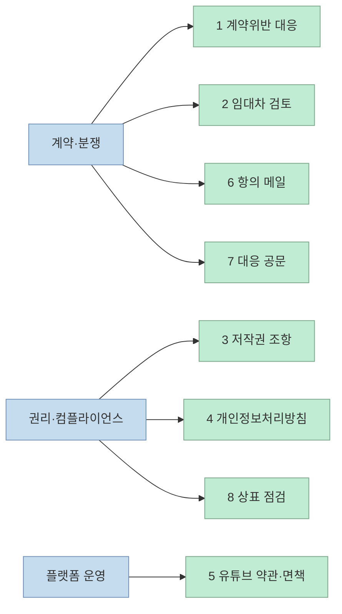
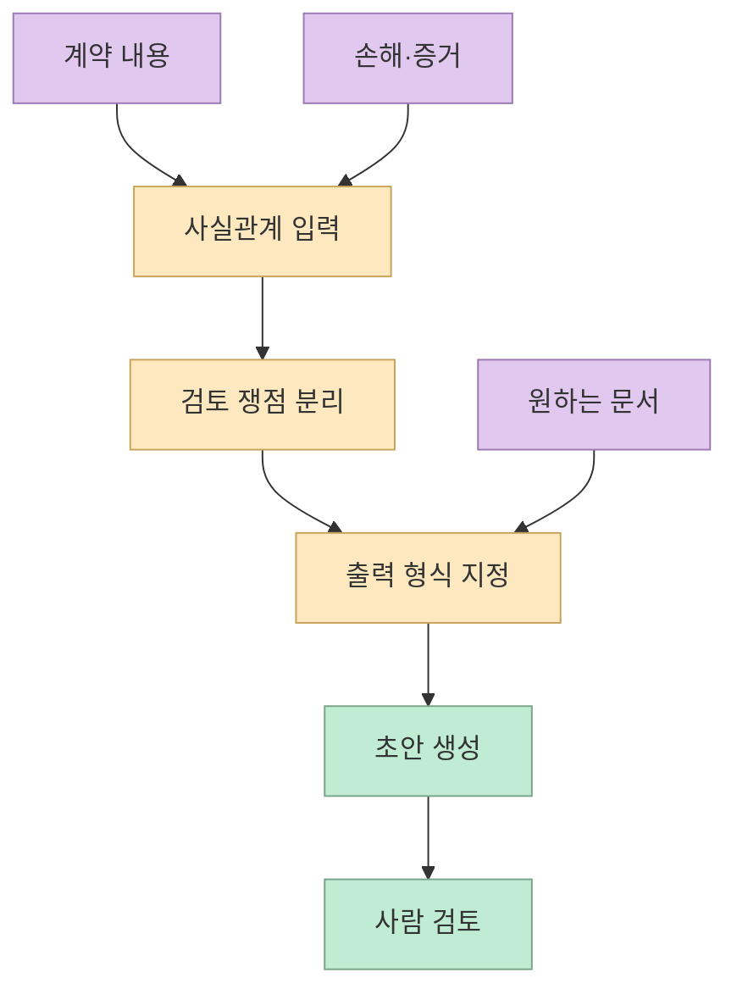
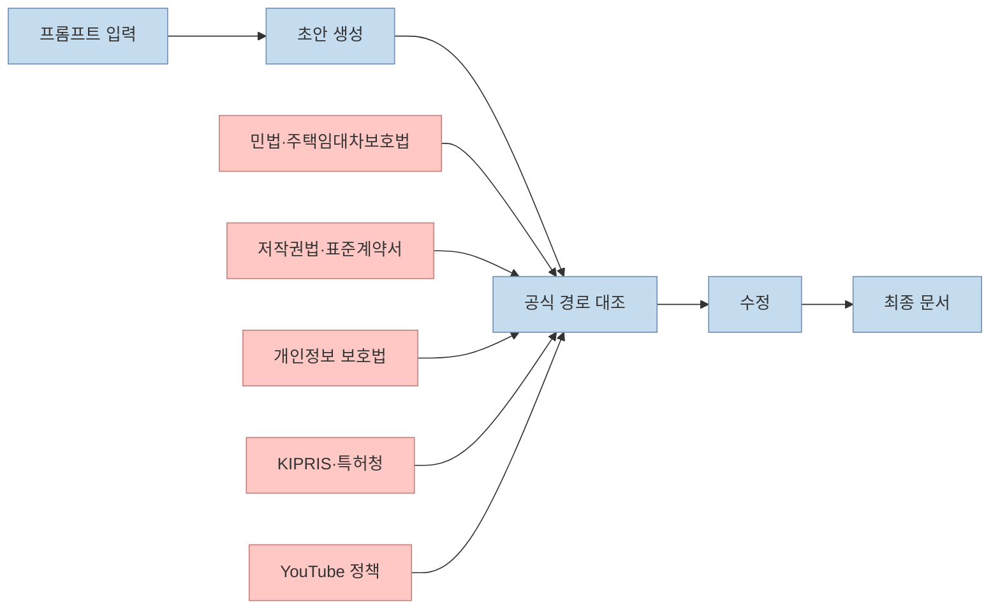
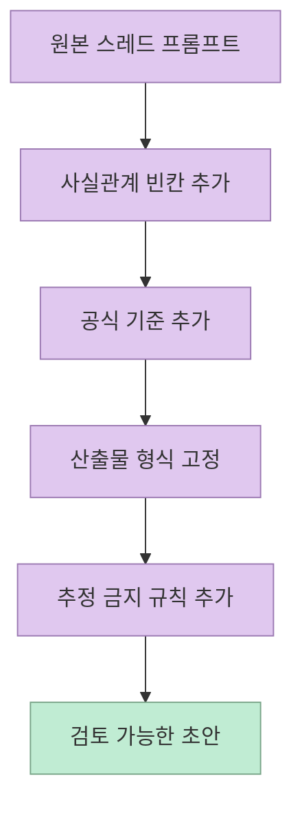
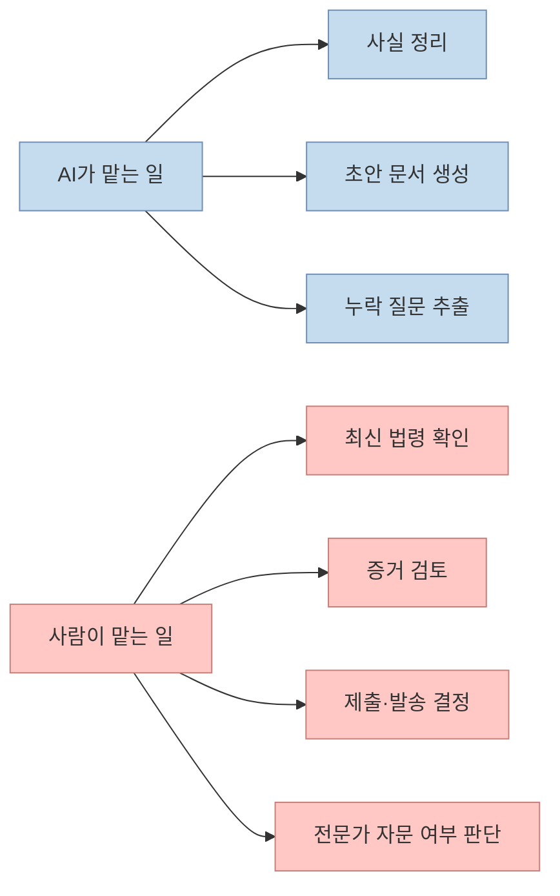

이 Threads 스레드가 흥미로운 이유는 "법률 상담을 AI가 대신한다"는 자극적인 문구보다, 반복적으로 발생하는 법률 업무를 `입력 템플릿` 으로 잘게 쪼개 두었다는 점에 있습니다. 루트 포스트는 "변호사 없이 승소한 사례"를 전면에 내세우지만, 스레드 안에는 사건명, 판결문, 기사 링크가 제시되지 않습니다. 그래서 이 글은 그 주장 자체를 검증하는 글이 아니라, 공개된 8개 프롬프트를 어떤 방식으로 재구성하면 실제 초안 작성 도구로 쓸 수 있는지를 정리하는 글입니다.

핵심은 단순합니다. ChatGPT에게 "법적으로 문제 없게 해줘"라고 던지는 순간 답변은 뭉개지기 쉽습니다. 반대로 사실관계, 검토축, 원하는 산출물, 확인해야 할 공식 경로를 함께 넣으면 결과는 훨씬 쓸모 있는 초안에 가까워집니다. 특히 법률 영역은 그대로 제출하는 답을 받는 곳이 아니라, 초안을 빠르게 만들고 사람이 검토 포인트를 좁히는 데 AI를 써야 하는 영역입니다.

<!--more-->

## Sources

- 입력 스레드 루트: [human__bro Threads 루트 포스트](https://www.threads.com/@human__bro/post/DWL7YkzkiR_)
- 스레드 1번 프롬프트: [계약 위반 대응](https://www.threads.com/@human__bro/post/DWL7bHGEukf)
- 스레드 2번 프롬프트: [임대차 계약 검토](https://www.threads.com/@human__bro/post/DWL7dpIkrij)
- 스레드 3번 프롬프트: [저작권 계약 조항](https://www.threads.com/@human__bro/post/DWL7fpGElzF)
- 스레드 4번 프롬프트: [개인정보처리방침 작성](https://www.threads.com/@human__bro/post/DWL7htcEgy4)
- 스레드 5번 프롬프트: [유튜브 채널 약관과 면책](https://www.threads.com/@human__bro/post/DWL7kYuEr35)
- 스레드 6번 프롬프트: [항의 메일과 대응문](https://www.threads.com/@human__bro/post/DWL7mi4Evoj)
- 스레드 7번 프롬프트: [거래처 갑질 대응 공문](https://www.threads.com/@human__bro/post/DWL7orKEtfH)
- 스레드 8번 프롬프트: [상표 등록 준비와 유사 상표 점검](https://www.threads.com/@human__bro/post/DWL7q2iEreD)
- 국가법령정보센터: [민법](https://www.law.go.kr/%EB%B2%95%EB%A0%B9/%EB%AF%BC%EB%B2%95)
- 국가법령정보센터: [주택임대차보호법](https://www.law.go.kr/%EB%B2%95%EB%A0%B9/%EC%A3%BC%ED%83%9D%EC%9E%84%EB%8C%80%EC%B0%A8%EB%B3%B4%ED%98%B8%EB%B2%95)
- 국가법령정보센터: [저작권법](https://www.law.go.kr/%EB%B2%95%EB%A0%B9/%EC%A0%80%EC%9E%91%EA%B6%8C%EB%B2%95)
- 국가법령정보센터: [개인정보 보호법](https://www.law.go.kr/%EB%B2%95%EB%A0%B9/%EA%B0%9C%EC%9D%B8%EC%A0%95%EB%B3%B4%EB%B3%B4%ED%98%B8%EB%B2%95)
- 한국저작권위원회: [저작권 표준계약서와 민원 서식](https://www.copyright.or.kr/customer-center/download-service/customer-support-form/index.do)
- KIPRIS: [상표 검색 공식 사이트](https://www.kipris.or.kr/khome/main.jsp)
- 특허청: [지식재산 행정 공식 포털](https://www.patent.go.kr/)
- YouTube 고객센터: [유료 PPL, 스폰서십, 직접 광고 추가](https://support.google.com/youtube/answer/154235?hl=ko)
- YouTube 고객센터: [저작권 삭제 요청 제출하기](https://support.google.com/youtube/answer/2807622?hl=ko)

## Threads 원문 기준 8개 프롬프트 정리

아래는 스레드에 올라온 8개 프롬프트를 읽기 쉽게 정리한 버전입니다. 각 프롬프트는 설명 없이 코드블록으로 그대로 모아 두었습니다.

### 1. 계약 위반 시 법적 조치 가이드 요청 프롬프트

```text
다음 계약 내용이 상대방에 의해 위반되었습니다: [계약 내용 요약]. 이로 인해 [손해 내용 또는 상황 설명]이 발생했습니다.

1) 민사상 손해배상 청구 가능 여부,

2) 계약 해지 및 해제 가능성,

3) 법적 대응 절차(내용증명, 소장 접수 등)

이 세 가지를 중심으로 설명하고, 가능한 경우 관련 판례나 유사 사례를 예로 들어줘.
```

### 2. 임대차 계약서 검토 및 위험 조항 분석 프롬프트

```text
다음은 임대차 계약서 전문입니다. [계약 전문 붙여넣기].

1) 임차인에게 불리하거나 모호한 조항이 있는지,

2) 보증금, 갱신, 계약 해지 관련 조항이 법적으로 문제없는지,

3) 분쟁 발생 시 임차인이 보호받을 수 있는 최소 요건이 갖춰졌는지

이 3가지 기준에 따라 항목별로 분석해줘.
```

### 3. 저작권 보호용 계약 조항 생성 프롬프트

```text
[콘텐츠 또는 작업물 설명]에 대해 외주 계약 시 저작권 귀속을 명확히 하고, 향후 무단 사용 또는 2차 사용 방지를 위한 조항을 작성해줘.

추가로 "계약 종료 후에도 효력이 유지되는 저작권 조항"도 포함해서,

1) 저작권 귀속,

2) 재사용 및 변형 금지,

3) 법적 책임 명시 조항

각 항목별로 예시 문구를 제시해줘.
```

### 4. 개인정보처리방침 작성용 프롬프트

```text
[웹사이트/서비스 이름]에서 다음 정보를 수집하고 있어: [수집 정보 예시].

1) 수집 항목별 이용 목적,

2) 제3자 제공 및 위탁 처리 여부,

3) 보관 및 파기 기준,

4) 이용자 권리 및 문의 방법

이 4가지 항목을 기준으로 개인정보처리방침 문서를 "정보통신망법"과 "개인정보 보호법"에 맞춰 작성해줘.
```

### 5. 유튜브 채널 운영 이용약관 및 법적 책임 면책 조항 프롬프트

```text
[채널명] 유튜브 채널을 운영하면서 발생할 수 있는

1) 저작권 침해,

2) 댓글 및 제3자 콘텐츠 문제,

3) 협찬 및 유료 광고 표기 문제에 대해

이용자와의 분쟁을 방지할 수 있는 약관 문구를 작성해줘.

"면책 조항", "저작권 고지", "제휴 기준" 등 주요 항목을 포함해서 실제 유튜브 채널 운영자가 활용 가능한 수준으로 구성해줘.
```

### 6. 법적 분쟁 상황에서의 항의 메일 및 대응문 초안 프롬프트

```text
[발생 상황 요약]에 대해 법적 근거를 들어 정중하면서도 강력하게 항의할 수 있는 이메일 초안을 작성해줘.

이메일에는 다음을 포함시켜줘:

1) 위반된 계약 또는 법 조항,

2) 요청사항 및 시정 요구 기한,

3) 미이행 시 법적 대응 의사 표현

실제 변호사가 고객을 대신해 보내는 메일 형식으로 전문적으로 구성해줘.
```

### 7. 거래처 갑질 대응 공문 작성 프롬프트

```text
거래처에서 계약 외의 일방적 요구사항(예: 무상 추가작업, 계약 미준수 등)이 계속되고 있어.

정중하지만 단호하게 "계약의 법적 유효성"과 "일방적인 업무지시가 부당하다"는 내용을 담은 공문 형식의 문서를 작성해줘.

단, 향후 관계를 완전히 단절하지 않도록 조정적 표현도 일부 포함해줘.

[실제 상황 설명]을 포함해서, ① 위법성, ② 불이익 경고, ③ 대응 일정까지 포함해서 문안 작성해줘.
```

### 8. 상표 등록 준비 및 유사 상표 사전 점검 프롬프트

```text
[상표명]이라는 이름을 상표 등록하려고 해.

1) 해당 상표가 상표법상 보호받을 수 있는 식별성이 있는지,

2) 유사 상표가 이미 등록되어 있는지 검색할 수 있는 공식 사이트 안내,

3) 출원 준비 시 포함해야 할 문서 및 절차

이 3가지를 순서대로 설명하고, 출원 예시 문구도 만들어줘.
```

## 이 스레드는 8개의 프롬프트보다 3개의 업무 흐름을 보여 준다

스레드에 올라온 항목을 그대로 읽으면 1번부터 8번까지 서로 다른 문제처럼 보입니다. 하지만 실제로는 세 묶음으로 정리하는 편이 더 실무적입니다. 첫째는 `계약과 분쟁 대응` 입니다. 계약 위반 대응([1번](https://www.threads.com/@human__bro/post/DWL7bHGEukf)), 임대차 계약 위험 조항 검토([2번](https://www.threads.com/@human__bro/post/DWL7dpIkrij)), 항의 메일 초안([6번](https://www.threads.com/@human__bro/post/DWL7mi4Evoj)), 거래처 갑질 대응 공문([7번](https://www.threads.com/@human__bro/post/DWL7orKEtfH))은 모두 "무슨 일이 벌어졌는지"와 "어떤 대응 수위를 원하는지"를 입력받아 문서 초안을 만드는 흐름입니다.

둘째는 `권리와 컴플라이언스 정리` 입니다. 저작권 보호용 계약 조항([3번](https://www.threads.com/@human__bro/post/DWL7fpGElzF)), 개인정보처리방침([4번](https://www.threads.com/@human__bro/post/DWL7htcEgy4)), 상표 등록 준비([8번](https://www.threads.com/@human__bro/post/DWL7q2iEreD))는 공통적으로 "내 권리를 어떻게 문서화하고, 사전에 어떤 위험을 줄일 것인가"를 다룹니다. 셋째는 `플랫폼 운영 리스크` 입니다. 유튜브 채널 운영 약관과 면책 조항([5번](https://www.threads.com/@human__bro/post/DWL7kYuEr35))은 저작권, 댓글, 협찬 공개처럼 플랫폼 정책과 외부 규정이 만나는 지점을 겨냥합니다.

즉 이 스레드의 진짜 가치는 8개의 멋진 문장을 제공했다는 데 있지 않습니다. `분쟁`, `권리`, `운영`이라는 세 가지 반복 업무를 AI 입력 단위로 잘라 놓았다는 데 있습니다. 이 구조를 이해하면 프롬프트를 외우지 않아도 비슷한 문제를 같은 틀로 처리할 수 있습니다.



## 8개 프롬프트의 공통 설계는 "사실관계 -> 쟁점 -> 출력 형식"이다

스레드의 8개 문장을 뜯어보면 거의 같은 패턴이 반복됩니다. 먼저 사용자가 사실관계를 넣습니다. 예를 들어 계약 위반이라면 계약 요약과 손해 내용을 넣고, 임대차라면 계약서 전문을 붙여 넣고, 상표라면 후보 상표명을 넣습니다. 다음으로 검토축을 지정합니다. 손해배상 가능 여부, 해지 가능성, 제3자 제공 여부, 유사 상표 검색 경로처럼 AI가 흩어지지 않도록 질문 범위를 잘라 줍니다. 마지막으로 원하는 출력 형식을 못 박습니다. 조항 문구, 공문, 이메일, 정책 문서, 출원 예시처럼 산출물의 모습을 미리 정해 두는 방식입니다.

이 패턴이 중요한 이유는 ChatGPT가 법률 자문가처럼 생각하도록 만드는 것이 아니라, `문서 작성자` 처럼 일하도록 만들기 때문입니다. 법률 영역에서 AI 답변이 위험해지는 순간은 대부분 질문이 너무 넓을 때입니다. 반대로 질문을 문서 초안 생성 문제로 바꾸면, AI는 훨씬 안정적으로 움직입니다. 스레드 3번이 "저작권 귀속, 재사용 금지, 법적 책임 명시 조항"을 구체적으로 끊어 놓고, 6번이 이메일에 들어가야 할 3개 요소를 지정하는 이유도 여기 있습니다.

결국 잘 만든 법률 프롬프트는 똑똑한 질문이 아니라 좋은 서식에 가깝습니다. 실제 활용성은 문장의 화려함보다, 사실관계와 출력 요구사항이 얼마나 구조화돼 있느냐에서 결정됩니다.



## 실무적으로는 프롬프트와 공식 확인 경로를 같이 넣어야 한다

이 스레드를 그대로 복붙해서 쓰면 가장 먼저 부딪히는 한계가 있습니다. ChatGPT는 문장을 잘 만들지만, 현재 적용되는 공식 절차와 최신 기준을 스스로 보증하지는 못합니다. 그래서 각 프롬프트에는 답변 요청뿐 아니라 `어디를 확인해야 하는지`까지 함께 넣는 편이 낫습니다.

계약과 분쟁 쪽은 [민법](https://www.law.go.kr/%EB%B2%95%EB%A0%B9/%EB%AF%BC%EB%B2%95)과 임대차 관련 [주택임대차보호법](https://www.law.go.kr/%EB%B2%95%EB%A0%B9/%EC%A3%BC%ED%83%9D%EC%9E%84%EB%8C%80%EC%B0%A8%EB%B3%B4%ED%98%B8%EB%B2%95)을 함께 보게 해야 합니다. 저작권 조항은 [저작권법](https://www.law.go.kr/%EB%B2%95%EB%A0%B9/%EC%A0%80%EC%9E%91%EA%B6%8C%EB%B2%95)만 읽는다고 끝나지 않고, 한국저작권위원회의 [표준계약서와 민원 서식](https://www.copyright.or.kr/customer-center/download-service/customer-support-form/index.do)까지 같이 보게 해야 초안이 실제 문서 형식에 가까워집니다.

개인정보처리방침 프롬프트는 특히 더 보수적으로 봐야 합니다. 스레드 4번은 "정보통신망법"과 "개인정보 보호법"을 함께 언급하지만, 실제 문안 작업에서는 현재 효력이 있는 [개인정보 보호법](https://www.law.go.kr/%EB%B2%95%EB%A0%B9/%EA%B0%9C%EC%9D%B8%EC%A0%95%EB%B3%B4%EB%B3%B4%ED%98%B8%EB%B2%95)과 최신 공식 안내를 기준으로 다시 검토해야 합니다. 상표 쪽도 마찬가지입니다. 단순히 "유사 상표를 찾아줘"라고 묻는 대신 [KIPRIS](https://www.kipris.or.kr/khome/main.jsp) 검색 경로와 [특허청](https://www.patent.go.kr/) 안내를 확인 대상으로 같이 넣어야 실무성이 생깁니다.

유튜브 운영 프롬프트 역시 약관 문구만 생성하면 끝이 아닙니다. 협찬과 광고 공개는 YouTube의 [유료 PPL, 스폰서십, 직접 광고 추가](https://support.google.com/youtube/answer/154235?hl=ko) 정책과 연결되고, 저작권 분쟁 대응은 [저작권 삭제 요청 제출하기](https://support.google.com/youtube/answer/2807622?hl=ko) 같은 공식 절차와 이어집니다. 즉 AI에게는 초안을 맡기고, 공식 경로는 사람이 바로 확인할 수 있게 연결해야 합니다.



## 그대로 붙여넣지 말고 입력값을 구조화해야 한다

이 스레드의 8개 프롬프트는 좋은 출발점이지만, 실제로는 빈칸을 더 촘촘하게 설계해야 쓸 만해집니다. 계약 위반 대응을 예로 들면 "계약이 위반됐다"만으로는 부족합니다. 계약 체결일, 당사자 역할, 위반된 조항 번호, 이미 주고받은 이메일, 손해 규모, 원하는 대응 수위, 답변에 포함하면 안 되는 추정사항까지 같이 넣어야 합니다. 그래야 AI가 문장을 예쁘게 꾸미는 수준을 넘어서, 누락된 사실관계를 드러내고 사람이 다시 확인할 수 있는 초안으로 바뀝니다.

같은 원리로 개인정보처리방침은 수집 항목만이 아니라 수집 경로, 보유 기간, 위탁사, 해외 이전 여부, 연락 창구, 적용 서비스 범위를 넣어야 하고, 상표 프롬프트는 지정 상품류, 현재 사용 여부, 예상 상표 형태, 영문 병기 여부까지 포함해야 합니다. 즉 프롬프트 엔지니어링의 핵심은 질문을 길게 쓰는 것이 아니라, 나중에 빠뜨리면 위험한 변수를 먼저 채워 넣는 것입니다.

아래처럼 템플릿을 한 단계 더 구조화하면 같은 1번 프롬프트도 훨씬 안정적으로 쓸 수 있습니다.

```text
[목적]
계약 위반 대응용 내용증명 초안 작성

[관할과 기준]
- 국가/관할: 대한민국
- 기준일: 2026-03-23

[사실관계]
- 계약 체결일:
- 당사자:
- 위반된 조항 번호:
- 위반 사실:
- 발생 손해:
- 이미 보낸 안내/이메일:

[원하는 출력]
- 문서 형식: 내용증명 초안
- 톤: 단호하지만 감정적 표현 금지
- 포함 항목: 위반 사실 요약, 시정 요구 기한, 미이행 시 후속 조치, 증빙 목록

[제약]
- 확정할 수 없는 사실은 추정하지 말 것
- 추가 확인이 필요한 쟁점은 별도 체크리스트로 분리할 것
```



## ChatGPT는 초안 작성자이고, 최종 판단자는 아니다

이 스레드를 유용하게 쓰려면 역할 구분이 선명해야 합니다. ChatGPT가 잘하는 일은 사실관계를 정리하고, 누락된 질문을 뽑아내고, 문서 초안의 톤과 구조를 잡아 주는 일입니다. 반대로 실제 법적 책임이 걸리는 판단, 제출 전 최종 문구 확정, 최신 법령과 판례 반영, 개별 사건 전략 선택은 사람이 책임져야 합니다.

특히 루트 포스트가 말하는 "변호사 없이 승소한 사례"는 스레드 안에 검증 가능한 근거가 없습니다. 이 문구를 결과 보장처럼 받아들이면 위험합니다. 더 정확한 해석은, AI가 법률 문제를 `완료` 하는 것이 아니라 `준비` 를 빠르게 해 준다는 것입니다. 내용증명 초안, 계약서 체크리스트, 상표 출원 준비 질문지까지는 AI가 속도를 올려 줄 수 있지만, 그 문서를 실제로 제출하거나 대외 발송하는 단계에서는 최신 사실과 공식 절차를 다시 검토해야 합니다.



## 실전 적용 포인트

- 스레드의 8개 프롬프트는 외울 문장이 아니라 `분쟁`, `권리`, `플랫폼 운영`의 세 업무 흐름으로 다시 묶어 써야 한다.
- 프롬프트를 그대로 복붙하기보다 기준일, 관할, 조항 번호, 증거, 원하는 문서 형식, 추정 금지 조건을 먼저 추가해야 한다.
- 답변만 받지 말고 공식 확인 경로를 함께 요구해야 한다. 민법, 주택임대차보호법, 저작권법, 개인정보 보호법, KIPRIS, YouTube 정책 같은 링크가 그 역할을 한다.
- 개인정보와 상표, 유튜브 운영처럼 규정 변화가 잦은 항목은 AI 초안보다 최신 공식 안내 확인을 우선해야 한다.
- 루트 포스트의 자극적인 문구는 마케팅 표현으로 보고, 실제 효용은 승소 보장이 아니라 초안 작성 속도 향상에 있다고 보는 편이 안전하다.

## 핵심 요약

- 이 Threads 스레드는 법률 문제를 자동 해결하는 도구라기보다, 반복되는 법률 업무를 AI 입력 템플릿으로 분해한 사례다.
- 8개 프롬프트의 공통 구조는 `사실관계 입력 -> 검토 쟁점 지정 -> 원하는 문서 형식 지정` 이다.
- 실무에서는 프롬프트만으로 충분하지 않다. 공식 법령, 표준계약서, 상표 검색 사이트, 플랫폼 정책 같은 확인 경로를 같이 붙여야 한다.
- ChatGPT의 역할은 완성 답안이 아니라 초안 작성자다. 제출 전 최종 판단과 최신성 점검은 사람이 맡아야 한다.

## 결론

이 스레드의 가치는 "ChatGPT로 법률 문제를 해결하라"는 과감한 문구보다, 법률 업무를 문서 초안 문제로 다시 번역했다는 데 있습니다. 계약 위반 대응, 임대차 검토, 저작권 조항, 개인정보처리방침, 유튜브 운영, 상표 준비처럼 자주 반복되는 일은 모두 비슷한 구조를 갖습니다. 사실관계를 넣고, 검토축을 정하고, 문서 형식을 고정하면 AI는 꽤 쓸 만한 첫 초안을 만들어 줍니다.

다만 여기서 멈추면 안 됩니다. 법률 분야에서 좋은 AI 활용은 정답 자동 생성이 아니라, 사람이 검토해야 할 범위를 빨리 좁히는 데 있습니다. 이 스레드의 8개 프롬프트는 바로 그 출발점으로는 충분히 유용합니다. 단, 항상 `초안은 AI`, `최종 책임은 사람`이라는 순서를 지켜야 합니다.
