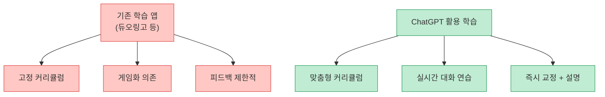
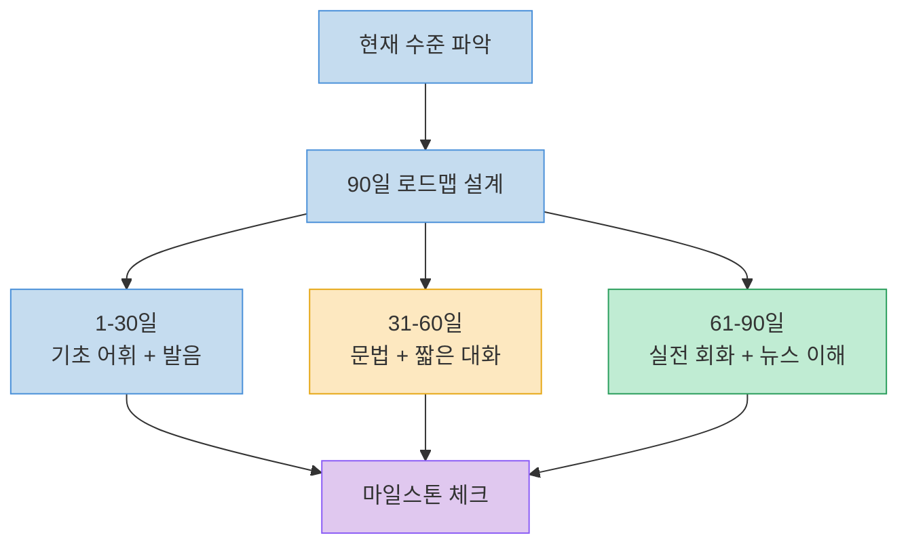
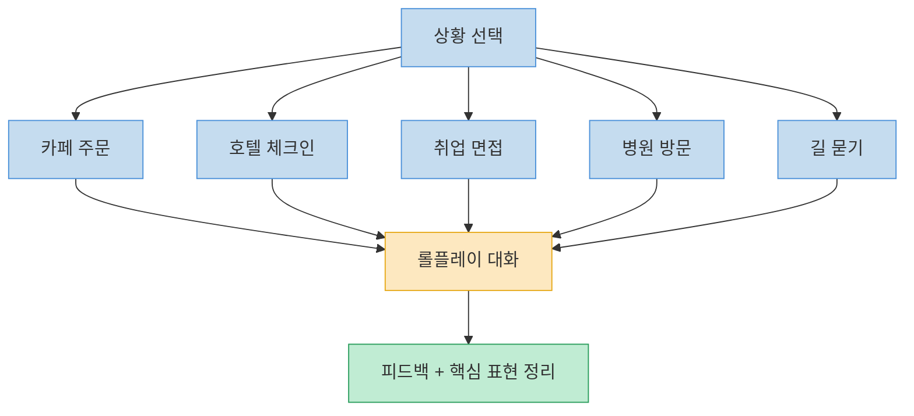
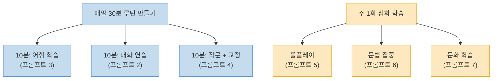

## 요약

2026년, 언어 학습의 패러다임이 바뀌고 있습니다. 듀오링고 같은 앱에만 의존하지 않고, ChatGPT를 활용하면 **맞춤형 1:1 언어 튜터** 를 무료로 가질 수 있습니다. Threads에서 @easygpt2526 님이 공유한 "90일 안에 어떤 언어든 말할 수 있게 도와주는 ChatGPT 프롬프트 7가지"를 정리하고, 실전에서 바로 복사해 쓸 수 있도록 구성했습니다.

<!--more-->

> 원본: [Threads 포스트 (@easygpt2526)](https://www.threads.com/@easygpt2526/post/DWSd10ZE0o4)

## 왜 ChatGPT로 언어를 배워야 하는가?

기존 언어 학습 앱은 정해진 커리큘럼을 따라가야 합니다. 반면 ChatGPT는 **나의 수준, 관심사, 목표에 맞게 즉석에서 수업을 설계** 해줍니다.



핵심 차이점을 정리하면 다음과 같습니다.

| 항목 | 듀오링고 | ChatGPT |
|------|---------|---------|
| 커리큘럼 | 고정형 | 맞춤형 |
| 대화 연습 | 제한적 | 무제한 자유 대화 |
| 문법 설명 | 간단한 팁 | 상세 설명 + 예문 |
| 문화 맥락 | 거의 없음 | 풍부한 문화 인사이트 |
| 비용 | 유료 구독 | 무료 (기본 플랜) |

## ChatGPT 프롬프트 7가지

### 1. 맞춤형 학습 플랜 생성

90일이라는 기간 안에 목표를 달성하려면, 체계적인 학습 계획이 필수입니다. 이 프롬프트는 **나의 현재 수준과 목표에 맞는 개인화된 학습 로드맵** 을 만들어줍니다.

```
나의 [목표 언어] 학습을 위한 90일 맞춤형 학습 계획을 세워줘.

현재 수준: [초급/중급/고급]
하루 학습 가능 시간: [시간]
학습 목표: [여행 회화/비즈니스/시험 준비 등]

주차별로 구체적인 학습 내용, 추천 자료, 마일스톤을 포함해줘.
진도 확인을 위한 자가 테스트도 포함해줘.
```



### 2. 실시간 대화 연습

교과서로는 절대 배울 수 없는 **실제 대화 감각** 을 기르는 프롬프트입니다. ChatGPT가 원어민 대화 상대가 되어줍니다.

```
너는 [목표 언어]를 가르치는 대화 전문 튜터야.
나와 [목표 언어]로 실시간 대화를 해줘.

규칙:
- 나의 수준에 맞게 대화 난이도를 조절해줘
- 내가 실수하면 자연스럽게 교정해주고, 올바른 표현을 알려줘
- 새로운 어휘가 나오면 뜻과 사용 예시를 함께 알려줘
- 문화적 뉘앙스가 있으면 설명해줘
- 대화 주제: [일상/여행/비즈니스/자기소개 등]
```

### 3. 어휘력 확장

단어장을 외우는 것보다 **맥락 속에서 어휘를 학습** 하는 것이 훨씬 효과적입니다.

```
너는 [목표 언어] 어휘 전문 튜터야.
내 수준에 맞는 새로운 단어와 표현을 가르쳐줘.

방식:
1. 오늘의 단어 10개를 주제별로 제시
2. 각 단어의 정의, 예문, 발음 가이드 제공
3. 단어를 활용한 짧은 퀴즈 출제
4. 관용표현과 슬랭도 포함
5. 내 관심 분야: [IT/음식/여행/영화 등]와 관련된 어휘 우선
```

### 4. 작문 교정 및 피드백

글을 쓰고 피드백을 받는 과정은 언어 실력을 빠르게 끌어올립니다. 이 프롬프트는 **문법 교정뿐 아니라 더 자연스러운 표현까지 제안** 해줍니다.

```
너는 [목표 언어] 작문 교정 전문가야.
내가 [목표 언어]로 작성한 글을 교정해줘.

피드백 방식:
1. 문법 오류를 표시하고 수정해줘
2. 더 자연스러운 표현이 있으면 제안해줘
3. 문장 구조 개선점을 알려줘
4. 잘 쓴 부분도 칭찬해줘
5. 수정 전/후를 비교해서 보여줘

[여기에 교정받을 글을 작성]
```

### 5. 상황별 롤플레이

실제 상황을 시뮬레이션하면 **실전 감각** 을 기를 수 있습니다. 카페 주문부터 취업 면접까지 원하는 상황을 연습할 수 있습니다.

```
너는 [목표 언어] 원어민이야.
다음 상황을 [목표 언어]로 롤플레이하자.

상황: [카페 주문 / 호텔 체크인 / 취업 면접 / 병원 방문 / 길 묻기]

규칙:
- 실제 상황처럼 자연스럽게 대화해줘
- 내가 막히면 힌트를 줘
- 대화가 끝나면 내 표현에 대한 피드백을 줘
- 해당 상황에서 유용한 핵심 표현 5개를 정리해줘
```



### 6. 문법 집중 설명

문법이 어렵게 느껴질 때, **쉬운 비유와 퀴즈로 이해하는 문법 튜터** 프롬프트입니다.

```
너는 [목표 언어] 문법 전문 튜터야.
다음 문법 규칙을 쉽게 설명해줘: [문법 주제]

설명 방식:
1. 초보자도 이해할 수 있는 쉬운 비유 사용
2. 일상 대화에서 쓰이는 예문 5개 제시
3. 자주 하는 실수와 올바른 사용법 비교
4. 연습용 빈칸 채우기 퀴즈 3개 출제
5. 이 문법이 실제 대화에서 왜 중요한지 설명
```

### 7. 문화 인사이트 학습

언어 뒤에 숨어있는 **문화를 이해하면 진짜 소통** 이 가능합니다. 관용표현의 유래부터 비즈니스 매너까지 깊이 있는 문화 학습이 가능합니다.

```
너는 [목표 언어] 문화와 언어 전문가야.
[목표 언어]를 사용하는 나라의 문화적 맥락을 가르쳐줘.

다음 내용을 포함해줘:
1. 자주 쓰이는 관용표현 5개와 그 유래
2. 비즈니스/일상에서의 예절과 매너
3. 교과서에서 안 가르치는 실제 표현
4. 문화적으로 피해야 하는 표현이나 행동
5. 최근 유행하는 신조어나 인터넷 표현
```

## 효과를 극대화하는 활용 팁



1. **일관성이 핵심** : 하루 30분이라도 매일 하는 것이 주 1회 3시간보다 효과적입니다
2. **프롬프트 조합 활용** : 하나의 프롬프트만 쓰지 말고, 매일 다른 프롬프트를 돌아가며 사용하세요
3. **실수를 두려워하지 마세요** : ChatGPT는 절대 당신을 평가하지 않습니다. 틀려도 괜찮습니다
4. **음성 기능 활용** : ChatGPT 앱의 음성 대화 기능을 활용하면 스피킹 연습까지 가능합니다
5. **진도 기록** : ChatGPT 메모리 기능을 활용해 학습 진도를 기억하게 하세요

## 마무리

듀오링고 같은 앱이 나쁜 것은 아닙니다. 하지만 **진짜 언어를 구사하고 싶다면**, 맞춤형 1:1 튜터링이 필요합니다. ChatGPT는 그 역할을 무료로, 24시간, 어떤 언어든 해줍니다. 위의 7가지 프롬프트를 복사해서 오늘부터 바로 시작해 보세요.

## 참고

- 원본: [Threads 포스트 (@easygpt2526)](https://www.threads.com/@easygpt2526/post/DWSd10ZE0o4)
- 참고: [7 ChatGPT Prompts to Accelerate Language Learning (Prompt Advance)](https://promptadvance.club/blog/chatgpt-prompts-for-language-learning)
- 작성일: 2026년 3월 25일
