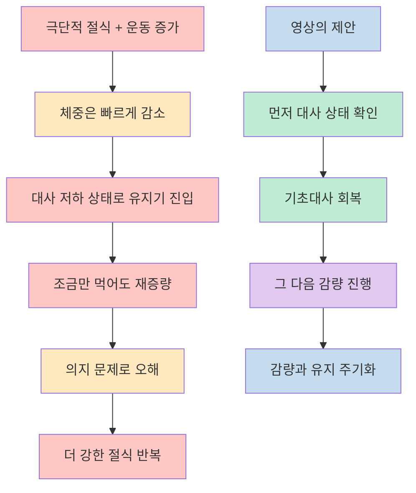
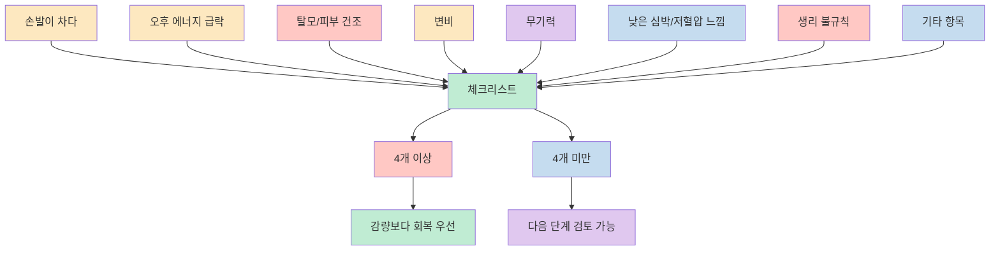
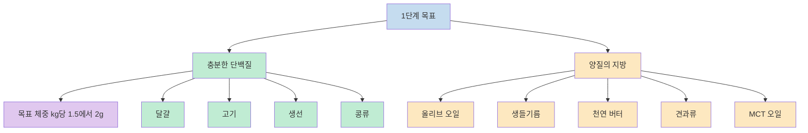
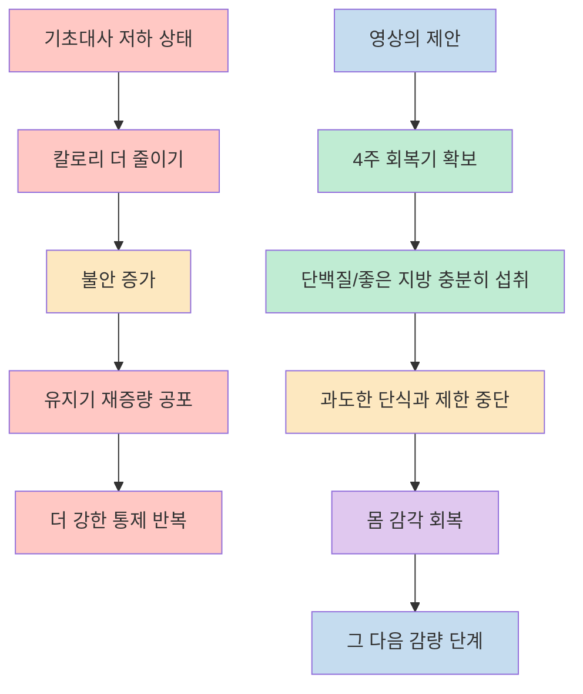
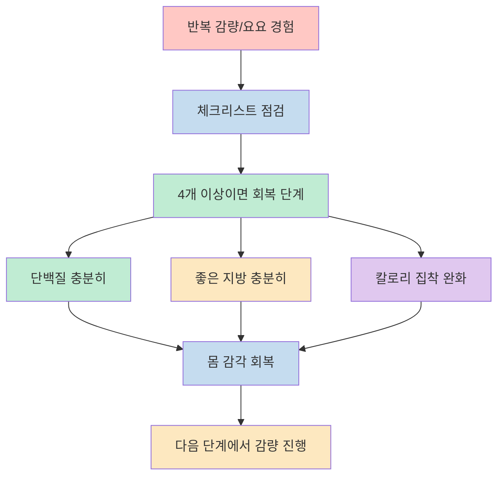

이 영상은 다이어트 실패의 원인을 의지 부족이 아니라 `지방을 쓰기 어려운 몸 상태`, 더 구체적으로는 `기초대사가 떨어진 상태`로 설명합니다. 발표자는 자신이 9개월에 14kg을 감량한 뒤 탈모, 저체온감, 생리 중단, 빠른 재증량을 겪었고, 그 뒤부터는 감량보다 먼저 대사를 회복하는 방식으로 접근해 다시 14kg을 감량한 뒤 7년째 유지하고 있다고 말합니다. [(0:12)](https://youtu.be/N0YH89iRV1E?t=12), [(1:06)](https://youtu.be/N0YH89iRV1E?t=66)

중요한 점은 이 영상이 "적게 먹고 많이 움직이면 된다"는 익숙한 공식과 반대로, 1단계에서는 오히려 `충분한 단백질`, `양질의 지방`, `칼로리 집착 중단`을 먼저 제안한다는 것입니다. 이 글에서는 그 구조를 `무엇을 주장하는가`, `어떤 사람에게 1단계가 필요하다고 보는가`, `실제로 어떻게 먹으라고 하는가`, `어떻게 받아들여야 하는가` 순서로 다시 정리합니다. [(1:42)](https://youtu.be/N0YH89iRV1E?t=102), [(3:34)](https://youtu.be/N0YH89iRV1E?t=214), [(14:07)](https://youtu.be/N0YH89iRV1E?t=847)

<!--more-->

## Sources

- [다이어트 규칙 이게 전부입니다. 10년 해도 모르는 사람 태반이에요. | 평생 써먹는 다이어트 규칙 1단계 - YouTube](https://www.youtube.com/watch?v=N0YH89iRV1E)

## 이 영상이 말하는 핵심은 "더 세게 빼기"가 아니라 "다시 찌기 쉬운 몸을 먼저 멈추기"다

영상의 논리는 단순합니다. 극단적인 절식과 과도한 운동은 감량기에는 숫자를 빠르게 내리지만, 유지기로 넘어가면 대사가 낮아진 상태가 남아서 조금만 먹어도 다시 찌기 쉬워진다는 것입니다. 발표자는 바로 이 구간 때문에 많은 사람이 감량보다 유지를 더 어렵게 느낀다고 설명합니다. [(2:10)](https://youtu.be/N0YH89iRV1E?t=130), [(2:35)](https://youtu.be/N0YH89iRV1E?t=155), [(3:04)](https://youtu.be/N0YH89iRV1E?t=184)

그래서 이 영상에서 말하는 다이어트의 출발점은 지방을 더 빨리 태우는 기술이 아닙니다. 먼저 내 몸이 `에너지를 정상적으로 쓰는 상태인지` 확인하고, 아니라면 감량 속도를 올리기보다 회복 단계를 먼저 밟아야 한다는 주장입니다. 발표자는 이 흐름을 `대사 확인 -> 대사를 지방 사용 가능한 상태로 전환 -> 감량기와 유지기를 분기별로 순환`하는 3단계 주기화 전략의 시작점으로 설명합니다. [(1:01)](https://youtu.be/N0YH89iRV1E?t=61), [(1:24)](https://youtu.be/N0YH89iRV1E?t=84), [(1:49)](https://youtu.be/N0YH89iRV1E?t=109)

이 프레임을 받아들일 때 핵심은, 발표자가 말하는 "기초대사 살리기"가 단순한 보충 팁이 아니라 전체 전략의 선행 조건이라는 점입니다. 즉 지금 내가 더 빼야 하는 사람이 아니라, 먼저 `다시 먹어도 버티는 몸`을 만들어야 하는 사람일 수 있다는 문제 제기입니다. [(3:27)](https://youtu.be/N0YH89iRV1E?t=207), [(3:39)](https://youtu.be/N0YH89iRV1E?t=219)

## 1단계가 필요한 사람은 누구라고 보나: 영상의 8가지 체크리스트

영상은 모든 사람에게 무조건 1단계를 적용하지는 않습니다. 발표자는 손발 냉감, 오후 3시 무렵의 급격한 에너지 저하, 탈모, 피부 건조, 변비, 무기력, 낮은 안정시 심박수와 저혈압 느낌, 생리 주기의 불규칙성 같은 8개 항목을 제시하고, 이 중 4개 이상이면 감량보다 `몸의 회복`이 우선이라고 설명합니다. [(3:45)](https://youtu.be/N0YH89iRV1E?t=225), [(4:03)](https://youtu.be/N0YH89iRV1E?t=243), [(4:45)](https://youtu.be/N0YH89iRV1E?t=285)

이 체크리스트가 영상에서 중요한 이유는 다이어트 문제를 체중계 숫자만이 아니라 `몸의 기능 신호`로 읽으라고 하기 때문입니다. 많이 참는 능력이 있는지보다, 현재 몸이 추위, 소화, 기분, 호르몬 리듬을 버틸 만큼 회복돼 있는지를 먼저 보라는 것입니다. 반대로 4개 미만이면 발표자는 기초대사가 정상 범주일 수 있으니 1단계를 건너뛰고 다음 단계로 넘어가도 된다고 말합니다. [(4:48)](https://youtu.be/N0YH89iRV1E?t=288), [(5:00)](https://youtu.be/N0YH89iRV1E?t=300)

여기서 실전적으로 읽을 부분은 "살이 안 빠지면 더 세게 해야 한다"가 아니라 "지금은 감량 단계에 들어가도 되는 몸 상태인가"를 먼저 구분하라는 메시지입니다. 영상 전체가 반복해서 말하는 것도 바로 이 순서입니다. [(2:54)](https://youtu.be/N0YH89iRV1E?t=174), [(4:55)](https://youtu.be/N0YH89iRV1E?t=295)

## 기초대사를 살리는 1단계는 단백질과 지방을 다시 넣는 방식으로 설명된다

1단계의 실천 항목은 의외로 단순합니다. 발표자는 `충분한 단백질`과 `양질의 지방` 두 가지만 지키라고 말합니다. 단백질은 목표 체중 1kg당 1.5에서 2g을 기준으로 설명하고, 60kg이라면 하루 90에서 120g 정도를 예시로 듭니다. 그리고 닭가슴살만 고집할 필요 없이 달걀, 고기, 생선, 콩류 등 "진짜 음식"으로 채우라고 권합니다. [(5:05)](https://youtu.be/N0YH89iRV1E?t=305), [(5:35)](https://youtu.be/N0YH89iRV1E?t=335), [(8:02)](https://youtu.be/N0YH89iRV1E?t=482)

단백질을 강조하는 이유도 분명합니다. 발표자는 단백질이 단순히 근육 보존용이 아니라 호르몬과 효소 생성 같은 대사 시스템 전반에 필요하다고 설명합니다. 그래서 이 단계에서 중요한 것은 "덜 먹는 능력"이 아니라 "몸이 다시 돌아가게 만들 재료를 넣는 것"이라는 논리입니다. 아침 달걀, 점심 고기, 저녁 생선 같은 예시는 바로 그 방향을 보여 주기 위한 구성입니다. [(6:55)](https://youtu.be/N0YH89iRV1E?t=415), [(7:22)](https://youtu.be/N0YH89iRV1E?t=442), [(7:40)](https://youtu.be/N0YH89iRV1E?t=460)

좋은 지방 파트도 같은 맥락입니다. 영상은 지방을 무조건 피해야 할 저장 연료가 아니라, 세포막과 호르몬 재료, 지용성 비타민 활용, 대사 활성화와 연결된 요소로 설명합니다. 그래서 양보다 종류를 더 중요하게 보며, 엑스트라 버진 올리브 오일, 생들기름, 천연 버터, 견과류, MCT 오일을 예시로 제시합니다. [(8:18)](https://youtu.be/N0YH89iRV1E?t=498), [(8:46)](https://youtu.be/N0YH89iRV1E?t=526), [(9:12)](https://youtu.be/N0YH89iRV1E?t=552)

이때 영상이 같이 덧붙이는 포인트는 "편한 단백질"과 "좋은 지방"을 말하더라도 가공식품 쪽으로 가지 말라는 것입니다. 발표자는 인공향과 감미료가 많은 단백질 쉐이크를 비추천하면서, 실제 음식 기반으로 식사를 다시 세우라고 말합니다. 즉 1단계는 보조제 중심 프로그램이 아니라 식사의 기본 구조를 다시 짜는 단계에 가깝습니다. [(7:56)](https://youtu.be/N0YH89iRV1E?t=476), [(8:09)](https://youtu.be/N0YH89iRV1E?t=489)

## 이 단계에서 가장 낯선 조언은 "칼로리 계산을 잠깐 멈추라"는 말이다

영상 후반에서 가장 인상적인 부분은 회복기 4주 동안 무리한 단식, 칼로리 제한, 극심한 저탄수화물 식단을 피하라고 하는 대목입니다. 발표자는 몸이 회복되기 전에 계속 숫자를 더 조이면 감량이 아니라 불안과 재증량 공포만 커질 수 있다고 설명합니다. 실제로 자신도 칼로리 계산을 멈추는 과정이 굉장히 무섭고 불안했다고 말합니다. [(11:18)](https://youtu.be/N0YH89iRV1E?t=678), [(11:34)](https://youtu.be/N0YH89iRV1E?t=694), [(11:54)](https://youtu.be/N0YH89iRV1E?t=714)

이 메시지의 핵심은 "아무렇게나 먹어도 된다"가 아닙니다. 발표자가 말하는 것은 칼로리를 통제하지 못하면 실패한다는 사고를 잠시 내려놓고, 몸의 감각과 회복 신호를 다시 읽는 단계가 필요하다는 것입니다. 그래서 영상은 칼로리 집착을 버리는 이유를 방임이 아니라 `대사 정상화 없이는 숫자 관리만으로는 재증량을 막기 어렵다`는 논리로 연결합니다. [(12:02)](https://youtu.be/N0YH89iRV1E?t=722), [(12:36)](https://youtu.be/N0YH89iRV1E?t=756), [(13:05)](https://youtu.be/N0YH89iRV1E?t=785)

영상이 중간에 언급하는 미국의 감량 프로그램 사례도 바로 이 문제를 강조하기 위한 장치입니다. 열심히 칼로리를 계산하고 감량했더라도, 몸 상태가 무너진 채 유지기로 들어가면 오래 버티기 어렵다는 논지를 반복하는 것입니다. [(12:14)](https://youtu.be/N0YH89iRV1E?t=734), [(12:48)](https://youtu.be/N0YH89iRV1E?t=768)

## 이 영상을 실제로 적용한다면 "회복 우선순위"로 읽는 편이 맞다

이 영상에서 바로 가져갈 수 있는 실전 포인트는 세 가지입니다. 첫째, 요요가 반복됐다면 지금 필요한 것이 더 강한 절제가 아니라 회복 단계인지 먼저 점검해야 합니다. 둘째, 1단계의 핵심은 닭가슴살만 먹는 식의 극단적 식단이 아니라 단백질과 지방을 실제 음식으로 충분히 채우는 것입니다. 셋째, 적어도 발표자가 제시한 회복기 동안에는 `빼는 속도`보다 `몸이 따뜻해지고 에너지가 돌아오는 느낌`을 더 중요한 지표로 봅니다. [(3:34)](https://youtu.be/N0YH89iRV1E?t=214), [(10:58)](https://youtu.be/N0YH89iRV1E?t=658), [(11:10)](https://youtu.be/N0YH89iRV1E?t=670)

다만 이 영상은 어디까지나 발표자의 개인 경험과 그 경험을 바탕으로 구성한 실전 프레임이라는 점도 함께 기억할 필요가 있습니다. 영상이 말하는 구조를 읽을 때는 "모든 사람은 먼저 지방을 많이 먹어야 한다"처럼 받아들이기보다, `요요를 반복하는 사람에게 회복 단계를 별도로 두는 사고방식`으로 이해하는 편이 더 정확합니다. 실제로 발표자도 이 영상을 3단계 전략의 1단계 소개로 위치시키고, 지방 연소 모드 전환은 다음 단계에서 다루겠다고 말합니다. [(1:47)](https://youtu.be/N0YH89iRV1E?t=107), [(13:24)](https://youtu.be/N0YH89iRV1E?t=804), [(14:18)](https://youtu.be/N0YH89iRV1E?t=858)

## 핵심 요약

- 이 영상은 다이어트 실패를 의지 부족보다 `기초대사가 떨어진 상태`로 해석합니다. [(1:00)](https://youtu.be/N0YH89iRV1E?t=60), [(2:18)](https://youtu.be/N0YH89iRV1E?t=138)
- 발표자는 손발 냉감, 오후 무기력, 탈모, 피부 건조, 변비, 낮은 심박수, 생리 불규칙 같은 신호가 4개 이상이면 감량보다 회복이 먼저라고 말합니다. [(3:52)](https://youtu.be/N0YH89iRV1E?t=232), [(4:45)](https://youtu.be/N0YH89iRV1E?t=285)
- 1단계의 실행은 `충분한 단백질`과 `양질의 지방` 두 축으로 설명되며, 가공 보충제보다 실제 음식 중심 구성을 권합니다. [(5:05)](https://youtu.be/N0YH89iRV1E?t=305), [(8:02)](https://youtu.be/N0YH89iRV1E?t=482), [(9:12)](https://youtu.be/N0YH89iRV1E?t=552)
- 회복기에는 무리한 단식, 과도한 칼로리 제한, 극단적 저탄수화물 식단을 피하고 몸 감각을 회복하라는 것이 영상의 핵심 조언입니다. [(11:18)](https://youtu.be/N0YH89iRV1E?t=678), [(12:58)](https://youtu.be/N0YH89iRV1E?t=778)
- 따라서 이 영상은 "빨리 빼는 법"보다 "다시 찌지 않는 몸 상태를 먼저 만들자"는 1단계 전략으로 읽는 편이 맞습니다. [(14:07)](https://youtu.be/N0YH89iRV1E?t=847), [(14:27)](https://youtu.be/N0YH89iRV1E?t=867)

## 결론

이 영상의 핵심은 다이어트를 감량 이벤트가 아니라 상태 관리 문제로 다시 정의하는 데 있습니다. 발표자가 말하는 1단계는 체중을 바로 내리는 기술이 아니라, 이미 지친 몸을 회복시키고 요요를 부르는 패턴을 끊기 위한 준비 단계입니다. [(1:42)](https://youtu.be/N0YH89iRV1E?t=102), [(14:07)](https://youtu.be/N0YH89iRV1E?t=847)

그래서 이 영상을 가장 유용하게 읽는 방법은 `더 참아야 한다`가 아니라 `지금 내 몸은 감량을 버틸 상태인가`를 먼저 묻는 것입니다. 반복 감량 뒤 컨디션 저하와 재증량이 함께 왔다면, 이 영상이 제안하는 회복 우선 접근은 한 번쯤 점검해 볼 만한 프레임입니다. [(3:34)](https://youtu.be/N0YH89iRV1E?t=214), [(13:49)](https://youtu.be/N0YH89iRV1E?t=829)
