비뇨의학과 전문의 홍성우 원장(닥터조물주 꽈추형, 서울아산병원 의과대학 박사)이 신사임당 채널에 출연해 남성 성건강과 관련된 가장 궁금하면서도 쉽게 물어보지 못했던 주제들을 28분에 걸쳐 솔직하게 다뤘다. 발기부전의 원인과 예방, 비아그라의 실제 효과, 자위에 관한 의학적 사실, 성기 크기 통계, 확대 수술의 현실, 성병 종류와 예방까지 — 인터넷에 떠도는 잘못된 정보를 바로잡는 내용이 핵심이다.

<!--more-->

## Sources

- [비아그라 대신 '이렇게' 하세요. 축처진 꽈추에 최고다. "20대 정력 가능합니다" (꽈추형 홍성우 원장)](https://www.youtube.com/watch?v=4O_6TGFBTe4) — 신사임당, 2025-09-17

---

## 발기부전의 원인과 분류

### 발기의 메커니즘

발기는 단순한 근육 반응이 아니다. **혈관**, **호르몬**, **신경** 세 시스템이 동시에 정상적으로 작동해야 한다. 음경의 해면체에 혈액이 충분히 유입되어야 강직도가 유지된다. 따라서 이 세 축 중 하나라도 문제가 생기면 발기부전이 발생한다.

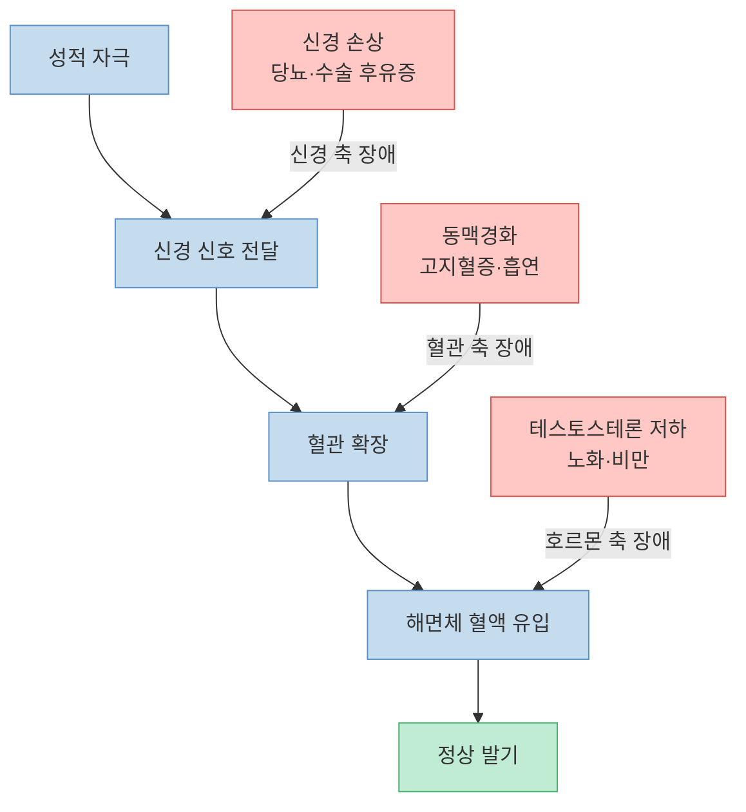

### 주요 원인 5가지

홍 원장은 발기부전의 가장 흔한 원인으로 다음을 꼽았다. [(영상 00:31~)](https://youtu.be/4O_6TGFBTe4?t=31)

1. **노화** — 나이가 들수록 혈관 탄성과 호르몬 분비량이 자연스럽게 감소한다.
2. **혈관 문제** — 동맥경화, 고지혈증, 고혈압은 음경으로 가는 혈류를 감소시킨다. 음경 동맥은 심장 관상동맥보다 훨씬 가늘어 혈관 손상이 먼저 나타난다.
3. **호르몬 문제** — 테스토스테론 감소, 비만에 따른 에스트로겐 증가가 복합적으로 작용한다.
4. **신경 문제** — 당뇨병성 신경병증, 전립선암·대장암 수술 후 신경 손상이 원인이 된다.
5. **대사증후군** — 비만, 당뇨, 흡연은 혈관과 호르몬 두 축을 동시에 손상시킨다. [(영상 12:00)](https://youtu.be/4O_6TGFBTe4?t=720)

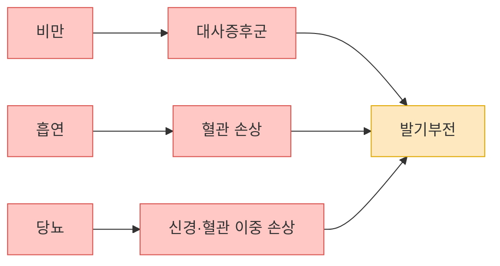

---

## 약 없이 발기력 높이는 법

### 하체 운동과 테스토스테론의 관계

홍 원장이 가장 먼저 권고하는 비약물 처치는 **하체 근육 강화 운동**이다. [(영상 01:27)](https://youtu.be/4O_6TGFBTe4?t=87)

- 스쿼트, 런지 같은 하체 복합 운동이 테스토스테론 분비를 자극한다.
- 근육량이 늘면 기초 대사량이 올라가고 복부 비만이 줄어, 혈관 건강과 호르몬 수치가 동시에 개선된다.
- 유산소(달리기, 자전거)도 혈관 확장 능력을 향상시켜 직접적인 발기 개선 효과가 있다.

### 수면·금연·금주

- **수면**: 성장호르몬과 테스토스테론은 수면 중 분비된다. 수면 부족은 남성호르몬 저하를 직접 초래한다.
- **금연**: 니코틴은 혈관을 수축시켜 음경 혈류를 즉각 감소시킨다.
- **음주**: 알코올 자체보다 만성 음주로 인한 **비만 → 대사증후군** 경로가 더 큰 문제다. [(영상 11:36)](https://youtu.be/4O_6TGFBTe4?t=696)

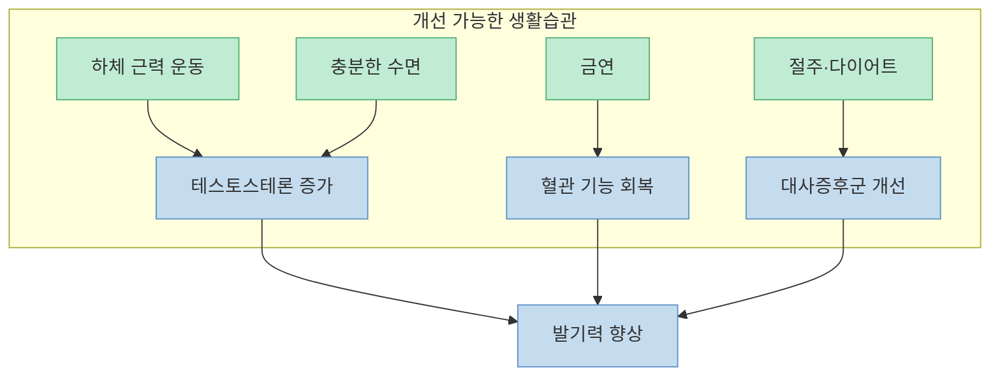

---

## 비아그라·씨알리스: 오해와 사실

### 발명 경위

비아그라(실데나필)는 원래 **협심증 치료 심장약**으로 개발됐다. 임상 시험 도중 피험자들이 발기 개선 효과를 보고하면서 PDE5 억제제가 발기부전 치료약으로 전환됐다. [(영상 02:21)](https://youtu.be/4O_6TGFBTe4?t=141)

### 작용 원리

PDE5 억제제는 음경 혈관의 평활근을 이완시켜 혈류를 증가시킨다. 성적 자극 없이는 효과가 없으며, 자극이 있을 때만 발기를 보조한다. 발기를 만들어 내는 약이 아니라 발기 조건을 **유리하게 만들어 주는 약**이다.

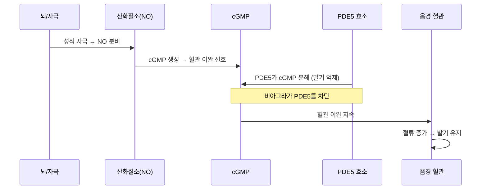

### 부작용과 안전성

- **일시적 부작용**: 얼굴 홍조, 두통, 소화장애, 근육통. 대부분 복용 후 수 시간 내 사라진다. [(영상 02:52)](https://youtu.be/4O_6TGFBTe4?t=172)
- **장기 복용**: 40년 이상 임상 데이터가 쌓여 있어 장기 복용에도 심각한 부작용이 보고되지 않았다.
- **금기**: 질산염(니트로글리세린) 복용 환자, 중증 심부전 환자에서는 과도한 혈압 강하가 발생할 수 있어 금기다.

### 건강보조식품 vs 전문의약품

홍 원장은 홈쇼핑·광고에서 판매되는 발기 관련 건강보조식품에 대해 명확히 선을 그었다. [(영상 04:16)](https://youtu.be/4O_6TGFBTe4?t=256)

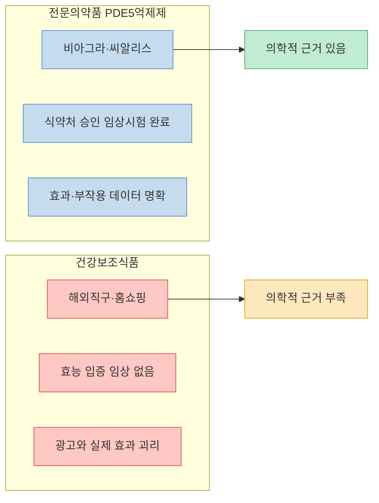

---

## 젊은 남성의 심리적 발기부전

20~30대에서 발기부전의 상당 부분은 **심리적 원인**이다. [(영상 04:50)](https://youtu.be/4O_6TGFBTe4?t=290)

- 과거 성관계 실패 경험이 트라우마가 되어 다음 관계에서도 불안감과 긴장을 유발한다.
- 자위 시에는 문제가 없는데 실제 파트너와의 관계에서만 발기가 안 된다면 심리적 발기부전을 강하게 의심할 수 있다.
- 이 경우 비아그라를 단기적으로 사용해 성공 경험을 쌓고 자신감을 회복하는 것이 의학적으로 유효한 접근이다. 약에 영구적으로 의존하지 않아도 된다.

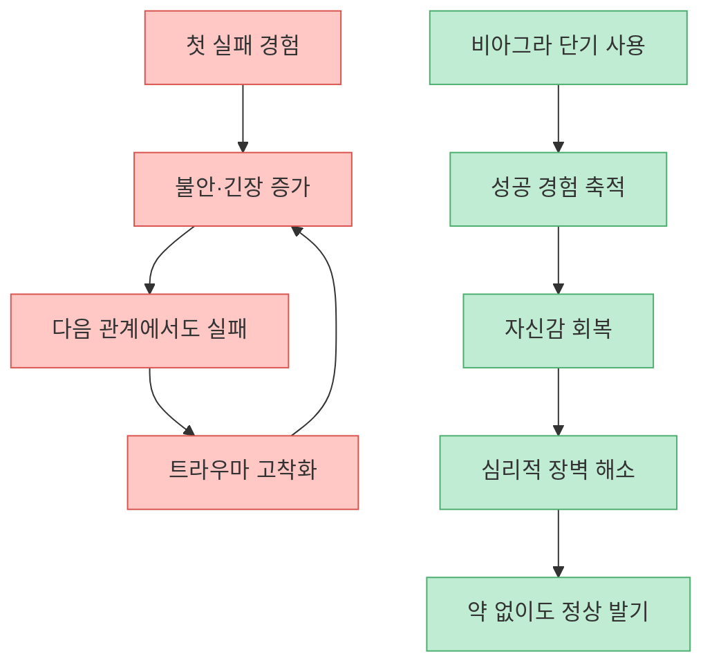

---

## 자위에 관한 의학적 사실

### 자위 빈도와 정력 손실 — 미신 타파

"자위를 많이 하면 정력이 떨어진다"는 속설에 대해 홍 원장은 명확하게 반박했다. [(영상 05:56)](https://youtu.be/4O_6TGFBTe4?t=356)

- 자위 자체는 발기 능력이나 성 기능에 영구적인 손상을 주지 않는다.
- 정액에 단백질이 포함되어 있다는 이유로 "자위하면 근손실이 온다"는 주장도 의학적 근거가 없다. 정액의 **95~99%는 물**이며, 소량의 단백질은 운동 회복에 영향을 줄 수 없는 수준이다. [(영상 07:10)](https://youtu.be/4O_6TGFBTe4?t=430)

### 정액량을 늘리는 법

- 가장 확실한 방법은 **충분한 수분 섭취**다. 정액의 주성분이 물이기 때문에 수분 부족이 정액량 감소로 직결된다. [(영상 08:12)](https://youtu.be/4O_6TGFBTe4?t=492)
- 특정 음식이나 건강식품이 정액량을 늘린다는 주장은 의학적 근거가 없다.

### 압박 자위(Death Grip)의 위험성

반드시 알아야 할 경고가 있다. 바닥이나 매트리스에 성기를 눌러 자위하는 **압박 자위** 방식은 **지루(遲漏, delayed ejaculation)** 를 유발할 수 있다. [(영상 08:46)](https://youtu.be/4O_6TGFBTe4?t=526)

- 압박 자위 시 음경 내부에 과도한 압력이 가해져 정상 성관계에서 느끼는 자극보다 훨씬 강한 물리적 자극에 익숙해진다.
- 결과적으로 실제 파트너와의 성관계에서는 자극 강도가 부족해 사정이 불가능해진다.
- 홍 원장에 따르면 이 문제를 상담하러 오는 환자의 90% 이상이 압박 자위 습관을 가지고 있다.
- 한 번 지루가 생기면 치료가 매우 어렵다. 홍 원장은 "타임머신 밖에는 답이 없다"고 표현할 정도다. [(영상 10:13)](https://youtu.be/4O_6TGFBTe4?t=613)

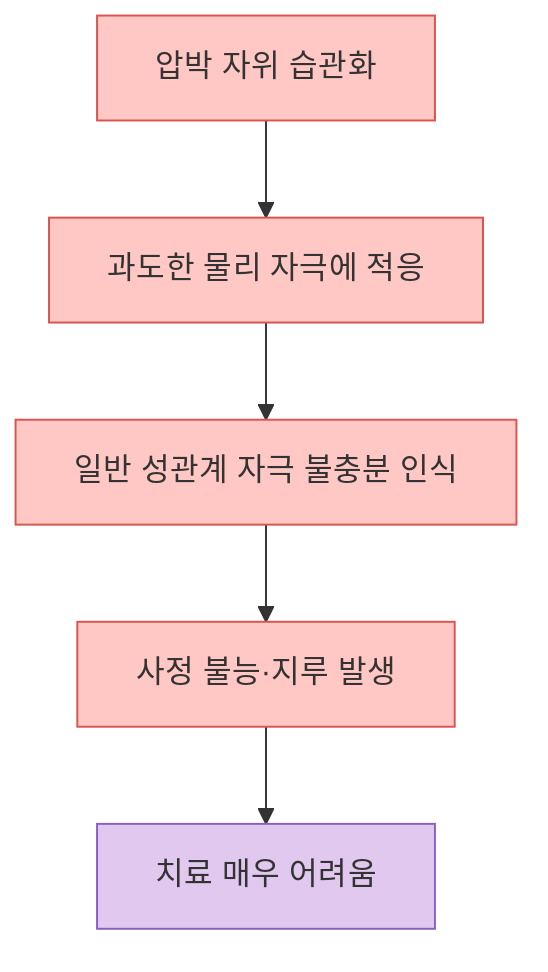

---

## 성기 크기: 통계와 우선순위

### 한국 남성 평균 길이

홍 원장이 직접 인용한 데이터에 따르면, 한국 남성의 평균 음경 길이는 **발기 전 최대한 당겼을 때 약 11.5~12cm** 다. [(영상 13:30)](https://youtu.be/4O_6TGFBTe4?t=810)

- 발기 전 당겼을 때의 길이(stretched flaccid length)와 발기 길이의 상관관계는 높다.
- 흔히 "발기 타입"이 두 가지로 나뉜다: 평소에는 작지만 발기 시 크게 늘어나는 **탄력형**, 평소에도 이미 크게 나와 있는 **고정형**. 두 타입 간 발기 후 최종 길이 차이는 크지 않다. [(영상 14:35)](https://youtu.be/4O_6TGFBTe4?t=875)

### 코 길이와 성기 크기 SCI 논문

홍 원장이 2023년에 게재한 **SCI 논문**에서 코의 형태(길이, 굵기)와 음경 크기 사이의 통계적 상관관계를 밝혔다. [(영상 12:16)](https://youtu.be/4O_6TGFBTe4?t=736) 코 외에도 체형(키, 발 크기 등)이 복합적으로 반영된다고 설명했다.

### 여성 만족도 우선순위

여성 만족도 조사에서 중요도 순위는 다음과 같다. [(영상 15:10)](https://youtu.be/4O_6TGFBTe4?t=910)

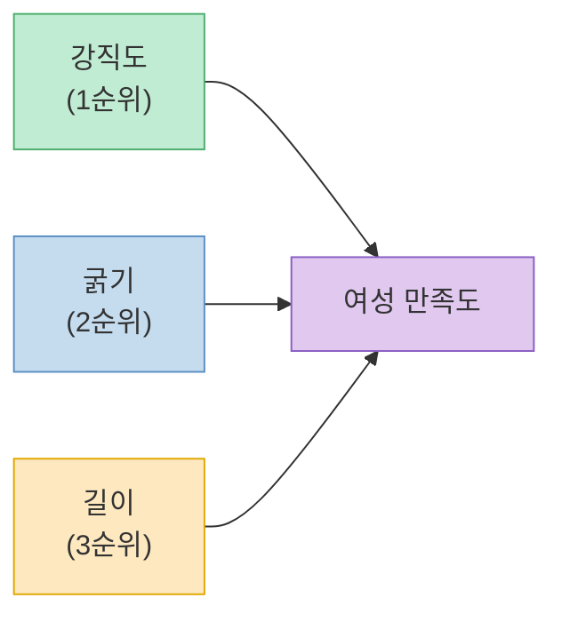

강직도가 가장 중요하다는 점은 발기 능력이 길이보다 훨씬 핵심적인 요소임을 시사한다.

---

## 확대 수술과 기구·크림의 현실

### 수술로 가능한 범위

[(영상 15:57)](https://youtu.be/4O_6TGFBTe4?t=957)

| 항목 | 수술 가능 여부 | 비고 |
|---|---|---|
| 굵기 확대 | 가능 | 지방 이식·필러 방식 |
| 강직도 개선 | 사실상 불가능 | 교과서에만 존재하는 수준 |
| 길이 연장 | 제한적 | 인대 절단 방식, 효과 미미 |

특히 광고에서 "발기력 향상 수술"을 내세우는 경우 홍 원장은 "사기에 가깝다"고 직접 표현했다. [(영상 16:43)](https://youtu.be/4O_6TGFBTe4?t=1003) 강직도는 혈관과 신경의 문제이기 때문에 수술적 교정 범위가 매우 좁다.

### 크림과 기구

[(영상 17:55)](https://youtu.be/4O_6TGFBTe4?t=1075)

- 시중에 유통되는 확대 크림은 **의학적 효과가 없다**. 피부 혈류를 일시적으로 늘려 약간의 팽창감을 줄 수 있지만, 영구적 변화는 없다.
- 음경을 물리적으로 당기는 기구(트랙션 디바이스 등)는 장기적으로 사용 시 **해면체 조직 손상** 위험이 있다. [(영상 19:07)](https://youtu.be/4O_6TGFBTe4?t=1147)
- 대부분은 마케팅에 의한 심리 효과다.

---

## 매독 급증과 성병 관리

### 한국 매독 급증의 원인

최근 한국에서 매독(Syphilis) 환자가 급격히 증가했다. 홍 원장이 설명한 원인은 두 가지다. [(영상 20:11)](https://youtu.be/4O_6TGFBTe4?t=1211)

1. **일본 경로**: 일본에서 먼저 매독 폭증이 발생했으며, 국제 여행이 재개된 이후 일본 방문자를 통해 한국으로 유입됐다.
2. **콘돔 미착용 증가**: 성관계 시 콘돔 착용률 감소가 직접적인 원인이다.

### 주요 성병 비교

성병은 원인균 종류에 따라 **완치 가능 여부**가 완전히 달라진다. [(영상 22:49~24:39)](https://youtu.be/4O_6TGFBTe4?t=1369)

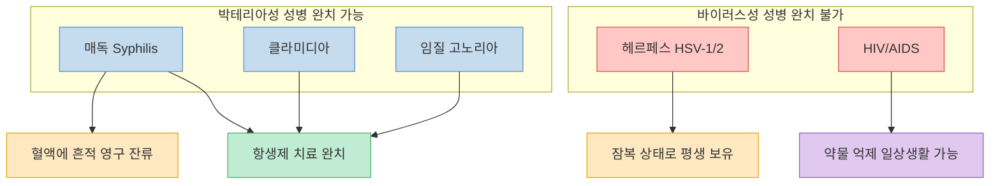

#### 매독 (Syphilis)

[(영상 21:32)](https://youtu.be/4O_6TGFBTe4?t=1292)

- **원인**: 박테리아 (Treponema pallidum)
- **전파**: 주로 성관계, 수직 감염(임산부 → 태아)은 드물다.
- **완치**: 항생제로 완치 가능
- **주의**: 완치 후에도 혈액 검사에서 양성 반응이 영구적으로 남는다. 홍 원장은 이를 "전과 기록"에 비유했다. [(영상 25:09)](https://youtu.be/4O_6TGFBTe4?t=1509)

#### 헤르페스 (Herpes HSV-1/2)

[(영상 23:26)](https://youtu.be/4O_6TGFBTe4?t=1369)

- **원인**: 바이러스 (HSV-1, HSV-2)
- **완치**: 불가능 — 바이러스가 신경절에 잠복, 면역 저하 시 재활성화
- **유병률**: HSV-1(입술 헤르페스) — 성인의 90% 이상 보유 추정, HSV-2(생식기 헤르페스) — 30% 이상 추정 [(영상 24:01)](https://youtu.be/4O_6TGFBTe4?t=1441)
- 대부분 무증상이거나 가벼운 증상으로 자신이 보유자임을 모르는 경우가 많다.

#### 클라미디아

- **원인**: 박테리아 (Chlamydia trachomatis)
- 한국에서 가장 흔한 성병
- **완치**: 항생제로 가능

#### 임질 (고노리아)

- **원인**: 박테리아 (Neisseria gonorrhoeae)
- **완치**: 항생제로 가능 (최근 항생제 내성 균주 증가 문제 있음)

#### HIV/AIDS

[(영상 25:29)](https://youtu.be/4O_6TGFBTe4?t=1529)

- **원인**: 바이러스 (HIV)
- **완치**: 불가능
- **현대 치료**: 항레트로바이러스 약물로 혈중 바이러스를 감지 불가능 수준까지 억제 가능. 약을 꾸준히 복용하면 HIV 환자도 일반인과 동일하게 일상생활 가능하며, 타인에게 전파 위험도 극히 낮아진다.

### 파트너와 검사 결과가 다를 때

"나는 음성인데 파트너는 양성"이 나오는 경우, 또는 그 반대 상황의 원인은 세 가지다. [(영상 25:55)](https://youtu.be/4O_6TGFBTe4?t=1555)

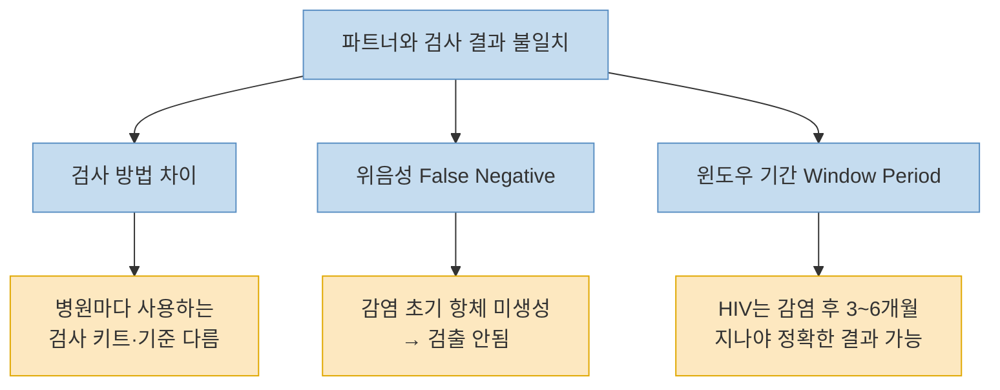

특히 **HIV는 감염 직후 검사해서 음성이 나와도 안심할 수 없다**. 윈도우 기간(window period)은 3~6개월이며, 다음날 검사는 아무런 의미가 없다. [(영상 26:58)](https://youtu.be/4O_6TGFBTe4?t=1618)

### 콘돔 예방 효과

콘돔이 완벽하지는 않지만 대부분의 성병 전파를 차단하는 데 매우 효과적이다. [(영상 22:05)](https://youtu.be/4O_6TGFBTe4?t=1325) 특히 헤르페스의 경우 피부 접촉으로도 전파될 수 있어 콘돔만으로 100% 예방이 어렵지만, 착용하지 않는 것과 비교하면 위험을 크게 줄인다.

---

## 핵심 요약

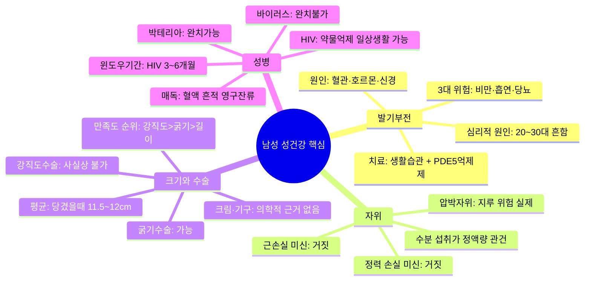

| 항목 | 핵심 내용 |
|---|---|
| 발기부전 예방 | 하체 운동, 금연, 체중 관리, 충분한 수면 |
| 비아그라 | PDE5 억제제, 40년 이상 안전 데이터, 심리적 발기부전에도 단기 유효 |
| 자위 빈도 | 정력 손실 없음, 압박 자위만 지루 위험 |
| 정액량 | 물 충분히 마시기가 유일한 실증적 방법 |
| 크기 우선순위 | 강직도 > 굵기 > 길이 |
| 확대 수술 | 굵기만 가능, 강직도 수술은 사실상 불가 |
| 매독 | 박테리아, 완치 가능, 혈액 흔적 영구 잔류 |
| 헤르페스 | 바이러스, 완치 불가, 성인 90% 이상 HSV-1 보유 추정 |
| HIV | 바이러스, 완치 불가, 약물로 억제 가능 |
| 검사 타이밍 | HIV 윈도우 기간 3~6개월, 노출 직후 검사 의미 없음 |

---

## 결론

홍성우 원장의 메시지는 명확하다. 남성 성건강 문제는 창피한 주제가 아니라 **혈관·호르몬·신경 건강**의 문제이며, 대부분은 생활습관 교정과 의학적 처치로 개선할 수 있다. 인터넷에 넘쳐나는 건강보조식품·확대 크림·기구 광고는 의학적 근거가 없는 경우가 대부분이다. [(영상 27:18)](https://youtu.be/4O_6TGFBTe4?t=1638)

**20~30대부터 비뇨의학과를 정기적으로 방문**하는 습관을 들이는 것이 중년 이후의 성기능 저하를 늦추는 가장 확실한 예방책이다. 특히 성병 검사는 증상이 없어도 정기적으로 받아야 하며, 무증상 감염이 훨씬 흔하다는 사실을 기억해야 한다.
