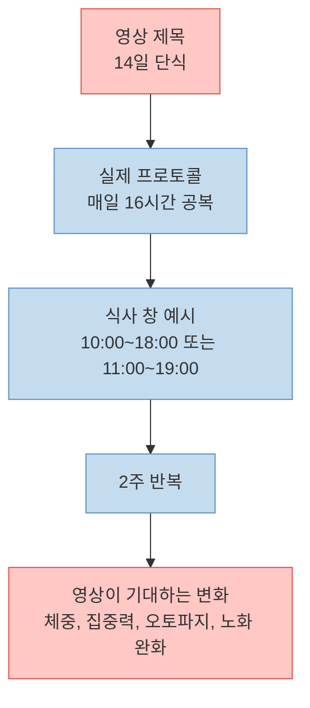
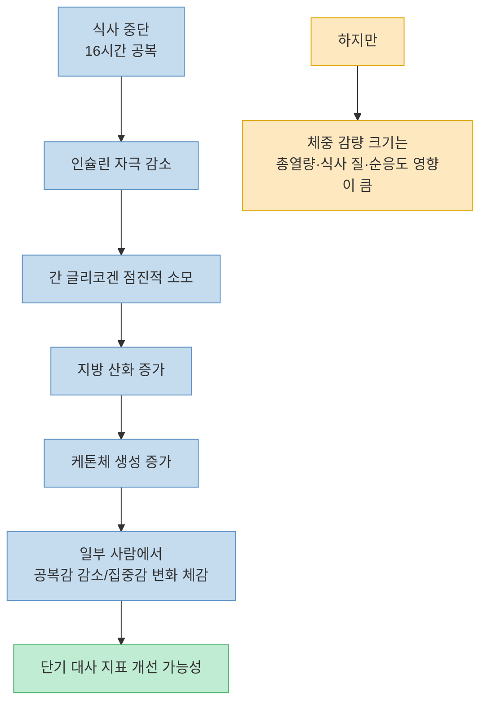
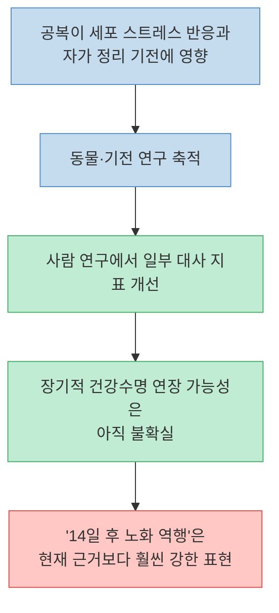
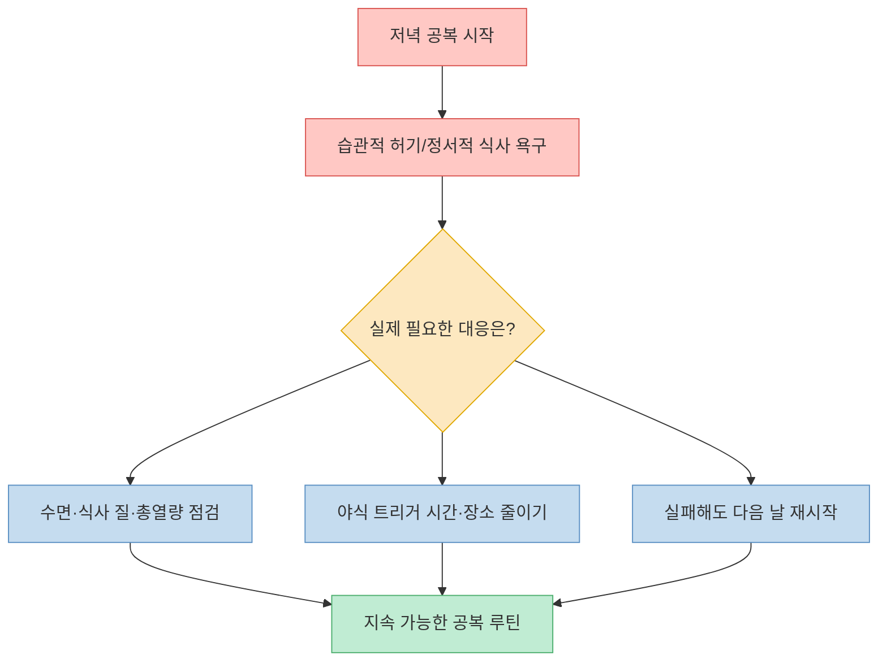
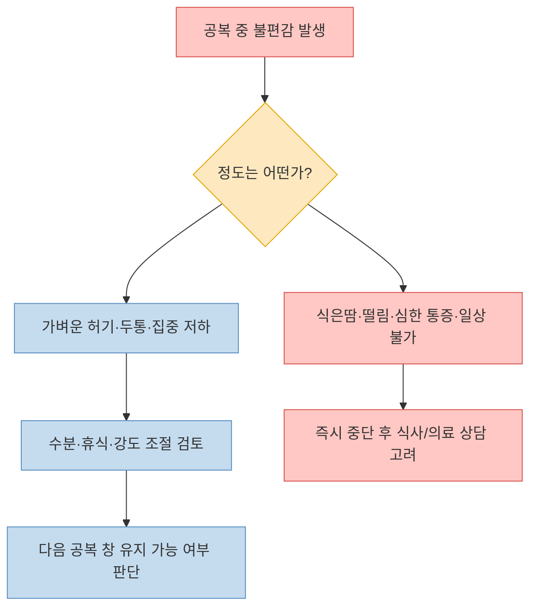

이 영상의 핵심 메시지는 단순하다. 저녁 6시 이후부터 다음 날 아침까지 16시간 공복을 14일간 반복하면, 지방 연소와 오토파지가 켜지고 결국 노화 시계까지 거꾸로 돌릴 수 있다는 주장이다. 영상은 매우 강한 확신으로 말하지만, 실제로는 세 층으로 나눠 읽는 편이 정확하다. 첫째, **16시간 공복 자체는 널리 알려진 시간제한식사(time-restricted eating)** 의 한 형태다. 둘째, **지방 산화 증가, 케톤 생성, 일부 대사 지표 개선 가능성** 은 비교적 설명 가능한 영역이다. 셋째, **"4일 차부터 오토파지 폭발", "14일 후 노화 역행", "피부와 뇌세포가 다시 젊어진다"** 같은 문장은 사람 대상 근거보다 훨씬 앞서 나간 표현이다. [(영상 01:14)](https://youtu.be/494TRV2F0Cw?t=74) [(영상 04:06)](https://youtu.be/494TRV2F0Cw?t=246) [(영상 27:18)](https://youtu.be/494TRV2F0Cw?t=1638)

이 글은 영상을 반박하거나 옹호하려는 글이 아니라, 영상이 실제로 무엇을 말했고 그중 무엇을 실전적으로 받아들일 수 있는지를 정리하는 해설에 가깝다. 의료 조언이 아니라는 점도 분명히 해둔다. 임신·수유 중이거나, 당뇨 관리 중이거나, 섭식장애 병력이 있거나, 위장 질환이 있으면 공복 전략은 스스로 실험할 주제가 아니라 의료진과 먼저 상의할 주제다. [Mayo Clinic](https://www.mayoclinic.org/healthy-lifestyle/nutrition-and-healthy-eating/expert-answers/intermittent-fasting/faq-20441303)

<!--more-->

## Sources

- [단식 14일 후... 노화가 거꾸로 간다고?! #단식14일 #오토파지 #노화역행](https://www.youtube.com/watch?v=494TRV2F0Cw)

---

## 영상이 실제로 제안하는 방식은 무엇인가

영상은 "14일 단식"이라는 자극적인 제목을 쓰지만, 본문에서 실제로 설명하는 방식은 물만 마시는 장기 단식이 아니라 **매일 16시간 공복을 2주간 반복하는 시간제한식사** 다. 저녁 6시에 식사를 마치고, 다음 날 아침까지 음식 섭취를 끊는 루틴을 제안한다. 즉 제목은 장기 단식처럼 보이지만, 실전 프로토콜은 16:8에 훨씬 가깝다. [(영상 01:14)](https://youtu.be/494TRV2F0Cw?t=74)

이 차이는 중요하다. 16:8은 임상 연구나 대중 건강 가이드에서 흔히 다뤄지는 범주이지만, "14일 동안 거의 먹지 않는 단식"은 위험도와 준비 과정이 완전히 달라진다. 영상을 따라 하려는 사람은 먼저 이 지점부터 바로잡아야 한다. 영상의 제목이 아니라 본문 설명을 기준으로 보면, 이 콘텐츠는 사실상 "2주 동안 16시간 공복을 실험해 보라"는 제안이다. [Mayo Clinic](https://www.mayoclinic.org/healthy-lifestyle/nutrition-and-healthy-eating/expert-answers/intermittent-fasting/faq-20441303)

---

## 영상이 설명하는 핵심 기전: 인슐린 저하, 지방 사용, 케톤 전환

영상 전반부는 "계속 먹는 생활"이 몸의 회복을 막고, 공복이 시작되면 인슐린이 떨어지면서 저장된 지방과 내장 지방을 꺼내 쓰기 시작한다고 설명한다. 또 2~3일 차에 케톤이 생성되고, 이 케톤이 뇌의 고급 연료가 되어 머리가 맑아진다고 주장한다. [(영상 02:33)](https://youtu.be/494TRV2F0Cw?t=153) [(영상 03:42)](https://youtu.be/494TRV2F0Cw?t=222)

이 설명에는 맞는 부분과 과장된 부분이 같이 섞여 있다. 공복 시간이 길어지면 간 글리코겐이 줄고, 에너지원이 포도당 중심에서 지방 산화와 케톤체 이용 쪽으로 이동하는 것은 잘 알려진 현상이다. 그래서 일부 사람에게는 시간제한식사가 체중, 혈당, 혈압, 염증 지표 같은 단기 대사 지표 개선과 연결될 수 있다. 다만 그 변화의 크기와 체감 속도는 사람마다 매우 다르고, "배고픔 신호 = 뱃살 연소의 승전보"처럼 단선적으로 읽을 수는 없다. [NEJM Clinician 요약](https://clinician.nejm.org/fasting-shows-no-weight-loss-benefit-standard-meals-randomized-trial-nejm-jw.FW117079) [Mayo Clinic](https://www.mayoclinic.org/healthy-lifestyle/nutrition-and-healthy-eating/expert-answers/intermittent-fasting/faq-20441303)

또 한 가지 중요한 점은 **16시간 공복이 자동으로 큰 체중 감량을 보장하지는 않는다** 는 점이다. 2020년 JAMA Internal Medicine 무작위 시험을 요약한 NEJM Clinician 기사에서는, 12주간 16:8 시간제한식사를 한 집단이 규칙적으로 세 끼를 먹은 집단보다 의미 있는 체중 감량 우위를 보이지 못했다. 즉 공복 시간 자체보다 총섭취 열량, 식사의 질, 지속 가능성이 결과를 좌우할 수 있다는 뜻이다. [NEJM Clinician](https://clinician.nejm.org/fasting-shows-no-weight-loss-benefit-standard-meals-randomized-trial-nejm-jw.FW117079)

---

## 오토파지와 "노화 역행" 주장은 어떻게 읽어야 하나

영상의 가장 강한 주장은 4일 차 이후 오토파지가 "폭발적으로" 활성화되고, 결국 노화 시계를 거꾸로 돌릴 수 있다는 부분이다. 낡은 미토콘드리아와 변형 단백질이 분해되고, 피부와 세포가 다시 젊어지는 재생이 일어난다고도 말한다. [(영상 04:06)](https://youtu.be/494TRV2F0Cw?t=246) [(영상 05:44)](https://youtu.be/494TRV2F0Cw?t=344) [(영상 19:02)](https://youtu.be/494TRV2F0Cw?t=1142)

여기서는 표현 수위를 확실히 낮춰 읽는 것이 맞다. 오토파지는 실제 생물학 개념이고, 에너지 제한 상태가 세포 수준의 스트레스 대응과 청소 메커니즘에 영향을 준다는 점도 연구되어 왔다. 하지만 **사람에게서 특정 공복 시간과 특정 날짜를 찍어 "이때 오토파지가 폭발한다"고 임상적으로 단정하기는 어렵다.** 특히 영상처럼 4일 차, 7일 차, 14일 차를 거의 시계처럼 구분해 설명하는 것은 교육용 단순화에 가깝다. [NEJM 배경 리뷰 언급](https://clinician.nejm.org/clinical-conversations-intermittent-fasting-nejm-jw.FW116337) [PubMed: alternate day fasting trial](https://pubmed.ncbi.nlm.nih.gov/31471173/)

사람 대상 근거도 "노화가 거꾸로 간다" 수준까지는 도달하지 않는다. 2019년 Cell Metabolism 무작위 연구는 격일 단식이 지방량, 일부 심혈관 지표, 케톤체, 몇몇 분자 지표를 개선했다고 보고했지만, 이것을 곧바로 **젊어짐의 직접 증명** 으로 읽을 수는 없다. 2024년 NIH 소개 자료 역시 간헐적 단식이 인지 기능과 뇌 노화 지표에 긍정적 신호를 보였다고 설명하지만, 더 크고 긴 임상시험이 필요하다고 분명히 적고 있다. [(영상 11:01)](https://youtu.be/494TRV2F0Cw?t=661) [PubMed](https://pubmed.ncbi.nlm.nih.gov/31471173/) [NIH IRP](https://irp.nih.gov/accomplishments/examining-brain-responses-to-intermittent-fasting-and-healthy-diet-in-older)

정리하면, 이 영상이 말하는 방향성 자체가 완전히 허구라고 보기는 어렵다. 다만 **"공복은 대사 전환을 유도할 수 있다"** 와 **"2주만 하면 노화 시계가 거꾸로 돈다"** 사이에는 큰 간격이 있다. 실제 사람 데이터는 그 사이 어딘가에 있으며, 현재로서는 "가능한 기전"과 "제한적 인체 근거"를 구분해서 읽는 것이 가장 정확하다.

---

## 영상이 길게 말하는 또 하나의 축: 감정적 식사와 공복 적응

중반부에서 영상은 배고픔을 생리학보다 심리학의 문제로 길게 해석한다. 첫날의 괴로움은 위장이 비어서가 아니라, 늘 먹던 시간에 보상이 끊기면서 뇌가 저항하는 것이라고 설명한다. 또 감정적 식사, 스트레스성 야식, 도파민 중심 보상 루프를 끊는 것이 공복의 핵심 성과라고 강조한다. [(영상 02:46)](https://youtu.be/494TRV2F0Cw?t=166) [(영상 06:45)](https://youtu.be/494TRV2F0Cw?t=405) [(영상 08:42)](https://youtu.be/494TRV2F0Cw?t=522)

이 부분은 의외로 영상에서 가장 실전적인 대목이다. 공복 전략이 효과가 있든 없든, 많은 사람에게 실제 난관은 "세포 청소가 안 돼서"가 아니라 **습관적 섭취 타이밍과 정서적 보상 루프** 다. 저녁만 되면 자동으로 군것질을 찾거나, 피곤하면 단것을 넣어야 일이 된다고 느끼는 패턴은 생리적 허기와 별개로 강화되기 쉽다. 그래서 시간제한식사가 의미가 있다면, 그것은 오토파지의 신비보다 먼저 **먹는 의사결정 구조를 단순화한다는 점** 에서 찾는 편이 현실적이다. [(영상 15:54)](https://youtu.be/494TRV2F0Cw?t=954)

물론 여기에도 과장은 있다. 영상은 거의 모든 공복 불편감을 "가짜 배고픔"으로 환원하려는 경향이 있다. 하지만 실제로는 수면 부족, 총섭취 열량 부족, 과도한 운동, 카페인 의존, 당 조절 문제 같은 요인이 함께 작동할 수 있다. 따라서 공복 적응을 설명할 때는 "의지로 버티면 다 해결된다"보다, **환경 설계와 강도 조절이 더 중요하다** 고 읽는 편이 맞다.

---

## 물, 소금, 블랙커피, 그리고 중단 신호

후반부에서 영상은 공복을 유지하는 팁으로 물, 소금, 블랙커피를 강조한다. 또 위장 질환이 심한 사람, 혈당 조절이 어려운 사람, 임산부는 예외라고 말하며, 식은땀·손떨림·심계항진 같은 강한 증상이 오면 즉시 멈추라고 조언한다. [(영상 13:22)](https://youtu.be/494TRV2F0Cw?t=802) [(영상 17:49)](https://youtu.be/494TRV2F0Cw?t=1069)

이 부분은 비교적 균형이 있다. 간헐적 단식은 많은 사람에게 시도 가능한 패턴이지만, 모두에게 맞지는 않는다. Mayo Clinic 역시 피로, 어지러움, 두통, 변비, 기분 변화 가능성을 언급하고, 임신·수유 중이거나 섭식장애가 있거나 특정 기저질환이 있으면 적합하지 않을 수 있다고 정리한다. 영상이 금기 대상을 짚은 것은 맞는 방향이다. [Mayo Clinic](https://www.mayoclinic.org/healthy-lifestyle/nutrition-and-healthy-eating/expert-answers/intermittent-fasting/faq-20441303)

다만 블랙커피나 소금물을 거의 만능 도구처럼 말하는 부분은 경계할 필요가 있다. 커피는 식욕을 둔화시키거나 각성도를 높여 공복 체감을 줄일 수 있지만, 불안, 두근거림, 위장 자극을 키울 수도 있다. 소금 역시 전해질 보완 맥락에서는 이해할 수 있지만, 개인의 혈압 상태와 전체 식습관을 무시한 채 일반 해법처럼 적용할 수는 없다. 즉 영상의 팁은 "허용 음식 목록"이라기보다, **공복 스트레스를 낮추는 보조 전략 후보** 정도로 읽는 편이 안전하다.

---

## 그래서 이 영상을 실전적으로 어떻게 받아들이면 좋을까

이 영상은 과학 설명 영상이라기보다, **16시간 공복을 실천하게 만들기 위한 동기부여 영상** 에 가깝다. 그래서 표현은 극단적이고, 단계 구분은 극적으로 단순화되어 있으며, "노화 역행" 같은 문구는 확신을 끌어올리는 장치로 쓰인다. 하지만 그 안에서 건질 실전 포인트는 분명히 있다. 1) 공복의 실제 형태를 16:8로 이해할 것, 2) 대사 전환은 가능하지만 체감 강도는 개인차가 크다는 점을 인정할 것, 3) 공복의 효과를 세포 마법보다 행동 구조의 단순화에서 먼저 찾을 것, 4) 위험 신호와 예외 대상을 가볍게 여기지 않을 것. [(영상 01:14)](https://youtu.be/494TRV2F0Cw?t=74) [(영상 15:54)](https://youtu.be/494TRV2F0Cw?t=954)

결국 이 영상의 문장을 그대로 믿기보다, 더 단단한 문장으로 바꿔 들으면 좋다. "14일만 버티면 노화가 거꾸로 간다"가 아니라, **"2주 정도 16시간 공복을 실험해 보면 식사 타이밍, 허기 인식, 체중과 집중감에 어떤 변화가 생기는지 관찰할 수 있다"** 정도가 실제 사람이 가져갈 수 있는 해석에 가깝다. 그 문장이라면 과장도 줄고, 실패했을 때의 좌절감도 줄고, 필요하면 중간에 조정할 여지도 생긴다.

## 핵심 요약

- 영상이 실제로 제안하는 것은 "14일 장기 단식"보다는 "2주 동안 16시간 공복을 반복하는 시간제한식사"에 가깝다. [(영상 01:14)](https://youtu.be/494TRV2F0Cw?t=74)
- 공복이 길어질 때 지방 산화와 케톤 생성이 늘어날 수 있다는 방향성은 설명 가능하지만, 체중 감량과 집중력 개선은 개인차가 크고 자동으로 보장되지 않는다. [NEJM Clinician](https://clinician.nejm.org/fasting-shows-no-weight-loss-benefit-standard-meals-randomized-trial-nejm-jw.FW117079)
- 오토파지는 실제 개념이지만, "4일 차 폭발", "14일 후 노화 역행"은 현재 사람 대상 근거보다 훨씬 강한 표현이다. [PubMed](https://pubmed.ncbi.nlm.nih.gov/31471173/) [NIH IRP](https://irp.nih.gov/accomplishments/examining-brain-responses-to-intermittent-fasting-and-healthy-diet-in-older)
- 이 영상에서 가장 실용적인 부분은 감정적 식사, 야식 습관, 보상 루프를 끊는 행동 설계의 중요성을 강조한 대목이다. [(영상 06:45)](https://youtu.be/494TRV2F0Cw?t=405)
- 임신·수유, 섭식장애 병력, 혈당 관리 이슈, 위장 질환 등이 있으면 스스로 실험하기보다 의료진과 상의하는 편이 안전하다. [Mayo Clinic](https://www.mayoclinic.org/healthy-lifestyle/nutrition-and-healthy-eating/expert-answers/intermittent-fasting/faq-20441303)

## 결론

이 영상은 절반은 기전 설명이고, 절반은 강한 카피다. 공복이 대사와 행동 패턴을 바꿀 수 있다는 방향성은 충분히 읽을 가치가 있지만, "노화가 거꾸로 간다"는 결론까지 그대로 받아들이면 과장이 된다. 실전적으로는 거창한 회춘 프로젝트보다, **지속 가능한 식사 시간 설계와 자기 관찰 실험** 으로 읽는 편이 훨씬 정확하다.
