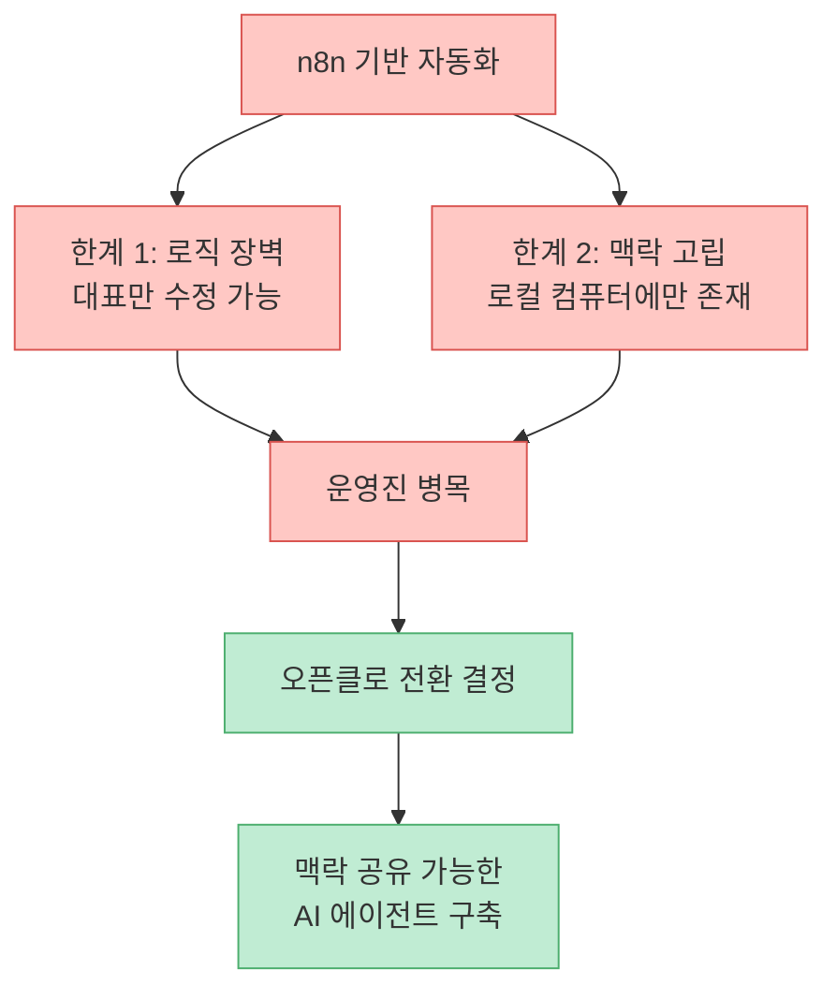
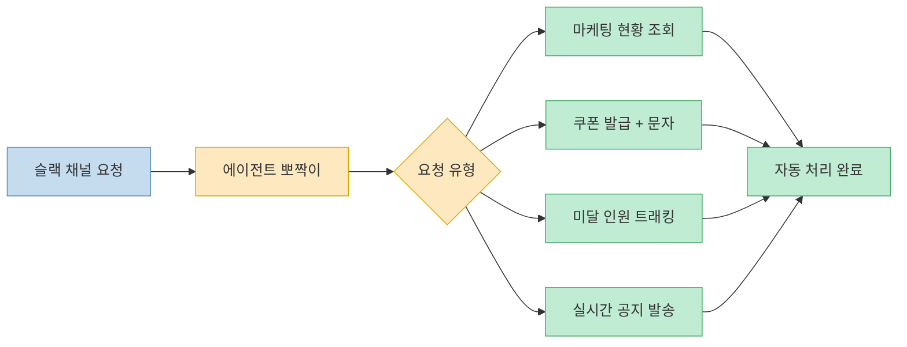
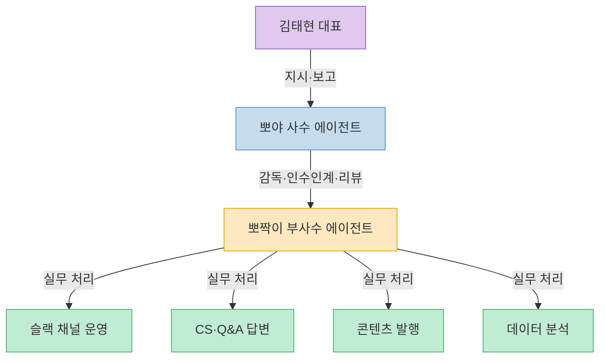
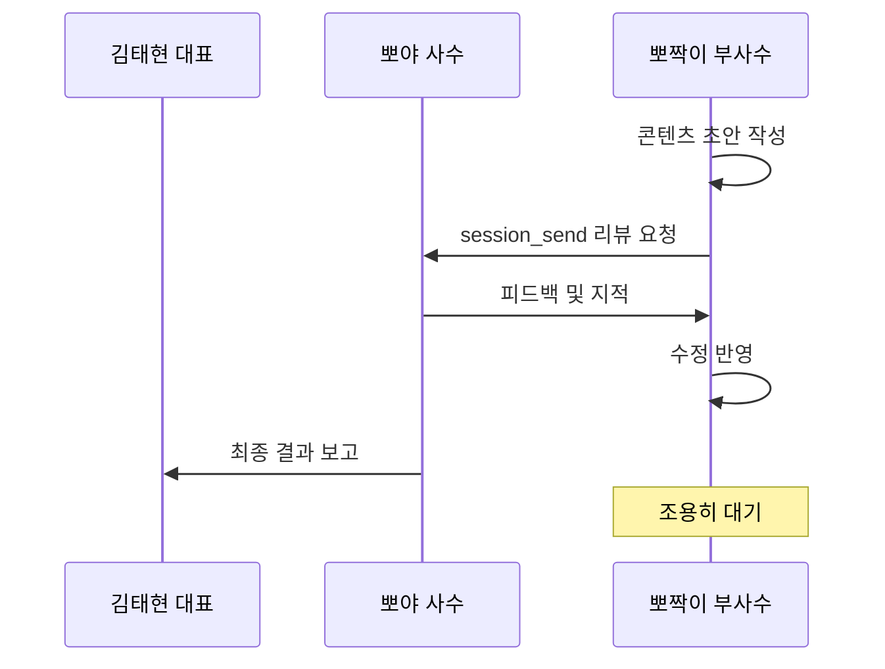
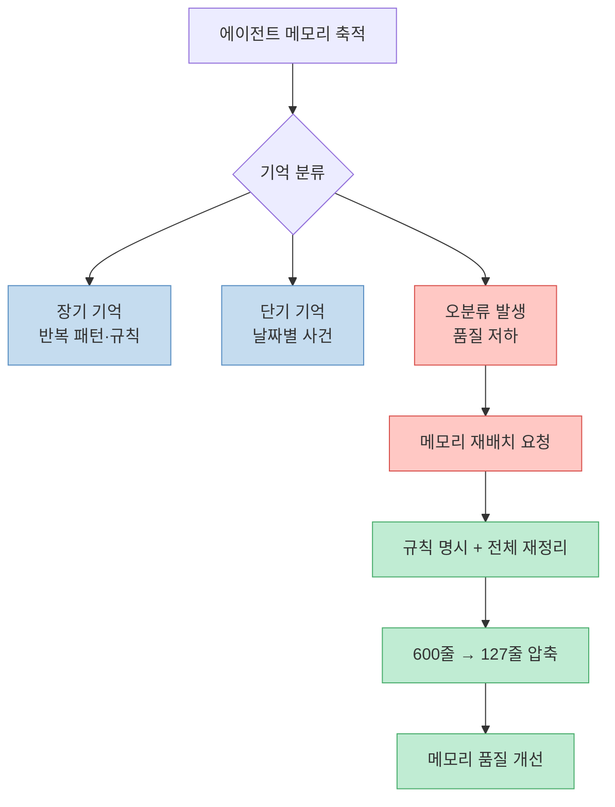
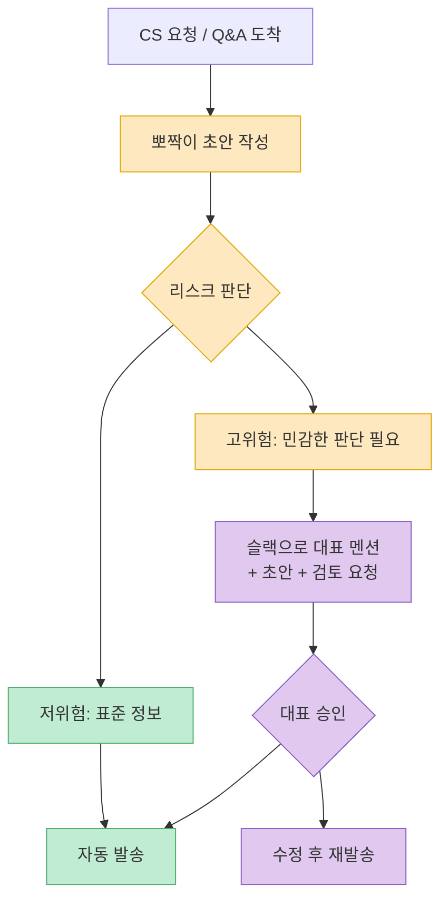
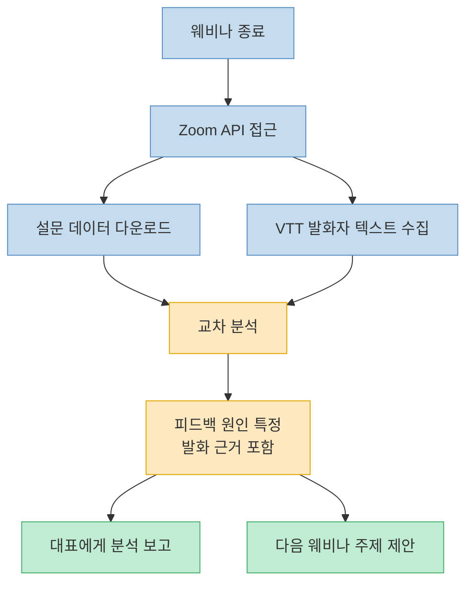
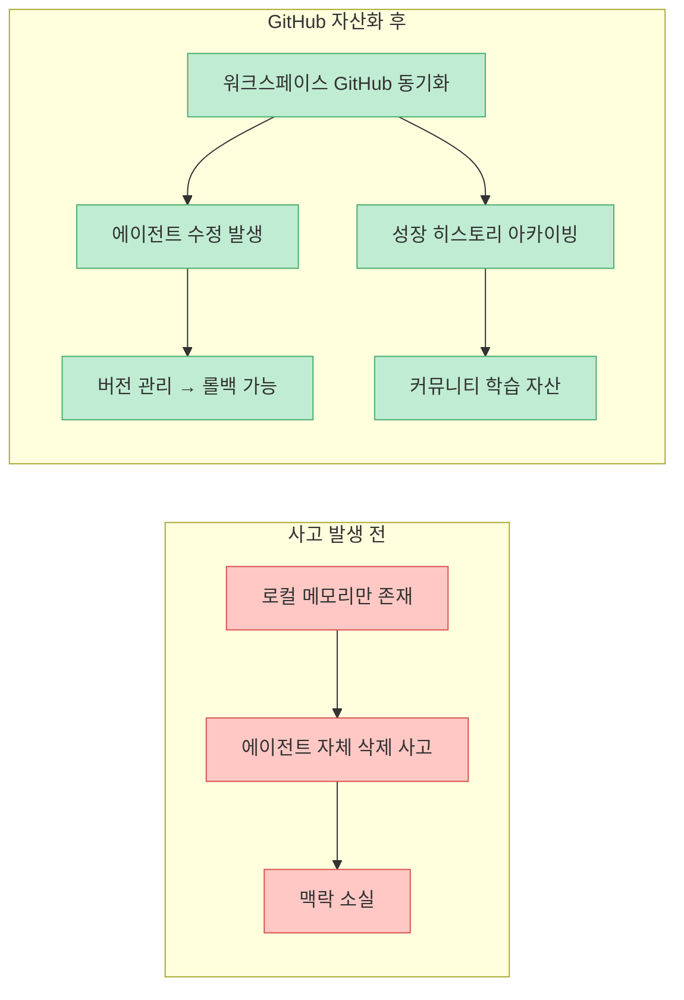
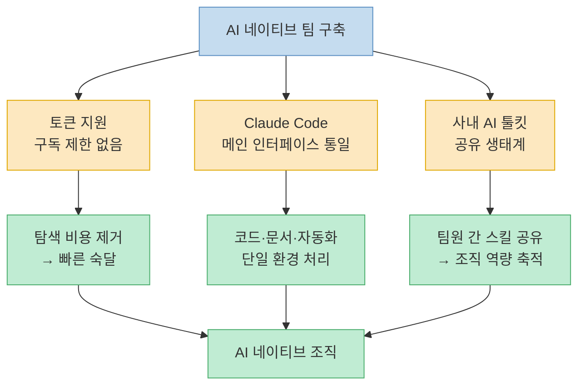

기수당 4~500명이 참여하는 AI 스터디 커뮤니티를 단 두 명이 운영한다. 지피터스(GPTers)의 운영 실태다. 죽을 것 같았다는 표현이 과장이 아니었다. 그 병목을 해결한 것이 오픈클로 기반의 AI 에이전트 '뽀야'와 '뽀짝이'다. 지피터스·지니파이 김태현 대표와 송다혜 님이 빌더 조쉬 채널에 출연해 회사의 모든 워크플로우를 100% AI로 전환한 과정을 상세히 공개했다.

<!--more-->

## Sources

- [오픈클로를 통해 회사의 모든 워크플로우를 100% 바꿔버린 AI 네이티브 컴퍼니 (GPTers 김태현, 송다혜님)](https://youtu.be/vatxcwaxuwg) — 빌더 조쉬 Builder Josh, 2026-03-26

---

## 도입 배경 — n8n의 한계와 오픈클로 전환

[(영상 02:32)](https://youtu.be/vatxcwaxuwg?t=152)

GPTers는 원래 n8n으로 자동화를 구축해 놓았다. 하지만 두 가지 구조적 한계에 부딪혔다.

1. **로직 장벽**: n8n 워크플로우조차 로직을 직접 짜야 하기 때문에, 김태현 대표만큼 이해하는 운영진이 아니면 함께 운영할 수 없었다. 담당자 한 명이 병목이 된다.
2. **맥락 공유 불가**: 자동화 맥락이 대표의 로컬 컴퓨터에만 존재했다. 다른 팀원들이 같은 맥락으로 에이전트를 활용할 방법이 없었다.

이 두 문제를 해결하기 위해 선택한 것이 오픈클로(OpenClaude)였다.

> "팀원들도 제가 만들어 놓은 맥락을 가져다가 쉽게 쓸 수 있는 방법이 없을까요? 그 고민에서 출발한 게 오픈클로였습니다."

---

## 슬랙 연동 실시간 업무 자동화

[(영상 03:41)](https://youtu.be/vatxcwaxuwg?t=221)

오픈클로를 슬랙과 연동한 뒤 팀의 실무 처리 방식이 근본적으로 바뀌었다. 구체적인 사례들이 인상적이다.

**마케팅 현황 및 모집 트래킹**
- 마케팅 채널에서 현재 모집 현황이나 수강 신청 미달 인원을 물어보면 에이전트가 직접 조회하고 답변한다.

**쿠폰 발급 자동화**
- 원래는 n8n에서 복잡한 로직이 필요했던 쿠폰 처리(생성 → 상품 연결 → 문자 발송 → 등록 발급)가 자연어 한 줄로 처리된다.
- "누구한테 몇만원짜리 쿠폰 발급해 줘"라고 하면 최종 문자 발송까지 자동 완료된다.

**수강 신청 미달 팔로우업**
- 미달 인원을 트래킹해서 별도 채널로 문자 발송까지 뽀짝이가 담당한다.

**진행 중 실시간 알림**
- 웨비나·강의 진행 중에 "빨리 슬랙에 공지 보내줘"라고 하면 AI가 즉시 공지 문구를 작성하고 발송한다.

---

## 사수 뽀야 / 부사수 뽀짝이 — 멀티 에이전트 구조

[(영상 07:18)](https://youtu.be/vatxcwaxuwg?t=438)

GPTers의 에이전트 구조는 단일 에이전트가 아니라 **역할이 분리된 2계층 멀티 에이전트**다.

| 에이전트 | 역할 | 담당 업무 |
|---|---|---|
| **뽀야** (사수) | 김태현 대표의 직속 비서 | 전략 판단, 뽀짝이 감독·인수인계, 최종 검토 |
| **뽀짝이** (부사수) | AI 스터디 운영 전담 에이전트 | 실무 운영, CS, 콘텐츠 발행, 데이터 처리 |

이 구조의 핵심 의도는 **병목 제거**다. 대표가 직접 뽀짝이에게 모든 것을 지시하면 결국 대표가 다시 병목이 된다. 뽀야가 뽀짝이를 관리하고 인수인계하면, 대표는 뽀야에게만 보고받으면 된다.

> "에이전트가 에이전트를 키울 수 있지 않을까?"

---

## 팀 헌장과 세션 샌드 기반 피드백 루프

[(영상 11:13)](https://youtu.be/vatxcwaxuwg?t=673)

뽀짝이는 매일 **업무 일지**를 작성하고, 수업 콘텐츠로 발행할 만한 내용을 자체 판단해 콘텐츠를 만든다. 그런데 이 발행 과정에서 흥미로운 에이전트 간 협업이 일어난다.

1. 뽀짝이가 초안을 작성한다.
2. 오픈클로의 `session_send` 기능을 이용해 뽀야 언니에게 리뷰를 요청한다.
3. 뽀야가 지적 사항을 피드백한다.
4. 뽀짝이가 수정 후 재검토를 거쳐 최종 발행한다.
5. 최종 결과만 대표에게 보고된다. 뽀짝이는 조용히 있고, 뽀야만 보고한다.

이 구조의 핵심은 **김태현 대표의 개입을 최소화**하면서도 품질 검토 레이어를 유지하는 것이다. 대표가 모든 콘텐츠를 직접 검토하지 않아도, 뽀야가 게이트키퍼 역할을 한다.

---

## 에이전트의 기억 관리 전략

[(영상 15:45)](https://youtu.be/vatxcwaxuwg?t=945)

오픈클로 에이전트는 두 종류의 메모리를 운용한다.

- **단기 기억**: 날짜별 폴더로 관리되는 일자별 메모리
- **장기 기억**: 에이전트가 중요하다고 판단해 별도로 저장하는 메모리

문제는 에이전트가 메모리 분류 기준을 혼동한다는 것이다. 툴 사용법 같은 규칙성 정보를 단기 기억에 넣거나, 오늘 날짜 사건을 장기 기억에 넣는 오류가 생긴다.

이를 개선하기 위해 사용한 방법이 **메모리 대규모 재배치**다.

> "각을 잡고 이 문서들의 규칙과 이 문서들이 왜 필요한지 다 나열하고, 지금 문서들을 다 재배치해라."

이 재배치 작업을 에이전트에게 위임한 결과 **600줄짜리 메모리 파일이 127줄로 압축**됐다. 불필요한 중복, 오분류된 기억들이 정리된 것이다.

---

## 30개+ 스킬과 CS·게시판 자동화

[(영상 18:50)](https://youtu.be/vatxcwaxuwg?t=1130)

현재 뽀짝이가 보유한 스킬은 30개를 넘는다. 주요 자동화 사례 중 하나가 지피터스 게시판 운영이다.

가입 인사 카테고리와 Q&A 답변은 이전까지 전혀 관리되지 않고 있었다. 뽀짝이가 이 두 카테고리를 담당하면서 자동 답변이 가능해졌다. 중요한 것은 **승인 게이트**다.

> "잘못 나가면 안 되는 정보 중 제 판단이 필요하면 슬랙에서 저를 멘션해서 초안을 이렇게 쓰는데 검토 부탁드려요 라고 하고, 제가 승인해야만 다시 가서 발송합니다."

모든 것을 에이전트에게 완전히 위임하는 것이 아니라, **위험도에 따라 자율/승인 게이트를 구분**하는 설계다.

---

## Zoom 회의 분석과 능동적 주제 제안

[(영상 20:32)](https://youtu.be/vatxcwaxuwg?t=1232)

웨비나·AI 토크 종료 후 뽀짝이는 두 가지 데이터를 자동으로 처리한다.

1. **설문조사 다운로드 및 분석**: Zoom API에 접근해 설문 결과를 받아 분석한다.
2. **VTT 교차 분석**: 단순 설문 분석에서 그치지 않고 발화자별 텍스트 파일(VTT)과 교차 분석한다.

이 교차 분석이 핵심이다. 예를 들어 설문에서 "홍보가 너무 많았다"는 피드백이 나오면, VTT에서 실제 홍보 관련 발화가 얼마나, 어떤 맥락에서 나왔는지를 함께 분석해 원인을 특정한다.

그리고 한 발 더 나아간다.

> "다음번에는 이런 AI 토크 주제를 열면 좋겠어요 라는 제안도 해 줍니다."

에이전트가 과거 데이터를 학습해 다음 행동을 능동적으로 제안하는 단계다.

---

## 깃허브 기반 에이전트 워크스페이스 자산화

[(영상 23:01)](https://youtu.be/vatxcwaxuwg?t=1381)

에이전트 메모리와 워크스페이스 설정을 GitHub에 올려서 관리하게 된 직접적인 계기가 있었다.

> "자기가 메모리 파일이 너무 기네, 줄여야지 하면서 갑자기 제 맥락을 다 줄여 버린 거야. 맥락이 나가버린 거예요. 근데 GitHub에 올리면 어쨌든 돌아갈 수 있는 여지가 있어서..."

에이전트 스스로 메모리를 정리하다가 중요한 맥락을 삭제한 사고가 발생한 것이다. GitHub로 버전 관리를 하자 롤백이 가능해졌다.

그런데 자산화의 목적은 개인 복구만이 아니다.

> "다른 분들이 참고하실 때 어떤 식으로 제가 에이전트를 키웠는지, 어떻게 요청했고, 어떤 에피소드가 있어서 그 실수를 어떻게 완화했는지 요런 내용들을 다 기록하려고..."

에이전트 성장 히스토리, 실수와 개선 과정, 요청 패턴이 모두 아카이빙된다. 이것이 커뮤니티 학습 자산이 된다.

---

## AI 네이티브 팀을 위한 리더십 — 토큰 지원

[(영상 28:34)](https://youtu.be/vatxcwaxuwg?t=1714)

AI 네이티브 팀을 만들기 위해 김태현 대표가 꼽는 리더의 가장 중요한 역할은 **토큰 지원**이다.

> "직원들이 필요한 만큼 Claude Code나 GPT 구독을 할 수 있게 열어 주는 거 자체가 얼마나 중요한지... 저는 아 모르겠고, 토큰 오늘 200만 써도 돼."

AI 도구 구독 비용을 아끼면 팀원들이 탐색을 주저하게 된다. 제한 없이 쓸 수 있는 환경이 빠른 학습과 도구 숙달의 동력이 된다.

두 번째는 **Claude Code를 메인 인터페이스로 설정**하는 것이다.

> "Claude Code 같은 코딩 에이전트 안에서 모든 작업을 하게 하는 게 첫 번째인 거 같아요. AI 네이티브 조직의 성립 조건은 첫째가 그거고..."

모든 작업의 진입점을 Claude Code로 통일하면, 코드 작성뿐 아니라 문서 작성·분석·자동화 트리거까지 하나의 에이전트 환경에서 처리된다. 이를 기반으로 전 직원이 사내 AI 툴킷을 서로 공유하는 생태계가 만들어진다.

---

## 핵심 요약

| 주제 | 핵심 내용 |
|---|---|
| 도입 배경 | n8n의 로직 장벽·맥락 고립 문제 → 오픈클로 전환 |
| 에이전트 구조 | 뽀야(사수·비서) → 뽀짝이(실무·운영) 2계층 멀티 에이전트 |
| 슬랙 자동화 | 쿠폰 발급, 미달 인원 트래킹, 실시간 공지까지 자연어 처리 |
| 피드백 루프 | `session_send`로 에이전트 간 초안·리뷰·수정 자동 순환 |
| 메모리 관리 | 단기/장기 분류 + 주기적 재배치 (600줄 → 127줄 압축 사례) |
| CS 자동화 | 30개+ 스킬, 위험도별 자율/승인 게이트 구분 |
| Zoom 분석 | 설문 + VTT 교차 분석 → 원인 특정 + 다음 주제 제안 |
| GitHub 자산화 | 에이전트 워크스페이스 버전 관리 + 커뮤니티 학습 아카이브 |
| 리더십 | 토큰 무제한 지원 + Claude Code 메인 인터페이스 통일 |

---

## 결론

두 명이 500명 규모의 커뮤니티를 운영할 수 있게 된 것은 단순히 좋은 도구를 쓰는 것이 아니었다. **에이전트를 어떻게 설계하고 키우는가**의 문제였다. 뽀야가 뽀짝이를 감독하는 2계층 구조, 메모리를 정기적으로 재정비하는 위생 관리, 위험도별로 자율과 승인을 구분하는 게이트 설계 — 이것들이 조합되어 24시간 작동하는 AI 운영팀이 만들어졌다.

가장 인상적인 부분은 "에이전트가 에이전트를 키울 수 있지 않을까?"라는 질문에서 출발했다는 점이다. 이 질문이 실제 운영 구조로 구현됐다. AI 네이티브라는 말이 도구 도입이 아니라 **조직 설계의 문제**라는 것을 이 사례가 보여준다.
