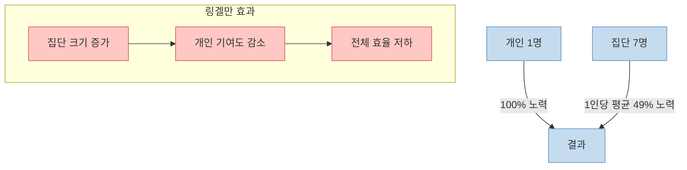
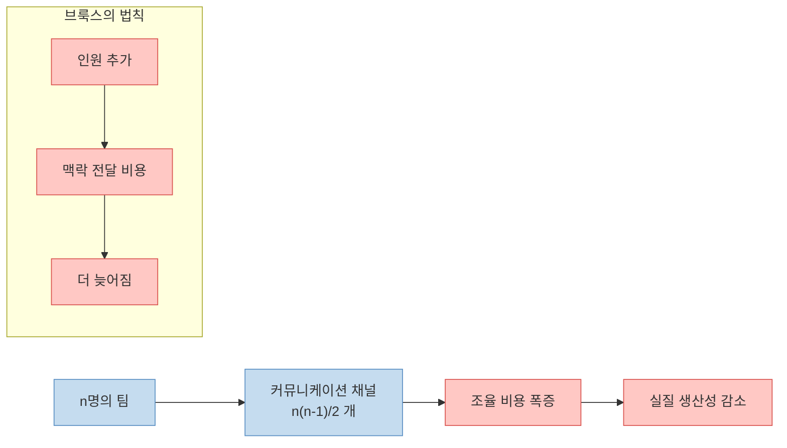
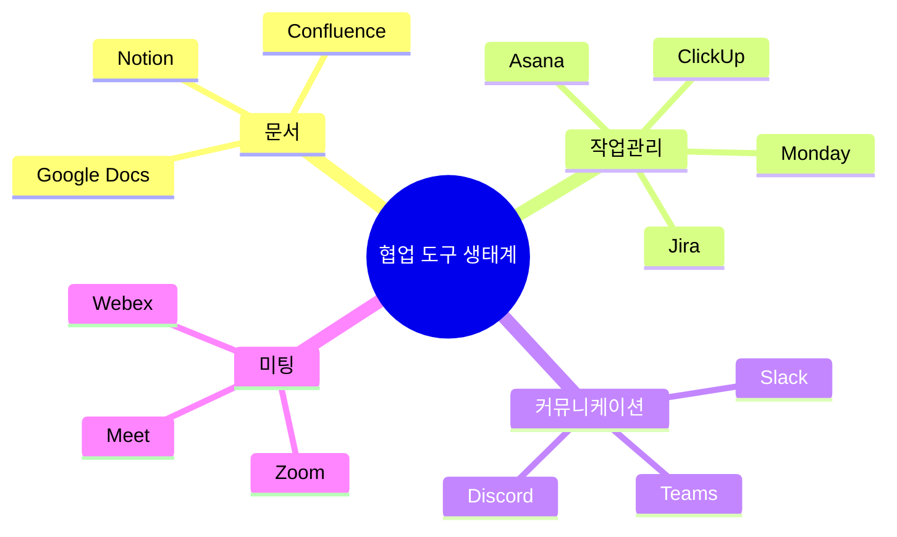
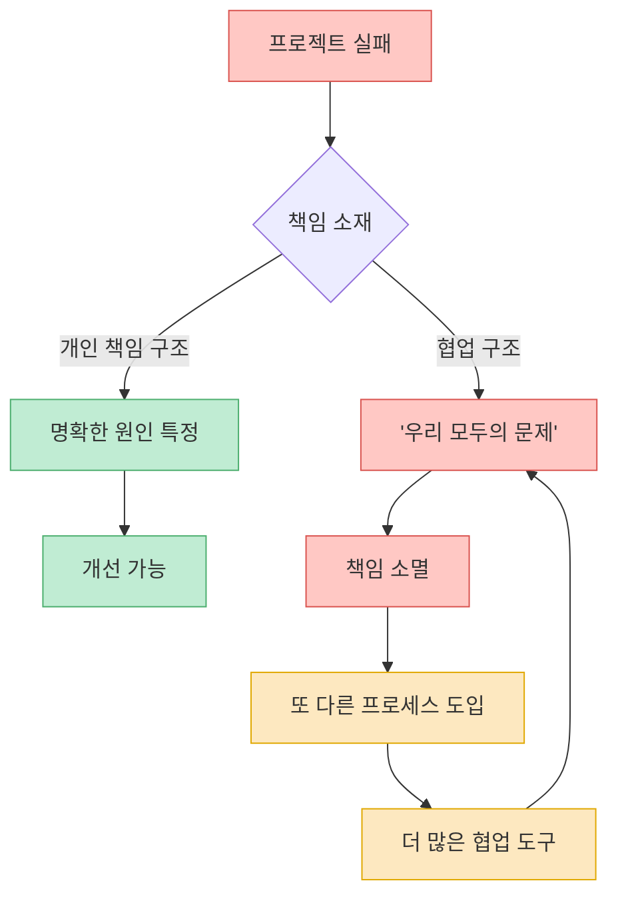
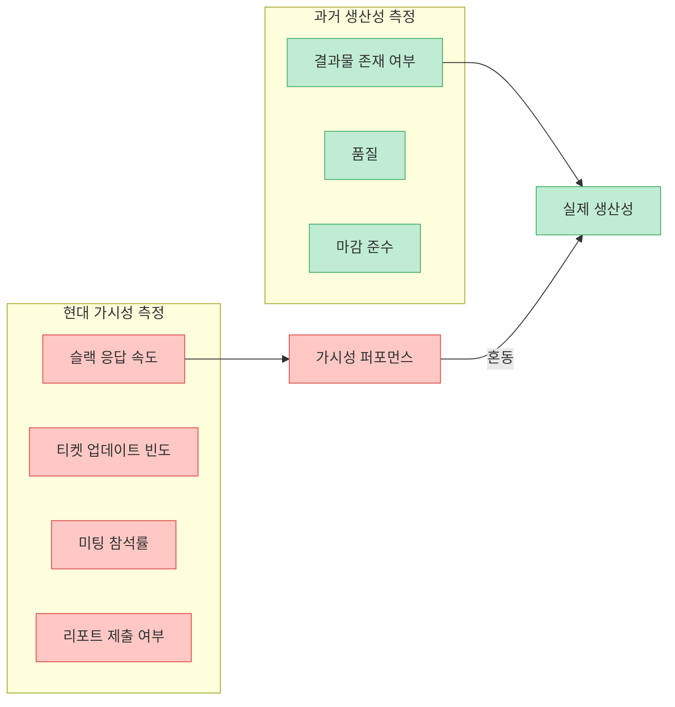
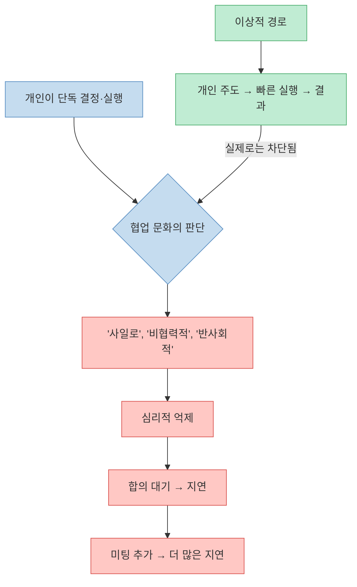
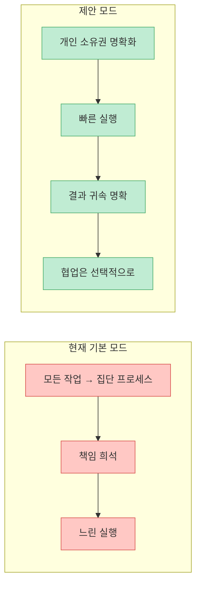

"협업"은 현대 직장의 종교다. 슬랙 채널, 칸반 보드, 회고 미팅, 킥오프 세션 — 모든 것이 함께 일한다는 신화 위에 쌓여 있다. 그러나 테크 저술가 JA Westenberg는 2026년 3월 발표한 글에서 이 전제 자체를 정면으로 부정한다. 협업이라는 이름의 프로세스가 실제로는 책임을 희석시키고, 조율 비용을 폭증시키며, 개인 주도성을 문화적 죄악으로 낙인찍는다는 것이다.

<!--more-->

## Sources

- [Collaboration is Bullshit — JA Westenberg](https://www.joanwestenberg.com/collaboration-is-bullshit/) (2026-03-22)

---

## 역사가 먼저 경고했다

Westenberg의 주장은 단순한 직장인 愚痴가 아니다. 수십 년에 걸친 실증 연구들이 집단 작업의 구조적 결함을 이미 기록해 놓았다.

### 링겔만 효과 (1913)

프랑스 농업공학자 Maximilien Ringelmann은 1913년 줄다리기 실험을 통해 충격적인 사실을 발견했다. **집단 크기가 커질수록 개인이 발휘하는 힘이 줄어들었다.** 혼자 당길 때를 100%로 보면, 7명이 함께 당길 때 개인 기여는 평균 49%로 떨어진다. 집단이 커질수록 "내가 덜 해도 누군가가 채워주겠지"라는 심리가 작동한다. 이것이 사회심리학에서 말하는 **사회적 태만(Social Loafing)** 이다.

### S.L.A. Marshall의 전투 연구 (1947)

미 육군 역사가 S.L.A. Marshall은 2차 세계대전 직후 발간한 *Men Against Fire*에서 전투 소총수의 **15~20%만 실제로 무기를 발사했다** 는 사실을 기록했다. 나머지는 탄약을 날랐고, 위치를 유지했고, "구조적 지원"을 제공했다. 물리적으로 같은 전장에 있었지만, 실질적 행동을 취한 개인은 소수였다.

집단이 클수록 개인은 자신의 행동이 전체 결과에 미치는 영향을 과소평가하고, 직접 행동에 나서지 않게 된다. 전쟁터에서도 이러했다면, 오피스 환경에서는 말할 것도 없다.

### IBM의 80/20 발견 (1960년대)

IBM은 1960년대 자사 컴퓨터 사용 데이터를 분석해 **전체 사용량의 80%가 전체 기능의 20%에서 발생한다** 는 사실을 발견했다. 파레토 원칙의 변주지만, 협업 맥락에서의 함의는 더 직접적이다. 집단 안에서도 실질적 기여는 소수에 집중된다. 나머지는 참여한다는 외형만 갖출 뿐이다.

### 브룩스의 법칙 (1975)

소프트웨어 공학의 고전 *The Mythical Man-Month*에서 Frederick Brooks가 정식화한 법칙이다.

> **늦어진 소프트웨어 프로젝트에 인력을 추가하면 더 늦어진다.**

이유는 명확하다. 새 구성원은 기존 맥락을 학습해야 하고, 기존 구성원은 새 구성원을 교육해야 한다. 커뮤니케이션 채널 수는 인원 수의 제곱에 비례해 증가한다. 즉, 협업에는 **조율 비용(coordination overhead)** 이 따르며, 이 비용이 협업의 이익을 초과하는 시점이 존재한다.

---

## 현대 직장의 협업 인프라 — 도구의 과부하

역사적 경고에도 불구하고, 현대 직장은 협업 인프라를 끝없이 확장했다. Westenberg는 이를 직접 나열한다.

> Notion for documents, ClickUp for tasks, Slack for conversations, Jira for tickets, Monday for boards, Teams for calls...

직원들은 하루에도 수백 번 이 시스템들을 전환하며, 각 시스템의 알림에 반응하고, 업데이트를 게시하고, 현황을 공유한다. **그러나 실제로 만들어지는 것은 없다.**

각 도구는 도입될 때마다 "협업을 향상시킨다"는 약속과 함께 들어온다. 실제로는 관리할 계정이 하나 더 늘고, 확인해야 할 채널이 하나 더 생기고, 참석해야 할 미팅이 하나 더 추가된다.

---

## 책임의 희석 — 협업이 책임감을 어떻게 파괴하는가

Westenberg의 핵심 주장은 여기서 나온다. **협업은 책임을 개인에서 집단으로 이전함으로써 책임 자체를 소멸시킨다.**

프로젝트가 실패하면 누구의 잘못인가? "우리 모두의 잘못"이 된다. 이는 "아무도 잘못하지 않았다"와 동의어다. 개인이 명확한 책임 하에 일할 때는 실패의 원인을 특정하고 개선할 수 있다. 그러나 협업 구조에서는 실패가 **프로세스 문제**로 재프레이밍된다.

이 구조는 자기강화 루프를 만든다. 협업이 실패를 낳고, 실패를 해결하기 위해 더 많은 협업 도구와 프로세스를 도입하고, 그것이 다시 책임을 희석시킨다.

---

## 가시성이 생산성을 대체하는 현상

Westenberg가 제시한 가장 날카로운 관찰 중 하나다.

> **Transparency got confused with progress, visibility got confused with accountability.**
> 투명성이 진전과 혼동됐고, 가시성이 책임감과 혼동됐다.

현대 협업 문화에서 "일하고 있음"을 증명하는 방법은 실제 결과물이 아니라 **도구에 얼마나 자주 업데이트를 올리느냐**로 측정된다. 슬랙에서 활발히 반응하고, 지라 티켓 상태를 업데이트하고, 위클리 리포트를 작성하면 "열심히 일하는 사람"으로 보인다.

이 역전은 직원에게 이중의 부담을 지운다. 실제 일도 해야 하지만, 동시에 일하고 있다는 **퍼포먼스**도 해야 한다. 후자가 전자를 잠식하기 시작하면서, 도구는 작업을 위해 존재하는 것이 아니라 작업이 도구를 위해 존재하게 된다.

---

## 이데올로기의 역전 — 개인 주도성의 문화적 낙인

가장 역설적인 현상은 이것이다. 협업 문화가 뿌리내리면서 **혼자 결정하고 실행하는 행동 자체가 문화적 위반이 된다.**

- 혼자 코드를 짜고 PR을 올리면 "사일로에 갇혀 있다"는 피드백을 받는다.
- 빠르게 단독으로 결정을 내리면 "합의를 무시한다"는 비판이 따른다.
- 팀 채널 대신 직접 해결하면 "투명성이 부족하다"고 질책받는다.

Westenberg가 지적하는 이 이데올로기적 역전은 조직을 느리게 만든다. 명확한 판단력을 가진 개인이 자율적으로 행동하는 것이 가장 빠른 실행 경로임에도 불구하고, 그 경로는 문화적으로 봉쇄된다.

---

## Westenberg의 해법 — 개인 책임으로의 회귀

Westenberg는 "협업을 완전히 제거하라"고 주장하지 않는다. 그의 해법은 구조의 전환이다.

**핵심 원칙:**
- **명확한 소유권 배정**: 누가 무엇에 책임을 지는지 명확히 하라. "우리 팀이 담당한다"는 실질적으로 아무도 담당하지 않는다는 뜻이다.
- **개인 책임을 성과 측정의 중심에 두어라**: 결과물에 이름을 붙여라.
- **조직 감시를 줄여라**: 개인이 자신의 작업 방식을 관리하도록 신뢰하라. 모든 태스크의 가시성을 요구하는 것은 불신의 표현이자 생산성의 적이다.
- **협업은 필요할 때 도구로 사용하라**: 기본 모드가 아닌 선택적 수단으로.

---

## 핵심 요약

| 항목 | 내용 |
|---|---|
| 링겔만 효과 | 집단 크기↑ → 개인 노력↓ (1913, 실증) |
| S.L.A. Marshall | 전투 소총수 중 15~20%만 실제 발포 (1947) |
| IBM 80/20 | 80% 사용량이 20% 기능에서 발생 (1960s) |
| 브룩스의 법칙 | 늦은 프로젝트에 인원 추가 시 더 늦어짐 (1975) |
| 현대 협업 인프라 | Notion·ClickUp·Slack·Jira 등 다중 도구로 조율 비용 폭증 |
| 책임 희석 | 집단 책임 = 무책임, 실패가 프로세스 문제로 재프레이밍됨 |
| 가시성 착각 | 투명성이 진전과, 가시성이 책임감과 혼동됨 |
| 이데올로기 역전 | 개인 주도성이 "비협력적"으로 낙인찍힘 |
| 해법 | 명확한 개인 소유권, 결과 귀속, 협업을 선택적 도구로 격하 |

---

## 결론

Westenberg의 주장은 불편하지만 무시하기 어렵다. 협업이 나쁜 것이 아니다. 문제는 협업이 **목적이 아닌 기본 모드**가 됐을 때다. 링겔만, 마셜, 브룩스가 서로 다른 시대와 영역에서 동일하게 경고한 것이 있다면 — 집단이 개인을 대체할 수 없다는 것이다. 집단은 개인의 기여를 연결할 때 가치가 있지, 개인의 책임을 희석시킬 때는 해악이 된다.

"팀 플레이어"라는 칭찬이 "결과를 만든 사람"이라는 칭찬보다 더 자주 들린다면, 그 조직은 무언가 잘못된 방향으로 가고 있는 것이다.
