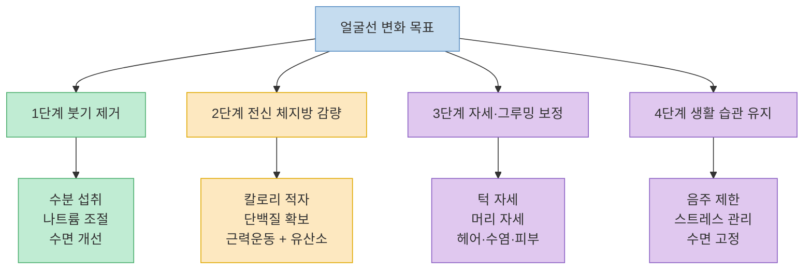
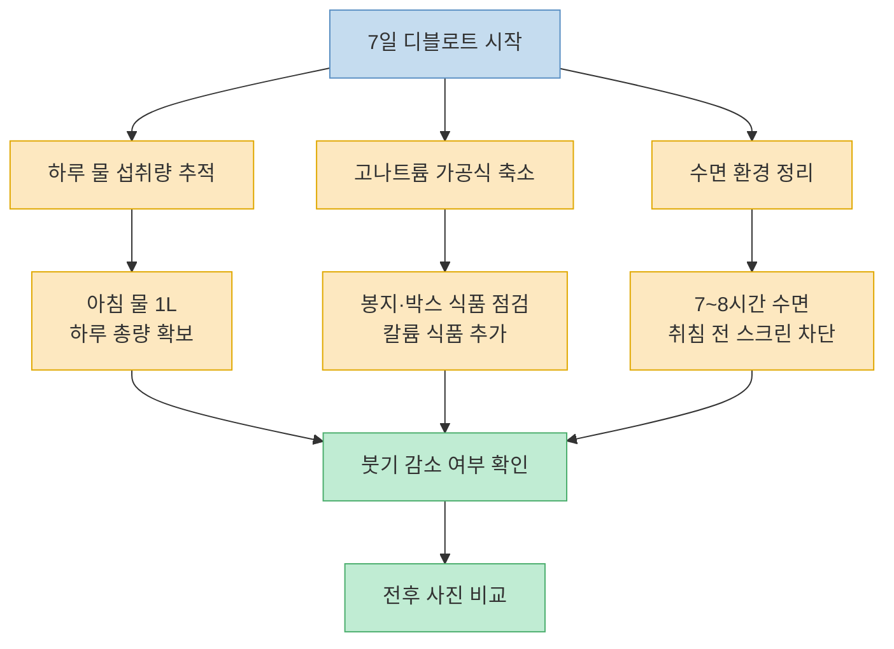
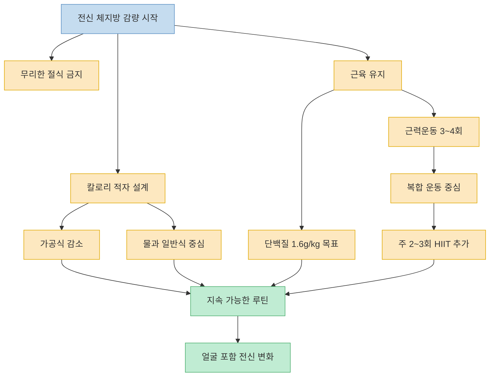
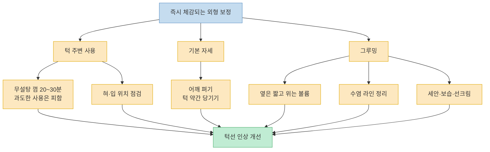

같은 체지방률이어도 어떤 사람은 턱선이 더 또렷해 보이고, 어떤 사람은 얼굴이 더 붓고 둔해 보인다. Titan Mode 영상은 그 차이를 단순 유전으로 보지 않고, `붓기`, `전신 체지방`, `턱 주변 근육과 자세`, `그루밍`, `수면과 스트레스` 같은 일상 습관의 조합으로 설명한다. 다만 영상은 동기부여형 표현이 강하고 일부 구간은 근거를 자세히 제시하지 않기 때문에, 이 글에서는 과장된 문장은 걷어내고 실제로 무엇을 바꾸라는 이야기인지 구조적으로 다시 정리해 본다. [(0:00)](https://youtu.be/MUFGLmuzC64?t=0), [(3:39)](https://youtu.be/MUFGLmuzC64?t=219), [(7:52)](https://youtu.be/MUFGLmuzC64?t=472)

<!--more-->

## Sources

- [How to ACTUALLY Lose Face Fat Fast (No BS Guide)](https://www.youtube.com/watch?v=MUFGLmuzC64) — Titan Mode, 2025-11-22

---

## 이 영상의 핵심 프레임 — 얼굴선은 지방만이 아니라 붓기와 연출의 문제이기도 하다

영상은 얼굴 라인을 바꾸는 경로를 하나로 보지 않는다. 먼저 며칠 단위로 바뀔 수 있는 **붓기** 를 제거하고, 그다음 몇 주 이상이 걸리는 **전신 체지방 감량** 으로 넘어가며, 동시에 **턱선이 더 선명하게 보이도록 만드는 자세·그루밍·생활 습관** 을 얹는 구조다. 즉 "얼굴 살만 빼는 비법"이 아니라, 빠르게 바뀌는 요소와 느리게 바뀌는 요소를 층위별로 다루는 방식이다. [(0:13)](https://youtu.be/MUFGLmuzC64?t=13), [(3:35)](https://youtu.be/MUFGLmuzC64?t=215), [(5:09)](https://youtu.be/MUFGLmuzC64?t=309), [(6:14)](https://youtu.be/MUFGLmuzC64?t=374)

여기서 중요한 포인트는 영상도 **얼굴 부위만 따로 지방을 뺄 수는 없다고 인정한다** 는 점이다. 볼살이나 턱밑살을 특정 운동만으로 직접 태우는 것은 불가능하고, 실제 지방 감소는 칼로리 적자와 운동을 통한 전신 변화에서 온다는 주장이다. 대신 얼굴은 체중 변화가 비교적 먼저 드러나는 부위라고 설명하면서, 단기적으로는 붓기 관리가, 중기적으로는 체지방 감량이 외형 변화를 만든다고 본다. [(3:39)](https://youtu.be/MUFGLmuzC64?t=219), [(3:48)](https://youtu.be/MUFGLmuzC64?t=228), [(4:56)](https://youtu.be/MUFGLmuzC64?t=296)

---

## 7일 디블로트 루틴 — 영상이 가장 빠른 변화 구간으로 보는 파트

영상이 가장 강조하는 첫 단계는 **얼굴 붓기부터 빼라** 는 것이다. 여기서 제시하는 축은 세 가지다. `하루 3L 물 마시기`, `고나트륨 가공식 줄이기`, `수면 질 개선하기`다. 설명 방식은 단순하다. 탈수 상태가 지속되면 몸이 수분을 붙잡고, 이때 눈 밑이나 볼 주변이 더 부어 보일 수 있다는 논리다. 그래서 아침에 먼저 물 1L를 마시고, 하루 내내 물병을 들고 다니며, 실제 섭취량을 추적하라고 말한다. 커피나 에너지드링크는 물 대체재로 보지 않는다. [(0:16)](https://youtu.be/MUFGLmuzC64?t=16), [(0:45)](https://youtu.be/MUFGLmuzC64?t=45), [(1:00)](https://youtu.be/MUFGLmuzC64?t=60)

나트륨에 대해서는 더 직접적인 규칙을 제시한다. 봉지나 박스 식품 중 1회 제공량당 나트륨이 500mg을 넘으면 피하고, 칩이나 인스턴트 식품 대신 과일이나 일반식으로 바꾸라는 것이다. 동시에 바나나, 시금치, 고구마, 아보카도처럼 칼륨이 많은 식품을 추천하면서, 나트륨 과잉을 상쇄하는 방향으로 식단을 조정하라고 말한다. 매일 아침 바나나, 시금치, 아보카도, 코코넛워터를 넣은 스무디를 제안하는데, 이 구간의 "48시간 안에 얼굴이 조여진다"는 표현은 영상의 주장으로 읽는 편이 안전하다. [(1:20)](https://youtu.be/MUFGLmuzC64?t=80), [(1:28)](https://youtu.be/MUFGLmuzC64?t=88), [(1:37)](https://youtu.be/MUFGLmuzC64?t=97), [(1:50)](https://youtu.be/MUFGLmuzC64?t=110)

세 번째 축은 수면이다. 하루만 잠을 못 자도 코르티솔이 올라가고 얼굴이 붓고 피곤해 보인다고 설명하면서, 7~8시간 수면, 일정한 취침 시간, 자기 전 1시간 스크린 차단, 어둡고 서늘한 방 환경을 권한다. 코를 골거나 오래 자도 개운하지 않으면 수면무호흡 검사를 받아 보라는 대목도 포함된다. 또한 베개를 하나 더 쓰거나 상체를 약간 높여 자면 밤사이 얼굴 쪽으로 체액이 몰리는 것을 줄일 수 있다고 말한다. [(2:15)](https://youtu.be/MUFGLmuzC64?t=135), [(2:33)](https://youtu.be/MUFGLmuzC64?t=153), [(2:48)](https://youtu.be/MUFGLmuzC64?t=168), [(3:00)](https://youtu.be/MUFGLmuzC64?t=180)

이 파트를 실행 과제로 바꾸면 결국 이런 구조다. 얼굴선이 답답해 보일 때 곧바로 "지방이 너무 많아서"라고 결론내리기보다, 먼저 1주일 정도 **수분·나트륨·수면** 을 같이 조정해 보고 전후 사진으로 변화를 확인해 보라는 것이다. 영상이 처음 7일 챌린지를 제안하는 이유도, 장기 감량에 들어가기 전에 붓기라는 노이즈를 먼저 걷어내자는 데 있다. [(3:08)](https://youtu.be/MUFGLmuzC64?t=188), [(3:19)](https://youtu.be/MUFGLmuzC64?t=199), [(3:27)](https://youtu.be/MUFGLmuzC64?t=207)

---

## 체지방 감량 파트 — 얼굴 운동이 아니라 전신 전략이 핵심이다

영상의 두 번째 단계는 보다 정석적이다. 얼굴 지방만 골라서 뺄 수 없으니, 결국 해야 하는 일은 **전신 체지방률을 낮추는 것** 이라고 못 박는다. 다만 여기서도 극단적인 절식은 반대한다. 굶거나 급하게 빼면 근육을 잃고, 대사도 떨어지고, 결과적으로 마른 비만처럼 보일 수 있다는 설명이다. 그래서 기본은 `칼로리 적자 + 근육 보존`이다. [(3:39)](https://youtu.be/MUFGLmuzC64?t=219), [(3:59)](https://youtu.be/MUFGLmuzC64?t=239), [(4:02)](https://youtu.be/MUFGLmuzC64?t=242)

구체적 실행안도 단순하다. 탄산음료를 물로 바꾸고, 튀긴 간식은 과일로, 가공식은 일반식으로 바꾸며, 단백질 섭취를 우선순위로 둔다. 닭고기, 달걀, 생선, 렌틸콩, 그릭요거트가 예시로 등장하고, 체중 1kg당 단백질 1.6g 이상을 목표로 잡는다. 메시지는 "유행 다이어트"가 아니라, 포만감과 근육 유지를 같이 챙기는 식사를 하라는 데 가깝다. [(4:08)](https://youtu.be/MUFGLmuzC64?t=248), [(4:15)](https://youtu.be/MUFGLmuzC64?t=255), [(4:23)](https://youtu.be/MUFGLmuzC64?t=263)

운동은 근력운동과 유산소를 함께 묶는다. 스쿼트, 데드리프트, 벤치프레스, 로우처럼 큰 근육을 쓰는 복합 운동으로 제지방량을 유지하고, 주 2~3회 HIIT를 얹는 구성을 추천한다. 예시로는 30초 전력 질주 후 2분 휴식, 3~5세트 반복이 나온다. 핵심 문장은 "강도보다 지속성"이다. 극단적인 루틴으로 짧게 몰아붙이는 것보다, 1주에 3~4회 꾸준히 운동하고 오래 유지 가능한 식단을 만드는 편이 얼굴 변화까지 이어진다고 본다. [(4:25)](https://youtu.be/MUFGLmuzC64?t=265), [(4:33)](https://youtu.be/MUFGLmuzC64?t=273), [(4:39)](https://youtu.be/MUFGLmuzC64?t=279), [(4:47)](https://youtu.be/MUFGLmuzC64?t=287)

이 대목을 요약하면 이렇다. 얼굴선 개선은 사실상 **체중 감량 프로젝트의 하위 결과** 다. 영상이 반복해서 말하는 "자연스러운 골격이 드러난다"는 표현도, 특별한 얼굴 운동 때문이 아니라 붓기와 체지방이 줄어들면서 원래 있던 선이 더 보인다는 뜻으로 이해하는 편이 정확하다. [(3:48)](https://youtu.be/MUFGLmuzC64?t=228), [(4:56)](https://youtu.be/MUFGLmuzC64?t=296), [(5:00)](https://youtu.be/MUFGLmuzC64?t=300)

---

## 턱선은 어떻게 더 또렷해 보이나 — 근육, 혀 자세, 목 자세, 그루밍

세 번째 파트부터는 지방 감량과 별개로 **얼굴이 더 선명하게 보이게 만드는 시각적 요소** 를 다룬다. 먼저 껌 씹기다. 영상은 껌이 얼굴 지방을 태우지는 못하지만, 턱 주변 근육을 어느 정도 사용하게 해 윤곽을 더 분명하게 보이게 할 수 있다고 말한다. 무설탕 껌을 하루 20~30분, 양쪽을 번갈아 씹으라고 권하면서도, 몇 시간씩 과하게 씹으면 부자연스럽게 넓어질 수 있다고 경고한다. [(5:17)](https://youtu.be/MUFGLmuzC64?t=317), [(5:25)](https://youtu.be/MUFGLmuzC64?t=325), [(5:36)](https://youtu.be/MUFGLmuzC64?t=336)

이어지는 혀 자세와 이른바 `mewing`은 영상에서 꽤 비중 있게 다뤄진다. 혀를 입천장에 붙이는 자연스러운 휴식 자세를 유지하면 얼굴 구조를 지지하고 턱선을 정리하는 데 도움이 된다고 설명한다. 다만 이 부분은 영상이 강하게 주장하는 반면, 본문에서 별도의 근거를 길게 제시하지는 않는다. 그래서 이 글에서는 `입을 벌리고 있거나 고개가 앞으로 빠진 습관을 줄이고, 기본 자세를 정돈하라는 생활 습관 조언` 정도로 받아들이는 것이 적절해 보인다. [(5:42)](https://youtu.be/MUFGLmuzC64?t=342), [(5:46)](https://youtu.be/MUFGLmuzC64?t=346), [(6:01)](https://youtu.be/MUFGLmuzC64?t=361)

자세는 보다 이해하기 쉽다. 고개가 앞으로 빠지면 턱선이 목에 묻혀 보이고, 어깨를 펴고 턱을 약간 당기면 같은 얼굴도 더 또렷하게 보인다는 설명이다. 실제로 이 파트는 지방 감소보다 **노출 각도와 실루엣** 에 가깝다. 몸이 바뀌지 않아도 당장 인상이 달라 보이는 이유를 자세에서 찾는 셈이다. [(6:03)](https://youtu.be/MUFGLmuzC64?t=363), [(6:09)](https://youtu.be/MUFGLmuzC64?t=369), [(6:11)](https://youtu.be/MUFGLmuzC64?t=371)

그루밍 파트도 같은 맥락이다. 둥근 얼굴형이라면 옆은 짧고 위는 약간 볼륨을 주는 헤어스타일이 얼굴을 더 길고 슬림하게 보이게 하고, 수염은 볼 윗선을 높이고 아랫선을 선명하게 정리하면 각을 만들 수 있다고 말한다. 피부는 세안, 보습, 자외선차단 정도의 기본만 지켜도 빛 반사가 달라져 이목구비가 또렷하게 보인다고 정리한다. 즉 이 단계의 요점은 얼굴 구조 자체를 바꾸는 마법이 아니라, **같은 얼굴을 덜 부어 보이고 더 정돈돼 보이게 만드는 연출** 이다. [(6:16)](https://youtu.be/MUFGLmuzC64?t=376), [(6:24)](https://youtu.be/MUFGLmuzC64?t=384), [(6:40)](https://youtu.be/MUFGLmuzC64?t=400), [(6:53)](https://youtu.be/MUFGLmuzC64?t=413)

---

## 생활 습관 리셋과 유전 탓 멈추기 — 유지 구간의 메시지

후반부에서 영상은 음주, 스트레스, 수면을 다시 한 번 묶어 설명한다. 알코올은 탈수를 만들고 붓기를 키우며 수면을 깨고 지방 저장에도 불리하게 작용한다고 말한다. 스트레스가 높으면 코르티솔이 올라가 얼굴이 더 붓고 늙어 보일 수 있다고 연결하고, 운동, 명상, 산책, 사람과의 교류 같은 방법으로 긴장을 낮추라고 제안한다. 앞에서 이미 다룬 수면이 다시 등장하는 이유는, 외형 변화에서 수면이 일시적 회복이 아니라 상위 레버라고 보기 때문이다. [(7:10)](https://youtu.be/MUFGLmuzC64?t=430), [(7:17)](https://youtu.be/MUFGLmuzC64?t=437), [(7:26)](https://youtu.be/MUFGLmuzC64?t=446), [(7:40)](https://youtu.be/MUFGLmuzC64?t=460)

마지막 메시지는 "유전 탓을 그만하라"는 것이다. 영상은 유전이 출발점을 정할 수는 있지만, 식단, 수면, 운동, 그루밍, 스타일이 잠재력을 훨씬 더 크게 바꾼다고 말한다. 여기서 제시하는 `80%는 통제 가능하다`는 수치는 영상 속 주장이지, 본문에서 추가 근거가 제시된 값은 아니다. 그럼에도 이 파트가 중요한 이유는 변화의 우선순위를 다시 정해 주기 때문이다. 얼굴선 개선을 원한다면, 먼저 물·식사·수면·자세·정리된 외형 같은 **반복 가능한 습관** 에 투자하라는 메시지다. [(7:52)](https://youtu.be/MUFGLmuzC64?t=472), [(7:59)](https://youtu.be/MUFGLmuzC64?t=479), [(8:03)](https://youtu.be/MUFGLmuzC64?t=483), [(8:07)](https://youtu.be/MUFGLmuzC64?t=487)

---

## 핵심 요약

- 이 영상은 얼굴 라인을 바꾸는 과정을 `붓기 제거`, `전신 체지방 감량`, `자세·그루밍 보정`, `생활 습관 유지`의 네 층으로 설명한다. [(0:13)](https://youtu.be/MUFGLmuzC64?t=13), [(3:35)](https://youtu.be/MUFGLmuzC64?t=215), [(6:16)](https://youtu.be/MUFGLmuzC64?t=376)
- 가장 먼저 하라는 일은 7일 디블로트다. 물 섭취, 나트륨 줄이기, 수면 질 개선으로 `붓기` 부터 걷어내 보라는 제안이다. [(0:45)](https://youtu.be/MUFGLmuzC64?t=45), [(1:28)](https://youtu.be/MUFGLmuzC64?t=88), [(2:15)](https://youtu.be/MUFGLmuzC64?t=135)
- 얼굴 지방만 따로 뺄 수는 없다는 점도 영상이 분명히 인정한다. 결국 장기 변화는 칼로리 적자, 단백질 확보, 근력운동과 유산소의 조합에서 나온다. [(3:39)](https://youtu.be/MUFGLmuzC64?t=219), [(4:23)](https://youtu.be/MUFGLmuzC64?t=263), [(4:39)](https://youtu.be/MUFGLmuzC64?t=279)
- 껌 씹기, 혀 자세, 목 자세, 헤어·수염·피부 관리는 지방 감량을 대체하는 방법이 아니라, 같은 얼굴을 더 선명하게 보이게 만드는 보조 레버로 제시된다. [(5:17)](https://youtu.be/MUFGLmuzC64?t=317), [(6:03)](https://youtu.be/MUFGLmuzC64?t=363), [(6:24)](https://youtu.be/MUFGLmuzC64?t=384)
- 영상 후반의 핵심은 유전 논쟁보다 생활 습관이다. 음주 제한, 스트레스 관리, 수면 고정이 결국 외형 변화의 유지 장치라는 메시지다. [(7:17)](https://youtu.be/MUFGLmuzC64?t=437), [(7:26)](https://youtu.be/MUFGLmuzC64?t=446), [(7:52)](https://youtu.be/MUFGLmuzC64?t=472)

---

## 결론

이 영상이 말하는 얼굴선 개선은 사실 하나의 특수 비법이 아니라, `붓기를 먼저 줄이고`, `전신 체지방을 천천히 낮추고`, `자세와 그루밍으로 즉시 보이는 인상을 정리하고`, `수면과 스트레스를 유지 장치로 묶는 루틴`에 가깝다. 얼굴만 따로 바꾸는 지름길은 없지만, 얼굴은 생활 습관 변화가 비교적 빨리 드러나는 부위라는 점에서 동기부여가 되기 쉽다. [(3:08)](https://youtu.be/MUFGLmuzC64?t=188), [(3:39)](https://youtu.be/MUFGLmuzC64?t=219), [(7:40)](https://youtu.be/MUFGLmuzC64?t=460)

실제로 가져갈 만한 순서는 복잡하지 않다. 일단 1주일 동안 수분, 나트륨, 수면부터 정리하고, 그다음 식단과 운동을 장기적으로 설계한 뒤, 마지막으로 자세와 그루밍을 얹는 것이다. 이 순서대로 보면 "얼굴 살" 문제는 결국 얼굴만의 문제가 아니라 생활 전체의 구조를 반영하는 신호에 더 가깝다. [(0:45)](https://youtu.be/MUFGLmuzC64?t=45), [(4:47)](https://youtu.be/MUFGLmuzC64?t=287), [(6:16)](https://youtu.be/MUFGLmuzC64?t=376)
