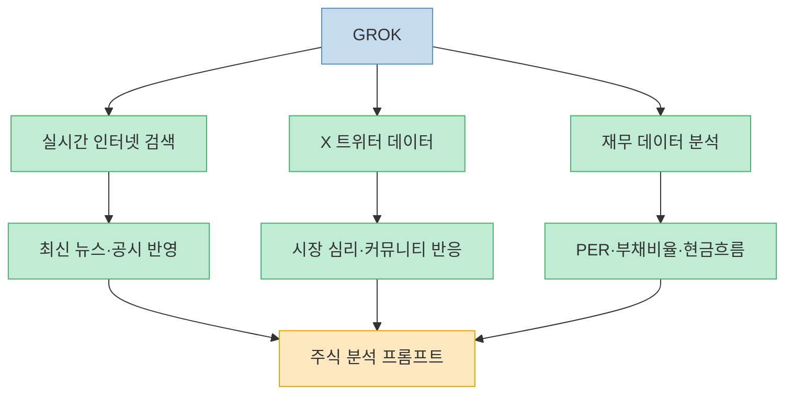
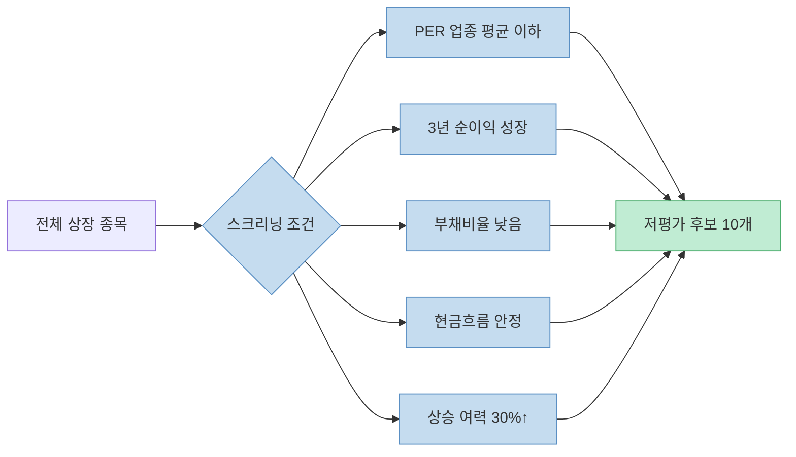
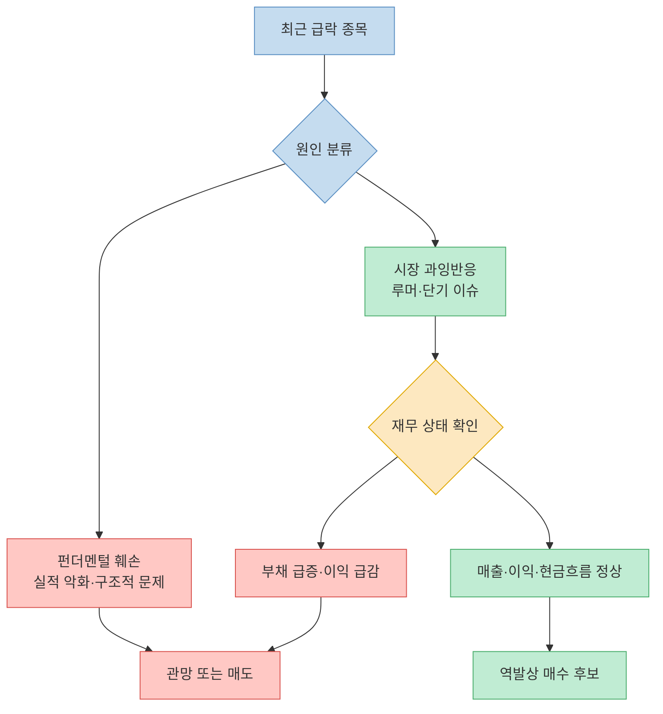
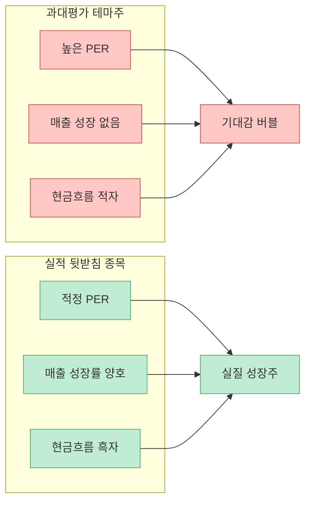
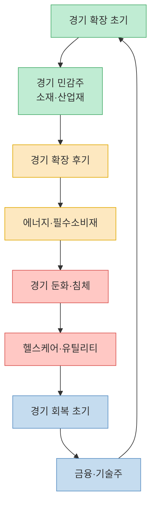
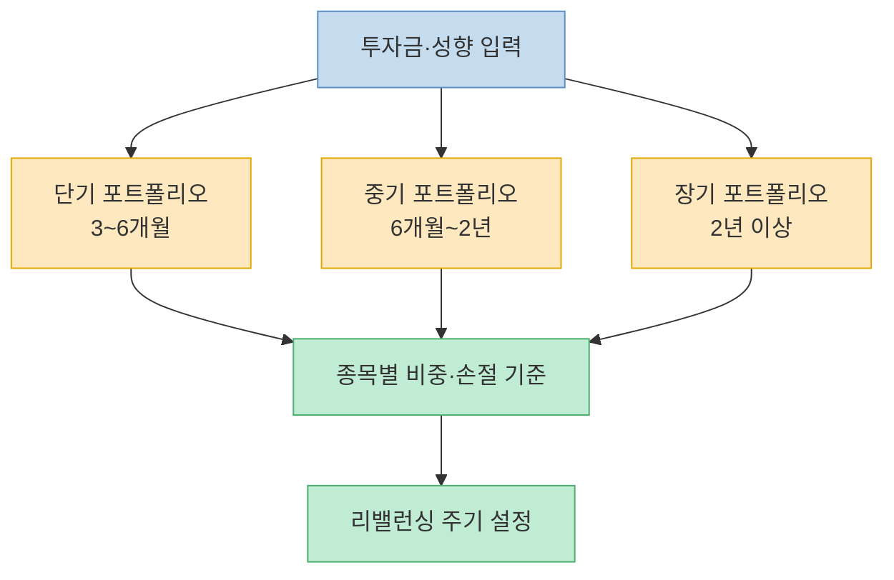

xAI의 GROK은 실시간 데이터 접근과 강력한 분석 능력을 바탕으로 주식 트레이딩에서 눈에 띄는 활용 사례가 늘고 있다. SNS 계정 @human__bro가 공유한 "주식 트레이딩 자동화를 여는 8가지 프롬프트"가 화제가 됐다. 공개된 6가지 프롬프트를 분석하고, 각각의 활용 맥락과 주의점을 정리했다.

<!--more-->

## Sources

- [Threads @human__bro — GROK 주식 트레이딩 자동화 8가지 프롬프트](https://www.threads.com/@human__bro/post/DWXRtYqEngO) (2026-03-26)

---

## GROK을 주식에 활용하는 구조

GROK은 인터넷 실시간 검색과 X(트위터) 데이터 접근이 가능하다는 점에서 다른 LLM과 차별화된다. 주식 분석에서 이 차이는 의미 있다. 최신 공시, 뉴스, 시장 심리를 실시간으로 반영한 분석이 가능하기 때문이다.

---

## 프롬프트 1 — 저평가 종목 자동 스크리너

재무적으로 탄탄하면서 시장에서 제값을 받지 못하고 있는 종목을 자동으로 걸러낸다.

**프롬프트:**

> 현재 한국 주식 시장(또는 미국 주식 시장)을 분석해서, 재무적으로 탄탄한 저평가 종목 10개를 찾아줘. 
> 조건: 동종 업종 평균 대비 낮은 PER / 최근 3년간 순이익 성장 / 부채비율 낮음 / 현금흐름 안정적 / 증권사 리포트 기준 상승 여력 30% 이상 
> 각 종목별로 왜 저평가인지 한글로 쉽게 설명해줘.

**활용 포인트:**

이 프롬프트의 핵심은 **다중 조건 교집합**이다. 단순히 PER이 낮은 종목이 아니라, 수익성·안정성·성장성을 동시에 만족하는 종목만 걸러낸다. 개인이 수동으로 하면 수십 시간이 걸리는 스크리닝을 자동화한다.

---

## 프롬프트 2 — 내부자 매수 패턴 분석

임원·대주주가 자사 주식을 반복적으로 매수하는 패턴은 강력한 선행 신호다. 그들은 누구보다 회사 내부 사정을 잘 안다.

**프롬프트:**

> [섹터/산업]에서 최근 6개월간 임원, 대주주, 내부자가 자사 주식을 지속적으로 매수한 기업을 찾아줘. 
> 단기성 이벤트성 매수는 제외하고, 반복적 매수 / 큰 금액의 자발적 매수 / 장기 보유 목적인 종목 위주로 TOP 5를 정리해줘. 
> 이 패턴이 투자자에게 어떤 의미인지도 쉽게 설명해줘.

**주의:** 이벤트성(스톡옵션 행사 등) 매수와 자발적 매수를 구분하도록 프롬프트에 명시한 점이 영리하다. GROK이 공시 데이터를 실시간으로 참조해 필터링할 수 있다.

---

## 프롬프트 3 — 공포에 팔린 우량주 찾기

시장의 과잉 반응을 역이용하는 역발상 투자 전략이다. 악재·루머로 과도하게 빠졌지만 실제 펀더멘털은 훼손되지 않은 종목을 찾는다.

**프롬프트:**

> 악재, 루머, 단기 이슈로 인해 과도하게 하락했지만, 실제 실적과 재무 상태는 탄탄한 종목을 찾아줘. 
> 최근 주가 급락 이유 / 실제 재무 상태 (매출, 이익, 현금흐름, 부채 상황)을 비교해서 
> '사람들이 오해해서 던지고 있는 종목'을 5개 선정해줘.

**활용 구조:**

---

## 프롬프트 5 — 테마주 vs 진짜 실적주 구분기

AI·2차전지·반도체·로봇 등 인기 테마에서 기대감만으로 오른 종목과 실제 실적이 뒷받침되는 종목을 구분한다. 테마 버블을 피하는 데 핵심적이다.

**프롬프트:**

> 현재 인기 있는 테마주·AI·2차전지·반도체·로봇 관련 종목 중, 
> 기대감만 높은 종목 / 실제 실적으로 뒷받침되는 종목을 구분해줘. 
> PER, 매출 성장률, 순이익, 현금흐름 기준으로 '과대평가 3개'와 '저평가 3개'를 선정하고, 이유를 쉽게 설명해줘.

---

## 프롬프트 6 — 금리·물가·경기 기준 섹터 로테이션

거시 경제 흐름에 따라 강세·약세 섹터가 순환한다. 이 흐름을 미리 포착해 자금을 이동시키는 전략이다.

**프롬프트:**

> 현재 금리, 물가, 경기 흐름을 분석해서 향후 6~12개월 동안 유리한 섹터를 예측해줘. 
> 예: 반도체, 헬스케어, 금융, 필수소비재, 에너지 등 
> 각 섹터별로 왜 유리한지 / 어떤 종목이 유망한지 / 단기/중기/장기 전략을 정리해줘.

**섹터 로테이션 기본 패턴:**

GROK에게 현재 거시 지표(금리 방향, CPI, PMI 등)를 입력하면 현재 사이클 위치를 판단하고 그에 맞는 섹터를 추천받을 수 있다.

---

## 프롬프트 8 — 한국 개인투자자 맞춤 포트폴리오 설계

투자금과 성향을 변수로 넣어 단기·중기·장기 포트폴리오를 구성한다. 리밸런싱 주기와 손절 기준까지 포함해 실전 운용에 바로 적용 가능한 구조다.

**프롬프트:**

> 내 투자금은 [금액]원이고, 투자 성향은 [보수적/중립/공격적]이야. 
> 단기·중기·장기 포트폴리오를 나눠서 구성해줘. 
> 종목별 비중 / 예상 변동성 / 기대 수익률 / 손절 기준 / 리밸런싱 주기를 포함한 현실적인 포트폴리오를 만들어줘.

**포트폴리오 구성 변수:**

---

## 미공개 프롬프트 (4번, 7번)

원문 포스트에서 4번과 7번은 Threads 로그인 없이는 볼 수 없는 상태다. 공개된 6개만으로도 핵심 전략을 충분히 커버하지만, 전체 내용이 궁금하다면 원본 링크에서 확인할 수 있다.

---

## 핵심 요약

| 프롬프트 | 전략 | 핵심 조건 |
|---|---|---|
| 1. 저평가 스크리너 | 가치투자 | PER·부채·현금흐름·상승여력 다중 필터 |
| 2. 내부자 매수 분석 | 선행 신호 포착 | 반복·자발적 매수, 이벤트성 제외 |
| 3. 공포 매도 역발상 | 역발상 투자 | 주가 급락 vs 재무 상태 비교 |
| 5. 테마주 vs 실적주 | 버블 회피 | PER·매출성장률·현금흐름 기준 분류 |
| 6. 섹터 로테이션 | 거시 연동 | 금리·물가·경기 사이클 기반 이동 |
| 8. 맞춤 포트폴리오 | 개인화 운용 | 투자금·성향·손절·리밸런싱 통합 설계 |

---

## 결론

이 프롬프트들의 공통점은 **개인이 수동으로 하기 어려운 다중 조건 분석을 자동화**한다는 것이다. GROK의 실시간 데이터 접근 능력과 결합하면 분석 시간을 크게 단축할 수 있다.

단, AI의 주식 분석 결과는 참고 자료일 뿐이다. 최종 투자 판단은 반드시 본인이 해야 하며, 특히 실시간 데이터가 오래됐거나 부정확할 수 있다는 점을 감안해야 한다. 프롬프트를 그대로 복사하기보다 자신의 투자 성향과 관심 섹터에 맞게 조건을 조정해서 사용하는 것이 효과적이다.
