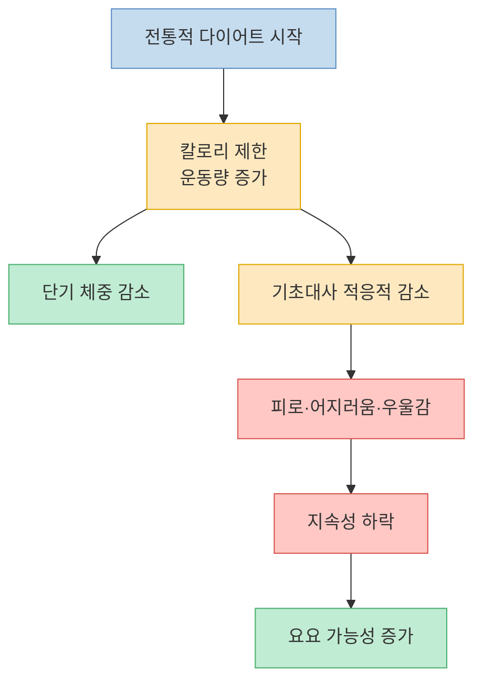
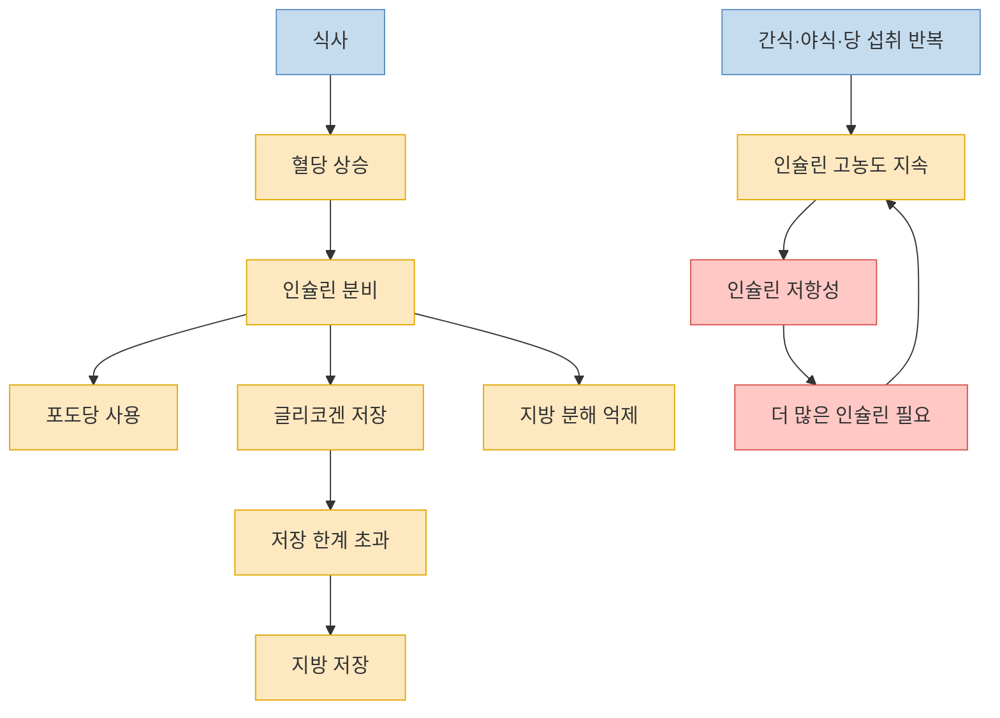
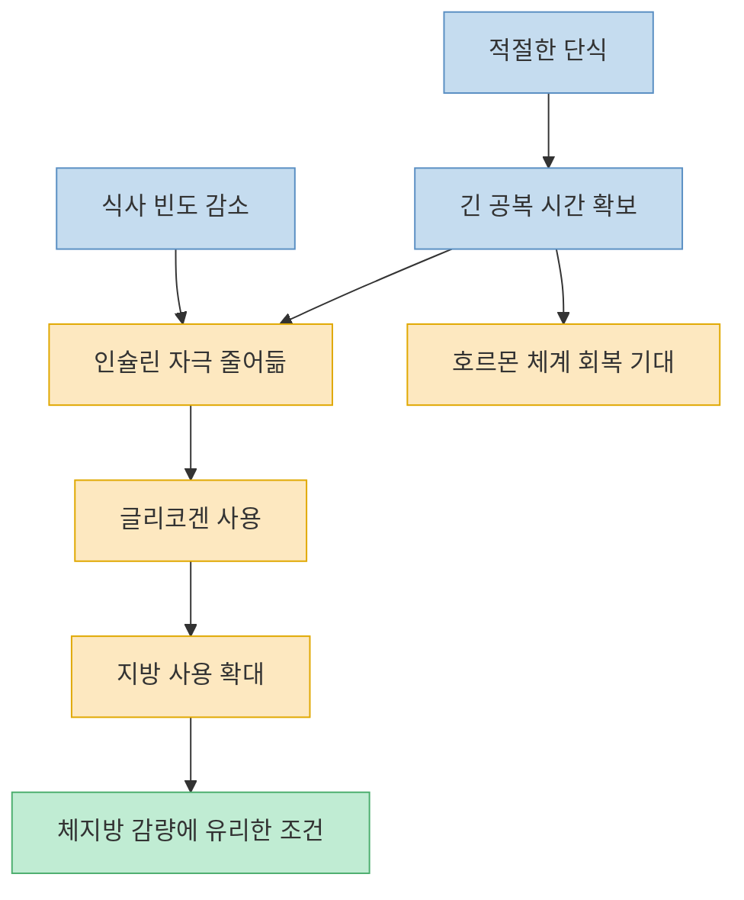
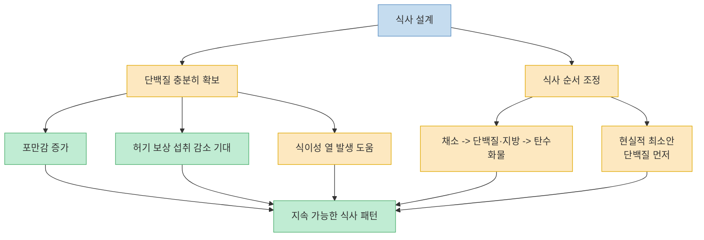

이 영상의 메시지는 분명하다. 살을 빼는 문제를 `칼로리 계산` 중심으로만 보면 반복적인 요요에 갇히기 쉽고, 실제로 더 중요한 축은 `호르몬`, 그중에서도 **인슐린** 이라는 주장이다. 영상은 미국 리얼리티 쇼 `The Biggest Loser` 사례를 출발점으로, 왜 극단적인 저칼로리 + 고운동량 방식이 오래 유지되지 못하는지 설명하고, 그 대안으로 `식사 간격`, `인슐린 자극 줄이기`, `단식`, `단백질 확보`를 제시한다. 다만 이 글은 영상을 그대로 받아적기보다, 영상이 실제로 무엇을 연결하고 있는지를 흐름 중심으로 다시 정리한다. [(0:25)](https://youtu.be/uFCepBVn9eA?t=25), [(1:39)](https://youtu.be/uFCepBVn9eA?t=99), [(5:01)](https://youtu.be/uFCepBVn9eA?t=301), [(13:35)](https://youtu.be/uFCepBVn9eA?t=815)

<!--more-->

## Sources

- [똑똑할수록 다이어트는 쉬워집니다. 요요 없이 평생 써먹는 체지방 삭제 방법.](https://www.youtube.com/watch?v=uFCepBVn9eA) — 롱민

---

## 왜 영상은 칼로리 중심 다이어트를 먼저 비판하나

영상의 출발점은 "덜 먹고 더 움직이면 된다"는 상식에 대한 반론이다. 진행자는 `The Biggest Loser` 참가자들이 30주 동안 매우 낮은 열량 섭취와 장시간 운동을 수행했지만, 6년 뒤 추적에서는 대부분 체중이 원상복귀됐다고 말한다. 여기서 영상이 강조하는 핵심은 의지 부족이 아니라, **극단적 감량 방식 자체가 오래 버티기 어려운 구조** 라는 점이다. [(0:25)](https://youtu.be/uFCepBVn9eA?t=25), [(1:05)](https://youtu.be/uFCepBVn9eA?t=65), [(1:09)](https://youtu.be/uFCepBVn9eA?t=69)

이어 영상은 기초대사를 길게 설명한다. 기초대사는 숨 쉬고, 생각하고, 소화하고, 손톱과 머리카락을 자라게 하는 등 하루 에너지 소비의 큰 부분을 차지하는데, 먹는 양이 줄어들면 이 총 소비량도 함께 줄어든다는 것이다. 그래서 저칼로리 식단을 오래 밀어붙일수록 머리가 아프고, 어지럽고, 우울하고, 탈모 같은 부작용이 오기 쉽다고 말한다. 영상이 말하고 싶은 것은 단순히 "조금만 덜 먹어도 몸이 망가진다"가 아니라, **섭취량 감소에 맞춰 몸도 적응하기 때문에 계산대로만 지방이 빠지지 않는다** 는 점이다. [(3:27)](https://youtu.be/uFCepBVn9eA?t=207), [(3:40)](https://youtu.be/uFCepBVn9eA?t=220), [(4:19)](https://youtu.be/uFCepBVn9eA?t=259), [(4:25)](https://youtu.be/uFCepBVn9eA?t=265)

영상 중반의 "이건 의지의 문제가 아니다"라는 문장은 이 맥락에서 나온다. 칼로리만 낮춘 식단이 단기 체중 변화는 만들 수 있어도, 장기적으로는 배고픔과 무기력, 낮아진 소비량을 동반해 지속성을 무너뜨린다는 것이다. 따라서 영상은 다이어트 실패를 개인의 정신력 부족으로 해석하지 말고, 처음부터 **몸이 어떻게 저장하고 적응하는지** 를 다시 보라고 요구한다. [(4:47)](https://youtu.be/uFCepBVn9eA?t=287), [(4:51)](https://youtu.be/uFCepBVn9eA?t=291), [(4:54)](https://youtu.be/uFCepBVn9eA?t=294)

---

## 인슐린은 영상에서 어떤 역할을 맡고 있나

영상은 칼로리 대신 인슐린을 중심축으로 세운다. 식사를 하면 혈당이 올라가고, 이 포도당을 에너지원으로 쓰게 돕는 호르몬이 인슐린이며, 쓰고 남은 당은 글리코겐으로 저장되고 그마저 넘치면 지방으로 전환된다고 설명한다. 여기에 더해 인슐린은 지방 분해를 억제하는 역할도 하므로, 영상은 인슐린을 사실상 **당과 지방을 저장하는 호르몬** 으로 정의한다. [(5:00)](https://youtu.be/uFCepBVn9eA?t=300), [(5:06)](https://youtu.be/uFCepBVn9eA?t=306), [(5:13)](https://youtu.be/uFCepBVn9eA?t=313), [(5:27)](https://youtu.be/uFCepBVn9eA?t=327), [(5:31)](https://youtu.be/uFCepBVn9eA?t=331)

같은 논리로, 공복 상태에서는 새로 들어오는 포도당이 없으니 저장했던 글리코겐을 먼저 쓰고, 그것도 다 쓰면 지방을 에너지원으로 쓴다고 말한다. 문제는 실제 생활에서 지방 사용 단계까지 충분히 못 간다는 데 있다. 배가 고프면 곧바로 다시 먹고, 인슐린이 다시 올라가고, 또 저장 모드가 켜지는 식으로 루프가 반복된다는 것이다. 영상은 이 반복이야말로 현대 식습관이 체지방 축적 쪽으로 기울어지는 이유라고 본다. [(5:33)](https://youtu.be/uFCepBVn9eA?t=333), [(5:41)](https://youtu.be/uFCepBVn9eA?t=341), [(5:47)](https://youtu.be/uFCepBVn9eA?t=347), [(5:51)](https://youtu.be/uFCepBVn9eA?t=351)

후반 설명은 여기서 더 나아가 `인슐린 저항성`까지 연결된다. 영상은 간식, 야식, 잦은 당 섭취 때문에 인슐린이 오랫동안 과다 분비되면 수용체 반응이 둔해지고, 그 결과 포도당 처리 능력이 떨어져 혈당은 올라가고 인슐린은 더 많이 분비되는 악순환이 생긴다고 설명한다. 여기에 설탕의 과당, 지방간, 스트레스 호르몬 코르티솔, 수면 부족까지 연결해 **살찌기 쉬운 환경이 겹겹이 인슐린 문제를 키운다** 는 그림을 만든다. [(6:01)](https://youtu.be/uFCepBVn9eA?t=361), [(6:13)](https://youtu.be/uFCepBVn9eA?t=373), [(6:28)](https://youtu.be/uFCepBVn9eA?t=388), [(6:41)](https://youtu.be/uFCepBVn9eA?t=401), [(7:04)](https://youtu.be/uFCepBVn9eA?t=424), [(7:20)](https://youtu.be/uFCepBVn9eA?t=440), [(7:28)](https://youtu.be/uFCepBVn9eA?t=448)

영상의 이 프레임을 그대로 요약하면, 비만은 열량의 산술보다 저장 호르몬의 문맥에서 이해해야 한다는 말이다. 즉 "얼마나 먹었나"보다 "얼마나 자주 먹었고, 무엇을 먹었으며, 그때 인슐린이 얼마나 자주 올라갔나"가 더 중요하다는 주장이다. 이 지점이 영상 전체의 사고방식을 바꾸는 분기점이다. [(1:39)](https://youtu.be/uFCepBVn9eA?t=99), [(1:43)](https://youtu.be/uFCepBVn9eA?t=103), [(7:55)](https://youtu.be/uFCepBVn9eA?t=475)

---

## 그래서 영상은 왜 단식을 핵심 도구로 내세우나

이 논리 위에서 영상이 내놓는 해법은 의외로 단순하다. **안 먹는 시간을 길게 만들어 인슐린이 조용해지는 구간을 확보하라** 는 것이다. 진행자는 "어떤 음식이든 인슐린을 올리기 때문에" 칼로리에만 집착하면서 하루 세 끼 이상 계속 먹는 방식은 적합하지 않다고 말하고, 그래서 16시간 단식, 8시간 식사 같은 간헐적 단식이 등장했다고 설명한다. [(8:03)](https://youtu.be/uFCepBVn9eA?t=483), [(8:06)](https://youtu.be/uFCepBVn9eA?t=486), [(11:31)](https://youtu.be/uFCepBVn9eA?t=691)

영상 속 단식은 단순히 섭취량을 줄이는 기술이 아니라, 글리코겐과 지방을 사용하는 생리적 조건을 만드는 장치다. 더 나아가 적절한 단식은 자가포식을 유도해 필요 없거나 죽은 세포를 정리하는 데도 도움을 준다고 말한다. 물론 이 부분은 영상의 강한 해석이 실려 있는 대목이지만, 적어도 영상 내부 논리로는 `공복 시간 확보 -> 인슐린 비활성화 -> 지방 사용 증가 -> 호르몬 체계 복구 지원`이라는 일관된 흐름을 갖고 있다. [(11:37)](https://youtu.be/uFCepBVn9eA?t=697), [(13:29)](https://youtu.be/uFCepBVn9eA?t=809), [(13:45)](https://youtu.be/uFCepBVn9eA?t=825)

이 대목에서 중요한 건 영상이 음식을 고르는 문제와 시간을 고르는 문제를 분리하지 않는다는 점이다. 무엇을 먹을지 정하는 것만큼, **언제 먹지 않을지 정하는 것** 도 필수라고 말한다. 즉 식단 조절과 식사 간격 설계를 한 세트로 본다. 비만이나 대사 질환이 이미 있다면 더더욱 고장난 호르몬 체계를 원상복구하는 관점이 필요하다고 정리한다. [(13:35)](https://youtu.be/uFCepBVn9eA?t=815), [(13:39)](https://youtu.be/uFCepBVn9eA?t=819), [(13:43)](https://youtu.be/uFCepBVn9eA?t=823), [(13:49)](https://youtu.be/uFCepBVn9eA?t=829)

---

## 단백질과 식사 순서는 왜 마지막 해법으로 붙나

영상의 마지막 파트는 `무엇을 먹을 것인가`로 돌아온다. 진행자는 세상에 여러 식단 방식이 있지만, 실제로 체감이 컸고 자료를 보며 확인한 지점은 **단백질 섭취량** 이라고 말한다. 제시하는 기준은 체중 1kg당 1g에서 2g 수준이며, 예를 들어 체중 70kg이면 하루 70g에서 140g 정도를 말한다. 많은 사람들이 이 적정량을 채우지 못한다고 보고, 닭가슴살이나 달걀 등을 예로 들어 생각보다 꽤 의식적으로 먹어야 한다고 설명한다. [(13:55)](https://youtu.be/uFCepBVn9eA?t=835), [(14:06)](https://youtu.be/uFCepBVn9eA?t=846), [(14:10)](https://youtu.be/uFCepBVn9eA?t=850), [(14:19)](https://youtu.be/uFCepBVn9eA?t=859)

여기서 끌어오는 개념이 `단백질 지렛대 가설`이다. 영상은 하루 적정 단백질을 채우지 못하면 허기가 계속 남고, 결국 그 허기를 다른 음식으로 자꾸 메우게 된다고 소개한다. 그래서 단백질이라는 작은 조정이 전체 섭취 패턴을 바꾸는 지렛대가 될 수 있다는 것이다. 이 설명은 영상 초반의 "칼로리만 볼 게 아니다"라는 주장과 연결된다. 포만감과 식욕, 다음 식사의 선택까지 단백질이 영향을 준다고 보기 때문이다. [(14:31)](https://youtu.be/uFCepBVn9eA?t=871), [(14:39)](https://youtu.be/uFCepBVn9eA?t=879), [(14:45)](https://youtu.be/uFCepBVn9eA?t=885), [(14:54)](https://youtu.be/uFCepBVn9eA?t=894)

또 하나의 실전 팁은 `탄수화물보다 단백질을 먼저 먹으라`는 것이다. 영상은 이상적으로는 채소를 먼저, 그다음 단백질과 지방, 마지막으로 탄수화물을 먹는 흐름을 제시하지만, 현실적으로는 최소한 탄수화물 전에 단백질을 먼저 먹는 것만으로도 도움이 된다고 말한다. 이유는 단백질이 식욕을 억제하는 호르몬 쪽에는 도움을 주고, 식욕을 촉진하는 호르몬은 줄이는 방향으로 작용한다고 보기 때문이다. 여기에 단백질의 높은 식이성 열 발생도 장점으로 덧붙인다. [(15:16)](https://youtu.be/uFCepBVn9eA?t=916), [(15:21)](https://youtu.be/uFCepBVn9eA?t=921), [(15:28)](https://youtu.be/uFCepBVn9eA?t=928), [(15:30)](https://youtu.be/uFCepBVn9eA?t=930), [(15:42)](https://youtu.be/uFCepBVn9eA?t=942), [(15:56)](https://youtu.be/uFCepBVn9eA?t=956)

결국 영상의 실전 해법은 세 줄로 압축된다. `먹는 횟수를 줄이고`, `인슐린을 쉬게 하고`, `한 번 먹을 때는 단백질을 충분히 확보하라`는 것이다. 이 구조 안에서 칼로리는 완전히 사라지는 개념이 아니라, 더 위에 있는 조절 레버들 뒤로 밀려난다. [(13:49)](https://youtu.be/uFCepBVn9eA?t=829), [(14:06)](https://youtu.be/uFCepBVn9eA?t=846), [(15:56)](https://youtu.be/uFCepBVn9eA?t=956)

---

## 핵심 요약

- 이 영상은 요요의 원인을 `의지 부족`보다 `극단적 저칼로리 다이어트와 그에 따른 대사 적응`에서 찾는다. [(1:05)](https://youtu.be/uFCepBVn9eA?t=65), [(4:19)](https://youtu.be/uFCepBVn9eA?t=259), [(4:47)](https://youtu.be/uFCepBVn9eA?t=287)
- 영상에서 인슐린은 포도당 사용을 돕는 동시에, 남는 에너지를 저장하고 지방 분해를 억제하는 핵심 저장 호르몬으로 설명된다. [(5:13)](https://youtu.be/uFCepBVn9eA?t=313), [(5:21)](https://youtu.be/uFCepBVn9eA?t=321), [(5:27)](https://youtu.be/uFCepBVn9eA?t=327)
- 간식, 야식, 설탕, 스트레스, 수면 부족은 인슐린 저항성과 고인슐린 상태를 심화시키는 요소로 묶여 제시된다. [(6:01)](https://youtu.be/uFCepBVn9eA?t=361), [(7:04)](https://youtu.be/uFCepBVn9eA?t=424), [(7:20)](https://youtu.be/uFCepBVn9eA?t=440), [(7:28)](https://youtu.be/uFCepBVn9eA?t=448)
- 그래서 영상은 칼로리 계산보다 `안 먹는 시간 확보`, 즉 간헐적 단식을 중요한 도구로 본다. [(11:31)](https://youtu.be/uFCepBVn9eA?t=691), [(11:37)](https://youtu.be/uFCepBVn9eA?t=697), [(13:45)](https://youtu.be/uFCepBVn9eA?t=825)
- 식사 내용 측면에서는 적정 단백질 섭취와 `단백질 먼저 먹기`를 실전 전략으로 제안한다. [(14:06)](https://youtu.be/uFCepBVn9eA?t=846), [(14:45)](https://youtu.be/uFCepBVn9eA?t=885), [(15:28)](https://youtu.be/uFCepBVn9eA?t=928), [(15:56)](https://youtu.be/uFCepBVn9eA?t=956)

---

## 결론

이 영상은 다이어트를 `칼로리의 산수`에서 `호르몬의 흐름`으로 옮겨 읽으라고 요구한다. 그 관점에서 보면 핵심 질문도 달라진다. 얼마나 적게 먹었느냐보다, 얼마나 자주 먹었는지, 인슐린이 얼마나 자주 올라갔는지, 공복 시간을 확보했는지, 단백질이 충분했는지가 더 앞에 온다. [(1:39)](https://youtu.be/uFCepBVn9eA?t=99), [(7:55)](https://youtu.be/uFCepBVn9eA?t=475), [(13:35)](https://youtu.be/uFCepBVn9eA?t=815)

실전적으로 옮기면 영상의 메시지는 꽤 단순하다. `계속 먹는 패턴을 끊고`, `간식과 야식을 줄이고`, `식사 간격을 설계하고`, `한 끼에서는 단백질을 먼저 확보하라`는 것이다. 영상이 모든 생리학적 논쟁을 완전히 끝내는 것은 아니지만, 적어도 왜 많은 사람이 칼로리 계산만으로는 오래 못 버티는지 설명하려는 프레임은 분명하게 제시한다. [(6:56)](https://youtu.be/uFCepBVn9eA?t=416), [(11:31)](https://youtu.be/uFCepBVn9eA?t=691), [(15:50)](https://youtu.be/uFCepBVn9eA?t=950)
