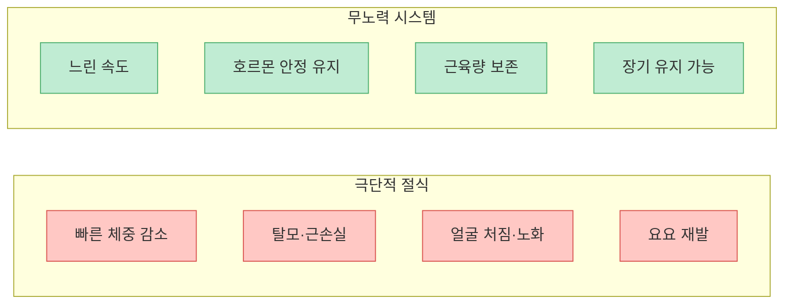
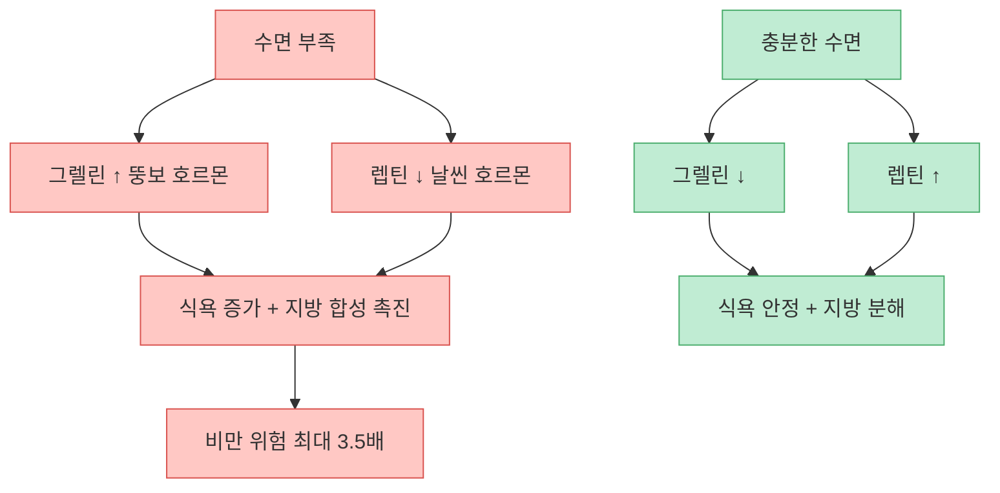
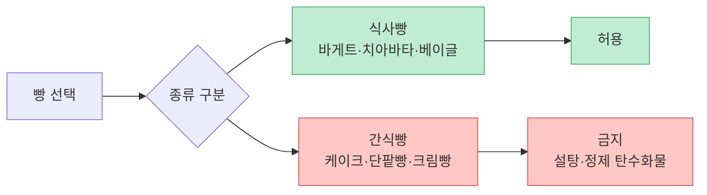
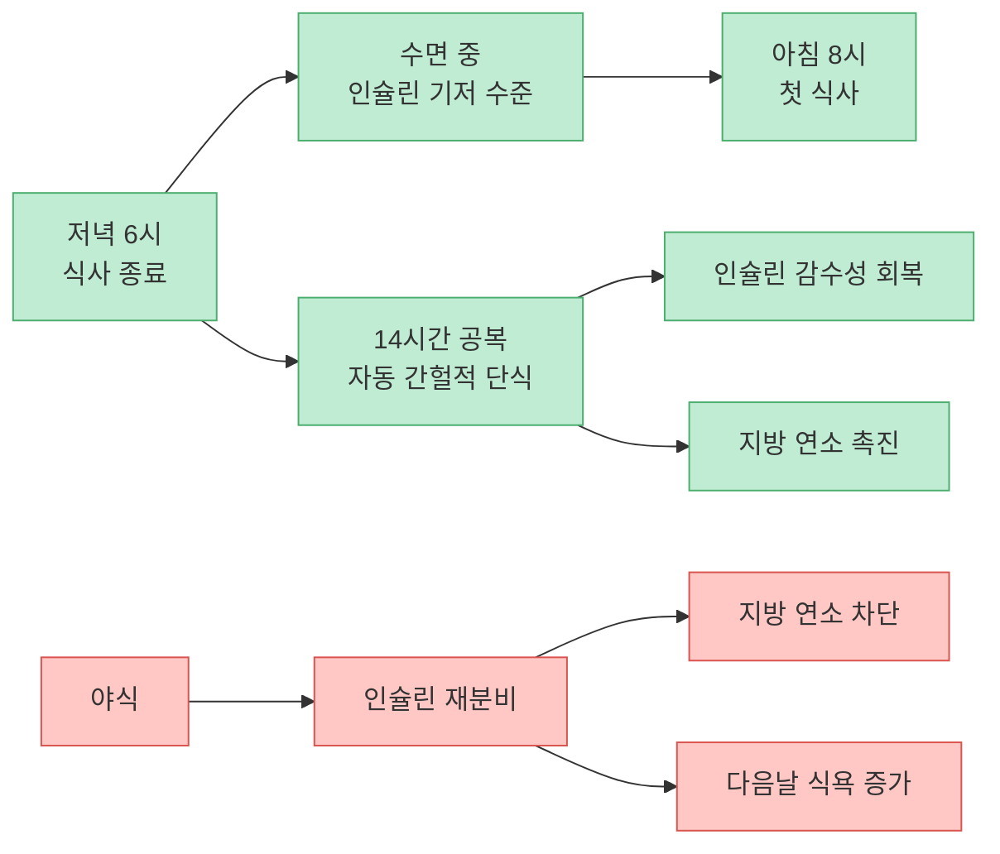
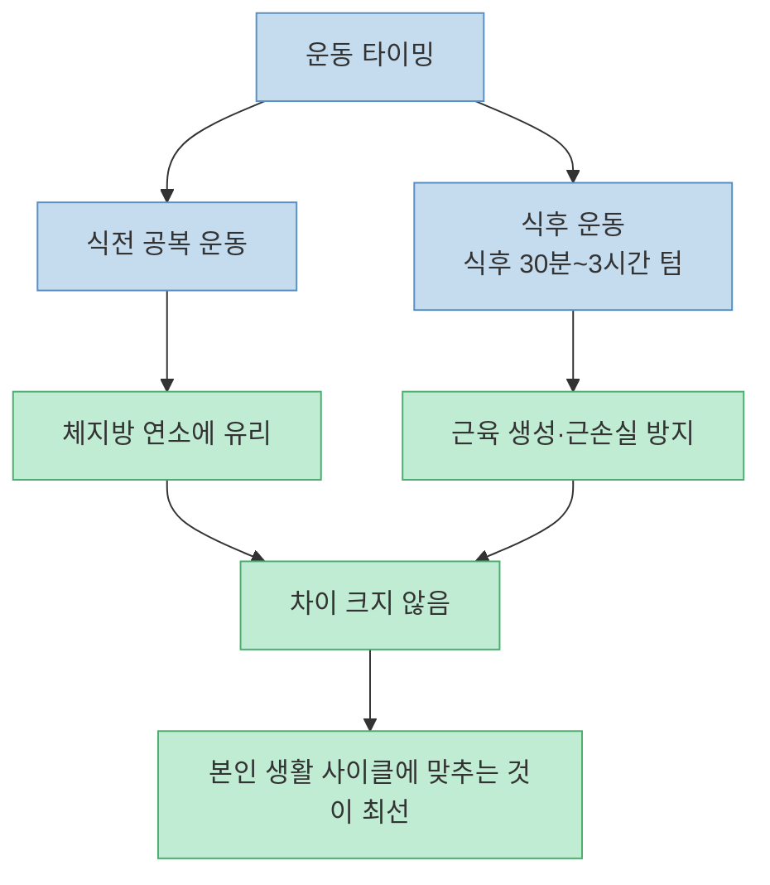
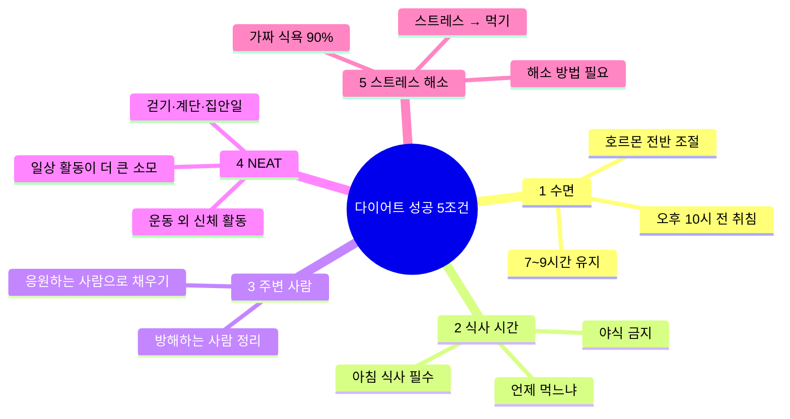
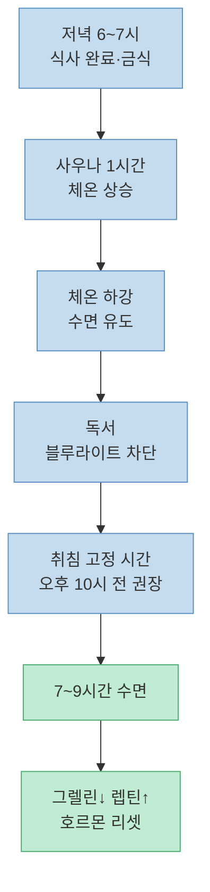
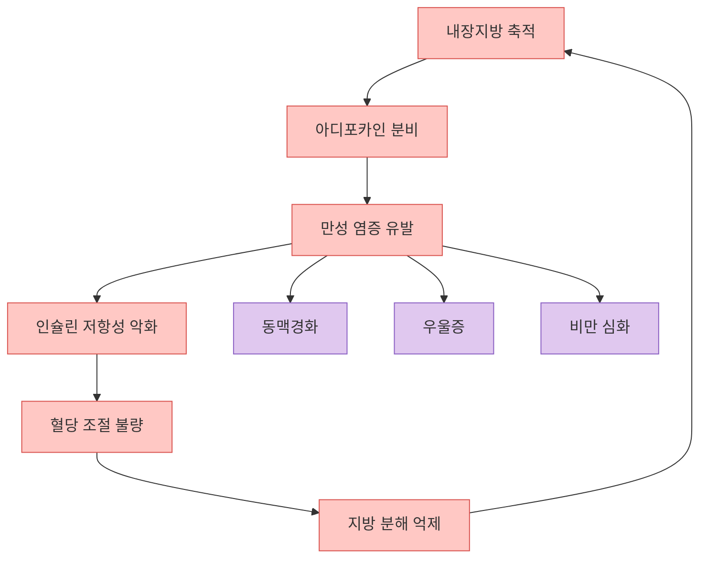
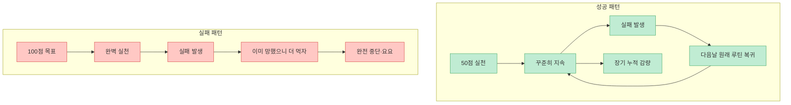

"노력해서 하는 다이어트는 결국 유지가 안 됩니다." 봄온담한의원 대표원장이자 유튜브 채널 '살빼남'을 운영하는 김희준 한의사가 신사임당 채널에 출연해 57분에 걸쳐 다이어트의 모든 것을 풀었다. 의지력에 기대는 다이어트 대신 호르몬과 생활 시스템을 정비해 자동으로 살이 빠지는 구조를 만드는 것이 핵심이다. 저서 『감량혁명』의 내용이기도 하다.

<!--more-->

## Sources

- [1도 애쓰지 않고 10kg 빠진다는 국내 최초 '무노력 다이어트' (김희준 원장)](https://youtu.be/IUCyjs-bhIU) — 신사임당, 2025-10-29

> **타임스탬프 안내**: 이 영상은 설명란에 챕터 마커가 없습니다. 아래 타임스탬프 링크는 내용 순서 기반 추정치입니다.

---

## 무노력 다이어트 철학 — 시스템이 의지력을 대체한다

[(영상 약 03:00)](https://youtu.be/IUCyjs-bhIU?t=180)

무노력 다이어트의 핵심 전제는 이것이다. **억지로 하는 다이어트는 지속할 수 없다.** 단기간에 극단적으로 식이를 제한하면 체중이 빠지더라도 탈모, 근육 손실, 얼굴 처짐, 노화 가속, 요요가 따라온다.

대안은 운전처럼 자동화된 '시스템'이다. 처음에는 의식적으로 배우지만, 일정 시간이 지나면 자동으로 작동하는 습관 체계를 만들어야 한다.

> "무노력 다이어트의 단점은 하나입니다. 속도가 느린 것."

극단적 절식의 부작용 목록 vs 무노력 방식의 유일한 단점을 비교하면 선택은 명확하다.

---

## 핵심 호르몬 3종 — 그렐린·렙틴·인슐린

[(영상 약 00:00)](https://youtu.be/IUCyjs-bhIU?t=0)

다이어트를 이해하려면 세 가지 호르몬을 알아야 한다.

| 호르몬 | 별명 | 역할 | 증가 시 |
|---|---|---|---|
| **그렐린** | 뚱보 호르몬 | 식욕 증가, 지방 합성 활성화 | 수면 부족, 스트레스, 굶기 |
| **렙틴** | 날씬 호르몬 | 식욕 억제, 지방 분해 촉진 | 충분한 수면, 규칙적 식사 |
| **인슐린** | 혈당 조절 호르몬 | 혈당 ↓, 지방 합성 ↑ | 고당류·정제 탄수화물 섭취 |

수면이 부족하면 그렐린이 증가하고 렙틴이 감소한다. 낮밤이 뒤바뀐 생활을 하는 사람의 비만 확률은 최대 **3.5배**까지 높아진다.

인슐린 저항성도 핵심이다. 시도 때도 없이 먹으면 인슐린이 지속적으로 분비되고, 세포가 인슐린에 반응하지 않게 된다. 결과적으로 혈당이 잘 내려가지 않고 지방 분해가 억제된다. 간헐적 단식의 효과는 바로 **인슐린 감수성 회복**에 있다.

---

## 식사 전략 — 언제, 무엇을 먹느냐

### 아침 공복에 가장 중요한 선택

[(영상 약 26:00)](https://youtu.be/IUCyjs-bhIU?t=1560)

아침을 어떻게 시작하느냐가 하루 전체의 혈당 패턴을 결정한다.

- **최악**: 설탕이 들어간 시리얼, 달달한 음료. 아침 혈당이 급등락하면서 하루 종일 혈당 롤러코스터가 반복된다. 이 과정에서 인슐린이 지속 분비되어 지방 분해가 차단된다.
- **최선**: 섬유질(채소 나물) + 탄수화물(밥) + 단백질(계란 프라이) 조합

아침을 든든하게 먹으면 야식 욕구가 자연스럽게 감소한다.

### 탄수화물 — 쌀밥은 먹어도 된다

[(영상 약 23:00)](https://youtu.be/IUCyjs-bhIU?t=1380)

쌀밥에는 미네랄, 비타민, 섬유질, 단백질이 포함되어 있어 다이어트 중에도 먹어도 된다. 현미·발아현미는 비타민B가 풍부해 피로 회복에 유리하다.

빵은 종류를 구분해야 한다.

핵심은 설탕과 정제 탄수화물만 피하는 것이다.

### 고기 선택 — 안심이 정답

[(영상 약 37:00)](https://youtu.be/IUCyjs-bhIU?t=2220)

소고기는 일반적으로 지방 함량이 높지만 부위별 차이가 크다. "**안심하고 먹을 수 있는 안심**" — 소·돼지 모두 안심 부위가 지방 함량이 가장 낮은 린 미트(Lean Meat)에 해당한다.

### 술과 다이어트

[(영상 약 35:00)](https://youtu.be/IUCyjs-bhIU?t=2100)

알코올 자체의 지방 전환율은 5% 이하다. 그러나 간이 알코올을 우선 분해하는 동안 **지방 분해가 완전히 차단**된다. 식사와 함께 음주하면 그 식사의 열량이 거의 그대로 지방으로 전환된다.

---

## 자동 간헐적 단식 — 야식만 끊으면 된다

[(영상 약 29:00)](https://youtu.be/IUCyjs-bhIU?t=1740)

별도로 간헐적 단식을 '실천'할 필요가 없다. 저녁을 제때 먹고 야식을 끊으면 자동으로 달성된다.

> 저녁 6시 식사 종료 → 다음날 아침 8시 첫 식사 = **14시간 자연 공복**

이것이 간헐적 단식이다. 야식 한 번이면 이 사이클 전체가 무너진다.

간헐적 단식의 효과는 하버드, 케임브리지 등 다수 논문에서 검증됐다. 핵심 기전은 공복 시간 동안 인슐린 분비가 없어 **인슐린 감수성이 회복**되고, 지방 연소 모드로 전환된다는 것이다.

---

## 운동의 역할 — 칼로리 소모 수단이 아니다

[(영상 약 41:00)](https://youtu.be/IUCyjs-bhIU?t=2460)

운동을 칼로리 소모 수단으로만 접근하면 실망하게 된다. 밥 한 공기(300kcal)를 소모하려면 조깅 약 1시간이 필요하다. 그리고 인체는 같은 운동을 반복하면 칼로리 소모량을 점점 줄이며 적응한다.

운동의 진짜 역할은 **다이어트 전반의 조력자**다. 근육량 유지, 인슐린 감수성 개선, 수면 질 향상, 스트레스 해소 등 다이어트를 지속 가능하게 만드는 조건들을 개선한다.

**권장 운동량:**
- 유산소: 주 150분 이상 (WHO 기준)
- 무산소(근력): 주 75분 이상
- 최소 단위: 식후 산책 30분

**식전 vs 식후 운동:**

---

## 다이어트 성공의 5가지 체크리스트

[(영상 약 12:00)](https://youtu.be/IUCyjs-bhIU?t=720)

김희준 원장이 임상에서 검증한 다이어트 성공 조건 5가지다.

**NEAT (Non-Exercise Activity Thermogenesis)** 가 특히 중요하다. 일반인은 헬스장 운동보다 하루 중 걷기·계단 이용·집안일 같은 비운동성 신체 활동에서 2~3배 더 많은 칼로리를 소모할 수 있다. 앉아서 일하는 직장인이라면 NEAT를 늘리는 것이 헬스장 등록보다 효과적일 수 있다.

임상에서 90% 이상의 환자는 배가 고파서가 아니라 스트레스 때문에 음식을 찾는다. 이를 **가짜 식욕**이라고 한다. 스트레스 해소 방법을 음식 외의 것으로 바꾸는 것이 필수다.

---

## 아침 루틴 / 나이트 루틴

### 김희준 원장의 아침 루틴

[(영상 약 07:00)](https://youtu.be/IUCyjs-bhIU?t=420)

1. 기상 후 쓰레기 버리기 (NEAT 활동)
2. 근력 운동 1시간 + 유산소 10분
3. 집안일 (거북이 물 갈기 등)
4. 아침 식사: 냉동밥 + 시금치·무생채 나물 + 소시지 2개
5. 점심 건너뜀 (30분 낮잠 또는 산책)

아침을 든든하게 먹기 때문에 점심 없이도 야식 욕구가 올라오지 않는다.

### 나이트 루틴

[(영상 약 55:00)](https://youtu.be/IUCyjs-bhIU?t=3300)

1. 저녁 6~7시 이전 식사 완료 → 이후 금식
2. 취침 전 핸드폰·블루라이트 차단 → 독서
3. 취침 전 격렬한 운동 금지
4. **사우나 약 1시간** — 숙면에 매우 효과적 (체온 상승 후 하강 → 수면 유도)
5. 취침 시간 고정

---

## 내장지방과 만성 염증의 악순환

[(영상 약 49:00)](https://youtu.be/IUCyjs-bhIU?t=2940)

내장지방이 단순히 미관상 문제가 아닌 이유가 있다. 내장지방 세포는 **아디포카인(Adipokine)** 이라는 염증 물질을 분비한다. 이것이 만성 염증을 유발하고, 만성 염증은 다시 인슐린 저항성을 악화시킨다.

이 악순환을 끊는 가장 직접적인 방법이 내장지방 감소다. 내장지방은 피하지방보다 먼저 빠지는 특성이 있어, 식단과 운동을 병행하면 혈액 지표가 비교적 빠르게 개선된다.

기침과 가래는 병이 아니라 **몸의 정화 반응**이다. 급성 염증 역시 면역 반응의 정상적인 일부다. 문제는 원인이 해결되지 않아 지속되는 **만성 염증**이다.

---

## 폐 건강과 한의학 처방

### 도라지(길경) — 가장 쉬운 폐 케어

[(영상 약 50:30)](https://youtu.be/IUCyjs-bhIU?t=3030)

도라지(한약명: 길경)는 한의학 처방 **감길탕**의 핵심 약재다. 기침·가래 완화, 면역 기능 지원에 효과가 있으며 현대 논문으로도 효능이 확인된다.

- 백도라지 나물 무침, 적도라지 양념 무침 모두 효과 동일
- 반찬가게에서 쉽게 구입 가능
- 도라지 차로도 복용 가능

**비염·기침에 좋은 음식/차 목록:**
- 도라지 차
- 생강 + 대추 차
- 모과 차
- 배 + 꿀 재움

### 한국인 천식 증가 원인

[(영상 약 54:00)](https://youtu.be/IUCyjs-bhIU?t=3240)

- 도시화 → 실내 미세먼지, 방향제, 곰팡이 증가
- 중국발 황사·미세먼지, 꽃가루 증가
- 일본산 꽃가루가 많은 수종이 과거 조림 정책으로 식재된 영향

### 공진단·경옥고

[(영상 약 20:00)](https://youtu.be/IUCyjs-bhIU?t=1200)

| 처방 | 주요 효능 | 비고 |
|---|---|---|
| **공진단** | 간·뇌 건강, 뇌세포 활성화, 기허증 치료 | 조선 영조 250회 이상 복용 기록 (승정원일기) |
| **경옥고** | 폐·면역력, 폐세포 손상 회복 | 같은 역사 기록에서 영조가 함께 복용 |

두 처방 모두 현대 논문에서 효능이 확인됐으며, 조선 시대 왕들이 **기허증(氣虛症)** — 현대의 만성 피로 증후군에 해당하는 상태 — 를 치료하기 위해 사용한 기록이 승정원일기에 남아 있다.

---

## 간식 처방 — 먹어야 할 때와 먹지 말아야 할 때

[(영상 약 32:00)](https://youtu.be/IUCyjs-bhIU?t=1920)

원칙적으로 인류는 3끼 구조에 최적화되어 있어 간식이 불필요하다. 단, 예외가 있다.

**간식 허용 대상**: 50대 이상, 폐경 후 여성 (발터 롱고 박사 FMD 연구 기반)
- 허용 시간: 오후 3~5시
- 허용 품목: 견과류, 그릭 요거트, 방울토마토
- 원칙: 단백질·섬유질 위주, 설탕 금지

---

## 다이어트 성공의 진짜 비결

[(영상 약 44:30)](https://youtu.be/IUCyjs-bhIU?t=2670)

임상에서 다이어트에 성공한 사람들의 공통점은 의지력이 강한 것이 아니었다.

> "완벽하게 하기보다 오랫동안 꾸준히. 50점으로 오래 vs 100점으로 짧게."

실패해도 신경 쓰지 않고 바로 원래 루틴으로 돌아오는 **복원력**이 핵심이다. 오늘 야식을 먹었다면 내일 다시 루틴으로 돌아오면 된다. 그것을 계기로 "이미 망했으니까 더 먹자"는 심리가 다이어트를 완전히 무너뜨린다.

---

## 핵심 요약

| 주제 | 핵심 내용 |
|---|---|
| 무노력 철학 | 의지력 → 습관 시스템으로 대체, 단점은 속도 하나 |
| 수면 | 오후 10시 전 취침, 7~9시간 / 부족 시 비만 위험 3.5배 |
| 그렐린·렙틴 | 수면이 두 호르몬 모두 조절 |
| 인슐린 | 정제탄수화물·야식이 저항성 유발 |
| 자동 간헐적 단식 | 저녁 6시 → 아침 8시 = 14시간 공복 |
| 아침 식사 | 섬유질+탄수화물+단백질 조합, 설탕 시리얼 최악 |
| 탄수화물 | 쌀밥·현미 OK, 식사빵 OK, 간식빵·설탕 금지 |
| 운동 역할 | 칼로리 소모 수단 아님, 다이어트 조력자 |
| NEAT | 일상 활동이 운동보다 2~3배 더 큰 소모 가능 |
| 내장지방 | 아디포카인 → 만성 염증 → 인슐린 저항성 악순환 |
| 도라지(길경) | 기침·가래·폐 건강 / 반찬으로 쉽게 섭취 가능 |
| 공진단·경옥고 | 간·뇌(공진단), 폐·면역(경옥고) |
| 성공 비결 | 끈질김, 50점으로 오래, 실패 후 즉시 복귀 |

---

## 결론

김희준 원장의 핵심 메시지는 일관된다. **다이어트는 노력의 문제가 아니라 시스템 설계의 문제다.** 수면 시간을 고정하고, 아침을 제대로 먹고, 야식을 끊으면 별도의 간헐적 단식 없이도 매일 14시간 공복이 달성된다. 여기에 NEAT를 늘리는 생활 구조가 더해지면 '1도 애쓰지 않는' 상태가 서서히 만들어진다.

의지력에 기대는 다이어트를 여러 번 시도했다가 요요를 반복한 사람이라면, 이 접근이 역설적으로 더 확실한 해답일 수 있다.
