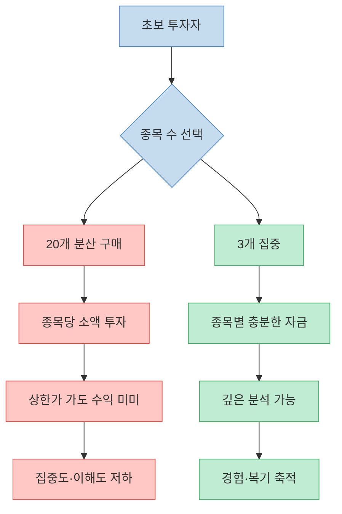
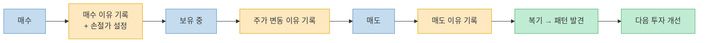
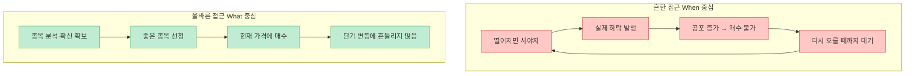
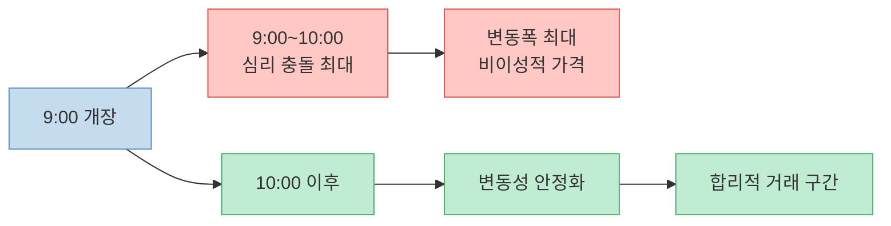
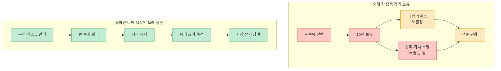
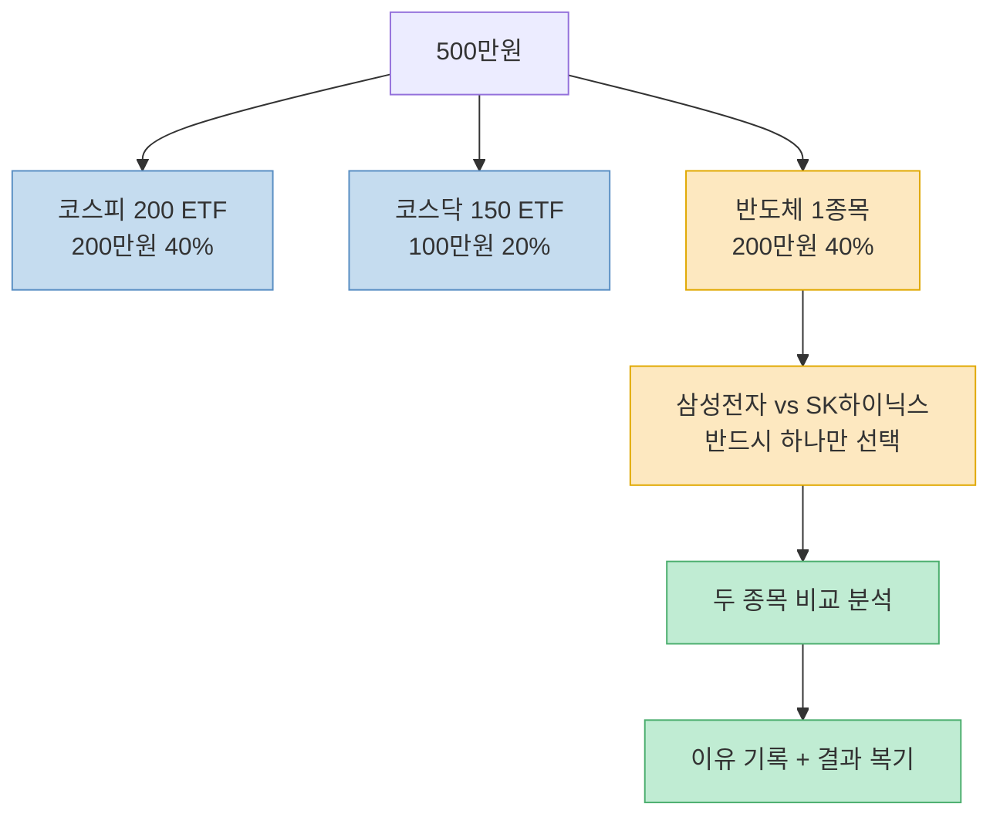
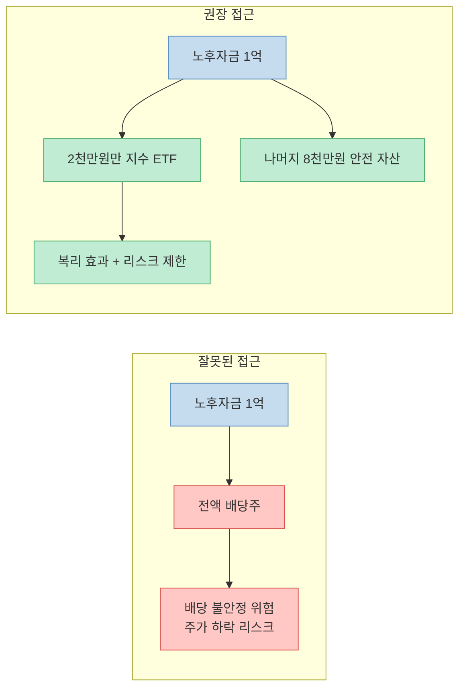
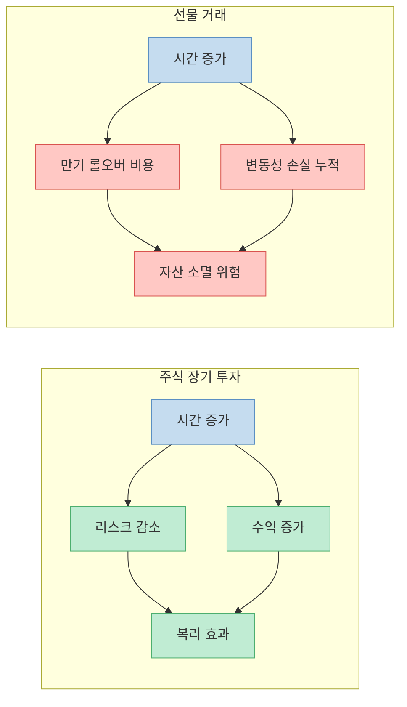

"언제 살지보다 무엇을 살지를 고민하라." 광순혜복덕방 대표이자 20년차 애널리스트 이광수가 지식인사이드 채널에 출연해 주식 초보자에게 전하는 투자 원칙을 솔직하게 풀어놨다. 화려한 수익 공식이 아니라 손실을 줄이고 시장에 오래 살아남는 방법에 집중한 내용이다. 저서 『진보를 위한 주식투자』의 핵심이기도 하다.

<!--more-->

## Sources

- ["이 시간에 사지 마세요." 주식 고수들의 투자 철칙 | 지식인초대석 EP.114 (이광수 대표 2부)](https://youtu.be/FRT5DqFpy1U) — 지식인사이드, 2026-03-26

---

## 원칙 1 — 초보자는 종목을 3개로 시작하라

[(영상 00:48)](https://youtu.be/FRT5DqFpy1U?t=48)

이광수 대표가 가장 먼저 강조하는 원칙은 **종목 수 제한**이다. 초보자는 3종목으로 시작하고, 경험이 쌓여도 5종목을 넘지 않는 것이 원칙이다.

흔히 "분산투자가 좋다"는 말에 100만 원으로 20개 종목을 사는 경우가 있다. 한 종목에 5만 원이 들어간 상황에서 그 종목이 상한가를 쳐도 2,500원의 수익에 불과하다. 종목 수를 늘린다고 수익률이 높아지는 것이 아니다. 오히려 집중도가 떨어져 각 종목에 대한 이해와 판단력이 흐려진다.

---

## 원칙 2 — 주식 노트를 짧게 기록하라

[(영상 02:40)](https://youtu.be/FRT5DqFpy1U?t=160)

이광수 대표가 직접 실천하는 **주식 노트 4가지 기록 원칙**이다.

1. **매수 이유** — 왜 이 종목을 샀는지 한 줄로 적는다.
2. **손절 가격** — 매수 시점에 미리 설정한다. 예: "삼성전자 20만 원에 샀는데 16만 원까지 빠지면 판다."
3. **주가 변동 이유** — 오른 이유, 떨어진 이유를 기록한다. 예: "트럼프 정책 우려로 주가 하락."
4. **매도 이유** — 왜 팔았는지 기록한다.

핵심은 **"최대한 짧게"** 다. 노트가 일이 되면 지속하기 어렵다. 이 기록이 쌓이면 자신만의 투자 패턴이 보이고, 실수를 반복하지 않는 기반이 된다. 바둑의 '복기'와 같은 원리다.

---

## 원칙 3 — When이 아니라 What을 고민하라

[(영상 03:56)](https://youtu.be/FRT5DqFpy1U?t=236)

"떨어지면 사야지"라는 생각은 투자자에게 매우 흔하다. 그런데 실제로 주가가 하락하면 어떻게 될까? 이광수 대표의 관찰은 명확하다.

> "그런 생각을 하시는 분들이 막상 떨어지잖아요. 그럼 못 삽니다. 더 무서워요."

하락 시 더 강해지는 공포 심리가 매수를 막는다. 결국 "언제 살지"를 고민하는 것은 실전에서 거의 작동하지 않는다.

이광수 대표의 해법은 간단하다. **"What(무엇)을 살지를 먼저 결정하라."** 정말 좋은 종목이라고 확신이 서면, 타이밍 고민 없이 사면 된다. 종목에 대한 확신이 충분하다면 가격 변동에 흔들리지 않는다.

손실에 대한 태도도 명확히 한다.

> "손실은 투자에서 불가피해요. '손해 나면 어떡해요?' 이 질문을 하시면 안 돼요. 그건 숙명과 같은 일이에요."

---

## 원칙 4 — 오전 9시~10시에는 거래하지 마라

[(영상 07:26)](https://youtu.be/FRT5DqFpy1U?t=446)

주식 시장이 열리는 오전 9시부터 10시는 **사람들의 심리가 가장 강하게 충돌하는 시간**이다. 전날 밤부터 쌓인 해외 뉴스, 공시, 개인 투자자들의 공포와 탐욕이 한꺼번에 거래에 반영된다. 변동폭이 가장 크고 비이성적인 가격 움직임이 집중된다.

이광수 대표의 원칙은 명확하다.

> "변동이 적은 시간대에 시장가로 산다. 10시 전에 매수하는 건 지양하셨으면 좋겠어요."

초보 투자자일수록 시장 개장 직후 "빠른 판단"을 해야 한다는 심리적 압박을 받는다. 그러나 이 시간대는 전문 기관과 알고리즘 트레이더가 가장 활발하게 움직이는 시간이기도 하다. 개인 투자자가 가장 불리한 조건에서 싸우는 시간이다.

---

## 원칙 5 — 장기 투자는 '한 종목 오래'가 아니라 '시장에 오래'다

[(영상 11:02)](https://youtu.be/FRT5DqFpy1U?t=662)

장기 투자에 대한 가장 흔한 오해를 직접 언급한다.

> "한 종목을 오래 들고 있다는 거하고 혼동되는 분이 많아요. 장기 투자는 주식 시장에 오래 살아남아야 된다."

"한 종목을 10년 들고 있었더니 대박"이라는 이야기는 생존 편향이다. 같은 전략으로 10년을 들고 있다가 상장 폐지되거나 가치가 소멸된 경우는 훨씬 많지만, 그 이야기는 수면 위로 잘 올라오지 않는다.

진짜 장기 투자의 의미는 **시장에서 퇴출되지 않고 오래 참여하는 것**이다. 큰 손실 한 번으로 자본이 소멸되면 복리 효과도, 시간도 의미가 없어진다.

여기서 **메타인지**가 핵심이다. 자신의 투자 성향, 자금 규모, 삶의 조건에 맞는 투자법을 찾아야 한다. 버핏의 방법이 누구에게나 맞는 것이 아니고, 성공한 투자자의 방법을 그대로 따라 하는 것은 위험하다.

---

## 원칙 6 — 500만원 포트폴리오 구성 제안

[(영상 13:40)](https://youtu.be/FRT5DqFpy1U?t=820)

이광수 대표가 직접 제시한 500만원 기준 포트폴리오다.

| 종목 | 비중 | 금액 |
|---|---|---|
| 코스피 200 ETF | 40% | 200만원 |
| 코스닥 150 ETF | 20% | 100만원 |
| 반도체 1종목 (삼성전자 또는 SK하이닉스 중 택1) | 40% | 200만원 |

반도체 종목은 두 회사(삼성전자/SK하이닉스)를 모두 사는 것이 아니라 **반드시 하나만 선택**해야 한다. 두 종목을 비교 분석하고 이유를 적고, 결과를 복기해야 투자 판단력이 발전하기 때문이다. ETF 60%는 시장 전체를 안정적으로 추종하는 기반이고, 반도체 40%는 학습과 집중 투자를 위한 영역이다.

---

## 원칙 7 — 은퇴 후에도 '전액 배당주'는 위험하다

[(영상 15:31)](https://youtu.be/FRT5DqFpy1U?t=931)

"노후에는 배당주에 투자하면 된다"는 통념을 정면으로 반박한다.

> "한국 주식 시장에서 안정적인 배당주를 찾기가 힘들어요. 노후자금 1억 원을 배당주에 다 넣으면 오히려 더 리스크가 크다."

한국 증시의 배당 수익률과 안정성은 미국·유럽 배당주 시장과 다르다. 배당이 지속되리라는 보장이 없고, 배당주라도 주가 자체가 크게 하락할 수 있다.

이광수 대표의 대안 제시는 이렇다.

> "금액을 줄이면 된다. 1억 중 2천만 원만 지수 ETF에 투자하라."

핵심은 변동성을 감당할 수 있는 금액만 투자하는 것이다. 노후 자금 전체를 한 전략에 집중하는 것 자체가 리스크다. 그리고 복리의 힘을 강조한다.

> "100만 원으로 30년간 연 10% 수익을 내면 1억 7천만 원이 됩니다. 적게 시작해야 오래 할 수 있어요."

---

## 원칙 8 — 레버리지는 투자가 아니라 투기다

[(영상 18:18)](https://youtu.be/FRT5DqFpy1U?t=1098)

2배·3배 레버리지 ETF, 단타 레버리지 상품에 대해 이광수 대표는 명확한 입장을 취한다.

> "전 그걸 투자라고 보지 않아요. 투기라고 봅니다."

레버리지 상품은 변동성에 베팅하는 구조다. 방향이 맞으면 수익이 배가되지만, 틀리면 손실도 배가된다. 더 큰 문제는 심리적 효과다.

> "도파민 분비가 많아져서 투자를 게임처럼 하게 됩니다."

이 패턴이 고착되면 투자가 아닌 중독적 도박 행태로 변한다. 주식 앱에서 "한 주, 두 주" 소액 투자를 조장하는 UI 설계도 같은 맥락에서 문제가 있다고 지적한다.

---

## 원칙 9 — 선물 거래는 하지 마라

[(영상 21:47)](https://youtu.be/FRT5DqFpy1U?t=1307)

이광수 대표의 가장 강한 경고는 선물 거래에 대한 것이다.

> "선물 거래는 할 수밖에 없는 상황 외에는 안 하셨으면 좋겠어요."

선물 거래는 만기일이 있고, 레버리지가 내재되어 있으며, 시장이 반대로 움직일 경우 투자 원금을 초과하는 손실이 발생할 수 있다. 단 하루 만에 전 재산이 0원이 될 수 있는 구조다.

S&P 500을 장기 보유했을 때의 특성과 비교하면 차이가 뚜렷하다.

> "S&P 500은 20년 동안 주가가 떨어질 확률이 0%로 수렴합니다. 기간을 길게 하면 수익이 높아지고 리스크는 떨어져요."

선물은 기간을 길게 할수록 만기 롤오버 비용과 레버리지 손실이 복리로 쌓인다. 즉 시간이 적이다. 주식 장기 투자와 구조적으로 정반대다.

---

## 핵심 요약

| 원칙 | 내용 |
|---|---|
| 종목 수 | 초보 3개, 최대 5개 — 숫자 늘린다고 수익률 높아지지 않음 |
| 주식 노트 | 매수이유·손절가·변동이유·매도이유를 짧게 기록 |
| When vs What | 타이밍보다 종목의 질을 먼저 판단하라 |
| 거래 시간 | 오전 9~10시는 심리 충돌 최대 — 10시 이후 거래 권장 |
| 장기 투자 | 한 종목 장기 보유 ≠ 장기 투자. 시장에 오래 살아남는 것이 핵심 |
| 500만원 포트 | 코스피200 ETF 40% + 코스닥150 ETF 20% + 반도체 1종목 40% |
| 은퇴 포트폴리오 | 전액 배당주 X — 감당 가능한 금액만 지수 ETF로 |
| 레버리지 | 투기. 도파민 중독 유발, 투자 아님 |
| 선물 거래 | 전 재산 0원 위험. 피할 것 |

---

## 결론

이광수 대표의 메시지를 한 문장으로 압축하면 이것이다. **"크게 잃지 않고 시장에 오래 있어라."** 고수익 전략을 찾는 것보다 손실을 최소화하고, 노트를 쓰고, 복기를 반복해서 자신만의 투자 근거를 만드는 것이 초보자에게는 더 현실적인 길이다. 레버리지와 선물로 단기에 큰 수익을 노리는 것은 시장에서 빠르게 퇴출되는 지름길이다.
