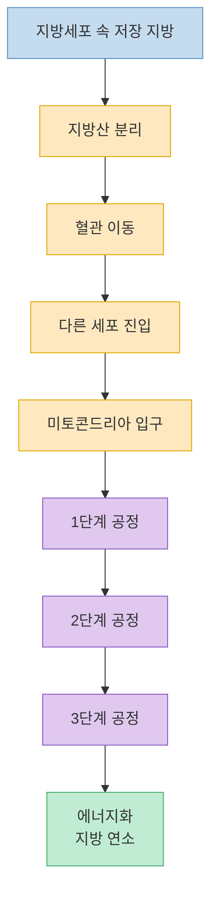
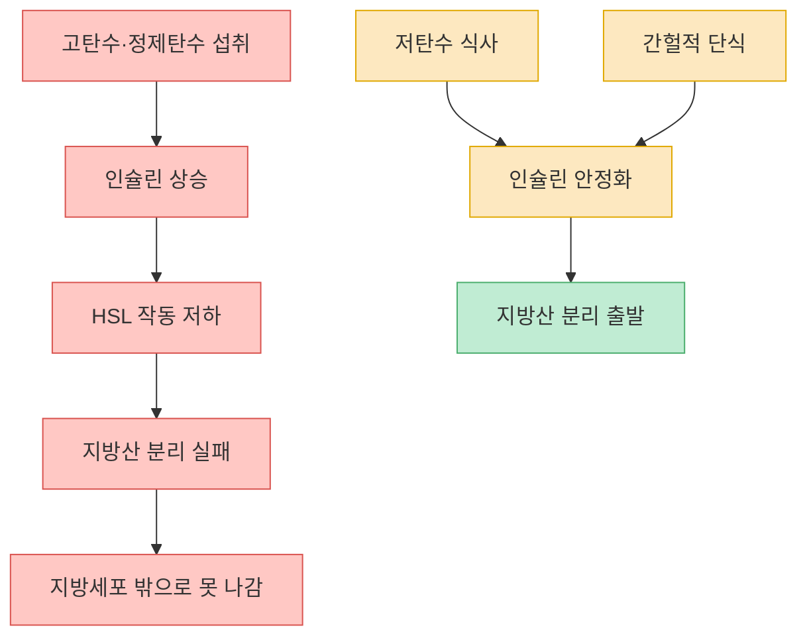
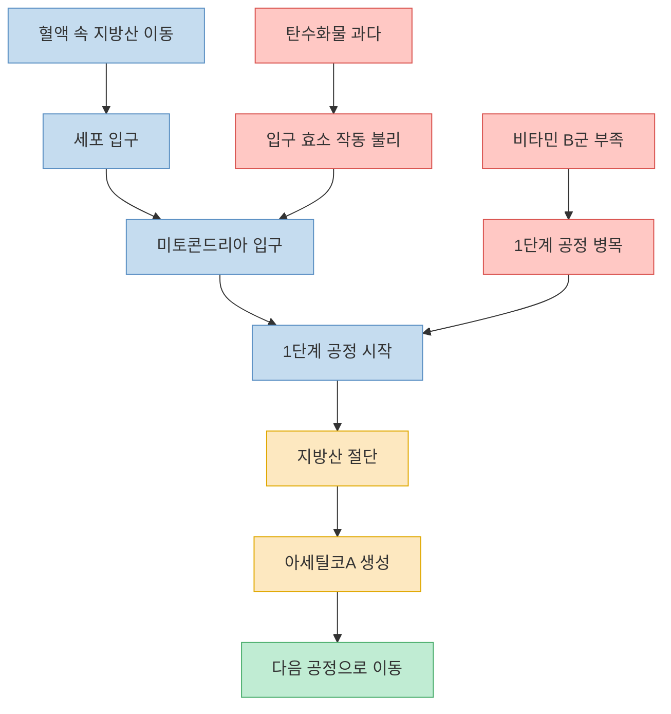
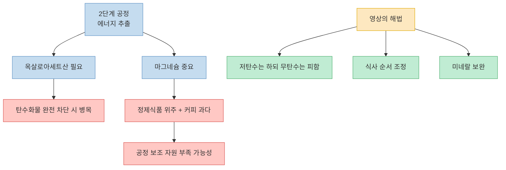
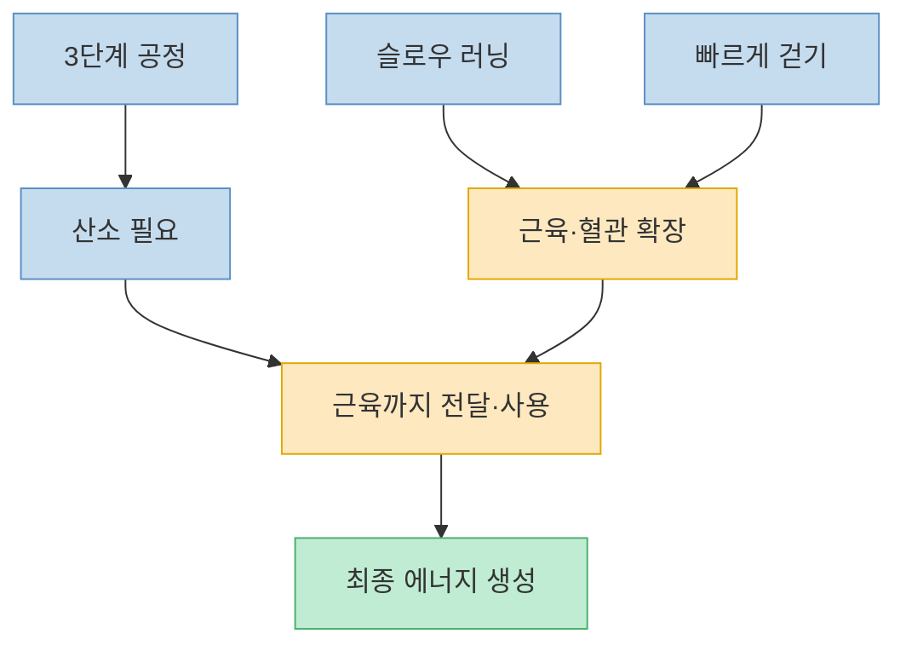
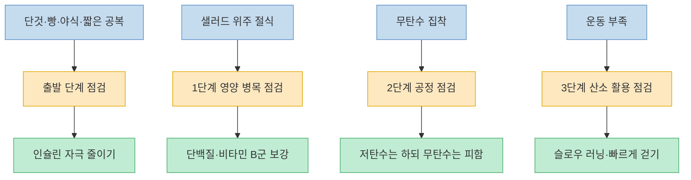

이 영상의 핵심은 `덜 먹었는데 왜 안 빠지지?`라는 질문을 `내 지방 연소 경로는 어디서 막혔지?`라는 질문으로 바꾸는 데 있습니다. 발표자는 지방이 빠지는 과정을 `지방세포에서 지방산이 분리되는 출발 단계`, `미토콘드리아 안으로 들어가는 단계`, 그리고 `1단계·2단계·3단계 공정`으로 쪼개서 보여 주며, 각 단계마다 막히는 이유와 해결 힌트를 붙여 설명합니다. [(0:21)](https://youtu.be/yqsasZxB0IM?t=21), [(0:29)](https://youtu.be/yqsasZxB0IM?t=29), [(2:04)](https://youtu.be/yqsasZxB0IM?t=124), [(2:39)](https://youtu.be/yqsasZxB0IM?t=159)

좋은 점은 `무조건 적게 먹어라`가 아니라 `출발-진입-연소` 중 어디가 병목인지 보게 만든다는 데 있습니다. 동시에 이 설명은 복잡한 생리학을 아주 단순한 지도 형태로 압축한 것이기도 하므로, 이 글도 영상을 그대로 받아쓰기보다 `영상은 무엇을 핵심 축으로 잡는가`에 초점을 맞춰 다시 정리하겠습니다. [(1:38)](https://youtu.be/yqsasZxB0IM?t=98), [(2:09)](https://youtu.be/yqsasZxB0IM?t=129), [(7:59)](https://youtu.be/yqsasZxB0IM?t=479)

<!--more-->

## Sources

- [살 빠지는 루트! 당신은 어디서 막혔나?](https://www.youtube.com/watch?v=yqsasZxB0IM) — 탱자마미, 2026-02-28

---

## 지방은 어떻게 "탄다"고 설명되나

영상은 지방을 `글리세롤 막대 + 지방산 3개` 구조로 설명합니다. 여기서 지방산이 떨어져 나와 혈관을 타고 다른 세포로 이동하고, 그 세포 안의 미토콘드리아로 들어가 에너지로 바뀌면 그 상태를 바로 `지방이 탄다`, `살이 빠진다`고 부릅니다. 즉 체지방 감량을 단순 체중 감소가 아니라 `저장된 지방산이 실제로 에너지화되는 과정`으로 풀어내는 방식입니다. [(0:39)](https://youtu.be/yqsasZxB0IM?t=39), [(0:55)](https://youtu.be/yqsasZxB0IM?t=55), [(1:03)](https://youtu.be/yqsasZxB0IM?t=63), [(1:13)](https://youtu.be/yqsasZxB0IM?t=73)

이어 영상은 미토콘드리아를 `지방을 태우는 공장`이라고 부르면서, 지방산이 여기 들어간 뒤에도 한 번에 끝나는 것이 아니라 `1단계`, `2단계`, `3단계`라는 세 공정을 거쳐야 최종적으로 에너지가 된다고 설명합니다. 그래서 살이 잘 안 빠질 때는 단순히 `내가 더 먹어서`가 아니라, 이 지도 안 어딘가에서 병목이 생긴 것으로 읽어야 한다는 것이 영상의 전체 프레임입니다. [(1:25)](https://youtu.be/yqsasZxB0IM?t=85), [(1:38)](https://youtu.be/yqsasZxB0IM?t=98), [(1:49)](https://youtu.be/yqsasZxB0IM?t=109), [(2:16)](https://youtu.be/yqsasZxB0IM?t=136)

---

## 첫 번째 병목: 지방세포에서 출발조차 못 하는 단계

영상이 가장 먼저 짚는 것은 `지방산 분리`입니다. 지방세포 안의 지방이 실제로 빠져나오려면 HSL 같은 효소가 필요하고, 발표자는 이 효소가 `인슐린이 낮아졌을 때` 잘 나온다고 설명합니다. 반대로 아이스크림 같은 고탄수화물을 먹어 인슐린이 크게 오르면 HSL이 충분히 나오지 못해 지방산이 지방세포에서 분리되지 못하고, 그러면 출발 자체가 막힌다는 논리입니다. [(3:01)](https://youtu.be/yqsasZxB0IM?t=181), [(3:09)](https://youtu.be/yqsasZxB0IM?t=189), [(3:15)](https://youtu.be/yqsasZxB0IM?t=195), [(3:23)](https://youtu.be/yqsasZxB0IM?t=203)

그래서 영상은 인슐린을 다이어트의 `핵심 키`로 놓습니다. 출발선에서 지방이 떨어져 나오지 못하면 뒤 공정이 아무리 멀쩡해도 의미가 없으니, 첫 해결책은 자연스럽게 `인슐린을 낮추는 식사`, 곧 저탄수 쪽으로 갑니다. 다만 여기서도 발표자는 `저탄수`와 `무탄수`를 분명히 구분합니다. 영상의 메시지는 탄수화물을 완전히 끊으라는 것이 아니라, 출발을 막는 수준의 고탄수·정제탄수 자극을 줄이라는 쪽에 가깝습니다. [(3:27)](https://youtu.be/yqsasZxB0IM?t=207), [(3:35)](https://youtu.be/yqsasZxB0IM?t=215), [(3:42)](https://youtu.be/yqsasZxB0IM?t=222), [(3:46)](https://youtu.be/yqsasZxB0IM?t=226)

이 지점에서 영상은 `인슐린 저항성`도 연결합니다. 어릴 때부터 빵, 사탕, 초콜릿 같은 음식을 반복적으로 먹어 온 몸은 조금만 먹어도 인슐린이 많이 분비되는 쪽으로 기울 수 있고, 그러면 지방산이 매번 출발하다 말고 멈춘다고 설명합니다. 그래서 간헐적 단식이 등장하는 이유도 `덜 먹어서`가 아니라, 인슐린이 낮은 상태를 길게 확보해 이 첫 관문을 통과시키기 위해서라고 정리합니다. [(3:48)](https://youtu.be/yqsasZxB0IM?t=228), [(4:00)](https://youtu.be/yqsasZxB0IM?t=240), [(4:05)](https://youtu.be/yqsasZxB0IM?t=245), [(4:12)](https://youtu.be/yqsasZxB0IM?t=252)

---

## 두 번째 병목: 미토콘드리아 입구와 1단계 공정

첫 관문을 통과한 지방산은 혈액 속 알부민을 타고 다른 세포로 이동한다고 영상은 설명합니다. 세포 입구 자체는 크게 어렵지 않지만, 진짜 중요한 문은 미토콘드리아 입구라고 말합니다. 발표자는 이 부분을 `자동문`과 `철문`의 차이처럼 표현하면서, 여기서는 영상 표현으로 `PT1 같은 효소`가 필요하고, 탄수화물이 많으면 이 효소도 잘 못 나오게 해 또 막힐 수 있다고 설명합니다. [(4:28)](https://youtu.be/yqsasZxB0IM?t=268), [(4:40)](https://youtu.be/yqsasZxB0IM?t=280), [(4:52)](https://youtu.be/yqsasZxB0IM?t=292), [(5:01)](https://youtu.be/yqsasZxB0IM?t=301)

입구를 통과하면 영상이 말하는 `1단계 공정`이 시작됩니다. 여기서는 지방산이 잘려 `아세틸코A` 쪽으로 바뀌어야 다음 단계의 더 좁은 문으로 들어갈 수 있다고 설명하는데, 이때 힘을 실어 주는 요소로 비타민 B군을 강조합니다. 그래서 발표자는 다이어트한다고 야채나 샐러드만 먹는 방식이 오히려 이 단계에서 병목을 만들 수 있다고 말하고, 고기·생선·달걀 같은 식품을 골고루 먹어야 한다는 메시지로 연결합니다. [(5:10)](https://youtu.be/yqsasZxB0IM?t=310), [(5:25)](https://youtu.be/yqsasZxB0IM?t=325), [(5:27)](https://youtu.be/yqsasZxB0IM?t=327), [(5:35)](https://youtu.be/yqsasZxB0IM?t=335), [(5:47)](https://youtu.be/yqsasZxB0IM?t=347)

이 대목이 흥미로운 이유는 영상이 `적게 먹는 다이어트`를 두 번 비튼다는 점입니다. 출발 단계에서는 고탄수로 막히고, 1단계 공정에서는 영양소가 지나치게 빈약한 식사로 막힐 수 있다고 보기 때문입니다. 즉 영상의 논리는 체중 감량을 `얼마나 덜 먹나`가 아니라 `지방 연소 공정을 굴릴 재료와 조건을 갖췄나`로 다시 읽습니다. [(5:34)](https://youtu.be/yqsasZxB0IM?t=334), [(5:43)](https://youtu.be/yqsasZxB0IM?t=343), [(5:50)](https://youtu.be/yqsasZxB0IM?t=350), [(5:55)](https://youtu.be/yqsasZxB0IM?t=355)

---

## 세 번째 병목: 2단계 공정은 왜 "무탄수"를 경계하나

영상에서 가장 역설적으로 들리는 부분은 여기입니다. 발표자는 2단계 공정, 곧 크랩스 회로를 `아세틸코A에서 에너지를 뽑아내는 단계`라고 설명하면서, 여기에는 `옥살로아세트산`이 중요하고 이 재료가 탄수화물에서 나온다고 말합니다. 그래서 앞 단계에서는 저탄수를 강조했지만, 여기서는 오히려 `무탄수는 위험할 수 있다`고 선을 긋습니다. 이 영상 안에서 저탄수가 중요한 이유는 탄수화물을 0으로 만들기 위해서가 아니라, `과한 탄수 자극은 줄이되 공정을 멈출 정도로 바닥내지는 말라`는 균형을 잡기 위해서입니다. [(5:57)](https://youtu.be/yqsasZxB0IM?t=357), [(6:06)](https://youtu.be/yqsasZxB0IM?t=366), [(6:10)](https://youtu.be/yqsasZxB0IM?t=370), [(6:16)](https://youtu.be/yqsasZxB0IM?t=376), [(6:24)](https://youtu.be/yqsasZxB0IM?t=384)

그래서 식사 순서 조언도 붙습니다. 발표자는 정제탄수화물을 앞쪽에 몰아 먹는 행동을 줄이기 위해 `야채 -> 지방/단백질 -> 후반부 탄수화물` 순서를 반복해서 강조합니다. 이 순서는 영상 전체 맥락상 `탄수를 완전히 금지하는 방식`이 아니라 `탄수 자극의 타이밍과 강도를 관리하는 방식`으로 이해하는 편이 맞습니다. [(6:27)](https://youtu.be/yqsasZxB0IM?t=387), [(6:31)](https://youtu.be/yqsasZxB0IM?t=391), [(6:34)](https://youtu.be/yqsasZxB0IM?t=394)

여기에 마그네슘도 추가됩니다. 발표자는 마그네슘이 이 공정에서 중요하다고 말하며, 커피 과다 섭취나 정제식품 위주 식사가 결핍 쪽으로 기울 수 있다고 설명합니다. 그래서 미네랄 워터, 미네랄 소금 같은 실전 팁을 제안하는데, 이 역시 영상의 관점에서는 `체지방 감량`을 단순 열량 통제가 아니라 `공정을 굴리는 미세 재료 관리`로 보는 사례입니다. [(6:36)](https://youtu.be/yqsasZxB0IM?t=396), [(6:38)](https://youtu.be/yqsasZxB0IM?t=398), [(6:45)](https://youtu.be/yqsasZxB0IM?t=405), [(6:56)](https://youtu.be/yqsasZxB0IM?t=416), [(7:00)](https://youtu.be/yqsasZxB0IM?t=420)

---

## 마지막 공정: 산소를 들이마시는 것보다 "쓰는 능력"

영상의 마지막 3단계는 전자전달계이고, 여기서 발표자가 붙이는 핵심 단어는 `산소`입니다. 산소 공급이 잘될수록 지방이 더 잘 탄다고 설명하면서, 그래서 요즘 많이 이야기되는 운동으로 `슬로우 러닝`을 예로 듭니다. 다만 이때도 강조점은 단순히 숨을 많이 들이마시는 것이 아니라, 산소를 근육까지 전달하고 실제로 활용하는 능력에 있습니다. [(7:14)](https://youtu.be/yqsasZxB0IM?t=434), [(7:24)](https://youtu.be/yqsasZxB0IM?t=444), [(7:29)](https://youtu.be/yqsasZxB0IM?t=449), [(7:36)](https://youtu.be/yqsasZxB0IM?t=456)

발표자는 아주 천천히 달리기 시작하면 근육과 혈관이 확장되고, 그 혈류를 타고 산소가 세포까지 잘 운반된다고 설명합니다. 그래서 꼭 러닝이 아니어도 운동을 거의 안 하던 사람이라면 `빠르게 걷기`만으로도 도움이 된다고 말합니다. 영상이 던지는 메시지는 분명합니다. 지방 연소는 식단만의 문제가 아니라, 마지막 단계에서는 `산소를 실제로 써먹을 몸`을 만들고 있는지도 함께 봐야 한다는 것입니다. [(7:40)](https://youtu.be/yqsasZxB0IM?t=460), [(7:43)](https://youtu.be/yqsasZxB0IM?t=463), [(7:48)](https://youtu.be/yqsasZxB0IM?t=468), [(7:53)](https://youtu.be/yqsasZxB0IM?t=473)

---

## 실전 적용 포인트

이 영상을 실제 생활에 옮기려면 먼저 `나는 어느 단계에서 자주 막히는가`를 묻는 것이 핵심입니다. 단것, 빵, 음료, 야식, 짧은 공복 시간이 반복된다면 영상의 설명상 첫 출발 단계에서 계속 멈출 가능성이 큽니다. 반대로 샐러드 위주로만 버티는 다이어트를 오래 했다면, 영상은 1단계 공정 쪽의 영양 병목을 의심합니다. [(3:01)](https://youtu.be/yqsasZxB0IM?t=181), [(4:12)](https://youtu.be/yqsasZxB0IM?t=252), [(5:27)](https://youtu.be/yqsasZxB0IM?t=327), [(5:46)](https://youtu.be/yqsasZxB0IM?t=346)

또 저탄수를 한다고 탄수화물을 완전히 지워 버리는 방식은 영상의 내부 논리와도 맞지 않습니다. 발표자는 2단계 공정에서 탄수화물이 너무 바닥나면 오히려 에너지 추출이 막힐 수 있다고 설명하므로, 이 영상이 권하는 방향은 `정제탄수 과다 -> 저탄수 조절 -> 무탄수는 지양` 쪽입니다. 여기에 식사 순서와 미네랄 관리, 그리고 운동 부족을 줄이는 유산소 습관까지 묶어야 전체 지도가 이어집니다. [(6:10)](https://youtu.be/yqsasZxB0IM?t=370), [(6:27)](https://youtu.be/yqsasZxB0IM?t=387), [(6:38)](https://youtu.be/yqsasZxB0IM?t=398), [(7:36)](https://youtu.be/yqsasZxB0IM?t=456)

결국 이 영상이 주는 가장 실용적인 관점은 `살이 안 빠지는 이유를 한 가지로 몰지 말라`는 것입니다. 식단 하나, 운동 하나만으로 해결되지 않는 이유를 출발·진입·연소라는 단계로 나눠 보게 해 주기 때문에, 적어도 스스로를 `의지가 약해서 실패했다`고 몰아붙이는 방식에서는 벗어나게 합니다. 영상 마지막에서도 발표자는 체지방 연소가 수십 개 과정을 거치는 정교한 시스템이며, 식단 하나 운동 하나만으로 전부 해결되지 않는다고 다시 강조합니다. [(7:55)](https://youtu.be/yqsasZxB0IM?t=475), [(8:03)](https://youtu.be/yqsasZxB0IM?t=483), [(8:09)](https://youtu.be/yqsasZxB0IM?t=489)

---

## 핵심 요약

- 이 영상은 체지방 감량을 `지방산 분리 -> 미토콘드리아 진입 -> 1·2·3단계 공정`으로 나눈 뒤, 어디에서 병목이 생기는지를 찾는 방식으로 설명합니다. [(1:38)](https://youtu.be/yqsasZxB0IM?t=98), [(2:04)](https://youtu.be/yqsasZxB0IM?t=124)
- 첫 단계의 핵심 변수는 인슐린입니다. 영상은 고탄수화물이 인슐린을 올려 HSL 작동을 막고, 그러면 지방산이 출발조차 못 한다고 설명합니다. [(3:01)](https://youtu.be/yqsasZxB0IM?t=181), [(3:23)](https://youtu.be/yqsasZxB0IM?t=203)
- 그래서 해법으로 저탄수와 간헐적 단식을 제시하지만, 동시에 `무탄수`는 위험할 수 있다고 선을 긋습니다. [(3:42)](https://youtu.be/yqsasZxB0IM?t=222), [(4:12)](https://youtu.be/yqsasZxB0IM?t=252), [(6:10)](https://youtu.be/yqsasZxB0IM?t=370)
- 1단계 공정에서는 비타민 B군, 2단계 공정에서는 마그네슘과 식사 순서, 3단계 공정에서는 산소 활용 능력이 주요 보조 축으로 제시됩니다. [(5:27)](https://youtu.be/yqsasZxB0IM?t=327), [(6:38)](https://youtu.be/yqsasZxB0IM?t=398), [(7:24)](https://youtu.be/yqsasZxB0IM?t=444)
- 영상의 가장 실용적인 메시지는 `살이 안 빠지는 이유를 의지 부족으로만 읽지 말고, 내 병목이 어느 단계인지 먼저 보라`는 데 있습니다. [(7:55)](https://youtu.be/yqsasZxB0IM?t=475), [(8:09)](https://youtu.be/yqsasZxB0IM?t=489)

---

## 결론

이 영상이 설득력 있는 이유는 체지방 감량을 막연한 정신력 싸움이 아니라 `지방이 실제로 타는 경로의 병목 관리`로 바꿔 설명하기 때문입니다. 출발선에서는 인슐린, 중간 공정에서는 영양과 식사 구조, 마지막 공정에서는 산소 활용 능력을 보라는 구조가 한 장의 지도로 묶입니다. [(2:39)](https://youtu.be/yqsasZxB0IM?t=159), [(3:27)](https://youtu.be/yqsasZxB0IM?t=207), [(7:24)](https://youtu.be/yqsasZxB0IM?t=444)

물론 실제 몸은 영상이 그린 지도보다 훨씬 복잡합니다. 그래도 `나는 왜 안 빠지지?`라는 막막함을 `어느 공정에서 막혔지?`라는 점검 질문으로 바꿔 주는 것만으로도 이 영상은 꽤 쓸모가 있습니다. 적어도 식단 하나, 운동 하나로 모든 걸 해결하려는 조급함 대신, 병목을 단계별로 나눠 보는 관점을 남기기 때문입니다. [(7:59)](https://youtu.be/yqsasZxB0IM?t=479), [(8:23)](https://youtu.be/yqsasZxB0IM?t=503), [(8:29)](https://youtu.be/yqsasZxB0IM?t=509)
