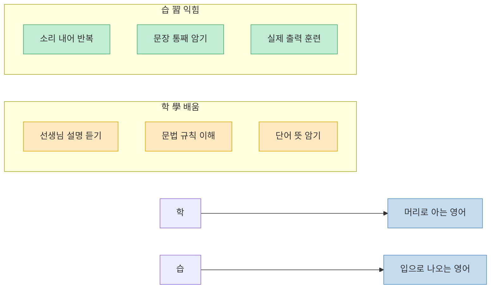
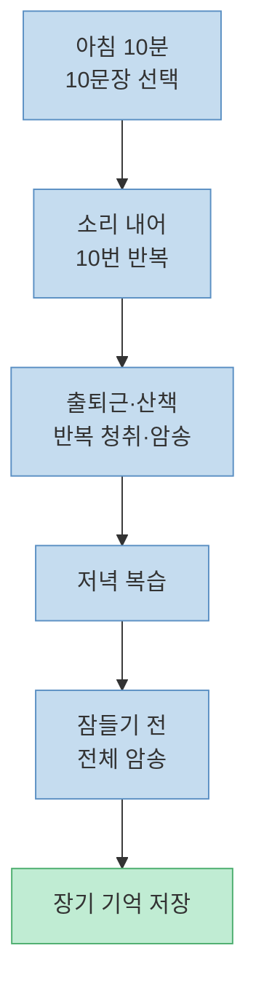
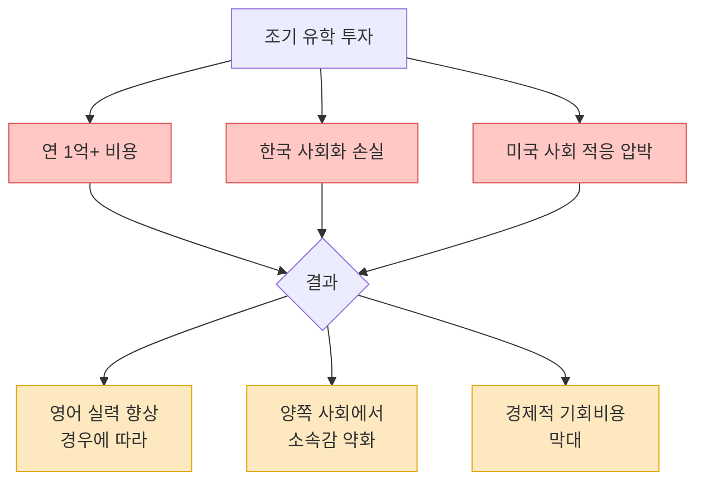
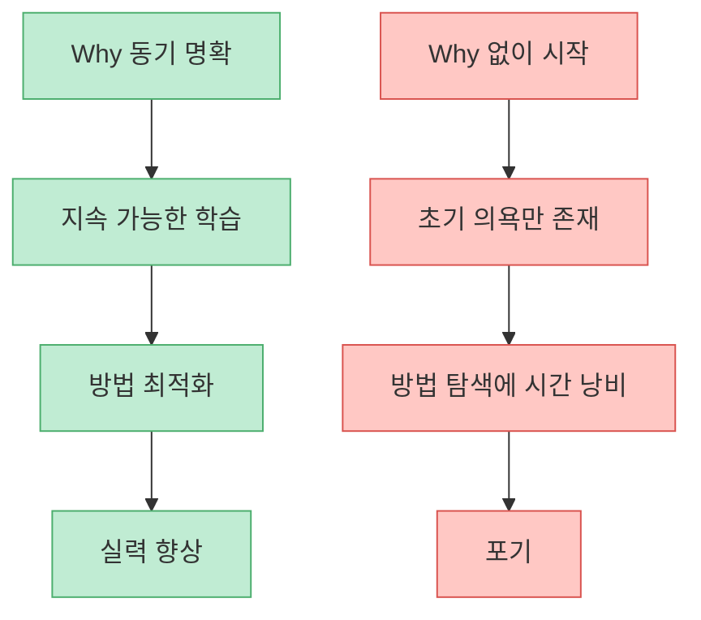

"그냥 드립다 외워라." 동시통역사 출신 MBC 김민식 PD가 언더스탠딩 채널에 출연해 수십 년간 한국인이 영어를 못 하는 근본 원인과 그 해법을 한 문장으로 압축했다. 기초 영어 회화책 한 권을 통째로 암기하는 것. 거창한 학습 시스템도, 해외 유학도, 수만 개의 어휘장도 필요 없다. 대학 시절 영어 D+ 성적표를 받았던 그가 동시통역사가 된 방법이다.

<!--more-->

## Sources

- [(1부) 성문영어의 저주. 이래서 망했다 | 북언더스탠딩 | 영어책 한 권 외워봤니? | 김민식 PD](https://youtu.be/kEwjrl-BHdA) — 언더스탠딩 : 세상의 모든 지식, 2026-03-20

---

## 학(學)과 습(習) — 배우는 것과 익히는 것

[(영상 03:32)](https://youtu.be/kEwjrl-BHdA?t=212)

논어의 첫 문장은 "학이시습지 불역열호(學而時習之 不亦說乎)"다. 배우고 때때로 익히니 기쁘지 아니한가. 김민식 PD는 이 구절에서 핵심 구분을 끌어낸다.

- **학(學)**: 선생님의 것을 받아들이는 것. 수동적 입력.
- **습(習)**: 내 것으로 만드는 것. 능동적 출력과 반복.

한국의 영어 교육은 학(學)에만 집중해왔다. 문법을 배우고, 단어를 외우고, 지문을 분석한다. 그러나 언어는 습(習)으로만 체화된다. 입으로 소리를 내어 반복하지 않으면 아무리 많이 배워도 말로 나오지 않는다.

---

## 핵심 학습법 — 하루 10문장, 소리 내어 10번

[(영상 04:45)](https://youtu.be/kEwjrl-BHdA?t=285)

구체적인 방법은 단순하다.

1. **기초 영어 회화책** 한 권을 고른다. (두껍고 어려운 책이 아닌, 얇고 쉬운 것)
2. 매일 아침 10분, **10개 문장**을 선택한다.
3. 각 문장을 **소리 내어 10번** 읽는다. 조용히 눈으로 읽는 것이 아니다.
4. 출퇴근길, 산책 중에 **반복 청취·암송**한다.
5. 저녁에 복습하고, 잠들기 전 **전체 암송**한다.

"중국어 사극 배우처럼 연기하며" 외우는 것이 포인트다. [(영상 09:20)](https://youtu.be/kEwjrl-BHdA?t=560) 억양, 리듬, 감정까지 따라하면 문장이 훨씬 빠르게 몸에 박힌다.

자투리 시간이 핵심이다. 따로 책상에 앉아 공부하는 시간이 아니라 이미 비어 있는 출퇴근·식당 대기·산책 시간을 활용한다. 하루 20~30분이면 충분하다.

---

## 누적 암송법 — 망각을 막는 구조

[(영상 09:55)](https://youtu.be/kEwjrl-BHdA?t=595)

단순히 매일 새로운 내용만 외우면 이전 것을 잊는다. 누적 암송법은 이 문제를 구조적으로 해결한다.

매일 그 날 배운 내용만 하는 것이 아니라, 반드시 1과부터 다시 시작해 누적으로 암송한다. 처음에는 부담스럽지만, 앞부분은 이미 익숙해져서 빠르게 지나간다. 이 반복이 장기 기억을 만든다.

5년 전 외웠던 일본어 문장도 기억에 남아 있다는 실제 경험이 이 방법의 효과를 보여준다. [(영상 10:57)](https://youtu.be/kEwjrl-BHdA?t=657)

---

## 입력 vs 출력 — 왜 많이 들어도 말을 못 하는가

[(영상 11:57)](https://youtu.be/kEwjrl-BHdA?t=717)

한국 영어 교육의 핵심 오류를 짚는 대목이다.

> "많은 양을 입력하는 게 아니라, 적은 양을 반복해서 출력하는 것."

수천 개의 단어를 외우고, 수백 개의 문법 규칙을 배워도 말이 안 나오는 이유가 여기 있다. 입력(input)만으로는 언어가 체화되지 않는다. 말로 직접 출력(output)하는 훈련이 있어야 뇌에서 언어 회로가 만들어진다.

뉴욕 특파원으로 수년간 미국에 살았어도 영어가 늘지 않은 사람들의 공통점도 여기 있다. [(영상 12:31)](https://youtu.be/kEwjrl-BHdA?t=751) 한인 커뮤니티 안에서 한국어로 생활하면, 미국 땅에 있어도 영어 출력 훈련이 일어나지 않는다. 환경이 아니라 방법이 문제다.

---

## 해외 유학·조기 유학의 착각

[(영상 15:07)](https://youtu.be/kEwjrl-BHdA?t=907)

"미국 가서 살면 영어가 늘겠지"라는 생각은 절반만 맞다. 미국에서 강제로 영어를 사용해야 하는 환경에 놓이면 효과가 있다. 그러나 한인 밀집 지역, 한인 학교, 한인 교회로만 이어지는 생활을 하면 수년이 지나도 영어 실력이 크게 늘지 않는다.

조기 유학은 더 큰 문제를 안고 있다. [(영상 27:59)](https://youtu.be/kEwjrl-BHdA?t=1679)

- 연간 1억 원 이상의 비용
- 아이가 미국 사회에 적응하는 과정에서 한국 사회화를 잃음
- 돌아왔을 때 한국 사회에서도, 미국 사회에서도 완전히 속하지 못하는 상태

> "그 돈으로 S&P500 ETF를 사는 게 낫다."

---

## 성문영어의 저주 — 한국 영어 교육이 망한 이유

[(영상 24:38)](https://youtu.be/kEwjrl-BHdA?t=1478)

한국 영어 교육의 상징인 성문 기본영어, 성문 종합영어, 어휘 22,000·33,000은 공통된 문제를 가진다. 시험을 위한 영어다.

- 실제 일상 대화에서 거의 쓰이지 않는 고급 문법 구조
- 원어민도 잘 쓰지 않는 고난도 어휘
- 읽고 분석하는 훈련만 있고, 말하는 훈련은 없음

결과적으로 수능 영어 만점자도 외국인 앞에서 말문이 막히는 현상이 반복된다. 김민식 PD 본인도 대학 시절 영어 D+를 받은 장본인이다. [(영상 26:36)](https://youtu.be/kEwjrl-BHdA?t=1596) 한국외국어대 통역대학원에 진학하고 나서야, 즉 말하기 출력 훈련을 집중적으로 받고 나서야 동시통역사가 될 수 있었다.

---

## Why가 How보다 중요하다

[(영상 28:50)](https://youtu.be/kEwjrl-BHdA?t=1730)

영어 공부를 지속하게 만드는 근본 동력은 방법(How)이 아니라 동기(Why)다.

> "What을 공부할지, How를 공부할지가 아니라, 내가 왜 영어를 해야 하는지가 먼저입니다."

동기 없이 방법만 바꾸면 결국 포기한다. 반대로 Why가 강하면 방법이 다소 비효율적이어도 지속할 수 있다.

BTS RM의 사례가 이를 잘 보여준다. [(영상 31:00)](https://youtu.be/kEwjrl-BHdA?t=1860) 전 세계 팬들과 소통하고 싶다는 강렬한 Why가 있었기에, 특별한 교육 환경 없이도 유창한 영어 실력을 갖추게 됐다.

Why의 예시:
- 좋아하는 외국 밴드의 인터뷰를 직접 이해하고 싶다
- 해외 거래처와 직접 소통하고 싶다
- 외국 논문을 원문으로 읽고 싶다
- 여행지에서 현지인과 대화하고 싶다

이 이유가 강할수록 하루 10문장씩 외우는 지루한 과정도 견딜 수 있다.

---

## 외운 문장 밖의 대화는?

[(영상 18:19)](https://youtu.be/kEwjrl-BHdA?t=1099)

회화책 한 권을 외워도 실전에서는 예상 밖의 대화가 나온다. 이에 대한 현실적인 해법이 있다.

- 외운 범위의 대화 → 암기한 문장으로 자연스럽게 대응
- 외운 범위 밖의 대화 → 번역 앱 적극 활용

번역 앱을 부끄럽게 여기지 않는 것이 중요하다. 스몰토크(처음 만나는 사람과의 기본 인사·소개)는 암기로 해결하고, 그 이상의 복잡한 대화는 도구를 활용한다. 완벽한 영어가 목표가 아니라 소통이 목표이기 때문이다.

---

## 핵심 요약

| 항목 | 내용 |
|---|---|
| 핵심 원칙 | 학(學)이 아닌 습(習) — 출력 중심 학습 |
| 학습 방법 | 회화책 1권, 하루 10문장, 소리 내어 10번 |
| 누적 암송 | 매일 1과부터 그날까지 전체 누적 반복 |
| 입력 vs 출력 | 많은 입력보다 적은 양의 반복 출력 |
| 해외 유학 | 환경이 아닌 방법이 핵심, 조기 유학 효과 과장됨 |
| 성문영어 | 시험용 영어, 말하기 훈련 없어 실패 |
| 동기(Why) | How보다 Why가 먼저, 동기 없으면 지속 불가 |
| 실전 보완 | 스몰토크는 암기, 나머지는 번역 앱 활용 |

---

## 결론

대학 시절 영어 D+를 받았던 사람이 동시통역사가 된 비결은 단순하다. 배우는 것(학)에서 익히는 것(습)으로 패러다임을 전환했다. 수천 개의 단어와 복잡한 문법 대신, 쉬운 회화 문장 10개를 소리 내어 반복하는 것. 이것을 누적으로 쌓아가는 것.

한국인이 영어를 못 하는 이유는 머리가 나빠서가 아니다. 학(學)으로 가득 채운 수십 년 동안 습(習)을 한 번도 제대로 해보지 않았기 때문이다. 드립다 외워라.
