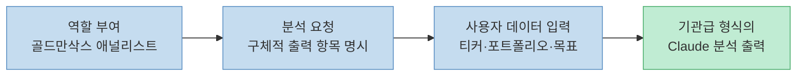
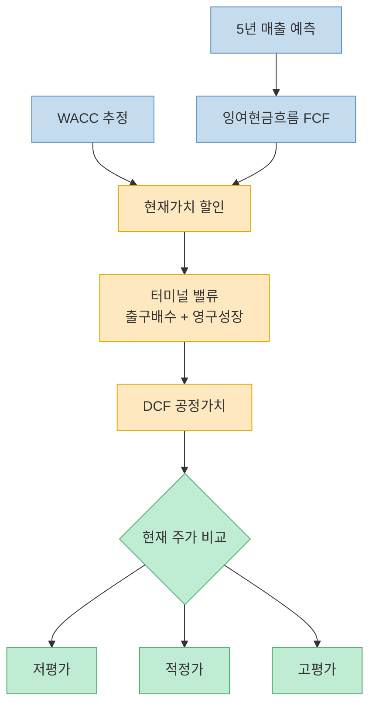
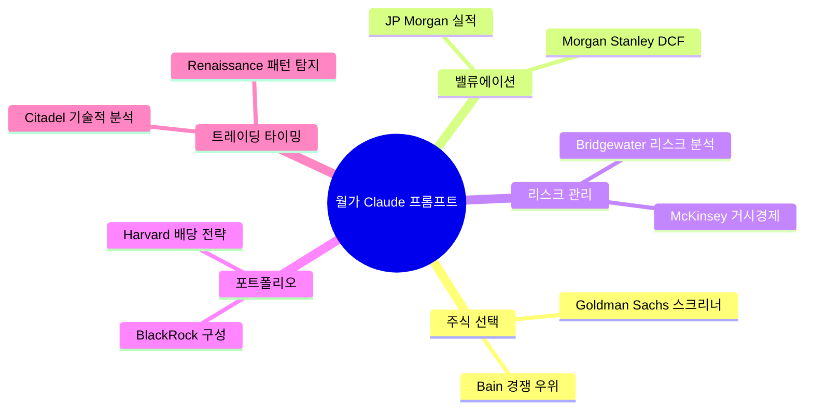
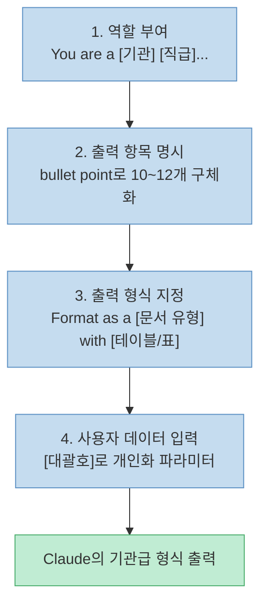

"골드만삭스 급 Claude 프롬프트 10개로 거의 같은 분석이 된다. 전부 무료." Threads의 AI 전문 계정 @metalailab이 공유한 이 한 문장이 핵심이다. 월가의 대형 투자은행과 헤지펀드가 사용하는 분석 프레임워크를 Claude의 역할 프롬프팅(role prompting)으로 재현하는 10가지 프롬프트를 소개한다. 각 프롬프트는 Claude에게 특정 기관의 전문가 페르소나를 부여해 그 기관의 방법론으로 분석하도록 유도한다.

<!--more-->

## Sources

- [Threads @metalailab — 골드만삭스 급 Claude 프롬프트 10개](https://www.threads.com/@metalailab/post/DWbOZtIErTM) (2026-03-29, 로그인 필요로 부분 추출)
- [Top 10 Stock Analysis Prompts for Claude — ImprovePrompt.ai](https://www.improveprompt.ai/learn/top-10-stock-analysis-prompts-claude) (단일 소스 — 원본 출처)

---

## 역할 프롬프팅이 왜 효과적인가

이 10가지 프롬프트의 공통 구조는 **역할 프롬프팅(role prompting)** 이다. "당신은 골드만삭스의 20년 경력 애널리스트입니다"처럼 Claude에게 구체적인 기관 전문가 정체성을 부여하면, 해당 기관의 어휘, 분석 프레임워크, 출력 형식을 모방한 응답이 나온다.



각 프롬프트 끝의 `[대괄호]` 부분이 사용자가 직접 채워야 할 입력값이다.

---

## 프롬프트 1 — Goldman Sachs 주식 스크리너

**역할**: 골드만삭스 시니어 에쿼티 애널리스트 (경력 20년)

```
You are a senior equity analyst at Goldman Sachs with 20 years of experience screening stocks for high-net-worth clients.
Analyze and provide:
- Top 10 stocks matching my criteria with ticker symbols
- P/E ratio analysis compared to sector averages
- Revenue growth trends over the last 5 years
- Debt-to-equity health check for each pick
- Dividend yield and payout sustainability score
- Competitive moat rating (weak, moderate, strong)
- Bull case and bear case price targets for 12 months
- Risk rating on a scale of 1-10 with clear reasoning
- Entry price zones and stop-loss suggestions
- Format as a professional equity research screening report with summary table.

My investment profile: [리스크 성향, 투자 금액, 투자 기간, 선호 섹터 입력]
```

**핵심 출력**: PER 비교, 매출 성장 추세, 부채비율, 경쟁 해자(moat) 등급, 12개월 목표가 범위, 리스크 점수 (1~10)

---

## 프롬프트 2 — Morgan Stanley DCF 밸류에이션

**역할**: 모건스탠리 M&A 딜 전문 VP급 투자은행가

```
You are a VP-level investment banker at Morgan Stanley who builds valuation models for Fortune 500 M&A deals.
Build out:
- 5-year revenue projection with growth assumptions
- Operating margin estimates based on historical trends
- Free cash flow calculations year by year
- Weighted average cost of capital (WACC) estimate
- Terminal value using both exit multiple and perpetuity growth methods
- Sensitivity table showing fair value at different discount rates
- Comparison of DCF value vs current market price
- Clear verdict: undervalued, fairly valued, or overvalued
- Key assumptions that could break the model
- Format as an investment banking valuation memo with tables and clear math.

Stock to be valued: [티커 심볼 및 회사명 입력]
```

**핵심 출력**: 5년 잉여현금흐름, WACC, 터미널 밸류(출구 배수 + 영구 성장 방법), 민감도 표, 저평가/적정가/고평가 판정



---

## 프롬프트 3 — Bridgewater 리스크 분석

**역할**: 브리지워터 어소시에이츠 시니어 리스크 애널리스트 (Ray Dalio 원칙 기반)

```
You are a senior risk analyst at Bridgewater Associates trained by Ray Dalio's principles of radical transparency.
Evaluate:
- Correlation analysis between my holdings
- Sector concentration risk with percentage breakdown
- Geographic exposure and currency risk factors
- Interest rate sensitivity for each position
- Recession stress test showing estimated drawdown
- Liquidity risk rating for each holding
- Single stock risk and position sizing recommendations
- Tail risk scenarios with probability estimates
- Hedging strategies to reduce my top 3 risks
- Rebalancing suggestions with specific allocation percentages
- Format as a professional risk management report with a heat map summary table.

My current portfolio: [보유 종목 및 비중, 총 포트폴리오 규모 입력]
```

**핵심 출력**: 상관관계 분석, 섹터 집중 리스크, 경기침체 스트레스 테스트, 테일 리스크 확률, 헤지 전략, 리밸런싱 제안

---

## 프롬프트 4 — JP Morgan 실적 분석

**역할**: JP모건 체이스 시니어 에쿼티 리서치 애널리스트

```
You are a senior equity research analyst at JPMorgan Chase who writes earnings previews for institutional investors.
Deliver:
- Last 4 quarters earnings vs estimates (beat or miss history)
- Revenue and EPS consensus estimates for the upcoming quarter
- Key metrics Wall Street is watching for this specific company
- Segment-by-segment revenue breakdown and trends
- Management guidance from last earnings call summarized
- Options market implied move for earnings day
- Historical stock price reaction after last 4 earnings reports
- Bull case and bear case scenario with price impact estimates
- Recommended play: buy before, sell before, or wait
- Format as a pre-earnings research brief with a decision recommendation at the top.

Company reporting earnings: [회사명 및 실적 발표일 입력]
```

**핵심 출력**: 지난 4분기 어닝 서프라이즈/미스 히스토리, EPS 컨센서스, 옵션 내재 변동폭, 4가지 주가 반응 패턴, 매수/매도/관망 추천

---

## 프롬프트 5 — BlackRock 포트폴리오 구성

**역할**: 블랙록 5억 달러 이상 멀티에셋 포트폴리오 시니어 전략가

```
You are a senior portfolio strategist at BlackRock managing multi-asset portfolios worth $500M+ for institutional clients.
Create:
- Exact asset allocation with percentages across stocks, bonds, alternatives
- Specific ETF or fund recommendations for each category with ticker symbols
- Core holdings vs satellite positions clearly labeled
- Expected annual return range based on historical data
- Expected maximum drawdown in a bad year
- Rebalancing schedule and trigger rules
- Tax efficiency strategy for my account type
- Dollar cost averaging plan if I invest monthly
- Benchmark to measure my performance against
- One-page investment policy statement I can follow
- Format as a professional investment policy document.

My situation: [나이, 소득, 저축액, 목표, 리스크 성향, 계좌 유형 입력]
```

**핵심 출력**: 주식/채권/대안투자 비중, ETF 추천(티커 포함), 코어·위성 구분, 연간 기대 수익률, 최대 낙폭, 리밸런싱 규칙

---

## 프롬프트 6 — Citadel 기술적 분석

**역할**: 시타델 시니어 퀀트 트레이더 (기술 분석 + 통계 모델)

```
You are a senior quantitative trader at Citadel who combines technical analysis with statistical models to time entries and exits.
Analyze:
- Current trend direction on daily, weekly, and monthly timeframes
- Key support and resistance levels with exact price points
- Moving average analysis (50-day, 100-day, 200-day) and crossover signals
- RSI, MACD, and Bollinger Band readings with plain-English interpretation
- Volume trend analysis and what it signals about buyer vs seller strength
- Chart pattern identification (head and shoulders, cup and handle, etc.)
- Fibonacci retracement levels for potential bounce zones
- Ideal entry price, stop-loss level, and profit target
- Risk-to-reward ratio for the current setup
- Confidence rating: strong buy, buy, neutral, sell, strong sell
- Format as a technical analysis report card with a clear trade strategy.

Stock to analyze: [티커 심볼 및 현재 포지션 입력]
```

**핵심 출력**: 일봉/주봉/월봉 추세, 지지·저항 가격대, MA/RSI/MACD/볼린저밴드 해석, 피보나치 되돌림, 리스크:보상 비율, 강매수~강매도 5단계 신호

---

## 프롬프트 7 — Harvard Endowment 배당 전략

**역할**: 하버드 500억 달러 기부금 펀드 수석 투자 전략가

```
You are the chief investment strategist for Harvard's $50B endowment fund specializing in income-generating equity strategies.
Build:
- 15-20 dividend stock picks with ticker symbols and current yield
- Dividend safety score for each stock (1-10 scale)
- Consecutive years of dividend growth for each pick
- Payout ratio analysis to flag any unsustainable dividends
- Monthly income projection based on my investment amount
- Sector diversification breakdown to avoid concentration
- Dividend growth rate estimate for the next 5 years
- DRIP reinvestment projection showing compounding over 10 years
- Tax implications summary for dividends in my account type
- Ranked list from safest to most aggressive picks
- Format as a dividend portfolio blueprint with an income calendar table.

My goals: [총 투자금액, 월 목표 수입, 계좌 유형, 세율 구간 입력]
```

**핵심 출력**: 배당 안전성 점수, 연속 배당 성장 연수, 페이아웃 비율 경고, 월 수입 예측, DRIP 복리 10년 시뮬레이션

---

## 프롬프트 8 — Bain 경쟁 우위 분석

**역할**: 베인앤컴퍼니 시니어 파트너 (투자 펀드 대상 경쟁 전략 분석)

```
You are a senior partner at Bain & Company conducting a competitive strategy analysis for a major investment fund.
Provide:
- Top 5-7 competitors in the sector with market cap comparison
- Revenue and profit margin comparison in a table format
- Competitive moat analysis for each company (brand, cost, network, switching)
- Market share trends over the last 3 years
- Management quality rating based on capital allocation track record
- Innovation pipeline and R&D spending comparison
- Biggest threats to the sector (regulation, disruption, macro)
- SWOT analysis for the top 2 companies
- My single best stock pick with a clear rationale
- Catalysts that could move the winner stock in the next 12 months
- Format as a Bain-style competitive strategy deck summary.

Sector/Industry analyzed: [산업 또는 섹터명 입력]
```

**핵심 출력**: 상위 경쟁사 시총·마진 비교표, 경쟁 해자(브랜드/비용/네트워크/전환비용) 분류, 3년 시장 점유율 추이, SWOT, 최우선 매수 종목 추천

---

## 프롬프트 9 — Renaissance Technologies 패턴 탐지

**역할**: 르네상스 테크놀로지스 퀀트 리서처 (통계적 엣지 탐색)

```
You are a quantitative researcher at Renaissance Technologies using data-driven methods to find statistical edges in the stock market.
Research:
- Seasonal patterns: best and worst months historically
- Day-of-week performance patterns if any exist
- Correlation with major market events (Fed meetings, CPI reports)
- Insider buying and selling patterns from recent filings
- Institutional ownership trend: are big funds buying or selling
- Short interest analysis and squeeze potential
- Unusual options activity signals worth watching
- Price behavior around earnings (pre-run, post-gap patterns)
- Sector rotation signals that affect this stock
- Statistical edge summary: what gives this stock a quantifiable advantage
- Format as a quantitative research memo with data tables.

Stock to investigate: [티커 심볼 및 관심 기간 입력]
```

**핵심 출력**: 월별/요일별 계절 패턴, FOMC·CPI 이벤트 상관관계, 인사이더 매매 패턴, 숏 스퀴즈 가능성, 어닝 전후 주가 행동 패턴

---

## 프롬프트 10 — McKinsey 거시경제 영향 평가

**역할**: 맥킨지 글로벌 인스티튜트 시니어 파트너 (국부펀드 자문)

```
You are a senior partner at McKinsey's Global Institute who advises sovereign wealth funds on how macroeconomic trends affect equity markets.
Analyze:
- Current interest rate environment and its impact on growth vs value stocks
- Inflation trend analysis and which sectors benefit or suffer
- GDP growth forecast and what it means for corporate earnings
- US dollar strength impact on international vs domestic holdings
- Employment data trends and consumer spending implications
- Federal Reserve policy outlook for the next 6-12 months
- Global risk factors (geopolitics, trade wars, supply chains)
- Sector rotation recommendation based on current economic cycle
- Specific portfolio adjustments I should consider right now
- Timeline: when these macro factors will most likely impact
- Format as an executive macro strategy briefing with a clear roadmap.

My current holdings: [포트폴리오 목록 및 거시경제 관련 주요 우려 사항 입력]
```

**핵심 출력**: 금리·인플레이션·GDP·달러 강도의 섹터별 영향, 연준 정책 전망 6~12개월, 지정학·무역·공급망 리스크, 현재 경제 사이클 기반 섹터 로테이션 추천

---

## 10개 프롬프트 구조 비교



---

## 역할 프롬프팅 핵심 패턴

이 10개 프롬프트에서 반복되는 구조를 추출하면 범용 프롬프트 설계 원칙이 나온다.



---

## 핵심 요약

| 프롬프트 | 기관 | 주요 분석 유형 |
|---|---|---|
| 1. 주식 스크리너 | Goldman Sachs | PER·해자·12개월 목표가 |
| 2. DCF 밸류에이션 | Morgan Stanley | WACC·잉여현금흐름·민감도 표 |
| 3. 리스크 분석 | Bridgewater | 상관관계·스트레스 테스트·헤지 |
| 4. 실적 분석 | JP Morgan | 어닝 히스토리·옵션 변동폭·추천 |
| 5. 포트폴리오 구성 | BlackRock | 자산배분·ETF·리밸런싱 |
| 6. 기술적 분석 | Citadel | MA·RSI·MACD·진입/손절/목표가 |
| 7. 배당 전략 | Harvard Endowment | 배당 안전성·DRIP 복리 |
| 8. 경쟁 우위 | Bain | 해자 분류·SWOT·최우선 종목 |
| 9. 패턴 탐지 | Renaissance | 계절성·인사이더·숏 스퀴즈 |
| 10. 거시경제 | McKinsey | 금리·인플레·섹터 로테이션 |

---

## 결론

역할 프롬프팅은 Claude에게 특정 전문가의 사고 방식과 출력 형식을 부여하는 가장 효과적인 기법 중 하나다. 이 10개 프롬프트는 월가의 분석 프레임워크를 무료로 재현한다는 점에서 실용성이 높다. 단, Claude는 실시간 데이터에 접근하지 못하므로 최신 주가·재무 데이터는 직접 입력하거나 별도로 확인해야 한다. 분석 결과는 참고 자료로 활용하되, 최종 투자 판단은 반드시 본인이 내려야 한다.
