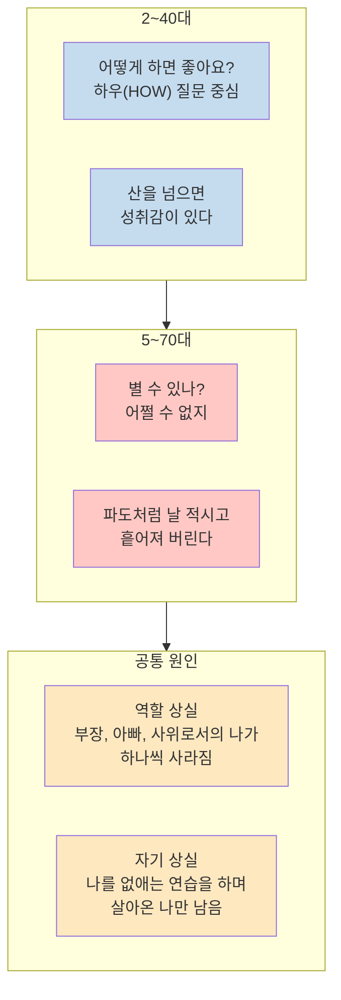
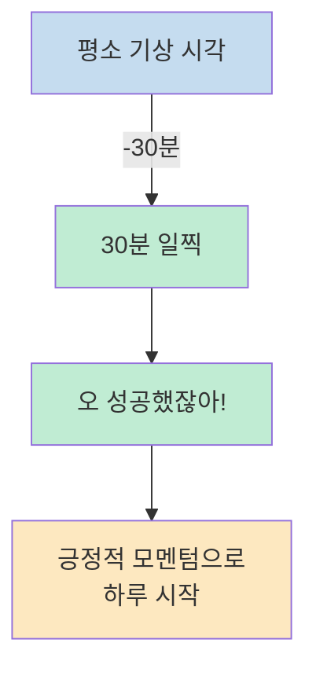
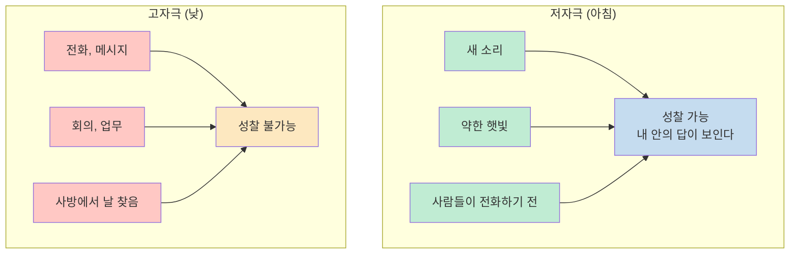
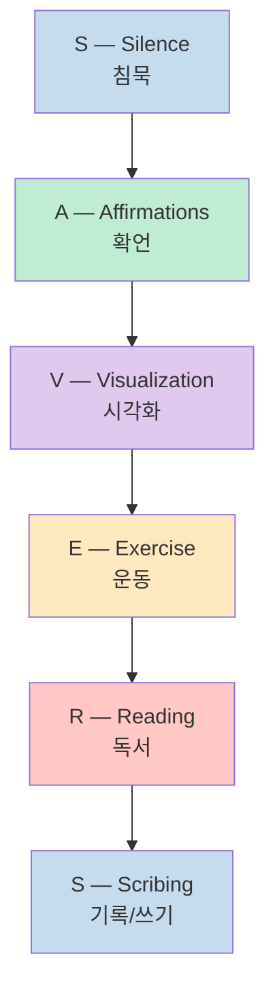
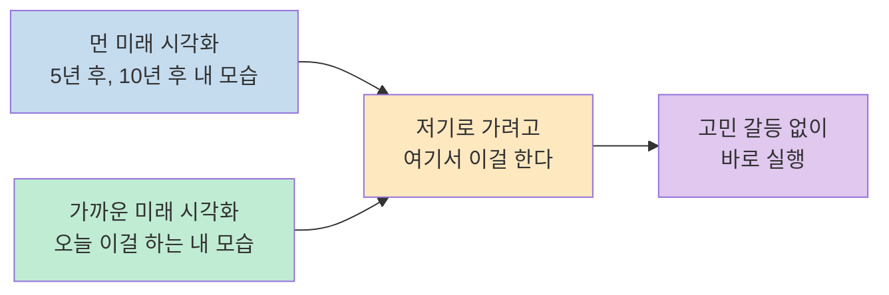
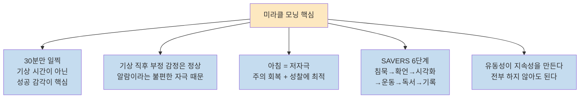

"내일부터 새벽 6시에 일어나야지"라고 결심하고 3일 만에 포기하는 사람들이 많다. 미라클 모닝을 오히려 **정신 건강의 적**이라고 여겼던 심리 상담사가 책을 읽고 나서 생각을 바꿨다. 12년간 4만여 명을 상담한 장재열 원장(월간 마음 건강 편집장)이 『미라클 모닝 애프터 50』을 통해 발견한 아침 루틴의 핵심을 책과삶 채널에서 풀어냈다.

<!--more-->

## Sources

- https://youtu.be/yrGxiMJMV88?si=Jv1eegfDEKup1KZz

## 50대 이후의 심리학: 통제감과 역할의 상실

장재열 원장이 50대 이상과 워크숍을 하며 반복적으로 발견한 패턴이 있다. 2-3-40대 상담 때는 "어떻게 하면 좋아요?"라는 **하우(how) 질문**이 많다. 그런데 5-6-70대로 갈수록 "별 수 있나?", "어쩔 수 없지"로 바뀐다. 삶에 대한 통제력을 상실했다는 감각이 깔려 있다. [(참고: 약 3:00)](https://youtu.be/yrGxiMJMV88?t=180)

30년 직장 생활을 마치고 퇴직하면 갑자기 24시간을 스스로 통제해야 한다. 그런데 24시간 자기 통제를 해본 경험이 없다. 이것이 **자기 통제감의 상실**이다. 단순히 일이 없어서 심심한 것이 아니라, "제일 가까운 나, 소중한 나지만 제일 죽이면서 살았던 나랑 갑자기 만났는데 얘랑 어떻게 살아야 되지를 잃어버린 감각"이다.

## 미라클 모닝에 대한 심리 상담사의 반전

장재열 원장은 원래 미라클 모닝을 **싫어했다.** 상담하는 사람들의 특징은 개인의 개별성을 존중하는 것인데, "에브리바디가 다 아침에 열심히 살아라"는 일방향적 메시지가 폭력적으로 들렸기 때문이다. [(참고: 약 8:00)](https://youtu.be/yrGxiMJMV88?t=480)

실제로 새벽형 인간이 되겠다고 결심한 뒤 3일 만에 못 일어나면 **자책이 두 배**가 되는 케이스를 너무 많이 봤다. "다 6시에 일어나서 냉수 마찰을 해라"는 식의 일방향적 자기 개발이 오히려 정신 건강에 역효과를 남긴다.

마음을 바꾼 포인트는 **유동성**이었다. 『미라클 모닝 애프터 50』은 "원래 자기가 깨던 시간에서 30분만 당겨라"고 말한다. 장재열 원장은 9시에 눈을 뜨는 사람이다. 그에게는 **8시 30분이 대단히 큰 성공**이다. 직장인의 6시와 비교할 필요가 없다.

## 핵심 원칙 1: 30분과 "성공했잖아" 감각

개그맨 문상훈의 말을 인용한다: "하루를 잘 사는 법은 내 뇌를 속이는 거다. 아침에 작은 것 하나를 해놓고 '오늘 아침 성공했어'라고 생각하고 시작하면 뒤쪽이 계속 성공적으로 느껴진다." [(참고: 약 16:00)](https://youtu.be/yrGxiMJMV88?t=960)

8시 30분에 눈을 뜨고, 물 한 잔 마시고, 양치하고, 영양제 먹는다. "순서대로 잘되고 있어. 순조로워"라는 마음으로 하루를 시작한다. **10분을 당겨도 되고 5분을 당겨도 된다.** 시간 자체가 아니라 "성공했잖아"라는 감각이 핵심이다.

## 핵심 원칙 2: 기상 직후 부정 감정은 정상이다

뇌과학적으로 기상 직후에 "너무 행복하다"고 느끼는 사람은 극소수다. [(참고: 약 17:00)](https://youtu.be/yrGxiMJMV88?t=1020)

숙면은 편안한 상태다. 그런데 대부분의 사람이 **알람이라는 불편한 청각 자극**으로 강제로 일으켜 세워진다. 그 즉각적인 순간에 짜증이 나는 것은 정상이다. 문제는 그 감정을 반전시키지 않으면 "죽겠다"라는 감정 그대로 하루를 가게 된다는 것이다.

뇌는 네거티브하게도 작동한다. "아 죽겠다"로 일어났는데 버스가 눈앞에서 지나가고, 엘리베이터가 눈앞에서 올라가면, 한두 번만 더 불행한 일이 생겨도 "오늘 정말 거지 같다"로 쭉 간다. 이것이 **머피의 법칙의 정체**다.

## 핵심 원칙 3: 주의 회복 이론과 아침의 힘

책에서 인용하는 **주의 회복 이론(Attention Restoration Theory)** 에 따르면 사람은 무자극(0자극)이나 고자극 상태에서는 인지적 주의가 회복되거나 성찰할 수 없다. **저자극** 상태가 필요하다. [(참고: 약 18:00)](https://youtu.be/yrGxiMJMV88?t=1080)

아침은 기본적으로 저자극 상태다. 입을 다물고 있는 것만으로도 성찰이 일어난다. "선생님은 답을 알고 계신데 현안에 가려져 있을 뿐이다. 그 커플을 벗기기에 가장 좋은 시간대가 아침이다."

## SAVERS: 아침 루틴 6단계

미라클 모닝의 핵심 프레임인 **SAVERS** 6단계다. 전부 하지 않아도 되고, 어떤 건 길게 어떤 건 짧게 해도 된다. 유동성이 지속성을 만든다. [(참고: 약 22:00~)](https://youtu.be/yrGxiMJMV88?t=1320)

### S — Silence (침묵)

물 한 모금을 마시는 것으로 시작해 명상이나 기도를 한다. 방법은 본인에게 맞게 선택한다. 가장 간단하면서 효과적인 방법은 **가슴과 배에 손을 대고 호흡하는 것**이다. 생각에 집중하기는 어렵지만, 배가 올라오고 가슴이 뛰는 움직임에 집중하면 이후 활동에 도움이 된다.

**타인을 위한 1분 기도**도 좋은 침묵 활용법이다. 힘든 지인 명단을 적어 두고 "누구누구 건강해졌으면 좋겠다"고 1분간 생각하면 딱 1분이 된다. 이 짧은 시간이 나를 살란한 마음에서 꺼내준다.

### A — Affirmations (확언)

기존 자기 개발의 확언 — "나는 아름다워질 거야", "출연료가 두 배가 될 거야" — 에 장재열 원장은 회의적이었다. 실제로 그런 확언을 2-3년 지속하다가 더 힘든 상황으로 찾아오는 사람들을 많이 봤기 때문이다. [(참고: 약 28:00)](https://youtu.be/yrGxiMJMV88?t=1680)

이 책이 제시하는 확언의 핵심은 **근거 만들기**다. "나는 사랑받고 싶어 → 나는 사랑받을 수 있는 사람이야 → 왜? 오늘 이걸 할 거니까." 택도 없는 것을 "될 거야"라고 외치는 게 아니라, 가장 에너지를 집중하고 싶은 분야를 찾고, 그것을 위해 오늘 뭘 할지로 좁혀주는 것이다.

### V — Visualization (시각화)

시각화에서 중요한 포인트는 **먼 미래 하나 + 가까운 미래(오늘) 하나**를 함께 상상하는 것이다. [(참고: 약 30:00)](https://youtu.be/yrGxiMJMV88?t=1800)

먼 미래만 상상하면 "멋진 미래인데 대단히 멀다"가 된다. 가까운 미래만 상상하면 "이게 언제 멋진 미래로 연결될지 모르겠다"가 된다. 둘을 연결하면 "저기로 가려고 여기서 이걸 한다"가 명료해지고, 고민 없이 실행하게 된다.

### E — Exercise (운동)

50대 이후에는 스트레칭이 가장 많이 권장된다. 운동의 역할은 단순히 체력 유지가 아니다. **인지적 활성화**다. [(참고: 약 32:00)](https://youtu.be/yrGxiMJMV88?t=1920)

1번(침묵), 2번(확언), 3번(시각화)은 약간 반수한 상태에서 진행된다. 4번 운동이 끝나고 나면 정신이 말짱해진다. 그 다음 독서와 기록을 **또렷한 상태**에서 할 수 있다.

시각화에서 "오늘 이걸 해야겠다"고 당겨온 것을 몸이 활성화된 상태에서 바로 실행으로 연결할 수 있다.

### R — Reading (독서)

목표치를 최소화하는 것이 핵심이다. "완독해야지"가 아니라 **한 페이지**면 성공이다. [(참고: 약 33:00)](https://youtu.be/yrGxiMJMV88?t=1980)

장재열 원장의 방법: 아무 데나 펼쳐서 그 한 페이지만 읽고 덮는다. 느려도 어쨌든 완독하는 책이 늘어난다. "오늘 완독해야지"에서 "아 못 하겠다"로 포기하면 그 책은 다시 안 열린다. 엘리베이터 기다릴 때 30초 한 쪽, 회의 전 5분 기다릴 때 세 쪽. 이런 식으로 쌓이는 분량이 꽤 된다.

### S — Scribing (기록/쓰기)

가장 중요한 마지막 단계다. 앞의 모든 과정이 기록을 통해 꽃을 피운다. [(참고: 약 35:00)](https://youtu.be/yrGxiMJMV88?t=2100)

방법: **3분 알람**을 맞추고, 울릴 때까지 아무 생각 없이 쓴다. 몇 분 됐는지도 확인하지 않는다.

어떤 날은 미운 사람 얘기가 나온다. 꺼내놓으면 남지 않는다. 어떤 날은 "여행 가고 싶어"가 나온다. "바쁜데 왜 이러지? 지쳤나?" — 자기 탐색이 일어나는 것이다.

쓰기는 읽기보다 효과성의 범위가 넓다. 읽기가 지식과 통찰을 주는 반면, 쓰기는 **정리 + 꺼내기 + 자기 탐색**을 동시에 한다.

## 87세 할아버지의 교훈

영상에서 가장 인상적인 에피소드다. [(참고: 약 20:00)](https://youtu.be/yrGxiMJMV88?t=1200)

장재열 원장이 87세 할아버지를 인터뷰했다. 가장 후회되는 나이가 **65세**라고 했다. 그때 은퇴를 하면서 "얼마 뒤에 죽겠구나"라고 생각하고 그때부터 웰다잉만 찾았다는 것이다. 그런데 22년을 더 사셨다.

> "생각해 봐라. 내가 65살에 22년이면 33살인데, 그 세월 동안 내가 회사 하나를 차렸으면 한 개 더 했겠어."

50대를 "인생의 30km~35km 지점"에 비유하면 — 이제 달리기 힘들고 그만 달리고 싶은 시간대다. 이 책은 그 나이에 **100m를 산책하듯 걷는 법**을 가르쳐 주는 책이라고 할 수 있다.

## 자기 돌봄 = 자기 돌아봄

마지막 메시지다. "자기 돌봄(self-care)"에 대한 재정의다. [(참고: 약 38:00)](https://youtu.be/yrGxiMJMV88?t=2280)

자기를 **돌아본다**는 것은 지나간 세월을 반추하는 것이 아니다. 나를 굽어보고 살펴보면서 앞으로 나갈 방향을 잡아나가는 것이다.

> "혼자 있다고 생각하지 마세요. 내가 나를 데리고 있다고 생각하셔야 됩니다."

자녀 밥 차려줄 때 그 세팅 그대로 나를 밥 차려 먹이고, 자녀 옷 사줄 가격대의 옷을 내게 입히는 것. 그 모든 관점 안에서 돈도 부담도 되지 않으면서 나를 내 자식 이상으로 잘 돌보는 것이 아침 시간이라는 것이다.

## 핵심 요약

- **30분 원칙**: "다 6시에 일어나라"가 아니라 평소 기상 시각에서 30분만 당겨라. 8시 30분이 9시보다 성공이다.
- **뇌과학**: 기상 직후 부정 감정은 정상. 작은 "성공했잖아" 감각으로 반전시키는 것이 핵심.
- **주의 회복 이론**: 아침의 저자극 상태가 성찰에 최적. 입을 다물고 있는 것만으로도 성찰이 일어난다.
- **SAVERS**: 침묵(호흡·기도) → 확언(근거 만들기) → 시각화(먼+가까운 미래) → 운동(정신 활성화) → 독서(한 페이지) → 기록(3분 아무거나).
- **유동성**: 6단계를 전부 하지 않아도 된다. 짧게 해도 된다. 유동성이 지속성을 만든다.
- **자기 돌봄**: 관절 백세가 아니라 내가 아직 발견하지 못한 가능성들을 돌아보는 시간.

## 결론

"아침에 일찍 일어나야 성공한다"는 공식이 오히려 많은 사람의 자책을 키워왔다. 장재열 원장의 메시지는 다르다. 기상 시간이 중요한 게 아니라, 아침을 어떤 감각으로 시작하느냐가 중요하다. 5분이라도 일찍 일어나서 "오 성공했잖아"라고 느끼는 것. 그 작은 반전이 뇌를 긍정적 모멘텀으로 전환시킨다. 87세 할아버지처럼 65세에 "이제 여생이구나"라고 멈추지 않으려면, 오늘 아침 그 5분을 당겨보는 것부터 시작이다.
