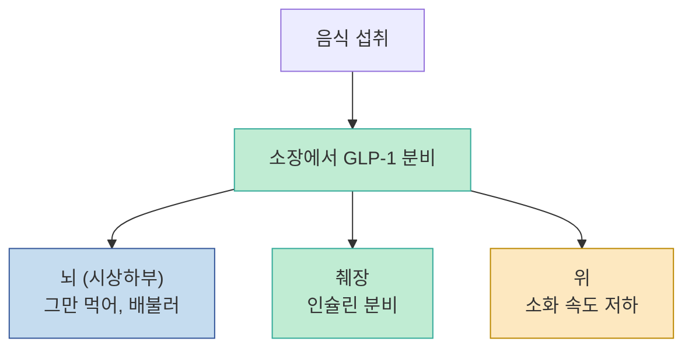
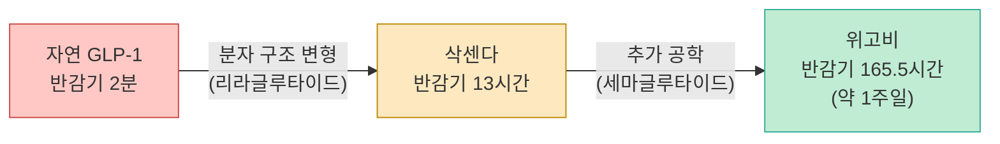
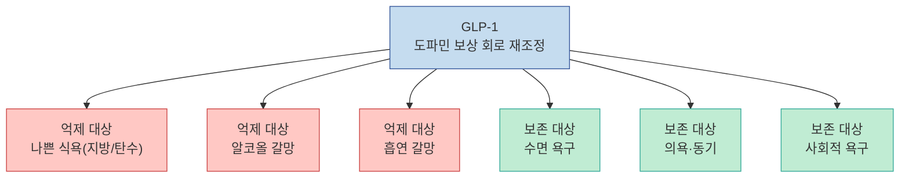
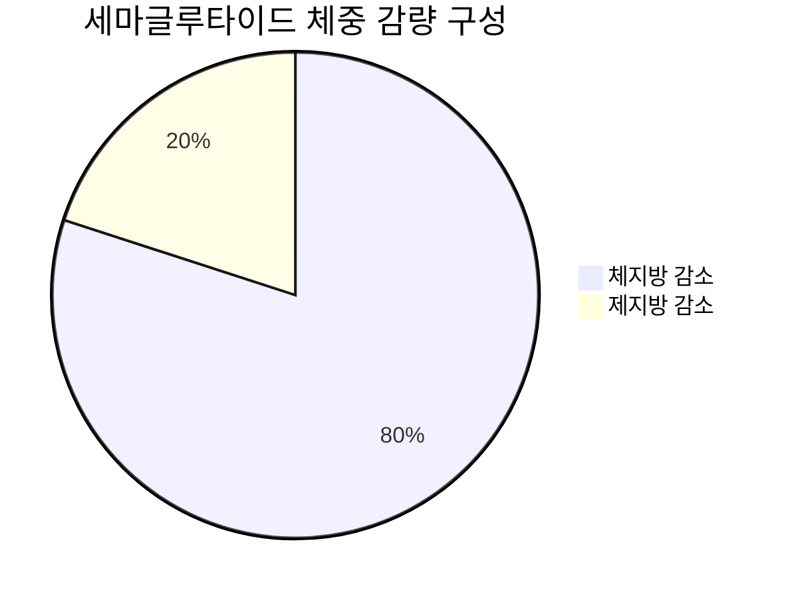
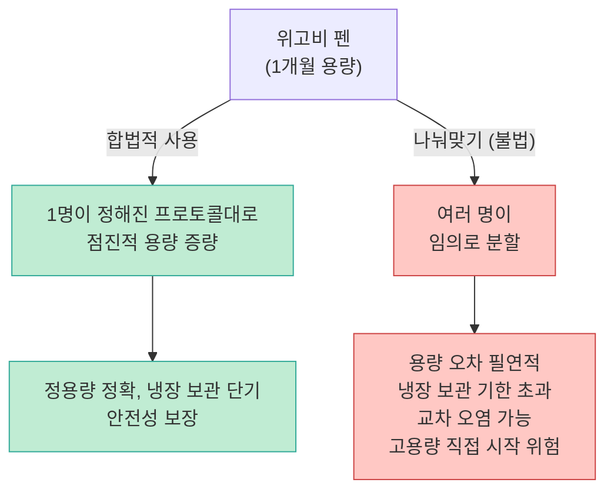
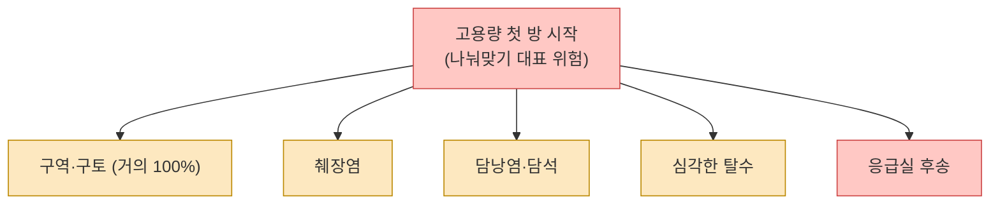
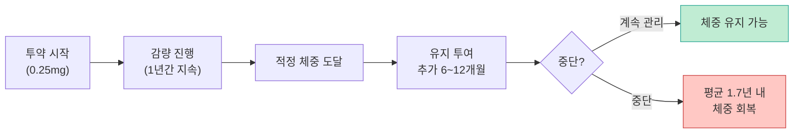
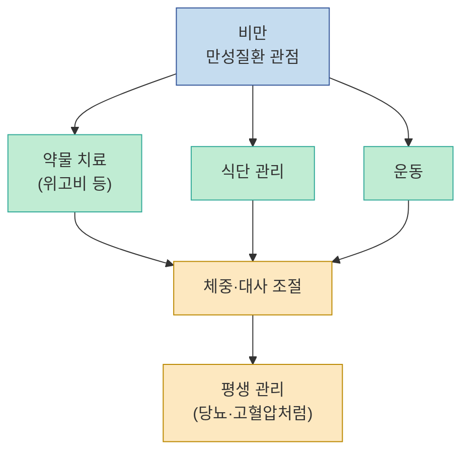

비만 치료제로 알려진 위고비(세마글루타이드)가 최근 다양한 의학 연구에서 예상치 못한 영역에서도 주목받고 있습니다. 알코올 갈망 감소, 흡연 빈도 감소, 내장지방 선택적 소실, 심혈관 보호, 심지어 생체 나이 역행까지 — 이 주사 하나가 어떻게 이런 다양한 효과를 내는 것인지, 그리고 최근 유행하는 '나눠맞기(나노바퀴)'가 왜 위험한지를 의사(네카스닥터)의 시각에서 정리합니다.

<!--more-->

## Sources

- [위고비 신기한 효과들 & 나눠맞기 위험성 — 네카스닥터](https://youtu.be/4wzTIf0AlSk)

---

## GLP-1이란 무엇인가 — 세마글루타이드의 원리

[영상 47초](https://youtu.be/4wzTIf0AlSk?t=47)에서 의사는 기초부터 짚어 줍니다. **GLP-1(글루카곤 유사 펩타이드-1)** 은 음식을 먹을 때 소장에서 자연 분비되는 호르몬입니다. 크게 세 가지 역할을 합니다.

1. **뇌(시상하부)**: "그만 먹어, 배불러" 신호
2. **췌장**: 인슐린 분비 촉진
3. **위**: 소화 속도를 늦춤 → 포만감 연장



기존 당뇨약이나 비만약과 결정적으로 다른 점은 **선택성**입니다. 다른 약들은 24시간 지속 작용하여 식사 여부와 무관하게 인슐린이 나오거나 식욕이 억제됩니다. GLP-1은 밥을 뜰 때만 활성화되고, 평소에는 거의 작동하지 않습니다. [(91초)](https://youtu.be/4wzTIf0AlSk?t=91)

---

## 반감기 문제와 노보노디스크의 공학적 해결

자연 GLP-1은 실용화에 큰 장벽이 있었습니다. 체내 **반감기가 겨우 2분**이었기 때문입니다. [(103초)](https://youtu.be/4wzTIf0AlSk?t=103) 2분마다 주사를 맞을 수는 없으니 약으로 만들기 어려웠습니다.



노보노디스크는 두 단계 공학으로 이 문제를 해결했습니다.

| 약물 | 성분 | 반감기 | 투여 주기 |
|---|---|---|---|
| 삭센다 | 리라글루타이드 | 13시간 | 매일 |
| **위고비** | **세마글루타이드** | **165.5시간 (~1주일)** | **주 1회** |

반감기가 일주일로 늘어나자 체중 감량 효과도 대폭 올라갔습니다. 삭센다는 평균 6.4~8% 감량이지만, 위고비는 평균 **17%**, 그 중 1/3은 **20% 이상** 감량합니다. [(148초)](https://youtu.be/4wzTIf0AlSk?t=148) 이것이 노보노디스크를 유럽 시총 1위로 이끈 배경입니다.

---

## 도파민 보상 회로 수정 — '나쁜 욕망'만 선택적으로 억제

위고비가 단순한 식욕 억제제와 다른 핵심 포인트가 여기에 있습니다. [(167초)](https://youtu.be/4wzTIf0AlSk?t=167)

GLP-1이 뇌의 **시상하부 궁상핵(arcuate nucleus)** 에 작용할 때, 단순히 "먹지 마" 신호를 내는 게 아니라 **도파민 보상 회로 전체를 재조정**합니다. 기존 비만약·금연약은 뇌를 전반적으로 억제해서 당사자가 시들시들해지는 부작용이 있었습니다. 반면 GLP-1은 다음을 선택적으로 억제합니다.

- 나쁜 식욕 (지방·탄수화물 중심)
- 술에 대한 갈망
- 담배에 대한 갈망
- 쇼핑 등 중독적 충동

반면 수면 욕구, 의욕, 사회적 동기 같은 **생존에 필요한 욕망은 보존**됩니다.



영상에서 의사가 "저는 천생 무식욕자 같다"며 웃는 장면은 이 선택적 억제를 체험적으로 설명하는 것입니다. [(249초)](https://youtu.be/4wzTIf0AlSk?t=249)

---

## 알코올 중독 임상 연구 — AUD 18명

[212초](https://youtu.be/4wzTIf0AlSk?t=212)에서 소개된 연구는 매우 구체적입니다. **알코올 사용 장애(AUD)** 환자 18명을 대상으로 저용량 세마글루타이드 프로토콜(0.25mg 1개월 → 0.5mg 1개월 → 1.0mg 1주)을 투여했더니:

- 주간 알코올 **갈망 횟수 유의미하게 감소**
- **헤비 드링킹 데이즈(과음 일수) 감소**
- 한 번에 마시는 **음주량 감소**
- 위약 대비 **하루 평균 흡연 개비수도 감소** [(242초)](https://youtu.be/4wzTIf0AlSk?t=242)

이 연구는 위고비가 비만 치료 허가만 받은 약이지만, GLP-1의 뇌 작용이 광범위한 중독 행동에 영향을 준다는 증거입니다. (술·담배를 끊기 위해 맞는 약은 아니지만, 흥미로운 임상 결과로 이해하면 됩니다.)

---

## 체중 감량 구성 — 지방 80%, 제지방 20%

단순히 살이 빠지는 것이 아니라, **무엇이 빠지느냐**가 중요합니다. [(328초)](https://youtu.be/4wzTIf0AlSk?t=328)

일반적으로 다이어트를 하면 지방뿐 아니라 수분·근육(제지방)도 같이 빠집니다. 그러나 세마글루타이드 투여 시 빠진 체중의 구성은 다릅니다.



또한 제지방의 20%도 대부분 **근육 내 근지방(마블링)** 위주로 빠져, 실질 근육 질은 오히려 개선되는 경향이 있습니다. [(373초)](https://youtu.be/4wzTIf0AlSk?t=373)

이 선택성의 기전은 네 가지로 설명됩니다.

1. **인슐린 촉진** → 근육 합성 지원
2. **지방·탄수화물 식욕 선택적 억제** (단백질 식욕은 상대적으로 보존)
3. **위 배출 지연** → 포만감 지속 → 과식 방지
4. **내장지방 우선 분해** (정확한 기전 연구 중)

### 내장지방 40% 감소

아시아 환자 대상 연구에서 체중은 평균 17% 감량됐지만, **복부 내장지방은 40% 감소**했습니다. [(388초)](https://youtu.be/4wzTIf0AlSk?t=388) 내장지방을 직접 녹이는 별도 기전이 있는 건 아니고, 식욕 억제 → 총 열량 감소 → 내장지방이 피하지방보다 더 빨리 동원되는 대사 특성이 작용한 결과입니다.

---

## 악력 증가 연구 — 근육 감소 없이 살 빠지기

[450초](https://youtu.be/4wzTIf0AlSk?t=450)에서 소개되는 연구는 비만 치료제 분야에서 매우 이례적입니다.

- 대상: 초고도 비만(Grade 3) + 비만 관련 동반 질환 성인 106명
- 투여: 세마글루타이드 2.4mg 주 1회, **12개월** 추적
- 결과: 체중 감소에도 불구하고 **악력이 4.5kg 증가**

논문 저자들은 "체중 부담·관절 부담 감소로 신체 활동이 개선되어 악력이 늘었다"고 설명하지만, 영상 의사는 운동 병행 효과도 포함됐을 것으로 봅니다. 핵심은 살이 빠지면서 근력이 함께 줄어드는 일반적 패턴을 세마글루타이드가 깨뜨렸다는 점입니다.

---

## 심혈관 보호 효과 — 스타틴 수준의 20% 감소

[505초](https://youtu.be/4wzTIf0AlSk?t=505)에서 의사가 제시하는 비교는 직관적입니다.

| 약물 | 목적 | 심혈관 사건 감소율 |
|---|---|---|
| 스타틴 (고지혈증 치료제) | 심혈관 예방 특화 설계 | 20~25% |
| **세마글루타이드 (위고비)** | **비만 치료제** | **약 20%** |

심혈관 질환 예방을 위해 특별히 설계된 약과 동등한 수준의 심혈관 보호 효과를 비만 치료 부산물로 얻는다는 것이 의사의 설명입니다.

---

## 항노화 연구 — 생체 시계 역행

[532초](https://youtu.be/4wzTIf0AlSk?t=532)에서 소개된 연구는 이 영상에서 가장 충격적인 내용입니다.

- 대상: **HIV 관련 지방이상증** 환자 108명 (이중맹검, 무작위 배정)
- 투여: 세마글루타이드 vs. 위약, **8개월** 추적
- 결과:

```mermaid
bar
    title 세마글루타이드 투여 후 생체 나이 변화 (8개월)
    x-axis ["생체 시계 1", "생체 시계 2", "생체 시계 3", "생체 시계 4"]
    y-axis "나이 감소 (년)" 0 --> 6
    bar [4.9, 2.2, 3.1, 2.3]
```

측정 가능한 **모든 노화 생체 시계에서 2.2~4.9년** 나이가 줄었고, 노화 **속도도 9% 감소**했습니다. [(597초)](https://youtu.be/4wzTIf0AlSk?t=597)

기전으로 논문이 제시하는 것은 **비만 유발 기억(obesity memory) 소거**입니다. 지방세포는 과거에 쪄 있었던 지방량을 '기억'하고 요요 시 그 상태로 돌아가려 합니다. 세마글루타이드가 이 기억을 끄는 것 같다는 가설이 제시됐으나, 아직 확립된 기전은 아닙니다.

---

## 나눠맞기(나노바퀴) — 왜 절대 안 되는가

[647초](https://youtu.be/4wzTIf0AlSk?t=647)부터 의사는 심각한 경고를 합니다.

위고비의 인기와 비대면 처방 남용으로 "나눠맞기(나노바퀴)"라는 불법 관행이 유행하고 있습니다. 정해진 1개월치 고용량 펜을 10분의 1씩 쪼개어 여러 명이 나눠 맞는 방식입니다.



위험 이유를 하나씩 살펴보면:

**1. 정용량 측정 자체가 불가능**
위고비 펜은 1/10로 나눠 쓰도록 설계되지 않았습니다. 클릭 수로 정밀하게 10분의 1을 맞추는 것이 구조적으로 어렵습니다. [(762초)](https://youtu.be/4wzTIf0AlSk?t=762)

**2. 유통기한 초과 필연적**
펜은 주 1회 사용 기준 4주(1개월)치입니다. 10명이 나눠 맞으면 10개월치가 되고, 2명이 나눠도 5개월이 됩니다. 세마글루타이드는 단백질 약물이므로 **개봉 후 6주를 넘기면 단백질 변성** 위험이 있습니다. [(773초)](https://youtu.be/4wzTIf0AlSk?t=773)

**3. 교차 오염(주사 감염)**
아무리 바늘을 교체해도, **타인의 혈액·체액이 펜 내부로 역류할 수 있는 경로**를 완전히 차단하는 것은 불가능합니다. 이는 감염 질환 전파의 경로가 될 수 있습니다. [(814초)](https://youtu.be/4wzTIf0AlSk?t=814)

**4. 고용량 직접 시작의 심각한 부작용**
위고비는 0.25mg → 0.5mg → 1.0mg → 1.7mg → 2.4mg 순으로 4주 간격(타이틀레이션)으로 점진적으로 올리도록 설계됐습니다. [(693초)](https://youtu.be/4wzTIf0AlSk?t=693) 처음부터 고용량(2.4mg)을 맞으면 **100%** 구역·구토가 생기며, 더 심한 경우 췌장염, 담낭·담석 문제, 심각한 탈수, 응급실 후송으로 이어질 수 있습니다.



---

## 올바른 투약 프로토콜

[858초](https://youtu.be/4wzTIf0AlSk?t=858)에서 의사가 강조하는 올바른 방법은 명확합니다.

- **전문의 처방** 필수 (전문의약품, 비대면 처방 금지)
- **타이틀레이션(점진적 용량 증량) 프로토콜** 준수
- **냉장 보관** 기한 엄수 (개봉 후 6주 이내 사용)
- 본인 전용 펜, 타인과 절대 공유 금지

```mermaid
gantt
    title 위고비 타이틀레이션 프로토콜 (5단계)
    dateFormat X
    axisFormat %s월차

    section 용량 증량
    0.25mg (1개월차) :a1, 0, 4
    0.5mg  (2개월차) :a2, 4, 4
    1.0mg  (3개월차) :a3, 8, 4
    1.7mg  (4개월차) :a4, 12, 4
    2.4mg  (유지 용량) :a5, 16, 8
```



---

## 투약 기간과 요요 — 비만의 만성질환 관점

[923초](https://youtu.be/4wzTIf0AlSk?t=923)에서 의사는 핵심 구조적 한계를 짚습니다.

- 세마글루타이드는 일반 비만약보다 감량 지속 기간이 길어 **약 1년까지 천천히 지속 감량**
- 그러나 **주사를 끊으면 평균 1.7년 내에 원래 체중으로 돌아옴**
- 이론적으로는 적정 체중 도달 후 **6개월~1년 추가 투여**가 공식 권고 기간



이 때문에 FDA는 최근 **먹는 위고비(경구용 세마글루타이드)** 를 승인해 미국에서 처방 중입니다. [(1000초)](https://youtu.be/4wzTIf0AlSk?t=1000) 장기 투여 부담을 낮추는 하나의 선택지가 될 수 있습니다.

---

## 비만 치료의 근본 철학 — 만성질환 관점

[1012초](https://youtu.be/4wzTIf0AlSk?t=1012)에서 의사는 가장 본질적인 메시지를 전합니다.

비만은 수술처럼 한 번 해결되는 질병이 아니라, 고혈압·당뇨처럼 **평생 관리해야 하는 만성질환**입니다. 세마글루타이드라는 훌륭한 도구가 생겼어도, 식단과 운동은 여전히 필수입니다. 의사 본인이 "무식욕자"임에도 매일 식단 관리·운동을 하는 이유가 여기에 있습니다.



> "살 뺀다는 행위(Do)로 접근하지 말고, 살이 찌지 않는 사람(Be)으로 접근하자."

---

## 핵심 요약

| 주제 | 핵심 내용 | 타임스탬프 |
|---|---|---|
| GLP-1 원리 | 식사 시에만 선택적으로 작동, 뇌·췌장·위 동시 조절 | [47초](https://youtu.be/4wzTIf0AlSk?t=47) |
| 반감기 혁신 | 2분 → 165.5시간, 주 1회 투여 가능 | [106초](https://youtu.be/4wzTIf0AlSk?t=106) |
| 체중 감량 | 평균 17%, 1/3은 20% 이상 | [148초](https://youtu.be/4wzTIf0AlSk?t=148) |
| 도파민 회로 | 나쁜 욕망만 선택적 억제, 알코올·흡연 갈망 감소 | [167초](https://youtu.be/4wzTIf0AlSk?t=167) |
| 지방 선택 감량 | 빠진 체중의 80%가 지방, 내장지방 40% 감소 | [328초](https://youtu.be/4wzTIf0AlSk?t=328) |
| 심혈관 | 심혈관 사건 약 20% 감소 (스타틴 수준) | [505초](https://youtu.be/4wzTIf0AlSk?t=505) |
| 항노화 | 생체 나이 2.2~4.9년 감소, 노화 속도 9% 감소 | [532초](https://youtu.be/4wzTIf0AlSk?t=532) |
| 나눠맞기 위험 | 용량 오차·단백질 변성·교차 오염·심각한 부작용 | [647초](https://youtu.be/4wzTIf0AlSk?t=647) |
| 올바른 사용 | 전문의 처방, 타이틀레이션 프로토콜 필수 | [858초](https://youtu.be/4wzTIf0AlSk?t=858) |
| 만성질환 관점 | 끊으면 돌아옴, 식단·운동과 병행 필수 | [1012초](https://youtu.be/4wzTIf0AlSk?t=1012) |

---

## 결론

위고비(세마글루타이드)는 단순한 비만 주사를 넘어, 뇌의 보상 회로를 재조정하여 알코올·흡연 갈망까지 억제하고, 내장지방을 선택적으로 줄이며, 심혈관 위험과 생체 나이까지 낮추는 광범위한 효과가 임상 연구에서 확인되고 있습니다. 그러나 이 약은 전문의 처방과 점진적 용량 증량(타이틀레이션) 없이는 심각한 부작용으로 이어질 수 있고, 나눠맞기는 법적으로도 의학적으로도 절대 해선 안 됩니다. 무엇보다 비만은 주사 한 방으로 끝나는 문제가 아니라, 고혈압·당뇨처럼 식단·운동과 함께 평생 관리해야 하는 만성질환임을 기억해야 합니다.
