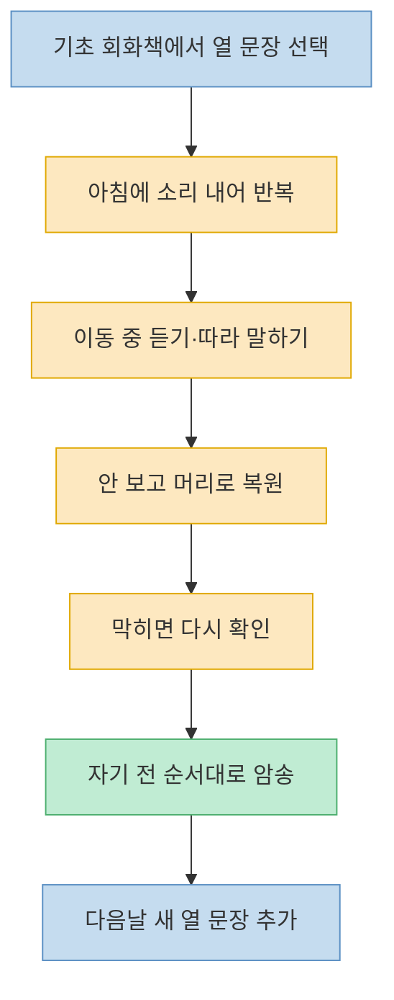
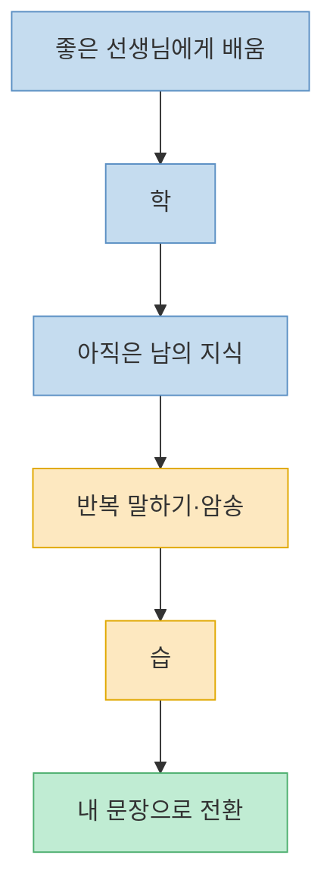
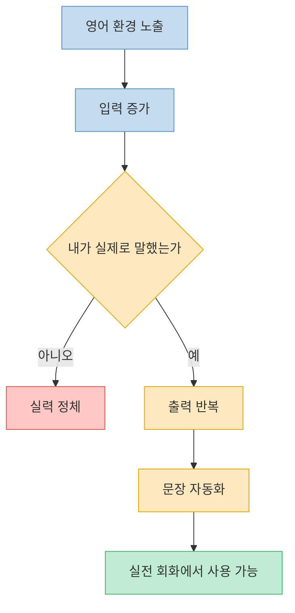
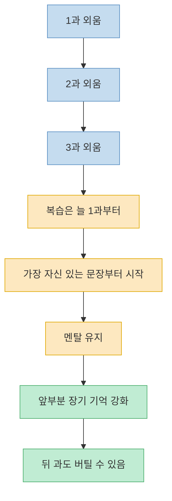
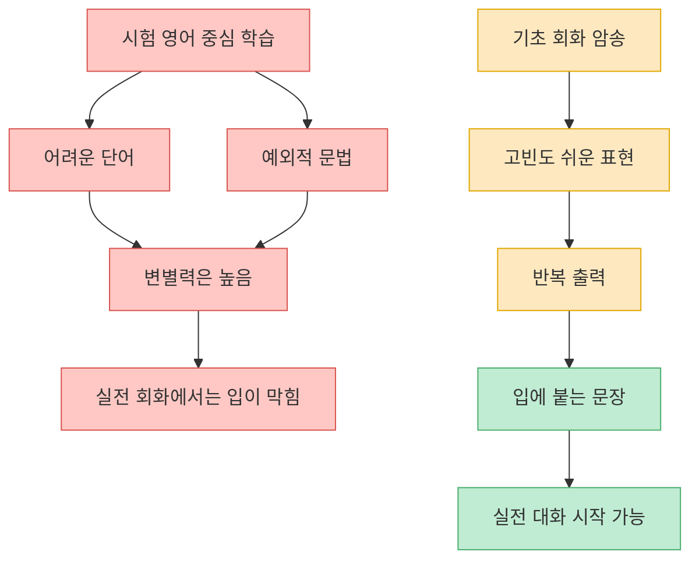
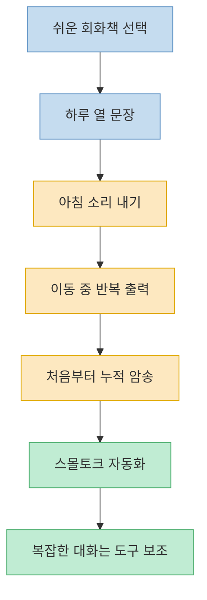

이 영상의 제목은 자극적이지만, 실제 메시지는 단순한 암기 예찬이 아닙니다. 김민식 PD는 `영어책 한 권 외워봤니?`라는 말을 `어려운 영어책을 통째로 암기하라`는 뜻이 아니라, **쉬운 회화 패턴을 반복해서 입에 붙이는 방식으로 내 문장을 만들어 보라**는 뜻으로 풀어냅니다. 그래서 이 대화의 핵심은 `얼마나 많이 입력하느냐`가 아니라 `얼마나 적은 양을 반복 출력하느냐`로 이동합니다. [(2:23)](https://youtu.be/kEwjrl-BHdA?t=143), [(4:31)](https://youtu.be/kEwjrl-BHdA?t=271), [(12:11)](https://youtu.be/kEwjrl-BHdA?t=731)

이 영상이 재밌는 이유는 영어 학습법을 `좋은 선생님`, `원어민 환경`, `미국 체류`, `리스닝 많이 하기` 같은 상식과 정면으로 비교하기 때문입니다. 김민식 PD는 그런 것들이 아예 소용없다는 말이 아니라, 그것만으로는 내 문장이 생기지 않는다고 말합니다. 그리고 그 대안으로 `기초 회화 10문장`, `소리 내기`, `통근 중 반복`, `누적 암송`, `쉬운 문장부터 출력`이라는 아주 구체적인 루틴을 제시합니다. [(3:32)](https://youtu.be/kEwjrl-BHdA?t=212), [(5:00)](https://youtu.be/kEwjrl-BHdA?t=300), [(10:10)](https://youtu.be/kEwjrl-BHdA?t=610)

<!--more-->

## Sources

- [(1부) 성문영어의 저주. 이래서 망했다 | 북언더스탠딩 | 영어책 한 권 외워봤니? | 김민식 PD](https://www.youtube.com/watch?v=kEwjrl-BHdA) — 언더스탠딩 : 세상의 모든 지식

---

## "책 한 권 외워라"는 말의 진짜 뜻은 무엇인가

영상 초반에 진행자들이 가장 먼저 던지는 질문도 바로 이것입니다. `책 한 권을 외우라니, 그게 어떻게 쉬운 방법이냐`는 반응입니다. 김민식 PD도 이 오해를 바로 풀어 줍니다. 그가 말하는 `영어책 한 권`은 어려운 원서나 성문영어 같은 문법책이 아니라, 아주 간단한 기초 회화책의 짧은 예문과 대화문입니다. 즉 `책을 외운다`는 말은 실제로는 `하루에 열 문장 정도를 소리 내어 반복하고, 그 문장을 하루 종일 다시 꺼내 보는 훈련`에 가깝습니다. [(2:25)](https://youtu.be/kEwjrl-BHdA?t=145), [(4:45)](https://youtu.be/kEwjrl-BHdA?t=285), [(4:58)](https://youtu.be/kEwjrl-BHdA?t=298), [(6:26)](https://youtu.be/kEwjrl-BHdA?t=386)

그는 아침에 열 문장을 열 번 정도 읽고, 출근길이나 이동 중에는 그 문장을 듣거나 떠올리고, 사람이 많아 소리 내기 어려울 때는 머릿속으로 순서대로 복원해 보라고 설명합니다. 기억이 안 나는 문장이 나오면 다시 보고, 또 내려놓고 다시 떠올리는 식입니다. 여기서 핵심은 `계속 보면서 읽는 것`이 아니라, **안 보고 꺼내는 연습** 을 한다는 점입니다. 자기 전에는 책을 보지 않고 처음부터 끝까지 외워졌는지 확인한 뒤 마무리하라고도 말합니다. [(5:02)](https://youtu.be/kEwjrl-BHdA?t=302), [(5:17)](https://youtu.be/kEwjrl-BHdA?t=317), [(5:52)](https://youtu.be/kEwjrl-BHdA?t=352), [(6:43)](https://youtu.be/kEwjrl-BHdA?t=403)

그래서 이 방법은 사실 `한 권 통암기`라기보다 `짧은 회화 패턴의 생활화`에 더 가깝습니다. 하루치 분량은 작고, 대신 그 적은 양을 반복해서 입과 귀와 머리에 붙이는 구조입니다. 제목만 보면 무식한 암기법처럼 보이지만, 영상 안의 실제 설명은 꽤 세밀한 반복 루틴입니다. [(6:26)](https://youtu.be/kEwjrl-BHdA?t=386), [(6:58)](https://youtu.be/kEwjrl-BHdA?t=418), [(9:58)](https://youtu.be/kEwjrl-BHdA?t=598)

---

## 왜 그는 "배우는 것"보다 "익히는 것"이 중요하다고 말하나

김민식 PD가 중간에 가져오는 비유는 논어의 `학이시습지`입니다. 여기서 그의 해석은 분명합니다. 좋은 선생님에게 배우는 `학`은 스승의 지식을 전달받는 단계이고, 그걸 내 삶에서 써먹으며 몸에 붙이는 `습`이 있어야 비로소 내 것이 된다는 것입니다. 영어도 똑같아서, 원어민 선생님에게 한 시간 동안 설명을 들어도 그 순간 바로 내 문장이 되는 것은 아니고, 내가 직접 반복하고 말해 봐야 내 것이 된다고 주장합니다. [(3:32)](https://youtu.be/kEwjrl-BHdA?t=212), [(3:47)](https://youtu.be/kEwjrl-BHdA?t=227), [(4:09)](https://youtu.be/kEwjrl-BHdA?t=249)

그래서 영상은 `좋은 선생님을 만나는 것` 자체를 부정하지는 않지만, 거기서 멈추면 안 된다고 말합니다. 그의 표현을 빌리면, 선생님이 해 준 설명은 아직 선생님 것일 뿐입니다. 영어 실력은 설명을 많이 들은 양으로 만들어지는 것이 아니라, **내 입으로 여러 번 꺼내 봤는가** 에 따라 달라진다는 것입니다. 여기서 암송이 중요한 이유도 바로 이 `습`의 도구이기 때문입니다. [(3:56)](https://youtu.be/kEwjrl-BHdA?t=236), [(4:16)](https://youtu.be/kEwjrl-BHdA?t=256), [(4:31)](https://youtu.be/kEwjrl-BHdA?t=271)

이 설명은 단순 암기론이 아니라, 학습의 병목이 어디에 있는지 다시 보게 만듭니다. 대부분의 사람은 `더 좋은 설명`, `더 많은 자료`, `더 긴 수업`을 찾지만, 영상은 그보다 `내가 오늘 실제로 몇 문장을 내 입으로 말했다`가 더 중요하다고 밀어붙입니다. 그래서 배우는 양을 늘리기보다 익히는 루틴을 만드는 것이 우선이라는 결론으로 갑니다. [(4:31)](https://youtu.be/kEwjrl-BHdA?t=271), [(5:02)](https://youtu.be/kEwjrl-BHdA?t=302)

---

## 입력보다 출력이 중요하다는 말은 무엇을 뜻하나

영상에서 가장 자주 반복되는 문장은 이것입니다. `많은 양을 입력하는 게 아니라 적은 양을 반복해서 출력하는 것`이 영어를 잘하는 길이라는 주장입니다. 여기서 입력은 강의를 많이 듣고, 미국 뉴스와 유튜브를 오래 틀어 두고, 영어 환경에 오래 노출되는 행위를 뜻합니다. 반대로 출력은 내가 실제로 소리 내어 문장을 말하고, 기억나지 않는 문장을 다시 복원하고, 몸이 먼저 반응할 정도로 반복하는 것을 뜻합니다. [(12:07)](https://youtu.be/kEwjrl-BHdA?t=727), [(12:11)](https://youtu.be/kEwjrl-BHdA?t=731), [(12:14)](https://youtu.be/kEwjrl-BHdA?t=734)

이 주장이 더 설득력 있어지는 구간은 `미국 가면 영어 는다`는 착각을 비판할 때입니다. 김민식 PD는 해외 생활을 오래 하고도 영어에 대한 한이 남은 사람들을 자주 봤다고 말합니다. 이유는 간단합니다. 미국에 있어도 하루 종일 한인과만 만나고, 한국어로만 일하고, 실제로 내 입으로 영어를 꺼내는 훈련을 안 하면 영어는 잘 안 는다고 보기 때문입니다. 그래서 `미국에서 숨 쉬고 햄버거 먹는다고 영어가 는다면 그걸 수입해다 먹지`라는 농담까지 던집니다. [(12:31)](https://youtu.be/kEwjrl-BHdA?t=751), [(13:18)](https://youtu.be/kEwjrl-BHdA?t=798), [(14:10)](https://youtu.be/kEwjrl-BHdA?t=850), [(15:07)](https://youtu.be/kEwjrl-BHdA?t=907)

즉 이 영상이 말하는 핵심은 환경 자체가 아니라 행동입니다. 영어 환경에 둘러싸여 있다는 사실보다, 내가 오늘 외운 쉬운 문장을 여러 번 입 밖으로 꺼냈는지가 더 결정적이라는 것입니다. 그래서 회화책 암송은 단순 암기가 아니라 `출력 훈련의 장치`가 됩니다. 내가 쓰게 될 가능성이 높은 쉬운 문장 몇 개를 반복해서 말해 두면, 실제 상황에서 그것이 발사대 역할을 해 준다는 논리입니다. [(7:17)](https://youtu.be/kEwjrl-BHdA?t=437), [(11:02)](https://youtu.be/kEwjrl-BHdA?t=662), [(15:10)](https://youtu.be/kEwjrl-BHdA?t=910)

---

## 누적 암송은 왜 "최근 것부터"가 아니라 "처음부터"여야 하나

이 방식에서 인상적인 부분은 `누적 암송`입니다. 하루 열 문장을 외우고 다음 날 새 열 문장으로 넘어가더라도, 복습은 가장 최근 과가 아니라 **늘 1과부터 다시 시작하라**는 설명이 나옵니다. 이유는 심리적이면서도 실용적입니다. 가장 오래 반복한 첫 과가 가장 자신 있는 구간이기 때문에, 거기서부터 시작해야 멘탈이 버티고, 문장들이 꼬리를 물고 따라 나오기 시작한다는 것입니다. [(10:15)](https://youtu.be/kEwjrl-BHdA?t=615), [(10:46)](https://youtu.be/kEwjrl-BHdA?t=646), [(15:41)](https://youtu.be/kEwjrl-BHdA?t=941), [(15:50)](https://youtu.be/kEwjrl-BHdA?t=950)

이 방식은 망각을 막는 데도 의미가 있습니다. 사람들은 흔히 `뒤로 갈수록 앞을 잊지 않느냐`고 묻지만, 영상은 오히려 앞에서부터 누적하면 앞부분이 더 단단해진다고 설명합니다. 하루 동안 새로 외운 구간은 그날 오전엔 그 구간만 반복하고, 시간이 조금 날 때 누적 암송을 돌리는 식으로 역할을 나눕니다. 그리고 누적량이 많아지면 주말에 시간을 따로 내어 수행하듯 복습하면 된다고 말합니다. [(11:03)](https://youtu.be/kEwjrl-BHdA?t=663), [(16:28)](https://youtu.be/kEwjrl-BHdA?t=988), [(16:55)](https://youtu.be/kEwjrl-BHdA?t=1015)

이 부분은 결국 `매일 처음부터 다시`가 비효율처럼 보여도, 실제로는 기억의 기반을 다지는 방식이라는 뜻입니다. 첫 문장들이 입에 붙어 있어야 뒷문장도 버틸 수 있고, 가장 익숙한 문장부터 시작할 때 학습자가 무너지지 않는다는 설명입니다. 그래서 누적 암송은 단순 복습이 아니라, 학습을 포기하지 않게 만드는 구조이기도 합니다. [(10:46)](https://youtu.be/kEwjrl-BHdA?t=646), [(15:54)](https://youtu.be/kEwjrl-BHdA?t=954), [(16:08)](https://youtu.be/kEwjrl-BHdA?t=968)

---

## 왜 그는 "성문영어의 저주"를 말하나

영상 후반부의 가장 날카로운 대목은 바로 이것입니다. 한국 사람들이 영어에 학을 떼는 이유로 `성문 기본영어`, `성문 종합영어` 같은 시험 영어의 유산을 지목합니다. 김민식 PD의 논리는 단순합니다. 입시와 시험은 수험생을 변별해야 하므로 갈수록 더 어려운 단어와 예외적인 문법을 낼 수밖에 없습니다. 그러다 보니 우리는 `영어를 말하기 위해 필요한 쉬운 문장`이 아니라, `영어 시험에서 틀리게 만들기 좋은 어려운 요소`를 중심으로 오래 공부하게 됐다는 것입니다. [(20:44)](https://youtu.be/kEwjrl-BHdA?t=1244), [(24:43)](https://youtu.be/kEwjrl-BHdA?t=1483), [(25:12)](https://youtu.be/kEwjrl-BHdA?t=1512), [(25:33)](https://youtu.be/kEwjrl-BHdA?t=1533)

그 결과 회화 상황에 들어가면 문제가 생깁니다. 사람들은 쉬운 문장을 자연스럽게 꺼내는 대신, 어려운 단어를 떠올리고 문법을 조합하려 합니다. 영상은 바로 이 지점 때문에 입이 안 떨어진다고 설명합니다. 시험 영어는 점수를 올릴 수는 있어도, 말문을 트는 데 필요한 자동 반응을 길러 주지 못한다는 것입니다. 그래서 쉬운 기초 회화를 입에 붙을 때까지 달달 외우는 방식이 필요하다고 주장합니다. [(25:40)](https://youtu.be/kEwjrl-BHdA?t=1540), [(26:00)](https://youtu.be/kEwjrl-BHdA?t=1560), [(26:10)](https://youtu.be/kEwjrl-BHdA?t=1570)

이 비판이 중요한 이유는, 왜 `쉬운 문장 암송`이 고급 학습처럼 보이지 않아도 더 강력할 수 있는지 설명해 주기 때문입니다. 사용 빈도가 높은 표현은 대개 쉽고 짧습니다. 반대로 외우기 힘든 어려운 문장은 실제로는 잘 안 쓰입니다. 그러니 말하기를 원한다면, 고난도 시험 영어보다 고빈도 기초 회화가 훨씬 더 직접적인 자산이 된다는 것이 영상의 주장입니다. [(22:46)](https://youtu.be/kEwjrl-BHdA?t=1366), [(23:06)](https://youtu.be/kEwjrl-BHdA?t=1386), [(23:14)](https://youtu.be/kEwjrl-BHdA?t=1394)

---

## 실전 적용 포인트

이 영상을 실제 공부 루틴으로 옮긴다면 핵심은 네 가지입니다. 첫째, `영어책 한 권`을 원서 통암기로 오해하지 말고, 쉬운 회화책의 짧은 대화문 암송으로 좁혀야 합니다. 둘째, 공부량을 크게 잡기보다 하루 열 문장 수준의 작은 단위로 잘라야 합니다. 셋째, 많이 듣는 것보다 안 보고 떠올리고 소리 내는 출력 훈련을 중심에 놓아야 합니다. 넷째, 복습은 최근 과부터가 아니라 가장 자신 있는 첫 과부터 누적하는 방식으로 가야 포기하지 않습니다. [(5:02)](https://youtu.be/kEwjrl-BHdA?t=302), [(6:26)](https://youtu.be/kEwjrl-BHdA?t=386), [(12:11)](https://youtu.be/kEwjrl-BHdA?t=731), [(15:41)](https://youtu.be/kEwjrl-BHdA?t=941)

또 하나 중요한 것은 `실전 회화는 완벽한 문장 생산 대회가 아니다`라는 태도입니다. 영상 후반에서 김민식 PD는 외운 기초 회화로 스몰토크를 시작하고, 더 복잡한 구간은 통역 앱의 도움을 받아도 된다고 말합니다. 이 말은 회화를 암송이 모두 해결해 준다는 뜻이 아니라, **말문을 여는 데 필요한 최소한의 자동 문장** 을 먼저 확보하자는 뜻입니다. 처음부터 모든 상황을 즉흥적으로 완벽하게 처리하려 하지 말고, 쉬운 문장 몇 개를 즉시 꺼낼 수 있는 상태부터 만들라는 조언으로 읽는 편이 맞습니다. [(23:26)](https://youtu.be/kEwjrl-BHdA?t=1406), [(23:45)](https://youtu.be/kEwjrl-BHdA?t=1425), [(24:07)](https://youtu.be/kEwjrl-BHdA?t=1447)

---

## 핵심 요약

- 이 영상에서 `영어책 한 권 외워라`는 말은 어려운 책을 통째로 암기하라는 뜻이 아니라, 쉬운 회화책의 짧은 대화문을 반복 출력해 입에 붙이라는 뜻입니다. [(2:25)](https://youtu.be/kEwjrl-BHdA?t=145), [(4:58)](https://youtu.be/kEwjrl-BHdA?t=298)
- 김민식 PD는 영어 학습의 핵심을 `학`보다 `습`, 즉 남의 설명을 많이 듣는 것보다 내 문장으로 만드는 반복 연습에 둡니다. [(3:32)](https://youtu.be/kEwjrl-BHdA?t=212), [(4:31)](https://youtu.be/kEwjrl-BHdA?t=271)
- 그래서 그는 `많은 양의 입력`보다 `적은 양의 반복 출력`을 더 중요한 원리로 제시합니다. 미국에 오래 살아도 출력 훈련이 없으면 영어가 잘 안 는다고도 말합니다. [(12:11)](https://youtu.be/kEwjrl-BHdA?t=731), [(14:10)](https://youtu.be/kEwjrl-BHdA?t=850), [(15:10)](https://youtu.be/kEwjrl-BHdA?t=910)
- 누적 암송은 최근 과부터가 아니라 1과부터 다시 시작해야 하며, 가장 자신 있는 구간에서 출발해야 멘탈이 버티고 장기 기억이 쌓인다고 설명합니다. [(10:46)](https://youtu.be/kEwjrl-BHdA?t=646), [(15:41)](https://youtu.be/kEwjrl-BHdA?t=941)
- `성문영어의 저주`라는 표현은 시험 영어가 회화에 필요한 쉬운 문장 대신 어려운 단어와 예외 문법 중심 학습을 강요해, 실제 말하기를 막는 구조를 가리킵니다. [(24:43)](https://youtu.be/kEwjrl-BHdA?t=1483), [(25:40)](https://youtu.be/kEwjrl-BHdA?t=1540), [(26:10)](https://youtu.be/kEwjrl-BHdA?t=1570)

---

## 결론

이 영상을 가장 잘 읽는 방법은 `암기냐 이해냐`의 이분법으로 보지 않는 것입니다. 김민식 PD가 말하는 암송은 의미 없는 주입식이 아니라, 쉬운 문장을 반복 출력해서 몸에 붙이는 훈련입니다. 그래서 이 방법의 핵심도 사실은 책이 아니라 **출력 습관** 입니다. [(4:31)](https://youtu.be/kEwjrl-BHdA?t=271), [(12:11)](https://youtu.be/kEwjrl-BHdA?t=731)

결국 이 영상이 뒤집는 것은 영어 공부의 우선순위입니다. 더 많은 자료, 더 어려운 표현, 더 화려한 환경보다 먼저 필요한 것은 내 입에서 바로 나올 쉬운 문장 몇 개를 만드는 일이라는 것입니다. 시험 영어의 관성을 끊고 회화의 자동 반응을 만들겠다면, 이 영상은 그 출발점을 꽤 분명하게 제시합니다. [(15:10)](https://youtu.be/kEwjrl-BHdA?t=910), [(25:40)](https://youtu.be/kEwjrl-BHdA?t=1540), [(26:10)](https://youtu.be/kEwjrl-BHdA?t=1570)
