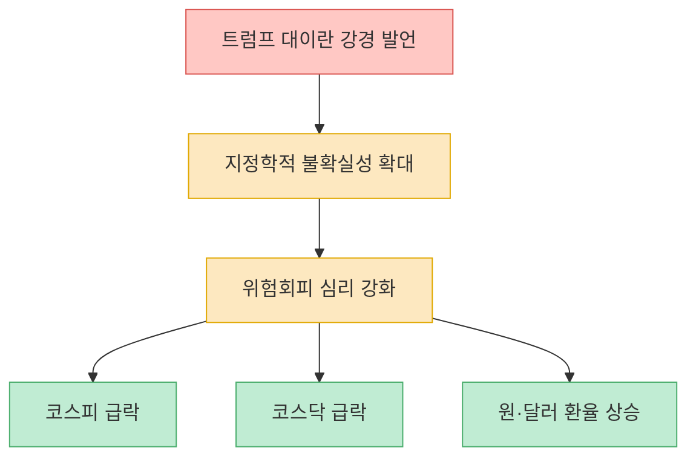
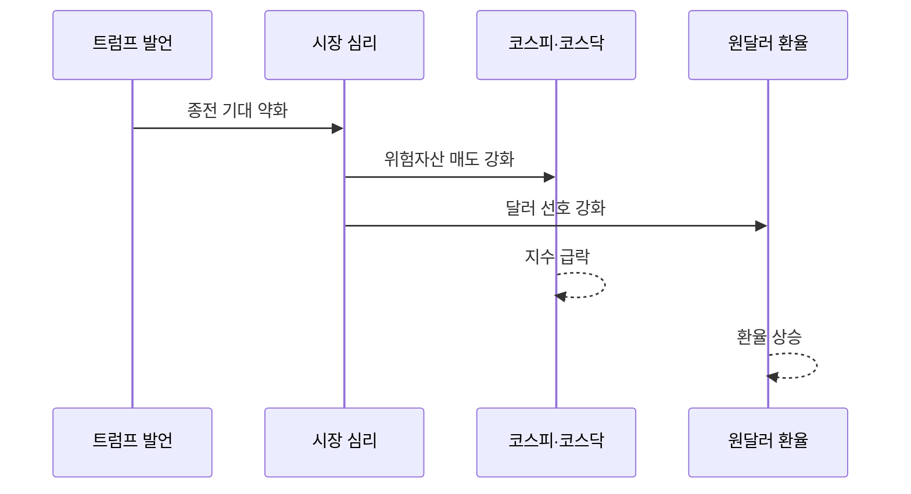
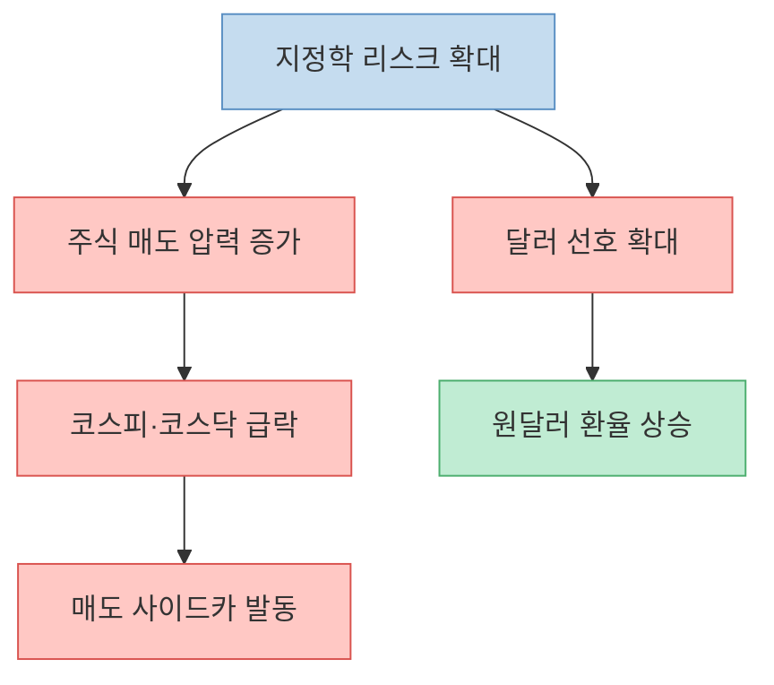

이 기사는 길지 않지만, 하루 시장 분위기를 읽는 데 필요한 핵심 숫자는 거의 다 담고 있습니다. 도널드 트럼프 미국 대통령의 대이란 강경 발언 이후 미국·이란 간 종전 기대가 꺾였고, 그 여파 속에서 코스피와 코스닥이 급락하고 원·달러 환율이 뛰었다는 것이 기사 요지입니다. 즉 이 글의 핵심은 개별 종목 이슈가 아니라 **지정학적 긴장이 국내 금융시장 전체를 동시에 흔든 전형적인 위험회피 장면** 을 보여 준다는 데 있습니다. [기사 본문](https://www.hankyung.com/article/202604025214i)

또 하나 눈여겨볼 점은 이 기사가 `포토 기사`라는 점입니다. 분석 리포트처럼 긴 설명을 붙이지는 않지만, 대신 사진과 숫자, 그리고 한 줄 배경 설명으로 `무슨 일이 벌어졌는지`를 매우 압축적으로 전달합니다. 그래서 이 글도 기사 분량을 억지로 늘리기보다, 기사에 나온 숫자와 문장을 중심으로 `무엇이 사실이고`, `그 사실을 시장 관점에서 어떻게 읽을 수 있는지`만 구조적으로 풀겠습니다. [기사 본문](https://www.hankyung.com/article/202604025214i)

<!--more-->

## Sources

- [[포토] 트럼프 강경 발언에 하락한 코스피-코스닥](https://www.hankyung.com/article/202604025214i) — 한국경제, 임형택 기자

---

## 기사 속 하루 요약 — 주가와 환율이 동시에 흔들렸다

기사에 따르면 2026년 4월 2일 코스피는 전장보다 244.65포인트, 4.47% 내린 5234.05에 마감했고, 코스닥은 59.84포인트, 5.36% 하락한 1056.34에 거래를 마쳤습니다. 원·달러 환율은 전 거래일보다 18.4원 오른 1519.7원에 주간 거래를 마감했다고 적혀 있습니다. 이 세 숫자만 봐도 이날 시장이 단순 조정이 아니라 `주식 약세 + 원화 약세`가 겹친 전형적인 리스크오프 장면이었다는 것을 알 수 있습니다. [기사 본문](https://www.hankyung.com/article/202604025214i)

특히 중요한 것은 하락이 한 시장에만 국한되지 않았다는 점입니다. 코스피와 코스닥이 같이 크게 밀렸고, 환율도 동시에 올랐습니다. 보통 이런 모습은 투자자들이 특정 업종의 실적을 따지는 단계가 아니라, 더 넓은 차원의 불확실성을 먼저 가격에 반영하고 있다는 뜻으로 읽힙니다. 기사도 이 흐름을 트럼프의 강경 발언과 미국·이란 간 종전 기대 약화라는 배경으로 직접 연결합니다. [기사 본문](https://www.hankyung.com/article/202604025214i)

---

## 기사는 왜 트럼프의 이란 강경 발언을 핵심 변수로 보나

기사 본문이 제시한 직접 원인은 명확합니다. 트럼프 대통령이 1일 백악관 기자회견에서 `앞으로 2~3주간 이란을 대대적으로 타격해 석기시대로 돌려 놓을 것`이라고 말했고, 이 발언이 미국과 이란 간 종전 기대를 꺾었다는 것입니다. 시장은 전쟁 완화 가능성보다 충돌 격화 가능성을 더 크게 보기 시작했고, 그 순간 위험자산에 대한 선호가 빠르게 식었다는 서사입니다. [기사 본문](https://www.hankyung.com/article/202604025214i)

이 기사의 좋은 점은 여기서 거창한 해설을 덧붙이지 않는다는 데 있습니다. `트럼프 발언 -> 종전 기대 약화 -> 국내 증시 급락`이라는 최소한의 연결고리만 제시합니다. 그래서 독자 입장에서는 이 기사를 장기 전망이나 정책 분석으로 읽기보다, **시장 참여자들이 그날 무엇을 가장 무서워했는지 보여 주는 스냅샷** 으로 읽는 편이 맞습니다. 기사 형식이 사진 중심인 이유와도 잘 맞습니다. [기사 본문](https://www.hankyung.com/article/202604025214i)

중요한 점은, 기사 자체는 `왜 하필 4% 넘게 밀렸는가`를 세부적으로 분해하지는 않는다는 것입니다. 그러므로 이 글도 그 범위를 넘어서 과장하지 않겠습니다. 다만 기사 안의 문장만으로도 분명한 것은, 시장이 이날 지정학 리스크를 단순 뉴스 헤드라인이 아니라 실제 가격 변동의 직접 변수로 받아들였다는 사실입니다. [기사 본문](https://www.hankyung.com/article/202604025214i)

---

## 사이드카와 환율 숫자가 왜 같이 중요할까

기사에는 코스피와 코스닥이 모두 5% 안팎으로 하락하면서 매도 사이드카가 발동됐다고 나옵니다. 사이드카는 프로그램 매매를 잠시 멈추게 해 급격한 쏠림을 진정시키기 위한 안전장치이므로, 이것이 기사에 등장했다는 사실 자체가 그날 변동성이 상당히 컸다는 의미입니다. 즉 단순히 지수가 내렸다는 수준을 넘어, 시장 구조적으로도 급한 매도 압력이 감지됐다고 볼 수 있습니다. [기사 본문](https://www.hankyung.com/article/202604025214i)

환율도 같이 봐야 하는 이유는 외국인 자금 흐름과 위험회피 심리를 더 입체적으로 보여 주기 때문입니다. 주가만 내려가면 업종·실적·수급 문제로 해석할 여지가 남지만, 환율까지 빠르게 뛰면 `원화 자산 전반의 선호가 약해졌다`는 신호가 더 강해집니다. 기사 속 1519.7원이라는 숫자는 그 자체로 시장이 방어적 모드로 움직였다는 정서를 압축해서 보여 줍니다. [기사 본문](https://www.hankyung.com/article/202604025214i)

이런 날의 특징은 투자자들이 종목별 스토리를 따지기보다, 먼저 현금·달러·방어적 자산 쪽으로 몸을 피하려 한다는 데 있습니다. 기사에 나온 숫자 세 개, 즉 코스피 하락폭, 코스닥 하락폭, 환율 상승폭은 그 움직임을 한 화면에 담아낸 셈입니다. 그래서 짧은 기사지만 시장 분위기 자체를 읽는 데는 오히려 효율적입니다. [기사 본문](https://www.hankyung.com/article/202604025214i)

---

## 이 짧은 기사에서 독자가 실제로 읽어야 하는 것

이 기사를 읽을 때 가장 중요한 것은 `왜 떨어졌나`를 지나치게 복잡하게 만들지 않는 것입니다. 기사 자체가 제시하는 프레임은 단순합니다. 트럼프의 대이란 강경 발언이 종전 기대를 꺾었고, 그 결과 시장이 지정학 리스크를 더 크게 가격에 반영했다는 것입니다. 여기서 독자가 챙길 것은 배경 서사의 정교함보다, **뉴스 한 줄이 시장 전체 가격 체계를 얼마나 빠르게 흔들 수 있는지** 입니다. [기사 본문](https://www.hankyung.com/article/202604025214i)

또 하나는 `사진기사의 역할`입니다. 긴 칼럼이나 분석 기사라면 해석과 전망이 길게 붙겠지만, 이 기사는 딜링룸 사진과 핵심 숫자, 그리고 배경 한 줄만으로 시장의 공포를 전달합니다. 그래서 이 글을 보는 가장 좋은 방식은 `오늘 시장이 어떤 감정 상태였나`를 확인하는 것입니다. 급락한 지수와 오른 환율, 그리고 딜링룸 전광판 사진이 합쳐져 그 감정을 설명합니다. [기사 본문](https://www.hankyung.com/article/202604025214i)

마지막으로, 이런 기사일수록 과잉 해석보다 맥락 정리가 중요합니다. 기사 안에 없는 원인을 억지로 덧붙이기보다, 기사에 있는 사실을 연결해 그날 시장의 구조를 읽어야 합니다. 이 경우 그 구조는 `지정학 리스크 -> 위험회피 -> 주식 약세 + 원화 약세`입니다. 짧은 기사지만 메시지는 오히려 선명합니다. [기사 본문](https://www.hankyung.com/article/202604025214i)

---

## 실전 적용 포인트

시장 뉴스를 읽을 때는 지수 숫자 하나만 보지 말고 `코스피`, `코스닥`, `환율`, `시장 안전장치(사이드카)`가 함께 움직였는지 봐야 합니다. 같이 움직였다면 이는 개별 종목 악재보다 큰 차원의 리스크오프일 가능성이 높습니다. 이 기사도 바로 그런 장면을 보여 줍니다. [기사 본문](https://www.hankyung.com/article/202604025214i)

또 사진기사처럼 짧은 기사는 `배경 분석이 부족하다`고 넘기기보다, 오히려 핵심 사실을 빠르게 파악하는 출발점으로 쓰는 것이 좋습니다. 이날의 경우 독자가 바로 챙겨야 할 것은 트럼프 발언 자체보다, 그 발언이 국내 자산시장 가격에 어떤 식으로 압축돼 나타났는가입니다. 즉 `지정학 리스크가 현실 가격으로 번역되는 속도`를 보는 것입니다. [기사 본문](https://www.hankyung.com/article/202604025214i)

---

## 핵심 요약

- 이 기사는 트럼프의 대이란 강경 발언 이후 종전 기대가 꺾이면서 코스피·코스닥이 급락하고 원·달러 환율이 상승한 하루를 압축해서 보여 줍니다. [기사 본문](https://www.hankyung.com/article/202604025214i)
- 기사에 나온 코스피 -4.47%, 코스닥 -5.36%, 환율 +18.4원이라는 숫자는 `주식 약세 + 원화 약세`가 동시에 나타난 전형적 위험회피 장면을 의미합니다. [기사 본문](https://www.hankyung.com/article/202604025214i)
- 사이드카 발동 언급은 단순 하락이 아니라, 시장 구조적으로도 급격한 매도 압력이 감지됐다는 뜻으로 읽을 수 있습니다. [기사 본문](https://www.hankyung.com/article/202604025214i)
- 이 기사에서 중요한 것은 장기 전망보다, 지정학 리스크가 국내 금융시장 전체 가격에 어떻게 즉각 반영됐는지를 보여 주는 스냅샷이라는 점입니다. [기사 본문](https://www.hankyung.com/article/202604025214i)

---

## 결론

이 사진기사는 짧지만, 시장이 무엇을 가장 두려워했는지를 숫자와 화면으로 정확히 남깁니다. 트럼프의 강경 발언이 단지 국제 뉴스로 머문 것이 아니라, 곧바로 국내 주식과 환율에 번역돼 나타났다는 사실이 핵심입니다. [기사 본문](https://www.hankyung.com/article/202604025214i)

그래서 이 기사를 읽는 가장 좋은 방법은 `왜 이렇게 무서워했을까`를 묻는 것보다, `시장은 어떤 순서로 공포를 가격에 반영했을까`를 보는 것입니다. 코스피, 코스닥, 환율, 사이드카까지 같이 보면 그날의 리스크오프 구조가 한눈에 들어옵니다. [기사 본문](https://www.hankyung.com/article/202604025214i)
