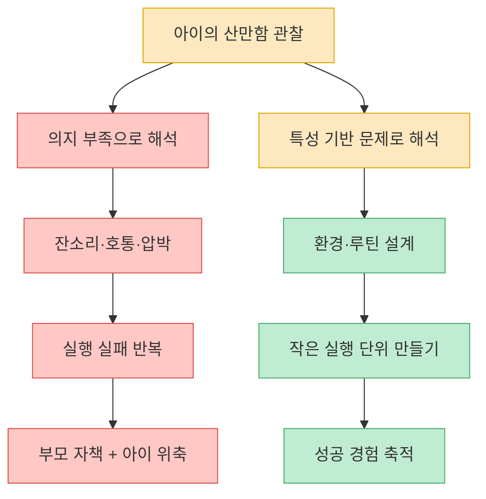
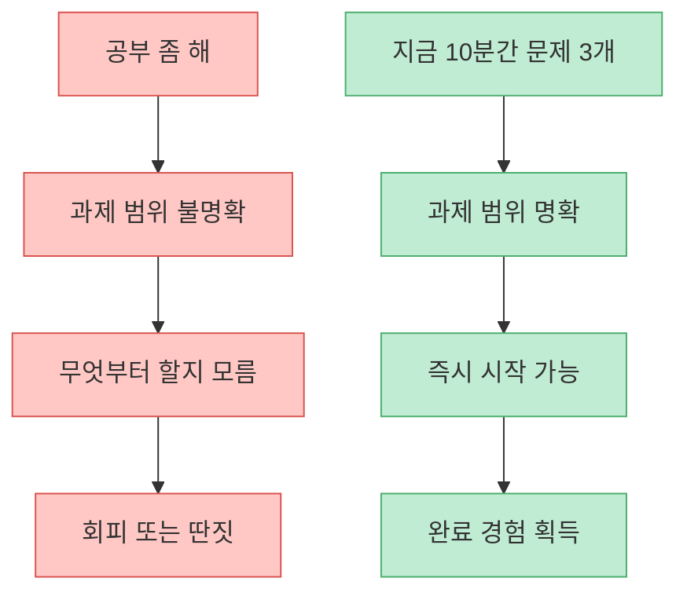
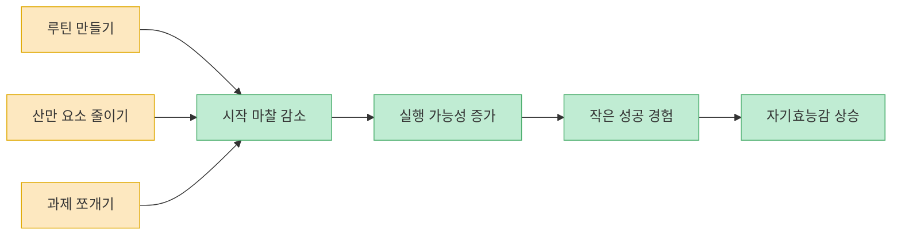

이 Threads 포스트의 첫 문장은 매우 강합니다. "공부 좀 해! 왜 맨날 딴짓이야!"라고 다그치는 방식이 산만한 ADHD 아이에게는 절대 도움이 되지 않는다고 말합니다. 동시에 포스트는 작성자가 `50평생 중증 ADHD로 살았고`, `나를 닮아 산만했던 딸을 스스로 공부하는 습관으로 특목고에 보냈다`는 개인 경험을 전면에 내세웁니다. 다만 공개 상태에서 추출 가능한 원문은 티저 문구와 카드 이미지 일부뿐이라, 이 글은 스레드의 세부 비법을 그대로 복원하는 글이 아니라 **그 문제의식을 공신력 있는 ADHD 가이드와 연결해 실제로 무엇이 도움이 되는지 정리하는 글** 입니다. [Threads 원문](https://www.threads.com/@ftj.kr/post/DWsbKhoEXmo?xmt=AQF0jNu2-K6-PrjuUcC4cbmJKo4sE91w3f9ZeTdroec6Pma_TqVlgJKjmBiZ246B4X2Hmi4&slof=1), [CDC ADHD Treatment](https://www.cdc.gov/adhd/treatment/index.html), [CHADD Parenting a Child with ADHD](https://chadd.org/for-parents/overview/)

핵심만 먼저 말하면, ADHD 아이의 공부 문제를 `의지 부족`이나 `버릇 문제`로만 해석하면 개입 방식이 거의 항상 scolding 중심으로 흘러갑니다. 그런데 CDC와 CHADD는 오히려 루틴 만들기, 산만 요소 관리, 짧고 구체적인 지시, 과제 쪼개기, 칭찬과 보상, 부모 행동관리 훈련 같은 구조적 개입을 강조합니다. 즉 이 스레드가 직감적으로 던진 문제의식은 꽤 타당하고, 실제로 중요한 것은 `더 세게 혼내기`가 아니라 `아이가 실행할 수 있는 환경을 설계하는 것`에 가깝습니다. [CDC ADHD Treatment](https://www.cdc.gov/adhd/treatment/index.html), [CHADD Parenting a Child with ADHD](https://chadd.org/for-parents/overview/)

<!--more-->

## Sources

- [Threads @ftj.kr — "공부 좀 해! 왜 맨날 딴짓이야!" ADHD 아이에게 하면 안 되는 말](https://www.threads.com/@ftj.kr/post/DWsbKhoEXmo?xmt=AQF0jNu2-K6-PrjuUcC4cbmJKo4sE91w3f9ZeTdroec6Pma_TqVlgJKjmBiZ246B4X2Hmi4&slof=1) — 부분 추출(메타 텍스트 + 카드 이미지)
- [CDC — Treatment of ADHD](https://www.cdc.gov/adhd/treatment/index.html)
- [CHADD — Parenting a Child with ADHD](https://chadd.org/for-parents/overview/)

---

## 이 Threads 포스트가 실제로 말하는 핵심은 무엇인가

공개 페이지에서 확인되는 텍스트를 기준으로 보면, 이 스레드는 아주 분명한 문제 제기에서 출발합니다. 아이가 산만하고 집중을 못 한다고 해서 `왜 맨날 딴짓이야`, `공부 좀 해` 같은 압박형 문장을 반복하는 것은 해결책이 아니라는 것입니다. 여기서 포스트가 실제로 건드리는 핵심은 `학습 능력`보다 `접근 방식`입니다. 즉 아이가 못하는 것을 더 강하게 밀어붙이는 방식이 아니라, 산만함이 있는 아이가 **어떻게 하면 실제로 움직일 수 있는 조건을 만들 것인가** 로 질문을 바꿔야 한다는 쪽입니다. [Threads 원문](https://www.threads.com/@ftj.kr/post/DWsbKhoEXmo?xmt=AQF0jNu2-K6-PrjuUcC4cbmJKo4sE91w3f9ZeTdroec6Pma_TqVlgJKjmBiZ246B4X2Hmi4&slof=1)

이미지에서 OCR로 확인되는 카드 문구도 비슷한 방향을 가리킵니다. `극소수만 알고 있는 미국 ADHD 공부법`이라는 표현은 다소 자극적이지만, 적어도 메시지의 방향은 분명합니다. 기존의 `혼내고 밀어붙이는 공부법`이 아니라, ADHD 특성을 고려한 다른 방식이 필요하다는 것입니다. 다만 여기서 중요한 것은 이 스레드가 공개 상태에서 구체적 루틴 전체를 다 보여 주지는 않는다는 점입니다. 따라서 블로그 글로 옮길 때는 자극적인 문구를 그대로 확대하기보다, 실제로 검증 가능한 원칙으로 번역해야 합니다. [Threads 원문](https://www.threads.com/@ftj.kr/post/DWsbKhoEXmo?xmt=AQF0jNu2-K6-PrjuUcC4cbmJKo4sE91w3f9ZeTdroec6Pma_TqVlgJKjmBiZ246B4X2Hmi4&slof=1)

---

## 왜 "공부 좀 해"가 ADHD 아이에게 잘 안 먹히는가

CDC와 CHADD 자료를 보면, ADHD 아이에게 가장 먼저 필요한 것은 `더 강한 푸시`가 아니라 `더 명확한 구조`입니다. CDC는 부모 행동관리 팁으로 루틴 만들기, 산만 요소 줄이기, 선택지를 줄이기, 짧고 구체적으로 말하기, 복잡한 과제를 더 작은 단계로 쪼개기, 목표와 칭찬·보상을 함께 쓰는 방식을 제안합니다. 이 목록을 보면 왜 `공부 좀 해`가 잘 안 통하는지가 드러납니다. 그 말에는 무엇을, 얼마나, 어떤 순서로, 어느 환경에서 해야 하는지가 하나도 들어 있지 않기 때문입니다. [CDC ADHD Treatment](https://www.cdc.gov/adhd/treatment/index.html)

CHADD도 거의 같은 방향을 강조합니다. 아이는 `정확히 무엇을 기대하는지`, `어디까지가 한 번에 해야 할 분량인지`, `어떤 결과가 오면 잘한 것인지`를 분명히 알아야 합니다. 모호한 상황과 애매한 요구는 ADHD 아이에게 특히 불리합니다. 그래서 scolding 중심 접근은 종종 행동 교정보다 감정적 충돌만 키우고, 아이는 `또 혼난다`는 예측만 강화한 채 실제 공부 루틴은 배우지 못하게 됩니다. [CHADD Parenting a Child with ADHD](https://chadd.org/for-parents/overview/)

결국 중요한 차이는 이것입니다. `공부 좀 해`는 감정의 언어이고, `지금 10분 동안 수학 문제 3개만 풀고 와`는 실행의 언어입니다. ADHD 아이에게 필요한 것은 후자에 가깝습니다. 과제를 작은 단위로 쪼개고, 바로 시작할 수 있게 만들고, 성공했을 때 즉시 피드백을 주는 방식이 실제 행동 변화를 만들 가능성이 더 높습니다. [CDC ADHD Treatment](https://www.cdc.gov/adhd/treatment/index.html), [CHADD Parenting a Child with ADHD](https://chadd.org/for-parents/overview/)

---

## 실제로 도움이 되는 것은 루틴, 환경, 짧은 지시다

CDC 자료에서 가장 실용적인 부분은 `행동관리 팁` 목록입니다. 매일 비슷한 시간표를 유지하고, 학교 가방이나 학용품처럼 자주 쓰는 물건은 항상 같은 자리에 두고, 숙제할 때는 TV와 소셜미디어, 소음을 줄이고, 작업 공간을 정리하라고 권합니다. 이건 별것 아닌 생활 팁처럼 보이지만, ADHD 아이에게는 `주의 전환 비용`을 낮추는 중요한 장치입니다. 공부를 못 하게 만드는 요인이 의지 부족만이 아니라, 시작까지 들어가는 마찰 비용일 수 있기 때문입니다. [CDC ADHD Treatment](https://www.cdc.gov/adhd/treatment/index.html)

또 하나 중요한 것은 과제 분해입니다. 긴 과제를 한 번에 제시하지 말고 더 짧은 단계로 나누고, 오래 걸리는 일은 미리 시작하고 중간에 쉬는 시간을 넣으라고 CDC는 설명합니다. 이는 부모가 해야 할 역할이 `감시자`라기보다 `프로젝트 매니저`에 가깝다는 뜻이기도 합니다. 아이에게 무조건 버티라고 요구하기보다, 버틸 수 있는 길이와 단위를 설계하는 것이 더 현실적인 개입입니다. [CDC ADHD Treatment](https://www.cdc.gov/adhd/treatment/index.html)

CHADD 쪽은 여기에 `명확하고 일관된 기대`, `예측 가능한 결과`, `구체적 칭찬`을 더합니다. 부모 훈련의 핵심은 reactive, 즉 터진 뒤에 화내는 방식이 아니라 proactive, 즉 미리 행동의 틀을 만들어 두는 방식이라고 설명합니다. 그래서 아이가 잘했을 때는 아주 작은 진전이라도 구체적으로 말해 주고, 잘못했을 때는 고함보다 예측 가능한 결과와 규칙을 적용하는 편이 더 낫다고 봅니다. [CHADD Parenting a Child with ADHD](https://chadd.org/for-parents/overview/)

---

## 이 스레드를 가장 생산적으로 읽는 방법

이 Threads 포스트를 그대로 받아들이면 `미국 ADHD 공부법`이라는 비밀 해법이 따로 있는 것처럼 보일 수 있습니다. 하지만 공개 상태에서 확인 가능한 텍스트만 놓고 보면, 핵심은 어떤 신비한 비법보다도 `부모의 접근 방식 전환`에 있습니다. 아이의 산만함을 도덕적 실패처럼 대하지 않고, 실행 가능성을 높이는 구조로 바꾸는 것 말입니다. 이건 CDC와 CHADD 자료가 공통으로 말하는 방향과도 잘 맞습니다. [Threads 원문](https://www.threads.com/@ftj.kr/post/DWsbKhoEXmo?xmt=AQF0jNu2-K6-PrjuUcC4cbmJKo4sE91w3f9ZeTdroec6Pma_TqVlgJKjmBiZ246B4X2Hmi4&slof=1), [CDC ADHD Treatment](https://www.cdc.gov/adhd/treatment/index.html), [CHADD Parenting a Child with ADHD](https://chadd.org/for-parents/overview/)

그래서 이 스레드에서 건질 만한 문장은 `혼내는 말을 멈추라`는 것보다, 그다음 질문을 바꾸라는 데 있습니다. `왜 못 하니` 대신 `어떻게 하면 시작할 수 있지`, `한 번에 어디까지가 가능한가`, `산만함을 줄이려면 무엇을 치워야 하지`, `지금 칭찬할 수 있는 작은 성공은 무엇이지`를 묻는 쪽이 더 생산적입니다. 이건 부모가 아이를 봐주는 태도의 변화이기도 하고, 동시에 환경 설계의 변화이기도 합니다. [CDC ADHD Treatment](https://www.cdc.gov/adhd/treatment/index.html), [CHADD Parenting a Child with ADHD](https://chadd.org/for-parents/overview/)

중요한 한계도 분명히 적어야 합니다. 이 글은 스레드의 전체 카드 내용을 완전 복원한 것이 아닙니다. 공개 메타 텍스트와 카드 첫 이미지, 그리고 ADHD 공식 가이드 자료를 바탕으로 재구성한 글입니다. 따라서 스레드 작성자가 말한 세부 루틴 전체와 1:1로 같다고 주장할 수는 없습니다. 대신 `다그치기보다 구조화`, `모호한 지시보다 짧고 구체적인 실행`, `감정 반응보다 부모 행동관리`라는 큰 방향은 충분히 근거를 갖고 정리할 수 있습니다. [Threads 원문](https://www.threads.com/@ftj.kr/post/DWsbKhoEXmo?xmt=AQF0jNu2-K6-PrjuUcC4cbmJKo4sE91w3f9ZeTdroec6Pma_TqVlgJKjmBiZ246B4X2Hmi4&slof=1), [CDC ADHD Treatment](https://www.cdc.gov/adhd/treatment/index.html)

---

## 실전 적용 포인트

오늘 바로 바꿀 수 있는 것은 세 가지입니다. 첫째, `공부 좀 해` 같은 추상적 지시를 버리고 `지금 10분 동안 이 문제 3개만`처럼 길이와 범위를 구체화하세요. 둘째, 숙제 시간에는 소음, 화면, 군더더기 물건을 줄여 시작 마찰을 낮추세요. 셋째, 다 끝냈을 때만 칭찬하지 말고 `지금 바로 시작한 것`, `5분 버틴 것`, `중간에 돌아온 것` 같은 작은 성공도 바로 인정하세요. [CDC ADHD Treatment](https://www.cdc.gov/adhd/treatment/index.html), [CHADD Parenting a Child with ADHD](https://chadd.org/for-parents/overview/)

또 한 가지는 부모 자신을 `감독관`보다 `설계자`로 보는 것입니다. ADHD 아이의 공부는 의지 시험이 아니라 환경 설계 문제일 때가 많습니다. 혼내는 기술보다, 루틴을 만드는 기술과 과제를 쪼개는 기술, 그리고 일관되게 반응하는 기술이 훨씬 중요합니다. [CHADD Parenting a Child with ADHD](https://chadd.org/for-parents/overview/)

---

## 핵심 요약

- Threads 포스트는 `ADHD 아이에게 "공부 좀 해"라고 다그치는 방식은 도움이 되지 않는다`는 문제의식을 강하게 던집니다. [Threads 원문](https://www.threads.com/@ftj.kr/post/DWsbKhoEXmo?xmt=AQF0jNu2-K6-PrjuUcC4cbmJKo4sE91w3f9ZeTdroec6Pma_TqVlgJKjmBiZ246B4X2Hmi4&slof=1)
- CDC는 ADHD 아동에게 루틴 만들기, 산만 요소 줄이기, 짧고 구체적인 지시, 과제 쪼개기, 목표와 칭찬 활용을 권합니다. [CDC ADHD Treatment](https://www.cdc.gov/adhd/treatment/index.html)
- CHADD는 모호한 요구보다 명확하고 일관된 기대, proactive한 행동관리, 부모 훈련, 작은 성공에 대한 구체적 칭찬을 강조합니다. [CHADD Parenting a Child with ADHD](https://chadd.org/for-parents/overview/)
- 따라서 핵심은 `더 세게 밀어붙이기`가 아니라 `아이가 실제로 움직일 수 있는 구조를 설계하기`에 가깝습니다. [CDC ADHD Treatment](https://www.cdc.gov/adhd/treatment/index.html), [CHADD Parenting a Child with ADHD](https://chadd.org/for-parents/overview/)

---

## 결론

이 스레드가 건드린 포인트는 꽤 정확합니다. ADHD 아이의 공부 문제를 `태도 문제`로만 읽는 순간 부모의 언어는 거의 항상 압박형이 되고, 그 압박은 실행을 늘리기보다 실패 경험을 더 쌓게 만들기 쉽습니다. [Threads 원문](https://www.threads.com/@ftj.kr/post/DWsbKhoEXmo?xmt=AQF0jNu2-K6-PrjuUcC4cbmJKo4sE91w3f9ZeTdroec6Pma_TqVlgJKjmBiZ246B4X2Hmi4&slof=1)

반대로 루틴, 환경, 짧은 지시, 과제 분해, 칭찬과 같은 구조적 개입으로 질문을 바꾸면 부모도 덜 소모되고 아이도 덜 위축됩니다. `공부 좀 해` 대신 `지금은 여기까지 해 보자`로 바꾸는 것, 그 차이가 실제 행동을 만드는 첫 시작일 수 있습니다. [CDC ADHD Treatment](https://www.cdc.gov/adhd/treatment/index.html), [CHADD Parenting a Child with ADHD](https://chadd.org/for-parents/overview/)
