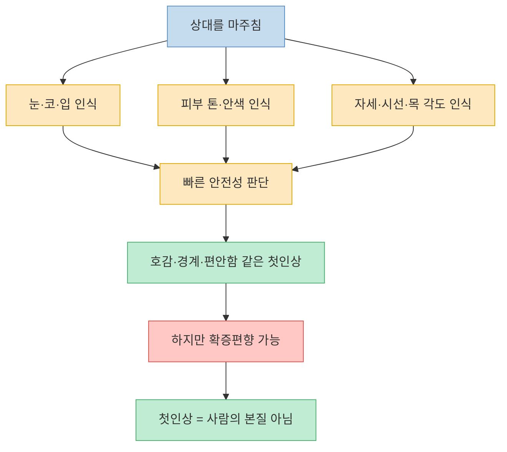
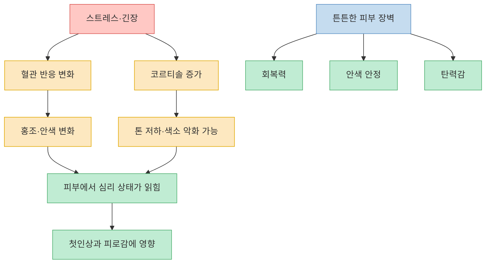
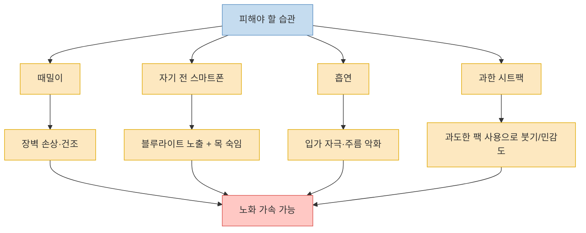

이 영상은 겉보기엔 `본능적으로 피하게 되는 사람`을 다루는 토크처럼 보이지만, 실제 내용을 따라가 보면 핵심은 꽤 구체적이다. 사람은 아주 짧은 시간 안에 상대를 `안전한 사람인지`, `건강해 보이는지`, `관리된 인상인지` 판단하려 하고, 그 과정에서 피부 톤, 안색, 자세, 표정, 긴장 신호 같은 요소를 빠르게 읽어낸다는 것이다. 동시에 출연진은 피부과 관점에서 `노화를 빠르게 만들 수 있는 습관`, `홍조와 피부 장벽`, `자외선 차단`까지 연결해 설명한다. 이 글은 그 흐름을 `첫인상 형성 -> 피부가 주는 신호 -> 피해야 할 행동 -> 실전 관리 포인트` 순서로 다시 정리한 것이다. [(0:00)](https://youtu.be/A8xWJVnpg-w?t=0), [(5:17)](https://youtu.be/A8xWJVnpg-w?t=317), [(11:39)](https://youtu.be/A8xWJVnpg-w?t=699), [(23:22)](https://youtu.be/A8xWJVnpg-w?t=1402)

<!--more-->

## Sources

- [본능적으로 피하게 되는 사람의 행동패턴ㅣ대외비 EP.10](https://www.youtube.com/watch?v=A8xWJVnpg-w) — 지식인사이드

---

## 첫인상은 왜 그렇게 빨리 만들어지나

영상은 첫인상이 매우 빠르게 결정된다고 말한다. 짧게는 0.03초, 조금 더 길게는 몇 초 안에 상대가 안전한지 위험한지, 편안한지 불편한지 같은 판단이 시작된다는 것이다. 여기서 뇌가 읽는 정보는 추상적인 `분위기`만이 아니라 눈, 코, 입의 느낌, 전체 피부 톤, 머리 스타일, 체형, 시선 처리, 목의 각도 같은 구체적인 신호들이다. 즉 첫인상은 단순 호불호가 아니라, 아주 짧은 시간에 외형 정보를 묶어 위험 신호를 스캔하는 과정으로 설명된다. [(5:19)](https://youtu.be/A8xWJVnpg-w?t=319), [(5:31)](https://youtu.be/A8xWJVnpg-w?t=331), [(5:43)](https://youtu.be/A8xWJVnpg-w?t=343), [(5:49)](https://youtu.be/A8xWJVnpg-w?t=349)

특히 상담심리 쪽 출연자는 멀리서 볼 때는 체형의 안정성, 절뚝임 여부, 몸이 과하게 웅크러져 있는지, 목의 각도와 시선이 어떤지를 보고, 가까이 왔을 때는 안색을 본다고 말한다. 안색은 건강성, 젊음의 정도, 관리 상태, 심지어 생활 환경까지 드러내는 단서처럼 읽힌다는 설명이다. 이 부분에서 영상은 `직감`을 신비한 감각으로 포장하기보다, 경험이 축적된 사람이 반복적으로 읽어낸 시각적 패턴의 총합으로 이해하는 쪽에 가깝다. [(7:24)](https://youtu.be/A8xWJVnpg-w?t=444), [(7:28)](https://youtu.be/A8xWJVnpg-w?t=448), [(7:40)](https://youtu.be/A8xWJVnpg-w?t=460), [(7:55)](https://youtu.be/A8xWJVnpg-w?t=475)

다만 영상 안에서도 이 직감의 한계는 분명히 짚는다. 한 출연자는 직감 자체는 존재하지만, 사람은 확증편향 때문에 맞은 사례만 기억하고 틀린 판단은 지워버리기 쉽다고 말한다. 또 `얼굴 생김새가 곧 성격이나 운명을 결정한다`는 식의 관상 해석에는 선을 긋는다. 인상 형성 연구는 있지만, 정해진 얼굴이 정해진 성격과 강하게 일치한다고 보기 어렵고, 있더라도 그 연관은 제한적이라는 입장이다. 즉 영상은 **첫인상은 빠르게 형성되지만, 그 판단을 사람의 본질이라고 믿으면 안 된다** 는 쪽으로 정리된다. [(8:03)](https://youtu.be/A8xWJVnpg-w?t=483), [(8:35)](https://youtu.be/A8xWJVnpg-w?t=515), [(9:14)](https://youtu.be/A8xWJVnpg-w?t=554), [(9:37)](https://youtu.be/A8xWJVnpg-w?t=577)

---

## 피부는 왜 첫인상과 노화의 신호로 읽히나

영상에서 피부는 단순히 미용의 문제가 아니라, 심리 상태와 건강 상태를 바깥으로 드러내는 표면으로 다뤄진다. 피부과 전문의는 사람이 긴장하거나 불안할 때 혈관이 확장돼 홍조가 생기거나, 반대로 수축으로 다른 안색 변화를 보일 수 있다고 설명한다. 스트레스를 받으면 코르티솔이 색소 관련 반응을 자극해 피부 톤이 탁해지거나 기미가 악화될 수 있고, 긴장으로 땀이 나는 것 역시 상대의 심리 상태를 피부를 통해 읽게 만드는 신호가 될 수 있다는 것이다. [(6:10)](https://youtu.be/A8xWJVnpg-w?t=370), [(6:20)](https://youtu.be/A8xWJVnpg-w?t=380), [(6:36)](https://youtu.be/A8xWJVnpg-w?t=396), [(6:51)](https://youtu.be/A8xWJVnpg-w?t=411)

또 영상은 스트레스 그 자체가 노화를 가속하는 방향으로 작동한다고 연결한다. 외부 상황에 지나치게 민감해 계속 긴장 상태가 유지되면 그 자체가 스트레스가 되고, 그런 긴장이 장기적으로 늙음을 앞당길 수 있다는 식이다. 이어 노화는 피부만의 변화가 아니라 지방, 골격, 피부가 함께 바뀌는 통합적 현상이라고 설명하면서, 턱선 각도 변화, 눈 주변 꺼짐, 광대가 도드라져 보이는 인상, 피부 얇아짐과 톤 불균일이 함께 누적된다고 말한다. 그래서 안색과 피부 결, 얼굴선은 상대의 나이뿐 아니라 `얼마나 지쳐 보이는지`, `얼마나 관리돼 보이는지`에도 큰 영향을 준다는 것이 영상의 논리다. [(10:05)](https://youtu.be/A8xWJVnpg-w?t=605), [(10:14)](https://youtu.be/A8xWJVnpg-w?t=614), [(10:26)](https://youtu.be/A8xWJVnpg-w?t=626), [(10:40)](https://youtu.be/A8xWJVnpg-w?t=640), [(11:05)](https://youtu.be/A8xWJVnpg-w?t=665)

흥미로운 점은 영상이 `좋은 피부`를 설명할 때 아기 피부를 예시로 든다는 것이다. 아이 피부는 재생이 빠르고 장벽 기능이 튼튼하므로, 결국 건강한 안색과 탄력, 탱글한 질감은 강한 피부 장벽에서 나온다고 본다. 즉 좋은 피부는 단지 밝고 매끈한 피부가 아니라, 외부 자극을 버티고 회복하는 기반이 मजबूत한 피부라는 해석이다. [(14:37)](https://youtu.be/A8xWJVnpg-w?t=877), [(14:42)](https://youtu.be/A8xWJVnpg-w?t=882), [(14:48)](https://youtu.be/A8xWJVnpg-w?t=888), [(14:57)](https://youtu.be/A8xWJVnpg-w?t=897)

---

## 출연진이 실제로 피하라고 말한 노화 습관들

이 영상에서 가장 실전적인 대목은 `피부과 하고 나서 절대 하지 않는 행동`을 말하는 부분이다. 가장 강하게 나온 것은 때밀이다. 전문의는 표피는 원래 기저층에서 생성되고 자연스럽게 탈락하는 균형을 갖고 있는데, 때밀이는 그 탈락을 억지로 과하게 밀어내는 행동이라고 설명한다. 그 결과 피부는 더 건조해지고, 보호막이 사라져 외부 자극에 쉽게 반응하게 되며, 장벽 손상으로 피부 노화와 주름 형성이 빨라질 수 있다고 말한다. [(11:39)](https://youtu.be/A8xWJVnpg-w?t=699), [(11:46)](https://youtu.be/A8xWJVnpg-w?t=706), [(12:00)](https://youtu.be/A8xWJVnpg-w?t=720), [(12:08)](https://youtu.be/A8xWJVnpg-w?t=728), [(12:16)](https://youtu.be/A8xWJVnpg-w?t=736)

자기 전 스마트폰도 노화를 악화시키는 습관으로 지목된다. 영상에서는 스마트폰의 블루라이트를 `가시광선` 맥락에서 설명하며, 자외선보다는 약하지만 피부 깊숙이 영향을 줄 수 있고, 활성산소 증가와 콜라겐 분해 촉진 쪽으로 연결될 수 있다고 말한다. 여기에 더해 스마트폰을 볼 때 고개를 숙이는 자세 자체가 목주름을 늘릴 수 있다는 지적도 붙는다. 결국 이 파트의 메시지는 빛 자체의 문제와 자세 문제를 같이 보라는 것이다. [(12:41)](https://youtu.be/A8xWJVnpg-w?t=761), [(12:49)](https://youtu.be/A8xWJVnpg-w?t=769), [(13:00)](https://youtu.be/A8xWJVnpg-w?t=780), [(13:11)](https://youtu.be/A8xWJVnpg-w?t=791)

흡연과 과한 시트팩 사용도 같은 맥락에서 경계한다. 흡연은 총 흡연량과 주름이 통계적으로 연결된다고 말하며, 입 주변 근육을 반복적으로 쓰는 행동과 건조, 손상이 겹쳐 노화에 불리하다고 본다. 반대로 `좋아 보이니까 매일 하면 더 좋지 않을까` 싶은 시트팩도, 영상에서는 피부를 오래 불린 상태로 만들어 오히려 얼굴이 붓고 장벽이 흔들릴 수 있으니 주 2~3회 정도가 낫다고 제안한다. 요점은 **더 많이 자극하고 더 많이 덧붙이는 것이 관리가 아니라, 장벽을 덜 망가뜨리는 것이 관리** 라는 점이다. [(13:35)](https://youtu.be/A8xWJVnpg-w?t=815), [(13:51)](https://youtu.be/A8xWJVnpg-w?t=831), [(13:59)](https://youtu.be/A8xWJVnpg-w?t=839), [(14:17)](https://youtu.be/A8xWJVnpg-w?t=857)

---

## 홍조와 피부 장벽은 어떻게 봐야 하나

영상은 홍조를 단순히 `얼굴이 빨개지는 것`으로 보지 않는다. 피부에 있는 미세혈관이 과하게 확장돼 평소보다 붉게 보이는 상태로 설명하고, 일시적인 홍조와 질환처럼 고착된 홍조를 구분한다. 감정적 흥분으로 잠깐 올라오는 경우도 있지만, 주사피부염, 지루성 피부염, 민감성 피부, 폐경기 호르몬 변화처럼 더 구조적인 원인도 있을 수 있다는 것이다. 즉 홍조가 반복되고 지속된다면, 무조건 `열이 많아서` 정도로 축소해 보면 안 된다는 메시지가 있다. [(15:24)](https://youtu.be/A8xWJVnpg-w?t=924), [(15:32)](https://youtu.be/A8xWJVnpg-w?t=932), [(15:45)](https://youtu.be/A8xWJVnpg-w?t=945), [(16:08)](https://youtu.be/A8xWJVnpg-w?t=968), [(16:17)](https://youtu.be/A8xWJVnpg-w?t=977)

이때 차가운 팩으로 식히는 행동은 근본 해결책이 아니라고 선을 긋는다. 영상의 비유를 빌리면, 엔진이 고장 나 과열된 상황에서 물을 뿌려 잠깐 식힐 수는 있어도 엔진 자체가 고쳐지는 것은 아니라는 것이다. 그래서 보습은 보조일 뿐이고, 실제로는 손상된 피부 장벽을 메우고 회복시키는 접근이 더 중요하다고 설명한다. 이 부분은 홍조를 열감 관리만의 문제로 보지 않고 `장벽 회복 문제`와 연결하는 영상의 핵심 포인트다. [(16:23)](https://youtu.be/A8xWJVnpg-w?t=983), [(16:30)](https://youtu.be/A8xWJVnpg-w?t=990), [(16:37)](https://youtu.be/A8xWJVnpg-w?t=997), [(16:41)](https://youtu.be/A8xWJVnpg-w?t=1001)

중간 이후에는 특정 브랜드와 제품 설명이 길게 이어지지만, 일반화해서 남길 수 있는 메시지는 비교적 단순하다. 홍조와 민감도가 고민이라면 `쿨링`보다 `장벽 회복`, `자극 회피`, `민감도 완화`가 우선이라는 것이다. 영상 후반의 패널도 "아기 피부로 돌아갈 수 있다" 같은 과장은 경계하고, 장벽이 튼튼해지면 적어도 쉽게 무너지는 상태를 막는 데는 의미가 있다고 답한다. 이 정도가 광고성 표현을 걷어냈을 때 남는 실질적 결론이다. [(17:54)](https://youtu.be/A8xWJVnpg-w?t=1074), [(18:14)](https://youtu.be/A8xWJVnpg-w?t=1094), [(22:51)](https://youtu.be/A8xWJVnpg-w?t=1371), [(23:05)](https://youtu.be/A8xWJVnpg-w?t=1385)

---

## 영상이 끝에서 제안한 실전 팁: 자외선 차단과 제품 수 줄이기

마무리 파트에서 가장 실용적인 조언은 자외선 차단제다. 집 안에만 있는 상황이라면 무조건 바르라고 하지는 않지만, 낮 동안 창가 근처에서 활동하거나 야외 활동을 할 때는 유리를 통과하는 UVA까지 생각해 차단제를 쓰는 편이 좋다고 말한다. 이어 SPF는 UVB 차단 지수, PA는 UVA 차단 지수라고 설명하면서, 수치가 무조건 높다고 더 좋은 것이 아니라 `정량을 바르는지`가 더 중요하다고 강조한다. [(23:22)](https://youtu.be/A8xWJVnpg-w?t=1402), [(23:34)](https://youtu.be/A8xWJVnpg-w?t=1414), [(24:15)](https://youtu.be/A8xWJVnpg-w?t=1455), [(24:28)](https://youtu.be/A8xWJVnpg-w?t=1468)

특히 영상은 SPF 15와 30의 실제 차단 차이는 생각보다 크지 않지만, 사람들이 보통 충분한 양을 바르지 않기 때문에 일상에서는 적어도 30 정도를 권한다고 설명한다. 얼굴 전체를 덮으려면 생각보다 꽤 많은 양이 필요하고, 반만 바르면 효과가 단순히 절반이 아니라 더 크게 떨어질 수 있다는 취지다. 이 구간의 실전 포인트는 `수치 경쟁`보다 `적절한 양과 꾸준한 사용`에 가깝다. [(24:35)](https://youtu.be/A8xWJVnpg-w?t=1475), [(24:48)](https://youtu.be/A8xWJVnpg-w?t=1488), [(25:00)](https://youtu.be/A8xWJVnpg-w?t=1500), [(25:22)](https://youtu.be/A8xWJVnpg-w?t=1522), [(25:35)](https://youtu.be/A8xWJVnpg-w?t=1535)

또 다른 패널은 많은 제품을 겹겹이 바르기보다, 자신의 고민에 맞는 세럼·앰플 1~2개 정도와 장벽 크림을 조합하는 쪽을 권한다. 즉 이것저것 많이 바르는 것보다 `목적이 분명한 제품 몇 개`와 `장벽 보호`가 더 중요하다는 것이다. 이 대목은 영상 전체를 관통하는 메시지와도 맞닿아 있다. 피부를 좋아 보이게 하는 핵심은 공격적으로 손대는 것이 아니라, 자극을 줄이고 장벽을 지키는 쪽에 있다는 것이다. [(25:45)](https://youtu.be/A8xWJVnpg-w?t=1545), [(26:00)](https://youtu.be/A8xWJVnpg-w?t=1560), [(26:09)](https://youtu.be/A8xWJVnpg-w?t=1569)

---

## 핵심 요약

- 영상은 첫인상이 짧게는 0.03초 안에 형성되며, 그 과정에서 피부 톤, 안색, 자세, 시선, 얼굴 요소가 빠르게 읽힌다고 설명한다. [(5:31)](https://youtu.be/A8xWJVnpg-w?t=331), [(5:43)](https://youtu.be/A8xWJVnpg-w?t=343)
- 다만 직감은 경험의 총합일 수 있어도 확증편향의 영향을 받기 쉬우며, 얼굴이 곧 성격이나 운명을 뜻한다는 식의 관상 해석과는 구분해야 한다는 선도 함께 긋는다. [(8:03)](https://youtu.be/A8xWJVnpg-w?t=483), [(9:14)](https://youtu.be/A8xWJVnpg-w?t=554), [(9:37)](https://youtu.be/A8xWJVnpg-w?t=577)
- 피부는 긴장, 스트레스, 코르티솔, 혈관 반응의 영향을 받아 안색과 홍조로 심리 상태와 건강성을 드러내는 표면처럼 다뤄진다. [(6:20)](https://youtu.be/A8xWJVnpg-w?t=380), [(6:36)](https://youtu.be/A8xWJVnpg-w?t=396), [(14:57)](https://youtu.be/A8xWJVnpg-w?t=897)
- 노화를 앞당길 수 있는 습관으로는 때밀이, 자기 전 스마트폰, 흡연, 과도한 시트팩 사용이 제시된다. 공통된 이유는 피부 장벽 손상과 자극 누적이다. [(11:39)](https://youtu.be/A8xWJVnpg-w?t=699), [(12:41)](https://youtu.be/A8xWJVnpg-w?t=761), [(13:35)](https://youtu.be/A8xWJVnpg-w?t=815), [(13:59)](https://youtu.be/A8xWJVnpg-w?t=839)
- 홍조는 단순 열감이 아니라 장벽 손상과 질환 가능성까지 포함해 봐야 하며, 일시적 쿨링보다 장벽 회복 쪽이 더 근본적인 접근으로 제시된다. [(15:24)](https://youtu.be/A8xWJVnpg-w?t=924), [(16:37)](https://youtu.be/A8xWJVnpg-w?t=997)
- 실전 팁으로는 UVA/UVB를 구분해 자외선 차단제를 정량 사용하고, 많은 제품을 겹치기보다 필요한 제품 몇 개와 장벽 크림 중심으로 단순화하라는 조언이 나온다. [(24:15)](https://youtu.be/A8xWJVnpg-w?t=1455), [(25:00)](https://youtu.be/A8xWJVnpg-w?t=1500), [(26:00)](https://youtu.be/A8xWJVnpg-w?t=1560)

---

## 결론

이 영상이 흥미로운 이유는 `본능적으로 피하게 되는 사람`이라는 자극적인 제목을 붙였지만, 실제로는 첫인상과 피부를 상당히 생활 습관적인 관점에서 풀어내기 때문이다. 사람은 피부 톤과 안색, 자세와 표정에서 많은 정보를 읽어내지만, 그 정보는 어디까지나 빠른 추정이지 사람의 본질을 정확히 말해 주는 것은 아니다. [(7:55)](https://youtu.be/A8xWJVnpg-w?t=475), [(9:37)](https://youtu.be/A8xWJVnpg-w?t=577)

실전적으로 가져갈 만한 건 오히려 단순하다. 피부를 거칠게 밀지 말고, 늦은 밤 스마트폰과 흡연 같은 자극을 줄이고, 홍조를 단순 쿨링으로만 덮지 말고, 자외선 차단과 장벽 회복 중심으로 관리하라는 것이다. 결국 이 영상이 말하는 `피하게 되는 인상`의 반대편에는 타고난 얼굴보다도, **피부 장벽을 덜 망가뜨리는 습관과 안정된 인상 관리** 가 놓여 있다. [(12:16)](https://youtu.be/A8xWJVnpg-w?t=736), [(16:37)](https://youtu.be/A8xWJVnpg-w?t=997), [(23:22)](https://youtu.be/A8xWJVnpg-w?t=1402)
