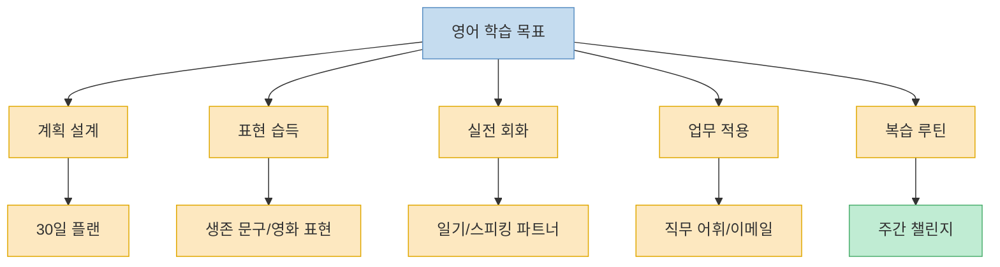
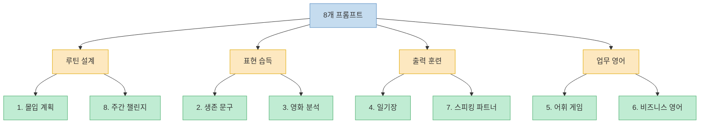
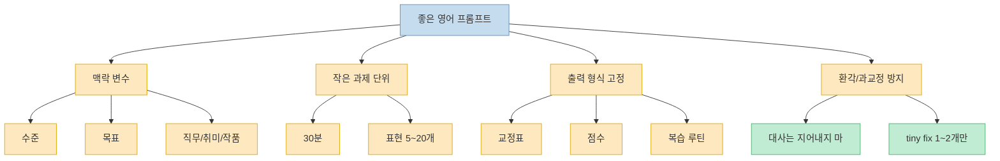

이 Threads 포스트는 아주 강한 문장으로 시작한다. `"스픽/듀오링고 AI 영어 지금 바로 삭제해"`라는 카피를 앞세우지만, 실제 본문을 보면 핵심은 앱 비판 자체보다 **ChatGPT를 영어 학습 워크플로 엔진처럼 쓰는 8개의 프롬프트 패턴** 에 있다. 즉 한 가지 앱을 오래 붙잡는 대신, `계획`, `생존 표현`, `영화 분석`, `일기`, `직무 어휘`, `비즈니스 영어`, `대화 파트너`, `주간 챌린지`처럼 목적별로 ChatGPT를 다르게 호출하라는 제안이다. 이 글은 그 8개 프롬프트를 그대로 옮기기보다, 각각이 무엇을 해결하려는지와 실제로 어떻게 써먹으면 좋을지를 구조적으로 다시 정리한 것이다. 이 비교 우위 자체는 원 출처의 단일 주장이라는 점도 함께 감안해서 읽는 편이 좋다. [Threads 원문](https://www.threads.com/@ai__frontier/post/DWye2cFE2Cd)

<!--more-->

## Sources

- [Threads: @ai__frontier — "스픽/듀오링고 AI 영어 지금 바로 삭제해"](https://www.threads.com/@ai__frontier/post/DWye2cFE2Cd)

---

## 이 Threads가 제안하는 방식은 `영어 앱`이 아니라 `영어 작업 흐름`이다

이 포스트의 8개 프롬프트를 보면 공통점이 있다. 전부 `정답을 알려 달라`보다 `상황에 맞는 학습 흐름을 설계해 달라`는 요청으로 짜여 있다. 예를 들어 첫 번째 프롬프트는 내 수준과 목표를 넣으면 30분 기준 30일 플랜을 짜 달라고 하고, 여덟 번째 프롬프트는 좋아하는 시리즈 한 편으로 7일 챌린지를 설계해 달라고 한다. 즉 영어 학습을 단일 기능 앱 하나로 해결하기보다, ChatGPT를 `개인 교사 + 커리큘럼 설계자 + 피드백 도구`처럼 쓰려는 접근이다. [Threads 원문](https://www.threads.com/@ai__frontier/post/DWye2cFE2Cd)

특히 흥미로운 점은 프롬프트 대부분이 `출력 형식`까지 구체적으로 지정한다는 것이다. 주차별 목표, 복습일, 대체 루틴, IPA 발음, 공손한 버전, 쉐도잉 포인트, 교정표, 점수 체계, 슬랙용 한 줄 버전 같은 요구가 모두 포함돼 있다. 이 말은 결국 "영어를 잘하게 해줘" 같은 막연한 요청보다, **영어 공부를 어떤 단위 작업으로 쪼갤지부터 명확히 설계해야 ChatGPT가 쓸 만해진다** 는 뜻이다. [Threads 원문](https://www.threads.com/@ai__frontier/post/DWye2cFE2Cd)

---

## 8개 프롬프트는 사실 네 가지 학습 목적에 대응한다

첫째는 `루틴 설계`다. 1번 `몰입 계획`은 수준과 목표를 넣으면 유튜브·팟캐스트·영화 클립만으로 30일 플랜을 짜 달라고 한다. 8번 `주간 챌린지`는 좋아하는 시리즈 한 에피소드로 7일 루틴을 만들어 달라고 요청한다. 둘 다 핵심은 `무엇을 공부할까`가 아니라 `어떻게 매일 이어갈까`에 있다. 복습일, 놓쳤을 때 대체 루틴, 포기했을 때 재시작 루틴을 넣어 달라고 한 것도 같은 맥락이다. [Threads 원문](https://www.threads.com/@ai__frontier/post/DWye2cFE2Cd)

둘째는 `즉시 써먹는 표현 확보`다. 2번 `생존 문구`는 영어권 국가 첫날 필요한 핵심 표현 20개를 골라 달라고 하고, 각 표현마다 IPA, 짧은 예문, 한국인이 자주 하는 실수, 더 공손한 버전까지 붙여 달라고 한다. 3번 `영화 분석`은 붙여넣은 대사를 기준으로 일상 표현 5개를 뜻, 활용, 비슷한 표현, 쉐도잉 포인트와 함께 설명해 달라고 한다. 여기서 중요한 문장은 `"대사는 지어내지 마"`다. 즉 AI에게 창작을 시키기보다, **실제 대사 기반으로 학습용 해설을 만드는 역할** 을 맡긴 것이다. [Threads 원문](https://www.threads.com/@ai__frontier/post/DWye2cFE2Cd)

셋째는 `출력 훈련`이다. 4번 `일기장` 프롬프트는 한국어로 적은 하루를 쉬운 영어 일기, 더 자연스러운 버전, 어색한 표현 교정표, 외울 표현 3개로 바꾸라고 한다. 7번 `스피킹 파트너`는 내 취미와 수준을 주고 5문장 대화를 시작하게 한 뒤, 내가 답하면 큰 첨삭 대신 `tiny fix 1~2개만` 해 달라고 요청한다. 이건 과도한 피드백으로 흐름을 끊지 않고, **말하기와 쓰기를 계속 이어 가도록 설계한 프롬프트** 라는 점에서 실용적이다. [Threads 원문](https://www.threads.com/@ai__frontier/post/DWye2cFE2Cd)

넷째는 `업무 맥락 학습`이다. 5번 `어휘 게임`은 직무를 넣고 업무용 영어 단어 퀴즈 10개를 한 문제씩 진행하게 하며, 힌트 → 답 대기 → 정답 → 예문 순서를 강제한다. 6번 `비즈니스 영어`는 회사에서 자주 쓰는 이메일 템플릿 5개를 주제별로 만들고, 제목 3개, 격식/비격식 버전, 자주 틀리는 표현, 슬랙용 한 줄 버전까지 달라고 한다. 이 두 개는 추상적인 영어 공부보다 **직무 생산성에 곧바로 연결되는 영어 출력물** 을 만드는 데 초점이 있다. [Threads 원문](https://www.threads.com/@ai__frontier/post/DWye2cFE2Cd)

---

## 그대로 복붙하기보다, 왜 이 구조가 잘 작동하는지 이해하는 편이 좋다

이 Threads의 프롬프트가 유용한 이유는 전부 `맥락 변수`를 먼저 받기 때문이다. 수준, 목표, 직무, 취미, 작품명, 장면, 하루 시간, 좋아하는 시리즈 같은 값이 먼저 들어가고, 그다음 출력 포맷이 세부적으로 따라온다. 이 구조는 모델이 너무 일반적인 답을 하지 못하게 막고, 사용자의 실제 상황에 맞게 답을 좁혀 준다. 따라서 같은 프롬프트라도 빈칸을 얼마나 구체적으로 채우느냐가 결과 품질을 크게 바꿀 가능성이 높다. [Threads 원문](https://www.threads.com/@ai__frontier/post/DWye2cFE2Cd)

또 하나는 `과제 단위`가 작다는 점이다. 하루 30분, 표현 20개, 일상 표현 5개, 퀴즈 10개, 이메일 템플릿 5개, 5문장 대화처럼 결과물이 작은 단위로 쪼개져 있다. 이건 AI 영어 학습에서 꽤 중요하다. 너무 긴 커리큘럼이나 지나치게 많은 문장을 한 번에 요구하면, 사용자는 실행하지 못하고 모델 답변도 두루뭉술해지기 쉽다. 반면 작은 단위 작업은 바로 복붙해 실행하기 좋고, 매일 반복하기도 쉽다. [Threads 원문](https://www.threads.com/@ai__frontier/post/DWye2cFE2Cd)

특히 3번 `영화 분석`과 7번 `스피킹 파트너`는 AI 학습에서 흔한 문제를 잘 피한다. 하나는 "대사를 지어내지 마"라고 명시해 환각 가능성을 낮추고, 다른 하나는 `tiny fix 1~2개만` 하라고 제한해 과도한 교정으로 대화 몰입이 깨지는 문제를 줄인다. 즉 이 포스트는 화려한 기능을 자랑하기보다, **AI 영어 학습에서 실패하기 쉬운 지점들을 프롬프트 설계로 막으려는 시도** 로 읽을 수 있다. [Threads 원문](https://www.threads.com/@ai__frontier/post/DWye2cFE2Cd)

---

## 이 8개를 실제 영어 루틴으로 묶는다면 이렇게 쓸 수 있다

이 포스트를 실전 루틴으로 바꾸면 훨씬 단순하다. 월요일에는 `몰입 계획`으로 주간 루틴을 점검하고, 화요일과 수요일에는 `생존 문구`나 `영화 분석`으로 입력을 확보하고, 목요일에는 `일기장`으로 출력 연습을 하고, 금요일에는 `어휘 게임`이나 `비즈니스 영어`로 직무 영어를 다지고, 주말에는 `스피킹 파트너`와 `주간 챌린지`로 회화와 복습을 묶는 식이다. 원문은 8개를 개별 카드로 제시하지만, 실제 가치는 이 카드들을 **한 주 학습 시스템** 으로 엮을 때 더 커진다. [Threads 원문](https://www.threads.com/@ai__frontier/post/DWye2cFE2Cd)

또 앱을 완전히 버리라는 식으로 읽기보다, 내게 부족한 부분을 ChatGPT로 보완하는 방식으로 읽는 편이 현실적이다. 예를 들어 앱이 반복 훈련에는 여전히 편할 수 있지만, 내 직무에 맞는 단어 퀴즈, 내가 본 영화 장면의 표현 분석, 내가 실제로 겪은 일을 영어 일기로 바꾸는 일은 범용 앱보다 ChatGPT가 더 유연할 수 있다. 그러니 이 Threads의 강한 첫 문장은 카피로 받아들이고, 실질적으로는 **앱형 학습과 프롬프트형 학습의 장단을 나눠 쓰는 힌트** 로 보는 편이 안전하다. [Threads 원문](https://www.threads.com/@ai__frontier/post/DWye2cFE2Cd)

---

## 핵심 요약

- 이 Threads 포스트의 실질적 내용은 `앱 삭제`보다 `영어 학습 목적별 ChatGPT 프롬프트 8개` 공개에 있다. [Threads 원문](https://www.threads.com/@ai__frontier/post/DWye2cFE2Cd)
- 8개 프롬프트는 크게 `루틴 설계`, `표현 습득`, `출력 훈련`, `업무 영어`의 네 범주로 묶을 수 있다. [Threads 원문](https://www.threads.com/@ai__frontier/post/DWye2cFE2Cd)
- 좋은 점은 수준·목표·직무·취미 같은 맥락 변수와 출력 형식을 구체적으로 지정한다는 점이다. 그래서 모델 답변을 실전용으로 좁히기 쉽다. [Threads 원문](https://www.threads.com/@ai__frontier/post/DWye2cFE2Cd)
- `대사는 지어내지 마`, `tiny fix 1~2개만` 같은 문구는 AI 영어 학습에서 흔한 환각과 과교정 문제를 줄이려는 설계로 읽힌다. [Threads 원문](https://www.threads.com/@ai__frontier/post/DWye2cFE2Cd)
- 다만 `스픽/듀오링고를 삭제하라`는 비교 우위 주장은 이 Threads 원문의 단일 주장일 뿐, 이 글에서 별도 검증한 결론은 아니다. [Threads 원문](https://www.threads.com/@ai__frontier/post/DWye2cFE2Cd)

---

## 결론

이 포스트가 유용한 이유는 ChatGPT를 `영어 선생님`이라고만 부르지 않고, 더 정확히는 `영어 학습 운영체제`처럼 쓰게 만든다는 데 있다. 무엇을 외울지, 어떤 표현을 뽑을지, 어떤 형식으로 교정할지, 얼마나 작은 단위로 반복할지를 프롬프트 안에서 결정해 버리기 때문이다. [Threads 원문](https://www.threads.com/@ai__frontier/post/DWye2cFE2Cd)

그래서 이 8개 프롬프트의 가치는 카드 이미지를 저장해 두는 데서 끝나지 않는다. 내 수준, 목표, 직무, 취미를 넣어 실제 루틴으로 돌려 보고, 영화 대사와 일기, 업무 메일처럼 내가 당장 써야 하는 맥락에 붙였을 때 비로소 힘이 생긴다. 앱 하나를 지우느냐보다 더 중요한 건, **영어를 내 일상과 일에 붙는 작업 단위로 잘게 쪼개는 것** 이다. [Threads 원문](https://www.threads.com/@ai__frontier/post/DWye2cFE2Cd)
