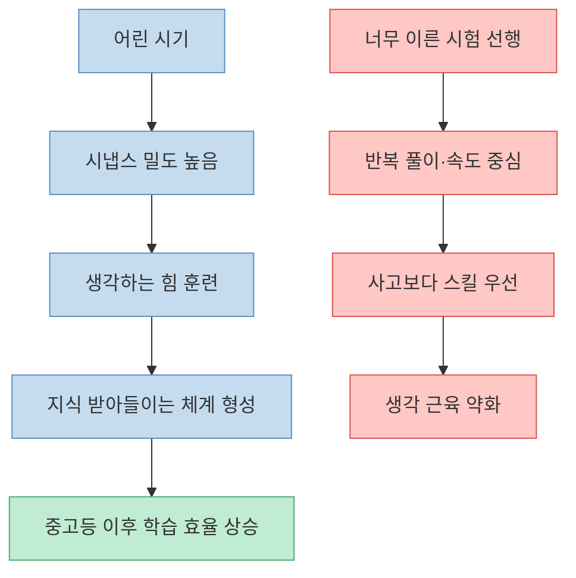
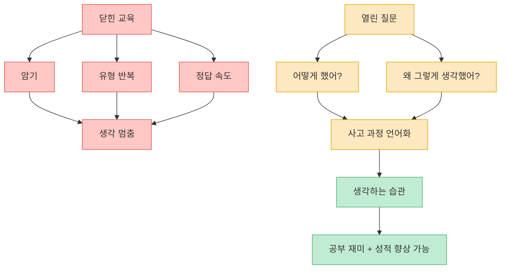
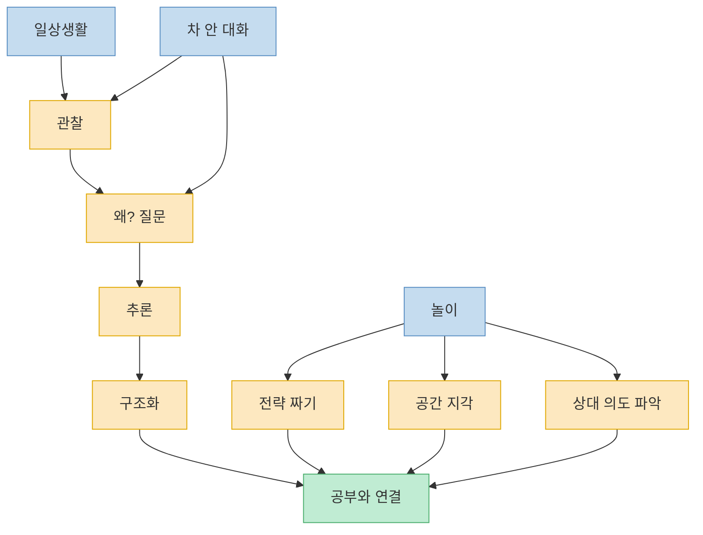

이 영상의 핵심 주장은 분명하다. 아이의 공부 성적을 가르는 것은 단순히 `얼마나 빨리 선행했는가`가 아니라, **어릴 때 얼마나 많이 생각했고, 관찰했고, 질문받았고, 놀면서 머리를 썼는가** 에 더 가깝다는 것이다. 진행 중인 시험을 잘 치게 만드는 기술보다, 나중에 지식을 받아들이고 정리하고 판단하는 `공부하는 뇌의 구조`를 먼저 만들어야 한다는 이야기다. 그래서 영상은 조기 선행, 유형 반복, 기계적 연산보다 `열린 질문`, `놀이`, `일상 속 관찰`, `멍한 여백`, `차 안 대화` 같은 요소를 더 중요한 기반으로 제시한다. [(0:00)](https://youtu.be/PytPf5tSnFc?t=0), [(0:32)](https://youtu.be/PytPf5tSnFc?t=32), [(9:40)](https://youtu.be/PytPf5tSnFc?t=580), [(16:37)](https://youtu.be/PytPf5tSnFc?t=997)

<!--more-->

## Sources

- ["이것 하나로 공부 성적이 갈린다?" 아이의 완벽한 공부 뇌 발달을 위해 영유 조기교육보다 더 중요한 '이것' (이창준 작가 1부)](https://www.youtube.com/watch?v=PytPf5tSnFc) — 데일리어썸 DAILY AWESOME

---

## 왜 영상은 조기 선행보다 `생각하는 힘`을 먼저 말하나

영상은 어린 시기가 중요한 이유를 뇌과학 언어로 설명한다. 초등 저학년 무렵에는 시냅스 밀도가 성인보다 높아 뇌가 더 말랑하고, 이 시기에 사고력과 생각을 구조화하는 훈련을 해 주는 것이 훗날 지식을 받아들이는 체계를 만드는 데 더 효과적이라는 것이다. 그래서 이 시기에는 지식을 빨리 주입하기보다, 생각하는 법과 머리를 쓰는 법을 먼저 길러야 한다고 말한다. [(0:32)](https://youtu.be/PytPf5tSnFc?t=32), [(0:40)](https://youtu.be/PytPf5tSnFc?t=40), [(0:48)](https://youtu.be/PytPf5tSnFc?t=48), [(0:55)](https://youtu.be/PytPf5tSnFc?t=55)

이 관점에서 영상이 비판하는 것은 `시험 공부를 너무 일찍 시작하는 것`이다. 아직 생각하는 습관이 자리잡기 전에 7~8년 뒤에 볼 시험을 미리 대비시키고, 똑같은 문제를 반복해서 풀게 하고, 시험 스킬을 먼저 익히게 만드는 방식은 아이의 사고를 키우기보다 오히려 줄여 버린다고 본다. 시험 공부는 이미 가진 지식을 최대한 빨리 꺼내 쓰는 활동인데, 아직 머리가 더 자라고 체력이 붙어야 하는 시기에 그 기술을 먼저 훈련시키면 사고보다 반응 속도만 강조되는 구조가 된다는 것이다. [(1:03)](https://youtu.be/PytPf5tSnFc?t=63), [(1:25)](https://youtu.be/PytPf5tSnFc?t=85), [(1:37)](https://youtu.be/PytPf5tSnFc?t=97), [(1:50)](https://youtu.be/PytPf5tSnFc?t=110)

영상은 이를 골프 비유로 설명한다. 스윙 자체를 제대로 알려주지 않은 채 코스를 반복해 돌게 하면, 원래 잘 치는 애들만 살아남는다는 것이다. 공부도 마찬가지로, 지능이 좋아서 원래 알아서 머리를 쓰는 아이만 살아남는 구조가 아니라, 머리를 쓰는 법을 직접 알려 주는 구조여야 한다고 말한다. 이 대목의 핵심은 `타고난 재능`보다 `사고 습관의 훈련 가능성`을 더 크게 본다는 점이다. [(2:16)](https://youtu.be/PytPf5tSnFc?t=136), [(2:47)](https://youtu.be/PytPf5tSnFc?t=167), [(3:12)](https://youtu.be/PytPf5tSnFc?t=192), [(3:24)](https://youtu.be/PytPf5tSnFc?t=204)

---

## 아이들은 왜 문제집보다 질문에서 더 많이 생각하나

영상의 가장 강한 메시지 중 하나는, 아이들이 원래 생각을 못 하는 존재가 아니라 **어른이 생각 못 하게 만드는 경우가 많다** 는 것이다. 구구단을 외우게 해 놓고 원리를 생각하라고 하고, 유형 문제를 반복시켜 놓고 창의적으로 풀라고 하고, 작가의 의도를 맞추게 하면서 창의적으로 읽으라고 하는 식의 교육은 아이에게 인지적 부조화를 만든다고 말한다. 즉 사고를 요구하는 척하지만 실제로는 정답을 빨리 맞히는 반응만 길러 주고 있다는 비판이다. [(3:29)](https://youtu.be/PytPf5tSnFc?t=209), [(3:52)](https://youtu.be/PytPf5tSnFc?t=232), [(4:04)](https://youtu.be/PytPf5tSnFc?t=244), [(4:20)](https://youtu.be/PytPf5tSnFc?t=260)

이 대목에서 영상은 해결책으로 `열린 질문`을 제시한다. 아이가 무엇을 어떻게 계산했는지, 왜 그렇게 생각했는지, 다른 방법은 없는지 묻고 기다려 주면 아이들은 그 과정 자체를 재미있어 한다는 것이다. 실제로 수학을 싫어하던 아이도 "너는 이걸 어떻게 했어?"라는 질문을 받는 순간 생각하는 활동으로 전환되고, 그 경험이 반복되면 공부 자체를 재미있는 것으로 느낄 수 있다고 말한다. [(4:26)](https://youtu.be/PytPf5tSnFc?t=266), [(5:00)](https://youtu.be/PytPf5tSnFc?t=300), [(6:03)](https://youtu.be/PytPf5tSnFc?t=363), [(6:20)](https://youtu.be/PytPf5tSnFc?t=380)

또 이창준 작가는 성적 사례를 통해, 적절한 질문과 사고 훈련이 시험 성적까지 연결될 수 있다고 말한다. 수학 점수 20점대이던 학생이 몇 달 뒤 90점대로 올라오거나, 평균 70점대이던 학생이 반 1등까지 올라온 경험을 예로 들며, `좋은 대학을 갈 정도의 공부력`은 반드시 특별한 재능의 영역은 아니라고 주장한다. 이 부분은 부모의 기대치를 `천재 만들기`가 아니라 `동네에서 공부 잘하는 아이 만들기` 정도로 조정하면, 생각하는 습관 훈련만으로도 충분히 닿을 수 있는 영역이라는 메시지로 읽힌다. [(4:57)](https://youtu.be/PytPf5tSnFc?t=297), [(5:12)](https://youtu.be/PytPf5tSnFc?t=312), [(5:30)](https://youtu.be/PytPf5tSnFc?t=330), [(5:48)](https://youtu.be/PytPf5tSnFc?t=348)

---

## 영상이 말하는 진짜 공부 환경: 놀이, 관찰, 일상 연결

후반부에서 영상은 공부를 책상 앞 활동으로만 한정하지 말라고 말한다. 관찰과 질문이 반복되면 일상과 공부가 이어지기 시작하고, 이 연결을 만드는 가장 중요한 습관이 `관찰`이라고 본다. 예를 들어 흐린 날 하늘은 왜 회색처럼 보이는지, 어떤 지역은 분위기가 왜 다른지, 사람들은 왜 저기 줄을 서는지 같은 질문을 일상에서 붙이는 것이 곧 공부라는 것이다. 이때 중요한 것은 부모가 문제집 앞에서 쓰는 에너지의 일부를 떼어, 아이와 같이 보고 묻고 추론하는 데 쓰는 것이다. [(7:44)](https://youtu.be/PytPf5tSnFc?t=464), [(8:07)](https://youtu.be/PytPf5tSnFc?t=487), [(8:36)](https://youtu.be/PytPf5tSnFc?t=516), [(8:52)](https://youtu.be/PytPf5tSnFc?t=532), [(9:31)](https://youtu.be/PytPf5tSnFc?t=571)

특히 영상은 `놀이`를 머리를 가장 많이 쓰는 시간으로 본다. 아이들은 놀 때 공간 지각, 전략 짜기, 상대 의도 파악, 추론, 감정 캐치 같은 고차 활동을 활발하게 한다는 것이다. 어른 눈에는 시간 낭비처럼 보여도, 실제로는 전두엽을 쓰는 훈련이 놀이 속에서 많이 일어나며, 이것이 오히려 공부 뇌를 만드는 핵심 연습이라는 설명이다. 그래서 `어릴 때 놀게 해 주자`는 감성적 주장이 아니라, **그 시기에만 충분히 할 수 있는 중요한 두뇌 활동을 확보해야 한다** 는 주장에 가깝다. [(9:40)](https://youtu.be/PytPf5tSnFc?t=580), [(10:01)](https://youtu.be/PytPf5tSnFc?t=601), [(10:25)](https://youtu.be/PytPf5tSnFc?t=625), [(10:38)](https://youtu.be/PytPf5tSnFc?t=638), [(12:29)](https://youtu.be/PytPf5tSnFc?t=749)

또 하나 중요한 포인트는 `자동차 안 대화`다. 영상은 차 안을 아이의 공부 습관이 형성되는 결정적 공간으로 본다. 번호판 숫자를 보며 패턴을 찾고, 지나가는 풍경을 보며 사회 문제를 질문하고, 지역 분위기의 차이를 비교하게 하는 식의 대화가 머리를 계속 쓰게 만든다는 것이다. 차 안은 도망갈 수도 없고 다른 걸 하기도 애매해, 질문과 관찰을 이어 가기 좋은 장소로 제시된다. 결국 이 파트의 메시지는 공부와 일상은 분리된 것이 아니라, 일상에 사고 훈련을 심어 두면 문제 읽기, 조건 포착, 함정 회피 같은 시험 역량까지 연결된다는 데 있다. [(12:34)](https://youtu.be/PytPf5tSnFc?t=754), [(12:47)](https://youtu.be/PytPf5tSnFc?t=767), [(13:08)](https://youtu.be/PytPf5tSnFc?t=788), [(13:28)](https://youtu.be/PytPf5tSnFc?t=808), [(14:04)](https://youtu.be/PytPf5tSnFc?t=844)

---

## 멍한 시간과 `마법의 두 질문`은 왜 중요하다고 하나

영상은 공부에서 `여백`도 핵심이라고 말한다. 아이가 놀거나 쉬거나 공부하지 않을 때, 오히려 배우는 것이 있다는 것이다. 여기서 언급되는 개념이 디폴트 모드 네트워크다. 뇌가 집중 과제를 수행하지 않고 멍한 상태일 때 활성화되는 영역이 있고, 이때 지식이 정리되고, 아이디어가 연결되고, 감정도 정리된다고 설명한다. 뉴턴이나 아르키메데스 같은 예시를 끌어오며, 오히려 멈춘 순간에 창조적·생산적 활동이 일어난다고 강조한다. 그래서 영상은 `공부에서 떠나 있는 시간`도 두뇌 발달의 일부로 본다. [(10:45)](https://youtu.be/PytPf5tSnFc?t=645), [(10:52)](https://youtu.be/PytPf5tSnFc?t=652), [(11:15)](https://youtu.be/PytPf5tSnFc?t=675), [(11:31)](https://youtu.be/PytPf5tSnFc?t=691), [(11:39)](https://youtu.be/PytPf5tSnFc?t=699)

마지막에 제시하는 실전 도구는 두 가지 질문이다. 첫 번째는 `"확실해?"`, 두 번째는 `"왜 그렇게 생각해?"`다. 이 두 질문은 아이에게 정답을 빨리 말하게 하기보다, 지금 정말 판단하고 말하는지, 그 판단의 근거가 무엇인지 스스로 되짚게 만든다고 한다. 처음에는 아이가 당황할 수 있지만, 이런 질문이 반복되면 대화의 질이 달라지고 생각하는 근육이 붙기 시작한다고 말한다. [(16:37)](https://youtu.be/PytPf5tSnFc?t=997), [(16:47)](https://youtu.be/PytPf5tSnFc?t=1007), [(16:58)](https://youtu.be/PytPf5tSnFc?t=1018), [(17:22)](https://youtu.be/PytPf5tSnFc?t=1042), [(17:53)](https://youtu.be/PytPf5tSnFc?t=1073)

중요한 점은 이 질문도 무작정 던지라는 뜻은 아니라는 것이다. 영상은 먼저 아이에게 생각하는 힘이 중요하다는 공감대를 만들고, 앞으로 `"확실해?"`를 자주 물어보겠다고 미리 설명하라고 말한다. 즉 이 질문은 심문 도구가 아니라, 아이의 사고 과정을 끌어올리는 대화 습관으로 설계돼야 한다. 이 점까지 지켜야 비로소 마법의 질문이 `부담`이 아니라 `생각 훈련`이 된다. [(17:08)](https://youtu.be/PytPf5tSnFc?t=1028), [(17:15)](https://youtu.be/PytPf5tSnFc?t=1035), [(17:28)](https://youtu.be/PytPf5tSnFc?t=1048), [(17:35)](https://youtu.be/PytPf5tSnFc?t=1055)

---

## 핵심 요약

- 영상은 어린 시기 공부의 핵심을 `지식 선행`보다 `생각하는 힘과 구조화 능력의 형성`으로 본다. [(0:40)](https://youtu.be/PytPf5tSnFc?t=40), [(0:55)](https://youtu.be/PytPf5tSnFc?t=55)
- 너무 이른 시험식 선행, 반복 풀이, 유형 훈련은 사고보다 반응을 먼저 길러 아이의 생각 근육을 약화시킬 수 있다고 본다. [(1:25)](https://youtu.be/PytPf5tSnFc?t=85), [(1:50)](https://youtu.be/PytPf5tSnFc?t=110), [(3:29)](https://youtu.be/PytPf5tSnFc?t=209)
- 아이는 원래 생각을 못 하는 게 아니라, 좋은 질문을 받으면 생각하는 과정을 재미있어할 수 있다고 말한다. [(4:26)](https://youtu.be/PytPf5tSnFc?t=266), [(6:03)](https://youtu.be/PytPf5tSnFc?t=363)
- 놀이, 관찰, 차 안 대화 같은 일상 활동이 실제로는 공부와 이어지며, 문제 읽기와 구조화 능력까지 연결된다고 설명한다. [(9:40)](https://youtu.be/PytPf5tSnFc?t=580), [(12:47)](https://youtu.be/PytPf5tSnFc?t=767), [(14:50)](https://youtu.be/PytPf5tSnFc?t=890)
- `멍한 여백`은 디폴트 모드 네트워크를 통해 정리와 창의성을 돕는 시간으로 제시되고, 부모가 바로 쓸 수 있는 질문으로는 `"확실해?"`, `"왜 그렇게 생각해?"` 두 가지가 제안된다. [(10:52)](https://youtu.be/PytPf5tSnFc?t=652), [(11:31)](https://youtu.be/PytPf5tSnFc?t=691), [(16:37)](https://youtu.be/PytPf5tSnFc?t=997)

---

## 결론

이 영상이 던지는 메시지는 단순하다. 공부를 잘하게 만들고 싶다면, 공부를 너무 일찍 `시험 기술`로만 정의하지 말라는 것이다. 어릴 때 필요한 것은 더 많은 문제집이 아니라, 더 많은 질문, 더 많은 관찰, 더 많은 놀이, 그리고 멍하게 정리할 여백이다. [(0:00)](https://youtu.be/PytPf5tSnFc?t=0), [(9:40)](https://youtu.be/PytPf5tSnFc?t=580), [(11:39)](https://youtu.be/PytPf5tSnFc?t=699)

실전적으로 옮기면 어렵지 않다. 아이에게 정답을 빨리 맞히게 하기보다 `"확실해?"`, `"왜 그렇게 생각해?"`를 더 자주 묻고, 차 안이나 산책길에서 보이는 것들을 같이 관찰하고, 놀 때 머리를 쓰는 시간을 함부로 `놀기만 한다`고 깎아내리지 않는 것이다. 영상이 말하는 공부 머리는 결국 책상 앞에서만 만들어지는 능력이 아니라, **일상 속에서 생각해 본 횟수** 로 만들어지는 능력에 더 가깝다. [(13:46)](https://youtu.be/PytPf5tSnFc?t=826), [(16:58)](https://youtu.be/PytPf5tSnFc?t=1018), [(17:53)](https://youtu.be/PytPf5tSnFc?t=1073)
