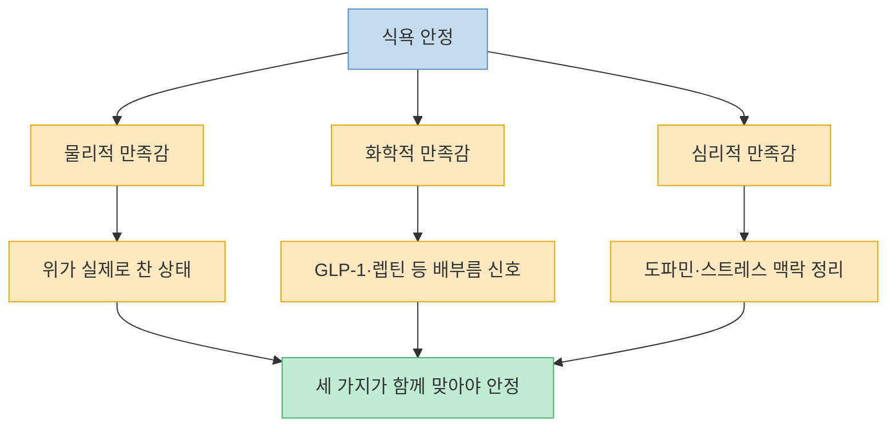
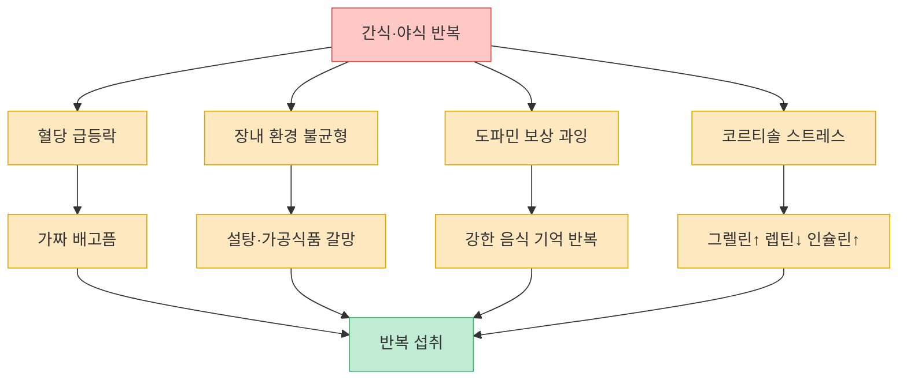
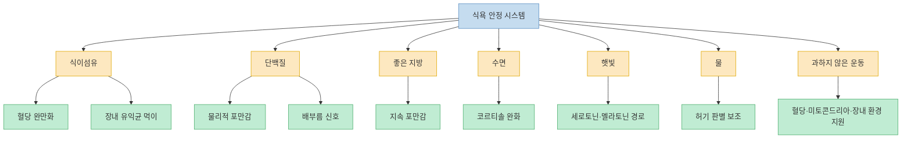

이 영상은 `식욕을 참는 법`보다 `식욕이 덜 올라오게 만드는 몸의 조건`에 초점을 둔다. 간식, 군것질, 야식이 반복되는 이유를 의지 부족이 아니라 `물리적 만족감`, `화학적 만족감`, `심리적 만족감`이 어긋난 상태로 설명하고, 여기에 혈당 급등락, 장내 환경, 도파민 보상, 코르티솔 스트레스, 수면 부족까지 연결한다. 그래서 해결책도 단순 칼로리 절제가 아니라 `혈당을 완만하게 만들고`, `장내 환경을 바꾸고`, `도파민 경로를 음식 밖으로 넓히고`, `충분히 자고`, `식이섬유·단백질·좋은 지방으로 배고픔 레벨을 운영하라`는 쪽으로 나온다. [(0:08)](https://youtu.be/KEsCIx2lzls?t=8), [(1:39)](https://youtu.be/KEsCIx2lzls?t=99), [(5:05)](https://youtu.be/KEsCIx2lzls?t=305), [(10:20)](https://youtu.be/KEsCIx2lzls?t=620), [(23:59)](https://youtu.be/KEsCIx2lzls?t=1439)

<!--more-->

## Sources

- [나도 모르게 과자를 뜯고 있다면, 반드시 '이렇게' 해보세요 l 고장난 식욕을 고치는 가장 확실한 방법](https://www.youtube.com/watch?v=KEsCIx2lzls) — 다이어트하는 사람들

---

## 이 영상이 말하는 핵심: 배고픔은 한 종류가 아니다

영상은 배고픔을 하나로 보지 않는다. 첫째는 위가 실제로 차 있느냐의 문제인 `물리적 만족감`, 둘째는 GLP-1·렙틴 같은 배부름 신호가 뇌로 충분히 전달되느냐의 문제인 `화학적 만족감`, 셋째는 스트레스·도파민 보상 같은 맥락에서 무언가를 먹고 싶어지는 `심리적 만족감`이다. 이 세 층이 다 맞아떨어져야 식욕이 안정되는데, 하나만 채우거나 둘만 채우면 결국 다른 층에서 허기가 다시 튀어나온다는 것이 영상의 기본 프레임이다. [(1:36)](https://youtu.be/KEsCIx2lzls?t=96), [(1:43)](https://youtu.be/KEsCIx2lzls?t=103), [(1:54)](https://youtu.be/KEsCIx2lzls?t=114), [(2:28)](https://youtu.be/KEsCIx2lzls?t=148), [(3:09)](https://youtu.be/KEsCIx2lzls?t=189)

여기서 중요한 포인트는 `물리적으로 배를 불렸다`와 `진짜로 만족했다`가 같지 않다는 점이다. 위가 차 있어도 혈당이 급락하거나 도파민 보상이 비어 있으면 다시 먹고 싶어질 수 있고, 반대로 위가 아주 차 있지 않아도 지방·단백질·호르몬 반응 덕분에 배고픔이 덜할 수도 있다고 설명한다. 그래서 영상은 단순히 "적게 먹고 버텨라"가 아니라, **어떤 만족감이 빠졌는지 먼저 구분하라** 고 말한다. [(2:06)](https://youtu.be/KEsCIx2lzls?t=126), [(2:35)](https://youtu.be/KEsCIx2lzls?t=155), [(3:14)](https://youtu.be/KEsCIx2lzls?t=194)

특히 심리적 만족감이 비어 있을 때가 위험하다고 본다. 물리적·화학적 만족만 맞춘 식사는 단기적으로는 버틸 수 있어도, 심리적으로 계속 억눌러진 상태가 남아 결국 폭식이나 요요로 이어질 수 있다는 것이다. 영상이 후반부에 "참는 다이어트가 아니라 시스템을 재설계하는 것"이라고 반복하는 이유도 이 구분 때문이다. [(3:17)](https://youtu.be/KEsCIx2lzls?t=197), [(3:27)](https://youtu.be/KEsCIx2lzls?t=207), [(22:43)](https://youtu.be/KEsCIx2lzls?t=1363)

---

## 영상이 꼽는 네 가지 원인: 혈당, 장내 환경, 도파민, 코르티솔

첫 번째 원인은 혈당 급등락이다. 영상은 혈당이 빠르게 오르면 인슐린이 과다 분비되고, 그 결과 평균 아래로 떨어지는 `혈당 크래시`가 오면서 다시 허기를 느끼게 된다고 설명한다. 이때 특징은 배가 실제로는 불러도, 몸은 다시 달달한 것을 찾게 된다는 점이다. 그래서 간식을 줄이려면 공복을 참는 것이 아니라, 아예 혈당이 완만하게 오르고 완만하게 내려가도록 식사를 설계해야 한다고 말한다. [(3:46)](https://youtu.be/KEsCIx2lzls?t=226), [(4:17)](https://youtu.be/KEsCIx2lzls?t=257), [(4:30)](https://youtu.be/KEsCIx2lzls?t=270), [(5:27)](https://youtu.be/KEsCIx2lzls?t=327)

두 번째 원인은 장내 환경이다. 영상은 유익균은 다이어트와 식욕 안정에 유리하고, 유해균은 설탕·밀가루·가공식품을 더 갈망하게 만든다고 설명한다. 그래서 평소 식단이 가공식품 중심이면 유해균 쪽이 커지고, 이때는 내가 먹고 싶은 게 아니라 장내 미생물이 뇌에 계속 신호를 보내고 있는 것처럼 느껴질 수 있다고 말한다. 이 부분은 장내 환경과 갈망을 매우 강하게 연결하는 설명이므로, 영상 내부 논리로 이해하는 편이 적절하다. [(5:44)](https://youtu.be/KEsCIx2lzls?t=344), [(5:56)](https://youtu.be/KEsCIx2lzls?t=356), [(6:19)](https://youtu.be/KEsCIx2lzls?t=379), [(6:47)](https://youtu.be/KEsCIx2lzls?t=407)

세 번째는 도파민 보상이다. 떡볶이, 초콜릿, 치킨처럼 강한 쾌락을 주는 음식이 100점짜리 도파민을 만든다고 하면, 닭가슴살과 야채처럼 너무 담백한 식단만으로는 그 차이를 견디지 못해 결국 무너질 수 있다고 영상은 말한다. 그래서 핵심은 모든 쾌락을 끊는 것이 아니라, `100점짜리 음식`을 `70~80점짜리 대체 음식`으로 바꿔 심리적 만족감을 유지하면서도 다이어트를 계속하는 방향이다. [(7:22)](https://youtu.be/KEsCIx2lzls?t=442), [(7:51)](https://youtu.be/KEsCIx2lzls?t=471), [(8:19)](https://youtu.be/KEsCIx2lzls?t=499), [(16:00)](https://youtu.be/KEsCIx2lzls?t=960)

네 번째는 코르티솔이다. 스트레스가 올라가면 그렐린 같은 배고픔 신호는 커지고, 렙틴 같은 배부름 신호는 줄고, 인슐린은 더 올라가기 쉬워져 당기는 음식이 강해진다고 설명한다. 영상은 특히 수면 부족과 과도한 운동을 대표적인 스트레스 환경으로 지목한다. 즉 식욕 조절 실패를 음식 선택의 문제로만 보지 말고, **잠을 못 잔 상태와 과부하 상태 자체가 이미 식욕을 흔드는 조건** 이라는 점을 먼저 보라는 것이다. [(9:23)](https://youtu.be/KEsCIx2lzls?t=563), [(9:35)](https://youtu.be/KEsCIx2lzls?t=575), [(9:50)](https://youtu.be/KEsCIx2lzls?t=590), [(10:10)](https://youtu.be/KEsCIx2lzls?t=610)

---

## 그래서 영상은 무엇을 먹고 어떻게 살아야 한다고 말하나

식단 파트의 기본은 `식이섬유 + 단백질 + 좋은 지방`이다. 식이섬유는 혈당을 빠르게 올리지 않게 하고, 장내 유익균의 먹이가 되며, 장내에서 만들어지는 대사 산물과 연결된다고 설명한다. 그래서 한 끼에 식이섬유를 충분히 확보하기 위해 통곡물, 콩류, 다양한 색의 채소를 먹으라고 권한다. 생채소가 부담되면 찌거나 볶아도 괜찮다고 말하는 점도 실전적이다. [(11:19)](https://youtu.be/KEsCIx2lzls?t=679), [(11:35)](https://youtu.be/KEsCIx2lzls?t=695), [(12:10)](https://youtu.be/KEsCIx2lzls?t=730), [(12:40)](https://youtu.be/KEsCIx2lzls?t=760)

단백질은 물리적 만족감과 화학적 만족감을 동시에 높이는 축으로 나온다. 소화 자체에 에너지가 더 들고, 위에서 천천히 내려가 포만감을 길게 유지하며, 배부름 신호와도 연결된다는 설명이다. 영상은 대략 체중과 근육량 상태에 따라 하루 섭취량을 조정하라고 하면서, 실전적으로는 한 끼에 단백질 30g 정도를 목표로 해 보라고 제안한다. 동물성·식물성 단백질을 골고루 먹고, 생선·계란·고기·콩류를 모두 활용할 수 있다고 말한다. [(13:11)](https://youtu.be/KEsCIx2lzls?t=791), [(13:34)](https://youtu.be/KEsCIx2lzls?t=814), [(14:35)](https://youtu.be/KEsCIx2lzls?t=875), [(14:55)](https://youtu.be/KEsCIx2lzls?t=895)

좋은 지방은 영상에서 `화학적 만족`과 `지속 포만감`을 늘리는 도구로 등장한다. 견과류, 연어·고등어 같은 생선, 올리브오일이나 들기름 같은 선택지를 예로 들며, 지방이 위에서 천천히 소화돼 오래 배부르게 만들고 혈당이 천천히 오르게 돕는다고 설명한다. 이 세 축을 묶으면 영상의 식사 원칙은 명확하다. **식사 자체를 든든하게 만들어 간식이 덜 끼어들 자리를 만드는 것** 이다. [(14:59)](https://youtu.be/KEsCIx2lzls?t=899), [(15:20)](https://youtu.be/KEsCIx2lzls?t=920), [(15:40)](https://youtu.be/KEsCIx2lzls?t=940), [(15:49)](https://youtu.be/KEsCIx2lzls?t=949)

여기에 더해 영상은 수면, 햇빛, 물, 운동을 식욕 조절 장치로 묶는다. 7~8시간 정도 질 좋은 수면은 코르티솔을 낮추고, 아침이나 점심 햇빛 노출은 세로토닌과 멜라토닌 경로를 통해 수면과 식욕 안정에 연결되며, 물은 허기 판별과 식욕 완화에 도움을 줄 수 있다고 설명한다. 운동은 장내 환경, 혈당 안정, 미토콘드리아 건강에 도움을 주지만, 과하면 오히려 식욕을 폭발시킬 수 있으므로 `존2 정도의 유산소`, `무리하지 않는 근력운동`, `몸 상태에 맞는 인터벌`을 강조한다. [(10:20)](https://youtu.be/KEsCIx2lzls?t=620), [(10:43)](https://youtu.be/KEsCIx2lzls?t=643), [(17:00)](https://youtu.be/KEsCIx2lzls?t=1020), [(19:47)](https://youtu.be/KEsCIx2lzls?t=1187), [(21:03)](https://youtu.be/KEsCIx2lzls?t=1263)

---

## 실전 팁으로 번역하면: 100점 음식 대신 70점 음식, 그리고 배고픔 레벨 관리

이 영상에서 가장 실용적인 대목은 `심리적 만족감을 대체하는 음식` 아이디어다. 치킨이 100점짜리라면 닭다리를 직접 구워 먹어 70~80점짜리 만족감을 만들고, 피자가 100점이라면 통밀 또띠아에 채소·고기·치즈를 얹어 구워 더 나은 대체식을 만들라는 식이다. 메시지는 엄격하다기보다 현실적이다. 닭가슴살만 고집하며 버티면 심리적 만족감이 비어 결국 터질 수 있으니, **완전히 금지하는 대신 덜 해로운 고득점 대체식을 찾으라** 는 것이다. [(16:04)](https://youtu.be/KEsCIx2lzls?t=964), [(16:18)](https://youtu.be/KEsCIx2lzls?t=978), [(16:32)](https://youtu.be/KEsCIx2lzls?t=992), [(16:47)](https://youtu.be/KEsCIx2lzls?t=1007)

또 하나는 `배고픔 레벨` 운영이다. 영상은 0부터 100까지 배고픔 수준을 상상하고, 완전히 0까지 떨어지기 전에 20~30 수준에서 섬유·단백질·좋은 지방이 있는 간식으로 다시 50~60까지 올려 주는 방식을 제안한다. 이렇게 하면 완전 공복 상태에서 허겁지겁 폭발적으로 먹는 것을 피할 수 있고, 아침-점심-저녁 리듬도 더 안정될 수 있다는 논리다. 이때 간식 후보로 방울토마토, 콩류, 채소 스틱, 삶은 달걀, 견과류 같은 예시가 등장한다. [(17:59)](https://youtu.be/KEsCIx2lzls?t=1079), [(18:36)](https://youtu.be/KEsCIx2lzls?t=1116), [(18:49)](https://youtu.be/KEsCIx2lzls?t=1129), [(19:11)](https://youtu.be/KEsCIx2lzls?t=1151)

마지막 메시지는 태도에 관한 것이다. 영상은 식욕 조절을 `참는 것`이 아니라 `몸의 시스템을 다시 설계하는 것`으로 보라고 말한다. 처음 3일, 1주일 정도는 힘들 수 있지만, 그 구간을 지나면 먹고 싶은 간식과 야식의 횟수 자체가 줄어드는 경험을 하게 될 수 있다고 말한다. 그리고 먹었다고 해서 자책하지 말고 그냥 이어가라고 조언한다. 이 부분이야말로 영상 전체를 하나로 묶는 결론이다. 식욕을 적으로 보지 말고, 몸이 그렇게 반응하지 않게 만드는 조건을 차근차근 바꾸라는 것이다. [(22:43)](https://youtu.be/KEsCIx2lzls?t=1363), [(22:51)](https://youtu.be/KEsCIx2lzls?t=1371), [(23:19)](https://youtu.be/KEsCIx2lzls?t=1399), [(23:59)](https://youtu.be/KEsCIx2lzls?t=1439)

---

## 핵심 요약

- 이 영상은 식욕 문제를 의지 부족이 아니라 `물리적·화학적·심리적 만족감의 불균형`으로 설명한다. [(1:39)](https://youtu.be/KEsCIx2lzls?t=99), [(3:09)](https://youtu.be/KEsCIx2lzls?t=189)
- 간식과 야식 반복의 주요 원인으로는 혈당 급등락, 장내 환경, 도파민 보상, 코르티솔 스트레스가 제시된다. [(3:46)](https://youtu.be/KEsCIx2lzls?t=226), [(5:44)](https://youtu.be/KEsCIx2lzls?t=344), [(7:22)](https://youtu.be/KEsCIx2lzls?t=442), [(9:23)](https://youtu.be/KEsCIx2lzls?t=563)
- 해결책의 중심은 `식이섬유 + 단백질 + 좋은 지방` 조합으로 식사를 든든하게 만들고, 수면·햇빛·물·운동으로 식욕 시스템을 보조하는 것이다. [(11:35)](https://youtu.be/KEsCIx2lzls?t=695), [(13:11)](https://youtu.be/KEsCIx2lzls?t=791), [(15:20)](https://youtu.be/KEsCIx2lzls?t=920), [(10:20)](https://youtu.be/KEsCIx2lzls?t=620)
- 심리적 만족을 위해서는 100점짜리 자극 식품을 무조건 끊기보다, 70~80점짜리 대체식을 찾아 폭식을 막으라고 제안한다. [(16:04)](https://youtu.be/KEsCIx2lzls?t=964), [(16:32)](https://youtu.be/KEsCIx2lzls?t=992)
- 실전 운영에서는 배고픔 레벨이 완전히 바닥나기 전에 20~30쯤에서 질 좋은 간식으로 조절하라는 프레임이 제시된다. [(17:59)](https://youtu.be/KEsCIx2lzls?t=1079), [(18:36)](https://youtu.be/KEsCIx2lzls?t=1116)

---

## 결론

이 영상이 반복해서 말하는 핵심은 단순하다. 간식을 끊는다는 것은 `먹고 싶은데 참는 것`이 아니라, 애초에 덜 당기게 만드는 몸 상태를 만드는 일이라는 것이다. 그래서 혈당, 장내 환경, 스트레스, 수면, 식사 조합을 함께 바꾸지 않으면, 어느 한 부분만 손봐서는 계속 간식과 야식이 반복될 수 있다고 본다. [(4:30)](https://youtu.be/KEsCIx2lzls?t=270), [(9:50)](https://youtu.be/KEsCIx2lzls?t=590), [(23:59)](https://youtu.be/KEsCIx2lzls?t=1439)

실전적으로 옮기면 거창한 비밀은 없다. 식사를 덜 빈약하게 만들고, 덜 못 자고, 덜 과로하고, 덜 극단적으로 운동하고, 덜 자극적인 대체식을 찾는 것이다. 그러면 식욕은 의지로 누르는 대상이라기보다, 조절 가능한 시스템으로 보이기 시작한다. [(10:20)](https://youtu.be/KEsCIx2lzls?t=620), [(15:49)](https://youtu.be/KEsCIx2lzls?t=949), [(22:43)](https://youtu.be/KEsCIx2lzls?t=1363)
