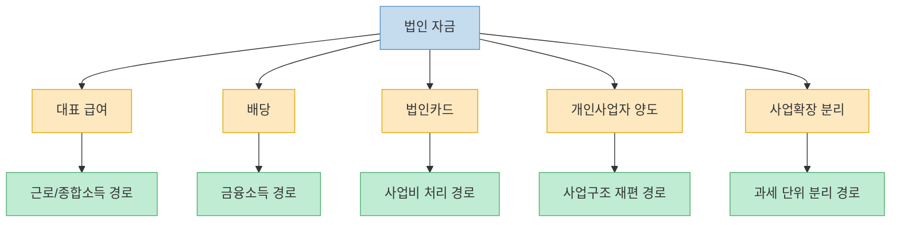
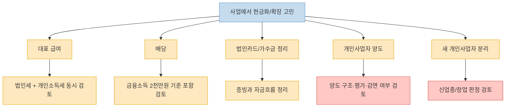

이 Threads 포스트는 `법인에서 돈을 빼는 방법`을 다섯 가지로 정리한다. 대표이사 급여, 배당, 법인카드, 개인사업자 양도, 사업 확장은 개인사업자로 분리하는 방식이다. 그런데 이 주제는 단순 팁으로 소비하면 위험하다. 같은 `돈을 빼는 행위`라도 어떤 것은 비교적 정석적인 지급 방식이고, 어떤 것은 업종·주주구성·다른 금융소득·기존 사업 구조에 따라 결과가 크게 달라진다. 그래서 이 글은 원문을 그대로 옮기기보다, **무엇이 일반 원칙이고 무엇이 개별 검토가 필요한지** 를 구분해서 읽는 데 목적을 둔다. 세무 이슈는 법·시행령·개별 사실관계에 따라 달라질 수 있으므로, 실제 집행 전에는 반드시 담당 세무사나 공식 컨설팅 창구와 다시 맞춰 보는 것이 전제다. [Threads 원문](https://www.threads.com/@yong_tax_/post/DWxjCqEgXDk)

<!--more-->

## Sources

- [Threads: @yong_tax_ — 법인에서 돈 빼는 방법(세금은 줄이고, 정당하게)](https://www.threads.com/@yong_tax_/post/DWxjCqEgXDk)
- [국세청 — 신청방법 및 혜택(창업중소기업 세액감면 등 공제·감면 컨설팅 안내)](https://j.nts.go.kr/nts/cm/cntnts/cntntsView.do?cntntsId=239071&mi=41094)
- [국세청 Web-TV — 창업중소기업 세액감면편](https://www.nts.go.kr/webtv/na/ntt/selectNttList.do?bbsId=50689&nttSn=1349238)
- [국세청 HOT토픽 — 금융소득 2천만원 초과자 종합과세대상자 언급 자료](https://call.nts.go.kr/call/na/ntt/selectNttList.do?bbsId=3077&mi=2366)

---

## 이 Threads가 말하는 핵심은 `불법 인출`이 아니라 `정식 경로 선택`이다

원문이 제시하는 다섯 가지를 하나로 묶는 공통점은 분명하다. 법인 돈을 개인이 마음대로 가져가는 것이 아니라, **세법상 이름이 붙어 있는 정식 경로로 이동시키라** 는 것이다. 대표이사 급여는 근로소득 경로, 배당은 금융소득 경로, 법인카드는 사업 관련 비용 처리 경로, 개인사업자 양도는 자산·사업 이전 경로, 사업확장을 개인사업자로 별도 운영하는 것은 아예 다른 과세 단위를 쓰는 전략으로 이해할 수 있다. 즉 원문은 "돈을 몰래 빼는 법"이 아니라 "법인이 개인에게 현금을 이전할 때 어떤 문으로 통과시키느냐"에 관한 이야기다. [Threads 원문](https://www.threads.com/@yong_tax_/post/DWxjCqEgXDk)

이 프레임이 중요한 이유는, 경로에 따라 세금 성격이 완전히 달라지기 때문이다. 급여는 법인 비용으로 빠질 수 있지만 대표 개인의 근로·종합소득 쪽으로 이어지고, 배당은 법인세를 낸 뒤 주주에게 가는 흐름이지만 개인 금융소득과 연결된다. 법인카드는 애초에 개인 소득 이전이 아니라 사업비 지출이므로 기준이 다르고, 개인사업자 양도나 신규 개인사업자 개설은 사업구조와 감면 요건까지 같이 봐야 한다. 결국 법인에서 돈을 뺀다는 말은 하나의 행동 같지만, 실제로는 **서로 다른 세목과 규정이 겹치는 선택 문제** 다. [Threads 원문](https://www.threads.com/@yong_tax_/post/DWxjCqEgXDk)

---

## 대표 급여와 배당은 왜 함께 봐야 하나

원문은 대표 급여에 대해 두 개의 숫자 기준을 제시한다. 당기순이익 2억 미만이면 0~5천만원, 대표 급여를 주고도 당기순이익이 2억 이상이면 1.3억원 선이 대체로 유리하다는 취지다. 하지만 이 숫자는 공식 세율표가 아니라, 원문 작성 세무사가 `개인 소득세와 법인세를 함께 고려했을 때 대체로 유리한 기준선`이라고 제시한 실무 감각에 가깝다. 따라서 이 문장을 그대로 외워 적용하기보다, **급여는 비용 처리 효과와 개인 누진세를 같이 봐야 한다는 방향성** 으로 이해하는 편이 맞다. [Threads 원문](https://www.threads.com/@yong_tax_/post/DWxjCqEgXDk)

배당도 마찬가지다. 원문은 법인에서 연 2천만원 이하로 배당하는 방식을 제안하고, 다른 이자·배당소득이 있으면 합산해서 2천만원 이하여야 한다고 적는다. 이 부분은 공식 자료와 방향이 맞닿아 있다. 국세청 자료에는 `금융소득 2천만원 초과자`가 종합과세 대상자로 언급되어 있어, 이자·배당 등 금융소득을 합산해서 2천만원 기준을 본다는 큰 틀 자체는 공식 자료와도 연결된다. 다만 실제로는 배우자 소득, 다른 금융소득, 건강보험료 영향, 기존 종합소득 규모 등까지 얽히므로, 배당은 단순히 `2천만원 이하로 맞추면 끝`이 아니라 **전체 개인 세무 구조 안에서 따져야 하는 선택지** 다. [Threads 원문](https://www.threads.com/@yong_tax_/post/DWxjCqEgXDk) [국세청 HOT토픽](https://call.nts.go.kr/call/na/ntt/selectNttList.do?bbsId=3077&mi=2366)

원문 댓글에서도 이 점이 드러난다. `연 2천만원 이하`가 주주 전체 기준인지 1인당 기준인지 묻는 질문에 작성자는 `받는 사람 기준`이라고 답한다. 즉 배당은 법인 전체 금액보다 결국 **누가 얼마를 받느냐** 가 중요하다는 뜻이다. 급여와 배당을 함께 봐야 하는 이유도 여기에 있다. 어느 한쪽으로만 몰면 다른 쪽 세 부담이 커질 수 있기 때문에, 대체로는 두 경로의 균형을 잡는 그림이 필요해진다. [Threads 원문](https://www.threads.com/@yong_tax_/post/DWxjCqEgXDk)

---

## 법인카드는 왜 `절세 도구`라기보다 `증빙 통로`에 가깝나

원문에서 가장 보수적이면서도 실무적인 부분은 법인카드다. 사업 관련 비용이라면 개인자금이 아니라 법인카드로 쓰고, 법인에 자금이 부족하면 개인 돈을 바로 써 버리지 말고 먼저 법인에 납입(대여)한 뒤 법인카드로 사용하라는 제안이 나온다. 이 말의 핵심은 법인카드 자체가 절세 비법이라는 뜻이 아니라, **사업비와 개인비를 섞지 말고 자금 흐름을 남기라** 는 데 있다. [Threads 원문](https://www.threads.com/@yong_tax_/post/DWxjCqEgXDk)

이 지점은 세율보다 증빙의 문제에 더 가깝다. 나중에 법인 돈인지 개인 돈인지, 회사 비용인지 대표 개인 소비인지가 흐려지면 세무상 더 큰 문제가 생길 수 있다. 원문 댓글에서 작성자가 가수금·가지급금 정리와 `줄 돈은 주고 받을 돈은 받자`는 식으로 말한 것도 같은 맥락이다. 임의 인출처럼 보이는 금액이 커질수록 리스크가 커지므로, 오히려 평소에 법인카드와 자금대여 구조를 분명히 남기는 쪽이 안전하다는 해석이 가능하다. [Threads 원문](https://www.threads.com/@yong_tax_/post/DWxjCqEgXDk)

이 범주의 포인트는 화려한 절세가 아니라 `정당성`이다. 세금 문제에서 가장 먼저 무너지는 것은 종종 세율이 아니라 증빙이다. 그래서 법인카드를 보수적으로 운영하는 방식은 당장 체감 이익이 작아 보여도, 장기적으로는 더 큰 분쟁을 줄이는 기본기 역할을 한다. [Threads 원문](https://www.threads.com/@yong_tax_/post/DWxjCqEgXDk)

---

## 개인사업자 양도와 사업 확장 분리는 왜 케이스 바이 케이스인가

원문에서 가장 공격적으로 들리는 문장은 `개인사업자를 법인에 넘기면 세금 60% 이상 감면 가능`이라는 표현이다. 하지만 이 부분은 다섯 항목 중에서도 특히 개별 사실관계에 따라 결과가 달라질 가능성이 큰 문장이다. 기존 개인사업자의 업종, 수익 구조, 법인과의 관계, 양도 방식, 자산 평가, 감면 규정 적용 가능성에 따라 결과가 크게 달라질 수 있기 때문이다. 따라서 이 문장은 일반 공식이라기보다, **특정 조건에서는 양도 구조가 세무상 유리할 수 있다** 는 정도로 읽는 편이 안전하다. [Threads 원문](https://www.threads.com/@yong_tax_/post/DWxjCqEgXDk)

사업 확장을 개인사업자로 하라는 조언도 마찬가지다. 원문 댓글에서 작성자는 이유를 두 가지로 든다. 첫째, `새로운 업종`이면 창업중소기업 세액감면 같은 제도를 새 사업자에서 검토할 수 있다는 점, 둘째, 그 개인사업자가 잘되면 나중에 다시 법인에 양도하면서 절세 기회가 생길 수 있다는 점이다. 이 중 첫 번째는 공식 자료와 일정 부분 맞물린다. 국세청은 창업중소기업 세액감면에 대해 감면대상 업종으로 `창업`한 경우를 전제로 설명하고 있고, 창업으로 보기 어려운 경우에는 감면 적용이 어렵다고 명시한다. 즉 원문의 취지는 "무조건 개인사업자가 유리하다"가 아니라, **새 업종/새 사업자로 인정되는지부터 따져 볼 여지가 있다** 는 의미에 가깝다. [Threads 원문](https://www.threads.com/@yong_tax_/post/DWxjCqEgXDk) [국세청 Web-TV](https://www.nts.go.kr/webtv/na/ntt/selectNttList.do?bbsId=50689&nttSn=1349238)

특히 이 영역은 단순 절세보다 `창업 여부 판정`과 `감면 요건 충족`이 훨씬 더 중요하다. 국세청 자료에서도 창업중소기업 세액감면은 감면대상 업종으로 창업하는 경우를 전제로 하고, 사업 양수 여부나 자산 인수 명세 등 입증자료를 요구한다. 따라서 개인사업자 신설이나 양도는 구조가 좋아 보여도, 실제로는 **감면 대상인지, 단순 확장인지, 재개업이나 업종 중복은 아닌지** 를 먼저 검토해야 한다. [국세청 컨설팅 안내](https://j.nts.go.kr/nts/cm/cntnts/cntntsView.do?cntntsId=239071&mi=41094) [국세청 Web-TV](https://www.nts.go.kr/webtv/na/ntt/selectNttList.do?bbsId=50689&nttSn=1349238)

---

## 공격적 절세보다 먼저 할 일: 현황 파악과 공식 컨설팅

원문 댓글에서 작성자는 `주식을 배우자에게 넘긴 뒤 매도`하거나 `자본을 늘렸다 줄였다 하는 방식` 같은 공격적인 방법들은 절세와 탈세의 줄타기를 아슬아슬하게 하는 경우가 많다고 직접 말한다. 이 문장이 오히려 원문 전체에서 가장 중요한 안전장치다. 즉 작성자 스스로도 합법 경계가 모호한 방법을 경계하고, 담당 세무사와 논의 후 진행하라고 권한다. [Threads 원문](https://www.threads.com/@yong_tax_/post/DWxjCqEgXDk)

또 다른 댓글에서는 이미 장부가 몇 년 꼬인 경우 어떻게 하느냐는 질문에, 먼저 현황 파악을 하고 가수금·가지급금부터 정리해야 한다고 답한다. 줄 돈은 주고, 받을 돈은 받고, 자료가 남지 않은 경우라도 가능한 선에서 모두 정리해 임의인출(횡령)로 추정되는 금액을 줄여야 한다는 취지다. 이 조언은 화려한 절세 팁보다 훨씬 현실적이다. 구조가 깨진 상태에선 급여든 배당이든 그 전에 정리할 것이 더 많다는 뜻이기 때문이다. [Threads 원문](https://www.threads.com/@yong_tax_/post/DWxjCqEgXDk)

실제로 창업중소기업 세액감면처럼 요건 판단이 어려운 영역은 국세청 컨설팅 제도를 통해 자료를 제출하고 검토받을 수 있다. 국세청 안내에는 창업중소기업 세액감면 등 특정 공제·감면 사유가 있는 경우 신청서와 입증자료를 내면 지방청 전담 인력이 검토 결과를 통지한다고 되어 있다. 이런 공식 채널을 먼저 쓰는 편이, 애매한 팁을 단독 실행하는 것보다 훨씬 안전하다. [국세청 컨설팅 안내](https://j.nts.go.kr/nts/cm/cntnts/cntntsView.do?cntntsId=239071&mi=41094)

---

## 핵심 요약

- 이 Threads의 다섯 가지 방법은 모두 `법인 자금을 정식 경로로 개인에게 이전하거나 구조를 재편하는 방식`으로 읽어야 한다. [Threads 원문](https://www.threads.com/@yong_tax_/post/DWxjCqEgXDk)
- 대표 급여와 배당은 서로 대체 관계가 아니라 같이 봐야 할 선택지다. 급여는 법인세와 개인소득세, 배당은 금융소득 합산 기준까지 같이 검토해야 한다. [Threads 원문](https://www.threads.com/@yong_tax_/post/DWxjCqEgXDk) [국세청 HOT토픽](https://call.nts.go.kr/call/na/ntt/selectNttList.do?bbsId=3077&mi=2366)
- 법인카드는 절세 비법이라기보다 사업비와 개인비를 분리하고 자금흐름을 남기는 기본기다. [Threads 원문](https://www.threads.com/@yong_tax_/post/DWxjCqEgXDk)
- 개인사업자 양도, 사업 확장 분리, 창업중소기업 세액감면 적용 여부는 업종·창업 판정·자산 인수 구조에 따라 달라질 수 있어 케이스 바이 케이스다. [Threads 원문](https://www.threads.com/@yong_tax_/post/DWxjCqEgXDk) [국세청 Web-TV](https://www.nts.go.kr/webtv/na/ntt/selectNttList.do?bbsId=50689&nttSn=1349238)
- 구조가 이미 꼬였다면 공격적 절세보다 먼저 가수금·가지급금·자금흐름 정리부터 해야 한다는 점이 원문 댓글에서도 강조된다. [Threads 원문](https://www.threads.com/@yong_tax_/post/DWxjCqEgXDk)

---

## 결론

법인에서 돈을 꺼내는 문제는 결국 `세율이 낮은 길`을 찾는 게임이 아니라, `정당한 경로를 어떻게 설계할 것인가`의 문제에 더 가깝다. 급여, 배당, 비용 처리, 양도, 신규 사업자 분리는 서로 다른 세무 언어를 갖고 있기 때문에, 하나의 정답이 있는 주제가 아니다. [Threads 원문](https://www.threads.com/@yong_tax_/post/DWxjCqEgXDk)

그래서 실전적으로 가장 좋은 순서는 대개 이렇다. 먼저 현황을 정리하고, 그다음 급여와 배당의 균형을 보고, 비용 증빙을 정돈하고, 마지막으로 양도나 신규 사업자 분리 같은 구조 변경을 검토하는 것이다. 그 과정에서 애매한 감면이나 공격적 절세는 공식 자료와 담당 세무사 확인을 거쳐야 한다. 이 주제는 팁을 많이 아는 사람보다, **경계를 넘지 않으면서 구조를 잘 설계하는 사람** 이 결국 더 유리하다. [Threads 원문](https://www.threads.com/@yong_tax_/post/DWxjCqEgXDk)
