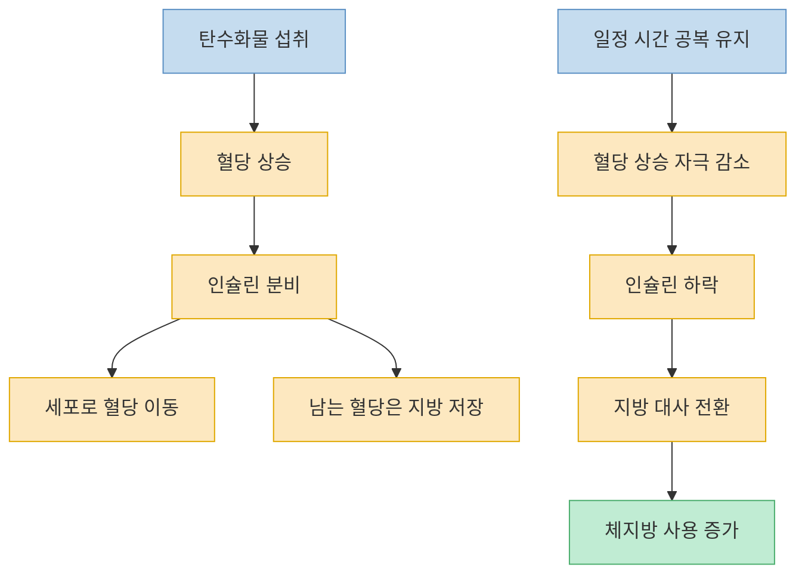
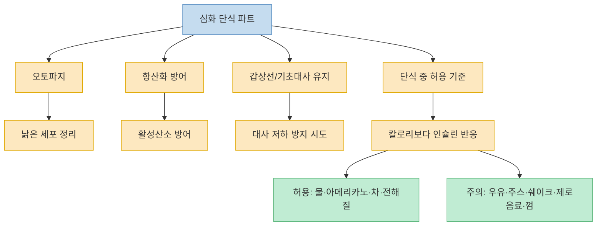

이 영상의 제목은 강하지만, 실제 본문에서 반복하는 핵심은 꽤 명확하다. 간헐적 단식의 목적은 단순히 `오래 굶는 것`이 아니라, **인슐린을 낮추고 몸을 지방 대사 상태로 전환시키는 것** 이다. 여기에 GLP-1, 장내 유익균, 오토파지, 갑상선 대사, 전해질 같은 개념을 덧붙이면서 왜 단식이 위고비·마운자로 같은 약물과 "같은 방향"으로 작동한다고 보는지 설명한다. 다만 영상 후반의 보충제·영양제 제안은 단일 영상의 주장이라는 점을 분리해서 읽는 편이 안전하다. [(0:04)](https://youtu.be/U5wuuHwI7w4?t=4), [(2:02)](https://youtu.be/U5wuuHwI7w4?t=122), [(4:49)](https://youtu.be/U5wuuHwI7w4?t=289), [(6:18)](https://youtu.be/U5wuuHwI7w4?t=378)

<!--more-->

## Sources

- [운동 없이 2주 만에 7kg 뺀 방법 전부 공개합니다🔥 (실제로 이렇게 하는 중)](https://www.youtube.com/watch?v=U5wuuHwI7w4) — 팀 키토

---

## 영상이 보는 단식의 본질: 굶기보다 `인슐린 낮추기`

영상은 위고비와 마운자로를 먼저 꺼내면서 시작한다. 이유는 두 약물이 궁극적으로 식욕과 위 배출 속도, 인슐린 조절에 영향을 준다고 보고, 단식 역시 같은 방향으로 작동한다고 보기 때문이다. 여기서 영상이 제시하는 핵심 명제는 간단하다. **체지방이 늘어나는 직접 경로는 인슐린이 남는 혈당을 지방 창고로 보내는 과정** 이고, 단식은 바로 그 인슐린을 낮춰 지방 저장 모드에서 지방 사용 모드로 전환시키는 도구라는 것이다. [(2:06)](https://youtu.be/U5wuuHwI7w4?t=126), [(2:44)](https://youtu.be/U5wuuHwI7w4?t=164), [(3:20)](https://youtu.be/U5wuuHwI7w4?t=200), [(3:53)](https://youtu.be/U5wuuHwI7w4?t=233)

이 프레임에서 탄수화물은 특히 빠른 혈당 상승과 연결된다. 밥, 빵, 면, 떡처럼 빠르게 포도당이 되는 탄수화물을 먹으면 혈당 스파이크가 생기고, 인슐린도 많이 분비되며, 결국 남는 혈당은 체지방으로 저장될 가능성이 높아진다고 설명한다. 따라서 영상은 체중 감량의 진짜 목표를 `칼로리 줄이기`보다 `인슐린이 높아져 있는 시간을 줄이기`로 잡는다. [(3:35)](https://youtu.be/U5wuuHwI7w4?t=215), [(3:43)](https://youtu.be/U5wuuHwI7w4?t=223), [(3:57)](https://youtu.be/U5wuuHwI7w4?t=237)

그래서 단식의 의미도 달라진다. 일정 시간 아무것도 먹지 않으면 혈당이 올라갈 일이 줄고, 인슐린도 서서히 내려가며, 몸은 바깥에서 에너지가 안 들어오니 저장해 둔 지방을 꺼내 쓰는 모드로 바뀐다는 것이다. 영상은 이 지방 대사 전환이 단식의 핵심 목표라고 말하며, 본격적인 전환은 최소 12시간 이상 지나야 의미 있게 시작된다고 설명한다. [(4:00)](https://youtu.be/U5wuuHwI7w4?t=240), [(4:18)](https://youtu.be/U5wuuHwI7w4?t=258), [(4:33)](https://youtu.be/U5wuuHwI7w4?t=273), [(4:43)](https://youtu.be/U5wuuHwI7w4?t=283)

---

## GLP-1과 장내 미생물은 단식과 어떻게 연결된다고 보나

영상은 최근 단식 연구를 설명하면서, 간헐적 단식이 몸 안에서 GLP-1 분비를 스스로 높이게 만든다고 말한다. 이 지점에서 단식은 단지 "굶는 행위"가 아니라 식욕 억제, 위 배출 지연, 과식 억제와 연결되는 내분비 반응을 유도하는 도구처럼 제시된다. 그래서 초반의 공복은 힘들 수 있어도, 시간이 지나면 속이 편해지고 과식과 멀어지는 방향으로 적응이 생긴다고 본다. [(4:47)](https://youtu.be/U5wuuHwI7w4?t=287), [(4:51)](https://youtu.be/U5wuuHwI7w4?t=291), [(5:00)](https://youtu.be/U5wuuHwI7w4?t=300)

또 하나의 축은 장내 미생물이다. 영상은 요요가 안 오는 사람과 오는 사람의 차이를 장내 세균 구성에서 찾는 연구들을 언급하면서, 특히 아커만시아 같은 유익균이 많으면 장 점막을 보호하고 염증 물질이 혈액으로 새는 것을 막아 인슐린 저항성 관리에 유리하다고 설명한다. 이 논리대로라면 단식은 단기간 체중 감량 도구일 뿐 아니라, 장내 환경을 바꾸어 같은 음식을 먹어도 덜 찌는 몸 상태로 가는 과정이 된다. [(5:18)](https://youtu.be/U5wuuHwI7w4?t=318), [(5:36)](https://youtu.be/U5wuuHwI7w4?t=336), [(5:51)](https://youtu.be/U5wuuHwI7w4?t=351), [(6:05)](https://youtu.be/U5wuuHwI7w4?t=365)

여기서 영상이 묶는 세 가지 키워드는 `인슐린`, `GLP-1`, `장내 세균`이다. 단식은 혈당-인슐린 축을 누르고, 식욕을 조절하는 호르몬 환경을 바꾸고, 장내 미생물 구성을 더 유리한 방향으로 움직이게 해 장기 유지에도 도움을 준다는 주장이다. 이 세 축이 영상 전체의 중심 논리라고 봐도 된다. [(6:14)](https://youtu.be/U5wuuHwI7w4?t=374), [(6:20)](https://youtu.be/U5wuuHwI7w4?t=380), [(6:29)](https://youtu.be/U5wuuHwI7w4?t=389)

---

## 영상 후반의 심화 파트: 오토파지, 보충제, 그리고 주의해서 읽을 부분

심화 파트에서 영상은 실리콘밸리 바이오해커 이야기를 꺼내며 메트포르민과 스퍼미딘을 단식 부스터처럼 설명한다. 메트포르민은 혈당과 대사 쪽, 스퍼미딘은 오토파지 쪽을 강화하는 방향으로 소개하고, 한국에서는 접근성이 떨어지니 코로솔산·크롬·비타민 B군, SOD와 항산화 네트워크, 요드·셀레늄·마그네슘·철·비타민 D 같은 조합을 대안으로 제시한다. 다만 이 부분은 엄격한 임상 가이드보다 영상의 실전 노하우와 제품 연계 설명에 가깝기 때문에, **단식 원리 설명과 동일한 무게로 받아들이기보다는 단일 출처의 제안** 으로 보는 것이 맞다. [(6:47)](https://youtu.be/U5wuuHwI7w4?t=407), [(7:45)](https://youtu.be/U5wuuHwI7w4?t=465), [(8:45)](https://youtu.be/U5wuuHwI7w4?t=525), [(9:56)](https://youtu.be/U5wuuHwI7w4?t=596), [(10:31)](https://youtu.be/U5wuuHwI7w4?t=631)

그럼에도 이 구간에서 건질 수 있는 구조는 있다. 영상은 오토파지를 `낡은 세포와 단백질을 청소하는 과정`으로 설명하고, 16시간 이상 단식에서 활성화가 커지며 길어질수록 효과가 커진다고 본다. 동시에 오토파지 과정에서 활성산소가 같이 올라갈 수 있으니 항산화 방어가 중요하다고 연결한다. 이 구간의 핵심은 특정 제품보다, **단식을 단지 체중 감량이 아니라 세포 정리와 대사 조절이 얽힌 과정으로 보고 있다는 점** 이다. [(8:52)](https://youtu.be/U5wuuHwI7w4?t=532), [(9:12)](https://youtu.be/U5wuuHwI7w4?t=552), [(9:25)](https://youtu.be/U5wuuHwI7w4?t=565), [(9:47)](https://youtu.be/U5wuuHwI7w4?t=587)

또 하나 중요한 경고는 `칼로리`보다 `인슐린 자극`이다. 영상은 제로칼로리라고 해도 인슐린을 건드리는 성분이 있으면 단식 효과가 줄어들 수 있다고 보고, 우유·두유·과일주스·프로틴쉐이크·제로 음료·무설탕 껌 같은 것들을 조심하라고 말한다. 반대로 물, 아메리카노, 녹차·홍차·허브차, 소금과 전해질은 단식 중 허용 또는 권장 쪽으로 분류한다. 즉 단식 중 허용 음식의 기준은 `칼로리`가 아니라 **인슐린을 올리느냐** 에 있다고 정리한다. [(11:14)](https://youtu.be/U5wuuHwI7w4?t=674), [(11:26)](https://youtu.be/U5wuuHwI7w4?t=686), [(11:46)](https://youtu.be/U5wuuHwI7w4?t=706), [(12:10)](https://youtu.be/U5wuuHwI7w4?t=730), [(13:26)](https://youtu.be/U5wuuHwI7w4?t=806)

---

## 실전 운영법: 첫 끼 구성, 12:12·14:10·16:8, 그리고 24시간 단식

영상에서 가장 실전적인 파트는 단식이 끝난 뒤 `첫 끼를 어떻게 먹느냐`다. 16시간 공복을 유지한 뒤 샌드위치와 과일주스로 시작하면, 어렵게 낮춘 인슐린을 다시 크게 자극할 수 있다고 경고한다. 대신 첫 끼는 `건강한 지방 + 단백질 + 식이섬유`로 구성하고, 먹는 순서는 식이섬유 -> 지방·단백질 -> 탄수화물 순으로 하라고 말한다. 이렇게 하면 소화가 천천히 진행돼 혈당 스파이크를 줄일 수 있다는 설명이다. [(13:52)](https://youtu.be/U5wuuHwI7w4?t=832), [(14:34)](https://youtu.be/U5wuuHwI7w4?t=874), [(15:08)](https://youtu.be/U5wuuHwI7w4?t=908), [(15:39)](https://youtu.be/U5wuuHwI7w4?t=939)

단식 시간 설계는 세 단계로 나눈다. 입문자는 12:12, 직장인은 14:10, 더 강하게 하려는 사람은 16:8이다. 영상은 16:8이 가장 유명하지만 모든 사람에게 최적은 아니며, 특히 탄수화물 위주 식사를 오래 해 왔던 사람은 처음부터 16시간 공복을 잡으면 간헐적 폭식으로 이어질 수 있다고 경고한다. 그래서 오래 유지할 수 있는 시간을 먼저 만들고, 적응한 뒤 더 긴 공복으로 넘어가라고 조언한다. [(19:38)](https://youtu.be/U5wuuHwI7w4?t=1178), [(20:35)](https://youtu.be/U5wuuHwI7w4?t=1235), [(21:30)](https://youtu.be/U5wuuHwI7w4?t=1290)

또 아침을 생략할지 저녁을 생략할지도 구분한다. 다이어트 효율만 보면 저녁을 생략하는 편이 유리하지만, 현실적으로 오래 유지하기는 아침 생략이 더 쉽다고 본다. 낮에는 혈당과 인슐린을 더 효율적으로 처리하고, 밤에는 상대적으로 대사가 느려지기 때문에 저녁 식사를 줄이는 쪽이 체중 감량에는 더 낫다는 설명이다. [(22:01)](https://youtu.be/U5wuuHwI7w4?t=1321), [(22:05)](https://youtu.be/U5wuuHwI7w4?t=1325), [(22:24)](https://youtu.be/U5wuuHwI7w4?t=1344)

더 심화된 루틴으로는 주 1~2회 24시간 단식도 제안한다. 저녁 7시에 먹고 다음 날 저녁까지 가면 되므로, 실제로는 잠자는 시간을 포함하면 불가능한 수준은 아니라는 논리다. 영상은 24시간쯤 되면 오토파지와 지방 대사가 더 강해지고, 성장호르몬과 케톤 증가로 배고픔이 오히려 줄 수 있다고 설명한다. 이 부분 역시 영상의 강한 주장인 만큼, 실천보다는 구조 이해용으로 읽는 것이 적절하다. [(22:36)](https://youtu.be/U5wuuHwI7w4?t=1356), [(22:48)](https://youtu.be/U5wuuHwI7w4?t=1368), [(23:20)](https://youtu.be/U5wuuHwI7w4?t=1400), [(23:32)](https://youtu.be/U5wuuHwI7w4?t=1412)

---

## 핵심 요약

- 이 영상은 간헐적 단식의 핵심을 `공복 시간 자체`보다 `인슐린을 낮춰 지방 대사 상태로 전환시키는 것`으로 설명한다. [(3:53)](https://youtu.be/U5wuuHwI7w4?t=233), [(4:38)](https://youtu.be/U5wuuHwI7w4?t=278)
- GLP-1 증가, 장내 유익균 변화, 인슐린 저항성 완화가 단식의 지속성과 요요 방지에 연결된다고 본다. [(4:47)](https://youtu.be/U5wuuHwI7w4?t=287), [(5:36)](https://youtu.be/U5wuuHwI7w4?t=336), [(6:14)](https://youtu.be/U5wuuHwI7w4?t=374)
- 보충제·영양제·바이오해킹 파트는 영상의 단일 출처 주장으로, 단식 원리 설명과는 구분해서 읽는 편이 안전하다. [(7:45)](https://youtu.be/U5wuuHwI7w4?t=465), [(10:31)](https://youtu.be/U5wuuHwI7w4?t=631)
- 단식 중 허용 기준은 칼로리보다 인슐린 반응이며, 물·아메리카노·차·전해질은 허용, 우유·주스·쉐이크·제로 음료·껌은 주의 대상으로 제시된다. [(11:26)](https://youtu.be/U5wuuHwI7w4?t=686), [(12:10)](https://youtu.be/U5wuuHwI7w4?t=730), [(13:26)](https://youtu.be/U5wuuHwI7w4?t=806)
- 실전 운영에서는 첫 끼를 지방·단백질·식이섬유 중심으로 시작하고, 12:12 -> 14:10 -> 16:8 순으로 점진적으로 늘리는 방식을 권한다. [(14:34)](https://youtu.be/U5wuuHwI7w4?t=874), [(20:35)](https://youtu.be/U5wuuHwI7w4?t=1235), [(21:30)](https://youtu.be/U5wuuHwI7w4?t=1290)

---

## 결론

이 영상이 반복해서 강조하는 것은 "오래 굶는 게 대단한 게 아니라, 인슐린이 내려가 지방을 쓰는 시간이 생겨야 한다"는 점이다. 그래서 단식을 하더라도 첫 끼 구성, 허용 음료, 단식 시간 설정, 생활 패턴 적합성까지 함께 설계해야 효과가 생긴다고 본다. [(4:38)](https://youtu.be/U5wuuHwI7w4?t=278), [(13:52)](https://youtu.be/U5wuuHwI7w4?t=832), [(19:38)](https://youtu.be/U5wuuHwI7w4?t=1178)

실전적으로 가져갈 만한 메시지는 의외로 단순하다. 무조건 16:8이나 24시간 단식부터 밀어붙이기보다, 먼저 내 생활에서 유지 가능한 공복 리듬을 만들고, 첫 끼를 탄수화물 폭탄이 아니라 천천히 흡수되는 식사로 바꾸라는 것이다. 단식의 성패는 굶는 의지보다 **단식이 끝난 뒤 어떻게 먹고, 얼마나 오래 유지하느냐** 에 더 달려 있다는 해석이 이 영상의 핵심에 가깝다. [(21:00)](https://youtu.be/U5wuuHwI7w4?t=1260), [(22:24)](https://youtu.be/U5wuuHwI7w4?t=1344), [(24:36)](https://youtu.be/U5wuuHwI7w4?t=1476)
