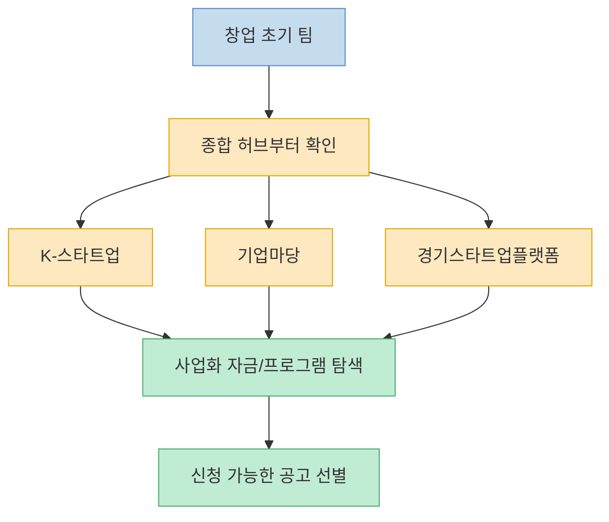
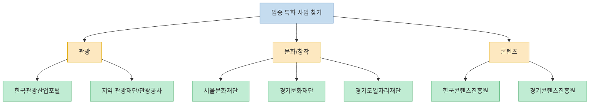
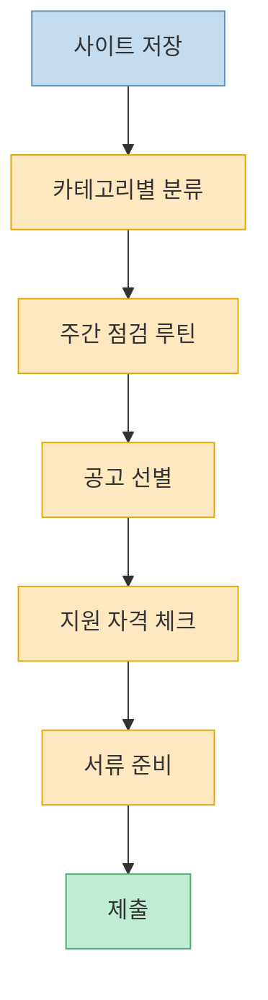

이 Threads 포스트는 스타트업을 하면서 한 번쯤 저장해 둘 만한 `지원사업/공고 탐색 사이트 목록`을 한 번에 던져 준다. 핵심 가치는 링크 그 자체보다, 흩어져 있는 지원사업 창구를 `사업화`, `소상공인`, `고용`, `수출`, `R&D`, `문화·관광` 관점으로 한데 묶어 준다는 점에 있다. 실제로 초기 창업팀이나 1인 사업자는 지원사업이 없어서 기회를 놓치기보다, **어디를 정기적으로 봐야 하는지 몰라서** 기회를 놓치는 경우가 더 많다. 이 글은 원문에 나온 17개 사이트를 그대로 옮기기보다, 무엇을 찾을 때 어느 묶음부터 보면 좋은지 중심으로 다시 정리한 버전이다. 세부 자격요건과 마감일은 수시로 바뀔 수 있으므로, 실제 신청 전에는 반드시 각 공식 사이트의 최신 공고를 다시 확인해야 한다. [Threads 원문](https://www.threads.com/@startup_que/post/DWwUdIDgWqj)

<!--more-->

## Sources

- [Threads: @startup_que — "이런 사이트 진작 알았으면.." 리스트 공유](https://www.threads.com/@startup_que/post/DWwUdIDgWqj)

---

## 가장 먼저 볼 축: 창업 초기 사업화·통합 공고 허브

원문 리스트에서 가장 먼저 눈에 들어오는 축은 `K-스타트업`, `기업마당`, `경기스타트업플랫폼` 같은 종합 허브다. 이런 사이트들의 역할은 개별 제도 하나를 깊게 안내하기보다, 정부·지자체·공공기관에서 올라오는 사업화 자금, 육성 프로그램, 입주, 액셀러레이팅, 실증, 네트워킹 공고를 한곳에서 모아 보여 주는 데 있다. 스타트업이 아직 자기 업종과 지원체계를 충분히 파악하지 못한 초기 단계라면, 세부 기관 사이트를 하나씩 파고들기 전에 이런 허브를 먼저 보는 편이 효율적이다. [Threads 원문](https://www.threads.com/@startup_que/post/DWwUdIDgWqj)

특히 이 계열 사이트의 장점은 `범용성`이다. 특정 업종이 아니어도 볼 수 있고, 지원금, 프로그램, 모집 공고, 지역 연계 정보까지 비교적 넓게 훑을 수 있다. 반면 단점도 있다. 공고가 넓고 많기 때문에, 내가 당장 신청 가능한 것과 정보성 공고를 구분하는 필터링이 필요하다. 그래서 처음에는 `업력`, `지역`, `업종`, `지원 유형` 정도를 정해 두고 훑는 습관이 중요하다. [Threads 원문](https://www.threads.com/@startup_que/post/DWwUdIDgWqj)

이 묶음에 해당하는 원문 사이트는 다음과 같다.

- K-스타트업
- 기업마당
- 경기스타트업플랫폼

---

## 소상공인·자영업·고용 지원은 별도 축으로 봐야 한다

원문에는 `소상공인진흥공단`, `소상공인24`, `소상공인365`, `고용24`, `고용복지센터`, `판판대로`가 함께 들어가 있다. 이 묶음은 전통적인 스타트업 지원과 조금 다르다. 법인 스타트업만이 아니라 자영업, 소상공인, 온라인 판매자, 오프라인 점포, 채용·고용 유지, 유통·판로까지 포괄한다. 즉 "투자형 성장 스타트업"이 아니라 **실무 운영형 사업자** 에게 더 직접적으로 와닿는 창구가 많다. [Threads 원문](https://www.threads.com/@startup_que/post/DWwUdIDgWqj)

이 범주의 핵심은 지원금보다도 `운영 비용 절감`과 `판로/고용 보조`에 가깝다. 예를 들어 고용 관련 사이트는 채용 장려금, 일자리 지원사업, 인건비 성격의 제도를 찾는 데 도움이 될 수 있고, 소상공인 계열 사이트는 정책자금, 교육, 컨설팅, 각종 통합 신청 창구를 찾는 데 적합하다. 판판대로처럼 유통·마케팅을 중심으로 보는 플랫폼은 "만드는 단계"보다 "파는 단계"에서 더 중요해진다. [Threads 원문](https://www.threads.com/@startup_que/post/DWwUdIDgWqj)

원문 기준으로 이 범주에 넣을 만한 사이트는 다음과 같다.

- 소상공인진흥공단
- 소상공인24
- 소상공인365
- 고용24 / 고용복지센터
- 판판대로

---

## 업종 특화형: 관광, 문화, 콘텐츠, 지역 재단은 따로 챙겨야 한다

이 Threads가 꽤 실용적인 이유는 범용 창업 지원만 모은 것이 아니라, `관광`, `문화`, `콘텐츠`, `청년 창작`, `프리랜서`처럼 업종 특화형 채널도 함께 넣어 두었다는 점이다. `한국관광산업포털`, `각 지역 관광센터·관광공사`, `한국콘텐츠진흥원`, `경기콘텐츠진흥원`, `서울문화재단`, `경기문화재단`, `경기도일자리재단` 같은 목록은 일반 창업 허브만 보던 사람이 자주 놓치는 영역이다. [Threads 원문](https://www.threads.com/@startup_que/post/DWwUdIDgWqj)

이 영역은 특히 사업 아이템의 성격이 애매할 때 중요하다. 예를 들어 관광 스타트업, 지역 체험 서비스, 문화기획, 콘텐츠 스튜디오, 1인 크리에이터, 프리랜서형 프로젝트 팀은 일반 창업 사업보다 `분야 특화 공모`에서 더 잘 맞는 지원을 찾는 경우가 많다. 금액만 보면 작은 공모처럼 보여도, 실제로는 네트워크, 레퍼런스, 실증 기회, 브랜딩 효과가 커서 초기 팀에게는 더 유의미할 수 있다. [Threads 원문](https://www.threads.com/@startup_que/post/DWwUdIDgWqj)

이 묶음은 `분야-지역`의 조합으로 찾아보는 게 좋다. 예를 들어 관광업이라면 국가 단위 포털과 지역 관광재단을 함께 보고, 콘텐츠 업종이라면 한국콘텐츠진흥원과 지역 콘텐츠진흥원·문화재단을 같이 보는 식이다. 원문이 지역 기관까지 함께 적어 둔 이유가 바로 여기에 있다. [Threads 원문](https://www.threads.com/@startup_que/post/DWwUdIDgWqj)

---

## 수출·현지화·R&D는 성장 단계가 오면 반드시 분리해서 봐야 한다

원문 후반부에는 `코트라`, `한국무역협회`, `중소벤처기업진흥공단`, `KEIT`, `범부처통합연구지원시스템`이 등장한다. 이 묶음은 창업 초기의 사업화 자금보다 한 단계 더 나아간, **성장·확장·기술 고도화** 영역에 가깝다. 다시 말해 당장 첫 고객을 찾는 문제와는 조금 다르지만, 일정 수준의 제품·서비스가 나온 이후에는 오히려 이 영역의 가치가 더 커진다. [Threads 원문](https://www.threads.com/@startup_que/post/DWwUdIDgWqj)

코트라와 한국무역협회, 중소벤처기업진흥공단은 수출, 해외 바이어 연결, 현지화, 글로벌 전개 쪽의 단서를 찾는 창구로 읽을 수 있다. 반면 KEIT와 범부처통합연구지원시스템은 R&D 사업과 기술개발 과제의 관문에 가깝다. 초기 팀이 이 영역을 너무 늦게 보면 실증·기술개발·해외 진출 일정이 뒤로 밀릴 수 있고, 반대로 너무 일찍 보면 아직 맞지 않는 과제를 오래 쫓게 될 수도 있다. 그래서 이 카테고리는 `지금 우리 팀이 사업화 단계인지, 기술개발 단계인지, 수출 준비 단계인지`를 먼저 정하고 보는 편이 효율적이다. [Threads 원문](https://www.threads.com/@startup_que/post/DWwUdIDgWqj)

원문 기준으로 이 성장형 채널은 다음과 같이 묶을 수 있다.

- 코트라
- 한국무역협회
- 중소벤처기업진흥공단
- 한국산업기술기획평가원(KEIT)
- 범부처통합연구지원시스템

---

## 이 리스트를 실제로 쓰려면 `즐겨찾기`보다 `점검 루틴`이 더 중요하다

이 Threads의 마지막 문장은 `"저장해두고 공고 뜰 때마다 확인"`이다. 사실 이 문장이 가장 중요하다. 지원사업 사이트의 가치는 목록을 알고 있는 데서 끝나지 않고, **주기적으로 보는 습관** 이 생길 때 비로소 나온다. 공고는 열려 있는 기간이 짧고, 제출 서류 준비에는 시간이 걸리기 때문에, 마감 직전에 발견하면 사실상 기회를 놓치기 쉽다. [Threads 원문](https://www.threads.com/@startup_que/post/DWwUdIDgWqj)

실전적으로는 사이트 17개를 매일 다 보는 것보다, 범주별로 나눠 요일 루틴을 만드는 편이 낫다. 예를 들어 월요일엔 종합 허브, 화요일엔 소상공인·고용, 수요일엔 업종 특화, 목요일엔 수출·R&D, 금요일엔 행사·네트워킹(예: 이벤터스)처럼 나눠 볼 수 있다. 이렇게 해야 `저장만 해둔 링크 모음`이 아니라 `실제로 공고를 건지는 시스템`이 된다. [Threads 원문](https://www.threads.com/@startup_que/post/DWwUdIDgWqj)

---

## 핵심 요약

- 이 Threads 포스트는 창업자가 자주 놓치는 `지원사업 탐색 창구`를 17개로 정리한 목록형 자료다. [Threads 원문](https://www.threads.com/@startup_que/post/DWwUdIDgWqj)
- 실전적으로는 이를 `종합 허브`, `소상공인/고용`, `관광·문화·콘텐츠`, `수출·R&D` 네 축으로 나눠 보는 편이 훨씬 이해하기 쉽다. [Threads 원문](https://www.threads.com/@startup_que/post/DWwUdIDgWqj)
- K-스타트업, 기업마당, 경기스타트업플랫폼은 초기 탐색용 허브로 유용하고, 소상공인24·고용24·판판대로 같은 사이트는 운영형 사업자에게 더 직접적일 수 있다. [Threads 원문](https://www.threads.com/@startup_que/post/DWwUdIDgWqj)
- 문화·관광·콘텐츠 계열 기관은 일반 창업 허브에서 놓치기 쉬운 업종 특화 공고를 찾는 데 의미가 있다. [Threads 원문](https://www.threads.com/@startup_que/post/DWwUdIDgWqj)
- 이 리스트의 진짜 가치는 링크 저장보다 `정기 점검 루틴`을 만드는 데 있다. [Threads 원문](https://www.threads.com/@startup_que/post/DWwUdIDgWqj)

---

## 결론

스타트업에게 필요한 정보는 생각보다 한 군데 모여 있지 않다. 그래서 지원사업 탐색은 검색 능력보다도 `어떤 기관군을 정기적으로 볼 것인가`를 정하는 일이 더 중요해진다. 이 Threads 목록은 바로 그 출발점으로 쓸 만하다. [Threads 원문](https://www.threads.com/@startup_que/post/DWwUdIDgWqj)

결국 중요한 건 17개를 외우는 것이 아니라, 우리 팀이 지금 `사업화`, `운영`, `업종 특화`, `수출`, `R&D` 중 어디에 가까운지 정하고 그 축에 맞는 사이트를 반복해서 확인하는 것이다. 그렇게 해야 지원사업 정보가 우연히 걸리는 것이 아니라, 의도적으로 잡히는 자산이 된다. [Threads 원문](https://www.threads.com/@startup_que/post/DWwUdIDgWqj)
