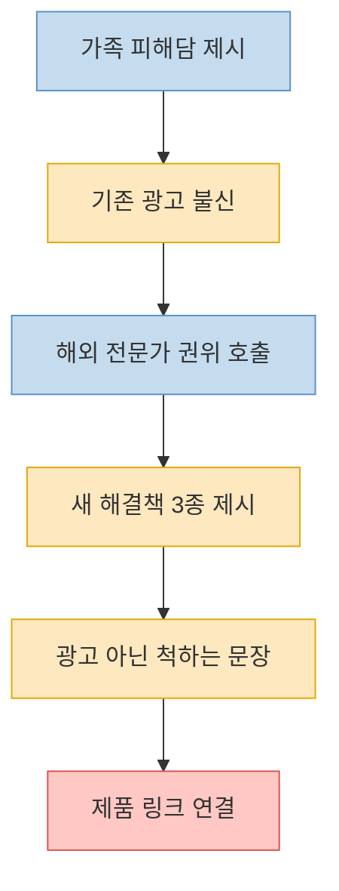
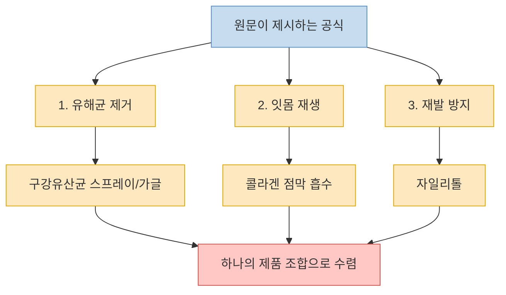
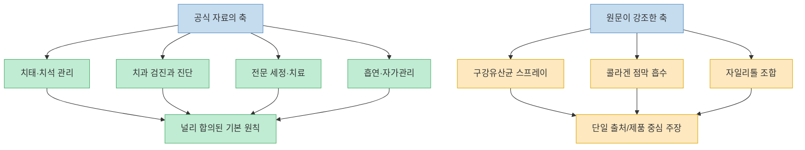
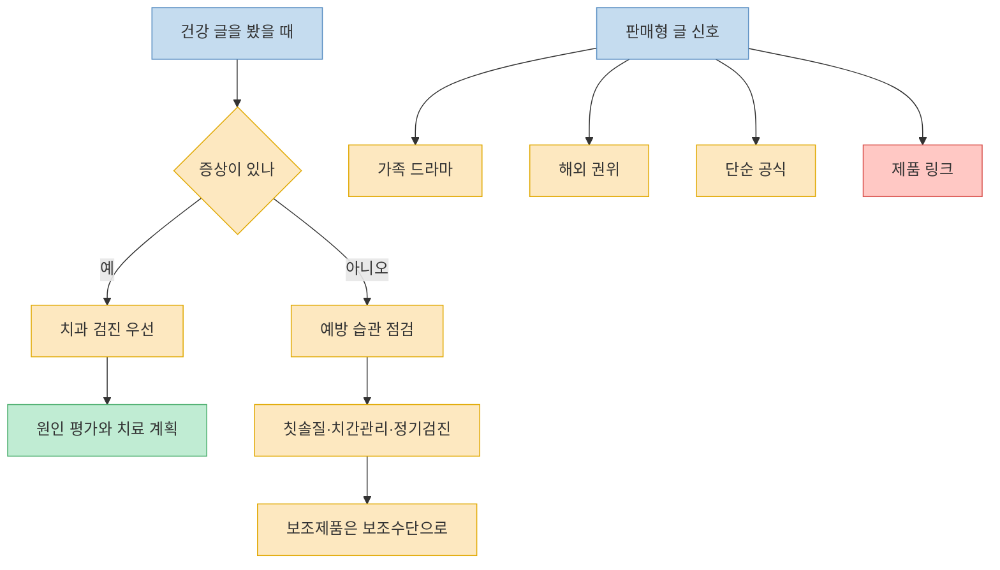

이 네이버 글은 겉으로는 `가족을 도운 실제 경험담`처럼 시작하지만, 읽다 보면 상당히 정교한 건강 마케팅 글의 구조를 갖고 있다. 초반에는 잇몸약 광고에 속은 어머니 이야기로 분노를 만들고, 중반에는 핀란드 치과의사라는 권위를 끌어오며, 후반에는 구강유산균·콜라겐·자일리톨이라는 세 가지 축으로 해결책을 정리한 뒤 제품 링크로 연결한다. 문제는 이런 글이 완전히 허구라는 뜻이 아니라, **일반적인 구강 건강 상식과 제품 판매 논리가 한 덩어리로 섞여 있다는 점** 이다. 잇몸 출혈과 통증은 실제 질환 신호일 수 있어서, 어디까지가 널리 받아들여진 원칙이고 어디서부터 단일 출처 주장인지 분리해 읽는 것이 중요하다.  

<!--more-->

## Sources

- [핀란드에서 알게된 '붓고 피나는 잇몸' 관리법 (+3달만에)](https://m.blog.naver.com/PostView.naver?blogId=column_wrinkle&logNo=224180125150) — 네이버 블로그 원문
- [Periodontal (Gum) Disease](https://www.nidcr.nih.gov/health-info/gum-disease) — NIDCR
- [Gum disease](https://www.nhs.uk/conditions/gum-disease/) — NHS
- [Chewing Gum](https://www.ada.org/resources/ada-library/oral-health-topics/chewing-gum) — American Dental Association
- [Nutrition and Oral Health](https://www.ada.org/resources/ada-library/oral-health-topics/nutrition-and-oral-health) — American Dental Association

---

## 이 글이 독자를 끌어들이는 방식: 피해 서사 -> 권위 호출 -> 제품 유도

원문은 아주 익숙한 패턴으로 시작한다. 먼저 `우리 엄마가 잇몸약 광고를 믿고 돈을 썼지만 낫지 않았다`는 서사를 배치한다. 그다음 `나는 12년차 치위생사`이고, `핀란드에서 일하며 현지 치과의사에게 진짜 방법을 배웠다`는 권위를 얹는다. 독자는 여기서 이미 두 가지 감정에 들어간다. 하나는 기존 제품과 광고에 대한 분노이고, 다른 하나는 `그럼 해외 전문가가 알려준 진짜 방법은 뭘까`라는 기대다. [(네이버 원문)](https://m.blog.naver.com/PostView.naver?blogId=column_wrinkle&logNo=224180125150)

이 구조가 강한 이유는 정보 전달보다 신뢰 설계에 초점이 맞춰져 있기 때문이다. 가족 사례는 광고 냄새를 줄여 주고, 해외 의료진과 실명 비슷한 이름은 전문성을 보강하며, `3개월 만에 좋아졌다`는 시간 표현은 변화를 시각화한다. 이후 본문은 점점 더 의학 설명처럼 보이도록 `구강 유해균`, `점막 흡수`, `콜라겐`, `타액 분비` 같은 단어를 배치하지만, 실제 핵심은 독자를 **문제 인식 -> 기존 해결책 불신 -> 새 조합 수용** 의 흐름으로 이동시키는 데 있다. [(네이버 원문)](https://m.blog.naver.com/PostView.naver?blogId=column_wrinkle&logNo=224180125150)

마지막 단계에서는 `제품명을 직접 쓰면 광고처럼 보여서 조심했다`는 문장을 넣어 방어막을 친다. 하지만 바로 이어서 특정 제품 링크가 나오기 때문에, 정보성 글처럼 보이게 설계한 판매 퍼널에 가깝다는 인상을 준다. 즉 이 글은 단순 건강 팁이 아니라, **광고처럼 보이지 않게 설계된 광고형 글쓰기** 로 읽는 편이 정확하다. [(네이버 원문)](https://m.blog.naver.com/PostView.naver?blogId=column_wrinkle&logNo=224180125150)

---

## 본문이 제시하는 해결 공식: 유해균 제거 + 재생 + 재발 방지

원문이 제시하는 핵심 논리는 세 단계다. 첫째, 잇몸병의 진짜 원인은 구강 유해균이므로 이것을 제거해야 한다고 말한다. 둘째, 이미 약해진 잇몸은 콜라겐을 점막에 직접 흡수시켜 `재생`시켜야 한다고 주장한다. 셋째, 나이가 들수록 침 분비가 줄고 세균이 다시 늘어나므로 자일리톨로 재발을 막아야 한다고 정리한다. 이 세 축은 글 후반의 `3초 요약`과 제품 설명에서 다시 한 번 압축된다. [(네이버 원문)](https://m.blog.naver.com/PostView.naver?blogId=column_wrinkle&logNo=224180125150)

겉으로만 보면 꽤 설득력 있어 보인다. 실제로 잇몸병과 세균, 염증, 타액 환경은 서로 관련이 있고, 입안 건강에서 습관과 생활 관리가 중요하다는 점도 완전히 틀린 말은 아니다. 문제는 원문이 여기서 한 걸음 더 나아가, `먹는 구강유산균은 효과 없고 스프레이나 가글이 사실상 정답`, `콜라겐은 점막 흡수여야 의미가 크다`, `자일리톨이 재발 방지의 핵심`이라는 식으로 **특정 제형과 특정 성분 조합을 사실상 정답처럼 제시** 한다는 점이다. 이 부분부터는 일반 원칙이라기보다 제품 설계 논리에 가까워진다. [(네이버 원문)](https://m.blog.naver.com/PostView.naver?blogId=column_wrinkle&logNo=224180125150)

더 중요한 것은, 이 글이 잇몸 출혈·통증·치아 흔들림 같은 신호를 거의 전부 `성분 조합` 문제로 환원한다는 점이다. 그러나 공식 자료에서 잇몸병은 단순히 한 성분을 추가한다고 해결되는 문제로 설명되지 않는다. 질환의 정도에 따라 치태와 치석 제거, 전문 진료, 심한 경우 잇몸 아래 깊은 세정이나 수술까지 연결될 수 있다. 즉 원문은 치료 경로를 좁히고, 성분 조합을 과도하게 넓혀 보이게 만드는 구성을 취한다. [NIDCR](https://www.nidcr.nih.gov/health-info/gum-disease), [NHS](https://www.nhs.uk/conditions/gum-disease/)

---

## 공식 자료와 비교하면 무엇이 일반 원칙이고, 무엇이 과장에 가까운가

공식 자료에서 비교적 분명한 부분부터 보자. NIDCR은 치주질환의 원인을 매일 제거되지 않은 치태가 쌓여 치석이 되고, 이것이 잇몸병으로 이어질 수 있다고 설명한다. 또한 흡연은 중요한 위험요인이며, 진단에는 잇몸 검사와 X-ray가 쓰일 수 있다고 안내한다. 치료의 목표는 감염 조절이고, 집에서의 관리뿐 아니라 치과의사·치과위생사의 전문적 처치가 포함될 수 있다고 말한다. NHS도 비슷하게 잇몸병의 원인을 치태 축적으로 설명하고, 초기에는 치아 사이 관리와 스케일링 같은 전문 세정이, 심하면 잇몸 아래 깊은 세정·항생제·수술까지 필요할 수 있다고 정리한다. 이는 `출혈하는 잇몸 = 먼저 치과 평가`라는 기본 원칙을 뒷받침한다. [NIDCR](https://www.nidcr.nih.gov/health-info/gum-disease), [NHS](https://www.nhs.uk/conditions/gum-disease/)

반면 자일리톨에 대해서는 공식 자료의 톤이 훨씬 조심스럽다. ADA는 무설탕 껌이 침 분비를 늘리고, 일부 연구에서 충치 관련 세균 감소와 연결된다고 소개한다. 하지만 이것은 대체로 `충치 위험 감소`나 `보조적 구강 위생` 문맥에 가깝다. 같은 ADA 자료는 자일리톨 효과에 대한 전체 결과가 엇갈리고, 카리에스 예방 보조요법으로서의 근거 질도 낮다고 설명한다. 즉 `자일리톨 = 잇몸병 재발 방지의 핵심 정답`이라고 단정하기는 어렵고, 적어도 공식 자료 수준에서는 **보조적 역할 가능성** 정도가 더 가까운 해석이다. [ADA Chewing Gum](https://www.ada.org/resources/ada-library/oral-health-topics/chewing-gum), [ADA Nutrition and Oral Health](https://www.ada.org/resources/ada-library/oral-health-topics/nutrition-and-oral-health)

구강유산균 스프레이와 콜라겐 점막 흡수 주장도 같은 기준으로 봐야 한다. 원문은 이를 사실상 핵심 해법처럼 제시하지만, 이번에 확인한 공식 공공·전문 기관 자료들에서는 잇몸병의 표준 예방·관리 축으로 그런 조합을 전면에 내세우지 않았다. 이 말은 곧 `절대 효과가 없다`는 뜻이 아니라, **적어도 널리 합의된 1차 원칙으로 보기 어렵다** 는 뜻이다. 특히 출혈, 붓기, 통증, 치아 흔들림, 악취, 임플란트 후 염증 같은 증상은 제품 추천보다 검진과 평가가 앞서는 신호에 더 가깝다. [NHS](https://www.nhs.uk/conditions/gum-disease/), [NIDCR](https://www.nidcr.nih.gov/health-info/gum-disease)

---

## 이런 글에서 실제로 가져가야 할 것은 무엇인가

그렇다면 이런 건강 글을 완전히 무시해야 할까? 꼭 그렇지는 않다. 원문에서도 건질 수 있는 일반 원칙은 있다. 잇몸에서 피가 나거나 붓고 시리거나 입냄새가 심해지는 것은 무시할 신호가 아니라는 점, 구강 세균과 염증 관리가 중요하다는 점, 침 분비와 생활 습관이 입안 환경에 영향을 준다는 점 등은 넓은 의미에서 타당하다. 문제는 이 일반 원칙이 곧바로 `특정 스프레이 하나`나 `특정 성분 3종 세트`의 필수성을 뜻하지는 않는다는 점이다. [(네이버 원문)](https://m.blog.naver.com/PostView.naver?blogId=column_wrinkle&logNo=224180125150), [NIDCR](https://www.nidcr.nih.gov/health-info/gum-disease)

실전적으로는 우선순위를 다시 세우는 편이 낫다. 첫째, 피나는 잇몸이나 흔들리는 치아는 제품 탐색보다 진료와 검진이 먼저다. 둘째, 기본 관리는 칫솔질만이 아니라 치아 사이 청소, 정기 검진, 필요시 전문가 세정까지 포함한다. 셋째, 자일리톨이나 무설탕 껌, 구강 보조 제품은 어디까지나 보조수단으로 두는 것이 안전하다. 특히 임플란트 후 염증, 통증 지속, 치아 흔들림 같은 표현이 나온다면 더더욱 `자가 해결` 프레임으로 오래 버티지 않는 편이 맞다. [NHS](https://www.nhs.uk/conditions/gum-disease/), [ADA Chewing Gum](https://www.ada.org/resources/ada-library/oral-health-topics/chewing-gum)

마지막으로, 건강 글이 `광고가 아니다`라고 반복할수록 오히려 판매 퍼널을 의심해 볼 필요가 있다. 의학 정보는 보통 증상, 평가, 한계, 예외, 언제 병원에 가야 하는지가 함께 나온다. 반면 판매형 글은 고통, 분노, 드라마, 해외 권위, 단순한 공식, 그리고 제품 연결이 더 앞에 선다. 이 차이만 구분해도 건강 정보 소비의 절반은 달라진다. [(네이버 원문)](https://m.blog.naver.com/PostView.naver?blogId=column_wrinkle&logNo=224180125150)

---

## 핵심 요약

- 이 네이버 글은 경험담처럼 시작하지만, 실제 구조는 `기존 광고 불신 -> 해외 전문가 권위 -> 성분 3종 공식 -> 제품 링크`로 이어지는 광고형 글에 가깝다. [원문](https://m.blog.naver.com/PostView.naver?blogId=column_wrinkle&logNo=224180125150)
- 원문이 제시하는 해결 공식은 `구강유산균 스프레이`, `콜라겐 점막 흡수`, `자일리톨`의 3단 조합이다. 하지만 이는 일반 원칙보다 제품 논리에 더 가깝다. [원문](https://m.blog.naver.com/PostView.naver?blogId=column_wrinkle&logNo=224180125150)
- 공식 자료는 잇몸병의 기본 원인을 치태·치석 축적과 염증, 위험요인, 전문 진단과 치료 경로로 설명한다. [NIDCR](https://www.nidcr.nih.gov/health-info/gum-disease), [NHS](https://www.nhs.uk/conditions/gum-disease/)
- 자일리톨은 공식 자료에서 무설탕 껌, 충치 위험 감소, 침 분비 증가 같은 보조적 역할로 주로 다뤄지며, 잇몸병 해결의 핵심 정답처럼 제시되지는 않는다. [ADA Chewing Gum](https://www.ada.org/resources/ada-library/oral-health-topics/chewing-gum), [ADA Nutrition and Oral Health](https://www.ada.org/resources/ada-library/oral-health-topics/nutrition-and-oral-health)
- 피나는 잇몸, 붓기, 통증, 치아 흔들림 같은 신호는 제품 탐색보다 치과 평가와 기본 구강 관리가 먼저다. [NHS](https://www.nhs.uk/conditions/gum-disease/), [NIDCR](https://www.nidcr.nih.gov/health-info/gum-disease)

---

## 결론

이 글의 핵심은 잇몸 건강 지식 그 자체보다, 건강 정보가 어떻게 `상품 설명`으로 변환되는지를 보여준다는 데 있다. 일반 상식 몇 조각과 실제 질환 불안을 섞은 뒤, 하나의 단순한 해결 공식으로 수렴시키는 방식은 건강 마케팅에서 매우 자주 반복된다. [원문](https://m.blog.naver.com/PostView.naver?blogId=column_wrinkle&logNo=224180125150)

그래서 실전적인 태도는 단순하다. 출혈과 통증은 먼저 검진으로 확인하고, 보조 제품은 어디까지나 보조로 두며, `광고가 아니다`라고 말하는 건강 글일수록 구조를 한 번 더 의심해 보는 것이다. 잇몸병은 결국 한 문장 광고보다, 꾸준한 관리와 정확한 평가 쪽이 훨씬 중요하다. [NIDCR](https://www.nidcr.nih.gov/health-info/gum-disease), [NHS](https://www.nhs.uk/conditions/gum-disease/)
