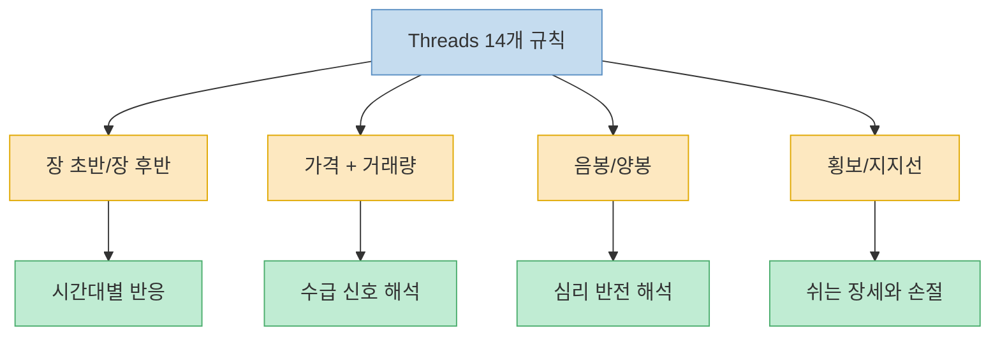
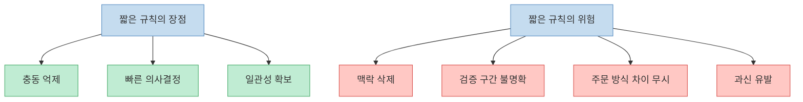
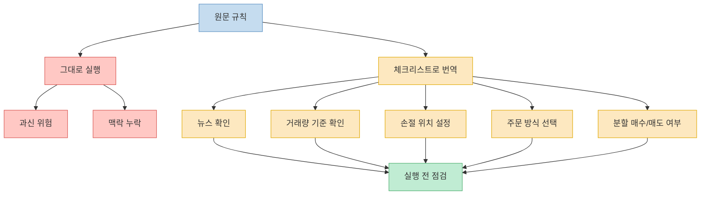

이 Threads 글은 매우 강하다. 시장 상황을 길게 설명하지 않고, `아침 폭등이면 전량 매도`, `횡보장이면 거래 금지`, `지지선이 깨지면 손절 필수`처럼 즉시 실행 가능한 문장만 14개를 던진다. 이런 형식은 기억하기 쉽고, 초보자에게는 혼란을 줄여주는 장점도 있다. 하지만 동시에 **시간 프레임, 종목 특성, 유동성, 뉴스, 주문 방식, 손익비** 같은 핵심 맥락을 거의 지워 버린다. 금융 의사결정은 손실로 바로 이어질 수 있기 때문에, 이런 규칙은 정답이라기보다 `판단 틀`로만 읽는 편이 안전하다. 이 글은 투자 권유가 아니라, 원문 규칙을 어떤 구조로 이해하면 좋은지 정리한 메모에 가깝다.

<!--more-->

## Sources

- [주식에서 이기는 사람은 똑똑한 사람이 아니라, 규칙 지키는 사람](https://www.threads.com/@yyghertf1004/post/DW7UvUaE5LS?xmt=AQF09tDCSTiDsrdd4RcCEmuLjsLEB_Gcz15fJ9c5ka0nQmd_Akliw8dCFyyzWkZst2SNtMc&slof=1) — Threads 원문
- [Thinking of Day Trading? Know the Risks.](https://www.investor.gov/additional-resources/spotlight/directors-take/thinking-day-trading-know-risks) — Investor.gov
- [Investor Bulletin: Stop, Stop-Limit, and Trailing Stop Orders](https://www.investor.gov/introduction-investing/general-resources/news-alerts/alerts-bulletins/investor-bulletins-15) — Investor.gov
- [Order Types](https://www.finra.org/investors/investing/investment-products/stocks/order-types) — FINRA
- [Stop Orders: Factors to Consider During Volatile Markets](https://www.finra.org/investors/insights/stop-orders-factors-consider-during-volatile-markets) — FINRA

---

## 원문 14개 규칙은 사실 네 묶음으로 읽는 편이 낫다

원문을 하나씩 보면 14개처럼 보이지만, 실제로는 네 가지 묶음으로 압축된다. 첫째는 `장 초반 vs 장 후반` 규칙이다. 아침 폭등, 오후 폭등, 아침 폭락, 마감 전 급등처럼 하루 안에서도 시간대에 따라 다르게 반응하라는 메시지다. 둘째는 `가격 + 거래량` 규칙이다. 저가에서 거래량이 늘면 강하게 매수하고, 고가에서 거래량이 늘면 신속히 매도하라는 식이다. 셋째는 `캔들 해석`이다. 음봉일 때는 매수 가능, 양봉일 때는 매수 금지처럼 심리 반전 구간을 노리라는 흐름이다. 넷째는 `하지 말아야 할 장세`다. 횡보장에서 거래하지 말고, 지지선이 깨지면 손절하라는 문장들이 여기에 들어간다. [Threads 원문](https://www.threads.com/@yyghertf1004/post/DW7UvUaE5LS?xmt=AQF09tDCSTiDsrdd4RcCEmuLjsLEB_Gcz15fJ9c5ka0nQmd_Akliw8dCFyyzWkZst2SNtMc&slof=1)

이걸 이렇게 재구성하면 원문이 노리는 핵심이 더 선명해진다. 결국 이 글은 `언제 추격하지 말아야 하는가`, `언제 눌림을 기회로 볼 수 있는가`, `어떤 거래량을 동반한 가격 움직임을 신호로 볼 것인가`, `어떤 장에서는 아예 쉬어야 하는가`를 짧은 규칙으로 정리한 것이다. 즉 내용 자체는 랜덤한 격언 모음이 아니라, **충동 매수를 줄이고 규칙 기반 반응으로 바꾸려는 시도** 로 읽을 수 있다. [Threads 원문](https://www.threads.com/@yyghertf1004/post/DW7UvUaE5LS?xmt=AQF09tDCSTiDsrdd4RcCEmuLjsLEB_Gcz15fJ9c5ka0nQmd_Akliw8dCFyyzWkZst2SNtMc&slof=1)

문제는 여기서부터다. 네 묶음 모두 `조건이 맞아 보이면 행동하라`는 문장으로 끝나지만, 실제 매매에서는 같은 신호라도 전혀 다른 결과가 나온다. 아침 급등은 단순 과열일 수도 있지만, 실적 발표나 인수합병 뉴스가 반영되는 시작점일 수도 있다. 저가에서 거래량이 늘었다는 사실만으로는 `저점 매집`인지 `하락 중 거래 증가`인지 분간이 안 된다. 음봉 역시 건강한 눌림일 수 있지만, 추세 붕괴의 시작일 수도 있다. 규칙은 형태만 잡아 줄 뿐, **맥락을 대신해 주지는 못한다** 는 점이 중요하다. [FINRA Order Types](https://www.finra.org/investors/investing/investment-products/stocks/order-types)

---

## 왜 이런 규칙은 초보자에게는 유용하고 동시에 위험한가

이런 규칙의 가장 큰 장점은 감정을 줄여준다는 점이다. Investor.gov는 데이트레이딩이 매우 빠르게 움직이고 큰 손실을 만들 수 있으며, 특히 감정을 통제하지 못할 때 비용이 커진다고 경고한다. 그런 관점에서 보면 `오후 폭등 추격 금지`, `횡보장 거래 금지`, `지지선 깨지면 손절` 같은 문장은 충동을 줄이는 안전장치 역할을 할 수 있다. 적어도 무계획 진입보다, 사전에 정한 행동 규칙을 갖는 편이 낫다는 취지 자체는 이해할 수 있다. [Investor.gov Day Trading Risks](https://www.investor.gov/additional-resources/spotlight/directors-take/thinking-day-trading-know-risks)

하지만 규칙이 짧아질수록 숨겨지는 것도 많아진다. 예를 들어 원문은 `전량 매도`, `과감히 매수`, `신속 매도` 같은 표현을 반복한다. 그런데 실제로는 한 번에 전량을 던질지, 분할 익절할지, 어느 정도 거래량을 의미 있는 증가로 볼지, 지지선 이탈을 종가 기준으로 볼지 장중 기준으로 볼지 같은 세부 설계가 성과를 좌우한다. 한 줄 규칙은 결정을 쉽게 만들지만, 그 규칙이 어떤 시장·종목·시간 프레임에서 검증됐는지는 말해 주지 않는다. 그래서 규칙을 외우는 것만으로는 오히려 **확신만 커지고 이해는 얕아지는** 문제가 생길 수 있다. [Threads 원문](https://www.threads.com/@yyghertf1004/post/DW7UvUaE5LS?xmt=AQF09tDCSTiDsrdd4RcCEmuLjsLEB_Gcz15fJ9c5ka0nQmd_Akliw8dCFyyzWkZst2SNtMc&slof=1)

게다가 주문 실행 방식도 결과를 바꾼다. FINRA는 시장가 주문과 지정가 주문이 다르게 작동하며, 특히 변동성이 클 때 체결 가격이 크게 달라질 수 있다고 설명한다. Investor.gov와 FINRA는 stop order 역시 급변동 장세에서는 생각보다 다른 가격에 체결되거나, stop-limit order의 경우 아예 체결되지 않을 수 있다고 경고한다. 즉 `지지선 깨지면 손절`이라는 규칙도 실제로는 **무슨 주문으로, 어떤 유동성 환경에서, 어떤 변동성 구간에 던지느냐** 까지 설계되어야 작동한다. [FINRA Order Types](https://www.finra.org/investors/investing/investment-products/stocks/order-types), [Investor.gov Stop Orders](https://www.investor.gov/introduction-investing/general-resources/news-alerts/alerts-bulletins/investor-bulletins-15), [FINRA Stop Orders](https://www.finra.org/investors/insights/stop-orders-factors-consider-during-volatile-markets)

---

## 원문 규칙을 그대로 따르지 말고, 체크리스트로 번역해야 한다

원문을 실전에 가져가려면 `행동 명령문`을 `질문 목록`으로 바꾸는 편이 낫다. 예를 들어 `아침 폭등 -> 전량 매도`는 그대로 따르기보다, `이 급등은 단기 과열인가, 아니면 실적·가이던스·수급 변화가 반영되는 추세 시작인가?`, `내 매매 계획상 목표 수익 구간에 도달했는가?`, `전량이 아니라 일부 익절이 더 맞는가?` 같은 질문으로 바꾸는 식이다. 마찬가지로 `저가·거래량 증가 -> 과감히 매수`도 `저가 반등의 근거가 무엇인가`, `이 거래량이 최근 평균 대비 어느 정도인가`, `지지 이탈 시 손절 위치를 미리 정했는가`로 번역해야 한다. [Threads 원문](https://www.threads.com/@yyghertf1004/post/DW7UvUaE5LS?xmt=AQF09tDCSTiDsrdd4RcCEmuLjsLEB_Gcz15fJ9c5ka0nQmd_Akliw8dCFyyzWkZst2SNtMc&slof=1)

이 번역 과정이 중요한 이유는, 좋은 규칙은 보통 `무조건 이렇게 해라`가 아니라 `이 조건이 동시에 충족되면 이렇게 반응하라`의 형태를 갖기 때문이다. 그런데 Threads 원문은 전달력을 높이기 위해 조건을 많이 잘라냈다. 그래서 읽는 사람은 그 부족한 조건을 다시 채워 넣어야 한다. 시간 프레임, 보유 기간, 매매 대상, 최대 손실 허용치, 주문 방식, 뉴스 변수, 시장 전체 방향성 같은 요소가 바로 그 빈칸들이다. [Investor.gov Day Trading Risks](https://www.investor.gov/additional-resources/spotlight/directors-take/thinking-day-trading-know-risks), [FINRA Order Types](https://www.finra.org/investors/investing/investment-products/stocks/order-types)

결국 원문에서 건질 만한 핵심은 `규칙을 가지라`이지, `이 14문장을 그대로 외워라`가 아니다. 시장에서 살아남는 규칙은 대개 남이 적어 준 문장을 암기하는 방식이 아니라, **내가 감당할 수 있는 리스크와 내가 이해하는 패턴에 맞춰 수정된 규칙** 이어야 한다. 한 줄 규칙은 출발점으로는 좋지만, 종착점이 되면 위험하다. [Threads 원문](https://www.threads.com/@yyghertf1004/post/DW7UvUaE5LS?xmt=AQF09tDCSTiDsrdd4RcCEmuLjsLEB_Gcz15fJ9c5ka0nQmd_Akliw8dCFyyzWkZst2SNtMc&slof=1)

---

## 최소한 이 정도는 붙여야 실제 규칙이 된다

만약 이 Threads 글을 자기만의 원칙으로 바꾸고 싶다면 최소한 다섯 가지는 추가해야 한다. 첫째, `시간 프레임`이다. 분봉 기준인지, 일봉 기준인지가 없으면 음봉과 양봉 해석이 완전히 달라진다. 둘째, `종목군`이다. 대형주, 테마주, 저유동성 종목은 같은 거래량 증가라도 의미가 다르다. 셋째, `주문 방식`이다. 시장가, 지정가, stop, stop-limit 중 무엇을 쓰느냐에 따라 손절 결과가 달라진다. 넷째, `분할 기준`이다. 전량 매도와 과감한 매수는 초보자 계좌를 크게 흔들 수 있으므로, 실제로는 비중 규칙이 함께 있어야 한다. 다섯째, `거래하지 않는 조건`이다. 횡보장뿐 아니라 실적 발표 직전, 변동성 과열 구간, 이해하지 못하는 뉴스 구간도 쉬는 규칙에 넣는 편이 낫다. [FINRA Order Types](https://www.finra.org/investors/investing/investment-products/stocks/order-types), [Investor.gov Stop Orders](https://www.investor.gov/introduction-investing/general-resources/news-alerts/alerts-bulletins/investor-bulletins-15)

이렇게 보면 원문은 생각보다 쓸모가 있다. 단, 그 쓸모는 `완성된 시스템`이 아니라 `초안`이라는 데 있다. 가격과 거래량, 시간대, 캔들, 지지선이라는 다섯 개 축이 중요하다는 점을 짚어준다는 의미에서는 출발점이 된다. 하지만 실제 계좌에 적용하려면, 이 다섯 축을 자기 기준으로 수치화하고 예외를 적고 주문 규칙을 붙여야 비로소 하나의 매매 원칙이 된다. [Threads 원문](https://www.threads.com/@yyghertf1004/post/DW7UvUaE5LS?xmt=AQF09tDCSTiDsrdd4RcCEmuLjsLEB_Gcz15fJ9c5ka0nQmd_Akliw8dCFyyzWkZst2SNtMc&slof=1)

---

## 핵심 요약

- Threads 원문은 14개 규칙처럼 보이지만, 실제로는 `시간대`, `가격+거래량`, `캔들`, `횡보/지지선` 네 묶음으로 읽는 편이 이해하기 쉽다. [원문](https://www.threads.com/@yyghertf1004/post/DW7UvUaE5LS?xmt=AQF09tDCSTiDsrdd4RcCEmuLjsLEB_Gcz15fJ9c5ka0nQmd_Akliw8dCFyyzWkZst2SNtMc&slof=1)
- 이런 규칙의 장점은 충동 억제와 일관성 확보지만, 단점은 맥락 삭제와 과신 유발이다. [Investor.gov Day Trading Risks](https://www.investor.gov/additional-resources/spotlight/directors-take/thinking-day-trading-know-risks)
- `지지선 깨지면 손절` 같은 문장도 실제로는 주문 방식과 유동성, 변동성에 따라 전혀 다르게 체결될 수 있다. [Investor.gov Stop Orders](https://www.investor.gov/introduction-investing/general-resources/news-alerts/alerts-bulletins/investor-bulletins-15), [FINRA Stop Orders](https://www.finra.org/investors/insights/stop-orders-factors-consider-during-volatile-markets)
- 원문을 실전에 쓰려면 명령문 그대로 따르지 말고, 뉴스·거래량 기준·손절 위치·주문 방식·분할 기준이 포함된 체크리스트로 번역해야 한다. [FINRA Order Types](https://www.finra.org/investors/investing/investment-products/stocks/order-types)
- 핵심은 `이 14개가 정답`이 아니라, `내가 지킬 수 있는 규칙을 만들어야 한다`는 메시지 쪽에 더 가깝다. [원문](https://www.threads.com/@yyghertf1004/post/DW7UvUaE5LS?xmt=AQF09tDCSTiDsrdd4RcCEmuLjsLEB_Gcz15fJ9c5ka0nQmd_Akliw8dCFyyzWkZst2SNtMc&slof=1)

---

## 결론

이 Threads 글이 매력적인 이유는 복잡한 시장을 단 14문장으로 줄여 주기 때문이다. 하지만 시장은 원래 복잡하고, 그 복잡성을 완전히 지운 규칙은 편리한 만큼 위험하다. 그래서 이런 글은 매매 지침서가 아니라, 내가 어떤 변수들을 먼저 봐야 하는지 알려 주는 체크포인트 목록으로 읽는 편이 가장 유용하다. [원문](https://www.threads.com/@yyghertf1004/post/DW7UvUaE5LS?xmt=AQF09tDCSTiDsrdd4RcCEmuLjsLEB_Gcz15fJ9c5ka0nQmd_Akliw8dCFyyzWkZst2SNtMc&slof=1)

결국 시장에서 중요한 것은 똑똑해 보이는 격언보다, 내가 이해하고 반복 검증한 규칙을 실제로 지키는 능력이다. 다만 그 규칙은 한 줄 문장만으로 완성되지 않는다. 실행 전 확인할 질문, 주문 방식, 손실 허용치, 쉬는 조건까지 붙어야 비로소 규칙이 된다. [Investor.gov Day Trading Risks](https://www.investor.gov/additional-resources/spotlight/directors-take/thinking-day-trading-know-risks), [FINRA Order Types](https://www.finra.org/investors/investing/investment-products/stocks/order-types)
