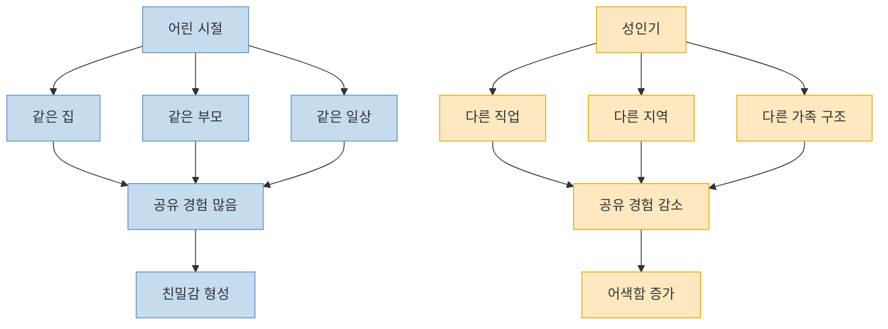
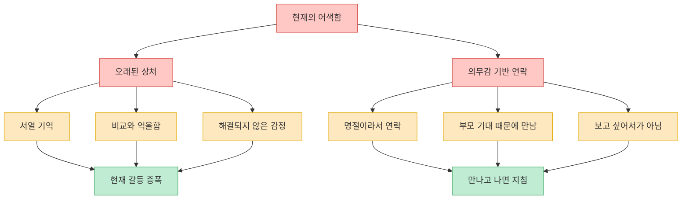
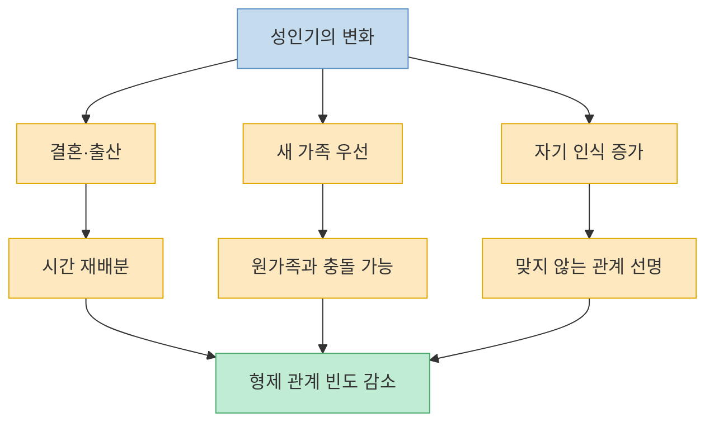
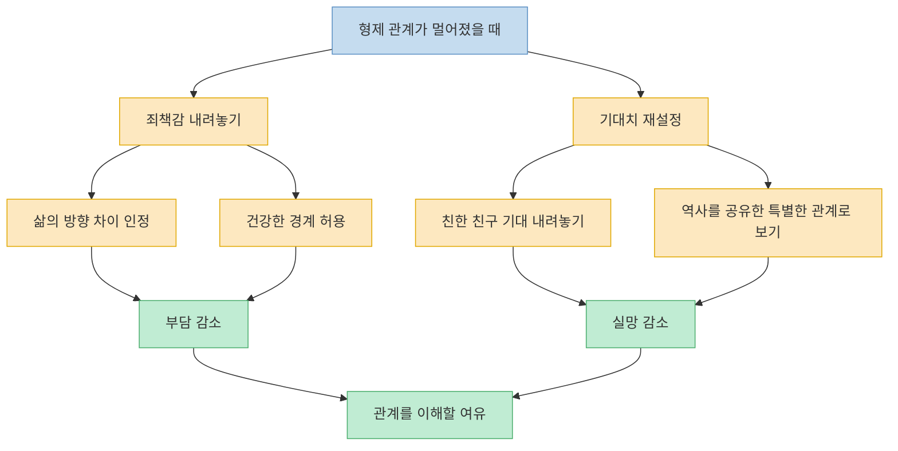

이 영상은 많은 사람이 마음 한켠에 품고 있지만 잘 말하지 않는 질문을 다룬다. **왜 형제자매는 세상에서 가장 오래 안 사람인데도, 어느 순간 남보다 어색해질까?** 어린 시절에는 같은 집, 같은 부모, 같은 일상을 공유했지만 성인이 되면 그 공통 기반이 빠르게 사라진다. 영상은 이 거리를 `나쁜 사람이라서`가 아니라, 삶의 방향이 갈라지고 오래된 감정이 다시 떠오르며, 관계의 우선순위와 의미가 바뀌기 때문이라고 설명한다. 핵심은 형제 관계가 끝났다는 진단이 아니라, **형태가 바뀌는 과정을 죄책감 대신 이해로 읽어 보자** 는 제안이다. [(0:30)](https://youtu.be/gybajJSfrs0?t=30), [(1:00)](https://youtu.be/gybajJSfrs0?t=60), [(6:38)](https://youtu.be/gybajJSfrs0?t=398)

<!--more-->

## Sources

- [형제가 남보다 어색해지는 5가지 심리학적 이유 | 나이 들수록 형제와 멀어지는 건, 당신 잘못이 아닙니다](https://www.youtube.com/watch?v=gybajJSfrs0) — 마인드풀 메이트 | 심리학

---

## 첫 번째 이유: 같은 수족관에서 살다가 다른 물로 옮겨간다

영상이 가장 먼저 제시하는 비유는 `수족관`이다. 어린 시절의 형제자매는 같은 수족관 안의 물고기처럼 같은 물을 마시고 같은 환경에서 헤엄친다. 하지만 성인이 되면 각자 다른 수족관으로 옮겨간다. 누군가는 대기업 직장인이 되고, 누군가는 자영업자가 되며, 누군가는 서울에 남고 누군가는 지방으로 내려간다. 결혼, 취업, 이사, 출산 같은 생애 전환이 누적되면서 예전의 공통 분모는 빠르게 줄어든다. [(1:20)](https://youtu.be/gybajJSfrs0?t=80), [(1:32)](https://youtu.be/gybajJSfrs0?t=92), [(2:07)](https://youtu.be/gybajJSfrs0?t=127), [(2:25)](https://youtu.be/gybajJSfrs0?t=145)

이 설명의 핵심은 친밀감이 혈연 그 자체보다 `공유된 경험`에서 나온다는 점이다. 어릴 때는 같은 동네, 같은 부모의 잔소리, 같은 TV 프로그램, 같은 저녁 메뉴가 있었다. 그런데 그 경험이 갈라지면 대화는 점점 `무슨 말을 하지?`를 먼저 고민하는 관계가 되기 쉽다. 즉 형제자매가 어색해지는 것은 갑자기 정이 없어져서라기보다, **더 이상 자동으로 겹치는 삶이 없기 때문** 이라는 설명이다. [(1:58)](https://youtu.be/gybajJSfrs0?t=118), [(2:22)](https://youtu.be/gybajJSfrs0?t=142), [(2:28)](https://youtu.be/gybajJSfrs0?t=148), [(2:32)](https://youtu.be/gybajJSfrs0?t=152)

---

## 두 번째와 세 번째 이유: 오래된 상처와 의무감이 관계를 무겁게 만든다

영상은 형제자매 관계의 어색함이 현재의 사건만으로 설명되지 않을 수 있다고 말한다. 어린 시절에는 잘 몰랐던 서열, 비교, 차별감, 억울함이 성인이 되어 다시 수면 위로 올라오기도 한다는 것이다. 특히 부모 부양, 재산 이야기, 가족 역할 분담 같은 현실 문제가 등장하면 과거의 감정이 현재의 대화 위에 그대로 덮여 씌워질 수 있다. 그래서 지금의 불편함이 꼭 `오늘 싸워서` 생긴 것이 아니라, **훨씬 오래된 감정이 아직 끝나지 않았기 때문** 일 수 있다는 설명이 나온다. [(2:37)](https://youtu.be/gybajJSfrs0?t=157), [(3:01)](https://youtu.be/gybajJSfrs0?t=181), [(3:11)](https://youtu.be/gybajJSfrs0?t=191), [(3:15)](https://youtu.be/gybajJSfrs0?t=195)

여기에 더해 영상은 `의무로 유지되는 관계`가 결국 사람을 지치게 만든다고 말한다. 형제에게 연락하는 이유가 보고 싶어서인지, 명절이라서인지, 부모가 기다리기 때문인지 묻는 장면이 그 핵심이다. 심리학적으로 관계를 자발적 관계와 의무적 관계로 나눠 보면, 자발적 관계는 에너지를 주지만 의무적 관계는 에너지를 빼앗는 쪽으로 느껴질 수 있다는 것이다. 이때 사람은 자연스럽게 자발적 관계에 더 많은 시간을 쓰고, 의무적 관계는 뒤로 밀리게 된다. 영상은 이것을 이기심이 아니라 **심리적 생존을 위한 선택** 으로 해석한다. [(3:18)](https://youtu.be/gybajJSfrs0?t=198), [(3:26)](https://youtu.be/gybajJSfrs0?t=206), [(3:35)](https://youtu.be/gybajJSfrs0?t=215), [(4:00)](https://youtu.be/gybajJSfrs0?t=240)

---

## 네 번째와 다섯 번째 이유: 새 가족과 더 선명해진 자아가 관계의 우선순위를 바꾼다

영상의 네 번째 이유는 `새 가족이 우선 순위가 되는 것`을 문제라기보다 건강한 성장의 증거로 본다는 점이다. 결혼하고 아이가 생기면 시간과 에너지의 첫 번째 수신자는 형제자매가 아니라 배우자와 자녀가 된다. 여기서 한쪽은 원가족을 더 중요하게 여기고, 다른 한쪽은 새 가족을 우선시하면서 충돌이 생기기도 한다. 하지만 영상은 이 차이를 옳고 그름보다 우선순위 변화로 읽는다. 심리학적으로는 가족 감정 시스템 안에서 독립된 자아를 확립해 가는 `자기 분화`의 일부라는 것이다. [(4:11)](https://youtu.be/gybajJSfrs0?t=251), [(4:24)](https://youtu.be/gybajJSfrs0?t=264), [(4:34)](https://youtu.be/gybajJSfrs0?t=274), [(4:41)](https://youtu.be/gybajJSfrs0?t=281)

다섯 번째 이유는 나이 들수록 자기 인식이 깊어지면서 `맞지 않는 관계`가 더 또렷해진다는 설명이다. 20대에는 잘 몰랐지만 30대, 40대로 갈수록 나는 어떤 사람인지, 어떤 관계에서 편안한지, 어떤 대화 방식이 나를 소진시키는지가 더 선명해진다. 이때 가치관이 너무 다르거나, 만날 때마다 어린 시절의 나로 되돌아가는 느낌이 들거나, 대화가 계속 소모적으로 느껴지면 형제 관계 역시 자연스럽게 멀어질 수 있다. 영상은 이것을 사회적 관계망의 자발적 축소이자 심리적으로 건강한 노화의 일부라고 해석한다. [(5:00)](https://youtu.be/gybajJSfrs0?t=300), [(5:15)](https://youtu.be/gybajJSfrs0?t=315), [(5:23)](https://youtu.be/gybajJSfrs0?t=323), [(5:34)](https://youtu.be/gybajJSfrs0?t=334)

이 설명이 의미 있는 이유는, 형제자매와 거리가 생기는 경험을 곧바로 냉정함이나 배신으로 읽지 않게 도와주기 때문이다. 삶의 중심축이 바뀌고, 관계에서 원하는 것도 바뀌고, 에너지를 쓰는 방식도 바뀌면 관계는 이전과 다른 모양을 취할 수밖에 없다. 영상은 바로 그 점을 `형태의 변화`로 본다. [(4:56)](https://youtu.be/gybajJSfrs0?t=296), [(5:39)](https://youtu.be/gybajJSfrs0?t=339), [(7:19)](https://youtu.be/gybajJSfrs0?t=439)

---

## 그래서 어떻게 볼 것인가: 죄책감을 낮추고 기대치를 바꾼다

영상 후반은 진단보다 재해석에 가깝다. 먼저 형제자매와 멀어지는 것에 대한 죄책감을 내려놓으라고 말한다. 이 거리는 당신이 나쁜 사람이어서가 아니라 삶의 방향이 달라졌고, 에너지를 재배분하고, 건강한 경계를 세우는 과정일 수 있기 때문이다. 오히려 의무감만으로 붙들고 있는 관계는 상대에게도 진짜 관계가 아니라고 말한다. [(6:31)](https://youtu.be/gybajJSfrs0?t=391), [(6:38)](https://youtu.be/gybajJSfrs0?t=398), [(6:45)](https://youtu.be/gybajJSfrs0?t=405), [(6:49)](https://youtu.be/gybajJSfrs0?t=409)

두 번째 제안은 기대치를 재설정하라는 것이다. 형제자매를 평생 가장 친한 친구처럼 기대하면 실망하기 쉽다. 대신 `내 역사를 공유한 특별한 사랑`으로 정의하면 관계의 기준이 달라진다. 매주 연락하지 않아도, 매일 속마음을 털어놓지 않아도, 삶의 결정적인 순간에 서로 있어 줄 수 있다면 그 정도의 관계도 충분히 의미 있다는 것이다. 이 지점에서 영상은 형제 관계의 목표를 `늘 가까움`이 아니라 **형태가 달라져도 남는 연결감** 으로 바꿔 놓는다. [(6:55)](https://youtu.be/gybajJSfrs0?t=415), [(7:03)](https://youtu.be/gybajJSfrs0?t=423), [(7:06)](https://youtu.be/gybajJSfrs0?t=426), [(7:11)](https://youtu.be/gybajJSfrs0?t=431)

마지막 정리는 더 짧고 강하다. 형제를 버리라는 말이 아니라 관계의 형태가 바뀐다는 말이라는 것, 그리고 관계는 무조건 가꾸는 것만이 아니라 이해하는 것이기도 하다는 점이다. 이 영상이 주는 가장 큰 위로는 형제 관계의 거리감을 억지로 없애 주는 것이 아니라, **그 거리가 왜 생겼는지 이해할 언어를 준다** 는 데 있다. [(7:14)](https://youtu.be/gybajJSfrs0?t=434), [(7:21)](https://youtu.be/gybajJSfrs0?t=441), [(7:38)](https://youtu.be/gybajJSfrs0?t=458), [(7:54)](https://youtu.be/gybajJSfrs0?t=474)

---

## 핵심 요약

- 이 영상은 형제자매가 멀어지는 이유를 개인의 잘못보다 성인기의 삶 분화로 설명한다. 어린 시절의 공유 경험이 줄어들면 친밀감도 자연스럽게 약해질 수 있다는 것이다. [(1:20)](https://youtu.be/gybajJSfrs0?t=80), [(2:28)](https://youtu.be/gybajJSfrs0?t=148)
- 현재의 어색함은 지금의 사건만이 아니라, 해결되지 않은 어린 시절 상처와 서열 감정이 다시 올라온 결과일 수 있다. [(2:37)](https://youtu.be/gybajJSfrs0?t=157), [(3:11)](https://youtu.be/gybajJSfrs0?t=191)
- 형제 관계가 의무 중심으로 유지되면 에너지를 빼앗기 쉬워지고, 사람은 자연스럽게 자발적 관계에 더 많이 투자하게 된다. [(3:35)](https://youtu.be/gybajJSfrs0?t=215), [(4:00)](https://youtu.be/gybajJSfrs0?t=240)
- 결혼, 출산, 새 가족의 형성, 자기 인식의 심화는 형제 관계의 우선순위와 거리감을 바꾸는 정상적인 발달 과정으로 제시된다. [(4:11)](https://youtu.be/gybajJSfrs0?t=251), [(5:34)](https://youtu.be/gybajJSfrs0?t=334)
- 영상의 결론은 관계를 억지로 과거처럼 되돌리기보다, 죄책감을 낮추고 기대치를 재설정해 새로운 형태의 형제 관계를 이해하자는 데 있다. [(6:38)](https://youtu.be/gybajJSfrs0?t=398), [(7:03)](https://youtu.be/gybajJSfrs0?t=423), [(7:54)](https://youtu.be/gybajJSfrs0?t=474)

---

## 결론

형제자매는 가장 오래 알고 지낸 사람이지만, 그렇다고 평생 가장 가까운 사람으로 남는다는 보장은 없다. 이 영상은 그 사실을 차갑게 말하기보다, 오히려 자연스러운 성장의 결과로 해석해 준다. 삶의 방향이 갈라지고, 가족의 우선순위가 바뀌고, 나 자신을 더 잘 알게 되면 관계 역시 다른 모양이 되는 것이 이상한 일이 아니라는 것이다. [(1:32)](https://youtu.be/gybajJSfrs0?t=92), [(4:24)](https://youtu.be/gybajJSfrs0?t=264), [(5:15)](https://youtu.be/gybajJSfrs0?t=315)

그래서 이 영상이 주는 가장 실용적인 메시지는 단순하다. 예전처럼 가깝지 않다는 이유만으로 자신을 탓하지 말고, 그 거리 속에서도 어떤 연결이 아직 남아 있는지 다시 정의해 보라는 것이다. 형제 관계는 때로 덜 자주 만나더라도, 결정적인 순간에 서로의 역사를 기억해 주는 관계로 남을 수 있다. [(6:45)](https://youtu.be/gybajJSfrs0?t=405), [(7:06)](https://youtu.be/gybajJSfrs0?t=426), [(7:38)](https://youtu.be/gybajJSfrs0?t=458)
