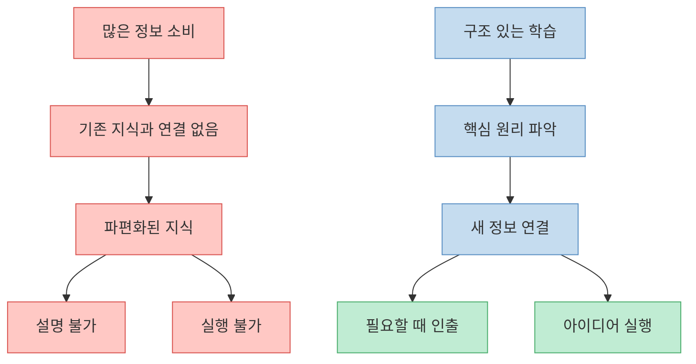
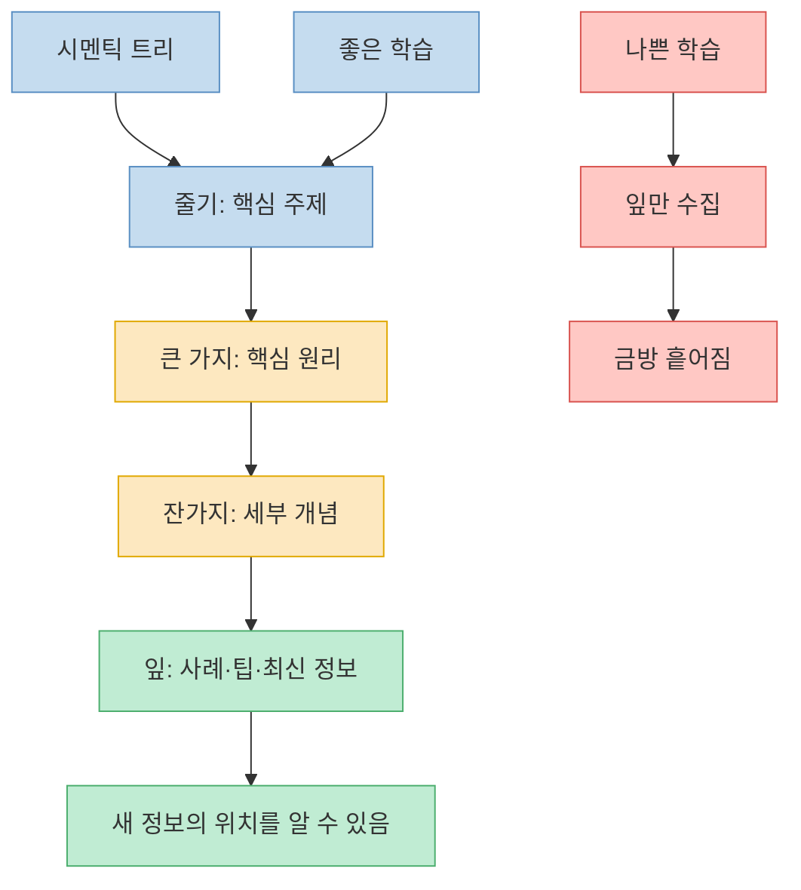
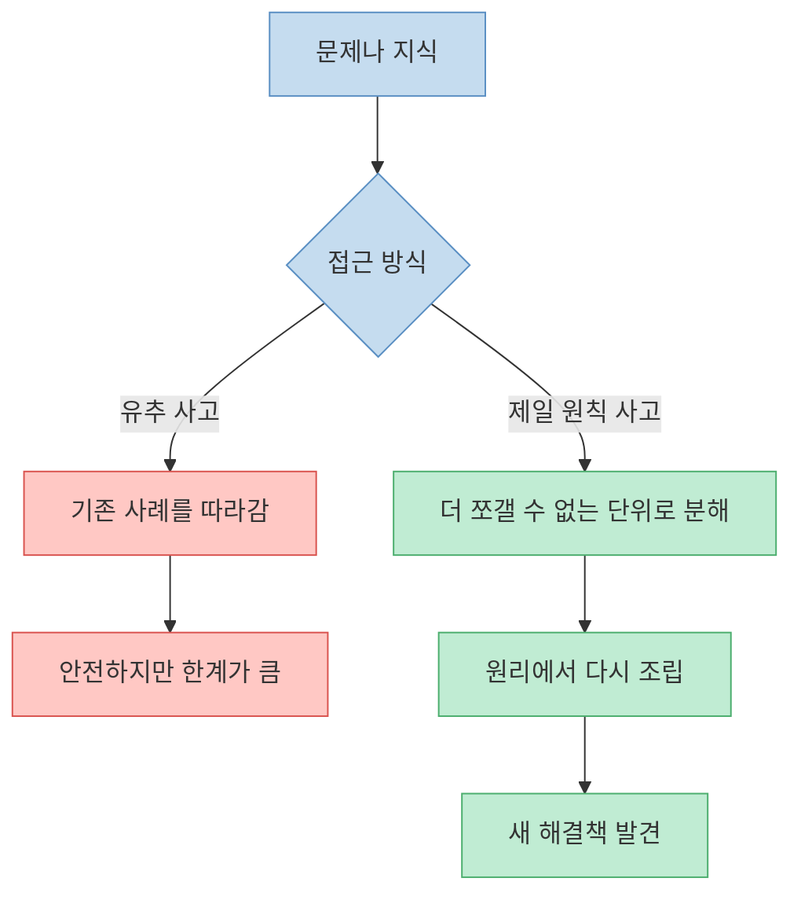
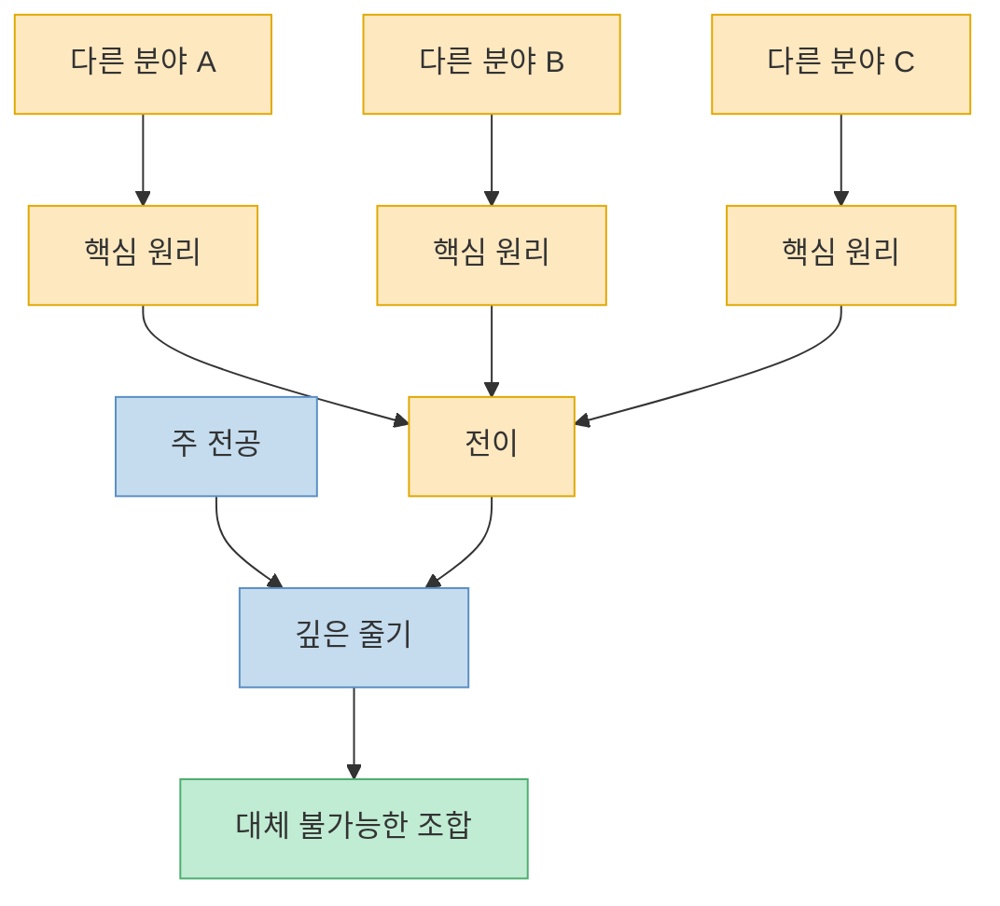
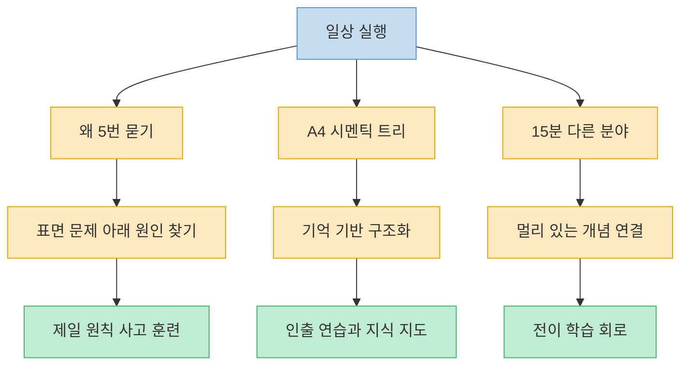

이 영상은 `일론 머스크처럼 배우는 법`이라는 강한 제목을 달고 있지만, 실제 핵심은 꽤 실용적이다. 많이 읽고 많이 보는 것보다 먼저 **지식이 붙을 구조를 만들어야 한다** 는 이야기다. 영상은 이를 `시멘틱 트리`, 즉 의미의 나무로 설명한다. 줄기와 큰 가지가 없는 상태에서 나뭇잎 같은 정보만 모으면 바람 한 번에 날아가지만, 핵심 원리라는 줄기를 세우면 새 정보가 어디에 붙어야 하는지 보인다는 것이다. 다만 영상 속 일부 연구명·수치·사례는 영상 내 주장으로만 다루고, 여기서는 검증된 사실처럼 확장하지 않고 학습법의 구조를 정리하는 데 초점을 둔다. [(0:27)](https://youtu.be/lAL7YPAHpSY?t=27), [(2:58)](https://youtu.be/lAL7YPAHpSY?t=178), [(4:18)](https://youtu.be/lAL7YPAHpSY?t=258), [(5:21)](https://youtu.be/lAL7YPAHpSY?t=321)

<!--more-->

## Sources

- [후천적으로 천재 두뇌 만드는 일론 머스크 학습법](https://www.youtube.com/watch?v=lAL7YPAHpSY) — 레디포그로스 (Ready For Growth)

---

## 왜 많이 배우는데도 남는 게 없을까: 정보가 아니라 구조의 문제

영상은 초반에 `콘텐츠 과식증`이라는 문제의식을 꺼낸다. 유익한 강의를 보고 고개를 끄덕이고, 자기계발서를 여러 권 읽었는데도 며칠 뒤에는 설명할 수 없는 상태가 된다는 것이다. 이 설명에서 중요한 지점은 학습 실패를 게으름으로 보지 않는다는 점이다. 오히려 너무 성실하게 많은 정보를 받아들이지만, 그 정보가 기존 지식과 연결되지 않아 머릿속에 흩어진 채 남는다고 본다. [(0:27)](https://youtu.be/lAL7YPAHpSY?t=27), [(0:38)](https://youtu.be/lAL7YPAHpSY?t=38), [(1:02)](https://youtu.be/lAL7YPAHpSY?t=62), [(2:38)](https://youtu.be/lAL7YPAHpSY?t=158)

여기서 영상이 사용하는 비유는 `바닥에 책이 널린 도서관`이다. 책이 많아도 분류 체계가 없으면 필요한 책을 찾을 수 없다. 마찬가지로 머릿속에 정보가 많아도 개념 간 연결망이 없으면 지식은 꺼내 쓰기 어렵다. 그래서 영상은 학습의 핵심을 더 많이 넣는 것이 아니라, **새 정보가 들어왔을 때 어디에 붙일지 결정하는 구조를 먼저 세우는 것** 으로 잡는다. [(2:58)](https://youtu.be/lAL7YPAHpSY?t=178), [(3:11)](https://youtu.be/lAL7YPAHpSY?t=191), [(3:38)](https://youtu.be/lAL7YPAHpSY?t=218), [(4:02)](https://youtu.be/lAL7YPAHpSY?t=242)

---

## 시멘틱 트리: 나뭇잎보다 줄기와 큰 가지를 먼저 세운다

영상의 중심 개념은 `시멘틱 트리`다. 대부분의 사람은 나뭇잎에 해당하는 사실, 팁, 최신 정보, 사례부터 모은다. 하지만 나무의 줄기와 큰 가지가 없으면 잎은 붙을 곳이 없다. 영상은 바로 이 점을 일론 머스크식 학습법의 핵심으로 설명한다. 로켓, 전기차, 인공지능처럼 서로 달라 보이는 분야도 먼저 원리와 구조를 잡으면 서로 연결할 수 있다는 것이다. [(4:18)](https://youtu.be/lAL7YPAHpSY?t=258), [(4:27)](https://youtu.be/lAL7YPAHpSY?t=267), [(4:34)](https://youtu.be/lAL7YPAHpSY?t=274), [(5:01)](https://youtu.be/lAL7YPAHpSY?t=301)

이 관점에서 좋은 학습은 `목차대로 많이 읽기`보다 `이 분야의 줄기는 무엇인가`를 묻는 데서 시작한다. 예를 들어 마케팅을 공부한다면 유행하는 카피 문구 100개를 외우는 것이 나뭇잎 수집이다. 반면 인간이 언제 공포를 느끼고, 언제 보상을 기대하며, 어떤 상황에서 행동을 바꾸는지를 이해하는 것은 줄기와 큰 가지를 세우는 일이다. 줄기가 생기면 유행하는 트렌드나 밈은 계절에 따라 달라지는 잎처럼 다룰 수 있다. [(8:34)](https://youtu.be/lAL7YPAHpSY?t=514), [(8:42)](https://youtu.be/lAL7YPAHpSY?t=522), [(9:02)](https://youtu.be/lAL7YPAHpSY?t=542), [(9:20)](https://youtu.be/lAL7YPAHpSY?t=560)

그래서 시멘틱 트리의 실전 질문은 단순하다. `이 분야의 핵심 주제는 무엇인가?`, `그 주제를 지탱하는 큰 원리는 무엇인가?`, `지금 배우는 세부 정보는 어느 가지에 붙는가?` 이 세 질문을 계속 던지면 정보는 더 이상 낱장 메모로 흩어지지 않는다. 하나의 지식 지도 안에서 위치를 갖게 된다. [(13:49)](https://youtu.be/lAL7YPAHpSY?t=829), [(14:12)](https://youtu.be/lAL7YPAHpSY?t=852), [(14:22)](https://youtu.be/lAL7YPAHpSY?t=862), [(15:02)](https://youtu.be/lAL7YPAHpSY?t=902)

---

## 제일 원칙 사고: 완제품이 아니라 레고 블록을 본다

첫 번째 전략은 `제일 원칙 사고`다. 영상은 이를 어떤 현상을 더 이상 쪼갤 수 없는 본질 단위까지 분해한 뒤 다시 쌓아 올리는 방식이라고 설명한다. 반대편에는 유추에 의한 사고가 있다. 유추는 기존 사례를 따라 하는 데는 유용하지만, 기존 가격과 기존 방식이 미래까지 그대로 이어질 것이라고 믿게 만들 수 있다. [(6:21)](https://youtu.be/lAL7YPAHpSY?t=381), [(6:29)](https://youtu.be/lAL7YPAHpSY?t=389), [(6:39)](https://youtu.be/lAL7YPAHpSY?t=399), [(7:00)](https://youtu.be/lAL7YPAHpSY?t=420)

영상은 배터리 사례를 통해 이 사고방식을 설명한다. 완제품 가격만 보면 `전기차는 비싸서 대중화되기 어렵다`는 결론으로 가기 쉽지만, 배터리를 물리적 소재 단위로 분해하면 다른 가능성이 보인다는 것이다. 여기서 중요한 건 특정 수치 자체보다 사고의 방향이다. 남들이 완제품의 가격표를 볼 때, 제일 원칙 사고는 그 완제품을 구성하는 부품과 원재료, 물리적 한계, 대체 가능한 과정으로 쪼개 본다. [(7:07)](https://youtu.be/lAL7YPAHpSY?t=427), [(7:39)](https://youtu.be/lAL7YPAHpSY?t=459), [(8:02)](https://youtu.be/lAL7YPAHpSY?t=482), [(8:20)](https://youtu.be/lAL7YPAHpSY?t=500)

학습에도 이 방식은 그대로 적용된다. 특정 분야의 팁을 외우기 전에 `이 분야가 실제로 해결하려는 문제는 무엇인가`, `가장 작은 단위의 원리는 무엇인가`, `그 원리에서 어떤 응용이 나올 수 있는가`를 묻는 것이다. 이 질문이 생기면 공부는 암기가 아니라 재구성이 된다. [(8:29)](https://youtu.be/lAL7YPAHpSY?t=509), [(8:42)](https://youtu.be/lAL7YPAHpSY?t=522), [(9:07)](https://youtu.be/lAL7YPAHpSY?t=547), [(9:28)](https://youtu.be/lAL7YPAHpSY?t=568)

---

## 전이 학습: 넓게 파야 깊게 팔 수 있다

두 번째 전략은 `전이 학습`이다. 영상은 한 분야에서 배운 원리를 다른 분야로 옮기는 능력을 창의성의 핵심으로 본다. 소프트웨어에서 배운 사고방식을 하드웨어 제조나 로켓 제작에 적용하는 식이다. 보통 사람은 이를 산만하다고 부르지만, 영상은 이것을 `지식의 교차 수분`이라고 표현한다. [(9:36)](https://youtu.be/lAL7YPAHpSY?t=576), [(10:01)](https://youtu.be/lAL7YPAHpSY?t=601), [(10:09)](https://youtu.be/lAL7YPAHpSY?t=609), [(10:22)](https://youtu.be/lAL7YPAHpSY?t=622)

여기서 핵심 문장은 `깊게 파기 위해서라도 넓게 파야 한다`는 것이다. 한 우물만 파면 전문성은 생기지만, 전혀 다른 문제를 만났을 때 옮겨 쓸 원리가 부족할 수 있다. 반대로 주특기라는 줄기를 세운 뒤 다른 분야의 핵심 원리를 가지처럼 접목하면, 남들이 보지 못한 연결이 생긴다. 이때 넓게 배운다는 말은 얕은 정보 소비를 늘리라는 뜻이 아니다. **각 분야의 줄기와 큰 가지를 뽑아내 내 주 전공과 연결하라** 는 뜻에 가깝다. [(10:27)](https://youtu.be/lAL7YPAHpSY?t=627), [(10:41)](https://youtu.be/lAL7YPAHpSY?t=641), [(11:07)](https://youtu.be/lAL7YPAHpSY?t=667), [(11:13)](https://youtu.be/lAL7YPAHpSY?t=673)

---

## 세 가지 마이크로 액션: 원리를 일상으로 내리는 방법

영상은 후반부에서 추상적인 원리를 일상 훈련으로 바꾼다. 첫 번째는 `왜?`를 다섯 번 묻는 것이다. 예를 들어 보고서 작성이 어렵다는 문제를 두고 계속 왜를 물으면, 처음에는 자료가 많아서라고 생각했던 문제가 결국 상사에게 구체적으로 질문하지 못한 두려움으로 드러날 수 있다. 이렇게 표면 증상이 아니라 원인을 찾아 내려가면 해결책도 달라진다. [(12:41)](https://youtu.be/lAL7YPAHpSY?t=761), [(13:06)](https://youtu.be/lAL7YPAHpSY?t=786), [(13:20)](https://youtu.be/lAL7YPAHpSY?t=800), [(13:40)](https://youtu.be/lAL7YPAHpSY?t=820)

두 번째는 `한 장의 시멘틱 트리`를 그리는 것이다. 공부할 때 A4 한 장을 꺼내 가운데 핵심 주제를 쓰고, 거기서 뻗는 핵심 원리 세 가지를 굵은 가지로 그린 뒤, 세부 내용을 잔가지로 붙인다. 중요한 건 책을 보면서 베끼는 것이 아니라, 책을 덮고 기억에 의존해 그리는 것이다. 이 과정은 단순 정리가 아니라 인출 연습이다. 머릿속 구조가 얼마나 잡혀 있는지 드러나기 때문이다. [(14:08)](https://youtu.be/lAL7YPAHpSY?t=848), [(14:19)](https://youtu.be/lAL7YPAHpSY?t=859), [(14:34)](https://youtu.be/lAL7YPAHpSY?t=874), [(14:44)](https://youtu.be/lAL7YPAHpSY?t=884)

세 번째는 하루 15분 동안 전혀 다른 분야를 엿보는 것이다. 개발자가 미술사를 보고, 디자이너가 양자역학 입문 영상을 보는 식이다. 처음에는 시간 낭비처럼 느껴질 수 있지만, 한 달쯤 지나면 다른 분야의 구조가 자신의 주 전공 문제를 푸는 데 힌트가 될 수 있다고 영상은 설명한다. 이 훈련은 지식의 폭을 늘리는 것보다, **서로 멀리 떨어진 개념을 연결하는 회로를 만드는 것** 에 가깝다. [(15:12)](https://youtu.be/lAL7YPAHpSY?t=912), [(15:18)](https://youtu.be/lAL7YPAHpSY?t=918), [(15:36)](https://youtu.be/lAL7YPAHpSY?t=936), [(15:43)](https://youtu.be/lAL7YPAHpSY?t=943)

---

## 실패를 데이터로 보는 태도

마지막으로 영상은 기술보다 더 중요한 것으로 실패를 대하는 태도를 든다. 스페이스X의 로켓 실패 사례를 언급하며, 실패를 능력 부족의 증거가 아니라 성공으로 가는 과정에서 얻는 데이터로 해석하라고 말한다. 학습에서도 마찬가지다. 첫 시도에서 이해가 안 되거나, 시멘틱 트리가 엉성하게 그려지거나, 다른 분야를 봐도 연결이 안 되는 것은 실패가 아니라 회로를 새로 만드는 과정에서 생기는 저항이라고 보는 것이다. [(16:07)](https://youtu.be/lAL7YPAHpSY?t=967), [(16:13)](https://youtu.be/lAL7YPAHpSY?t=973), [(16:24)](https://youtu.be/lAL7YPAHpSY?t=984), [(16:41)](https://youtu.be/lAL7YPAHpSY?t=1001)

이 관점은 앞의 모든 전략을 지속하게 만드는 기반이다. 제일 원칙 사고는 처음엔 느리고, 시멘틱 트리는 처음엔 빈약하고, 전이 학습은 처음엔 산만해 보인다. 그러나 그 시행착오를 데이터로 기록하면 다음 시도에서 가지가 더 굵어진다. 결국 후천적 학습 능력은 단번에 똑똑해지는 기술이 아니라, **실패를 정보로 바꾸는 반복 시스템** 에서 나온다. [(17:00)](https://youtu.be/lAL7YPAHpSY?t=1020), [(17:27)](https://youtu.be/lAL7YPAHpSY?t=1047), [(17:51)](https://youtu.be/lAL7YPAHpSY?t=1071)

---

## 핵심 요약

- 영상의 핵심은 정보를 많이 넣는 것이 아니라, 정보가 붙을 `시멘틱 트리`를 먼저 세우라는 것이다. [(4:18)](https://youtu.be/lAL7YPAHpSY?t=258), [(5:21)](https://youtu.be/lAL7YPAHpSY?t=321)
- 제일 원칙 사고는 완제품이나 기존 사례를 그대로 보지 않고, 더 이상 쪼갤 수 없는 기본 단위까지 분해한 뒤 다시 조립하는 방식이다. [(6:21)](https://youtu.be/lAL7YPAHpSY?t=381), [(8:20)](https://youtu.be/lAL7YPAHpSY?t=500)
- 전이 학습은 한 분야의 핵심 원리를 다른 분야로 옮겨 붙이는 훈련이며, 깊게 파기 위해 넓게 파야 한다는 메시지로 정리된다. [(9:36)](https://youtu.be/lAL7YPAHpSY?t=576), [(11:07)](https://youtu.be/lAL7YPAHpSY?t=667)
- 실전 훈련은 `왜 5번 묻기`, `A4 시멘틱 트리 그리기`, `하루 15분 다른 분야 보기` 세 가지로 제안된다. [(12:41)](https://youtu.be/lAL7YPAHpSY?t=761), [(14:08)](https://youtu.be/lAL7YPAHpSY?t=848), [(15:12)](https://youtu.be/lAL7YPAHpSY?t=912)
- 실패는 능력 부족의 증거가 아니라 학습 시스템을 조정하기 위한 데이터로 다뤄야 한다. [(16:13)](https://youtu.be/lAL7YPAHpSY?t=973), [(16:41)](https://youtu.be/lAL7YPAHpSY?t=1001)

---

## 결론

이 영상이 말하는 `천재 두뇌`는 타고난 IQ보다 지식을 다루는 방식에 가깝다. 줄기 없이 잎만 모으는 학습을 멈추고, 핵심 원리라는 줄기를 세운 뒤, 다른 분야의 가지를 접목하고, 실패를 데이터로 기록하는 사람은 시간이 갈수록 더 빨리 배운다. [(0:11)](https://youtu.be/lAL7YPAHpSY?t=11), [(4:18)](https://youtu.be/lAL7YPAHpSY?t=258), [(9:36)](https://youtu.be/lAL7YPAHpSY?t=576)

실전적으로는 오늘 배운 내용을 바로 A4 한 장으로 그려 보는 것부터 시작하면 된다. 가운데 주제 하나, 큰 원리 세 개, 세부 사례 몇 개만 적어도 지금 내 머릿속에 줄기가 있는지 없는지가 보인다. 그 지도를 매일 조금씩 고치다 보면, 공부는 정보 소비가 아니라 구조를 세우는 일이 된다. [(14:19)](https://youtu.be/lAL7YPAHpSY?t=859), [(14:44)](https://youtu.be/lAL7YPAHpSY?t=884), [(17:00)](https://youtu.be/lAL7YPAHpSY?t=1020)
