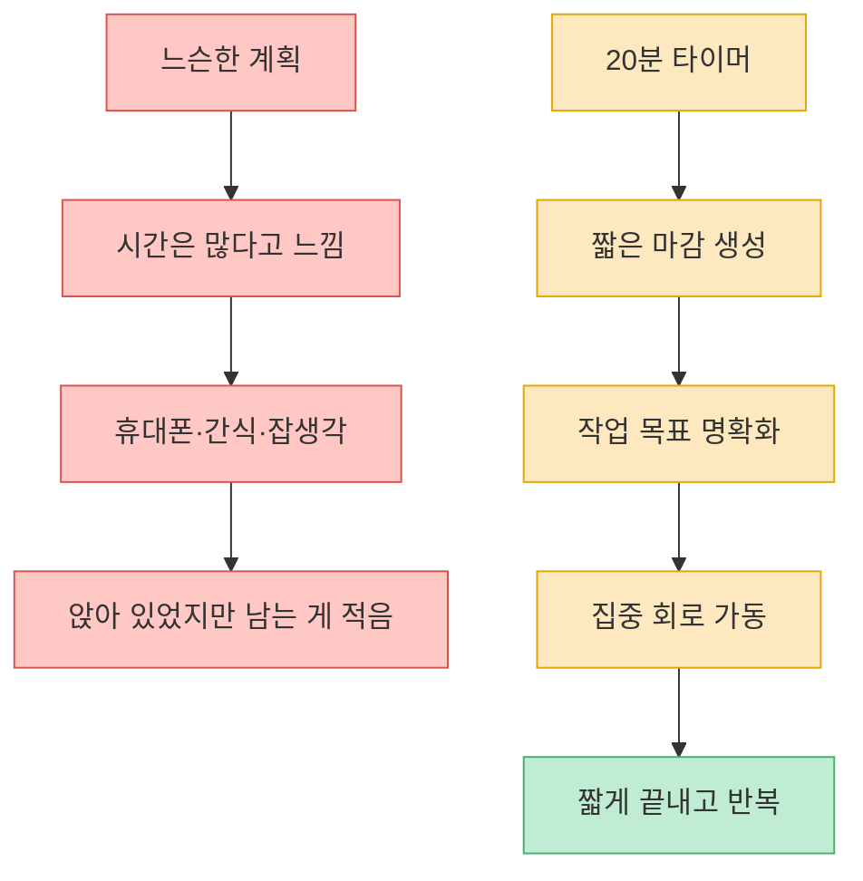
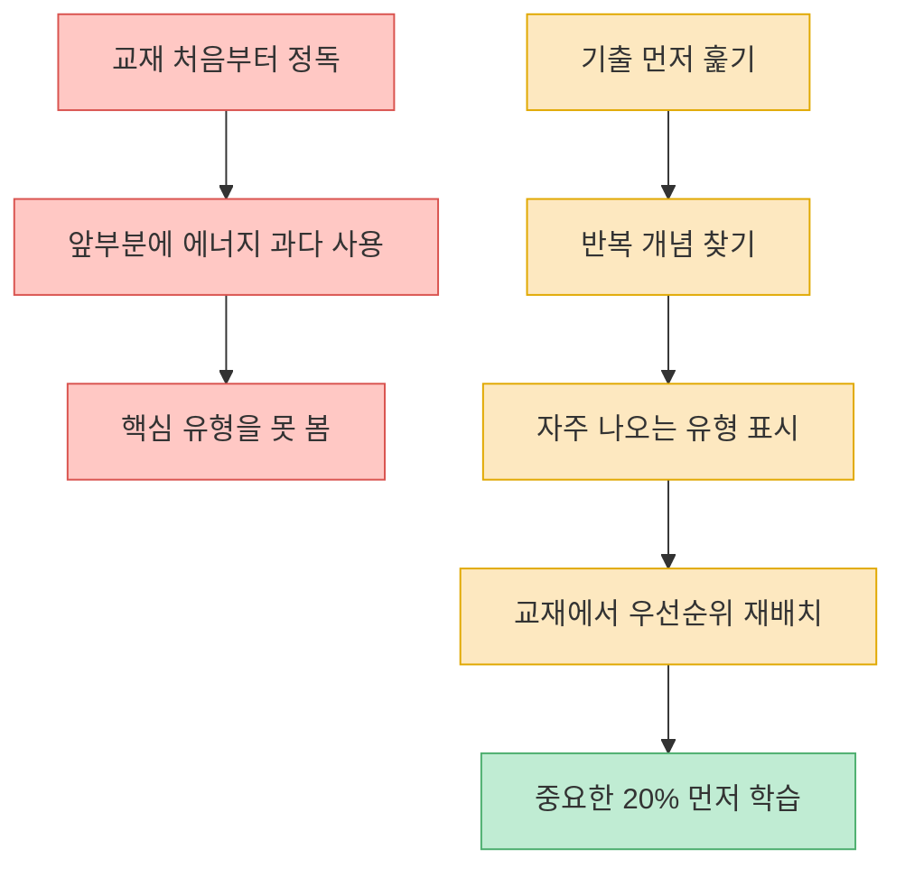
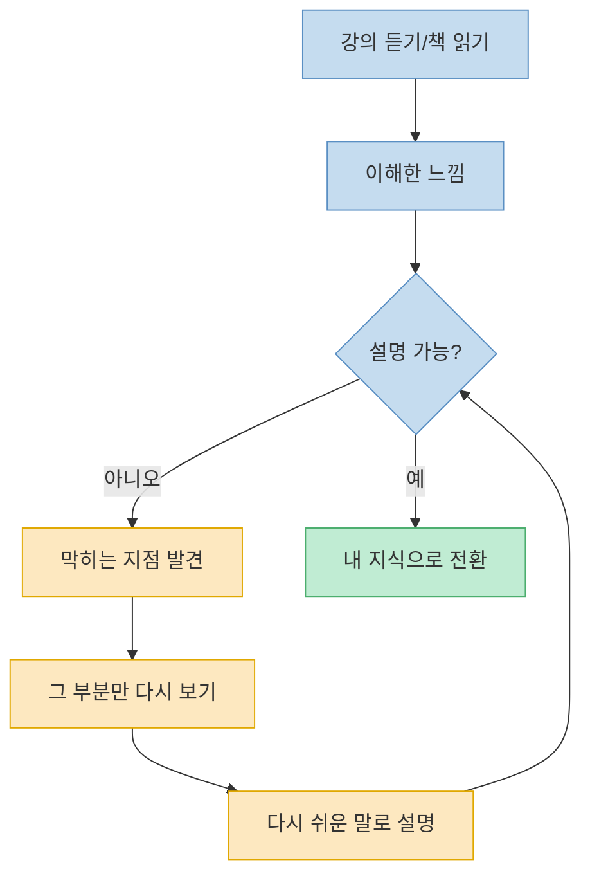
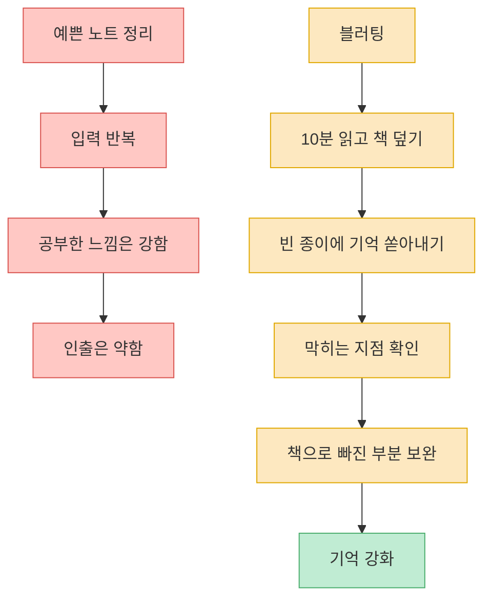
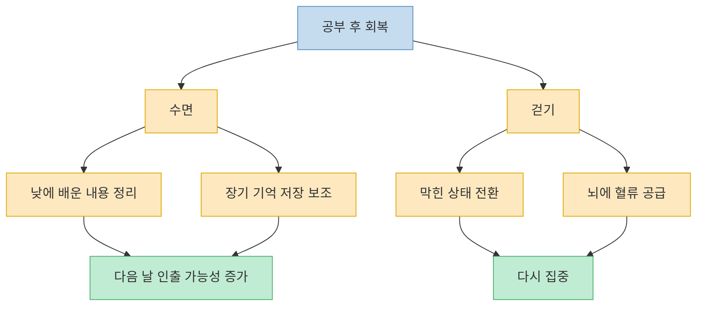

이 영상은 `10시간 공부를 2시간으로 압축한다`는 강한 표현을 쓰지만, 핵심은 단순하다. 공부 시간을 늘리는 것보다 **뇌가 실제로 정보를 처리하게 만드는 방식** 이 중요하다는 것이다. 영상은 밑줄 긋기, 예쁜 노트 정리, 오래 앉아 있기처럼 공부한 느낌은 강하지만 실제 인출이 약한 방식을 비판하고, 대신 시간 압박, 출제 우선순위, 설명하기, 백지 인출, 수면과 걷기를 제안한다. 일부 신경과학 표현과 수치 주장은 영상 내 설명으로만 받아들이되, 공부법의 큰 방향은 `입력보다 인출`, `양보다 우선순위`, `밤샘보다 회복`으로 정리할 수 있다. [(0:00)](https://youtu.be/uCueqDriw8s?t=0), [(0:34)](https://youtu.be/uCueqDriw8s?t=34), [(7:00)](https://youtu.be/uCueqDriw8s?t=420), [(10:23)](https://youtu.be/uCueqDriw8s?t=623)

<!--more-->

## Sources

- [미친 속도로 공부하는 법 (날 새지 마세요) 40배 빠른 공부법](https://www.youtube.com/watch?v=uCueqDriw8s) — 갓생메이커

---

## 첫 번째 원리: 느슨한 계획 대신 20분짜리 압박을 만든다

영상은 시험 전날 갑자기 집중이 잘 되는 경험을 먼저 꺼낸다. 평소에는 휴대폰을 보고, 간식을 먹고, 책상에 앉아만 있다가도 마감이 닥치면 갑자기 속도가 붙는다는 것이다. 영상은 이것을 의지력 문제가 아니라 약간의 압박이 주의 집중을 켜는 조건이라고 설명한다. 너무 느긋하면 졸리고, 너무 긴장하면 패닉이 오지만, 딱 중간 정도의 압박이 있을 때 집중 성능이 올라간다는 해석이다. [(0:58)](https://youtu.be/uCueqDriw8s?t=58), [(1:10)](https://youtu.be/uCueqDriw8s?t=70), [(1:27)](https://youtu.be/uCueqDriw8s?t=87), [(1:35)](https://youtu.be/uCueqDriw8s?t=95)

그래서 영상은 `수학 3시간` 같은 느슨한 계획을 버리라고 말한다. 대신 `20분 안에 2페이지 연습문제 5개 풀고 채점까지 끝낸다`처럼 시간이 짧고 결과물이 분명한 과제를 만들라고 제안한다. 타이머를 켜면 뇌가 마감이 있다고 느끼고, 휴대폰이나 잡생각이 끼어들 틈이 줄어든다는 논리다. 핵심은 오래 앉는 것이 아니라 **작은 마감이 붙은 작업 단위** 로 공부를 쪼개는 것이다. [(2:11)](https://youtu.be/uCueqDriw8s?t=131), [(2:17)](https://youtu.be/uCueqDriw8s?t=137), [(2:22)](https://youtu.be/uCueqDriw8s?t=142), [(2:41)](https://youtu.be/uCueqDriw8s?t=161)

---

## 두 번째 원리: 처음부터 읽지 말고 기출로 20%를 찾는다

영상의 두 번째 축은 `인지 예산`이다. 집중해서 처리할 수 있는 에너지는 하루에 한정되어 있는데, 많은 사람이 교재 앞부분을 예쁘게 정리하는 데 그 예산을 다 써 버린다는 것이다. 그 결과 정작 시험에 자주 나오는 뒷부분이나 핵심 유형은 대충 훑고 끝나기 쉽다. 영상은 이 패턴을 `책 앞부분만 새카맣고 뒷부분은 새 책처럼 깨끗한 상태`로 비유한다. [(2:58)](https://youtu.be/uCueqDriw8s?t=178), [(3:23)](https://youtu.be/uCueqDriw8s?t=203), [(3:35)](https://youtu.be/uCueqDriw8s?t=215), [(3:56)](https://youtu.be/uCueqDriw8s?t=236)

해결책은 교재를 처음부터 읽기 전에 기출 문제를 먼저 보는 것이다. 여기서 중요한 건 처음부터 풀라는 뜻이 아니다. 5년치 기출을 훑으면서 반복되는 단어, 계속 나오는 개념, 자주 출제되는 유형을 체크하라는 것이다. 그다음 교재로 돌아가면 공부 순서가 바뀐다. 나오는 것부터 확실히 잡고, 여유가 생기면 나머지를 채우는 방식이다. [(4:08)](https://youtu.be/uCueqDriw8s?t=248), [(4:14)](https://youtu.be/uCueqDriw8s?t=254), [(4:20)](https://youtu.be/uCueqDriw8s?t=260), [(4:31)](https://youtu.be/uCueqDriw8s?t=271)

이 방법의 핵심은 `공부량을 줄이는 꼼수`가 아니라, 중요한 것에 먼저 집중력을 쓰는 것이다. 모든 페이지를 같은 무게로 다루면 체력은 빨리 줄고 기억은 얕아진다. 반대로 자주 나오는 개념과 유형을 먼저 잡으면, 남은 공부는 이미 세운 골격에 살을 붙이는 일이 된다. [(4:35)](https://youtu.be/uCueqDriw8s?t=275), [(4:42)](https://youtu.be/uCueqDriw8s?t=282), [(10:30)](https://youtu.be/uCueqDriw8s?t=630)

---

## 세 번째 원리: 들었다고 아는 게 아니라 설명할 수 있어야 안다

영상은 강의를 듣고 책을 읽는 것만으로는 공부가 끝나지 않는다고 말한다. 강사가 설명을 잘해서 이해한 것처럼 느껴져도, 실제로는 강사가 공부한 것이지 내가 공부한 게 아닐 수 있다는 것이다. 진짜 공부는 뇌가 정보를 재조합할 때 일어나고, 그 재조합은 누군가에게 설명하려고 할 때 강하게 발생한다고 설명한다. [(5:02)](https://youtu.be/uCueqDriw8s?t=302), [(5:08)](https://youtu.be/uCueqDriw8s?t=308), [(5:17)](https://youtu.be/uCueqDriw8s?t=317), [(5:27)](https://youtu.be/uCueqDriw8s?t=327)

여기서 등장하는 방법은 파인만식 설명이다. 공부가 끝나면 책을 덮고, 앞에 다섯 살짜리 아이가 있다고 생각하고 최대한 쉬운 말로 설명해 보는 것이다. 전문 용어를 쓰지 않고 설명하다가 막히는 부분이 나오면, 그곳이 내가 이해하지 못한 지점이다. 그러면 그 부분만 다시 보고 다시 설명한다. 막히는 지점이 사라질 때까지 반복하면, 단순히 본 것이 아니라 **내 말로 꺼낼 수 있는 지식** 이 된다. [(6:09)](https://youtu.be/uCueqDriw8s?t=369), [(6:19)](https://youtu.be/uCueqDriw8s?t=379), [(6:28)](https://youtu.be/uCueqDriw8s?t=388), [(6:37)](https://youtu.be/uCueqDriw8s?t=397)

---

## 네 번째 원리: 예쁜 노트보다 더러운 백지가 기억을 만든다

영상은 예쁜 노트 정리를 강하게 비판한다. 색을 다르게 쓰고, 줄을 맞추고, 깔끔하게 정리하는 동안 뇌는 비교적 편안한 상태에 머문다는 것이다. 문제는 기억이 편안한 입력 반복보다, 저장된 정보를 다시 꺼내려는 인출 과정에서 더 강해진다는 데 있다. 영상은 눈으로 읽거나 손으로 베끼는 것은 인출이 아니라 입력 반복이라고 구분한다. [(7:00)](https://youtu.be/uCueqDriw8s?t=420), [(7:13)](https://youtu.be/uCueqDriw8s?t=433), [(7:26)](https://youtu.be/uCueqDriw8s?t=446), [(7:33)](https://youtu.be/uCueqDriw8s?t=453)

그래서 제안하는 방법이 `블러팅`이다. 10분 정도 읽고 바로 책을 덮은 뒤, 빈 종이에 방금 읽은 내용을 기억나는 대로 전부 쏟아내는 것이다. 순서도 상관없고 글씨도 상관없다. 중요한 것은 머릿속에서 꺼내려는 시도다. 쏟아내다가 막히는 순간이 오면, 그 고통스러운 순간이 오히려 기억을 강화하는 지점이라고 설명한다. 이후 책을 다시 펴서 빠진 부분을 확인하면 그 내용이 훨씬 선명하게 들어온다. [(8:00)](https://youtu.be/uCueqDriw8s?t=480), [(8:05)](https://youtu.be/uCueqDriw8s?t=485), [(8:14)](https://youtu.be/uCueqDriw8s?t=494), [(8:26)](https://youtu.be/uCueqDriw8s?t=506)

---

## 다섯 번째 원리: 잠과 걷기는 공부를 방해하는 게 아니라 저장을 돕는다

영상의 마지막 축은 수면과 걷기다. 밤샘 공부를 자기 성적을 깎아 먹는 행동으로 보며, 낮에 배운 정보가 장기 기억으로 정리되는 과정은 잠자는 동안 일어난다고 설명한다. 그래서 밤새 공부하면 입력한 내용이 정리되지 못한 채 시험장에 가게 되고, `분명히 봤는데 기억이 안 나는` 상태가 생긴다고 말한다. [(8:40)](https://youtu.be/uCueqDriw8s?t=520), [(8:58)](https://youtu.be/uCueqDriw8s?t=538), [(9:05)](https://youtu.be/uCueqDriw8s?t=545), [(9:20)](https://youtu.be/uCueqDriw8s?t=560)

여기서 영상이 강조하는 것은 공부 시간을 무조건 줄이라는 말이 아니다. 8시간 앉아 있었는데 남는 게 없다면 시간이 부족한 것이 아니라 방법이 맞지 않는 것일 수 있다는 진단이다. 같은 한 시간이라도 어떤 방식으로 쓰느냐에 따라 흡수율이 달라진다는 것이다. 오래 앉아 있기보다, 타이머와 인출 중심 공부를 먼저 돌리고 남는 시간은 회복에 쓰라는 메시지에 가깝다. [(10:23)](https://youtu.be/uCueqDriw8s?t=623), [(10:30)](https://youtu.be/uCueqDriw8s?t=630), [(11:01)](https://youtu.be/uCueqDriw8s?t=661), [(11:08)](https://youtu.be/uCueqDriw8s?t=668)

또 공부하다 막히면 멍하니 버티지 말고 10분만 걸으라고 제안한다. 동네 한 바퀴나 계단 오르내리기처럼 간단한 움직임도 좋다. 영상은 걷기가 뇌 혈류와 학습 관련 물질 분비에 도움을 줄 수 있다고 설명하며, 막힌 상태로 버티는 한 시간보다 10분 걷고 돌아오는 편이 실제로 더 효율적일 수 있다고 말한다. [(11:18)](https://youtu.be/uCueqDriw8s?t=678), [(11:26)](https://youtu.be/uCueqDriw8s?t=686), [(11:36)](https://youtu.be/uCueqDriw8s?t=696), [(11:40)](https://youtu.be/uCueqDriw8s?t=700)

---

## 핵심 요약

- 느슨한 장시간 계획보다 `20분 안에 무엇을 끝낼지`를 정하는 짧은 마감이 집중을 끌어올린다. [(2:11)](https://youtu.be/uCueqDriw8s?t=131), [(2:41)](https://youtu.be/uCueqDriw8s?t=161)
- 교재를 처음부터 읽기보다 기출을 먼저 훑어 반복 개념과 자주 나오는 유형을 찾고, 중요한 20%에 에너지를 먼저 써야 한다. [(4:08)](https://youtu.be/uCueqDriw8s?t=248), [(4:20)](https://youtu.be/uCueqDriw8s?t=260)
- 강의와 독서는 입력이고, 진짜 이해는 쉬운 말로 설명하려고 할 때 드러난다. 막히는 지점이 곧 다시 공부할 지점이다. [(5:08)](https://youtu.be/uCueqDriw8s?t=308), [(6:19)](https://youtu.be/uCueqDriw8s?t=379), [(6:37)](https://youtu.be/uCueqDriw8s?t=397)
- 예쁜 노트보다 책을 덮고 빈 종이에 기억나는 것을 쏟아내는 블러팅이 인출 연습에 가깝다. [(7:26)](https://youtu.be/uCueqDriw8s?t=446), [(8:00)](https://youtu.be/uCueqDriw8s?t=480), [(8:26)](https://youtu.be/uCueqDriw8s?t=506)
- 밤샘보다 수면, 막힌 채 버티기보다 10분 걷기가 학습 효율을 높이는 회복 전략으로 제시된다. [(8:40)](https://youtu.be/uCueqDriw8s?t=520), [(11:18)](https://youtu.be/uCueqDriw8s?t=678)

---

## 결론

이 영상이 말하는 빠른 공부법은 요약하면 `뇌가 일하게 만들기`다. 오래 앉아 있고, 밑줄을 긋고, 예쁘게 정리하는 것은 공부한 느낌을 줄 수 있지만, 실제 성과는 마감 압박, 우선순위, 설명, 인출, 회복에서 나온다는 메시지다. [(0:34)](https://youtu.be/uCueqDriw8s?t=34), [(5:08)](https://youtu.be/uCueqDriw8s?t=308), [(7:26)](https://youtu.be/uCueqDriw8s?t=446)

실전적으로는 오늘 바로 한 과목을 골라 `20분 타이머 -> 기출 훑기 -> 한 개념 설명하기 -> 백지에 쏟아내기 -> 10분 걷기` 순서로 실험해 보면 된다. 공부 시간 자체보다 그 시간 안에서 얼마나 꺼내고, 연결하고, 저장했는지가 더 중요하다. [(2:17)](https://youtu.be/uCueqDriw8s?t=137), [(4:08)](https://youtu.be/uCueqDriw8s?t=248), [(8:00)](https://youtu.be/uCueqDriw8s?t=480), [(11:18)](https://youtu.be/uCueqDriw8s?t=678)
