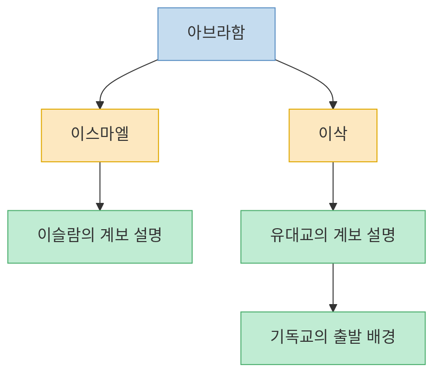
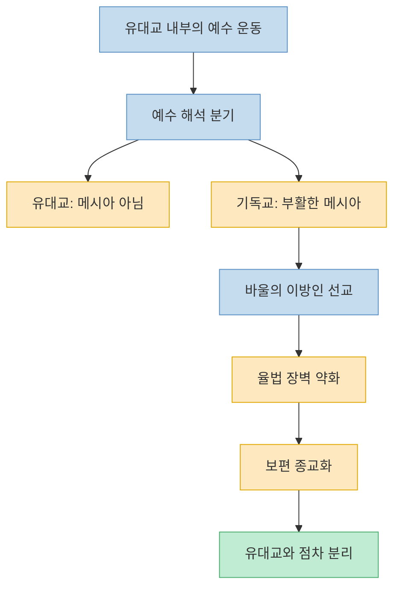
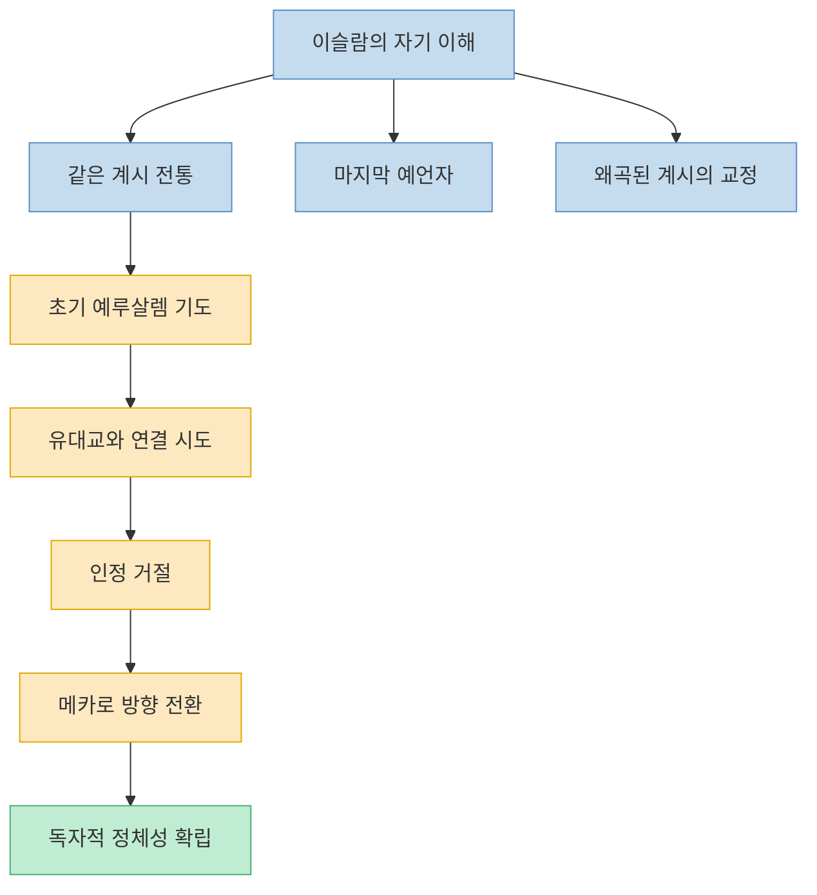
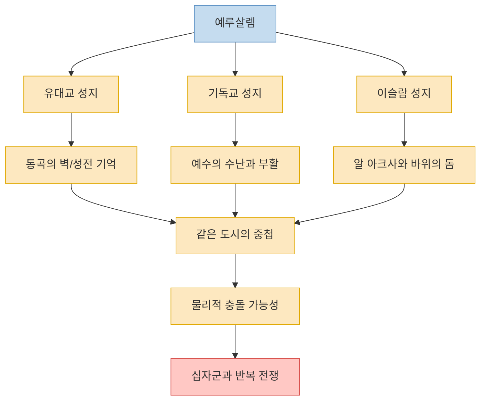

이 영상의 가장 중요한 메시지는 단순하다. 유대교, 기독교, 이슬람교는 완전히 남남인 종교가 아니라 **아브라함이라는 공통 뿌리를 가진 형제 종교** 라는 것이다. 그런데 바로 그 공통 뿌리가 오히려 갈등을 더 날카롭게 만들었다는 해석이 이어진다. 같은 신, 같은 예언자들, 같은 성지를 공유하지만 `누가 진짜 계승자인가`, `누가 신의 뜻을 더 올바르게 이해했는가`를 두고 각자 다른 답을 내렸기 때문이다. 이 글은 영상이 제시한 큰 흐름을 따라, 세 종교가 어디서 갈라졌고 왜 예루살렘이 반복해서 충돌의 중심이 되었는지 구조적으로 정리한다. 다만 방대한 종교사 전체를 짧은 영상으로 압축한 내용이라 일부 맥락은 단순화되어 있다는 점은 함께 염두에 두는 편이 좋다. [(0:00)](https://youtu.be/od4iO2H6rhw?t=0), [(0:30)](https://youtu.be/od4iO2H6rhw?t=30), [(20:31)](https://youtu.be/od4iO2H6rhw?t=1231)

<!--more-->

## Sources

- [유대교 기독교 이슬람교 차이점 | 종교 갈등의 모든 것 | 십자군 전쟁](https://www.youtube.com/watch?v=od4iO2H6rhw) — 세계사쇼

---

## 같은 아버지에서 시작된 갈라짐: 아브라함, 이스마엘, 이삭

영상은 세 종교의 출발점을 아브라함에게 둔다. 아브라함은 여러 신을 섬기던 시대에 오직 하나의 신만을 믿겠다고 선언한 인물로 묘사되며, 세 종교 모두 그와 신의 계약을 자기 신앙의 출발점으로 본다고 설명된다. 여기서 갈라짐의 핵심은 아브라함의 두 아들, 이스마엘과 이삭이다. 영상은 이를 한 아버지의 두 아들이 갈라진 사건으로 설명하면서, 이후의 종교사 전체를 사실상 이 분기에서 시작된 긴 후계 다툼처럼 제시한다. [(1:02)](https://youtu.be/od4iO2H6rhw?t=62), [(1:21)](https://youtu.be/od4iO2H6rhw?t=81), [(1:39)](https://youtu.be/od4iO2H6rhw?t=99), [(2:01)](https://youtu.be/od4iO2H6rhw?t=121)

영상의 정리는 이렇다. 유대교와 기독교는 이삭의 계보를, 이슬람은 이스마엘의 계보를 따른다고 본다. 여기에 더해 아브라함이 아들을 제물로 바치려 했던 이야기조차 세 종교 안에서 다르게 읽히며, 이 차이가 단순한 가계도 차이를 넘어 `누가 진짜 후계자였는가`라는 상징 전쟁으로 이어진다고 설명한다. 즉 세 종교는 시작부터 완전히 따로 떨어져 있던 것이 아니라, **같은 이야기의 다른 판본들** 로 등장한다. [(2:05)](https://youtu.be/od4iO2H6rhw?t=125), [(2:17)](https://youtu.be/od4iO2H6rhw?t=137), [(2:28)](https://youtu.be/od4iO2H6rhw?t=148), [(2:39)](https://youtu.be/od4iO2H6rhw?t=159)

---

## 유대교 안에서 갈라져 나온 기독교: 예수 해석과 바울의 확장

영상은 기독교가 처음부터 독립 종교로 태어난 것이 아니라 유대교 안의 작은 분파였다고 설명한다. 예수도 유대인이었고, 그의 제자들도 모두 유대인이었으며, 초기 기독교인 역시 전부 유대인이었다는 것이다. 즉 출발점만 보면 기독교는 유대교 바깥이 아니라 내부에서 태어난 운동에 가까웠다. [(3:03)](https://youtu.be/od4iO2H6rhw?t=183), [(3:24)](https://youtu.be/od4iO2H6rhw?t=204), [(3:31)](https://youtu.be/od4iO2H6rhw?t=211), [(3:40)](https://youtu.be/od4iO2H6rhw?t=220)

그런데 예수를 어떻게 볼 것인가에서 길이 갈린다. 영상에 따르면 유대교 주류는 예수를 메시아로 인정하지 않았고, 예수의 제자들은 오히려 그의 부활을 메시아의 증거로 해석했다. 같은 사건을 두고 한쪽은 실패한 인간, 다른 한쪽은 신의 아들이라고 보게 되면서 해석의 균열이 커졌다는 것이다. 이때까지만 해도 둘은 아직 완전히 분리되지 않았지만, 이미 핵심 분기점은 생긴 셈이다. [(4:00)](https://youtu.be/od4iO2H6rhw?t=240), [(4:18)](https://youtu.be/od4iO2H6rhw?t=258), [(4:24)](https://youtu.be/od4iO2H6rhw?t=264), [(4:35)](https://youtu.be/od4iO2H6rhw?t=275)

영상은 이후 바울을 결정적 인물로 둔다. 바울은 비유대인에게도 기독교의 문을 열고, 유대교의 할례와 음식 규정 같은 장벽을 사실상 낮췄다. 이 과정에서 기독교는 더 이상 유대 민족 내부의 운동이 아니라, 누구나 믿음으로 들어올 수 있는 보편 종교로 바뀌었다고 설명된다. 동시에 영상은 여기서 `대체 신학`의 씨앗이 싹텄다고 말한다. 유대인과 맺은 옛 계약이 끝나고 새 계약이 이를 대신한다는 생각이 훗날 반유대주의의 신학적 근거가 되었다는 것이다. [(5:02)](https://youtu.be/od4iO2H6rhw?t=302), [(5:13)](https://youtu.be/od4iO2H6rhw?t=313), [(5:30)](https://youtu.be/od4iO2H6rhw?t=330), [(6:00)](https://youtu.be/od4iO2H6rhw?t=360)

---

## 막내로 등장한 이슬람: 계승이 아니라 `교정`을 주장하다

영상은 이슬람을 유대교와 기독교를 완전히 부정하는 종교가 아니라, 오히려 같은 계시 전통을 `바로잡는 최종 단계`라고 스스로 이해한 종교로 소개한다. 쿠란에는 아브라함, 모세, 예수가 모두 등장하고, 무함마드는 자신을 그 예언자 계보의 마지막 예언자로 위치시킨다는 것이다. 즉 이슬람은 `새로운 신`을 가져온 것이 아니라, 원래 하나였던 계시가 중간에 왜곡되었고 자신이 그 흐름을 회복하러 왔다고 주장하는 구조로 설명된다. [(9:00)](https://youtu.be/od4iO2H6rhw?t=540), [(9:24)](https://youtu.be/od4iO2H6rhw?t=564), [(9:30)](https://youtu.be/od4iO2H6rhw?t=570), [(9:44)](https://youtu.be/od4iO2H6rhw?t=584)

초기에는 유대교와의 연결을 행동으로 보여 주는 장면도 나온다. 영상에 따르면 초기 무슬림은 예루살렘을 향해 기도했고, 메디나 헌장에서는 유대인 공동체가 하나의 정치 공동체 안에 함께 자리 잡았다. 하지만 메디나의 유대인 부족들이 무함마드의 예언자 지위를 인정하지 않으면서 관계가 틀어졌고, 결국 기도 방향이 예루살렘에서 메카로 바뀌며 이슬람의 독자적 정체성이 선명해졌다는 설명이 이어진다. [(10:00)](https://youtu.be/od4iO2H6rhw?t=600), [(10:15)](https://youtu.be/od4iO2H6rhw?t=615), [(11:16)](https://youtu.be/od4iO2H6rhw?t=676), [(11:40)](https://youtu.be/od4iO2H6rhw?t=700)

이후 영상은 이슬람 제국 안에서 유대인과 기독교인에게 부여된 법적 지위를 `딤미` 제도로 설명한다. 생명과 신앙의 자유를 어느 정도 보장받았지만, 무슬림과 완전히 동등하지는 않았다는 점을 함께 짚는다. 즉 형제 종교로 인정하되, 자신이 최종 진실을 가진 위치라고 여기는 구조가 형성되었다는 해석이다. [(11:55)](https://youtu.be/od4iO2H6rhw?t=715), [(12:08)](https://youtu.be/od4iO2H6rhw?t=728), [(12:20)](https://youtu.be/od4iO2H6rhw?t=740), [(12:34)](https://youtu.be/od4iO2H6rhw?t=754)

---

## 예루살렘, 십자군, 그리고 왜 성지가 전쟁터가 되었는가

영상에서 갈등이 본격적으로 폭발하는 지점은 예루살렘이다. 유대인에게는 성전의 자리이자 통곡의 벽이 있는 곳이고, 기독교인에게는 예수의 십자가형과 부활이 연결된 도시이며, 이슬람에게는 알 아크사와 바위의 돔이 있는 공간이다. 문제는 이 신성한 장소들이 추상적으로 겹치는 게 아니라, 아주 좁은 물리적 공간 안에 밀집해 있다는 점이다. 그래서 종교적 갈등은 철학 논쟁에 머물지 않고 곧바로 땅과 건물과 통치권을 둘러싼 싸움으로 번지기 쉬웠다고 영상은 설명한다. [(13:08)](https://youtu.be/od4iO2H6rhw?t=788), [(13:24)](https://youtu.be/od4iO2H6rhw?t=804), [(13:41)](https://youtu.be/od4iO2H6rhw?t=821), [(14:02)](https://youtu.be/od4iO2H6rhw?t=842)

여기에 1095년의 십자군 전쟁이 등장한다. 교황 우르바누스 2세의 호소로 유럽의 기독교 세력이 예루살렘을 향해 출발했고, 그 길에서 유대인 공동체를 학살했으며, 1099년 예루살렘 함락 뒤에는 무슬림과 유대인을 가리지 않고 대규모 학살을 벌였다고 영상은 서술한다. 이후 1187년 살라딘의 예루살렘 탈환은 이와 극적으로 대비되는 장면으로 제시된다. 복수의 기회가 있었지만, 기독교인에게 몸값을 내고 안전하게 떠날 길을 열어 준 선택을 강조한다. [(14:25)](https://youtu.be/od4iO2H6rhw?t=865), [(15:06)](https://youtu.be/od4iO2H6rhw?t=906), [(15:25)](https://youtu.be/od4iO2H6rhw?t=925), [(16:23)](https://youtu.be/od4iO2H6rhw?t=983), [(16:36)](https://youtu.be/od4iO2H6rhw?t=996)

영상의 해석은 분명하다. 세 종교가 모두 예루살렘을 양보할 수 없는 성지로 여기는 한, 갈등에는 늘 구체적인 목표물이 존재했다는 것이다. 같은 신을 믿는 형제 종교라는 공통점이 오히려 `누가 진짜 상속자인가`를 놓고 더 잔혹한 경쟁을 만들었다는 문장이 이 대목에서 가장 강하게 작동한다. [(20:44)](https://youtu.be/od4iO2H6rhw?t=1244), [(20:52)](https://youtu.be/od4iO2H6rhw?t=1252), [(21:02)](https://youtu.be/od4iO2H6rhw?t=1262), [(21:30)](https://youtu.be/od4iO2H6rhw?t=1290)

---

## 중세의 상처가 현대 중동 갈등까지 이어지는 방식

영상 후반은 십자군 이후의 기억이 끝나지 않았다고 말한다. 기독교 유럽 내부에서는 반유대주의가 제도화되고, 유대인 추방과 차별이 이어졌으며, 훗날 홀로코스트의 배경에도 이런 긴 역사적 토양이 놓여 있었다는 것이다. 이후 유럽에서 안전한 땅을 잃었다고 느낀 유대인들 사이에서 시오니즘이 성장하고, 팔레스타인 땅에 유대 국가를 세우려는 흐름이 본격화된다. [(17:00)](https://youtu.be/od4iO2H6rhw?t=1020), [(17:24)](https://youtu.be/od4iO2H6rhw?t=1044), [(18:08)](https://youtu.be/od4iO2H6rhw?t=1088), [(18:30)](https://youtu.be/od4iO2H6rhw?t=1110)

문제는 그 땅에 이미 아랍인들이 살고 있었다는 점이다. 영상은 1947년 유엔 분할안, 1948년 이스라엘 독립, 그리고 그 직후 이어진 전쟁과 팔레스타인 난민 문제를 한 흐름으로 묶는다. 그렇게 아브라함의 후손들 사이의 오래된 정통성 다툼이 현대 민족국가와 영토 문제 위로 옮겨졌고, 종교 갈등은 더 이상 종교 내부 논쟁이 아니라 국제정치와 군사 충돌의 문제로 이어졌다는 것이다. [(19:20)](https://youtu.be/od4iO2H6rhw?t=1160), [(19:29)](https://youtu.be/od4iO2H6rhw?t=1169), [(19:37)](https://youtu.be/od4iO2H6rhw?t=1177), [(20:04)](https://youtu.be/od4iO2H6rhw?t=1204)

영상의 마지막 정리는 명료하다. 세 종교는 같은 신을 믿고 같은 아버지 아브라함을 출발점으로 삼지만, 바로 그 공통점 때문에 `나야말로 진짜 계승자`라는 경쟁이 더 잔인해졌다는 것이다. 물론 현대에는 화해 시도도 있었지만, 예루살렘이라는 상징적 공간과 배타적 정통성 주장이 사라지지 않는 한 갈등은 쉽게 끝나기 어렵다고 영상은 본다. [(20:31)](https://youtu.be/od4iO2H6rhw?t=1231), [(21:02)](https://youtu.be/od4iO2H6rhw?t=1262), [(21:32)](https://youtu.be/od4iO2H6rhw?t=1292), [(21:43)](https://youtu.be/od4iO2H6rhw?t=1303)

---

## 핵심 요약

- 영상은 유대교, 기독교, 이슬람교를 서로 완전히 다른 종교가 아니라 아브라함이라는 공통 조상 아래 놓인 형제 종교로 설명한다. [(0:30)](https://youtu.be/od4iO2H6rhw?t=30), [(1:21)](https://youtu.be/od4iO2H6rhw?t=81)
- 세 종교의 첫 갈라짐은 이스마엘과 이삭의 계보 분기, 그리고 `누가 진짜 후계자인가`라는 해석 차이에서 시작된다고 본다. [(2:05)](https://youtu.be/od4iO2H6rhw?t=125), [(2:39)](https://youtu.be/od4iO2H6rhw?t=159)
- 기독교는 유대교 내부 운동에서 출발했지만, 예수 해석과 바울의 이방인 선교를 거치며 보편 종교로 확장되고 유대교와 멀어졌다. [(3:24)](https://youtu.be/od4iO2H6rhw?t=204), [(5:13)](https://youtu.be/od4iO2H6rhw?t=313), [(6:00)](https://youtu.be/od4iO2H6rhw?t=360)
- 이슬람은 자신을 완전히 새로운 종교라기보다, 같은 계시 전통의 최종 교정자로 위치시키며 유대교·기독교와 연결되면서도 독자 정체성을 세운다. [(9:24)](https://youtu.be/od4iO2H6rhw?t=564), [(11:16)](https://youtu.be/od4iO2H6rhw?t=676)
- 예루살렘은 세 종교의 성지가 좁은 공간 안에 겹쳐 있어, 종교 갈등이 물리적·정치적 충돌로 이어지기 쉬운 상징적 중심이 되었다. [(13:24)](https://youtu.be/od4iO2H6rhw?t=804), [(14:02)](https://youtu.be/od4iO2H6rhw?t=842)
- 영상은 이 긴 역사적 갈등이 십자군, 반유대주의, 시오니즘, 현대 이스라엘-팔레스타인 문제까지 이어진다고 정리한다. [(17:00)](https://youtu.be/od4iO2H6rhw?t=1020), [(19:29)](https://youtu.be/od4iO2H6rhw?t=1169), [(20:31)](https://youtu.be/od4iO2H6rhw?t=1231)

---

## 결론

이 영상이 던지는 가장 강한 통찰은 갈등의 원인이 `완전한 낯섦`이 아니라 오히려 `과도한 닮음`에 있을 수 있다는 점이다. 유대교, 기독교, 이슬람교는 같은 조상과 예언자, 성지를 공유하기 때문에 남보다 형제에 가까운 종교들이다. 그러나 바로 그 공통 기반 때문에 정통성 경쟁은 더 치열해졌고, 예루살렘은 그 상징이자 전쟁터가 되었다. [(20:44)](https://youtu.be/od4iO2H6rhw?t=1244), [(21:07)](https://youtu.be/od4iO2H6rhw?t=1267)

그래서 이 영상을 보고 나면 세 종교의 차이를 외우는 것보다, 왜 같은 뿌리가 더 깊은 갈등을 낳을 수 있는지 이해하는 것이 먼저라는 생각이 든다. 같은 신을 믿는다는 공통점이 자동으로 평화를 보장하지는 않는다. 오히려 `누가 진짜 상속자인가`라는 물음이 남아 있는 한, 형제의 싸움은 더 오래 가고 더 아플 수 있다는 것이 이 영상의 결론에 가깝다. [(20:52)](https://youtu.be/od4iO2H6rhw?t=1252), [(21:43)](https://youtu.be/od4iO2H6rhw?t=1303)
