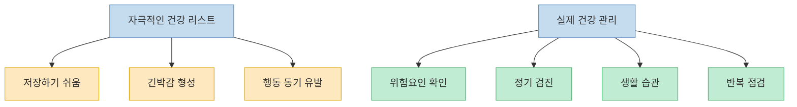
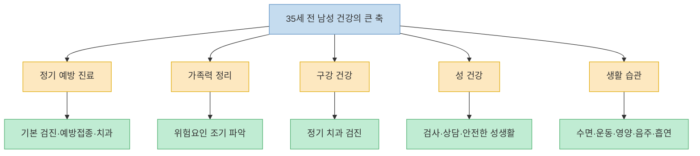
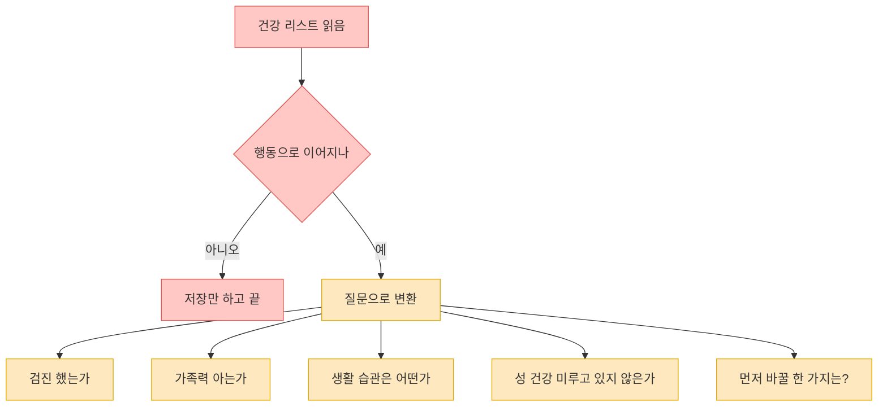

X에서 자주 보이는 건강 포스트 중 하나는 `모든 남성이 35세 전에 알아야 할 40가지` 같은 형식이다. 이런 글은 압축적이고 강해서 저장하기 좋지만, 실제 건강 관리는 항목 수가 많다고 좋아지는 것이 아니라 **우선순위가 선명해야** 도움이 된다. 이번에 확인 가능한 원문 본문은 `남성 건강의 완전한 바이블`, `35세 전 알아야 할 40가지`라는 첫 문장까지였고, 카드형 이미지 속 세부 40항목은 X의 로그인·미디어 제한 때문에 전부 복원되지는 않았다. 그래서 이 글에서는 보이지 않는 40개를 억지로 추정하지 않고, 그 제목이 던지는 문제의식을 실제 예방 건강 관리의 큰 축으로 다시 정리한다.

<!--more-->

## Sources

- [Biblia Completa de la Salud Masculina: 40 cosas que todo hombre debería saber sobre su salud antes de los 35.](https://x.com/i/status/2045865361296220280) — X 원문, 부분 확인
- [Are You Up to Date on Your Preventive Care?](https://www.cdc.gov/chronic-disease/prevention/preventive-care.html) — CDC
- [Men](https://medlineplus.gov/men.html) — MedlinePlus
- [TAKE CHARGE OF YOUR SEXUAL HEALTH: What you need to know about preventive services](https://stacks.cdc.gov/view/cdc/22461/cdc_22461_DS1.pdf) — CDC 자료집
- [Screening Tests for Men Quiz](https://medlineplus.gov/ency/quiz/007465_19.htm) — MedlinePlus Medical Encyclopedia

---

## 왜 이런 리스트가 강하게 먹히는가: 복잡한 건강 문제를 짧은 체크리스트로 바꾸기 때문

`35세 전 남성 건강 40가지` 같은 제목은 강력하다. 건강 문제를 어렵고 긴 여정이 아니라, 지금 당장 저장해 둘 수 있는 체크리스트로 바꿔 주기 때문이다. 게다가 `너무 늦기 전에`, `대부분은 너무 늦게 배운다` 같은 문장은 긴박감까지 만든다. 이런 형식은 행동을 촉발하는 데는 유리하지만, 동시에 중요한 차이를 지워 버리기도 쉽다. 가족력, 생활 습관, 직업, 수면, 정신 건강, 치아 관리, 성 건강처럼 서로 성격이 다른 문제들이 모두 한 줄 팁으로 평평해지기 때문이다. [X 원문](https://x.com/i/status/2045865361296220280)

실제 예방 건강 관리에서는 `모든 사람에게 똑같이 중요한 40가지`보다, 내 나이와 위험요인에 맞는 몇 가지 큰 축을 꾸준히 챙기는 편이 훨씬 실용적이다. CDC는 정기 검진, 예방 서비스, 백신, 치과 검진, 가족력 확인을 예방 관리의 기본으로 묶는다. 즉 건강은 단발성 꿀팁 수집보다 **반복해서 점검할 구조를 갖추는 것** 에 더 가깝다. [CDC Preventive Care](https://www.cdc.gov/chronic-disease/prevention/preventive-care.html)

---

## 35세 전이라면 우선 네 가지보다 다섯 가지 큰 축을 잡는 편이 낫다

첫 번째 축은 `정기 예방 진료`다. 특별히 아픈 곳이 없어도 기본 검진, 혈압 확인, 필요한 선별검사, 예방접종, 치과 검진 같은 루틴을 갖추는 것이 중요하다. CDC는 예방 진료가 증상이 생기기 전 문제를 일찍 발견하고, 생활습관 상담이나 예방 서비스를 받을 기회를 준다고 설명한다. 건강을 챙긴다는 것은 이상이 생겼을 때만 병원에 가는 것이 아니라, **아무 일 없을 때 구조적으로 확인하는 습관** 을 갖는 것이다. [CDC Preventive Care](https://www.cdc.gov/chronic-disease/prevention/preventive-care.html)

두 번째 축은 `가족력`이다. 많은 사람이 가족력을 막연한 정보로만 여기지만, 어떤 질환을 더 일찍 주의해야 하는지 결정하는 출발점이 되기도 한다. CDC는 주요 질환, 진단 시기, 사망 원인 같은 가족력 정보를 모아 두고 의사와 공유하라고 권한다. 이는 같은 30대 남성이라도 누구는 일찍 혈압과 대사질환을 더 주의해서 보고, 누구는 특정 암이나 심혈관 위험을 먼저 살펴야 할 수 있다는 뜻이기도 하다. [CDC Preventive Care](https://www.cdc.gov/chronic-disease/prevention/preventive-care.html)

세 번째 축은 `구강 건강`이다. 치아 관리는 종종 전체 건강 체크리스트에서 뒤로 밀리지만, CDC는 예방 진료의 예시 안에 치과 클리닝을 명시한다. 실제로 많은 남성이 전신 건강검진은 생각하면서도 정기 치과 검진은 미루곤 한다. 하지만 이 시기에는 통증이 없더라도 구강 관리 습관과 정기 검진을 놓치지 않는 편이 장기적으로 비용과 스트레스를 줄인다. [CDC Preventive Care](https://www.cdc.gov/chronic-disease/prevention/preventive-care.html)

네 번째 축은 `성 건강`이다. CDC 자료집은 남성에게도 성 건강 관련 예방 서비스와 상담이 필요하다고 설명한다. 이는 성병 검사 여부만이 아니라, 파트너와의 대화, 안전한 성생활, 필요한 검진, 증상이 있을 때 미루지 않고 확인하는 태도까지 포함한다. 특히 젊은 남성일수록 큰 병이 아니라고 넘기기 쉬운 영역이기 때문에, 오히려 체크리스트 안에 명시적으로 넣어 두는 것이 좋다. [CDC Sexual Health PDF](https://stacks.cdc.gov/view/cdc/22461/cdc_22461_DS1.pdf)

다섯 번째 축은 `생활 습관`이다. MedlinePlus의 남성 건강 안내 역시 운동, 영양, 정신 건강, 수면, 성 건강, 검진 같은 요소를 넓게 묶는다. 결국 35세 이전의 건강 관리는 한두 가지 영양제나 극적인 검사보다, 잠·운동·체중·스트레스·음주·흡연 같은 반복 습관이 훨씬 큰 비중을 차지한다. 즉 리스트를 읽고 끝낼 것이 아니라, **매주 반복되는 생활 구조를 바꾸는 쪽** 이 실제 건강 관리에 가깝다. [MedlinePlus Men](https://medlineplus.gov/men.html)

---

## 항목 수보다 중요한 것은 `언제`, `왜`, `어떻게` 챙길지다

건강 리스트가 자주 놓치는 부분은 `행동의 문맥`이다. 예를 들어 어떤 검사가 중요하다는 말만으로는 충분하지 않다. 언제 시작해야 하는지, 증상이 없을 때도 필요한지, 가족력에 따라 달라지는지, 정기적으로 반복해야 하는지까지 알아야 실제 관리가 된다. MedlinePlus의 남성 선별검사 안내는 바로 이런 점을 강조한다. 단순히 검사가 많을수록 좋은 것이 아니라, 연령과 위험요인에 따라 필요한 검사와 점검의 타이밍이 다르다는 것이다. [MedlinePlus Screening Quiz](https://medlineplus.gov/ency/quiz/007465_19.htm)

그래서 40가지 리스트를 붙잡고 불안해하기보다, 오히려 5가지 질문만 반복하는 편이 낫다. `나는 올해 기본 검진과 치과 검진을 했는가?`, `가족력 정보를 알고 있는가?`, `수면과 운동은 안정적인가?`, `성 건강 관련 증상이나 검진을 미루고 있지 않은가?`, `흡연·음주·체중·스트레스 중 지금 가장 먼저 손봐야 할 것은 무엇인가?` 이런 질문은 항목 수는 적지만 실제 행동으로 이어질 가능성이 높다. [CDC Preventive Care](https://www.cdc.gov/chronic-disease/prevention/preventive-care.html), [MedlinePlus Men](https://medlineplus.gov/men.html)

---

## 실전적으로는 `한 번에 40개`보다 `월간 점검표`가 훨씬 강하다

건강 관리는 몰아서 한 번에 끝내는 프로젝트가 아니라, 반복 구조를 갖는 운영에 더 가깝다. 그래서 X 포스트처럼 40가지 항목을 한 번에 외우는 것보다, 월 단위나 분기 단위 점검표를 만드는 편이 실제로 더 오래 간다. 예를 들면 `이번 달 운동 횟수`, `평균 수면 시간`, `음주 빈도`, `치과 예약 여부`, `증상 방치 여부`, `가족력 업데이트` 같은 항목만으로도 충분히 강한 관리 루틴이 된다. [CDC Preventive Care](https://www.cdc.gov/chronic-disease/prevention/preventive-care.html)

특히 35세 이전에는 `아직 젊으니까 괜찮다`와 `지금부터 완벽하게 관리해야 한다` 사이를 오가기 쉽다. 하지만 현실적인 답은 그 중간쯤에 있다. 완벽한 건강 루틴보다, 놓치지 말아야 할 기본 축을 정하고 계속 확인하는 방식이 더 지속 가능하다. 자극적인 건강 콘텐츠는 경각심을 주는 데는 좋지만, 실제 삶을 바꾸는 것은 결국 작고 반복 가능한 시스템이다. [MedlinePlus Men](https://medlineplus.gov/men.html)

---

## 핵심 요약

- `35세 전 남성 건강 40가지` 같은 리스트는 강렬하지만, 실제 건강 관리는 항목 수보다 우선순위와 반복 구조가 더 중요하다. [X 원문](https://x.com/i/status/2045865361296220280)
- 기본 축은 정기 예방 진료, 가족력, 구강 건강, 성 건강, 생활 습관의 다섯 가지로 재정리하는 편이 실용적이다. [CDC Preventive Care](https://www.cdc.gov/chronic-disease/prevention/preventive-care.html), [MedlinePlus Men](https://medlineplus.gov/men.html)
- CDC는 정기 검진, 예방 서비스, 치과 검진, 가족력 확인을 예방 관리의 핵심 요소로 본다. [CDC Preventive Care](https://www.cdc.gov/chronic-disease/prevention/preventive-care.html)
- 성 건강도 젊은 남성에게 별도 영역이 아니라 예방 서비스와 상담이 필요한 정식 건강 관리 축이다. [CDC Sexual Health PDF](https://stacks.cdc.gov/view/cdc/22461/cdc_22461_DS1.pdf)
- 저장하기 좋은 리스트보다, 매달 반복해서 확인할 질문 다섯 개를 갖는 편이 실제 행동 변화로 이어지기 쉽다.

---

## 결론

남성 건강을 40가지 항목으로 정리하는 콘텐츠는 재미있고 저장하기 좋다. 하지만 실제로 몸을 지키는 것은 더 많은 항목을 모으는 일이 아니라, 내 몸을 어떤 틀로 반복 점검할지 결정하는 일에 가깝다. [X 원문](https://x.com/i/status/2045865361296220280), [CDC Preventive Care](https://www.cdc.gov/chronic-disease/prevention/preventive-care.html)

그래서 35세 이전에 정말 필요한 것은 압도적인 건강 정보가 아니라, 정기 검진과 치과 관리, 가족력 파악, 성 건강 점검, 생활 습관 관리라는 기본 축을 놓치지 않는 것이다. 한 번에 40가지를 외우는 것보다, 이 다섯 축을 계속 돌아보는 습관이 훨씬 오래 간다. [MedlinePlus Men](https://medlineplus.gov/men.html)
