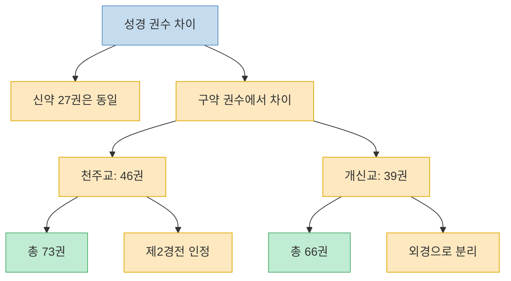
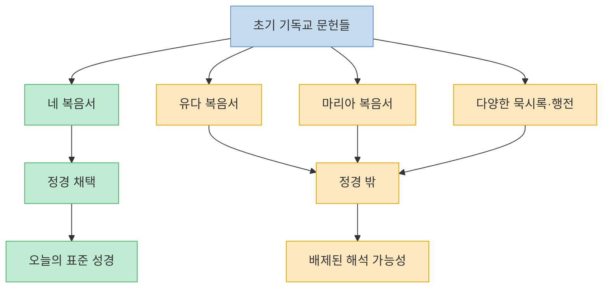
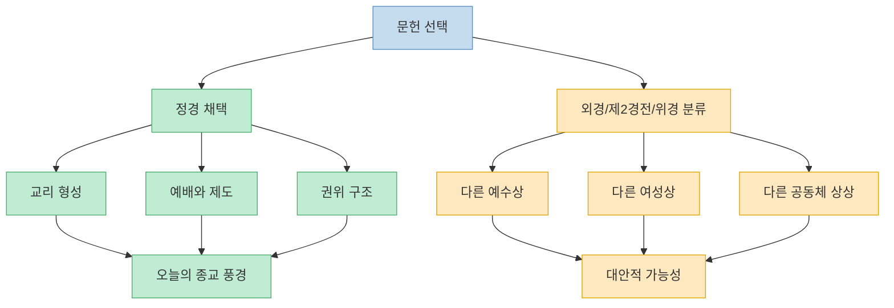

이 영상은 성경을 `완성된 한 권의 책`으로 보기보다, 오랜 시간에 걸쳐 선별되고 해석된 문헌 집합으로 바라보게 만든다. 핵심 질문은 두 가지다. 첫째, 왜 천주교와 개신교는 구약 권수가 다른가. 둘째, 정경에 들어가지 않은 복음서와 문헌들은 왜 배제되었고, 만약 포함됐다면 오늘의 교리와 신앙 풍경은 얼마나 달라졌을까. 영상은 이 질문을 통해 종교를 믿음의 문제로만이 아니라 **역사와 문헌 선별의 과정** 으로도 보자고 제안한다. 다만 이 글은 신앙적 판단이 아니라 영상이 제시한 역사적·문헌학적 관점을 정리한 글이라는 점을 먼저 밝혀 둔다. [(0:00)](https://youtu.be/F_OhLTBD0zM?t=0), [(0:14)](https://youtu.be/F_OhLTBD0zM?t=14), [(2:00)](https://youtu.be/F_OhLTBD0zM?t=120), [(7:40)](https://youtu.be/F_OhLTBD0zM?t=460)

<!--more-->

## Sources

- [가톨릭으로부터 벼려진 성경의 내용은....?](https://www.youtube.com/watch?v=F_OhLTBD0zM) — 역사를 보다

---

## 왜 천주교는 73권이고 개신교는 66권일까

영상은 성경 권수 차이가 신약이 아니라 구약에서 생긴다고 설명한다. 신약은 전 세계 교회가 27권으로 인정하지만, 구약은 천주교가 46권, 개신교가 39권으로 세기 때문에 총권수가 달라진다는 것이다. 그래서 천주교는 73권, 개신교는 66권이 된다. 여기서 핵심은 `누가 성경을 더 많이 넣었는가`보다, **어떤 문헌 전통을 어디까지 인정할 것인가** 의 차이라고 영상은 말한다. [(0:14)](https://youtu.be/F_OhLTBD0zM?t=14), [(0:27)](https://youtu.be/F_OhLTBD0zM?t=27), [(0:35)](https://youtu.be/F_OhLTBD0zM?t=35), [(1:03)](https://youtu.be/F_OhLTBD0zM?t=63)

영상에 따르면 개신교는 히브리어 원본이 남아 있는 문헌을 중심으로 구약 39권을 채택했고, 천주교는 오랫동안 사용해 온 그리스어 번역 전통 안의 문헌들까지 함께 인정했다. 이후 종교개혁 시기 마르틴 루터가 천주교를 비판하면서 권수 문제가 선명해졌고, 트리엔트 공회를 거치며 천주교는 자신들이 인정하는 범위를 더 분명히 했다는 설명이 나온다. 즉 이 차이는 단순한 누락이나 추가라기보다, **원본 중심주의와 전통적 사용 중심주의가 어디서 갈라졌는가** 를 보여주는 사례처럼 제시된다. [(1:03)](https://youtu.be/F_OhLTBD0zM?t=63), [(1:10)](https://youtu.be/F_OhLTBD0zM?t=70), [(1:20)](https://youtu.be/F_OhLTBD0zM?t=80), [(1:40)](https://youtu.be/F_OhLTBD0zM?t=100)

또 영상은 개신교가 외경이라고 부르는 문헌을 천주교는 `제2경전`이라고 부른다고 설명한다. 같은 문헌을 두고도 이름이 다른 이유는, 그것을 비정통으로 밀어내느냐 아니면 두 번째 범주의 경전으로 포함하느냐의 태도 차이 때문이다. 이 지점에서 영상은 성경 목록 자체가 이미 해석과 선택의 산물이라는 점을 강조한다. [(2:00)](https://youtu.be/F_OhLTBD0zM?t=120), [(2:12)](https://youtu.be/F_OhLTBD0zM?t=132), [(2:17)](https://youtu.be/F_OhLTBD0zM?t=137), [(2:24)](https://youtu.be/F_OhLTBD0zM?t=144)

---

## 신약도 처음부터 27권이었던 것은 아니라는 문제제기

영상은 신약 27권 역시 처음부터 하늘에서 완성본처럼 내려온 것이 아니라, 여러 문헌 가운데 선택된 결과라고 말한다. 복음서만 해도 지금의 네 복음서 외에 베드로 복음서, 마리아 복음서, 유다 복음서 같은 다양한 문헌이 존재했고, 묵시록도 요한 묵시록만 있었던 것이 아니라고 설명한다. 다시 말해 초기 기독교는 오늘 우리가 익숙하게 아는 텍스트만 읽던 공동체가 아니라, **훨씬 더 다양한 기록과 해석이 경쟁하던 공간** 이었다는 것이다. [(2:26)](https://youtu.be/F_OhLTBD0zM?t=146), [(2:42)](https://youtu.be/F_OhLTBD0zM?t=162), [(3:01)](https://youtu.be/F_OhLTBD0zM?t=181), [(3:41)](https://youtu.be/F_OhLTBD0zM?t=221)

영상은 특히 유다 복음서를 예로 들며, 정경 밖 문헌이 전혀 다른 예수-유다 관계를 그린다고 소개한다. 우리가 배신자로 익숙하게 알고 있는 유다가 오히려 예수의 뜻을 수행한 인물처럼 읽히는 서사가 있다는 것이다. 또 마리아 복음서 쪽에서는 마리아 막달레나가 다른 제자들과 전혀 다른 위상을 가진 인물처럼 등장한다고 설명한다. 이 대목의 핵심은 그 문헌들의 주장 자체를 받아들이자는 것이 아니라, **초기 기독교 안에 예수와 제자들을 해석하는 다양한 가능성이 실제로 존재했다** 는 사실을 보자는 데 있다. [(3:11)](https://youtu.be/F_OhLTBD0zM?t=191), [(3:22)](https://youtu.be/F_OhLTBD0zM?t=202), [(4:02)](https://youtu.be/F_OhLTBD0zM?t=242), [(4:28)](https://youtu.be/F_OhLTBD0zM?t=268)

이 시각은 정경을 절대 부정하려는 접근이라기보다, 정경이 형성되는 과정에서 배제된 목소리들을 통해 오히려 정경의 성격을 더 선명하게 보게 만든다. 어떤 문헌이 살아남았는지 못지않게, 어떤 문헌이 밖으로 밀려났는지까지 봐야 오늘의 기독교가 어떤 선택의 결과인지 이해할 수 있다는 것이다. [(6:40)](https://youtu.be/F_OhLTBD0zM?t=400), [(7:00)](https://youtu.be/F_OhLTBD0zM?t=420), [(7:40)](https://youtu.be/F_OhLTBD0zM?t=460)

---

## 외경이 던지는 가장 큰 질문: 교리와 질서는 얼마나 달라질 수 있었나

영상에서 가장 흥미로운 부분은 `만약 정경이 달랐다면 기독교도 달라졌을까`라는 가정이다. 예를 들어 지금의 교리 안에서 여성의 위치를 낮게 두는 데 자주 인용되는 바울 계열 서신의 구절이 있는 반면, 외경으로 분류되는 문헌에는 여성 제자나 여성 성인의 위상이 훨씬 더 강하게 드러난다고 영상은 말한다. 특히 `바울과 테클라 행전`의 예를 들며, 만약 이런 문헌이 정경 안에 포함되어 널리 읽혔다면 기독교 역사 속 여성 지위 논의는 다른 방향으로 전개될 수도 있었을 것이라고 추정한다. [(5:20)](https://youtu.be/F_OhLTBD0zM?t=320), [(6:00)](https://youtu.be/F_OhLTBD0zM?t=360), [(6:20)](https://youtu.be/F_OhLTBD0zM?t=380), [(6:35)](https://youtu.be/F_OhLTBD0zM?t=395)

이 말의 요지는 정경 밖 문헌이 모두 더 옳다는 뜻이 아니다. 오히려 정경이란 `진리 자체`라기보다, 어떤 시대와 공동체가 신앙의 기준으로 삼기로 합의한 문헌 집합이라는 사실을 더 분명하게 만든다는 뜻에 가깝다. 교리, 제도, 권위, 성 역할, 예수 이해 같은 것들이 모두 정경의 선택과 분리될 수 없다는 점을 보여 주기 때문이다. [(7:33)](https://youtu.be/F_OhLTBD0zM?t=453), [(8:05)](https://youtu.be/F_OhLTBD0zM?t=485), [(8:33)](https://youtu.be/F_OhLTBD0zM?t=513)

영상은 이 논의를 기독교 안에만 가두지 않는다. 유대교의 랍비 전통, 불교 경전의 번역과 재해석 사례까지 언급하면서, 경전이라는 것은 종교 안에서 언제나 해석 공동체와 함께 움직여 왔다고 설명한다. 즉 어느 종교든 텍스트만 있는 것이 아니라, **텍스트를 고르고 읽고 해석하는 기관과 전통** 이 함께 존재한다는 점을 생각해 보자는 것이다. [(9:02)](https://youtu.be/F_OhLTBD0zM?t=542), [(9:20)](https://youtu.be/F_OhLTBD0zM?t=560), [(10:00)](https://youtu.be/F_OhLTBD0zM?t=600), [(11:01)](https://youtu.be/F_OhLTBD0zM?t=661)

---

## 영상이 남기는 결론: 종교도 역사 속에서 읽을 수 있다

후반부에서 영상은 종교를 믿음의 문제로만 다루지 말고 역사 속의 문헌과 해석 공동체로도 보자고 제안한다. 마가복음의 성립 연대, 사해 문서나 나그함마디 문서의 발굴, 다른 종교의 경전 전승 방식까지 언급하면서, 어떤 경전도 완전히 정지된 상태로 존재하지 않는다는 것이다. 필사, 번역, 선별, 공의회, 공동체의 해석이 모두 결합되어 지금의 성경이 되었다는 관점이다. [(10:00)](https://youtu.be/F_OhLTBD0zM?t=600), [(10:40)](https://youtu.be/F_OhLTBD0zM?t=640), [(12:00)](https://youtu.be/F_OhLTBD0zM?t=720), [(13:20)](https://youtu.be/F_OhLTBD0zM?t=800)

영상이 보기에 중요한 것은 정경을 무너뜨리자는 것이 아니라, 정경이 만들어지는 역사적 과정을 인정하는 태도다. 그 과정을 무시한 채 모든 텍스트가 곧바로 하늘에서 완성되어 내려왔다고만 보면, 문헌 사이의 차이와 해석의 층위를 보지 못하게 된다. 반대로 역사성을 인정하면, 종교적 믿음과 별개로 텍스트의 형성과 선택 과정을 더 풍부하게 이해할 수 있다. [(13:17)](https://youtu.be/F_OhLTBD0zM?t=797), [(14:17)](https://youtu.be/F_OhLTBD0zM?t=857), [(15:00)](https://youtu.be/F_OhLTBD0zM?t=900)

---

## 핵심 요약

- 천주교와 개신교의 성경 권수 차이는 신약이 아니라 구약에서 생기며, 천주교는 73권, 개신교는 66권으로 센다. [(0:14)](https://youtu.be/F_OhLTBD0zM?t=14), [(0:35)](https://youtu.be/F_OhLTBD0zM?t=35)
- 개신교가 외경이라고 부르는 문헌을 천주교는 제2경전으로 부르며, 같은 문헌을 바라보는 태도 자체가 다르다. [(2:00)](https://youtu.be/F_OhLTBD0zM?t=120), [(2:12)](https://youtu.be/F_OhLTBD0zM?t=132)
- 신약 27권도 처음부터 자동으로 주어진 것이 아니라, 다양한 초기 기독교 문헌 가운데 선택된 결과라는 문제제기가 영상의 핵심이다. [(2:42)](https://youtu.be/F_OhLTBD0zM?t=162), [(3:41)](https://youtu.be/F_OhLTBD0zM?t=221)
- 유다 복음서, 마리아 복음서, 바울과 테클라 행전 같은 외경은 초기 기독교 안에 다른 예수상과 다른 공동체 상상이 있었음을 보여 주는 사례로 제시된다. [(3:11)](https://youtu.be/F_OhLTBD0zM?t=191), [(6:00)](https://youtu.be/F_OhLTBD0zM?t=360)
- 영상은 종교를 신앙의 문제로만이 아니라, 문헌 선별과 해석 전통이 함께 작동하는 역사적 과정으로 읽자고 제안한다. [(9:02)](https://youtu.be/F_OhLTBD0zM?t=542), [(10:00)](https://youtu.be/F_OhLTBD0zM?t=600)

---

## 결론

이 영상이 던지는 질문은 성경이 진짜냐 가짜냐가 아니라, **지금 우리가 읽는 성경의 형태가 어떻게 굳어졌는가** 에 더 가깝다. 정경과 외경의 구분, 구약 권수의 차이, 공의회와 선별, 배제된 문헌의 존재를 함께 보면 성경은 하나의 책이면서 동시에 긴 역사 속에서 정리된 도서관처럼 보이기 시작한다. [(0:00)](https://youtu.be/F_OhLTBD0zM?t=0), [(7:40)](https://youtu.be/F_OhLTBD0zM?t=460)

그래서 이 영상을 보고 나면 정경을 둘러싼 논쟁은 단순한 호기심거리가 아니라, 종교가 어떻게 텍스트를 만들고 권위를 세우며 자신을 유지해 왔는지 보여 주는 창이 된다. 믿음의 유무와 별개로, 종교를 역사 속에서 읽는 훈련이 왜 필요한지 생각하게 만드는 지점이 바로 여기에 있다. [(8:33)](https://youtu.be/F_OhLTBD0zM?t=513), [(13:20)](https://youtu.be/F_OhLTBD0zM?t=800)
