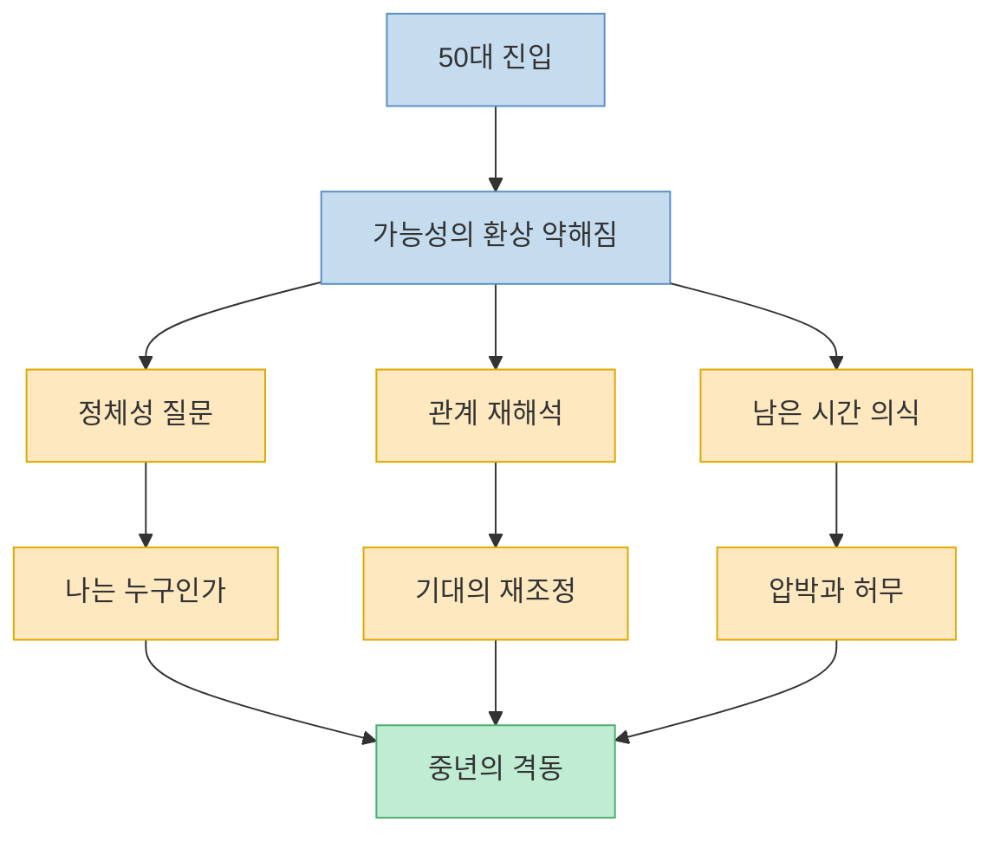
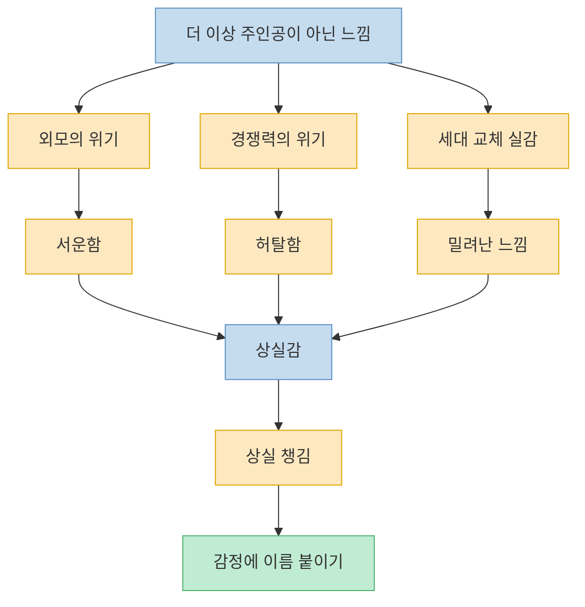
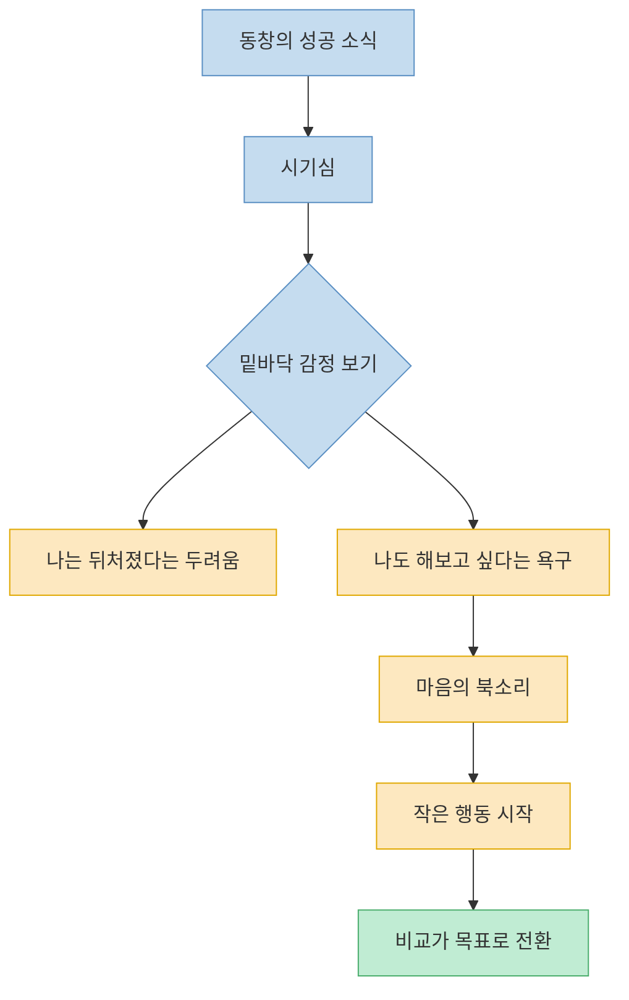
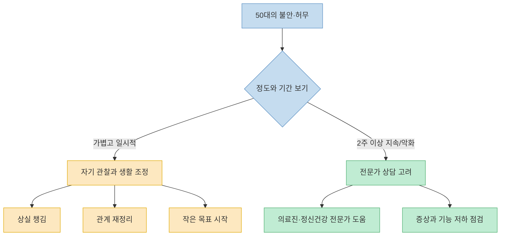

이 영상은 50대를 단순히 `나이 든 시기`가 아니라, 인생을 중간 평가하면서 불안과 허무가 커지기 쉬운 시기로 본다. 겉으로는 안정돼 보여도 진료실에서는 설명하기 어려운 우울감과 불안감을 토로하는 사람이 늘어난다는 것이다. 영상이 붙이는 이름은 분명하다. 50대의 위기는 실패가 아니라 **환상이 걷히는 시기** 에 가깝다. 내가 믿어 왔던 가능성, 관계에 대한 기대, 나의 역할과 미래가 다시 정리되면서 마음이 크게 흔들린다는 것이다. 다만 이런 감정이 모두 병적이라는 뜻은 아니다. 동시에, 기분 저하나 불안이 오래 지속되거나 일상 기능을 크게 떨어뜨린다면 스스로 참고 버티기보다 도움을 구해야 한다는 점도 중요하다.

<!--more-->

## Sources

- [정신과 의사가 말하는 "요즘 50대들이 정신과 찾는 원인 1위" | 대한민국 50대들의 고민 1위는?](https://www.youtube.com/watch?v=vWETI5lkvGo) — 책식주의
- [My Mental Health: Do I Need Help?](https://www.nimh.nih.gov/health/publications/my-mental-health-do-i-need-help) — National Institute of Mental Health
- [Stress](https://medlineplus.gov/stress.html) — MedlinePlus
- [Getting help for mental health](https://magazine.medlineplus.gov/article/getting-help-for-mental-health) — NIH MedlinePlus Magazine
- [Older Adult Mental Health](https://medlineplus.gov/olderadultmentalhealth.html) — MedlinePlus

---

## 첫 번째 변화: 50대는 `환상 버리기`가 시작되는 시기라는 해석

영상은 청년기와 중년기의 차이를 `환상`이라는 단어로 설명한다. 젊을 때는 아직 무엇이든 될 수 있고, 언젠가 크게 성공할 수 있다는 믿음이 삶을 밀어 주는 쿠션처럼 작동한다. 그런데 40대 후반에서 50대로 가면 그 쿠션의 바람이 서서히 빠지기 시작한다. 내가 할 수 있다고 믿었던 것들이 현실과 다를 수 있다는 사실, 남은 수십 년을 다시 살아내야 한다는 압박이 동시에 밀려온다는 것이다. [(0:17)](https://youtu.be/vWETI5lkvGo?t=17), [(0:41)](https://youtu.be/vWETI5lkvGo?t=41), [(1:00)](https://youtu.be/vWETI5lkvGo?t=60), [(1:19)](https://youtu.be/vWETI5lkvGo?t=79)

영상은 이 시기에 세 가지 심리적 격동이 생긴다고 말한다. 첫째는 정체성의 흔들림이다. `나는 어떤 사람이지?`, `내가 지금 뭘 하고 있는 거지?`, `왜 사는 거지?` 같은 질문이 갑자기 가까워진다. 둘째는 인간관계 재해석이다. 그동안 품고 있던 기대가 이루어지기 어렵다는 현실을 받아들이게 된다. 셋째는 미래 감각의 변화다. 아직 끝나지 않았지만 무한히 열려 있지도 않은 시간을 실감하게 된다. 영상은 이것을 단순한 중년의 위기라기보다 다음 삶으로 넘어가기 위해 필요한 통과의례로 해석한다. [(1:21)](https://youtu.be/vWETI5lkvGo?t=81), [(1:29)](https://youtu.be/vWETI5lkvGo?t=89), [(1:40)](https://youtu.be/vWETI5lkvGo?t=100), [(2:01)](https://youtu.be/vWETI5lkvGo?t=121)

이 프레임의 장점은 불안을 개인의 나약함으로 해석하지 않게 해 준다는 데 있다. `왜 나는 요즘 이렇게 허탈하지?`라는 질문에 대해, 영상은 `당신이 이상해서가 아니라 인생의 단계가 바뀌고 있기 때문`이라는 설명을 준다. 50대의 불안은 종종 무언가가 망가졌다는 신호가 아니라, 오히려 오래 붙잡고 있던 자기 서사를 다시 써야 한다는 신호로 볼 수 있다는 것이다. [(0:28)](https://youtu.be/vWETI5lkvGo?t=28), [(1:19)](https://youtu.be/vWETI5lkvGo?t=79), [(2:05)](https://youtu.be/vWETI5lkvGo?t=125)

---

## 두 번째 변화: 더 이상 주인공이 아니라는 느낌, 그리고 상실감

영상은 50대가 겪는 구체적 감정으로 `더 이상 주인공이 아닌 것 같은 느낌`을 든다. 여성에게는 외모와 젊음의 위기 의식으로, 남성에게는 경쟁력과 중심성의 위기로 나타날 수 있다고 말한다. 예를 들어 회사에서 후배들끼리만 따로 소통하는 걸 알게 됐을 때, 혹은 어느 순간 자신이 젊은 중심 인물이 아니라 관리하고 조심해야 할 `윗세대`처럼 취급될 때 생기는 서운함과 허탈함이 여기에 들어간다. [(2:18)](https://youtu.be/vWETI5lkvGo?t=138), [(2:42)](https://youtu.be/vWETI5lkvGo?t=162), [(3:01)](https://youtu.be/vWETI5lkvGo?t=181), [(3:18)](https://youtu.be/vWETI5lkvGo?t=198)

영상은 이 감정의 이름을 `상실감`이라고 붙인다. 중요한 것은 상실감이 화를 내거나 무시한다고 사라지지 않는다는 점이다. 그래서 제안하는 것이 `상실 챙김`이다. 마음에 올라온 감정을 그냥 퉁치지 말고, 이름표를 붙인 뒤 차분하게 관찰해 보라는 것이다. 지금 내가 느끼는 것이 분노인지, 수치심인지, 서운함인지, 밀려난 느낌인지 정확히 보는 것만으로도 마음이 가벼워질 수 있다고 말한다. [(3:18)](https://youtu.be/vWETI5lkvGo?t=198), [(3:27)](https://youtu.be/vWETI5lkvGo?t=207), [(3:35)](https://youtu.be/vWETI5lkvGo?t=215), [(3:44)](https://youtu.be/vWETI5lkvGo?t=224)

이 장면이 중요한 이유는, 중년기의 마음 문제를 `정신력이 약해져서`가 아니라 `상실을 처리해야 하는 시기`로 다시 보게 만들기 때문이다. 역할, 젊음, 경쟁력, 관심, 기대, 중심성 같은 것이 조금씩 멀어질 때 사람은 당연히 흔들릴 수 있다. 영상은 그 흔들림을 억지로 지우기보다, 먼저 인정하고 관찰하라고 권한다. [(3:35)](https://youtu.be/vWETI5lkvGo?t=215), [(3:44)](https://youtu.be/vWETI5lkvGo?t=224)

---

## 세 번째 변화: 시기심의 밑바닥에는 `나도 해보고 싶다`가 있다

영상의 세 번째 조언은 꽤 흥미롭다. 50대쯤 되면 성공한 동창, 잘 풀린 지인, 늦게 꽃핀 사람들의 소식이 자주 들리는데, 이때 올라오는 시기심을 단순히 부끄러운 감정으로 보지 말자는 것이다. 영상은 그 시기심의 종착점을 파고들면, 사실은 `나도 무언가를 해보고 싶다`는 욕구가 숨어 있을 가능성이 높다고 말한다. 즉 동창이 잘돼서 괴로운 것이 아니라, **내 안의 미뤄 둔 욕구가 자극되었기 때문에** 흔들린다는 것이다. [(4:10)](https://youtu.be/vWETI5lkvGo?t=250), [(4:17)](https://youtu.be/vWETI5lkvGo?t=257), [(4:28)](https://youtu.be/vWETI5lkvGo?t=268), [(4:36)](https://youtu.be/vWETI5lkvGo?t=276)

그래서 영상은 `마음의 북소리를 따라가라`고 말한다. 남이 무엇을 이뤘는지 보는 데 에너지를 쓰기보다, 그 소식을 들었을 때 내 안에서 함께 울린 욕구를 추적하라는 뜻이다. 예를 들어 관심 있는 분야의 자격증을 따고 싶다면 평생교육원이나 지역 강좌에 등록하는 작은 행동부터 시작할 수 있다. 핵심은 부러움의 방향을 바깥에서 안으로 돌려, 비교를 실행으로 바꾸는 것이다. [(4:36)](https://youtu.be/vWETI5lkvGo?t=276), [(4:50)](https://youtu.be/vWETI5lkvGo?t=290), [(5:02)](https://youtu.be/vWETI5lkvGo?t=302), [(5:17)](https://youtu.be/vWETI5lkvGo?t=317)

이 조언은 중년의 시기심을 도덕적 실패가 아니라 방향 감각의 신호로 다시 본다는 점에서 의미가 있다. 남의 삶이 자꾸 거슬린다면, 그건 내가 아직 살아 있고 무엇인가 원하고 있다는 뜻일 수도 있다. 영상은 이 에너지를 경쟁이나 자책으로 쓰지 말고, 새로운 목표를 세우는 연료로 쓰라고 제안한다. [(4:28)](https://youtu.be/vWETI5lkvGo?t=268), [(5:14)](https://youtu.be/vWETI5lkvGo?t=314), [(5:24)](https://youtu.be/vWETI5lkvGo?t=324)

---

## 다만 이런 감정이 오래가고 기능을 무너뜨린다면 `통과의례`만으로 보면 안 된다

여기서 한 가지 선을 분명히 긋는 것이 중요하다. 영상은 50대의 불안과 허무를 삶의 단계가 바뀌며 생기는 통과의례로 해석하지만, 모든 불안과 우울이 그 말 한마디로 충분히 설명되는 것은 아니다. NIMH는 슬픔, 걱정, 의욕 저하, 수면 문제 같은 가벼운 증상은 누구에게나 생길 수 있지만, 이런 상태가 2주 이상 지속되거나 심해지고, 일·가정·관계를 수행하기 어려워질 정도라면 의료진과 상담하라고 안내한다. [NIMH](https://www.nimh.nih.gov/health/publications/my-mental-health-do-i-need-help)

MedlinePlus도 스트레스를 단순한 기분 문제로 보지 않는다. 장기 스트레스는 몸과 마음 모두에 영향을 줄 수 있고, 생활습관 조정만으로 부족할 때는 건강 전문가나 정신건강 전문가의 도움을 받는 것이 필요하다고 설명한다. 즉 `나이 들어서 원래 그래`라고만 넘기는 것은 오히려 위험할 수 있다. 특히 수면이 무너지거나, 흥미를 거의 잃거나, 짜증과 불안이 오래 지속되거나, 무가치감이 깊어지는 경우는 스스로 참고 견디는 것보다 점검이 우선이다. [MedlinePlus Stress](https://medlineplus.gov/stress.html), [NIH MedlinePlus Magazine](https://magazine.medlineplus.gov/article/getting-help-for-mental-health)

결국 50대의 마음을 다루는 데는 두 가지 시선이 함께 필요하다. 하나는 영상이 말하는 것처럼 중년기의 불안과 상실을 `자연스러운 재구성의 과정`으로 이해하는 시선이다. 다른 하나는 그 감정이 너무 오래, 너무 깊게, 너무 일상을 무너뜨릴 정도로 이어질 때는 전문가 도움을 받는 경계 감각이다. 이 두 시선을 함께 가져야 `괜찮다며 버티기`와 `모든 걸 병으로 보기` 사이에서 균형을 잡을 수 있다. [NIMH](https://www.nimh.nih.gov/health/publications/my-mental-health-do-i-need-help), [Older Adult Mental Health](https://medlineplus.gov/olderadultmentalhealth.html)

---

## 핵심 요약

- 영상은 50대의 불안과 허무를 `환상이 걷히는 시기`로 해석한다. 가능성의 쿠션이 줄어들며 정체성, 관계, 미래 감각이 동시에 흔들린다는 것이다. [(1:00)](https://youtu.be/vWETI5lkvGo?t=60), [(1:21)](https://youtu.be/vWETI5lkvGo?t=81)
- 더 이상 주인공이 아닌 것 같은 느낌은 외모, 경쟁력, 세대 교체와 연결된 상실감으로 나타날 수 있으며, 영상은 이를 `상실 챙김`으로 다루라고 조언한다. [(2:18)](https://youtu.be/vWETI5lkvGo?t=138), [(3:18)](https://youtu.be/vWETI5lkvGo?t=198)
- 시기심의 밑바닥에는 남을 이기고 싶은 마음보다 `나도 무언가를 해보고 싶다`는 욕구가 숨어 있을 수 있고, 영상은 이를 마음의 북소리라고 부른다. [(4:17)](https://youtu.be/vWETI5lkvGo?t=257), [(5:02)](https://youtu.be/vWETI5lkvGo?t=302)
- 다만 불안, 무기력, 흥미 저하, 수면 문제 등이 2주 이상 지속되거나 일상 기능을 떨어뜨리면 스스로 버티기보다 전문가 도움을 고려해야 한다. [NIMH](https://www.nimh.nih.gov/health/publications/my-mental-health-do-i-need-help)
- 중년의 마음을 이해할 때는 `자연스러운 인생 재구성`이라는 시선과 `치료가 필요한 신호를 놓치지 않는 경계`가 함께 필요하다. [MedlinePlus Stress](https://medlineplus.gov/stress.html), [NIH MedlinePlus Magazine](https://magazine.medlineplus.gov/article/getting-help-for-mental-health)

---

## 결론

이 영상은 50대를 문제 많은 나이로 보지 않는다. 오히려 지금까지 붙들고 있던 환상과 역할이 재정리되며, 더 깊고 단단한 삶으로 넘어가기 직전의 시기로 해석한다. 그래서 불안과 허무, 상실감, 시기심조차도 모두 없애야 할 적이 아니라 읽어야 할 신호로 바뀐다. [(0:17)](https://youtu.be/vWETI5lkvGo?t=17), [(5:24)](https://youtu.be/vWETI5lkvGo?t=324)

하지만 그 신호가 너무 오래 계속되고 삶의 기능을 무너뜨린다면, 그것은 혼자 견뎌야 할 통과의례가 아니라 도움을 받아야 할 상태일 수도 있다. 결국 중요한 것은 50대의 마음을 부정하지도, 과장하지도 않는 것이다. 잘 읽고, 필요하면 돌보고, 필요하면 도움을 받는 것. 그 균형이 흔들리지 않는 중년을 만드는 더 현실적인 방식에 가깝다. [NIMH](https://www.nimh.nih.gov/health/publications/my-mental-health-do-i-need-help), [Getting help for mental health](https://magazine.medlineplus.gov/article/getting-help-for-mental-health)
