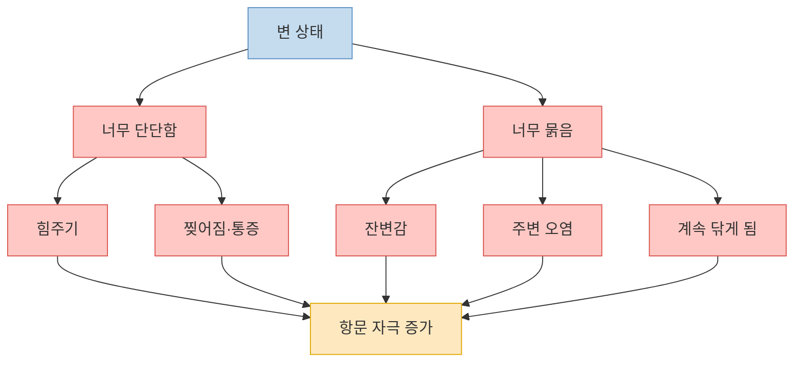
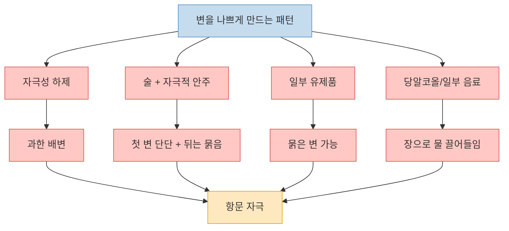
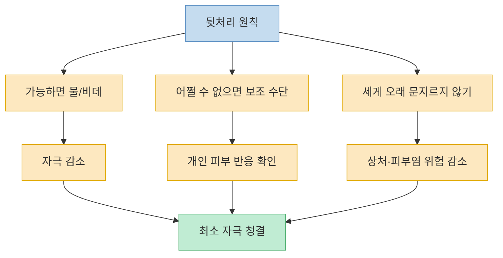
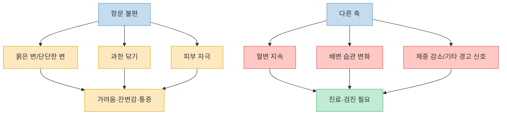

이 영상의 제목은 매우 자극적이지만, 실제 본문에서 반복하는 메시지는 꽤 선명하다. 문제의 핵심은 `휴지로 얼마나 세게 닦느냐` 하나가 아니라, **변이 너무 단단하거나 너무 묽어서 항문 주변을 계속 자극하는 상태** 자체에 있다는 것이다. 여기에 세게 닦는 습관, 거친 휴지, 잦은 물티슈와 알코올 사용이 더해지면 가려움, 화끈거림, 습함, 출혈 같은 불편이 심해질 수 있다고 설명한다. 다만 제목에 들어간 `대장암`이라는 표현은 영상 본문에서 직접적인 원인-결과로 촘촘히 설명되지는 않는다. 그래서 이 글에서는 영상의 실전 팁을 정리하되, 공식 자료 기준으로 항문 가려움·치질·혈변·대장암 위험 신호의 경계도 함께 분리해서 본다.

<!--more-->

## Sources

- ["이렇게 닦아야 깔끔합니다" 대장암을 부르는 최악의 똥닦기 습관 (윤상민 원장 1부)](https://www.youtube.com/watch?v=1wClagRN8SI) — 건강구조대
- [Symptoms & Causes of Hemorrhoids](https://www.niddk.nih.gov/health-information/digestive-diseases/hemorrhoids/symptoms-causes) — NIDDK
- [Hemorrhoids](https://www.niddk.nih.gov/health-information/digestive-diseases/hemorrhoids) — NIDDK
- [Anal itching - Symptoms and causes](https://www.mayoclinic.org/diseases-conditions/anal-itching/symptoms-causes/syc-20369345) — Mayo Clinic
- [Colorectal Cancer Risk Factors](https://www.cancer.org/cancer/types/colon-rectal-cancer/causes-risks-prevention/risk-factors.html) — American Cancer Society
- [Colorectal Cancer Screening Guidelines](https://www.cancer.org/health-care-professionals/american-cancer-society-prevention-early-detection-guidelines/colorectal-cancer-screening-guidelines.html) — American Cancer Society

---

## 영상의 출발점: 잘 안 닦이는 이유는 휴지 기술보다 `변 상태`인 경우가 많다

영상은 `딱아도 계속 묻는다`는 호소를 많이 듣는다고 말한다. 여기서 처음부터 강조하는 것은 닦는 방법보다 변 상태다. 변이 너무 단단하면 힘을 줘야 하고 찢어지기 쉽고, 너무 묽으면 직장과 항문 주변에 더 넓게 남으면서 잔변감과 오염감을 만든다는 것이다. 그래서 좋은 배변은 단순히 자주 보거나 묽게 보는 것이 아니라, `부드러운 바나나 같은 변`을 만드는 것이라고 설명한다. [(0:36)](https://youtu.be/1wClagRN8SI?t=36), [(1:31)](https://youtu.be/1wClagRN8SI?t=91), [(2:11)](https://youtu.be/1wClagRN8SI?t=131), [(3:08)](https://youtu.be/1wClagRN8SI?t=188)

이 논리는 실제로도 어느 정도 맞닿아 있다. NIDDK는 치질 증상과 원인 설명에서 변비뿐 아니라 `만성 설사`, 힘주기, 오래 앉아 있기 같은 배변 습관이 항문 증상을 악화시킬 수 있다고 적는다. 즉 항문 불편은 `딱는 기술` 하나로만 설명되지 않고, 대변의 질감과 배변 습관 전체 안에서 봐야 한다는 것이다. [NIDDK Symptoms & Causes](https://www.niddk.nih.gov/health-information/digestive-diseases/hemorrhoids/symptoms-causes)

영상은 특히 묽은 변을 과소평가하지 말라고 말한다. 많은 사람이 변비를 더 나쁜 것으로 여기지만, 묽은 변은 배를 계속 불편하게 만들고, 직장과 항문 주변에 남는 느낌 때문에 잔변감과 닦기 어려움을 유발하며, 결국 더 많이 닦게 만드는 악순환으로 이어진다고 설명한다. 이 지점이 영상 전체의 핵심 전제다. `잘 안 닦이는 것`은 종종 항문 구조의 문제가 아니라, **안 좋은 변이 계속 만들어지는 문제** 일 수 있다는 것이다. [(2:28)](https://youtu.be/1wClagRN8SI?t=148), [(2:37)](https://youtu.be/1wClagRN8SI?t=157), [(10:09)](https://youtu.be/1wClagRN8SI?t=609), [(19:16)](https://youtu.be/1wClagRN8SI?t=1156)

---

## 변을 더 나쁘게 만드는 패턴: 자극성 하제, 술, 기름진 음식, 일부 유제품과 당알코올

영상은 변비 해결을 위해 쉽게 손대는 자극성 하제, 알로에, 푸룬 주스 같은 것을 조심해야 한다고 말한다. 이런 것들이 설사를 유발할 만큼 강하게 작용하면 장이 편하지 않고 항문에도 불편을 줄 수 있다는 것이다. 특히 술을 마신 다음 날에는 첫 변은 단단하고 뒤는 묽어지는 식으로 변 상태가 나빠질 수 있고, 매운 음식·기름진 안주·유제품·라떼류 등이 묽은 변 쪽으로 기울게 만들 수 있다고 설명한다. [(1:13)](https://youtu.be/1wClagRN8SI?t=73), [(1:39)](https://youtu.be/1wClagRN8SI?t=99), [(4:01)](https://youtu.be/1wClagRN8SI?t=241), [(6:17)](https://youtu.be/1wClagRN8SI?t=377)

또 영상은 푸룬 주스와 제로 음료, 자일리톨 등 당알코올 계열이 장에서 물을 끌어들여 변을 묽게 만들 수 있다고 설명한다. 이 부분은 개인차가 크지만, 적어도 `변을 좋게 본다`와 `장과 항문에 편한 변을 만든다`가 같은 말은 아니라는 구분은 중요하다. 설사처럼 배출되는 것이 시원해 보일 수는 있어도, 장이 불편하고 항문 주변에 자극을 반복시키면 결과적으로 더 힘들 수 있다는 것이다. [(6:40)](https://youtu.be/1wClagRN8SI?t=400), [(7:01)](https://youtu.be/1wClagRN8SI?t=421), [(7:22)](https://youtu.be/1wClagRN8SI?t=442), [(7:44)](https://youtu.be/1wClagRN8SI?t=464)

영상이 추천하는 방향은 반대로 `변의 양을 늘리되, 물러지기만 하게 만들지 않는 것`이다. 식이섬유를 충분히 먹어 부드러운 덩어리가 만들어지게 하고, 장을 거칠게 자극하는 방식은 피하라는 것이다. 변이 지나치게 단단해도 안 되고 지나치게 묽어도 안 된다는 중간 지점이 영상의 핵심 관리 목표다. [(5:39)](https://youtu.be/1wClagRN8SI?t=339), [(5:59)](https://youtu.be/1wClagRN8SI?t=359), [(19:20)](https://youtu.be/1wClagRN8SI?t=1160), [(20:20)](https://youtu.be/1wClagRN8SI?t=1220)

---

## 닦는 습관은 어떻게 바꿔야 하나: 세게 많이보다 `최소 자극`이 원칙

영상은 항문 주변을 마른 휴지로 세게 닦는 것이 가장 좋지 않다고 반복한다. 가능하면 물로 닦거나 비데를 쓰고, 그게 어렵다면 개인차에 따라 물티슈를 보조적으로 쓸 수는 있지만 역시 자극이 적은 방향이어야 한다고 말한다. 중요한 것은 완벽하게 `뽀드득` 닦는 것이 아니라, 항문 피부를 문질러 손상시키지 않는 것이다. [(8:01)](https://youtu.be/1wClagRN8SI?t=481), [(8:07)](https://youtu.be/1wClagRN8SI?t=487), [(8:25)](https://youtu.be/1wClagRN8SI?t=505), [(12:03)](https://youtu.be/1wClagRN8SI?t=723)

공식 자료도 이 방향과 크게 다르지 않다. Mayo Clinic은 항문 가려움의 원인으로 오래 지속되는 설사, 너무 자주 혹은 너무 세게 닦는 습관, 피부염과 자극성 제품을 든다. 즉 항문 가려움은 더러워서만 생기는 것이 아니라, **과한 청소와 피부 자극** 으로도 생길 수 있다는 뜻이다. [Mayo Clinic Anal Itching](https://www.mayoclinic.org/diseases-conditions/anal-itching/symptoms-causes/syc-20369345)

영상은 휴지와 물티슈 모두 장단점이 있다고 본다. 부드럽고 도톰한 휴지가 낫지만, 많이 쓰는 것 자체는 좋지 않다고 하고, 물티슈 역시 보존제와 거친 재질 때문에 누구에게는 더 악화 요인이 될 수 있다고 말한다. 결국 핵심은 `무엇이 절대적으로 좋다`가 아니라 `내 피부에 덜 자극적인 방식으로 최소한만 닦는 것`에 있다. 여성은 앞에서 뒤로 닦는 방향을 지키라고도 덧붙인다. [(12:03)](https://youtu.be/1wClagRN8SI?t=723), [(13:06)](https://youtu.be/1wClagRN8SI?t=786), [(13:24)](https://youtu.be/1wClagRN8SI?t=804), [(14:00)](https://youtu.be/1wClagRN8SI?t=840)

---

## `대장암을 부르는 습관`이라는 제목은 어떻게 읽어야 하나

이 부분은 분리해서 보는 게 안전하다. 영상 본문은 주로 항문 소양증, 치질, 묽은 변, 닦는 습관, 삶의 질 저하를 다룬다. 하지만 `휴지로 세게 닦는 습관이 직접 대장암을 부른다`는 인과를 본문에서 체계적으로 설명하지는 않는다. 반면 American Cancer Society가 정리한 대장암 위험요인은 과체중, 신체활동 부족, 특정 식습관, 흡연, 음주, 나이, 가족력, 일부 유전성 질환 등이다. 즉 적어도 공식 자료 기준으로는 `닦는 습관`이 대표적 대장암 위험요인으로 제시되지는 않는다. [ACS Risk Factors](https://www.cancer.org/cancer/types/colon-rectal-cancer/causes-risks-prevention/risk-factors.html)

다만 여기서 반대로 `그럼 아무 걱정도 안 해도 된다`고 읽어서는 안 된다. NIDDK는 직장 출혈이나 항문 증상이 모두 치질 때문은 아니며, 대장이나 직장 질환의 신호일 수도 있다고 분명히 적는다. 실제로 Mayo Clinic과 NIDDK 모두 지속적인 가려움, 출혈, 통증, 원인 모를 증상이 계속되면 진료를 보라고 권한다. 즉 제목의 대장암 언급은 과장으로 보되, **혈변이나 지속 증상을 치질로만 단정하는 것도 위험** 하다. [NIDDK Symptoms & Causes](https://www.niddk.nih.gov/health-information/digestive-diseases/hemorrhoids/symptoms-causes), [Mayo Clinic Anal Itching](https://www.mayoclinic.org/diseases-conditions/anal-itching/symptoms-causes/syc-20369345)

또 평균 위험군 성인은 45세부터 대장암 정기 검진을 시작하라는 것이 ACS 가이드라인이다. 나이, 가족력, 증상, 고위험 상태에 따라 더 일찍 검사해야 할 수도 있다. 따라서 `닦는 법`은 생활 관리의 문제이고, `출혈·체중감소·배변 습관 변화·지속 증상`은 진료와 검진의 문제로 분리해서 보는 편이 정확하다. [ACS Screening Guidelines](https://www.cancer.org/health-care-professionals/american-cancer-society-prevention-early-detection-guidelines/colorectal-cancer-screening-guidelines.html)

---

## 언제 병원으로 가야 하나: 밤에 못 잘 정도의 가려움, 반복 출혈, 변 상태 악화

영상은 항문 가려움과 불편이 심해지면 잠을 못 자고, 삶의 질이 무너지고, 심지어 우울감까지 이어질 수 있다고 말한다. 특히 `묽은 변 + 세게 닦기` 조합이 오래가면 정말 괴로운 상태가 될 수 있다고 강조한다. 이 부분은 실제 임상 체감과도 연결될 수 있다. 증상이 민망해서 미루기 쉽지만, 오래가면 작은 불편이 큰 스트레스로 바뀐다. [(15:20)](https://youtu.be/1wClagRN8SI?t=920), [(16:00)](https://youtu.be/1wClagRN8SI?t=960), [(17:10)](https://youtu.be/1wClagRN8SI?t=1030)

공식 자료에서도 경계선은 비교적 분명하다. NIDDK는 집에서 관리해도 1주 이상 증상이 낫지 않거나 직장 출혈이 있으면 진료를 보라고 안내한다. Mayo Clinic 역시 심한 가려움, 지속되는 증상, 출혈, 감염 의심이 있으면 의료진을 찾으라고 한다. 즉 `민망하니까 더 참자`는 오히려 늦출 수 있는 선택이다. [NIDDK Symptoms & Causes](https://www.niddk.nih.gov/health-information/digestive-diseases/hemorrhoids/symptoms-causes), [Mayo Clinic Anal Itching](https://www.mayoclinic.org/diseases-conditions/anal-itching/symptoms-causes/syc-20369345)

영상 후반도 결국 같은 결론으로 간다. 많은 항문 불편은 수술 이전에 배변 상태를 정상화하고, 자극을 줄이는 방식으로도 꽤 조절될 수 있다는 것이다. 하지만 그 판단은 스스로 단정하기보다, 증상이 오래가거나 반복될 때는 진료를 통해 치질인지, 피부염인지, 열상인지, 다른 질환 가능성이 있는지 확인하는 편이 안전하다. [(17:23)](https://youtu.be/1wClagRN8SI?t=1043), [(18:22)](https://youtu.be/1wClagRN8SI?t=1102), [(19:31)](https://youtu.be/1wClagRN8SI?t=1171)

---

## 핵심 요약

- 영상의 핵심은 `잘 안 닦이는 문제`의 본질을 닦는 기술보다 `너무 단단하거나 너무 묽은 변`에서 찾는 것이다. [(2:11)](https://youtu.be/1wClagRN8SI?t=131), [(3:08)](https://youtu.be/1wClagRN8SI?t=188)
- 자극성 하제, 술, 기름진 음식, 일부 유제품, 당알코올 계열은 사람에 따라 묽은 변과 항문 자극을 악화시킬 수 있다고 영상은 설명한다. [(1:13)](https://youtu.be/1wClagRN8SI?t=73), [(7:01)](https://youtu.be/1wClagRN8SI?t=421)
- 마른 휴지로 세게 오래 닦는 습관은 피하고, 가능하면 물로 닦거나 자극을 최소화하는 방식으로 바꾸는 것이 좋다는 메시지가 반복된다. [(8:01)](https://youtu.be/1wClagRN8SI?t=481), [(12:03)](https://youtu.be/1wClagRN8SI?t=723)
- 공식 자료 기준으로 항문 가려움과 치질 증상은 만성 설사, 변비, 힘주기, 과한 닦기와 연결될 수 있다. [NIDDK Symptoms & Causes](https://www.niddk.nih.gov/health-information/digestive-diseases/hemorrhoids/symptoms-causes), [Mayo Clinic Anal Itching](https://www.mayoclinic.org/diseases-conditions/anal-itching/symptoms-causes/syc-20369345)
- 다만 `닦는 습관`은 대표적 대장암 위험요인으로 제시되지 않으며, 혈변·지속 증상·배변 습관 변화는 따로 진료와 검진의 문제로 봐야 한다. [ACS Risk Factors](https://www.cancer.org/cancer/types/colon-rectal-cancer/causes-risks-prevention/risk-factors.html), [ACS Screening Guidelines](https://www.cancer.org/health-care-professionals/american-cancer-society-prevention-early-detection-guidelines/colorectal-cancer-screening-guidelines.html)

---

## 결론

이 영상이 실제로 말하는 것은 `더 강하게 닦아라`가 아니라 정반대다. 변 상태를 좋게 만들고, 닦는 자극을 줄이고, 민감한 항문 피부를 과하게 괴롭히지 말라는 것이다. 잘 안 닦이는 문제는 많은 경우 더러움의 문제가 아니라 장과 항문이 동시에 자극받고 있다는 신호에 가깝다. [(0:00)](https://youtu.be/1wClagRN8SI?t=0), [(8:25)](https://youtu.be/1wClagRN8SI?t=505), [(17:23)](https://youtu.be/1wClagRN8SI?t=1043)

실전적으로는 세 가지만 기억하면 된다. 변을 바나나처럼 부드럽게 만들 것, 닦는 자극을 최소화할 것, 그리고 출혈이나 지속 증상을 치질로만 넘기지 말 것. 이 세 가지를 구분해서 보면, 자극적인 제목보다 훨씬 도움이 되는 실제 관리 원칙이 남는다. [NIDDK Hemorrhoids](https://www.niddk.nih.gov/health-information/digestive-diseases/hemorrhoids), [ACS Screening Guidelines](https://www.cancer.org/health-care-professionals/american-cancer-society-prevention-early-detection-guidelines/colorectal-cancer-screening-guidelines.html)
