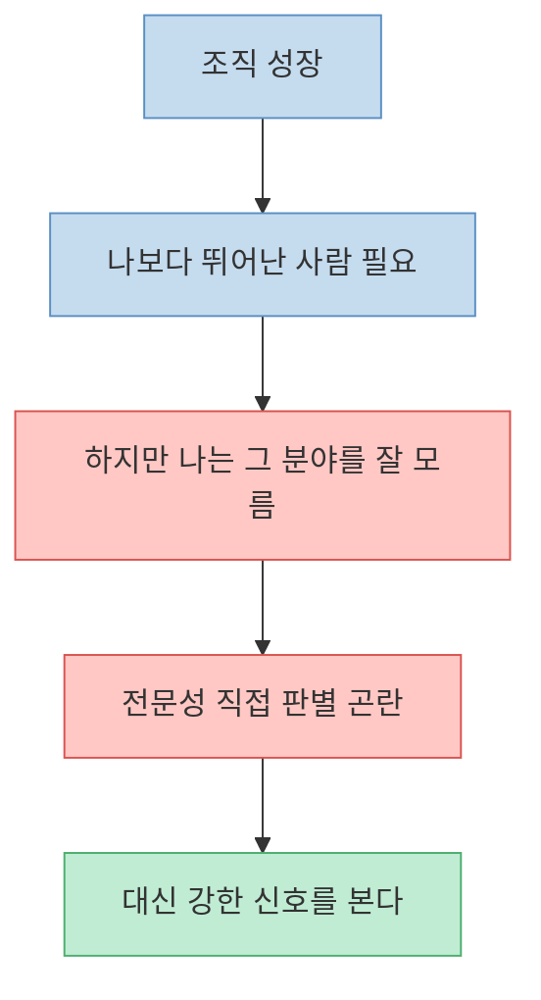
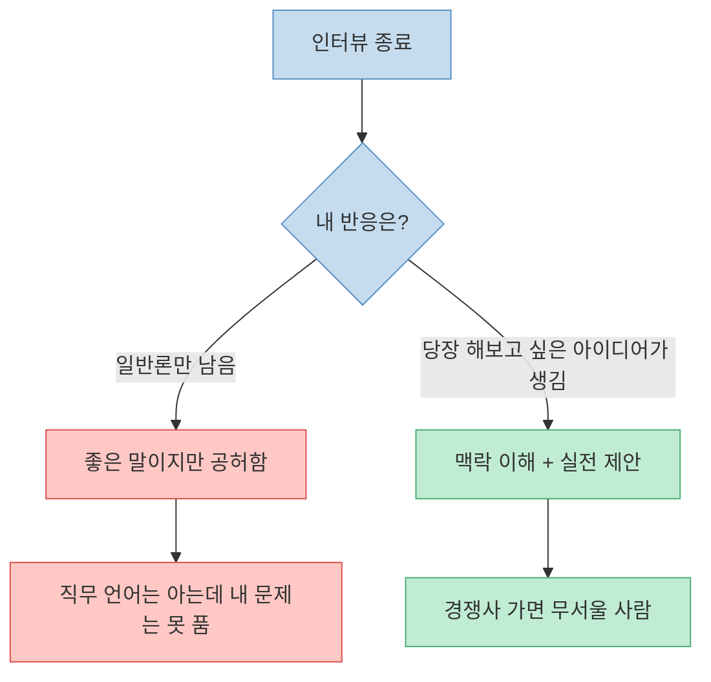
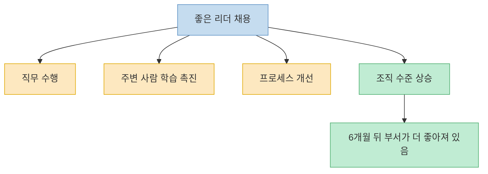
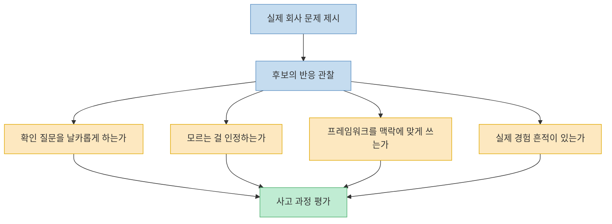
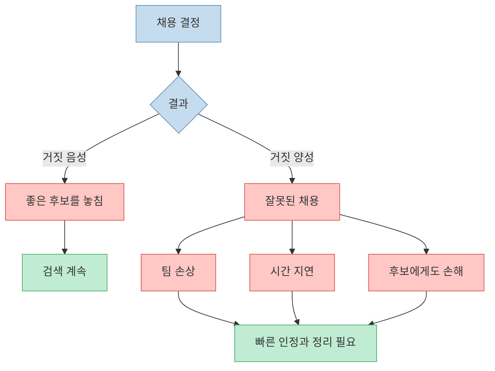

회사 규모가 커질수록 리더는 자신보다 특정 분야를 더 잘하는 사람을 반드시 뽑아야 한다. 문제는 그게 바로 **내가 잘 모르는 영역** 이라는 점이다. 엔지니어 출신 CEO가 마케팅 VP를 뽑아야 하거나, 제품 리더가 세일즈 총괄을 뽑아야 하는 순간이 그렇다. Jason Cohen의 이 글은 그 딜레마를 정면으로 다룬다. `전문성을 직접 판별할 수 없다면 무엇을 봐야 하는가?` 그의 답은 의외로 단순하다. 디테일을 맞히려 하지 말고, 인터뷰와 레퍼런스 체크에서 드러나는 몇 가지 **강한 신호** 를 보라는 것이다. 이 글은 그 신호들을 `아이디어`, `학습 가능성`, `조직 파급력`, `실전 문제 해결`, `레퍼런스 질문`, `미스하이어 대응`의 흐름으로 정리한다.

<!--more-->

## Sources

- [How to hire people who are better than you](https://longform.asmartbear.com/hire-better-than-you/) — Jason Cohen

---

## 출발점: 리더의 일은 모든 걸 아는 것이 아니라 더 나은 사람을 뽑는 것이다

글의 전제는 분명하다. 조직이 커졌는데도 대표가 여전히 어떤 기능에서 회사 최고 실력자라면, 조직은 더 똑똑해진 것이 아니라 단지 더 커진 것에 불과하다는 것이다. 성장하는 조직은 사람 수만 늘어나는 것이 아니라, 각 기능의 수준이 창업자보다 더 높아져야 한다. 그래야 회사가 `더 크고 더 느린 조직`이 아니라 `더 강하고 더 똑똑한 조직`이 된다. [원문](https://longform.asmartbear.com/hire-better-than-you/)

하지만 여기서 바로 딜레마가 생긴다. 내가 마케팅을 모르기 때문에 마케팅 VP를 뽑아야 하는데, 그렇다면 그 사람이 진짜 잘하는지 어떻게 판별하느냐는 것이다. 글은 이 문제를 `췌장외과 의사를 어떻게 평가할 것이냐`는 비유로 밀어붙인다. 질문도 어렵고, 답을 들어도 맞는 말인지 판단하기 어렵다. 결국 채용자의 목표는 직접 전문성을 검증하는 것이 아니라, **전문성이 있을 때 자연스럽게 나타나는 2차 신호를 읽는 것** 으로 바뀌어야 한다. [원문](https://longform.asmartbear.com/hire-better-than-you/)

---

## 첫 번째 신호: 인터뷰가 끝났는데 당장 그 사람 아이디어를 실행하고 싶어진다

Jason Cohen이 가장 먼저 제시하는 신호는 의외로 감각적이다. 인터뷰가 끝난 뒤 `채용 여부와 별개로 저 사람이 말한 것 중 절반은 당장 해봐야겠다`는 생각이 드는가를 보라는 것이다. 이 감정은 단순 호감이 아니라, 그 사람이 내 회사의 문맥과 제약을 빠르게 이해했고, 그 위에서 실제 행동 가능한 아이디어를 내놓았다는 증거일 수 있다. [원문](https://longform.asmartbear.com/hire-better-than-you/)

여기서 중요한 건 `똑똑한 말을 많이 하는가`가 아니다. 흔한 프레임워크를 유창하게 늘어놓는 것과, 내가 방금 설명한 문제를 듣고 우리 상황에 맞는 구체적인 제안을 하는 것은 다르다. 전자는 ChatGPT도 할 수 있는 일반론일 수 있고, 후자는 이 사람이 이 회사, 이 맥락, 이 문제에 실제로 반응하고 있다는 뜻이다. 그래서 글은 인터뷰 후 스스로에게 이렇게 물으라고 한다. `이 사람이 경쟁사로 가면 무서울까?` 정말 무섭다면, 이미 그 사람의 잠재적 파급력을 감지한 셈이다. [원문](https://longform.asmartbear.com/hire-better-than-you/)

---

## 두 번째 신호: 이미 내가 배우고 있고, 조직 전체도 배울 것 같은가

글은 마크 저커버그의 유명한 말을 인용한다. `내 팀에 넣을 사람은 내가 그 사람 밑에서 일할 수 있을 정도여야 한다.` Jason Cohen은 이 말을 문자 그대로 받아들이기보다, 실제 채용에서 쓸 수 있는 형태로 바꾼다. 즉 `내가 이 사람에게서 배우는가`, `회사 사람들도 이 사람에게서 배울 것 같은가`를 보라는 것이다. [원문](https://longform.asmartbear.com/hire-better-than-you/)

이 신호의 장점은 인터뷰 안에서 바로 감지할 수 있다는 점이다. 이미 내가 몰랐던 관점 하나를 얻었는가, 질문을 계기로 뒤늦게 찾아볼 주제가 생겼는가, 내가 생각하던 회사의 문제를 다른 구조로 이해하게 되었는가. 좋은 임원은 들어오자마자 자기 사일로만 잘 굴리는 사람이 아니라, 의사결정·소통·우선순위·사람 관리 같은 영역에서 다른 사람들의 수준도 끌어올리는 사람이라는 것이 글의 주장이다. [원문](https://longform.asmartbear.com/hire-better-than-you/)

그래서 Jason은 진짜 리더를 `6개월 자리를 비워도 팀이 measurably better 해지는 사람`으로 정의한다. 즉 그 사람이 맡은 부서만 굴러가는 것이 아니라 프로세스, 팀 역량, 산출물, 의사결정 수준이 체계적으로 나아져야 한다는 것이다. 좋은 채용은 단순한 대체가 아니라, 부서 전체의 수준을 들어 올리는 `lift`를 만들어야 한다는 말이다. [원문](https://longform.asmartbear.com/hire-better-than-you/)

---

## 세 번째 신호: 가상의 질문보다 실제 문제를 던졌을 때 어떻게 사고하는가

글은 인터뷰에서 추상적인 질문보다, 회사가 지금 실제로 겪는 문제를 던져 보라고 권한다. 예를 들어 목표 설정이 없는 조직이라면 목표를 어떻게 도입할지, 이직률이 높다면 무엇부터 진단할지, 구성원들이 속마음을 잘 말하지 않는다면 무엇을 먼저 물어볼지 같은 식이다. 여기서 핵심은 답의 디테일을 검증하는 게 아니라, **그 사람이 질문을 어떻게 되받아치고 문제를 어떻게 구조화하는지** 보는 것이다. [원문](https://longform.asmartbear.com/hire-better-than-you/)

좋은 후보는 멋진 답변을 바로 내놓기보다, 먼저 날카로운 확인 질문을 던진다. 상황의 맥락과 제약을 파악하려 하고, 모르는 것을 안다고 포장하지 않으며, 프레임워크 이름만 말하는 대신 자신이 실제로 적용해 본 흔적을 보여 준다. 반대로 블로그 글에서 읽은 일반론을 반복하는 사람은 잠깐 그럴듯해 보여도, 구체적인 맥락이 붙는 순간 쉽게 얕아진다. [원문](https://longform.asmartbear.com/hire-better-than-you/)

즉 이 단계는 `정답을 맞히는 시험`이 아니라 `사고 과정 관찰`에 가깝다. 내가 그 분야 전문가는 아니더라도, 질문이 날카로운지, 모르는 걸 인정하는지, 현실 제약을 반영하는지, 내가 설명한 상황을 놓치지 않는지는 충분히 느낄 수 있다. [원문](https://longform.asmartbear.com/hire-better-than-you/)

---

## 레퍼런스 체크는 실력 검증보다 `어디서 가장 잘 작동하는 사람인가`를 묻는 데 써라

Jason Cohen은 일반적인 레퍼런스 체크를 거의 믿지 않는다. 후보가 데려오는 사람은 대체로 우호적이고, 그래서 실력 검증 도구로는 가치가 낮다고 본다. 대신 레퍼런스 체크를 `이 사람이 어떤 환경에서 제일 잘 작동하는가`를 파악하는 도구로 바꾸라고 한다. [원문](https://longform.asmartbear.com/hire-better-than-you/)

그가 제안하는 질문은 인상적이다. `이 사람이 가장 잘하는 완벽한 시나리오는 무엇인가?`, `반대로 이 사람이 망가지고 주변도 망치는 최악의 시나리오는 무엇인가?`, `본인은 너무 자연스러워서 자각하지 못하지만 사실 특별한 강점은 무엇인가?` 이런 질문은 단순히 좋은 사람인지 나쁜 사람인지가 아니라, 이 사람이 목표가 명확할 때 강한지, 탐색의 자유가 많을 때 잘하는지, 초기 스타트업이 맞는지, 성숙한 조직이 맞는지 같은 **환경 적합성** 을 드러낸다. [원문](https://longform.asmartbear.com/hire-better-than-you/)

이 관점의 핵심은 약점 없는 사람을 찾지 말라는 데 있다. 누구나 약점은 있다. 중요한 건 우리 회사가 지금 당장 필요로 하는 특별한 몇 가지 강점을 이 사람이 가지고 있느냐는 것이다. 빈자리를 채우는 것과 회사를 바꾸는 것은 다르며, 후자를 만들려면 `적당히 괜찮은 사람`이 아니라 `지금 우리에게 필요한 초능력`을 가진 사람을 찾아야 한다는 것이다. [원문](https://longform.asmartbear.com/hire-better-than-you/)

---

## 미스하이어는 피할 수 없지만, 거짓 양성은 거짓 음성보다 훨씬 비싸다

글은 마지막에 현실적인 한계를 인정한다. 인터뷰에서 훌륭했지만 실제로는 역할을 못 하는 사람도 있고, 인터뷰에서는 별로였는데 10년 동안 엄청난 성과를 내는 사람도 있다. 문제는 두 실수의 비용이 다르다는 것이다. 좋은 사람을 놓치는 거짓 음성보다, 아닌 사람을 뽑는 거짓 양성이 훨씬 비싸다. 팀을 망치고, 올바른 사람의 합류를 지연시키고, 본인에게도 상처를 준다. [원문](https://longform.asmartbear.com/hire-better-than-you/)

그래서 Jason은 미스하이어를 빨리 인정하라고 한다. 내 일이 더 편하다고 느껴지거나, 좋은 사람들이 계속 불평하고, 조직이 바로 좋아지지 않는다면 잘못 뽑았을 가능성을 봐야 한다는 것이다. 이미 팀원들은 리더보다 더 빨리 문제를 감지하고 있을 수 있으므로, 애매하게 끌지 말고 끊어야 한다고 말한다. 좋은 채용만큼 중요한 것이, 잘못된 채용을 오래 방치하지 않는 태도라는 뜻이다. [원문](https://longform.asmartbear.com/hire-better-than-you/)

---

## 핵심 요약

- 내가 잘 모르는 직무의 리더를 뽑을 때는 전문성을 직접 검증하려 하기보다, 전문성이 있을 때 자연스럽게 드러나는 강한 신호를 봐야 한다. [원문](https://longform.asmartbear.com/hire-better-than-you/)
- 인터뷰가 끝났는데 당장 실행하고 싶은 아이디어가 생긴다면, 그 사람은 이미 우리 문제를 내 맥락 안에서 풀기 시작한 것이다. [원문](https://longform.asmartbear.com/hire-better-than-you/)
- 좋은 리더는 자기 부서만 잘 굴리는 사람이 아니라, 주변 사람과 프로세스와 조직 수준 전체를 함께 끌어올리는 사람이다. [원문](https://longform.asmartbear.com/hire-better-than-you/)
- 실제 회사 문제를 던졌을 때의 질문 방식, 사고 구조, 모르는 것을 인정하는 태도는 분야 지식이 없어도 관찰 가능한 강력한 신호다. [원문](https://longform.asmartbear.com/hire-better-than-you/)
- 레퍼런스 체크는 실력 칭찬을 듣는 자리가 아니라, 이 사람이 어떤 환경에서 가장 잘 작동하고 가장 망가지는지를 파악하는 자리여야 한다. [원문](https://longform.asmartbear.com/hire-better-than-you/)
- 미스하이어는 피할 수 없지만, 잘못 뽑은 사람을 오래 끌수록 조직 비용이 커지므로 빠르게 인정하고 정리해야 한다. [원문](https://longform.asmartbear.com/hire-better-than-you/)

---

## 결론

이 글이 주는 가장 큰 전환은 채용을 `정답 맞히기`에서 `신호 읽기`로 바꿔 준다는 데 있다. 리더는 모든 직무를 다 알 수 없고, 그래서도 안 된다. 대신 정말 좋은 사람이 들어왔을 때 조직 안에서 어떤 변화가 일어나는지, 인터뷰 안에서 어떤 감각이 생기는지, 레퍼런스 체크에서 어떤 환경 적합성이 드러나는지를 읽어야 한다. [원문](https://longform.asmartbear.com/hire-better-than-you/)

결국 나보다 뛰어난 사람을 뽑는다는 것은 내가 그 사람의 디테일을 모두 평가할 수 있다는 뜻이 아니다. 오히려 내가 모르는 영역에서도 `저 사람은 우리 회사를 더 똑똑하게 만들겠다`는 신호를 감지하고, 그 판단에 책임지는 것이다. 조직을 크게 만드는 것과 좋게 만드는 것의 차이는 바로 여기서 갈린다. [원문](https://longform.asmartbear.com/hire-better-than-you/)
