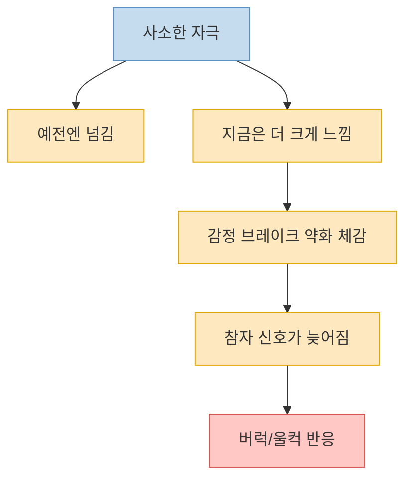
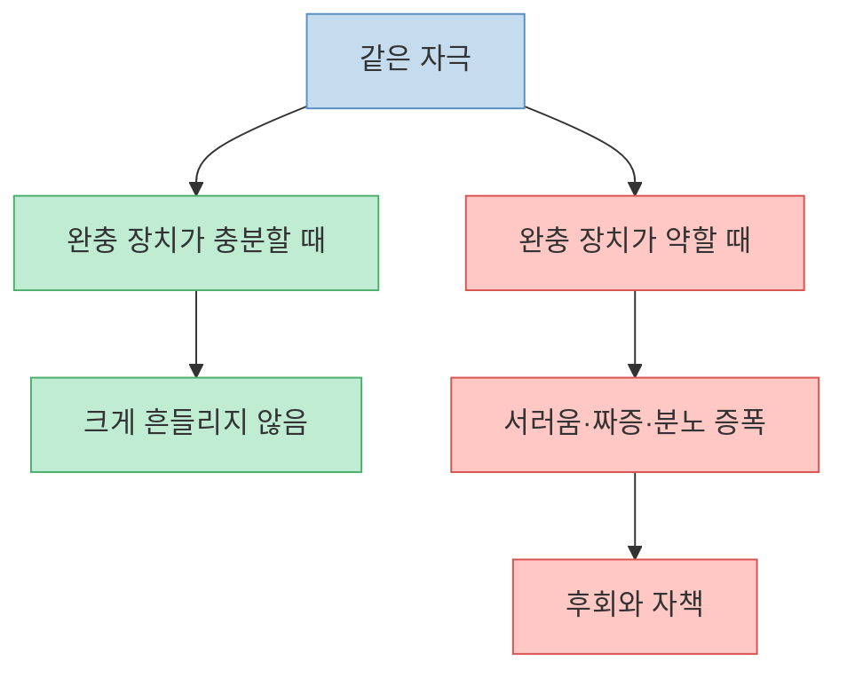
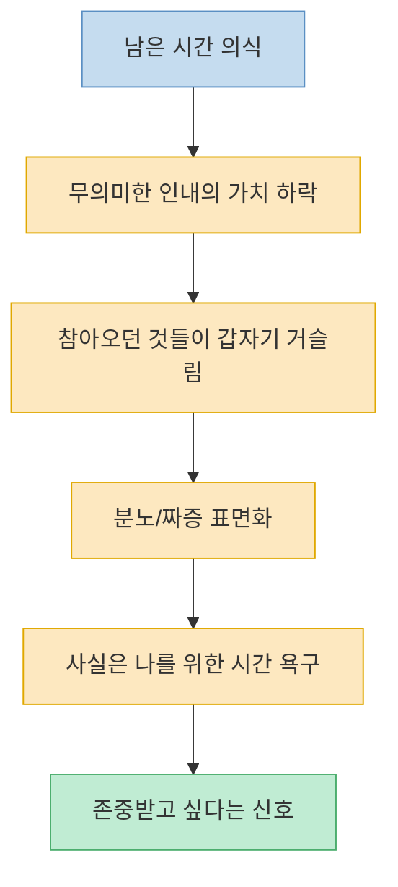
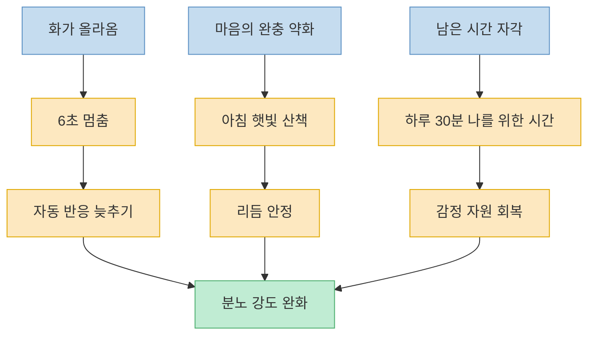

이 영상은 나이가 들수록 작은 일에 더 쉽게 울컥하고 예민해지는 현상을 성격 문제로 보지 않는다. 오히려 감정을 붙잡아 두던 뇌의 브레이크가 약해지고, 평온을 유지하는 완충 장치가 줄어들고, 남은 시간에 대한 감각이 달라지기 때문에 반응이 커질 수 있다고 설명한다. 즉 `왜 이렇게 예민해졌지`라는 자책 대신, **지금 내 안에서 어떤 변화가 일어나고 있는지 이해해 보자** 는 방향이다. 다만 이런 설명이 모든 짜증과 분노를 자연스러운 노화라고만 뜻하는 것은 아니다. 기분 변화가 오래 지속되거나 일상 기능을 해칠 정도라면, 이해만으로 넘기지 말고 전문가 도움을 고려해야 한다.

<!--more-->

## Sources

- [나이 들수록 작은일에 화가 나는 경험 해보셨나요 ? 심리학적으로 풀어드리겠습니다.](https://www.youtube.com/watch?v=9kyO1eJmaMA) — 어른들의심리
- [Older Adults and Mental Health](https://www.nimh.nih.gov/health/topics/older-adults-and-mental-health) — National Institute of Mental Health
- [My Mental Health: Do I Need Help?](https://www.nimh.nih.gov/health/publications/my-mental-health-do-i-need-help) — National Institute of Mental Health
- [Older Adult Mental Health](https://medlineplus.gov/olderadultmentalhealth.html) — MedlinePlus
- [Depression in older adults](https://medlineplus.gov/ency/article/001521.htm) — MedlinePlus Medical Encyclopedia

---

## 첫 번째 설명: 감정을 붙잡아 주던 브레이크가 약해졌다는 느낌

영상은 나이 들수록 짜증이 쉽게 치밀어 오르는 첫 번째 이유로 `전전두엽의 브레이크 기능 약화`를 든다. 이마 뒤쪽의 전전두엽이 화가 올라오는 순간 `잠깐 멈추자`는 신호를 보내는 역할을 한다는 것이다. 예전 같으면 웃고 넘기던 배우자의 말투, 손주의 어수선함, 친구의 습관적인 농담이 어느 날 갑자기 강한 자극처럼 느껴지는 이유를 영상은 여기에 연결한다. [(1:15)](https://youtu.be/9kyO1eJmaMA?t=75), [(1:39)](https://youtu.be/9kyO1eJmaMA?t=99), [(2:31)](https://youtu.be/9kyO1eJmaMA?t=151), [(4:03)](https://youtu.be/9kyO1eJmaMA?t=243)

여기서 중요한 건 영상이 이 변화를 `당신이 나빠졌다`고 읽지 않는다는 점이다. 평생 감정을 잘 참던 사람도, 어느 순간 조절이 잘 안 되는 느낌을 받을 수 있고, 이는 단지 의지력 부족이 아니라 뇌가 같은 자극을 다르게 처리하기 시작한 것일 수 있다고 말한다. 물론 현실의 뇌 변화는 영상처럼 단순한 한 줄 공식만으로 설명되지는 않지만, 적어도 이 비유는 `왜 내가 갑자기 달라졌지`라는 당혹감을 줄여 주는 효과가 있다. [(2:38)](https://youtu.be/9kyO1eJmaMA?t=158), [(3:05)](https://youtu.be/9kyO1eJmaMA?t=185), [(4:24)](https://youtu.be/9kyO1eJmaMA?t=264)

---

## 두 번째 설명: 마음의 완충제가 줄면 같은 자극도 더 아프게 들어온다

영상의 두 번째 축은 세로토닌이다. 세로토닌을 `마음의 안정제` 혹은 완충 장치처럼 설명하면서, 이 시스템이 약해지면 같은 상황도 전보다 훨씬 거슬리고 서럽고 화나게 느껴질 수 있다고 말한다. 마트 계산대에서 잠깐 기다리는 일, 자녀가 전화를 늦게 받는 일, 배우자가 식사 중 휴대폰을 보는 일 같은 소소한 장면이 갑자기 감정의 큰 파도로 번지는 것이다. [(5:00)](https://youtu.be/9kyO1eJmaMA?t=300), [(5:37)](https://youtu.be/9kyO1eJmaMA?t=337), [(6:17)](https://youtu.be/9kyO1eJmaMA?t=377), [(7:01)](https://youtu.be/9kyO1eJmaMA?t=421)

영상은 이 상태를 `자동차 서스펜션이 낡은 것`에 비유한다. 길이 더 험해진 게 아니라 충격을 흡수하는 장치가 약해졌기 때문에 작은 요철도 크게 전달된다는 것이다. 이 비유는 왜 같은 사건에 대한 감정 반응이 나이와 맥락에 따라 달라질 수 있는지를 설명하는 데 유용하다. 실제로 NIMH와 MedlinePlus도 고령층의 정신건강 변화에는 짜증, 공격성, 우울, 에너지 변화 같은 감정 신호가 포함될 수 있다고 안내한다. 다만 이런 감정 변화가 오래 지속되거나 일상 기능을 떨어뜨리면 단순 기분 문제가 아니라 점검이 필요한 신호가 될 수 있다. [NIMH Older Adults and Mental Health](https://www.nimh.nih.gov/health/topics/older-adults-and-mental-health), [MedlinePlus Older Adult Mental Health](https://medlineplus.gov/olderadultmentalhealth.html)

---

## 세 번째 설명: `남은 시간`을 의식하기 시작하면 무의미한 인내가 어려워진다

영상이 가장 인상적으로 다루는 세 번째 원인은 사회정서적 선택 이론이다. 나이가 들수록 사람은 시간이 무한하지 않다는 사실을 더 직접적으로 느끼게 되고, 그래서 불쾌하고 의미 없는 일에 에너지를 덜 쓰려는 방향으로 움직인다는 설명이다. 오래된 친구의 농담, 40년째 이어 온 가족 역할, 배우자의 사소한 무심함이 어느 순간 더 이상 견딜 가치가 없는 것처럼 느껴지는 이유를 영상은 여기에 둔다. [(8:01)](https://youtu.be/9kyO1eJmaMA?t=481), [(8:38)](https://youtu.be/9kyO1eJmaMA?t=518), [(9:12)](https://youtu.be/9kyO1eJmaMA?t=552), [(10:13)](https://youtu.be/9kyO1eJmaMA?t=613)

이 설명이 특별한 이유는 분노를 단지 통제 실패가 아니라 `존중받고 싶다`, `이제는 나를 위해 시간을 쓰고 싶다`는 신호로 재해석하기 때문이다. 영상은 특히 오랫동안 가족을 위해 살았던 사람들에게, 지금의 짜증 속에는 단순한 예민함이 아니라 `이제는 나를 좀 돌보고 싶다`는 간절함이 담겨 있을 수 있다고 말한다. 즉 화가 많아졌다는 사실만 볼 것이 아니라, **그 화가 무엇을 대신 말하고 있는지** 들여다보라는 것이다. [(9:32)](https://youtu.be/9kyO1eJmaMA?t=572), [(10:01)](https://youtu.be/9kyO1eJmaMA?t=601), [(11:01)](https://youtu.be/9kyO1eJmaMA?t=661)

---

## 영상이 제안하는 실전 대응: 6초 멈춤, 아침 햇빛 산책, 나를 위한 30분

영상 후반은 해석에서 끝나지 않고 몇 가지 행동으로 내려온다. 첫째는 `6초 멈춤`이다. 화가 치밀어 오를 때 즉시 반응하지 않고, 마음속으로 짧게 숫자를 세며 시간을 버는 것이다. 영상은 이 짧은 멈춤이 약해진 감정 브레이크를 잠시 대신할 수 있다고 말한다. 둘째는 아침 햇빛을 받으며 걷는 30분 산책이다. 영상은 이를 세로토닌 시스템을 돕는 가장 간단한 방법으로 제시한다. 셋째는 하루 30분이라도 온전히 나를 위한 시간을 만드는 것이다. 음악을 듣거나 조용히 차를 마시는 시간처럼, 남은 시간을 타인만을 위해 쓰지 않겠다는 작은 선언이 감정을 지켜 준다고 설명한다. [(11:57)](https://youtu.be/9kyO1eJmaMA?t=717), [(12:18)](https://youtu.be/9kyO1eJmaMA?t=738), [(12:30)](https://youtu.be/9kyO1eJmaMA?t=750), [(13:13)](https://youtu.be/9kyO1eJmaMA?t=793)

이 조언들은 모두 거창한 해법이라기보다, `반응을 늦추고`, `몸의 리듬을 안정시키고`, `내 시간을 되찾는` 쪽으로 모인다. 분노를 억누르기보다 감정이 올라오는 구조를 조금씩 바꾸는 접근이라고도 볼 수 있다. 특히 냉장고 메모지에 `화가 나면 6초`를 써 붙이는 식의 구체적인 장치는, 감정이 자동으로 터지는 패턴을 끊는 데 유용한 실천 도구로 제시된다. [(13:31)](https://youtu.be/9kyO1eJmaMA?t=811), [(14:01)](https://youtu.be/9kyO1eJmaMA?t=841)

---

## 그런데 언제는 `자연스러운 변화`가 아니라 도움을 받아야 하는 신호일까

여기서 한 가지를 분명히 해야 한다. 나이 들수록 짜증이 늘고 감정이 예민해질 수 있다는 설명이, 모든 문제를 `원래 나이 들면 그래`로 덮어도 된다는 뜻은 아니다. NIMH는 고령층의 정신건강 문제에서 짜증, 분노, 공격성, 에너지 변화, 식욕 변화, 수면 문제, 흥미 저하 같은 신호를 중요하게 본다. 이런 변화가 눈에 띄게 커지거나 일상생활에 영향을 주면 의료진과 상의해야 한다고 안내한다. [NIMH Older Adults and Mental Health](https://www.nimh.nih.gov/health/topics/older-adults-and-mental-health)

또 NIMH의 `Do I Need Help?` 자료와 MedlinePlus의 우울 자료는 슬픔, 짜증, 의욕 저하, 수면 변화, 집중 문제, 무가치감 같은 상태가 2주 이상 지속되거나 일상 기능을 떨어뜨리면 도움을 받아야 한다고 설명한다. 특히 `예전엔 안 그랬는데 너무 쉽게 폭발한다`, `밤잠을 못 잘 정도로 괴롭다`, `관계가 망가질 정도로 공격적이 됐다`, `기분 변화와 함께 기억이나 집중이 크게 달라졌다` 같은 경우는 단순 성격 변화로만 넘기지 않는 편이 좋다. [NIMH Do I Need Help](https://www.nimh.nih.gov/health/publications/my-mental-health-do-i-need-help), [MedlinePlus Depression in older adults](https://medlineplus.gov/ency/article/001521.htm)

즉 영상의 관점이 주는 위로는 `당신이 이상한 게 아니다`라는 데 있다. 그러나 그 위로가 `그러니 아무 조치도 필요 없다`는 뜻은 아니다. 감정을 이해하는 것과 증상을 방치하는 것은 전혀 다른 일이다. 스스로를 덜 탓하되, 오래 지속되거나 기능을 무너뜨리는 신호는 더 빨리 알아차리는 쪽이 진짜 성숙한 대응에 가깝다. [MedlinePlus Older Adult Mental Health](https://medlineplus.gov/olderadultmentalhealth.html)

---

## 핵심 요약

- 영상은 나이 들수록 작은 일에 화가 나는 이유를 `감정 브레이크 약화`, `완충 장치 약화`, `남은 시간 자각`의 세 축으로 설명한다. [(1:15)](https://youtu.be/9kyO1eJmaMA?t=75), [(5:00)](https://youtu.be/9kyO1eJmaMA?t=300), [(8:38)](https://youtu.be/9kyO1eJmaMA?t=518)
- 이 해석의 장점은 분노를 성격 결함이 아니라 이해 가능한 변화의 결과로 읽게 해 준다는 데 있다. [(2:38)](https://youtu.be/9kyO1eJmaMA?t=158), [(11:20)](https://youtu.be/9kyO1eJmaMA?t=680)
- 영상은 실전적으로 6초 멈춤, 아침 햇빛 산책, 하루 30분 나를 위한 시간 만들기를 제안한다. [(11:57)](https://youtu.be/9kyO1eJmaMA?t=717), [(12:18)](https://youtu.be/9kyO1eJmaMA?t=738), [(12:30)](https://youtu.be/9kyO1eJmaMA?t=750)
- 다만 짜증, 분노, 우울, 수면 변화, 흥미 저하, 기능 저하가 오래 지속되면 자연스러운 변화로만 보지 말고 도움을 받아야 한다. [NIMH Older Adults and Mental Health](https://www.nimh.nih.gov/health/topics/older-adults-and-mental-health), [NIMH Do I Need Help](https://www.nimh.nih.gov/health/publications/my-mental-health-do-i-need-help)
- 핵심은 자책을 줄이는 동시에, 증상과 경계 신호를 더 빨리 알아차리는 것이다.

---

## 결론

이 영상은 `나이 들면 왜 이렇게 화가 많아질까`라는 질문에 꽤 따뜻한 답을 준다. 그것은 단순히 인격이 거칠어졌기 때문이 아니라, 뇌와 감정, 시간 감각이 동시에 바뀌는 과정에서 생기는 자연스러운 흔들림일 수 있다는 것이다. 이 설명만으로도 많은 사람에게는 큰 위로가 된다. [(0:31)](https://youtu.be/9kyO1eJmaMA?t=31), [(11:01)](https://youtu.be/9kyO1eJmaMA?t=661)

하지만 진짜 중요한 건 그 다음이다. 그 흔들림을 이해한 뒤에, 멈추고, 걷고, 나를 위한 시간을 만들고, 필요하면 도움을 구하는 쪽으로 한 걸음 옮기는 것이다. 감정을 무조건 참는 시대는 지나갔다. 이제는 감정을 읽고 다루는 방식이 더 중요하다. [NIMH Do I Need Help](https://www.nimh.nih.gov/health/publications/my-mental-health-do-i-need-help), [Older Adult Mental Health](https://medlineplus.gov/olderadultmentalhealth.html)
