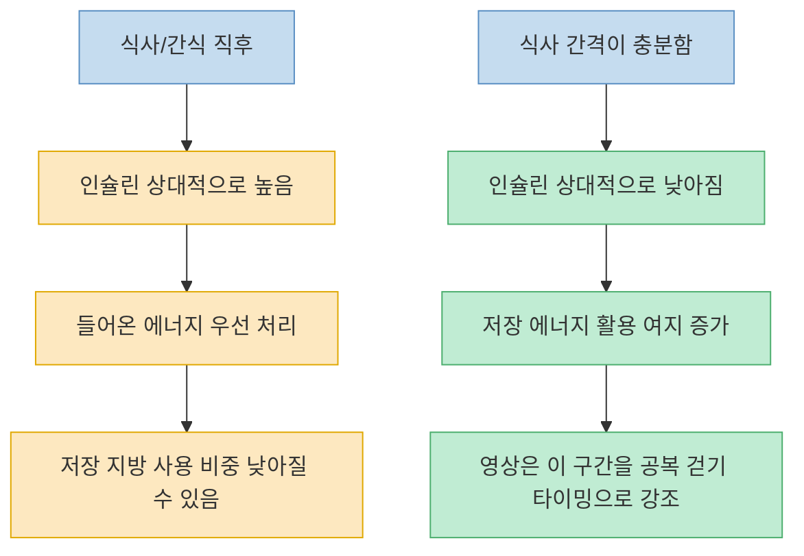
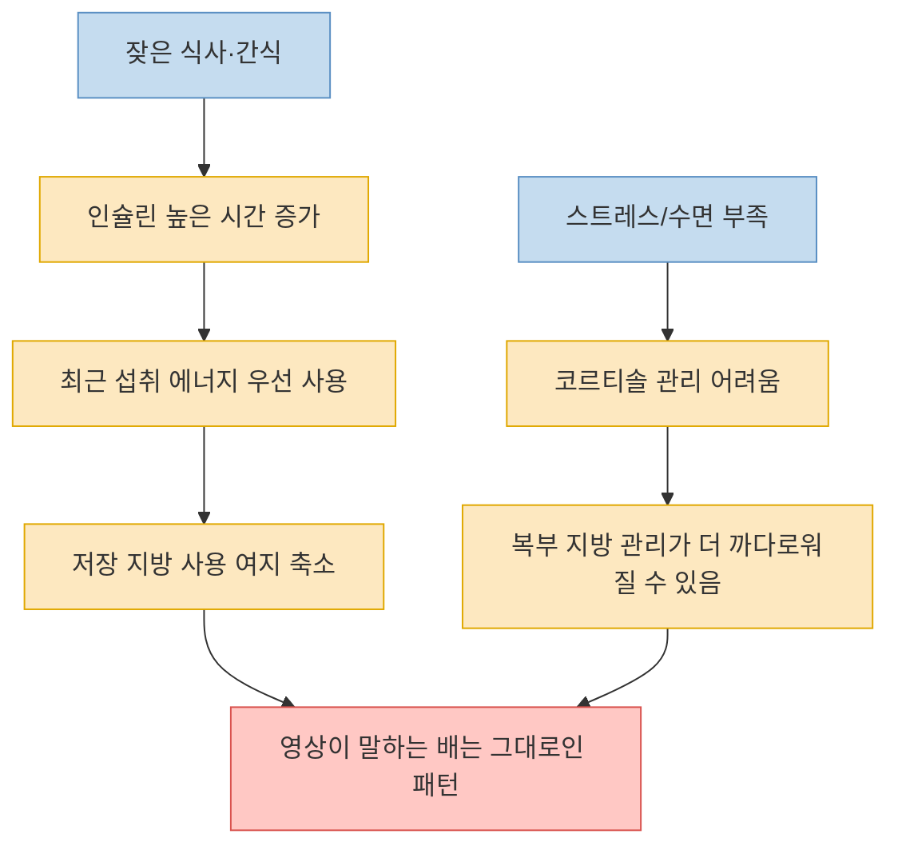
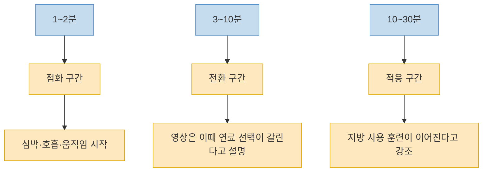
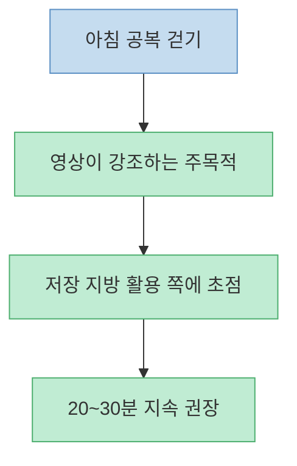
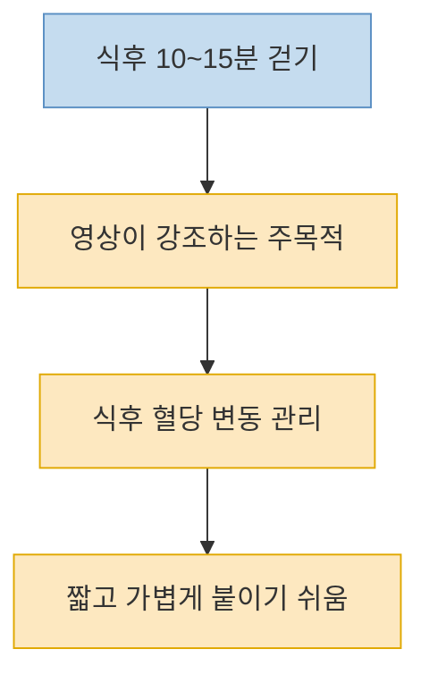
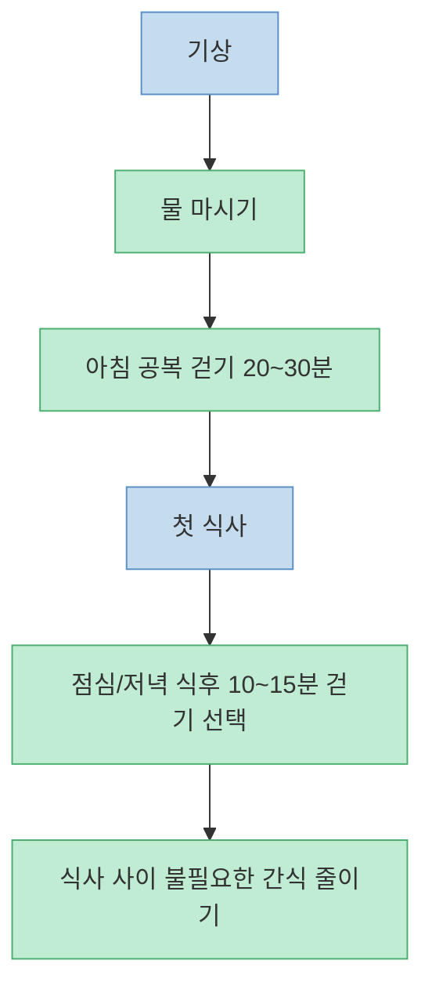
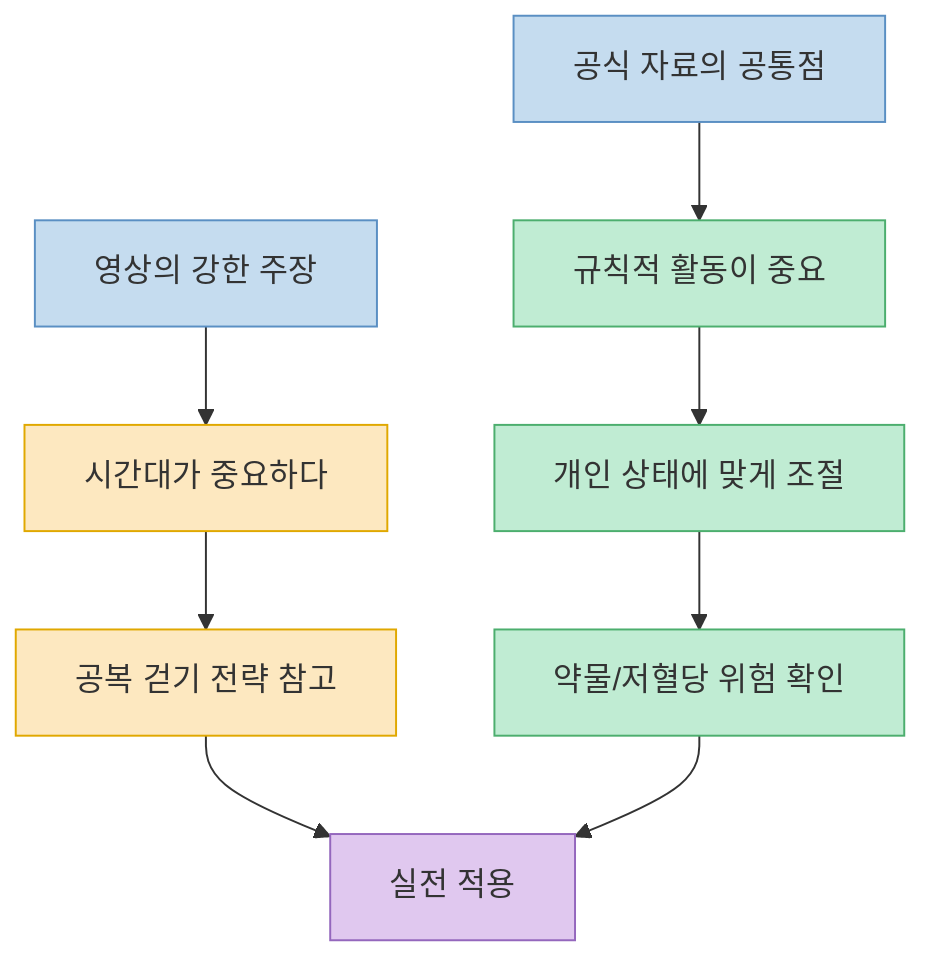

이 영상의 핵심 메시지는 단순하다. **만 보를 걷는지보다 언제 걷는지가 복부 지방에는 더 중요하다** 는 것이다. 영상은 특히 아침 공복 걷기를 복부 지방 연소에 가장 유리한 시간대로 강조하고, 식후 걷기는 혈당 관리에는 좋지만 목적이 다르다고 구분한다. 다만 이런 설명은 이해를 돕기 위해 대사를 꽤 단순화한 표현도 섞여 있다. 그래서 이 글에서는 영상의 주장을 그대로 옮기기보다, 어떤 부분은 영상의 해석으로 읽어야 하고 어떤 부분은 공식 자료로도 비교적 넓게 뒷받침되는지 나눠서 보려고 한다.

<!--more-->

## Sources

- [효과적인 복부 지방 제거를 위해 반드시 피해야 할 최악의 걷기 시간대는 언제일까요? (당신도 모르게 매일 반복하고 있을지 모릅니다)](https://www.youtube.com/watch?v=oC5-H2N6SYs) — 똑똑한비움TV
- [About Insulin Resistance and Type 2 Diabetes](https://www.cdc.gov/diabetes/about/insulin-resistance-type-2-diabetes.html) — CDC
- [Healthy Living with Diabetes](https://www.niddk.nih.gov/health-information/diabetes/overview/healthy-living-with-diabetes) — NIDDK
- [Blood Glucose and Exercise](https://diabetes.org/health-wellness/fitness/blood-glucose-and-exercise) — American Diabetes Association
- [Stepping Up to Diabetes—The Power of Walking](https://diabetes.org/health-wellness/fitness/diabetes-walking-plan) — American Diabetes Association
- [Walking for health](https://www.nhs.uk/live-well/exercise/walking-for-health/) — NHS

---

## 왜 많이 걸어도 배가 그대로일 수 있다고 영상은 말할까

영상은 `걸었다`는 사실만으로는 부족하다고 말한다. 핵심은 지금 몸이 **들어온 에너지부터 처리하는 상태인지**, 아니면 **저장된 에너지까지 끌어다 쓸 수 있는 상태인지** 다. 영상은 이 차이를 인슐린으로 설명한다. 식사나 간식 뒤에는 인슐린이 높아져 있어서 몸이 먼저 혈중 포도당을 처리하려 하고, 이때는 저장 지방, 특히 복부 지방을 꺼내 쓰는 흐름이 약해진다는 식이다. 그래서 같은 30분 걷기라도 언제 하느냐에 따라 체감이 다를 수 있다고 본다. [(0:12)](https://youtu.be/oC5-H2N6SYs?t=12), [(1:22)](https://youtu.be/oC5-H2N6SYs?t=82), [(2:11)](https://youtu.be/oC5-H2N6SYs?t=131)

이 설명은 방향 자체는 이해하기 쉽다. 실제로 CDC는 신체 활동이 인슐린 감수성을 높이는 데 도움이 된다고 설명하고, ADA도 운동 중과 운동 후에 근육이 포도당을 더 잘 사용하게 된다고 안내한다. 다만 여기서 바로 `그래서 공복 걷기가 모두에게 절대적으로 최고다`라고 단정하면 너무 멀리 나간다. 공식 자료는 대체로 **규칙적인 신체 활동 자체의 이점** 과 **개인 상태에 따른 식사·운동 타이밍 조절** 을 강조하지, 단일 시간대를 보편 정답으로 찍지는 않는다. [CDC](https://www.cdc.gov/diabetes/about/insulin-resistance-type-2-diabetes.html), [ADA](https://diabetes.org/health-wellness/fitness/blood-glucose-and-exercise), [NIDDK](https://www.niddk.nih.gov/health-information/diabetes/overview/healthy-living-with-diabetes)

---

## 영상이 설명하는 핵심 메커니즘: 인슐린, 코르티솔, 그리고 복부 지방

영상은 인슐린을 `지방 창고를 잠그는 경비원`처럼 묘사한다. 인슐린이 높을수록 몸은 지금 당장 필요한 연료를 혈당과 최근 식사에서 먼저 가져오고, 저장 지방은 뒤로 밀린다는 설명이다. 이어서 코르티솔까지 높아지는 상황이 겹치면 복부 지방, 특히 내장지방 쪽으로 불리하게 작용할 수 있다고 말한다. 즉 많이 먹고, 자주 간식 먹고, 스트레스가 높은 상태에서 걷기까지 애매한 타이밍에 하면 `걷기는 했는데 배는 안 빠지는` 패턴이 반복될 수 있다는 이야기다. [(2:20)](https://youtu.be/oC5-H2N6SYs?t=140), [(3:34)](https://youtu.be/oC5-H2N6SYs?t=214), [(4:24)](https://youtu.be/oC5-H2N6SYs?t=264)

이 부분은 큰 틀에서는 납득할 만하지만, 영상식 비유를 그대로 생리학 공식처럼 받아들이면 안 된다. 복부 지방 변화는 총 활동량, 식사량, 수면, 스트레스, 약물, 호르몬 상태가 함께 얽혀 생긴다. NIDDK도 체중과 혈당 관리는 식사, 활동, 수면, 다른 건강 상태를 함께 봐야 한다고 설명한다. 따라서 `인슐린이 높으면 지방 연소 0`, `코르티솔이 오르면 복부 지방 직행` 같은 식의 직선적인 이해보다는, **에너지 사용 환경이 저장에 불리하거나 유리하게 기울 수 있다** 정도로 읽는 편이 더 안전하다. [NIDDK](https://www.niddk.nih.gov/health-information/diabetes/overview/healthy-living-with-diabetes)

---

## 1분, 10분, 30분: 영상이 그리는 걷기 연소 시나리오

영상은 걷기를 세 구간으로 나눈다. 첫 1~2분은 몸이 `움직이기 시작했다`고 인식하는 점화 구간, 3~10분은 어떤 연료를 더 많이 쓸지 방향이 갈리는 전환 구간, 10~30분은 지방 사용 훈련이 본격화되는 적응 구간이라는 설명이다. 그래서 영상은 **짧게 몇 분 걷고 끝내는 것보다 최소 20~30분은 이어 가야 한다** 고 강조한다. [(5:02)](https://youtu.be/oC5-H2N6SYs?t=302), [(5:39)](https://youtu.be/oC5-H2N6SYs?t=339), [(6:21)](https://youtu.be/oC5-H2N6SYs?t=381)

이 구분은 교육용 프레임으로는 유용하다. 다만 공식 자료는 이렇게 분 단위로 지방 연소 스위치를 칼같이 나누지 않는다. 대신 NIDDK는 중등도 활동을 주당 150분 정도 권하고, NHS는 빠른 10분 걷기처럼 작은 단위로 쪼개도 건강 이점이 있다고 설명한다. 즉 **복부 지방을 노린 공복 걷기 루틴** 을 만들고 싶다면 영상의 20~30분 제안을 참고할 수 있지만, 그보다 짧은 걷기가 무의미하다고 볼 필요는 없다. 건강과 혈당 측면에서는 짧은 걷기에도 분명한 역할이 있다. [NIDDK](https://www.niddk.nih.gov/health-information/diabetes/overview/healthy-living-with-diabetes), [NHS](https://www.nhs.uk/live-well/exercise/walking-for-health/)

---

## 공복 걷기와 식후 걷기는 목적이 다르다는 구분

영상이 가장 분명하게 선을 긋는 대목이 여기다. 아침 공복 걷기는 `저장 지방을 직접 꺼내 쓰는 쪽`에 더 가깝고, 식후 10~15분 걷기는 `식후 혈당 변동을 완만하게 하는 쪽`에 더 가깝다고 설명한다. 그래서 둘 중 하나를 고르기보다, 목적을 나눠 둘 다 활용하라고 제안한다. 아침에는 물만 마시고 20~30분 공복 걷기, 점심이나 저녁 뒤에는 10~15분 가볍게 걷는 식이다. [(9:00)](https://youtu.be/oC5-H2N6SYs?t=540), [(10:07)](https://youtu.be/oC5-H2N6SYs?t=607), [(11:01)](https://youtu.be/oC5-H2N6SYs?t=661)

이 구분은 공식 자료와도 어느 정도 접점이 있다. ADA는 걷기를 하루 여러 조각으로 나눠도 좋다고 설명하고, 활동이 혈당 목표 달성에 도움이 될 수 있다고 안내한다. NIDDK 역시 신체 활동의 이점으로 혈당, 혈압, 체중, 기분 개선을 함께 든다. 다만 `공복 걷기만이 지방 감량의 정답`이라는 식으로 받아들이기보다, **공복 걷기는 한 전략이고 식후 걷기는 혈당 관리 측면에서 특히 실용적일 수 있다** 정도로 정리하는 편이 균형에 가깝다. [ADA Walking Plan](https://diabetes.org/health-wellness/fitness/diabetes-walking-plan), [NIDDK](https://www.niddk.nih.gov/health-information/diabetes/overview/healthy-living-with-diabetes)

---

## 실전 적용: 아침 20~30분, 간식 줄이기, 너무 힘들지 않은 강도

영상은 실천법도 꽤 구체적이다. 첫째, 아침에 일어나 물을 마신 뒤 20~30분 정도 걷는다. 둘째, 식사 사이에 계속 뭔가를 집어먹는 습관을 줄여 인슐린이 내려갈 시간을 확보한다. 셋째, 강도는 너무 세지 않게 한다. 옆 사람과 대화하거나 가볍게 흥얼거릴 수 있을 정도의 속도가 좋고, 지나치게 몰아붙이면 코르티솔이 올라가 복부 지방 감량 목적에는 덜 맞을 수 있다고 본다. [(10:00)](https://youtu.be/oC5-H2N6SYs?t=600), [(10:28)](https://youtu.be/oC5-H2N6SYs?t=628), [(11:39)](https://youtu.be/oC5-H2N6SYs?t=699), [(13:20)](https://youtu.be/oC5-H2N6SYs?t=800)

여기서 공식 자료와 맞닿는 부분은 `무리하지 않는 꾸준한 걷기`다. NHS는 brisk walking을 `말은 할 수 있지만 노래는 어려운 정도`로 설명하고, ADA도 천천히 시작해서 점차 brisk walk로 올리라고 안내한다. 반면 `물, 블랙커피, 허브티만 허용`, `반드시 4~5시간 간식 금지`, `강도를 조금만 높여도 복부 지방 감량에 불리` 같은 부분은 영상의 실전 팁으로 이해하는 편이 낫다. 특히 당뇨 약을 쓰거나 저혈당 위험이 있는 사람은 공복 운동과 식사 타이밍을 의료진과 상의해야 한다고 NIDDK와 ADA가 분명히 말한다. [NHS](https://www.nhs.uk/live-well/exercise/walking-for-health/), [ADA Blood Glucose and Exercise](https://diabetes.org/health-wellness/fitness/blood-glucose-and-exercise), [NIDDK](https://www.niddk.nih.gov/health-information/diabetes/overview/healthy-living-with-diabetes)

---

## 이 영상을 실제 원칙으로 바꿀 때 꼭 남겨야 할 단서

이 영상은 `언제 걷느냐`에 초점을 잘 맞춘다. 그래서 막연하게 운동량만 늘리던 사람에게는 꽤 실용적인 힌트를 준다. 특히 아침 공복 걷기와 식후 걷기의 목적을 나눠 생각하게 만든다는 점은 유용하다. 하지만 공식 자료 기준으로는, 가장 안전한 결론은 `하나의 절대 시간대`가 아니라 **꾸준한 걷기, 개인 상태에 맞는 식사-운동 조절, 그리고 저혈당 위험 관리** 다. [CDC](https://www.cdc.gov/diabetes/about/insulin-resistance-type-2-diabetes.html), [NIDDK](https://www.niddk.nih.gov/health-information/diabetes/overview/healthy-living-with-diabetes)

특히 인슐린을 쓰거나 혈당강하제를 복용하는 사람, 공복에 어지럼이나 두근거림이 있는 사람, 임신 중이거나 다른 대사 질환이 있는 사람은 `아침 공복 걷기`를 무조건 따라 하기보다 먼저 안전을 확인하는 편이 좋다. 영상의 메시지를 한 문장으로 줄이면 이렇다. **걷기 자체도 중요하지만, 배를 줄이고 싶다면 몸이 어떤 연료 상태에 있는지까지 같이 보라** 는 것이다. 다만 그 해석을 실전으로 옮길 때는 내 몸의 반응과 공식 가이드를 함께 놓고 보는 균형이 필요하다.

---

## 핵심 요약

- 영상은 `얼마나 걷느냐`보다 `언제 걷느냐`가 복부 지방에 더 중요하다고 주장한다. [(0:12)](https://youtu.be/oC5-H2N6SYs?t=12), [(9:00)](https://youtu.be/oC5-H2N6SYs?t=540)
- 핵심 설명은 인슐린이 높을 때는 최근 섭취한 에너지를 먼저 처리하고, 공복에 가까울수록 저장 지방 활용 여지가 커진다는 구조다. [(1:22)](https://youtu.be/oC5-H2N6SYs?t=82), [(2:20)](https://youtu.be/oC5-H2N6SYs?t=140)
- 영상은 아침 공복 걷기 20~30분을 복부 지방 전략으로, 식후 10~15분 걷기를 혈당 관리 전략으로 구분한다. [(10:07)](https://youtu.be/oC5-H2N6SYs?t=607), [(11:01)](https://youtu.be/oC5-H2N6SYs?t=661)
- 공식 자료도 신체 활동이 인슐린 감수성과 혈당 관리에 도움이 된다는 점은 뒷받침하지만, 특정 시간대 하나를 모두에게 절대 정답으로 제시하지는 않는다. [CDC](https://www.cdc.gov/diabetes/about/insulin-resistance-type-2-diabetes.html), [ADA](https://diabetes.org/health-wellness/fitness/blood-glucose-and-exercise), [NIDDK](https://www.niddk.nih.gov/health-information/diabetes/overview/healthy-living-with-diabetes)
- 따라서 이 영상은 `공복 걷기라는 전략`을 제안하는 자료로 읽되, 약물 복용 여부와 저혈당 위험, 개인 컨디션을 함께 봐야 한다.

---

## 결론

이 영상이 던지는 가장 실용적인 질문은 `오늘 몇 걸음 걸었는가`보다 `언제 걸었는가`다. 복부 지방이 잘 안 줄어 답답한 사람에게는 이 질문 하나만으로도 루틴을 다시 설계할 계기가 된다. [(13:20)](https://youtu.be/oC5-H2N6SYs?t=800)

다만 최종 결론은 조금 더 차분해야 한다. 공복 걷기는 분명 시도해 볼 만한 전략이지만, 누구에게나 유일한 정답은 아니다. 꾸준히 걷고, 식사와 간식 패턴을 정리하고, 내 몸이 공복 운동을 안전하게 받아들이는지 확인하는 것까지 함께 가야 진짜로 오래 가는 복부 지방 관리 루틴이 된다.
