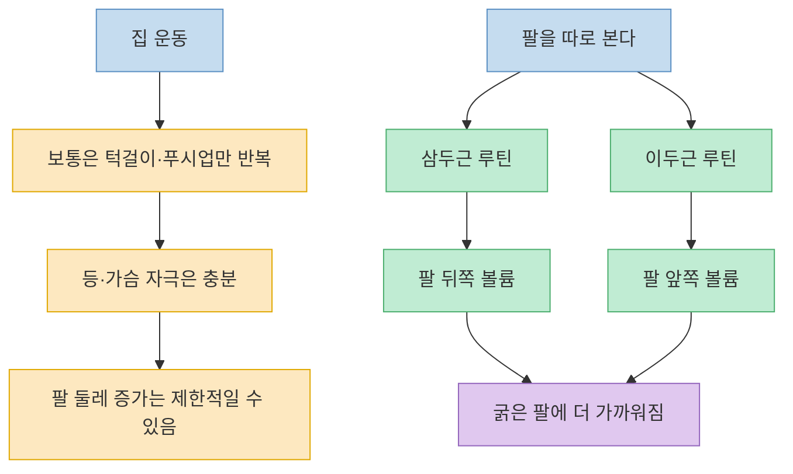
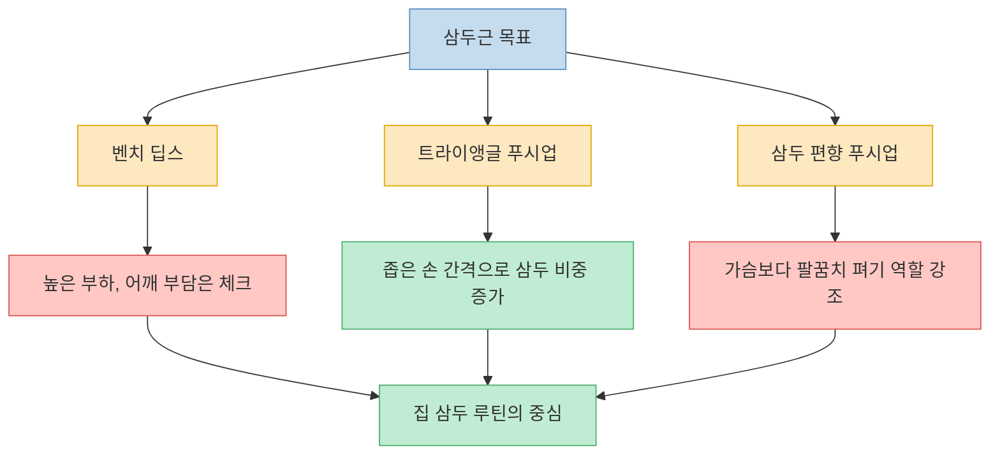
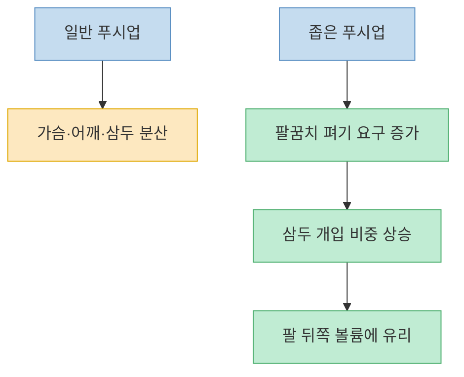
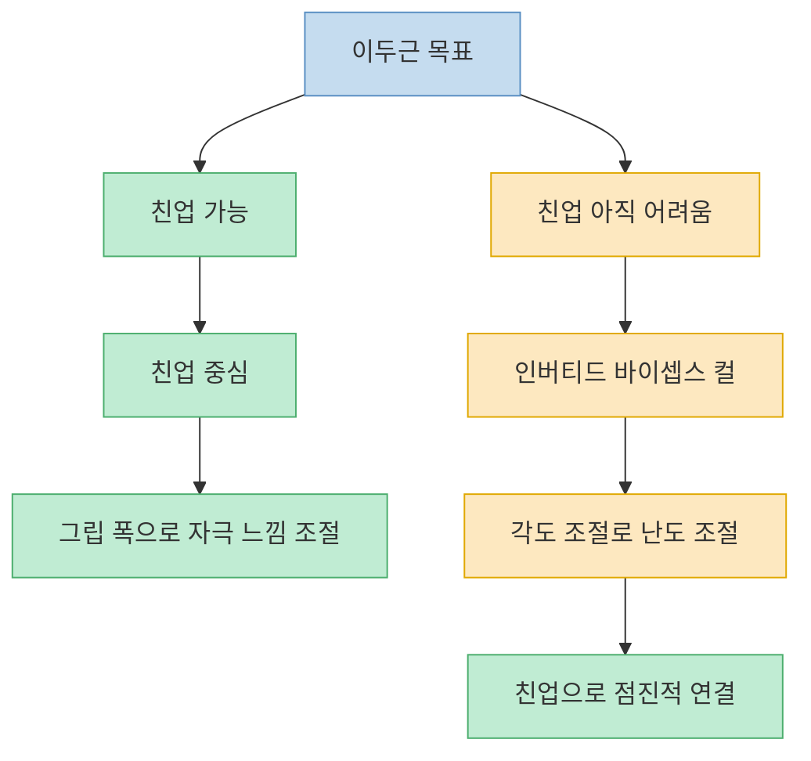
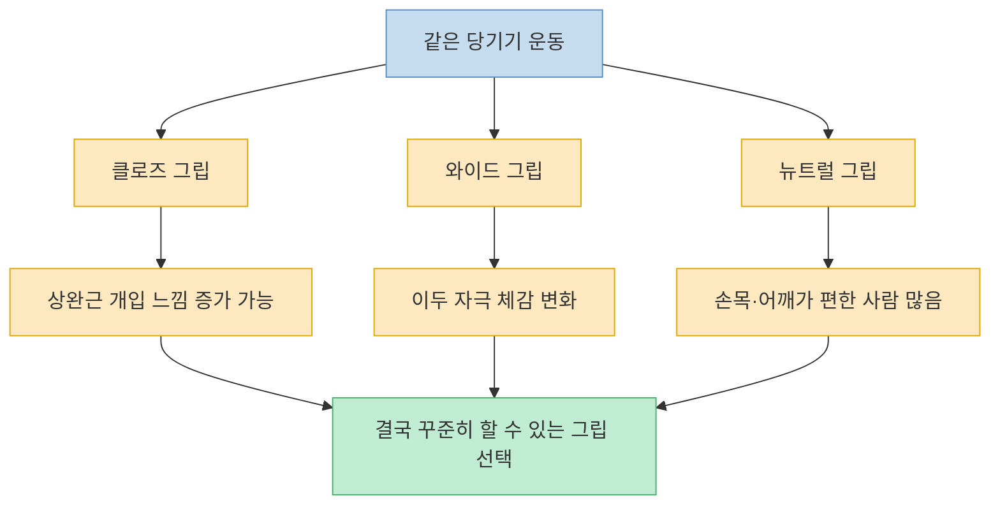
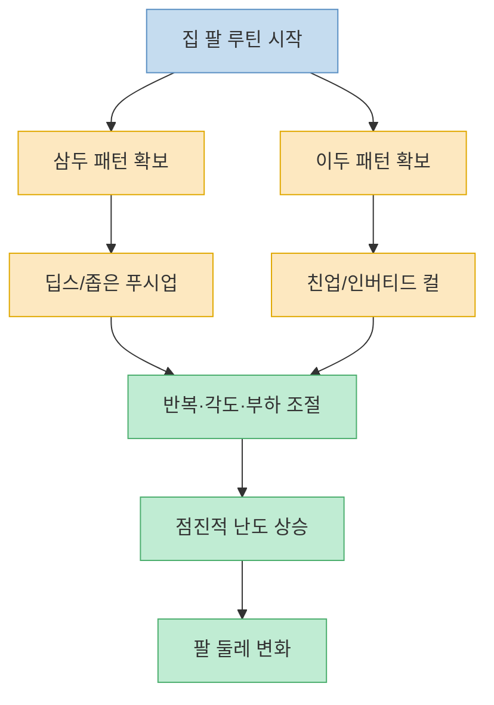

이 영상은 `집에서는 팔 굵기 만들기 어렵다`는 인식을 정면으로 뒤집는다. 핵심은 장비 부족이 아니라 **팔을 그냥 통째로 보지 말고 삼두근과 이두근으로 나눠 자극하라** 는 데 있다. 영상은 맨몸 운동이라고 해서 턱걸이와 푸시업만 떠올리면 팔 성장 기회를 놓치기 쉽다고 말하고, 특히 팔 둘레를 좌우하는 큰 근육인 삼두근과 이두근을 겨냥하는 운동을 따로 정리한다. 다만 영상 속 `근전도 1위`, `가장 효과적` 같은 표현은 맥락을 조금 단순화한 면도 있다. 그래서 이 글에서는 영상의 운동 선택 논리를 따라가되, 최신 운동과학 자료와 함께 어디까지를 강한 힌트로 보고 어디서부터는 개인 적용이 필요한지 같이 정리해 보겠다.

<!--more-->

## Sources

- [과학으로 입증된 집에서도 '굵은 팔' 만드는 최고의 방법 !!](https://www.youtube.com/watch?v=5u6M2grF9i0) — 시금치맨 운동상식
- [ACSM Unveils Landmark 2026 Resistance Training Guidelines — First Update in 17 Years](https://acsm.org/resistance-training-guidelines-update-2026/) — ACSM
- [ACE Study Identifies Best Triceps Exercises](https://www.acefitness.org/certifiednewsarticle/3008/ace-study-identifies-best-triceps-exercises/) — ACE
- [Selective Activation of Shoulder, Trunk, and Arm Muscles: A Comparative Analysis of Different Push-Up Variants](https://pmc.ncbi.nlm.nih.gov/articles/PMC4732391/) — PMC
- [Effect of the push-up exercise at different palmar width on muscle activities](https://pmc.ncbi.nlm.nih.gov/articles/PMC4792988/) — PMC
- [Electromyographical Comparison of a Traditional, Suspension Device, and Towel Pull-Up](https://pmc.ncbi.nlm.nih.gov/articles/PMC5548150/) — PMC

---

## 팔 굵기는 결국 삼두근과 이두근을 얼마나 따로 챙기느냐에서 갈린다

영상은 시작부터 `맨몸 운동은 등과 가슴 위주`라는 고정관념을 짚는다. 턱걸이와 푸시업이 너무 유명하다 보니, 집에서는 등과 가슴 말고는 키우기 어렵다고 생각하는 사람이 많다는 것이다. 하지만 팔 둘레를 키우려면 결국 가장 큰 비중을 차지하는 삼두근과 이두근을 직접 노려야 한다고 말한다. 특히 초반에 `굵은 팔을 만들기 위해서는 삼두근과 이두근이 가장 큰 근육들이기 때문에 이 두 가지가 가장 중요하다`고 바로 방향을 잡아 준다. [(0:10)](https://youtu.be/5u6M2grF9i0?t=10), [(0:18)](https://youtu.be/5u6M2grF9i0?t=18), [(0:30)](https://youtu.be/5u6M2grF9i0?t=30)

이 포인트는 최신 가이드와도 잘 맞는다. ACSM은 2026 업데이트에서 특별한 장비보다 **지속 가능한 저항운동 참여 자체** 가 더 중요하다고 정리했고, 바벨·밴드·맨몸 모두 결과를 만들 수 있다고 설명한다. 즉 집이라는 환경 자체가 문제가 아니라, **어떤 패턴으로 저항을 걸고 얼마나 꾸준히 진행하느냐** 가 더 중요하다. 영상이 말하는 `팔 전용 맨몸 루틴`의 의미도 바로 여기에 있다. [ACSM](https://acsm.org/resistance-training-guidelines-update-2026/)

---

## 삼두근 파트: 벤치 딥스, 트라이앵글 푸시업, 그리고 삼두 편향 푸시업

영상은 삼두근 파트를 먼저 다룬다. 자막 기준으로는 `2000년대에 진행된 삼두근 근전도 실험`을 인용하면서 벤치 딥스의 활성도가 높게 나왔고, 이어서 벤치 딥스가 빠진 다른 비교에서는 트라이앵글 푸시업이 매우 강한 삼두 자극을 보였다고 설명한다. 그리고 어깨 관절 움직임을 줄이고 팔꿈치 펴기 패턴을 더 강조하는 푸시업 변형까지 묶어서, 집에서 삼두를 키우려면 이 세 축을 위주로 가져가라고 정리한다. [(0:33)](https://youtu.be/5u6M2grF9i0?t=33), [(0:39)](https://youtu.be/5u6M2grF9i0?t=39), [(1:07)](https://youtu.be/5u6M2grF9i0?t=67), [(1:23)](https://youtu.be/5u6M2grF9i0?t=83), [(1:40)](https://youtu.be/5u6M2grF9i0?t=100)

영상의 방향은 바깥 자료와도 크게 어긋나지 않는다. ACE의 고전 EMG 비교에서는 triangle push-up이 삼두 활성에서 가장 높은 쪽으로 나왔고, dips도 상위권이었다. 또 PMC에 공개된 푸시업 변형 연구들 역시 좁은 손 간격이 넓은 간격보다 삼두 개입을 높이는 경향을 보여 준다. 즉 영상의 핵심 메시지는 `푸시업을 아무렇게나 하는 것`보다 **손 간격을 좁히고 팔꿈치 펴기 역할을 분명히 하는 변형** 으로 가야 삼두 비중이 올라간다는 것이다. [ACE](https://www.acefitness.org/certifiednewsarticle/3008/ace-study-identifies-best-triceps-exercises/), [Push-Up Variants](https://pmc.ncbi.nlm.nih.gov/articles/PMC4732391/), [Palmar Width Study](https://pmc.ncbi.nlm.nih.gov/articles/PMC4792988/)

다만 벤치 딥스는 한 가지 단서를 붙여 읽는 편이 좋다. 활성도가 높다고 해서 모든 사람에게 가장 안전한 선택이라는 뜻은 아니다. ACE도 벤치 딥스는 어깨 전면에 부담이 갈 수 있다고 짚는다. 그래서 영상처럼 `효율`을 볼 수는 있어도, 어깨가 불편한 사람은 깊이를 줄이거나 손 위치를 조정하거나 다른 좁은 푸시업 변형으로 바꾸는 판단이 필요하다.

---

## 왜 좁은 푸시업이 팔을 두껍게 만드는 데 유리하다고 볼 수 있을까

이 부분은 영상을 이해할 때 꽤 중요하다. 트라이앵글 푸시업이나 좁은 손 간격 푸시업은 겉보기에는 가슴 운동처럼 보이지만, 실제로는 팔꿈치를 펴는 역할을 삼두가 더 강하게 맡게 만든다. 영상이 `가슴 자극은 줄고 삼두에 더 집중된다`고 설명하는 이유가 바로 여기 있다. [(1:12)](https://youtu.be/5u6M2grF9i0?t=72), [(1:25)](https://youtu.be/5u6M2grF9i0?t=85), [(1:31)](https://youtu.be/5u6M2grF9i0?t=91)

학술 자료 쪽에서도 비슷한 방향이 보인다. 좁은 베이스 푸시업은 넓은 베이스보다 triceps brachii 활성도가 더 높았고, 손 간격을 50% 수준으로 좁힌 푸시업도 중립·넓은 간격보다 삼두 활동이 높게 보고됐다. 이 말은 `푸시업 자체가 팔 운동이다`라기보다, **푸시업을 어떻게 변형하느냐에 따라 팔 운동에 가까워질 수 있다** 는 뜻이다. 집에서 장비 없이 삼두를 키우려면 바로 이런 미세 조정이 중요해진다. [Push-Up Variants](https://pmc.ncbi.nlm.nih.gov/articles/PMC4732391/), [Palmar Width Study](https://pmc.ncbi.nlm.nih.gov/articles/PMC4792988/)

---

## 이두근 파트: 친업이 중심이고, 초보자는 인버티드 바이셉스 컬로 내려오면 된다

영상 후반은 이두근으로 넘어간다. 여기서 가장 중요한 문장은 `맨몸운동 중에서 유일하게 친업이 다른 기구 운동들과 경쟁할 정도였다`는 취지의 설명이다. 즉 순수 고립 컬류만큼 완벽하게 이두만 꽂아 주는 운동은 아니지만, 맨몸 범주 안에서는 친업이 상당히 강한 선택지라는 것이다. 그래서 영상은 친업을 이두근의 핵심 운동으로 놓고, 초보자나 난도가 부담스러운 사람에게는 인버티드 바이셉스 컬을 대안으로 제시한다. [(1:51)](https://youtu.be/5u6M2grF9i0?t=111), [(1:54)](https://youtu.be/5u6M2grF9i0?t=114), [(2:08)](https://youtu.be/5u6M2grF9i0?t=128), [(2:39)](https://youtu.be/5u6M2grF9i0?t=159), [(2:46)](https://youtu.be/5u6M2grF9i0?t=166)

이 논리는 실제 데이터와도 연결된다. Pull-up 변형 비교 연구에서는 전통적 풀업, 서스펜션 풀업, 타월 풀업 사이에서 biceps brachii 활성 차이가 크지 않았고, 영상 말미에 언급되는 neutral-grip pull-up 계열도 실전적으로 충분한 선택지가 될 수 있음을 시사한다. 중요한 건 `어떤 도구가 더 힙한가`가 아니라, **당신이 안정적으로 반복할 수 있는 당기기 패턴을 확보하느냐** 다. 친업이 가능하면 친업이 중심이고, 아직 어렵다면 몸 각도를 조절한 인버티드 컬·로우 계열로 내려와 점진적으로 난도를 올리는 방식이 더 현실적이다. [Pull-Up EMG](https://pmc.ncbi.nlm.nih.gov/articles/PMC5548150/)

---

## 그립 폭과 그립 방향은 `어느 부위를 더 느끼는가`를 바꾸는 조절 장치에 가깝다

영상은 친업의 그립 폭에 따라 자극 포인트가 달라진다고 설명한다. 자막이 자동 생성이라 일부 단어가 깨져 있지만, 큰 흐름은 분명하다. 클로즈 그립과 와이드 그립이 상완근·이두근 안쪽 느낌을 조금 다르게 만들 수 있고, 뒤쪽에서는 neutral-grip pull-up이나 commando pull-up 계열도 언급한다. 즉 영상은 `이두 운동 = 친업 하나`로 끝내지 않고, **그립을 바꿔 자극 배치를 조정하라** 는 식으로 확장한다. [(2:15)](https://youtu.be/5u6M2grF9i0?t=135), [(2:20)](https://youtu.be/5u6M2grF9i0?t=140), [(2:31)](https://youtu.be/5u6M2grF9i0?t=151), [(2:56)](https://youtu.be/5u6M2grF9i0?t=176)

여기서 기억할 점은 `특정 그립 하나가 무조건 최고`라기보다, 그립 차이가 운동 난이도와 체감 부위를 바꿀 수 있다는 것이다. 실제 pull-up 변형 연구에서도 큰 차이가 없거나 제한적인 차이가 나오기 때문에, 일반 사용자에게 더 중요한 것은 완벽한 그립을 찾는 일보다 **통증 없이, 반동 없이, 충분한 반복을 할 수 있는 그립을 정하는 것** 에 가깝다. 영상의 neutral-grip 권장은 그래서 실전적이다. 손목과 어깨 부담이 상대적으로 덜하고, 당기기 패턴을 안정적으로 쌓기 쉬운 사람도 많기 때문이다.

---

## 결국 집 팔 루틴은 `무게`보다 `패턴`과 `점진적 난도 조절`이 핵심이다

영상이 좋은 이유는 복잡한 루틴을 제시하지 않기 때문이다. 삼두는 벤치 딥스, 트라이앵글 푸시업, 삼두 편향 푸시업. 이두는 친업, 인버티드 바이셉스 컬, 뉴트럴 그립 풀업 계열. 즉 집에서는 덤벨이 없더라도 **밀기에서 삼두를, 당기기에서 이두를 선명하게 분리하는 패턴** 만 확보하면 된다. [(1:38)](https://youtu.be/5u6M2grF9i0?t=98), [(1:47)](https://youtu.be/5u6M2grF9i0?t=107), [(2:39)](https://youtu.be/5u6M2grF9i0?t=159), [(2:56)](https://youtu.be/5u6M2grF9i0?t=176)

최신 ACSM 가이드도 결국 비슷한 말을 한다. 근비대 관점에서는 너무 복잡한 장비나 주기화보다 **주당 충분한 세트 수, 지속적인 참여, 점진적 난도 증가** 가 더 중요하다고 본다. 집 루틴으로 옮기면 이렇게 해석할 수 있다. 같은 반복수를 더 깔끔하게 한다, 발 높이를 올린다, 몸 각도를 더 눕힌다, 쉬는 시간을 줄인다, 가방이나 밴드로 저항을 추가한다. 즉 `맨몸이라 한계가 있다`가 아니라, **맨몸이라도 난도를 올리는 방법을 설계해야 한다** 가 더 정확하다. [ACSM](https://acsm.org/resistance-training-guidelines-update-2026/)

---

## 핵심 요약

- 영상은 굵은 팔의 핵심을 `삼두근 + 이두근을 따로 공략하는 것`으로 정리한다. [(0:18)](https://youtu.be/5u6M2grF9i0?t=18), [(0:30)](https://youtu.be/5u6M2grF9i0?t=30)
- 삼두근 쪽에서는 벤치 딥스, 트라이앵글 푸시업, 삼두 편향 푸시업을 핵심으로 제시한다. [(0:39)](https://youtu.be/5u6M2grF9i0?t=39), [(1:07)](https://youtu.be/5u6M2grF9i0?t=67), [(1:40)](https://youtu.be/5u6M2grF9i0?t=100)
- 바깥 연구도 좁은 푸시업이 넓은 푸시업보다 삼두 활성에 유리할 수 있음을 뒷받침한다. [ACE](https://www.acefitness.org/certifiednewsarticle/3008/ace-study-identifies-best-triceps-exercises/), [PMC Push-Up Variants](https://pmc.ncbi.nlm.nih.gov/articles/PMC4732391/)
- 이두근 쪽에서는 친업이 중심이고, 초보자는 인버티드 바이셉스 컬로 난도를 낮춰 접근하는 흐름이 좋다. [(1:54)](https://youtu.be/5u6M2grF9i0?t=114), [(2:39)](https://youtu.be/5u6M2grF9i0?t=159)
- 최신 가이드 기준으로도 근비대는 복잡한 장비보다 꾸준함, 충분한 볼륨, 점진적 난도 조절이 더 중요하다. [ACSM](https://acsm.org/resistance-training-guidelines-update-2026/)

---

## 결론

이 영상의 결론은 의외로 단순하다. 집에서도 팔은 충분히 커질 수 있고, 그 전제는 `장비를 많이 갖추는 것`이 아니라 `삼두를 미는 패턴과 이두를 당기는 패턴을 분리해서 반복하는 것`이다. [(0:12)](https://youtu.be/5u6M2grF9i0?t=12), [(1:47)](https://youtu.be/5u6M2grF9i0?t=107)

그래서 정말 중요한 질문은 `헬스장을 가야 하나`가 아니다. `나는 지금 삼두와 이두에 각각 충분한 저항을 걸고 있나`, `같은 운동을 지난달보다 더 어렵게 만들고 있나`가 더 중요하다. 영상은 바로 그 기준을 꽤 실용적으로 제시해 준다.
