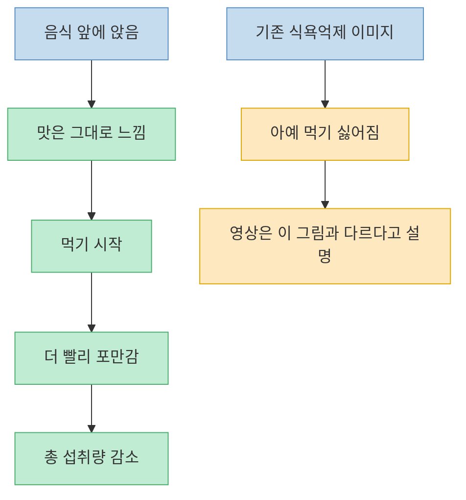
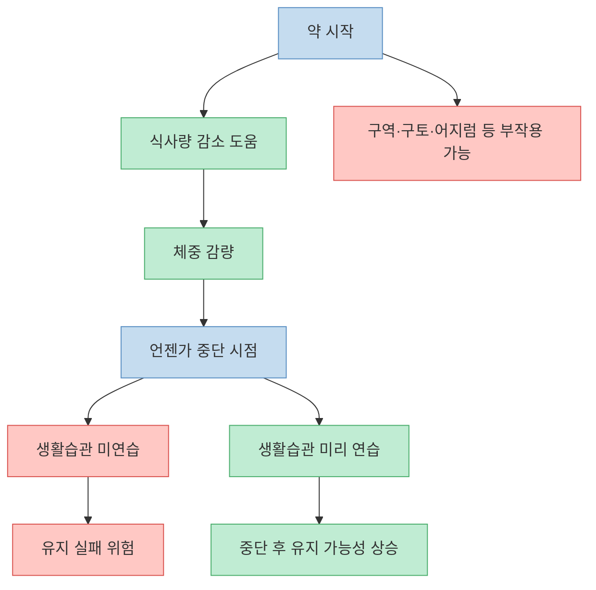
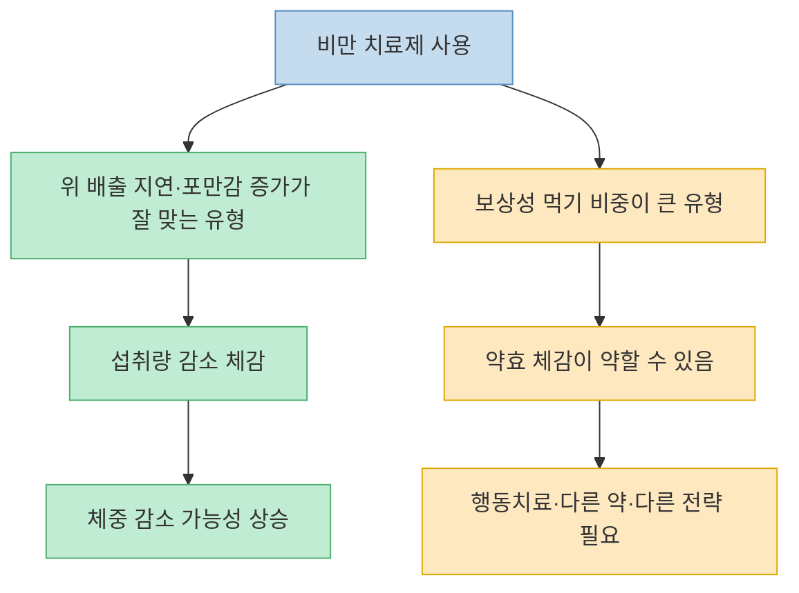
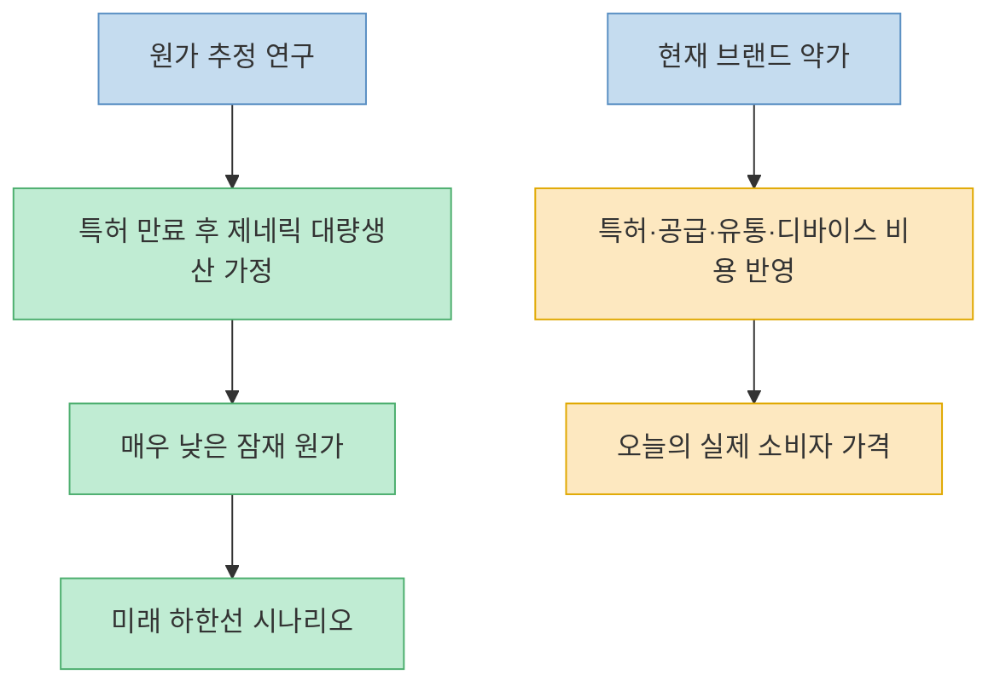
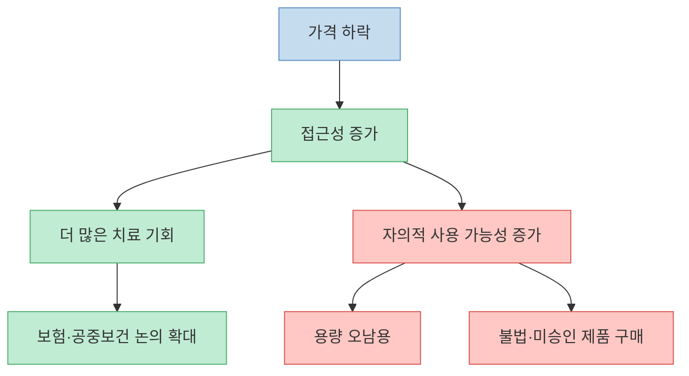
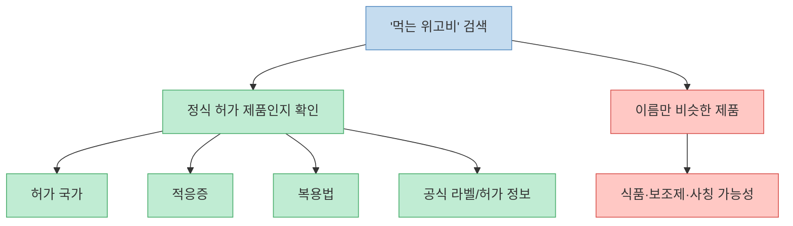

이 영상은 단순히 `비만주사가 잘 빠진다`는 수준에서 멈추지 않는다. 실제로 맞아 본 사람이 느낀 식욕 변화, 멀미 같은 부작용, 약을 끊은 뒤를 어떻게 준비해야 하는지, 그리고 결국 사람들의 눈길을 가장 강하게 끄는 `한 달 3천 원` 같은 가격 전망까지 한 번에 묶는다. 중요한 건 이 모든 이야기가 같은 층위가 아니라는 점이다. 어떤 부분은 실제 복용 경험이고, 어떤 부분은 현재 허가된 약의 공식 정보이며, 어떤 부분은 특허 만료 뒤 제네릭 생산원가를 추정한 연구 가설에 가깝다. 이 글은 그 층위를 나눠서 읽기 쉽게 정리해 보려는 시도다.

<!--more-->

## Sources

- [비만주사 한 달에 3천 원까지 내려갈 겁니다ㅣ정재훈 약사 2부ㅣ닥터딩요](https://www.youtube.com/watch?v=DPk4Td35eeg) — 닥터딩요
- [WEGOVY (semaglutide) injection, for subcutaneous use / tablets, for oral use — Prescribing Information](https://www.accessdata.fda.gov/drugsatfda_docs/label/2026/215256s033lbl.pdf) — FDA
- [FDA Approves First Treatment to Reduce Risk of Serious Heart Problems Specifically in Adults with Obesity or Overweight](https://www.fda.gov/news-events/press-announcements/fda-approves-first-treatment-reduce-risk-serious-heart-problems-specifically-adults-obesity-or) — FDA
- [FDA Launches Green List to Protect Americans from Illegal Imported GLP-1 Drug Ingredients](https://www.fda.gov/news-events/press-announcements/fda-launches-green-list-protect-americans-illegal-imported-glp-1-drug-ingredients) — FDA
- [RYBELSUS (semaglutide) tablets, for oral use — Prescribing Information](https://www.accessdata.fda.gov/drugsatfda_docs/label/2024/213051s023lbl.pdf) — FDA
- [How Low Could Semaglutide Prices Fall? An Analysis of Production Cost and Implications for Global Access Ahead of Patent Expiry](https://www.medrxiv.org/content/10.64898/2026.03.04.26347508) — medRxiv preprint

---

## 이 약이 `음식을 싫어지게` 만드는 게 아니라 `적게 먹어도 만족하게` 만든다는 설명

영상에서 가장 인상적인 대목은 경험담이다. 약을 맞아도 음식 맛이 갑자기 없어지거나 먹기 전부터 역겨워지는 건 아니고, **먹어 보면 여전히 맛있지만 조금만 먹어도 만족된다** 는 식으로 설명한다. 진행자와 약사는 이 차이를 기존 식욕억제제와 구분되는 포인트로 잡는다. 즉 무조건 식욕을 눌러 버리는 느낌보다는, 먹는 순간 더 빨리 `이 정도면 됐다`는 신호가 오는 쪽에 가깝다는 것이다. [(1:15)](https://youtu.be/DPk4Td35eeg?t=75), [(2:00)](https://youtu.be/DPk4Td35eeg?t=120), [(3:00)](https://youtu.be/DPk4Td35eeg?t=180)

이 설명은 공식 자료의 방향과도 맞닿아 있다. FDA의 Wegovy 처방정보는 이 약을 GLP-1 수용체 작용제로 설명하며, 체중 감량 목적에서는 언제나 `칼로리 제한 식이와 신체활동 증가`와 함께 쓰도록 한다. 즉 약이 모든 것을 대신해 주는 구조가 아니라, 더 적은 양으로도 계획을 지키기 쉽게 만들어 주는 보조 축으로 보는 편이 정확하다. [(WEGOVY label)](https://www.accessdata.fda.gov/drugsatfda_docs/label/2026/215256s033lbl.pdf)

---

## 부작용과 중단 문제: `맞는 동안`이 아니라 `끊은 뒤`를 같이 설계해야 한다

영상은 이 약을 마냥 낙관적으로만 보지 않는다. 경험담으로는 심한 멀미처럼 느껴지는 구역감, 어지럼, 구토 성향을 언급하고, 일주일짜리 주사제를 이미 맞은 뒤에는 중간에 바로 빼낼 수 없다는 현실적인 불편도 말한다. 이어서 훨씬 중요한 문제로 `언젠가는 끊는 시간이 온다`는 점을 강조한다. 그래서 약을 맞는 동안에만 살이 빠지는 것을 즐길 게 아니라, **끊고 난 뒤에도 유지할 식사량·식사 속도·생활 습관을 미리 연습해야 한다** 는 쪽으로 이야기가 이어진다. [(1:24)](https://youtu.be/DPk4Td35eeg?t=84), [(1:40)](https://youtu.be/DPk4Td35eeg?t=100), [(2:32)](https://youtu.be/DPk4Td35eeg?t=152), [(2:39)](https://youtu.be/DPk4Td35eeg?t=159)

공식 문서도 부작용 경고를 분명히 둔다. 현재 FDA 라벨에는 위장관 부작용, 탈수에 따른 급성 신손상, 췌장염, 담낭 질환, 갑상선 C세포 종양 관련 경고가 포함돼 있다. 특히 경구 Wegovy와 Rybelsus 모두 위장관 문제와 복용법 준수가 중요하게 적혀 있다. 따라서 영상의 핵심을 한 줄로 줄이면 `비만약은 의지가 약한 사람을 위한 지름길`이 아니라, **부작용을 감수할 가치가 있는지와 중단 후 계획까지 포함해 쓰는 치료** 에 가깝다. [WEGOVY label](https://www.accessdata.fda.gov/drugsatfda_docs/label/2026/215256s033lbl.pdf), [RYBELSUS label](https://www.accessdata.fda.gov/drugsatfda_docs/label/2024/213051s023lbl.pdf)

---

## 모두에게 똑같이 듣는 약은 아니라는 점도 영상은 꽤 분명하게 말한다

영상 중반부는 `마운자로를 맞고도 오히려 찌더라` 같은 반응을 왜 보게 되는지 다룬다. 여기서 제시되는 설명은 완전히 확정된 분류라기보다, 위 배출 지연과 포만감 증가가 잘 맞는 사람과, 보상성 먹기나 강한 보상회로 쪽이 더 큰 사람 사이에 차이가 있을 수 있다는 해석이다. 쉽게 말해 어떤 사람은 `배가 금방 찬다`가 핵심 문제였고, 다른 사람은 `배고파서가 아니라 기분 때문에 먹는다`가 더 큰 문제일 수 있다는 것이다. [(4:09)](https://youtu.be/DPk4Td35eeg?t=249), [(4:28)](https://youtu.be/DPk4Td35eeg?t=268), [(5:13)](https://youtu.be/DPk4Td35eeg?t=313)

이 대목이 중요한 이유는 약효가 약하다는 뜻이 아니라, 약의 작동 방식이 모든 과식을 동일하게 해결하지는 않는다는 뜻이기 때문이다. 영상은 이 부분을 `담배 끊는 약을 먹기 전에 본인이 끊겠다는 마음이 서 있는가`라는 비유로 설명한다. 다소 거친 비유이긴 하지만, 약 자체보다 행동 변화 준비도가 결과에 섞여 들어온다는 점을 강조하는 데는 효과적이다. 따라서 `이 약만 맞으면 무조건 빠진다`는 식의 기대는 영상의 본문과도 맞지 않는다. 오히려 **반응이 없는 10% 안팎의 사람도 있을 수 있고, 그 경우 다른 옵션이나 다른 접근이 필요하다** 는 쪽에 가깝다. [(5:03)](https://youtu.be/DPk4Td35eeg?t=303), [(5:20)](https://youtu.be/DPk4Td35eeg?t=320)

---

## `한 달 3천 원`은 현재 약값이 아니라, 특허 만료 뒤 생산원가가 어디까지 내려갈 수 있는지에 대한 추정이다

영상 제목의 핵심은 여기다. 중반부에서 약사는 중국·인도 등 일부 국가에서 특허 만료와 경쟁 압력 때문에 가격이 크게 흔들릴 수 있다고 말하고, 나아가 semaglutide 제네릭이 나오면 한 달 5달러, 심지어 연 25달러 같은 생산원가 추정까지 소개한다. 그래서 진행자가 `그럼 거의 3천 원대 아니냐`는 식으로 반응한다. [(6:21)](https://youtu.be/DPk4Td35eeg?t=381), [(7:03)](https://youtu.be/DPk4Td35eeg?t=423), [(8:11)](https://youtu.be/DPk4Td35eeg?t=491), [(8:20)](https://youtu.be/DPk4Td35eeg?t=500)

여기서 가장 중요한 정정 포인트가 있다. **이건 오늘 당장 약국에서 살 수 있는 실제 소매가가 아니라, 특허 만료 뒤 대량 제네릭 생산이 가능해졌을 때의 원가 기반 추정치** 에 가깝다. 영상이 언급한 숫자와 비슷한 방향의 분석은 2026년 medRxiv 프리프린트에도 나온다. 이 프리프린트는 2024~2025년 원료의약품 수출 데이터를 바탕으로, 주사형 semaglutide 제네릭이 연 28~140달러 수준에서도 가능할 수 있다고 추정했다. 하지만 이건 어디까지나 전제 조건이 붙은 생산비 분석이다. 특허, 펜 디바이스, 유통, 규제, 실제 처방 시장 구조까지 포함한 `당장 현실 가격`과는 다르다. [medRxiv preprint](https://www.medrxiv.org/content/10.64898/2026.03.04.26347508)

즉 2026년 5월 3일 기준으로 읽을 때 `3천 원`은 **현재가** 가 아니라 **잠재적 하한선 시나리오** 에 가깝다. 이 차이를 흐리면 영상이 더 과격하게 보이지만, 구분해서 읽으면 핵심은 오히려 타당하다. 장기적으로는 이 계열 약이 훨씬 싸질 가능성이 있고, 그렇게 되면 미용 목적 사용, 자의적 용량 조절, 보험 적용 범위 같은 새로운 문제가 더 커질 수 있다는 것이다. [(7:31)](https://youtu.be/DPk4Td35eeg?t=451), [(8:38)](https://youtu.be/DPk4Td35eeg?t=518)

---

## 가격이 내려갈수록 더 중요한 문제: 접근성 확대와 오남용 관리

영상은 가격 하락을 무조건 좋은 일로만 보지 않는다. 가격이 크게 내려가면 더 많은 사람이 접근할 수 있고, 심혈관 위험이나 대사 건강 개선 같은 적응증 확장도 논의될 수 있지만, 동시에 자가 판단 사용과 오남용 가능성도 커진다고 본다. 실제로 FDA는 2024년 Wegovy에 심혈관 사건 위험 감소 적응증을 추가 승인했고, 2025~2026년에는 승인되지 않은 GLP-1 제품·불법 원료·복합제(compounded products)에 대해 반복적으로 경고하고 있다. [FDA CV indication](https://www.fda.gov/news-events/press-announcements/fda-approves-first-treatment-reduce-risk-serious-heart-problems-specifically-adults-obesity-or), [FDA Green List](https://www.fda.gov/news-events/press-announcements/fda-launches-green-list-protect-americans-illegal-imported-glp-1-drug-ingredients)

이건 중요한 전환점이다. 예전에는 `너무 비싸서 못 쓴다`가 주된 문제였다면, 앞으로는 `너무 쉬워져서 아무나 함부로 쓴다`가 더 큰 문제가 될 수 있다. 영상이 `미용 목적으로 쓰는 사람`, `자기 마음대로 용량을 조정하는 사람`, `보험 적용을 둘러싼 새로운 갈등`을 걱정하는 이유도 이 구조 때문이다. 접근성이 높아지는 것과 치료가 더 안전해지는 것은 같은 말이 아니다.

---

## `먹는 위고비`는 실제 허가 제품과 인터넷 검색어를 반드시 구분해서 봐야 한다

영상 후반의 경고도 중요하다. 영상은 `먹는 위고비`라는 검색어로 나오는 제품을 대체로 신뢰하지 말라고 말한다. 이건 과장이라기보다, **정식 허가 제품과 이름만 빌린 유사 제품을 구분하라** 는 뜻으로 읽는 편이 정확하다. 2026년 5월 3일 기준 미국 FDA의 공식 라벨에는 이미 `Wegovy tablets`가 포함되어 있고, Rybelsus는 오래전부터 경구 semaglutide로서 2형 당뇨병 적응증을 갖고 있다. 하지만 경구 semaglutide가 존재한다는 사실과, 지금 인터넷에서 파는 `먹는 위고비`가 모두 진짜라는 뜻은 전혀 다르다. [WEGOVY label](https://www.accessdata.fda.gov/drugsatfda_docs/label/2026/215256s033lbl.pdf), [RYBELSUS label](https://www.accessdata.fda.gov/drugsatfda_docs/label/2024/213051s023lbl.pdf)

특히 Rybelsus는 복용법 자체도 까다롭다. 공복에 일어나서 물 소량으로 먹고, 최소 30분은 다른 음식·음료·경구약을 피해야 흡수 문제가 줄어든다. 경구형 GLP-1은 `주사 대신 아무 알약이나`가 아니라, **허가 여부와 정확한 복용법이 성패를 크게 좌우하는 전문 약물** 이다. 그래서 영상의 거친 표현을 순화하면 이렇게 된다. `먹는 위고비`라는 말 자체보다, **그 제품이 어느 나라에서 어떤 적응증으로 정식 허가를 받았는지부터 확인하라** 는 것이다. [RYBELSUS label](https://www.accessdata.fda.gov/drugsatfda_docs/label/2024/213051s023lbl.pdf)

---

## 핵심 요약

- 영상은 GLP-1 비만 치료제가 `음식을 못 먹게` 하기보다 `적게 먹어도 만족되게` 만드는 경험을 강조한다. [(1:15)](https://youtu.be/DPk4Td35eeg?t=75), [(3:00)](https://youtu.be/DPk4Td35eeg?t=180)
- 하지만 부작용과 중단 후 유지 문제 때문에, 맞는 동안의 감량만이 아니라 끊은 뒤 습관까지 같이 설계해야 한다고 본다. [(1:24)](https://youtu.be/DPk4Td35eeg?t=84), [(2:32)](https://youtu.be/DPk4Td35eeg?t=152)
- 약효가 약한 사람도 있고, 보상성 먹기 비중이 큰 경우엔 반응이 덜할 수 있다는 해석도 제시한다. [(4:09)](https://youtu.be/DPk4Td35eeg?t=249), [(5:20)](https://youtu.be/DPk4Td35eeg?t=320)
- `한 달 3천 원`은 현재 시판 가격이 아니라, 특허 만료 뒤 제네릭 대량 생산이 가능해졌을 때의 낮은 생산원가 시나리오에 가깝다. [(8:11)](https://youtu.be/DPk4Td35eeg?t=491), [medRxiv preprint](https://www.medrxiv.org/content/10.64898/2026.03.04.26347508)
- 2026년 5월 3일 기준 공식 FDA 라벨에는 경구 Wegovy와 Rybelsus가 존재하지만, 인터넷의 `먹는 위고비` 검색 결과를 곧바로 정식 의약품으로 믿으면 안 된다. [WEGOVY label](https://www.accessdata.fda.gov/drugsatfda_docs/label/2026/215256s033lbl.pdf), [RYBELSUS label](https://www.accessdata.fda.gov/drugsatfda_docs/label/2024/213051s023lbl.pdf)

---

## 결론

이 영상이 흥미로운 이유는 `비만주사가 싸질 것이다`라는 자극적인 문장보다, 그 뒤에 따라오는 질문을 함께 던지기 때문이다. 약이 더 싸지고 더 흔해지면 정말 모두에게 좋은 일일까, 아니면 그때부터는 오히려 관리와 구분이 더 중요해질까. [(7:31)](https://youtu.be/DPk4Td35eeg?t=451), [(8:53)](https://youtu.be/DPk4Td35eeg?t=533)

지금 단계에서 가장 안전한 정리는 이렇다. GLP-1 계열 비만 치료제는 분명 강력한 도구지만, `마법`, `현재가 3천 원`, `인터넷에서 파는 먹는 위고비도 다 비슷한 것` 같은 식으로 읽는 순간 오해가 커진다. 효과, 부작용, 중단 계획, 허가 여부, 가격의 층위를 나눠 보는 것이 결국 가장 현실적인 읽기다.
