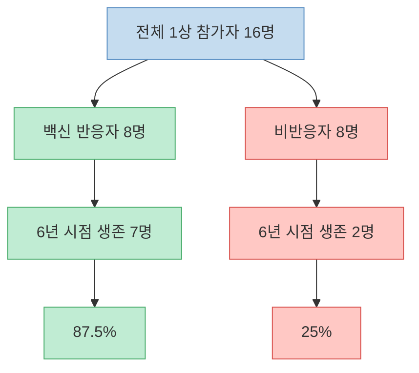
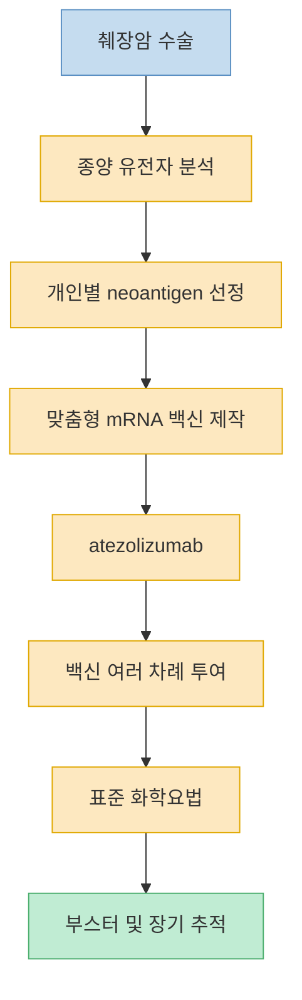
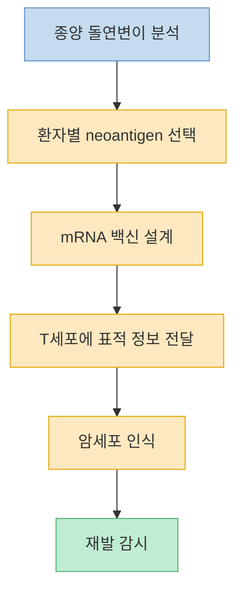
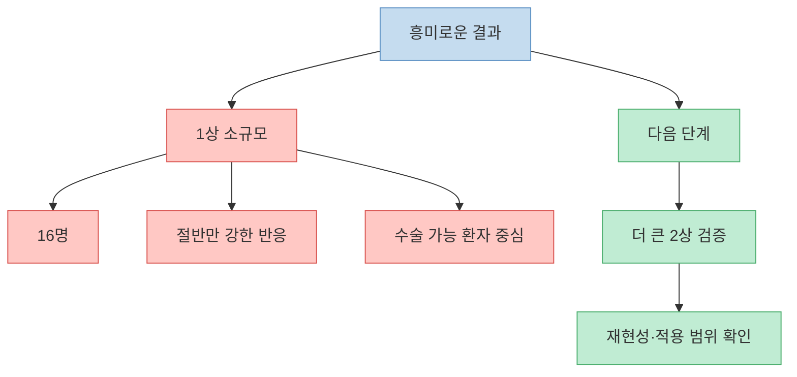
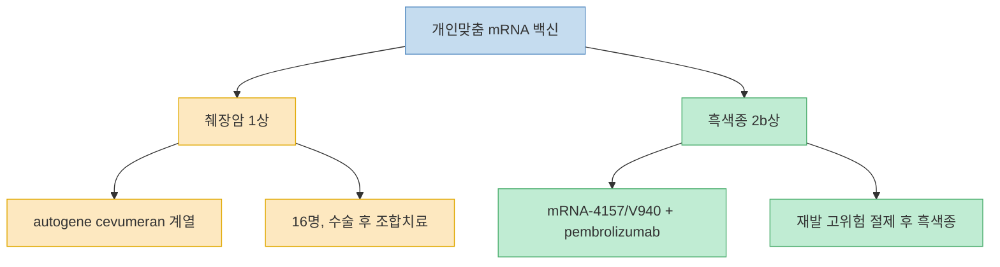

이 영상은 매우 강한 제목을 쓴다. `암세포가 전멸했다`, `주사 한 방에 87.5%가 6년 생존했다`, `의학계 상식이 박살났다` 같은 문장은 누구라도 클릭하게 만든다. 하지만 실제 연구를 보면 이야기는 훨씬 더 섬세하다. 맞춤형 mRNA 백신이 췌장암 재발을 막는 데 정말 중요한 신호를 보인 것은 맞지만, 그것은 **아주 작은 1상 임상**, **수술 가능한 환자**, **수술 후 면역항암제와 화학요법까지 함께 받은 조합 치료**, **그중에서도 면역 반응이 생긴 절반 정도의 환자** 에서 나온 결과다. 이 글은 그 숫자를 부풀리지도, 반대로 의미를 깎아내리지도 않고 정확한 위치에 놓아 보려는 시도다.

<!--more-->

## Sources

- ["암세포가 전멸했습니다" 주사 한방에 87.5% 6년 생존, 의학계 상식 박살났다 ㄷㄷ](https://www.youtube.com/watch?v=cbTXVxKCFJc) — 에스오디 SOD
- [MSK AACR 2026 Research Roundup: Highlights of Advances in Oncology Research](https://www.mskcc.org/clinical-updates/msk-aacr-2026-research-roundup-highlights-of-advances-in-oncology-research) — Memorial Sloan Kettering Cancer Center
- [An mRNA vaccine to treat pancreatic cancer](https://www.nih.gov/news-events/nih-research-matters/mrna-vaccine-treat-pancreatic-cancer) — NIH
- [Pancreatic Cancer — Cancer Stat Facts](https://seer.cancer.gov/statfacts/html/pancreas.html) — NCI SEER
- [A Phase 2 Study of an mRNA Vaccine plus Immunotherapy and Chemotherapy Versus Chemotherapy Alone for People with Operable Pancreatic Cancer](https://www.mskcc.org/cancer-care/clinical-trials/23-136) — Memorial Sloan Kettering Cancer Center
- [Individualised neoantigen therapy mRNA-4157 (V940) plus pembrolizumab versus pembrolizumab monotherapy in resected melanoma (KEYNOTE-942): a randomised, phase 2b study](https://www.sciencedirect.com/science/article/pii/S0140673623022687) — The Lancet

---

## 먼저 숫자부터 바로잡기: `87.5%`는 전체 췌장암 환자가 아니라 `백신 반응자 8명 중 7명`이다

영상 초반은 `5년 생존 13%에 불과한 췌장암에서 87.5%가 6년째 살아 있다`는 대비를 강하게 밀어붙인다. 숫자 자체는 완전히 엉터리는 아니지만, 생략된 조건이 많다. MSK가 2026년 AACR에서 공개한 장기 추적 결과에 따르면, personalized RNA neoantigen vaccine을 받은 췌장암 환자 16명 중 절반인 8명만 강한 백신 유도 면역반응을 보였고, 그 **반응자 8명 중 7명** 이 6년 시점에 생존해 있었다. 그래서 87.5%라는 비율이 나온다. 비반응자 그룹은 8명 중 2명만 생존했다. [(0:39)](https://youtu.be/cbTXVxKCFJc?t=39), [(1:23)](https://youtu.be/cbTXVxKCFJc?t=83)

즉 이 숫자는 `모든 췌장암 환자 87.5% 생존`도 아니고, `백신만 맞으면 87.5% 생존`도 아니다. **수술 가능한 췌장암 환자들 중에서, 맞춤형 백신과 병합치료를 받고, 실제로 T세포 면역반응이 유도된 소수의 하위집단에서 나온 장기 추적 결과** 다. 그래서 이 결과는 엄청 고무적이지만, 동시에 엄청 조심스럽게 읽어야 한다. [MSK AACR 2026](https://www.mskcc.org/clinical-updates/msk-aacr-2026-research-roundup-highlights-of-advances-in-oncology-research), [NCI SEER](https://seer.cancer.gov/statfacts/html/pancreas.html)

---

## `주사 한 방`도 아니다: 실제로는 수술 뒤 면역항암제, 맞춤형 백신, 화학요법이 함께 들어간 조합 치료였다

영상 제목은 마치 어떤 혁신적 주사 한 번으로 암세포가 정리된 것처럼 들리지만, NIH가 정리한 2023년 1상 연구 구조는 훨씬 복합적이다. 먼저 환자는 췌장암 수술을 받았다. 이후 종양 샘플을 유전자 분석해 개인별 neoantigen을 뽑았고, 그 정보를 바탕으로 BioNTech가 맞춤형 mRNA 백신을 만들었다. 그 과정은 평균 약 9주가 걸렸다. 환자들은 백신 전에 atezolizumab을 맞았고, 이후 여러 차례의 백신 접종을 받으면서 표준 화학요법까지 이어갔다. [(0:57)](https://youtu.be/cbTXVxKCFJc?t=57), [(1:05)](https://youtu.be/cbTXVxKCFJc?t=65)

이 점이 핵심이다. 이 연구는 `백신 단독의 즉효성`을 보여 준 것이 아니라, **수술 후 남아 있을지 모르는 미세 잔존암을 면역계가 오래 기억하고 감시하게 만들 수 있는가** 를 본 것이다. NIH 설명에서도 19명 중 18명에게 맞춤형 백신 제작이 가능했고, 그중 16명이 일정량 이상의 백신을 받았으며, 절반에서 강한 T세포 반응이 관찰됐다고 정리한다. [NIH](https://www.nih.gov/news-events/nih-research-matters/mrna-vaccine-treat-pancreatic-cancer)

---

## 이 치료가 흥미로운 이유: 암세포를 직접 태우는 대신 `면역계가 그 암을 기억하게` 만든다

영상이 잘 짚은 부분도 있다. 기존 항암치료의 중심축이 수술, 화학요법, 방사선처럼 외부에서 암을 줄이는 방식이었다면, 이 백신은 `우리 몸 T세포가 저 암을 적으로 인식하게 만들 수 있느냐`를 건드린다. 췌장암은 돌연변이가 많지 않고 면역치료에 잘 안 듣는 대표적 암종이라서, 원래는 이런 접근이 특히 어려운 편이었다. 그런데 연구팀은 환자별 종양 돌연변이에서 면역계가 볼 수 있는 neoantigen을 골라서, 그 사람만을 위한 백신을 만들었다. [(2:33)](https://youtu.be/cbTXVxKCFJc?t=153), [(3:29)](https://youtu.be/cbTXVxKCFJc?t=209), [(4:35)](https://youtu.be/cbTXVxKCFJc?t=275)

NIH는 이 연구에서 백신에 반응한 환자들의 혈액에서, 백신 전에는 보이지 않던 강한 neoantigen 특이적 T세포가 나타났다고 설명한다. 2026년 MSK 후속 발표는 이 반응이 단기 번쩍이 아니라, 수년 동안 지속되는 장기 면역기억과 연결될 가능성을 보여 줬다. 그래서 이 연구의 진짜 의미는 `암세포 전멸`보다 **췌장암에서도 개인맞춤 백신이 장기적인 면역기억을 만들 수 있다는 첫 임상적 힌트** 에 있다. [NIH](https://www.nih.gov/news-events/nih-research-matters/mrna-vaccine-treat-pancreatic-cancer), [MSK AACR 2026](https://www.mskcc.org/clinical-updates/msk-aacr-2026-research-roundup-highlights-of-advances-in-oncology-research)

---

## 그래서 아직 `완치`가 아니라 `강력한 초기 신호`로 읽어야 한다

이 연구는 1상이다. 표본은 16명이고, 그중 절반만 강한 면역반응을 보였다. 게다가 대상자는 대부분 수술이 가능한 췌장관선암 환자들이었다. 즉 이미 전이가 광범위해 수술이 어려운 환자, 수술 전 단계 환자, 더 다양한 생물학적 특징을 가진 환자들에게 같은 결과가 재현될지는 아직 모른다. MSK도 그래서 현재 다기관 2상 시험을 진행 중이라고 분명히 적고 있다. [(1:23)](https://youtu.be/cbTXVxKCFJc?t=83)

또 하나의 현실적 한계는 제작 시간이다. NIH 설명에 따르면 수술부터 첫 백신 투여까지 평균 약 9주가 걸렸다. 고도로 개인맞춤형이라는 장점의 반대편에는 시간과 공정 복잡성이 있다. 그래서 이 치료는 `당장 누구나 맞을 수 있는 상용 백신`이 아니라, **정교하지만 아직 느리고 비싼 맞춤형 플랫폼** 에 가깝다. 이 점 때문에 영상의 `의학계 상식 박살` 같은 표현은 연구의 방향성은 잡았지만 단계는 과장한다. [NIH](https://www.nih.gov/news-events/nih-research-matters/mrna-vaccine-treat-pancreatic-cancer), [MSK phase 2 trial](https://www.mskcc.org/cancer-care/clinical-trials/23-136)

---

## 영상 후반에 나온 `mRNA-4157/V940 + 키트루다`는 다른 암종 이야기다

영상 후반은 또 다른 개인맞춤 mRNA 백신 플랫폼인 `mRNA-4157 (V940)`과 키트루다 병용 데이터를 끌어온다. 여기서 말하는 `재발 및 사망 위험 49% 감소`, `원격 전이 62% 감소`는 췌장암 1상 데이터가 아니라, **고위험 절제 후 흑색종** 을 대상으로 한 KEYNOTE-942라는 다른 2b상 임상 이야기다. 즉 `개인맞춤 mRNA 백신 플랫폼이 다른 암에서도 신호를 보이고 있다`는 맥락에서는 의미가 있지만, 이 숫자를 췌장암 백신 성과와 그대로 이어 붙이면 독자가 같은 연구로 오해하기 쉽다. [(3:59)](https://youtu.be/cbTXVxKCFJc?t=239), [(4:08)](https://youtu.be/cbTXVxKCFJc?t=248)

이 구분은 중요하다. 췌장암 personalized RNA vaccine은 `autogene cevumeran` 계열의 췌장암 연구이고, V940/KEYNOTE-942는 `절제 후 흑색종` 연구다. 둘 다 개인맞춤 neoantigen 백신이라는 큰 줄기는 공유하지만, 암종도 다르고 단계도 다르고 병용 약물과 임상 설계도 다르다. 그래서 `mRNA 백신 플랫폼 전체가 가능성을 보인다`는 결론은 가능하지만, `췌장암에서도 이미 49% 감소가 확인됐다`는 식으로 읽으면 안 된다. [The Lancet KEYNOTE-942](https://www.sciencedirect.com/science/article/pii/S0140673623022687)

---

## 핵심 요약

- 영상의 `87.5%`는 전체 췌장암 환자 생존율이 아니라, 백신 반응자 8명 중 7명이 6년 시점에 생존한 결과다. [(0:39)](https://youtu.be/cbTXVxKCFJc?t=39), [MSK AACR 2026](https://www.mskcc.org/clinical-updates/msk-aacr-2026-research-roundup-highlights-of-advances-in-oncology-research)
- 이 연구는 `주사 한 방`이 아니라 수술 후 면역항암제, 맞춤형 mRNA 백신, 화학요법을 묶은 조합 치료였다. [NIH](https://www.nih.gov/news-events/nih-research-matters/mrna-vaccine-treat-pancreatic-cancer)
- 가장 큰 의미는 췌장암처럼 면역치료가 어려운 암에서도 개인맞춤 neoantigen 백신이 장기 T세포 면역기억을 만들 수 있다는 첫 임상 신호에 있다.
- 하지만 아직 1상 소규모 연구이고, 절반은 강한 면역반응을 보이지 않았으며, 수술 가능한 환자 중심이어서 일반화는 이르다.
- 영상 후반의 `V940 + 키트루다 49% 감소`는 췌장암이 아니라 절제 후 흑색종의 다른 임상이다. [The Lancet KEYNOTE-942](https://www.sciencedirect.com/science/article/pii/S0140673623022687)

---

## 결론

이 영상이 말하는 방향성 자체는 틀리지 않는다. 개인맞춤 mRNA 백신은 췌장암처럼 어려운 암에서도 실제로 희망의 신호를 보여 주고 있다. 다만 그 희망은 `암세포 전멸`, `주사 한 방`, `이미 완치 시대` 같은 문장으로 소비될 때 가장 쉽게 왜곡된다. [(0:39)](https://youtu.be/cbTXVxKCFJc?t=39), [(4:58)](https://youtu.be/cbTXVxKCFJc?t=298)

지금 가장 정확한 정리는 이렇다. **췌장암 personalized mRNA 백신은 아직 초기지만, 정말로 무시하기 어려운 장기 생존 신호를 보였다.** 그래서 과소평가할 필요도 없고, 이미 검증이 끝난 표준치료처럼 과대평가할 필요도 없다. 이 두 극단 사이가 지금 이 연구의 정확한 자리다.
